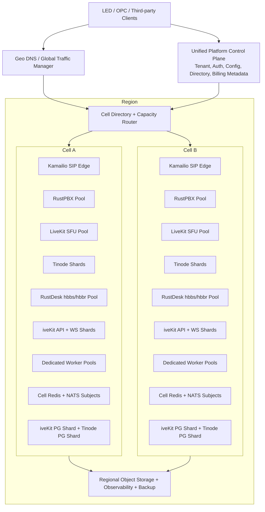

# CCaaS 十万并发容量对标与 iveKit 架构优化调研

> 日期：2026-07-16
> 状态：架构评审有条件通过，实施前设计合同已补齐；所有容量仍为 target/not_run
> 目标：优先榨取单节点 safe capacity、保持新增节点/Cell 的边际容量近似恒定，并证明一套统一平台可横向扩展到 100,000 并发通信
> 范围：iveKit 共用通信底座，包括 RustPBX/SIP/IVR、LiveKit 音视频与屏幕共享、Tinode IM、RustDesk 远程协助、iveKit API/事件/数据/异步 Provider 任务
> 不在本文范围：LED 业务领域、OPC 上层业务、移动端功能、具体商业授权、尚未选定的 OCR/ASR/翻译供应商效果

> 评审更新：本方案已经完成架构评审并获得“有条件通过”。`MIX-100K` 互斥计数、第三仲裁故障域、Cell/data-shard 解耦、录制策略、开源 fork 权限、单节点密度与边际扩展合同以 `docs/MIX-100K双Zone与Cell架构评审.md` 和 `docs/capacity/` 为准。

---

## 1. 执行摘要

### 1.1 核心结论

1. **目标定义正确，但不能用一个模糊的“10 万连接”验收。** 本项目要实现的是一套统一租户、统一控制面、统一 API/SDK/事件和统一运维体系的平台，内部允许有多个 Cell 和多个同类节点。增加节点后容量应接近线性增长，不允许通过部署多个彼此独立的平台实例来凑数。
2. **Genesys Cloud、Five9、Zoom Contact Center 没有公开可验证的单媒体节点容量。** 它们公开的是自动扩缩容机制、区域/可用区架构、租户案例或整个平台规模。把这些数字直接写成“单 Cell”或“单节点”容量属于推测。
3. **当前可核实的企业级单节点参考主要来自 Avaya 和开源项目自身基准。** Avaya Aura Media Server 的硬上限为 4,000 media sessions；Avaya 高容量 SBC 可到 20,000 encrypted sessions，但转码仅 1,000 sessions，而且各项最大值不能叠加使用。RustPBX 当前官方 README 的 2026-04 基准在 16 核、本机回环、G.711 条件下实测到 800 个 RTP 代理呼叫，峰值 CPU 约 155%；README 另行估算 5,000 个 RTP 呼叫约消耗 958% CPU，但这只是模型外推，不是 5,000 实测，更不是生产网络、SRTP、完整录音和故障场景的证明。
4. **“单节点强”和“横向边际不显著衰减”优先于 100K 总数。** 同时记录 hard capacity 与保留 headroom/故障余量后的 safe capacity；每新增一个同构节点或 Cell，都必须贡献接近首节点/首 Cell 的容量。100K 是扩展曲线的端点验证，不是现实部署的默认预分配规模。Zoom 官方架构明确说明每个 SIP Zone 正常运行时力求不超过 50% 容量，用另一 Zone 吸收故障流量。
5. **当前 iveKit 功能底座具备横向扩展的必要前提，但还不是 10 万并发架构。** 无状态 API、PostgreSQL durable job、lease/fencing、幂等事件、Redis 多实例广播、外置 Provider 和独立 SDK 都可以保留。当前 bundled PostgreSQL/Redis/NATS/LiveKit/Tinode 单副本、RustPBX 普通 Kubernetes Service 暴露 SIP/RTP、同步 HTTP Router 热路径和较小 RTP 端口范围必须调整。
6. **推荐采用“统一平台 + Region + Cell”的架构。** 全局/区域控制面只负责租户、配置、目录和调度；每个 Cell 独立承载实时热路径。租户或会话稳定归属一个 Cell，新的 Cell 可以在线加入。Cell 内分别扩展 SIP Edge、RustPBX、LiveKit、Tinode、RustDesk Relay、iveKit API/WS 和 worker。
7. **不建议现在直接投入 DPDK 或自研内核旁路。** 先验证 RustPBX 原生 RTP 数据面。建议把 Kamailio 作为 SIP Edge 引入，但继续让 RustPBX负责 B2BUA、IVR、ACD 和媒体；如果完整生产负载下 RustPBX 达不到单节点目标，再对比引入 rtpengine 的收益。这样能避免为了理论密度提前增加一套复杂媒体栈。
8. **100,000 纯语音呼叫和 100,000 混合通信是两个完全不同的工程目标。** 本文同时定义 `VOICE-100K` 极限场景和 `MIX-100K` 产品场景。第一版商业级验收建议以 `MIX-100K` 为平台目标，同时对每个数据面做独立压力测试，防止总数达标但某一通道先失效。

### 1.2 推荐决策

采用本文的 **方案 B：Cell 化、信令与媒体职责分离、数据按 Cell/租户分片**，并按以下顺序推进：

1. 先建设可重复的单节点基准和容量证据包。
2. 引入 SIP Edge、会话归属、容量调度和无数据库热路径。
3. 把 bundled 单副本组件全部替换为 external/clustered 生产部署。
4. 先完成每个角色的单节点 hard/safe frontier 和 1/2/4/8 节点边际曲线，再合成 10,000 并发 Cell。
5. 继续优化 Cell safe density，评估 Cell-25K，以更少服务器到达 100K。
6. 最后完成 `MIX-100K`、`VOICE-100K`、节点故障和可用区故障验收；不以牺牲故障余量换取宣传数字。

---

## 2. 调研方法与证据等级

本文只把官方产品文档、厂商官方案例和开源项目官方仓库作为容量事实来源。论坛经验和二手文章不用于得出硬性结论。

| 等级 | 含义 | 可用于什么 | 示例 |
| --- | --- | --- | --- |
| A | 官方容量规格或可复现官方基准 | 可作为直接对标基线 | Avaya session limit、LiveKit benchmark、RustPBX benchmark |
| B | 厂商官方架构说明或官方客户案例 | 可证明平台级能力或设计原则，不能推出单节点容量 | Five9 30,000 并发热线、Zoom 双 SIP Zone、Genesys ASG |
| C | 官方代码仓库声明但缺少完整生产条件 | 可制定验证目标，不能直接承诺生产容量 | Tinode sharded clustering、RustPBX 线性外推 |
| D | 本文工程目标或容量假设 | 只能作为待验证 benchmark target | Tinode 50k WS/node、LiveKit 1,000 个 1:1 房间/node |

文中所有重要数字均应能归入上述一种等级。没有等级的数字不能进入产品规格或对外材料。

---

## 3. “单套平台横向扩展到 10 万”的准确含义

### 3.1 单套平台

满足以下条件才算一套平台：

- 一个租户和身份体系。
- 一套公开 API、SDK、事件和 Webhook 合同。
- 一个统一控制面可以看到所有 Region、Cell、节点和容量。
- 租户、会话、录音、文件、审计和 Provider 配置使用统一资源 ID。
- 新增 Cell 不需要客户修改 SDK 或重新创建租户。
- 一个 Cell 故障时，平台可以把新会话导向其他 Cell；已有会话按协议能力恢复或明确失败。
- 计量、告警、审计、备份和发布版本仍是统一的。

以下方式不算一套平台：

- 部署十套互不相通的 iveKit，每套承载 10,000。
- 每个客户单独部署完整 PostgreSQL、Redis、Tinode、LiveKit 和 RustPBX 后汇总宣传。
- 只统计空闲 WebSocket，不统计消息、媒体、数据库和故障余量。
- 在 95% CPU 下短时达到 100,000，节点故障后立即过载。

### 3.2 横向扩展

横向扩展必须同时满足聚合线性度和区段边际效率：

```text
L(n) = C_safe(n) / (n * C_safe(1))
M(a,b) = (C_safe(b) - C_safe(a)) / ((b - a) * C_safe(1))
```

component node pool 建议门槛：

| 规模 | 最低线性度 |
| --- | ---: |
| 2 节点 | 95% |
| 4 节点 | 93% |
| 8 节点 | 91% |

每个扩容区段 `M >=90%`，相邻区段下降不超过 3 个百分点。增加 Cell 和 shared-data Cell-equivalent load 时，`M >=95%`，相邻区段下降不超过 2 个百分点。

曲线下降必须能归因到明确资源，例如数据库写入、Redis fanout、NIC PPS、负载均衡连接表或对象存储，并先分片、移出热路径或修改源码，不能用继续堆节点掩盖。

### 3.3 单节点强

单节点容量采用“满足 SLO 的可接纳容量”，不是进程尚未崩溃时的最高数字。默认要求：

- CPU 持续不超过 60% 至 65%。
- 内存不发生 swap，GC/allocator 无周期性长暂停。
- NIC 持续吞吐不超过可用吞吐的 50% 至 60%。
- 丢包、错误率和 P99 延迟满足对应数据面 SLO。
- 保留节点故障、突发和流量倾斜余量。

---

## 4. 商业平台公开证据对标

### 4.1 对标矩阵

| 平台 | 官方公开证据 | 能得出的结论 | 不能得出的结论 | 等级 |
| --- | --- | --- | --- | --- |
| Genesys Cloud | Cloud Media 以 session 数和 intensity 衡量容量，使用 ELB 和 Auto Scaling Group；一次 call 可包含 agent、IVR、external participant、monitor、barge-in、consultant 等多个 session | 商业平台按会话强度扩容，不按简单 call 数；需要预热和容量调度 | 单媒体节点、单 Cell 或单 Region 的确切 calls/CPS | B |
| Genesys Cloud | 混合媒体切换时，若 10 分钟内切入 400+ concurrent calls，官方建议提前申请 pre-scale，否则自动扩容追赶期间可能掉话 | 仅靠实时 HPA 不足以处理确定性大突发；需要预扩容 | 400 是节点容量或平台上限 | B |
| Five9 | 2020 年官方案例称某热线在 48 小时内配置为可处理 30,000 concurrent inbound calls | Five9 已公开证明一个具体部署场景达到 30,000 并发呼入 | 30,000 在一台服务器、一个 Cell 或一个数据中心上完成 | B |
| Zoom Contact Center | 每个数据中心有两个相互连接的 SIP Zone；Zone 内有 call switch 和 SBC 集群；正常运行时每 Zone 力求不超过 50% 容量 | 商业级容量必须包含完整 Zone 故障余量；信令、SBC 和媒体分层 | 单节点 SFU、SBC 或 call switch 容量 | B |
| Avaya Aura Media Server | 容量 Profile 最高 5,000 sessions，但 media session hard limit 仍是 4,000；5,000 包含 control channels | 4,000 media sessions/node 是可信企业级参考，但 session 不是统一的 RTP leg | 所有 4,000 session 都能同时执行转码、会议或录音 | A |
| Avaya Aura Media Server | 高容量服务器可持续 225 session requests/s；4,000 session、2 分钟平均保持时长时约 33 requests/s 即可占满并发 | CPS 必须和平均保持时长一起建模 | “3,000 CPS/node”天然优于 Avaya | A |
| Avaya SBC | 高容量规格最高 25,000 non-encrypted sessions、20,000 encrypted sessions、1,000 transcoding、10,000 audio TURN/STUN；各项最大值不能组合 | 专用 relay/SBC 的直通容量可以远高于转码容量；功能权重必须分开 | 20,000 encrypted sessions 等于 20,000 双腿呼叫并且还能同时转码/录音 | A |

### 4.2 对原调研中商业平台数字的校正

#### Genesys Cloud

原文估计的以下数字没有官方公开依据：

```text
Active calls: 10,000 - 50,000 / Cell
Media sessions: 30,000 - 150,000 / Cell
RTP legs: 50,000 - 300,000 / Cell
CPS steady: 500 - 2,000
CPS burst: 5,000+
```

这些数字可以作为内部假设，但不能写成“Genesys 级别事实”。真正可借鉴的是：

- session/intensity 容量模型。
- 自动扩缩容与 on-demand capacity。
- 大突发前预扩容。
- 多参与人导致 session 数大于 call 数。

#### Five9

`30,000 concurrent inbound calls` 是 Five9 官方案例，引用应指向 Five9 官方新闻稿，不应引用 Avaya 文档。该案例证明的是一个热线部署能力，不是单节点能力。

#### Zoom Contact Center

Zoom 没有公开 Contact Center 单 SFU 节点的 publishers/subscribers 数。原文的 `500 publishers / 5,000 subscribers` 没有官方证据，而且不能与 LiveKit 的单房间数据直接比较。Zoom 最值得对标的是：

- 双 SIP Zone active-active。
- Zone 内信令和 SBC 集群。
- 正常负载不超过每 Zone 50%。
- 数据中心级故障时允许短暂收敛和重新注册，不隐瞒故障边界。

#### Avaya

`4,000 media sessions/node` 基本正确，但必须补充：

- 5,000 Profile 是包括控制通道的硬限制，media session 仍是 4,000。
- Profile 上限不等于复杂媒体处理能力。
- 1,000 转码 session 与 20,000 encrypted SBC session 是完全不同的负载。
- 录音流会额外消耗 session，不能只按双腿呼叫计算。

### 4.3 商业平台真正应对标的指标

“超过 Genesys/Five9”不能只靠一个并发数字证明。应使用以下矩阵：

| 维度 | 对标指标 |
| --- | --- |
| 密度 | calls/core、RTP packet ops/core、WS connections/GB、SFU egress Gbps/node |
| 规模 | 单节点、单 Cell、单 Region、单平台最大并发 |
| 质量 | 建链成功率、P95/P99、丢包、抖动、恢复时间 |
| 可靠性 | 节点故障、Zone 故障、数据库切主、Redis/NATS 故障 |
| 弹性 | 冷启动时间、预热时间、扩容后可接纳流量时间、缩容 drain 时间 |
| 多租户 | 热租户隔离、配额、噪声邻居、RLS/ACL 正确性 |
| 成本 | 每 1,000 并发每小时成本、带宽成本、录音和 Egress 成本 |
| 运维 | 发布时中断数、回滚时间、证据完整性、容量预测误差 |

---

## 5. 开源底座的可核实基线

### 5.1 RustPBX

RustPBX 官方仓库当前可核实的基准标注日期为 2026-04-03，环境为：

- RustPBX 0.4.0 release。
- 16 cores，32 GB；README 未给出具体 CPU 型号。
- Linux x86_64。
- G.711 PCMU。
- P2P 扩展呼叫，RTP 代理。
- 本机 loopback 负载生成。

官方表中实测关键结果：

| 场景 | 目标总呼叫 | 峰值并发 | 峰值 CPU | 峰值内存 | 丢包 |
| --- | ---: | ---: | ---: | ---: | ---: |
| signaling only | 800 | 800 | 47.9% | 191.8 MB | 0% |
| RTP proxy | 800 | 800 | 155.0% | 264.8 MB | 0% |
| RTP proxy + sipflow | 800 | 800 | 156.0% | 280.3 MB | 0% |

同一 README 的资源模型估算 `5,000` 个 RTP forwarding 呼叫约为 `958% CPU` 和 `1,230 MB` 内存。Linux 进程 CPU 的 `958%` 约表示 9.58 个逻辑核忙碌；该值是由 500/800 级别样本外推的模型，不是 5,000 呼叫实测结果。对本项目的意义是：

1. RustPBX 原生数据面值得先保留和实测，不应未经验证立即替换。
2. “32 核 8,000 双腿 G.711 calls”可以作为首轮目标，但现有官方实测不能证明该目标已经达到。
3. 生产验收必须补齐真实网卡、跨主机 UAC/UAS、TLS/SRTP、外部 PostgreSQL、HTTP Router、录音对象存储、RWI、IVR、长稳和节点故障。
4. `sipflow` 基准不应被直接理解为完整生产录音、转码、上传和审计全链路零开销。
5. 容量证据必须固定 RustPBX commit；以后上游 README 更新时，不允许把不同版本、硬件和方法的数字拼成一条增长曲线。

### 5.2 LiveKit

LiveKit 官方在 GCP `c2-standard-16`，16 核计算优化实例上给出单房间基准：

| 场景 | Publishers | Subscribers | 入/出带宽 | 入/出 PPS | CPU |
| --- | ---: | ---: | --- | --- | ---: |
| 大型音频房间 | 10 | 3,000 | 7.3 kB/s / 23 MB/s | 305 / 959,156 | 80% |
| 720p 大型会议 | 150 | 150 | 50 MB/s / 93 MB/s | 51,068 / 762,749 | 85% |
| 720p 直播 | 1 | 3,000 | 233 kB/s / 531 MB/s | 246 / 560,962 | 92% |

结论：

- SFU 容量取决于 published tracks、subscribed tracks、码率和 PPS，不能只写“参与人”或“tracks”。
- 每个 LiveKit room 必须放在一个节点内；大量小房间可以分散到多个节点。
- Contact Center 的大量 1:1 小房间与一个 150 人会议不是同一负载，必须新增多房间 benchmark。
- LiveKit 分布式模式依赖 Redis，并有基于节点负载的房间选择和 drain 能力。
- LiveKit 官方 Kubernetes 部署要求 host networking，且每个节点只能运行一个 LiveKit pod。当前普通 ClusterIP bundled 模板不能作为生产媒体拓扑。

### 5.3 Tinode

Tinode 官方仓库声明支持：

- sharded clustering with failover。
- PostgreSQL、MySQL、MongoDB adapter。
- WebSocket/long polling JSON 和 gRPC protobuf。
- 多设备消息同步、编辑、回执、presence、附件。

但官方同时把服务端标记为 beta-quality，且没有发布可作为生产容量承诺的单节点连接数或消息吞吐。官方 `loadtest` 中的 10,000 session 默认值只是负载脚本配置，不是基准结果。

因此：

- `1 million WebSocket connections/node` 没有 Tinode 官方依据。
- `100k messages/s/node` 没有 Tinode 官方依据。
- 当前 bundled Tinode 强制单副本是正确的交付保护，但 10 万目标必须使用 external clustered Tinode。
- Tinode 的连接容量、topic shard 热点和 PostgreSQL 写放大必须由本项目实测。

### 5.4 Kamailio

Kamailio 官方能力页声明：

- stateless load balancer 可处理 5,000+ call setups/s。
- 4 GB 内存系统可服务 300,000+ online subscribers。
- 可通过增加服务器横向扩展。

官方早期 OpenSER 1.2 完整 INVITE/ACK/BYE 测试在旧硬件上达到约 8,060 complete calls/s，但只是简单代理配置。真实 CCaaS 路由中的数据库、HTTP 和同步 I/O 会显著降低吞吐。

对本项目的意义：Kamailio 适合放在 RustPBX 前面承担 SIP 接入、DoS 防护、registrar、dialog affinity、健康检查和 RustPBX pool 分发，但不能让每次 INVITE 同步访问数据库或远程 HTTP 服务。

### 5.5 rtpengine

rtpengine 官方支持：

- 与 Kamailio 配合的 RTP/UDP relay。
- 内核态 packet forwarding，降低延迟和 CPU。
- 普通用户态回退。
- 最大 session、CPU、系统 load、带宽 admission gate。
- Redis 状态恢复和 active switchover。
- 转码、录音、SRTP 和多线程。

官方没有给出可以直接用于本项目硬件的统一单节点容量。因此 rtpengine 应作为 RustPBX 原生媒体未达到目标时的 A/B 方案，而不是仅凭“kernel forwarding”就默认引入。

### 5.6 RustDesk

RustDesk 官方说明：

- hbbs 主要承担 ID/rendezvous。
- P2P 打洞成功时，屏幕流量不经过 hbbr。
- 打洞失败才消耗 relay 带宽。
- 单个 relay 连接流量约 30 KB/s 至 3 MB/s；普通办公约 100 KB/s。

官方页面原文显示为 `30 K/s - 3 M/s` 和 `100 K/s`，没有在该段明确大小写单位语义。本文在服务器包络中按 byte/s 解释，即 100 KB/s 约为 0.8 Mbps；这只是偏保守的容量假设，最终必须由 hbbr 实际 ingress/egress 字节计数校准。

因此 RustDesk 不能只按 session 数规划。必须至少记录：

```text
remote_sessions
relay_ratio
average_relay_mbps
p95_relay_mbps
hbbr_ingress_gbps
hbbr_egress_gbps
```

同样是 10,000 个远控 session，若 80% P2P 和普通办公，服务器压力较小；若全部强制 relay 且画面高速变化，带宽可以相差几十倍。

---

## 6. 原调研数字逐项审核

| 原数字/说法 | 审核结论 | 修正方式 |
| --- | --- | --- |
| Genesys 单 Cell 10k-50k calls | 无公开证据 | 标记为内部假设，不写成竞品事实 |
| Genesys 500-2,000 steady CPS、5,000+ burst | 无公开证据 | 由并发、ACD 和突发模型计算 |
| Five9 30,000 concurrent inbound calls | 官方案例成立 | 明确是特定部署，不是单节点 |
| Avaya 约 4,000 media sessions/node | 基本成立 | 补充 media session、control channel、MPU 和 workload 区别 |
| 32 核 media node 8,000 RTP legs | 可作为目标但偏保守且定义不清 | 改成按完整双腿 call profile 验收，并单列 legs/PPS |
| Linux kernel bypass/DPDK/SRTP offload 后自然翻倍 | 未证明，当前栈也没有 DPDK | 暂不作为架构前提，先做原生基准 |
| SIP 单节点 500k dialogs、3,000 CPS、10k REGISTER/s、100k transactions/s | 混合了不同 workload | 分成 registrar、proxy、B2BUA、路由和媒体 profile 独立验收 |
| IM 单节点 1m WS、100k msg/s | 无 Tinode 官方依据 | 设 25k/50k/100k 分级目标并实测 |
| LiveKit 单节点 500 publishers、5,000 subscribers | 无官方同类场景依据 | 以多 1:1 房间的 tracks、bandwidth、PPS 测量 |
| 10 台 media node × 8,000 legs = 40,000 calls | 只对最简单双腿且无 HA 的算术成立 | 加入录音/监听/转码权重和 Zone 故障容量 |
| 全球 100m IM connections | 与当前 100k 单平台目标无关 | 移出第一阶段产品目标 |

---

## 7. 统一容量模型

### 7.1 不使用一个万能 Capacity Unit

语音、视频、IM 和远控分别受 CPU、PPS、带宽、连接内存和数据库写入限制。把它们压成一个数字会掩盖瓶颈。平台首先使用容量向量：

```text
CapacityVector = {
  sip_cps,
  sip_active_dialogs,
  registrations_per_second,
  voice_calls,
  rtp_legs,
  rtp_packet_ops_per_second,
  media_ingress_mbps,
  media_egress_mbps,
  websocket_connections,
  messages_per_second,
  published_audio_tracks,
  published_video_tracks,
  subscribed_tracks,
  screen_share_tracks,
  remote_sessions,
  remote_relay_mbps,
  recording_jobs,
  provider_jobs,
  database_transactions_per_second
}
```

调度器可以在实测后为同一数据面建立加权单位，但不能跨数据面简单相加。

### 7.2 语音基本单位

建议定义：

- `VoiceCall`：一个逻辑双腿通话。
- `RtpLeg`：一个终端或媒体参与方向与媒体服务器之间的媒体腿。
- `MediaSession`：由具体实现定义，不能未经映射直接等于 leg。
- `CPS`：每秒建立的新呼叫数。
- `PPS`：每秒收到/发送的 RTP 包数量。

最简单双腿呼叫：

```text
1 VoiceCall = 2 RTP legs
```

加入能力后可能变成：

```text
双腿呼叫 + SIPREC 录音 + supervisor listen + consult
= 2 个基础媒体腿 + 1 个或多个录音/监听/咨询媒体流
```

这些附加流必须在 benchmark 中测量权重，不能预设为免费。

### 7.3 CPS 与并发的关系

稳定状态近似：

```text
ConcurrentCalls ≈ CPS × AverageCallDurationSeconds
```

100,000 并发呼叫对应的 steady CPS：

| 平均通话时长 | steady CPS |
| ---: | ---: |
| 30 秒 | 3,333 |
| 60 秒 | 1,667 |
| 120 秒 | 833 |
| 180 秒 | 556 |
| 300 秒 | 333 |

所以“100,000 并发 + 3,000 steady CPS”隐含平均通话只有约 33 秒。CCaaS 容量计划必须同时写并发、ACD、steady CPS 和 burst CPS。

### 7.4 G.711 网络和 PPS 粗算

假设 G.711 64 kbps、20 ms packetization、IPv4 RTP/UDP/IP 头约 40 bytes：

```text
payload = 160 bytes
L3 packet = 160 + 40 = 200 bytes
packets per second per stream = 50
L3 bitrate per stream ≈ 200 × 8 × 50 = 80 kbps
```

一个双腿呼叫经过媒体服务器转发时：

```text
ingress ≈ 160 kbps
egress  ≈ 160 kbps
RX PPS  = 100
TX PPS  = 100
packet operations = 200/s
```

100,000 纯 G.711 双腿呼叫约为：

```text
200,000 RTP legs
16 Gbps ingress + 16 Gbps egress（未计二层、SRTP、RTCP和余量）
10 million RX PPS + 10 million TX PPS
20 million packet operations/s
```

这说明语音媒体的核心瓶颈往往是 PPS、内核网络路径和加密，而不是单纯带宽。

### 7.5 IM 基本单位

必须分别测量：

- `OnlineUser`：在线逻辑用户。
- `WsConnection`：一个设备或浏览器连接；一个用户可能有多个连接。
- `ActiveTopic`：有实时订阅者的会话/topic。
- `MessageRate`：服务端接收并持久化的消息数/s。
- `FanoutRate`：所有接收端投递总数/s。
- `ReceiptRate`、`PresenceRate`、`TypingRate`。

10,000 message/s 发给一个 100 人群组与 10,000 个 1:1 消息不是同一负载。Tinode benchmark 必须覆盖两者。

### 7.6 LiveKit 基本单位

必须按以下向量调度：

- room 数。
- participants 数。
- audio/video/screen publishers。
- subscribed tracks。
- ingress/egress bitrate。
- ingress/egress PPS。
- simulcast layers。
- Egress/recording jobs。

`5,000 tracks` 不能作为独立容量承诺，因为 5,000 个低码率音频订阅和 5,000 个 720p 视频订阅差异巨大。

### 7.7 RustDesk 基本单位

```text
RelayLoad = RemoteSessions × RelayRatio × AverageRelayBitrate
```

同时必须用 P95/P99 高动态画面重算，不得只使用普通办公平均值。

### 7.8 AI/Provider 基本单位

OCR、ASR、翻译和 AI 质检不进入实时媒体 Capacity Unit，而使用独立队列容量：

- ASR audio-seconds processed per wall-second 和 real-time factor。
- 实时 ASR concurrent streams。
- OCR images/s、video frames/s。
- translation chars/s。
- AI quality conversations/minute、tokens/s。
- Provider quota、并发 lease、失败切换和 backlog age。

这些任务必须有 backpressure，不能阻塞 SIP、IM ACK 或 LiveKit 媒体线程。

---

## 8. 100,000 并发验收负载

### 8.1 产品级混合负载 `MIX-100K`

第一版建议定义以下固定混合模型。它是本项目的 benchmark contract，不代表竞品实际流量分布：

| 通道 | 并发 session | 派生负载 |
| --- | ---: | --- |
| IM | 60,000 | 平均 1.5 设备连接，共 90,000 Tinode WS；5,000 msg/s steady，20,000 msg/s burst |
| SIP/语音 | 25,000 | 50,000 基础 RTP legs；ACD 180s；139 CPS steady；1,000 CPS burst |
| 1:1 音视频 | 10,000 | 20,000 participants；每人 1 audio + 1 video publish，并订阅对端 |
| 屏幕共享 | 3,000 | 每会话 1 个 screen publisher、1 个 subscriber，可与音频并存 |
| RustDesk 远控 | 2,000 | 40% relay planning ratio；同时验证 P2P 和 forced relay |
| 合计 | **100,000** | 一套平台、统一控制面和数据治理 |

配套后台负载：

- 100% 会话写审计和计量事件。
- 语音 50% 录音，10% supervisor/consult 叠加。
- 视频 20% Egress 录制。
- IM 10% 附件消息，附件本体不穿过消息数据库。
- 20% 语音实时 ASR，其余按 post-call 队列处理。
- Webhook、通知、OCR/ASR/翻译任务按生产策略异步执行。

配套长连接和注册负载不重复计入上述 100,000 个通信 session，但必须在同一轮测试中同时存在：

- 90,000 条 Tinode WebSocket 连接，来自 IM 用户的多设备登录。
- 50,000 条 iveKit 事件 WebSocket 连接，订阅会话、审计、通知和状态事件。
- 25,000 个 WebPhone/SIP 注册 contact，其中至少 10,000 个使用 SIP over WebSocket。
- 连接保活、presence、typing、delivery/read receipt 和断线重连均开启；不能只维持空闲 TCP 连接。

这样，`MIX-100K` 的 100,000 表示同时进行的业务通信 session，而不是底层 socket 总数。容量报告还必须单独列出全部 TCP/WebSocket/UDP flow、conntrack entries 和 NAT/LB 状态量。

上述比例以后可以按真实客户模型调整，但必须版本化，任何容量报告都绑定 profile 版本。

### 8.2 语音极限负载 `VOICE-100K`

```text
100,000 concurrent two-party calls
200,000 base RTP legs
G.711 PCMU, 20 ms
ACD = 180 s
steady CPS = 556
burst CPS = 3,000 for 60 s
soak = 2 h at 100k
endurance = 24 h at 70k
```

至少拆成四组：

| Profile | 能力 |
| --- | --- |
| V0 | signaling only，无媒体代理 |
| V1 | G.711 RTP pass-through，无转码 |
| V2 | TLS/SRTP + 100% 录音/审计 |
| V3 | G.711/Opus 转码 + IVR/DTMF + 部分 supervisor/consult |

V0 不能用于宣传语音媒体容量；V1 不能替代 V2/V3。

### 8.3 IM 极限负载 `IM-100K`

建议同时做：

- 100,000 online users。
- 200,000 WS connections，模拟多设备。
- 80% idle、15% 1:1 active、5% group active。
- 10,000 msg/s steady、50,000 msg/s 60 秒 burst。
- delivery/read receipts、typing、presence、编辑、删除、附件状态均开启。
- 断开 20% 客户端后 60 秒内分批重连，验证重连风暴。
- 一个 10,000 人频道热点和大量 1:1 topic 同时存在。

### 8.4 LiveKit 极限负载

第一阶段不要求 100,000 个全视频呼叫，因为它会让带宽和服务器数远高于混合产品目标。应做：

- `LK-10K-1TO1`：10,000 个 1:1 720p A/V room。
- `LK-3K-SCREEN`：3,000 个 1080p 屏幕共享 room。
- `LK-100K-TRACK`：100,000 subscribed tracks 的混合音视频向量。
- `LK-TURN`：强制 TURN/TLS 的同等参与人子集。
- `LK-EGRESS`：20% 房间并发录制。

如果未来产品要求 100,000 个全视频呼叫，应新建独立容量目标，不从 `MIX-100K` 外推。

### 8.5 RustDesk 极限负载

- `RD-10K-P2P`：10,000 会话，以真实打洞比例为目标。
- `RD-2K-RELAY`：2,000 forced-relay 普通办公画面。
- `RD-500-HIGHMOTION`：500 forced-relay 高动态 1080p。
- 同时开启剪贴板、文件传输、审计和部分录屏。
- hbbs 故障、单 hbbr 故障、relay 重选和会话断开必须单独验证。

### 8.6 外部依赖验收边界

本机或服务器上的 SIPp、媒体发生器和受控 Provider 可以证明平台自身的信令、媒体、队列和故障恢复能力，但不能替代以下外部依赖验收：

- PSTN/运营商 SIP trunk 的并发通道、CPS、号码、路由和故障切换额度。
- 公网 NAT、防火墙、L4 LB、DDoS 防护和跨可用区链路的 UDP/PPS/conntrack 上限。
- 真实 TURN/TLS 中继的带宽、端口和地域覆盖。
- LiveKit Egress、对象存储写入、录音上传和跨区复制吞吐。
- OCR/ASR/翻译/AI、短信和邮件 Provider 的配额、限流、延迟和降级能力。

这些条件尚未具备时，平台内部结果可以标记为 `platform_pass`，相应端到端项目仍必须保持 `not_run`，不能合并写成“生产 100k 已通过”。

---

## 9. 单节点工程目标

以下均为 D 级待验证目标，不是当前已完成能力。

### 9.1 标准硬件类

| 类型 | 建议规格 | 用途 |
| --- | --- | --- |
| S16 | 16 dedicated vCPU、32 GB、10/25GbE | Kamailio、Tinode、iveKit API/WS |
| M32 | 32 dedicated high-clock vCPU、64 GB、25GbE | RustPBX、LiveKit、rtpengine 候选 |
| D32 | 32 vCPU、128 GB、NVMe、25GbE | PostgreSQL、消息/事件数据节点 |
| Gx | 按模型选择 GPU、足够 VRAM、25GbE | 自建 ASR/OCR/AI，不计入实时媒体节点 |

云环境必须确认 vCPU 是否共享、网卡 PPS 上限和跨 AZ 带宽计费；不能只按 vCPU 数对比裸机。

### 9.2 建议首轮门槛

| 组件 | 单节点最低目标 | 目标/Stretch | 关键约束 |
| --- | --- | --- | --- |
| Kamailio S16 | 3,000 full INVITE CPS、300k active dialogs | 5,000 CPS、500k dialogs | 真实 auth/routing，但热路径无同步 DB/HTTP |
| RustPBX M32 V1 | 8,000 双腿 G.711 calls | 12,000 calls | CPU <=60%、真实 NIC、0.1% 以下服务端丢包 |
| RustPBX M32 V2 | 4,000 TLS/SRTP + recording calls | 8,000 calls | 真实对象存储、审计、长稳 |
| RustPBX M32 V3 | 1,000 transcoding calls | 2,000 calls | 指定 codec、IVR、DTMF、supervisor mix |
| Tinode S16 | 25,000 WS、2,500 msg/s | 50,000 WS、5,000 msg/s；Stretch 100k WS | PostgreSQL 持久化、receipt/presence 开启 |
| LiveKit M32 A/V | 500 个 1:1 720p calls | 1,000；Stretch 2,000 | 多房间、simulcast、真实 NIC/TURN 子集 |
| LiveKit M32 screen | 250 screen rooms | 500；Stretch 1,000 | 指定帧率、分辨率和变动率 |
| RustDesk hbbr | 6 Gbps relay | 12.5 Gbps | 加密、双向吞吐、连接公平性 |
| iveKit API S16 | 2,500 read RPS、500 mutation RPS | 5,000 / 1,000 RPS | RLS、审计、outbox、P99 和 DB pool wait |

如果单节点未达到最低目标，先 profiling 和修复，不进入 100k 集群堆节点阶段。

---

## 10. 服务器数量的计算方式

### 10.1 语音节点

设完整目标 Profile 的单节点可接纳容量为 `C_voice`：

```text
密度优先、单节点 N+1：ceil(TargetCalls / C_voice) + 1
双 Zone 完整故障承载：2 × ceil(TargetCalls / C_voice)
```

`VOICE-100K` 示例：

| 已验证 C_voice | 单节点 N+1 | 双 Zone 完整故障承载 |
| ---: | ---: | ---: |
| 4,000 calls | 26 | 50 |
| 8,000 calls | 14 | 26 |
| 12,000 calls | 10 | 18 |
| 16,000 calls | 8 | 14 |

这张表解释了为什么单节点性能重要，也解释了为什么商业级可用性会让服务器数量约为密度模式的两倍。不能同时宣称“最少服务器”和“任一 Zone 故障零容量下降”，却不支付冗余成本。

`MIX-100K` 中 25,000 voice calls，在 `C_voice=8,000` 时：

- 单节点 N+1：5 个 RustPBX media nodes。
- 双 Zone 完整故障承载：8 个 RustPBX media nodes。

### 10.2 Tinode 节点

设 `MIX-100K` 有 90,000 WS connections，且一个 Zone 必须能接管全部连接：

```text
TinodeNodes = 2 × max(2, ceil(90,000 / C_ws))
```

| 已验证 C_ws | 双 Zone 节点数 |
| ---: | ---: |
| 25,000 | 8 |
| 50,000 | 4 |
| 100,000 | 4，仍保留每 Zone 2 节点避免单点 |

最终数量还受 message fanout 和 PostgreSQL TPS 限制，不能只按空闲连接数决定。

### 10.3 LiveKit 节点

`LK-10K-1TO1` 双 Zone 完整承载：

```text
LiveKitNodes = 2 × ceil(10,000 / C_1to1)
```

| 已验证 C_1to1 | 双 Zone 节点数 |
| ---: | ---: |
| 500 calls | 40 |
| 1,000 calls | 20 |
| 2,000 calls | 10 |

视频会成为 `MIX-100K` 的主要服务器和带宽成本，因此提高 LiveKit 多小房间密度比继续优化轻量 API 更能降低总服务器数。

### 10.4 RustDesk Relay 节点

```text
RequiredRelayGbps = Sessions × RelayRatio × AverageMbps
NodesPerSurvivingZone = ceil(RequiredRelayGbps / SafeGbpsPerNode)
```

`MIX-100K` 中 2,000 remote sessions、40% relay：

- 普通办公 100 KB/s，约 0.8 Mbps/session，总 relay 约 0.64 Gbps。
- 高动态上限 3 MB/s，约 24 Mbps/session，总 relay 可到 19.2 Gbps。

所以即使 session 数相同，所需 relay 节点可能相差 30 倍。第一版至少部署每 Zone 2 个 hbbr，并按真实 `relay_ratio × bitrate` 扩容。

### 10.5 `MIX-100K` 初始规划区间

在单节点目标尚未实测前，只能给容量包络：

| 节点池 | 双 Zone 初始规划 |
| --- | ---: |
| SIP Edge | 4，2/Zone |
| RustPBX | 8，按 8k V1 calls/node 假设 |
| LiveKit A/V + screen | 20-32，取决于多房间基准和屏幕共享权重 |
| Tinode | 4-8，取决于 25k/50k WS 基准 |
| RustDesk hbbs/hbbr | 4-6，取决于 relay ratio 和高动态比例 |
| iveKit API/WS + workers | 6-10，可在通用节点池分角色运行 |
| PostgreSQL/Redis/NATS/对象存储 | 6-12 个有状态节点或等价托管服务 |

Pod 数不等于物理服务器数。SIP Edge、iveKit API、轻量 worker、hbbs 和低负载 Tinode 可以在有资源隔离的通用节点上装箱；RustPBX、LiveKit、重负载 hbbr 和数据库应使用独立或严格隔离的节点池。

本文不把该包络写成采购清单。真实采购量必须使用首轮单节点基准替换假设后重新计算。

---

## 11. 当前 iveKit 架构审核

### 11.1 可以保留的能力

| 能力 | 价值 |
| --- | --- |
| iveKit API 无本地业务状态 | API pod 可以横向扩展 |
| PostgreSQL authoritative state | 可以做事务、RLS、分区、分片和重放 |
| durable job + lease/fencing | worker 可多副本争抢并在崩溃后恢复 |
| 幂等命令、event journal、Webhook replay | 支持至少一次投递和故障恢复 |
| Redis 多实例 WS broadcast | 已具备基本跨 API 实例实时广播 |
| LiveKit、Tinode、RustPBX、RustDesk adapter 边界 | 可以独立替换部署拓扑而不改 LED/OPC API |
| Provider route/quota/circuit breaker | OCR/ASR/翻译/AI 可以独立扩容和降级 |
| HPA/PDB/topology 基础模板 | 可扩展为生产自定义指标调度 |
| 独立 SDK/OpenAPI/事件/Webhook | 多项目共用边界已成立 |

### 11.2 当前阻塞 10 万目标的问题

#### P0：RustPBX INVITE 热路径同步访问 iveKit 和 PostgreSQL（代码改造完成，真实基准 `not_run`）

上游 RustPBX `proxy.http_router` 对每个 INVITE 调用 iveKit；iveKit webhook 路径执行认证、tenant transaction、profile 查询和 route decision。3,000 CPS 时，这会把实时信令能力绑定到 Node API、PostgreSQL、连接池和网络尾延迟。

当前候选实现已经改为：

- 迁移 `079_ivekit_voice_route_snapshot_revision.sql` 为每个 tenant/profile 维护事务性 source revision。
- sidecar 只在 revision 变化时批量编译 immutable route snapshot，无变化时仅在临近过期时续签。
- snapshot 使用独立 HMAC 签名、tenant/profile 身份、单调 sequence、source revision 和短 TTL，并通过原子 rename 发布。
- RustPBX patch 在加载时校验签名与身份并原子换表；INVITE 热路径只做 E.164 解析、一次租户派生 HMAC 和内存 HashMap 查询，不同步访问 HTTP、Redis 或 PostgreSQL。
- snapshot 只携带现有 `e164_hmac`，不含明文或密文号码；缺失、篡改或过期一律 fail closed。
- 配置、审计和 CDR 仍异步写 iveKit。
- 动态业务决策使用有严格超时和静态 fallback 的独立 policy service，不成为所有呼叫默认路径。

当前证据仅证明 TypeScript 契约、Compose/Kubernetes 接线、Rust patch apply 和静态检查。Rust 镜像编译、真实 PostgreSQL trigger、SIPp CPS 对比、Cell 故障和单机密度仍必须保持 `not_run`。

#### P0：RTP 端口范围和 Kubernetes Service 不适合大规模媒体

当前默认 RustPBX RTP 范围为 `20000-20100`，只有 101 个 UDP 端口；LiveKit bundled 范围也仅 `50000-50100`。普通 Kubernetes Service 为 RustPBX 枚举 RTP 端口并选择任意 Pod，不能天然保证同一 SIP dialog 和 RTP 五元组稳定落在同一个会话节点。

必须改为：

- RustPBX 和 LiveKit 使用 hostNetwork 或可证明会话亲和的 direct media topology。
- 每个媒体节点使用足够大的独立 UDP 端口范围。
- SIP Edge 记录 dialog 到 RustPBX node 的 affinity。
- SDP 必须公布实际媒体节点地址或经过明确的 RTP relay。
- 不再用一个普通 Service selector 把同一通话的媒体随机转发到多个 Pod。

#### P0：生产模板仍有多个单点

当前模板中可见：

- PostgreSQL 1 replica。
- Redis standalone/1 replica。
- NATS 1 replica。
- bundled LiveKit 1 replica。
- LiveKit SIP/Egress 1 replica。
- bundled Tinode 强制 1 replica。
- RustDesk server 1 replica。

这些模板可以保留为 dev/acceptance，但生产值必须强制 external/clustered，并在 preflight 阻止误用 bundled 单点。

#### P0：RustPBX 多副本缺少明确的会话归属协议

当前 RustPBX Deployment 可以设置多个 replica，但 SIP Service、RTP Service、RWI connection、management callback 和 session state 没有形成一个可审计的 node ownership contract。需要新增：

- `voice_node_id` 和 `cell_id`。
- call 创建时绑定 owner node。
- SIP dialog affinity。
- command 按 owner node 路由。
- node drain 后不接新 call，旧 call 结束或迁移。
- node heartbeat、capacity vector 和 fencing epoch。

#### P1：全局 Redis Pub/Sub channel 会随 API 副本数放大

当前 `ws:broadcast` channel 的每条消息会发送给所有订阅 API 实例，再由每个实例检查本地连接。副本增加后网络和 JSON 解析成本按 API 实例数增长。

应调整为：

- 客户端连接按 tenant home cell 或 tenant shard 进入固定 WS gateway pool。
- 每个 Cell 使用独立 subject/channel namespace。
- 事件只投递到拥有目标 tenant/user 连接的 gateway shard。
- durable event 继续保存在 PostgreSQL/outbox；实时分发改用 NATS subject 或分片 Redis channel。

#### P1：API 和多类 worker 在同一 Deployment

当前 iveKit chart 的 HPA 主要按 CPU，maxReplicas 默认 6；多个 durable worker 通过环境变量在同一应用进程中启用。高 OCR/ASR、附件、Webhook 或 retention backlog 可能与 API/WS 抢 CPU、连接池和事件循环。

应拆成独立 Deployment：

- `ivekit-api`。
- `ivekit-ws-gateway`。
- `ivekit-realtime-projector`。
- `ivekit-chat-worker`。
- `ivekit-media-worker`。
- `ivekit-provider-worker`。
- `ivekit-notification-webhook-worker`。
- `ivekit-retention-maintenance-worker`。

每类 worker 按 queue age、claim rate 和 provider concurrency 扩容，不按 API CPU 扩容。

#### P1：PostgreSQL 同时承载过多热写路径

当前 tenant event journal、命令、回执、消息镜像、审计、Provider job、通知和业务状态最终都进入 PostgreSQL。10k msg/s 或大规模 QoS 事件下，单主库会先于媒体层成为瓶颈。

必须：

- Tinode 数据库与 iveKit authority 数据库物理分离。
- RustPBX CDR/运行状态与配置 authority 分离写路径。
- 高频表按 tenant hash + 时间 range 分区。
- 使用 PgBouncer，限制每个进程池大小。
- 业务事务写 state + outbox；事件总线异步分发。
- packet/track 高频 telemetry 不逐条写 PostgreSQL，进入 Prometheus/时序或分析存储。
- 大对象、附件和录音只写对象存储，数据库保存 metadata/checksum。

#### P1：LiveKit 必须使用官方生产部署模式

当前仓库已经把 bundled LiveKit 标记为非生产，但 100k 目标需进一步固定：

- 使用 LiveKit 官方 Helm/hostNetwork。
- one LiveKit pod per node。
- external HA Redis。
- room/node load selector。
- drain-aware upgrade。
- TURN/TLS 独立容量池或明确共用限制。
- Egress 使用独立节点池，不与 SFU 抢 CPU。

#### P1：Tinode 需要真实 cluster 和 shard 基准

需要 external Tinode cluster、共享 PostgreSQL、共享对象存储、cluster config、topic shard、故障转移和 WebSocket LB。bundled 单副本不能通过简单提高 `replicaCount` 变成集群。

#### P2：旧容量文档存在冲突

需要在后续实现 Goal 同步修订：

- `docs/design/revised-master-plan.md` 中“1000+ concurrent SIP 才考虑 Kamailio”的旧判断。
- `docs/design/metrics-design.md` 中约 100 calls/node 的旧目标。
- `docs/design/architecture-v3.md` 中简单 `RustPBX ×2`、`OPC ×3` 的非容量化拓扑。
- 当前 Helm 的低资源 limit、CPU-only HPA 和 bundled 单点默认值。

本节判断的主要本地证据位置：

| 证据 | 文件 |
| --- | --- |
| bundled PostgreSQL/Redis/NATS/LiveKit/RustPBX 参数与 RTP 范围 | `infra/k8s/values.yaml` |
| RustPBX Deployment、SIP/RTP Service 和 HTTP Router 配置 | `infra/k8s/templates/rustpbx-deployment.yaml` |
| iveKit replica、HPA、worker 与 bundled Tinode 参数 | `services/ivekit-service/helm/ivekit/values.yaml` |
| RustPBX route webhook 的认证、租户事务和 profile 查询 | `src/agent-runtime/ivekit/voice/http.ts` |
| 全局 Redis `ws:broadcast` 跨实例广播 | `src/ws.ts` |
| API、WS、worker 的运行时装配 | `src/agent-runtime/ivekit/application.ts` |
| 需要淘汰的旧容量结论 | `docs/design/revised-master-plan.md`、`docs/design/metrics-design.md`、`docs/design/architecture-v3.md` |

---

## 12. 架构方案比较

### 12.1 方案 A：只放大当前组件副本

做法：

- 保持 RustPBX 直接暴露 SIP/RTP。
- 增加 RustPBX、OPC、LiveKit、Tinode replica。
- 继续使用一个区域 PostgreSQL 和 Redis。

优点：改动最少。

缺点：

- SIP/RTP affinity 不完整。
- 未采用 iveKit patch queue 的上游 RustPBX 仍会把 HTTP Router/数据库放在热路径。
- 共享 PostgreSQL、Redis 广播和 API 会形成全局瓶颈。
- 故障域过大，无法安全扩到 100k。

裁决：不采用，只适合 1k-5k 受控环境。

### 12.2 方案 B：Cell 化，SIP Edge 与媒体池分层

做法：

- 统一平台下建立 Region/Cell。
- Kamailio 负责 SIP Edge、registrar、DoS、dialog affinity 和 RustPBX 分发。
- RustPBX 保留 B2BUA、IVR、ACD、RWI 和原生媒体。
- LiveKit、Tinode、RustDesk、iveKit API/WS 分别按自己的容量向量扩容。
- Cell 内有局部 Redis/NATS subject 和 session directory。
- PostgreSQL 按领域和 tenant/cell 分片，控制面不在实时媒体热路径。
- 完成 benchmark 后再决定 RustPBX 原生 media 或 rtpengine。

优点：

- 适合 100k 和继续扩展。
- blast radius 可控。
- 可以保留现有功能实现和公开 API。
- 单节点优化和水平扩展互不冲突。

缺点：

- 需要新增 Cell directory、容量调度、SIP Edge 和数据分片。
- 运维复杂度上升。

裁决：**推荐。**

### 12.3 方案 C：立即引入 rtpengine + DPDK/自研媒体平面

做法：把 RustPBX 尽量变成控制面，所有 RTP/SRTP/录音/转码进入独立高性能媒体平面，并继续做内核旁路或 DPDK。

优点：理论上最高密度。

缺点：

- 当前没有证据证明 RustPBX 原生媒体不够。
- DPDK、NUMA、NIC queue、SRTP offload、转码和录音会形成新的长期研发产品。
- 对当前 100k 目标可能是过早优化。

裁决：保留为性能验证后的后备路线，不作为第一步。

---

## 13. 推荐目标架构



### 13.1 Cell 归属

- tenant 创建时分配 `home_region` 和 `home_cell`。
- 普通会话默认留在 tenant home cell。
- 超大租户可按 session hash 分配多个 cell，但资源 ID 和事件 cursor 保持统一。
- Cell directory 缓存在边缘和 SDK discovery，控制面短时不可用不影响已有会话。
- 跨 Cell 只传配置、异步事件和必要的会话协调，不传每个 RTP 包或每条 IM fanout。

### 13.2 信令平面

```text
Carrier/WebPhone
  -> Anycast/L4 LB
  -> Kamailio SIP Edge
  -> cell-local RustPBX owner node
  -> RTP stays on owner node or selected media relay
```

Kamailio 负责：

- TLS/UDP/TCP/WebSocket SIP 接入。
- DoS、rate limit、黑白名单。
- registrar/location。
- topology hiding。
- dialog affinity。
- RustPBX health/capacity-aware dispatch。
- 失败重试和 drain 排除。

RustPBX 负责：

- B2BUA/call state。
- IVR、ACD、queue、conference、supervisor。
- RWI 和 call control。
- 初期 RTP/SRTP relay、recording。
- CDR 和事件异步投递。

### 13.3 媒体平面

- RustPBX 和 LiveKit 使用独立 dedicated media node pools。
- CPU pinning、RSS/IRQ affinity、NUMA locality、Guaranteed QoS。
- 不允许媒体 pod CPU overcommit。
- 统一暴露 node capacity vector，而不是只暴露 CPU。
- 录音、Egress、转码和 AI stream 各自有 admission slots。
- 优先 codec pass-through；仅在不兼容时转码。
- 录音尽量 fork 已编码媒体，后处理异步完成。

### 13.4 IM 平面

- Tinode external cluster。
- WebSocket ingress 按 user/topic shard 路由。
- Tinode PG 与 iveKit PG 分离。
- 附件直接上传对象存储，Tinode 只传 metadata。
- iveKit mirror/审计通过 durable event/outbox 异步收敛，不阻塞 Tinode server ACK。
- 热 topic 单独测 fanout，并设置 topic-level rate/admission。

### 13.5 实时事件平面

推荐写路径：

```text
API transaction
  -> business state + outbox in PostgreSQL
  -> outbox relay
  -> NATS subject scoped by region/cell/tenant
  -> WS gateway / webhook / audit projection / analytics
```

Redis 用于 presence、短期路由、rate limit 和 LiveKit 协调；NATS 用于服务间分发；PostgreSQL 是业务 authority 和可重放 outbox。三者职责不能混成一个全局 Redis Pub/Sub。

### 13.6 数据平面

第一阶段：

- PostgreSQL HA。
- PgBouncer transaction pooling。
- Tinode 和 iveKit 分库。
- 高频表时间分区。

10 万阶段：

- tenant home-cell 对应 PostgreSQL shard。
- 全局 tenant directory 只保存 shard mapping 和低频 metadata。
- event/audit 表按 tenant hash + month range 双层分区。
- 录音、附件、证据进入对象存储。
- 统计/报表消费事件进入独立分析存储，不扫 OLTP 热表。

---

## 14. 降低服务器数量的技术策略

按收益优先级排序：

1. **消除同步数据库和 HTTP 热路径。** 这通常比换语言或 DPDK 的收益更直接。
2. **先实测 RustPBX 原生 RTP。** 如果完整 V2/V3 达标，不引入额外 rtpengine 节点。
3. **SIP Edge 与 RustPBX 分工。** 轻量 Kamailio 可以让昂贵的 32 核媒体节点专注 RTP/IVR，而不是消耗在 registrar、DoS 和静态路由上。
4. **媒体节点使用高主频 dedicated CPU 和 25GbE。** 少量大节点优于大量低性能共享 VM，但仍要保持故障域上限。
5. **codec pass-through。** 转码容量通常比直通低一个数量级，避免不必要的 G.711/Opus 往返。
6. **录音异步化。** 热路径只 fork/上传，转码、缩略图、OCR、ASR 和质检进入独立队列。
7. **LiveKit 优化多小房间。** 对 Contact Center 真实 1:1 模型调优，不用大型会议 benchmark 估算。
8. **RustDesk 优先 P2P。** 提高打洞成功率和就近 relay，比单纯堆 hbbr 更省服务器和带宽。
9. **连接网关分片。** 避免每条事件广播到全部 API pod。
10. **按队列而不是按 CPU 扩 worker。** 防止空闲 worker 和过度副本。
11. **节点装箱但不混合实时媒体。** 轻量控制组件可共享通用节点；RustPBX/LiveKit/数据库使用独立资源类。
12. **容量预热。** 确定性活动、批量外呼和客户迁移前预扩容，不等待 HPA 追赶。

不建议为了减少两三台服务器而把正常负载提高到 80% 以上。双 Zone 商业级目标本身要求冗余，服务器优化应比较同一 HA/SLO 下的数量。

---

## 15. 自动扩缩容和容量调度

### 15.1 不采用 CPU-only HPA

| 组件 | 扩容指标 |
| --- | --- |
| Kamailio | CPS、active dialogs、retransmission、P99 routing latency |
| RustPBX | active calls、RTP PPS、NIC、SRTP CPU、transcode slots、recording slots |
| LiveKit | rooms、participants、published/subscribed tracks、PPS、ingress/egress、sysload |
| Tinode | WS connections、msg/s、fanout/s、heap、GC、DB commit latency |
| iveKit API | RPS、event-loop lag、P99、DB pool wait、WS connections |
| workers | oldest job age、ready jobs、claim rate、provider concurrency、failure rate |
| RustDesk hbbr | active relay streams、ingress/egress Gbps、per-session fairness |

### 15.2 预热

- 每个 Cell 保留 warm headroom。
- 按排班、活动、迁移、外呼计划预估 15-30 分钟容量。
- 新媒体节点必须完成镜像、证书、配置、Redis/NATS 注册和 synthetic call 后才进入 ready。
- HPA 只处理缓慢增长；突发由 admission、队列和预热处理。

### 15.3 缩容

- 先将节点标记 `draining`。
- 不再分配新 room/call/topic shard。
- LiveKit 等待 room 自然结束。
- RustPBX 等待 call 结束，超时后按会话策略迁移或终止。
- Tinode 触发客户端平滑重连或 shard handoff。
- 只有 active ownership 为 0 才删除节点。

---

## 16. Benchmark 与验收计划

### 16.1 测试工具

| 数据面 | 工具 |
| --- | --- |
| SIP signaling | 分布式 SIPp，多台 generator，UDP/TCP/TLS 场景 |
| RustPBX RTP | 上游 sipbot/bench 扩展 + 跨主机 RTP generator |
| LiveKit | 官方 `lk load-test` + 多房间 orchestrator |
| Tinode | 官方 Tsung/Gatling loadtest 扩展 + 自建多设备/群组模型 |
| iveKit API/WS | k6/自建 Node WS generator，绑定真实 JWT/RLS/outbox |
| RustDesk | Windows/Linux synthetic clients + forced relay + 真实画面素材 |
| 故障 | Kubernetes node drain、pod kill、网络延迟/丢包、Redis/PG failover |
| 数据 | PostgreSQL `pg_stat_statements`、WAL、lock、replication lag、pool wait |

负载发生器必须与被测节点分离，并证明自身 CPU/NIC 不饱和。

### 16.2 测试阶梯

每个组件按以下阶梯：

```text
1 node: 10% -> 25% -> 50% -> 75% -> saturation
2 nodes: validate affinity and failover
4 nodes: validate >=93% aggregate linearity and >=90% segment marginal efficiency
8 nodes: validate >=91% aggregate linearity and >=90% segment marginal efficiency
1 Cell: 10k mixed
multi-Cell: 25k -> 50k -> 100k mixed
```

### 16.3 测试阶段

| 阶段 | 时长 | 目标 |
| --- | ---: | --- |
| Smoke | 15 min | 配置和指标正确 |
| Ramp | 30-60 min | 找到资源拐点和 admission threshold |
| Steady | 2 h | 目标并发和 SLO |
| Burst | 1-10 min | CPS、重连、消息和建房突发 |
| Soak | 24 h | 泄漏、GC、WAL、磁盘、租约和重试稳定性 |
| Chaos | 每类 3 次 | pod/node/Zone/PG/Redis/NATS 故障 |

### 16.4 第一版 SLO

这些是建议验收门槛，后续可按产品 SLA 评审：

| 能力 | 建议门槛 |
| --- | --- |
| SIP setup success | steady >=99.99%，burst >=99.9% |
| 平台增加的 SIP route latency | P95 <50 ms，P99 <150 ms |
| RTP server-attributable packet loss | <0.1% |
| IM server ACK | P95 <200 ms，P99 <500 ms |
| IM durable loss | 0，允许幂等重复后收敛 |
| WS realtime event | P95 <200 ms，P99 <1 s |
| LiveKit join | P95 <2 s，P99 <5 s |
| API mutation | P95 <200 ms，P99 <1 s |
| node failure admission recovery | 30 s 内恢复新会话接纳 |
| planned drain | 不新增会话到 draining node；无强制中断 |
| scaling efficiency | 4 nodes >=93%、8 nodes >=91%；component segment marginal >=90%；Cell marginal >=95% |

已有媒体节点直接崩溃时，是否要求 active call 零中断必须单独决策。没有媒体状态复制时，合理目标是受影响会话自动重连/re-INVITE，而不是用文档声称完全无损。

### 16.5 证据要求

每次容量结果绑定：

- 完整 Git commit 和镜像 digest。
- 硬件型号、CPU governor、NUMA、NIC、内核和云实例类型。
- 配置 hash。
- workload profile 版本。
- generator 数量和资源。
- 2 小时/24 小时原始指标。
- 错误、丢包、P95/P99、CPU、memory、PPS、bandwidth。
- 节点和 Zone 故障时间线。
- server count 和每 1,000 并发成本。

只有 evidence validator 通过的结果才能进入容量规格。

---

## 17. 实施目标拆分

### Goal 1：容量规范和压测底座

- 固化本文 CapacityVector 和 workload profile schema。
- 建 SIPp、RustPBX、LiveKit、Tinode、WS、RustDesk 分布式 harness。
- 建统一 evidence bundle、dashboard 和结果对比工具。
- 修订所有旧容量文档。

完成标准：单节点基准可重复，所有结果区分 fact、benchmark、target、not_run。

### Goal 2：单节点密度与核心 fork

- RustPBX/RTP/recording 单节点 profiling 和源码优化。
- LiveKit SFU/TURN/Egress 多小房间与 track density。
- Tinode WS/topic/fanout/persistence density。
- RustDesk rendezvous/relay/direct/forced-relay density。
- iveKit Edge/WS/event 与 shared data service density。
- 16/32/64-core vertical efficiency 和 1/2/4/8 node curve。

完成标准：所有容量关键角色有 `C_hard/C_safe`、单位资源密度、component marginal >=90%，无未解释的 dominant software bottleneck。

### Goal 3：实时热路径和 Cell 架构

- 引入 Kamailio SIP Edge。
- route snapshot/本地缓存，移除 INVITE 同步 PostgreSQL 热路径（候选代码已完成，真实 CPS/故障验收 `not_run`）。
- cell directory、tenant/session ownership、capacity registry。
- RustPBX hostNetwork/direct media、端口范围、dialog affinity、drain。
- API/WS/worker 分角色部署。

完成标准：一个 10k Cell 通过节点故障和 2 小时 steady，Cell marginal target >=95%。

### Goal 4：数据与事件生产化

- external HA PostgreSQL、Redis、NATS、对象存储。
- Tinode/iveKit 分库。
- outbox -> NATS -> projector/WS/Webhook。
- tenant/time partition 和 shard routing。
- 消除全局 Pub/Sub 广播放大。

完成标准：shared data plane 的 Cell-equivalent marginal >=95%，数据库切主和 event replay 无丢失。

### Goal 5：单套平台 100k 验收

- `MIX-100K` 2 小时 steady。
- 70k 24 小时 endurance。
- `VOICE-100K` V1，并分别报告 V2/V3 容量。
- IM、LiveKit、RustDesk 极限 profile。
- 节点故障、Zone 故障、重连风暴、扩缩容和发布回滚。
- 每 1,000 并发成本和服务器数优化。

完成标准：全部证据绑定同一 release，0 数据丢失，单节点密度、边际扩展、SLO 和故障门槛全部通过；未执行项必须保持 `not_run`。

---

## 18. 最终架构裁决

### 18.1 当前是否已经支持 10 万

**没有。** 当前已经完成的是功能、可靠状态机、部署合同和横向扩展前提，不是容量证明。现有模板中的单点和媒体网络拓扑也不能直接扩到 10 万。

### 18.2 当前技术选型是否需要推倒重来

**不需要。** 以下核心选型仍合理：

- RustPBX：继续作为 SIP PBX/B2BUA/IVR/ACD 和第一候选语音媒体平面。
- LiveKit：继续作为音视频、屏幕共享和 Egress 核心。
- Tinode：继续作为 IM 引擎，但生产必须 external cluster 并用实测证明容量。
- RustDesk：继续作为远控客户端和 ID/relay 数据面。
- PostgreSQL：继续作为业务 authority，但必须分库、分区和分片。
- Redis：继续做实时协调、presence、cache 和 rate limit。
- NATS JetStream：建议正式承担跨服务事件分发，不替代 PostgreSQL authority。
- iveKit：继续作为对 LED/OPC 暴露统一 API/SDK/事件的控制与治理层。

需要重构的是**部署和热路径**，不是重写所有功能。

### 18.3 是否现在引入 rtpengine/DPDK

- Kamailio：建议进入下一架构 Goal。
- rtpengine：先完成 RustPBX 原生 V1/V2/V3 基准，再 A/B 决策。
- DPDK/自研 kernel bypass：暂不进入下一 Goal；只有在媒体节点成本仍不达标且 profiling 证明内核网络路径是主要瓶颈时再立项。

### 18.4 竞争目标的正确表述

第一阶段可表述为：

> iveKit 建设一套统一、多租户、Cell 化的通信平台，目标在标准化 `MIX-100K` 负载下支持 100,000 并发通信，并在节点故障、可用区故障和 24 小时长稳条件下保持约定 SLO；单节点容量、集群线性度和每 1,000 并发成本均由可重复证据验证。

不能在完成真实 benchmark 前表述为：

> 已超过 Genesys/Five9/Zoom 的单节点或全球平台容量。

我们可以在完成后证明“达到/超过某个公开案例或公开规格”，但无法证明超过竞品未公开的内部节点容量。

---

## 19. 官方来源

检索日期：2026-07-16。动态仓库和在线文档后续可能变化，正式容量证据必须固定 commit、版本或页面快照。

1. Genesys Cloud, Monitor cloud media resources: https://help.genesys.cloud/articles/monitor-cloud-media-resources/
2. Genesys Cloud, Premises to hybrid media overview: https://help.genesys.cloud/articles/premises-to-hybrid-media-overview/
3. Genesys Cloud, Customer network readiness: https://help.genesys.cloud/articles/customer-network-readiness/
4. Five9, 30,000 concurrent calls official deployment release: https://www.five9.com/news/news-releases/within-48-hours-five9-enables-new-small-business-covid-19-relief-hotline-to-support-up-to-30000-concurrent-calls
5. Zoom Contact Center architecture: https://library.zoom.com/business-services/zoom-contact-center/zoom-customer-experience/overview/zoom-contact-center-architecture
6. Avaya Aura Media Server capacity profiles: https://documentation.avaya.com/en-us/home/bundle/media-server/mediaserveroverviewspecificationr102x/performance-specifications/Capacity_Profile_Constraints.html
7. Avaya Aura Media Server BHCC limits: https://documentation.avaya.com/en-us/home/bundle/media-server/mediaserveroverviewspecificationr102x/performance-specifications/BHCC_Performance_Limits.html
8. Avaya SBC capacity and scalability: https://documentation.avaya.com/en-us/home/bundle/sbc/AvayaSBCoverviewandspecification_r10_2/performance-specifications/Capacity_and_scalability_specification
9. RustPBX official repository and benchmark: https://github.com/restsend/rustpbx
10. RustPBX benchmark methodology: https://github.com/restsend/rustpbx/blob/main/tests/bench/bench.md
11. LiveKit benchmarking: https://docs.livekit.io/transport/self-hosting/benchmark/
12. LiveKit distributed multi-region: https://docs.livekit.io/transport/self-hosting/distributed/
13. LiveKit Kubernetes deployment: https://docs.livekit.io/transport/self-hosting/kubernetes/
14. Tinode official repository: https://github.com/tinode/chat
15. Tinode official loadtest: https://github.com/tinode/chat/tree/master/loadtest
16. Kamailio features and scalability: https://www.kamailio.org/w/features/
17. Kamailio/OpenSER official performance tests: https://www.kamailio.org/docs/openser-performance-tests/
18. rtpengine official repository: https://github.com/sipwise/rtpengine
19. RustDesk self-host server requirements: https://rustdesk.com/docs/en/self-host/install/

---

## 20. 待评审决策

开始写实现计划前，只需要对以下架构方向做评审：

1. 以 `MIX-100K` 作为第一产品验收，`VOICE-100K` 作为语音极限验收。
2. 商业级模式采用双 Zone，每 Zone 正常运行不超过约 50% 可接纳容量。
3. 下一 Goal 引入 Kamailio，但暂不默认引入 rtpengine/DPDK。
4. 单节点首轮目标采用第 9 节数值；基准不达标时先 profiling，再决定调整目标或替换数据面。
5. 采用 tenant home-cell、Cell-local 热路径和 PostgreSQL 分库/分片方向。
6. API、WS 和 worker 拆分，NATS JetStream 成为实时事件分发层，PostgreSQL 保持 authority/outbox。

评审通过后再生成逐文件、逐测试、逐阶段的实现计划和新的自动 Goal；本调研本身不声称任何 10 万容量已经完成。
