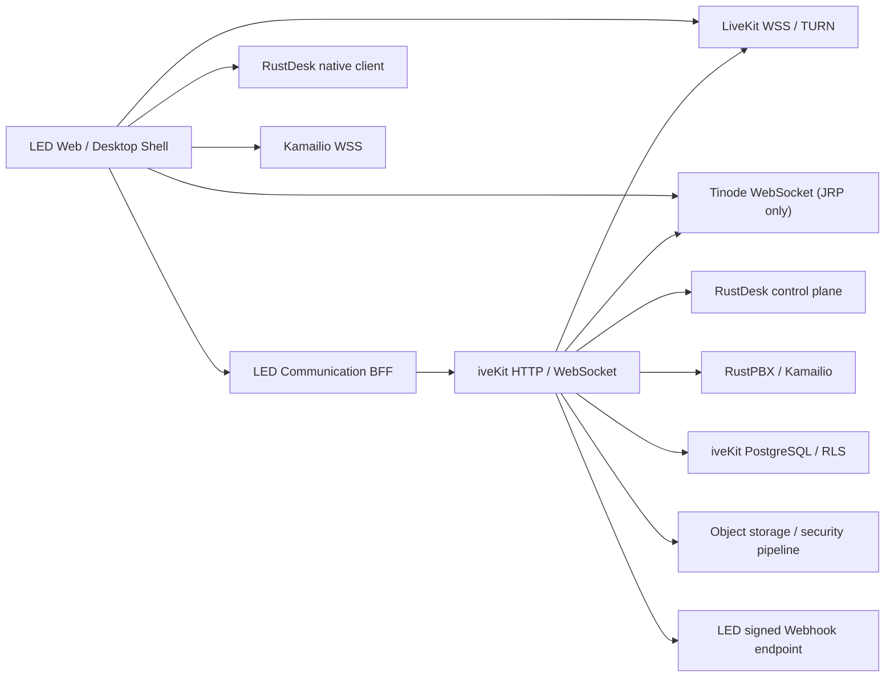

# LED × iveKit 通信能力完整对接修改方案

> 文档日期：2026-07-28
> 面向：LED 架构、后端、Web 前端、Windows 客户端、测试与运维研发
> 对接范围：视频、应用内语音、IM、文件、RustDesk 远控、WebPhone/SIP、事件与审计
> iveKit 基线：`@opc/ivekit-sdk` 与 `/api/ivekit/*` v1 additive contract
> 业务主引用：`business_ref.type=order_assignment`，`business_ref.id=<LED assignment id>`

## 1. 结论

LED 不需要复制 LiveKit、Tinode、RustDesk、RustPBX、Kamailio 或 iveKit 的内部实现。LED 需要补的是：

1. 一个服务端 iveKit BFF/adapter，统一处理鉴权、幂等键、资源绑定和错误映射。
2. 一个按 assignment 聚合的通信绑定模型，保存 iveKit 资源 ID 和安全状态，不保存短期凭据。
3. 完整 IM 工作区和 Tinode 只读实时订阅 adapter。
4. 完整 RustDesk 远控工作区、授权码交互、控制租约、原生拉起和断开状态。
5. 把现有视频“裸房间”接入升级为 durable media call 生命周期。
6. 事件 Webhook durable inbox、浏览器 WebSocket/replay 和 snapshot 恢复。
7. 修复工程师工作台看不到已有 assignment 的导航/查询问题。
8. 明确“应用内语音”和“电话/WebPhone”是两个入口，不能混为一个状态。

截至 2026-07-28 的真实联调结果：

| 能力 | 当前结果 | LED 是否要改 |
| --- | --- | --- |
| 登录、assignment 详情页 | 通过 | 保留 |
| LiveKit 房间连接 | 通过 | 保留，升级生命周期 |
| 远端音频接收 | 通过，实际播放 | 保留 |
| 远端摄像头视频 | 通过，`640×360`、非空画面 | 保留 |
| 远端屏幕共享 | 通过，`1280×720`、非空画面 | 保留 |
| 离开、重新建房、重新收流 | 通过 | 改为 durable call 重入语义 |
| 应用内 Voice call | 音频通过 | 需确认是否屏蔽远端视频 |
| iveKit IM 底座 | 真实双用户 Tinode WebSocket、JRP 禁止直发、iveKit 双向投递、关闭幂等、2/2 撤权、关闭后 inbound cursor 暂停均通过 | LED 实现页面/BFF 并做浏览器 UI 验收 |
| IM | 页面显示 `External Pending` | 必须实现 |
| RustDesk 远控 | 页面显示 `External Pending` | 必须实现 |
| assignment 列表导航 | 已分配的 working assignment 未在工程师首页稳定出现 | 必须修复 |
| 电话/WebPhone | 当前 assignment 页面无入口 | 按本文新增 |

### 1.1 修改责任判定

LED 研发应按下表区分“LED 要开发”和“等待 iveKit/OPC 修复或交付”。不能为了赶联调绕过
iveKit facade 直连底层组件。

| 事项 | 主责 | LED 要做什么 | 禁止的临时绕法 |
| --- | --- | --- | --- |
| 裸 LiveKit room 迁移为 durable call | LED | 改 BFF 调用链和页面状态机 | 继续用 room ID 充当 call ID |
| assignment 首页遗漏 working 任务 | LED | 修查询、过滤和路由 | 只保留人工输入深链接 |
| IM 页面、消息、附件、未读和恢复 | LED | 实现 BFF 与工作区 | 浏览器直接向 Tinode 发布业务消息 |
| `POST /api/ivekit/chat/sessions` RLS 边界 | iveKit/OPC 已修复并完成真实 PostgreSQL 回归 | LED 按原合同调用；若再失败提交 tenant/request-id，不增加绕过分支 | 改 tenant、关 RLS、直写 iveKit 数据库 |
| remote-session/consent 正式 facade | iveKit/OPC | 接入固定版 SDK；不自行伪造资源 ID | 直写旧表或在 LED 生成假 consent |
| RustDesk 页面和 attended 用户交互 | LED | 实现授权、拉起、控制和断开状态 | 把一次性 code 当 RustDesk password |
| Windows companion 精准断开 | iveKit/OPC | LED 只消费 disconnect state 并展示 | 默认重启整机 RustDesk 服务 |
| LiveKit/TURN/Tinode/RustDesk/Kamailio 公网端点与证书 | iveKit/OPC 运维 | 配置允许的 origin，并执行端到端验收 | 把服务端 secret 放入 LED |
| OCR/ASR/翻译/AI Provider 未配置 | iveKit/OPC 运维 | 根据 capability 显示不可用/待处理 | 把“未配置”显示成“未发现风险” |
| 双 Windows、双浏览器和弱网验收 | 双方 | LED 提供真实用户流程，OPC 提供底座环境 | 用单浏览器合成流宣称最终验收完成 |

当前 OPC 缺陷必须由 OPC 修复后给出 commit、部署版本和回归证据。LED 只需保留明确错误状态，
不得增加与缺陷绑定的永久兼容分支。

## 2. 当前视频接入的已知结构问题

当前 LED call 页面能建立真实 LiveKit WebRTC 连接，但每次 Join/Join again 直接创建一个新的
`livekit_rooms` 记录，没有对应的 `ivekit_media_calls` 权威记录。

这会带来以下问题：

- 没有 `created -> ringing -> accepted -> active -> ended` 的业务通话状态。
- assignment 工具卡无法稳定显示正在呼叫、已接听、重连中、已结束。
- ring timeout、reject、cancel、moderation、终态撤权不能统一收敛。
- 通话参与人、QoS、断线恢复和统一 timeline 不完整。
- “Join again”只能通过创建新 room 恢复，无法区分同一通话重连和新通话。

因此，现有视频画面实现可以保留，但资源创建和状态管理必须迁移到
`/api/ivekit/media/calls` durable call contract。

## 3. 系统责任边界

### 3.1 LED 负责

- 订单、assignment、客户、工程师、服务流程与页面导航。
- 把 LED 用户映射为稳定 iveKit identity。
- 调用 iveKit facade/SDK，不直连底层组件。
- 在 LED 数据库保存资源绑定、展示投影和 Webhook inbox。
- 浏览器 UI、用户授权交互、错误提示和断线恢复。
- Windows 客户端安装引导与 `rustdesk://` 用户点击拉起。

### 3.2 iveKit 负责

- LiveKit 房间、token、参与人、录制、QoS 和终态撤权。
- Tinode 账号/topic、消息镜像、provider delivery、离线同步。
- 文件扫描、隔离、转码、缩略图、OCR/ASR/AI 质检任务。
- RustDesk 设备、授权码、控制权、操作授权、断开和审计。
- RustPBX/Kamailio/WebPhone、SIP/IVR/录音控制面。
- tenant RLS、事件 journal、Webhook、审计与 retention。
- Provider、数据库、Cell、owner epoch 和横向扩展。

### 3.3 LED 严禁直接访问

- iveKit/PostgreSQL、Tinode 数据库、Redis、NATS。
- LiveKit API secret、Tinode root/service password。
- RustDesk edge token、companion token、服务端私钥。
- MinIO/SeaweedFS root、bucket service secret、object key。
- OCR/ASR/LLM/翻译 Provider credential。

## 4. 目标拓扑



原则：

- 业务写请求先到 LED BFF，再调用 iveKit。
- LiveKit/Tinode/RustDesk/SIP 的短期连接计划由 iveKit 签发。
- 浏览器可直接连接数据面，但不能得到服务端 secret。
- LED 后端只保存资源 ID、状态和安全摘要。

## 5. LED 配置项

LED 服务新增：

```text
IVEKIT_BASE_URL
IVEKIT_API_KEY
IVEKIT_TENANT_ID
IVEKIT_EVENT_WEBHOOK_SECRET
IVEKIT_REQUEST_TIMEOUT_MS
IVEKIT_BROWSER_AUTH_MODE
IVEKIT_ALLOWED_EVENT_PATTERNS
```

建议：

| 配置 | 规则 |
| --- | --- |
| `IVEKIT_BASE_URL` | HTTPS origin root，不能带 `/api/ivekit` 或其它 path |
| `IVEKIT_API_KEY` | 仅 LED 后端 secret，不进入浏览器、日志、错误或数据库 |
| `IVEKIT_TENANT_ID` | 固定映射 LED 当前租户；禁止由浏览器 body 决定 |
| `IVEKIT_EVENT_WEBHOOK_SECRET` | 至少 32 bytes，单独轮换，不能复用 API key |
| `IVEKIT_REQUEST_TIMEOUT_MS` | 建议普通读 5-10 秒，写 10-15 秒 |
| `IVEKIT_BROWSER_AUTH_MODE` | 推荐 `jwks`；过渡期可使用 BFF-only |
| `IVEKIT_ALLOWED_EVENT_PATTERNS` | 显式 allowlist，不订阅无关租户事件 |

浏览器鉴权推荐顺序：

1. **推荐：LED 自有 RS256/JWKS**。iveKit 配置 LED issuer，JWT 至少包含
   `sub`、`tenant_id`、`role`、`iss`、`iat`、`exp`。
2. **可用：BFF-only**。浏览器不直调 iveKit HTTP，所有业务请求由 LED 后端代表用户调用。
3. **不推荐：共享 HS256 secret**。如过渡期使用，claim 为 `sub/tid/role/iat/exp`，必须使用独立
   secret 和短 TTL。

禁止把 `IVEKIT_API_KEY` 打进 Next/Vite public env。

版本和启动门禁：

- `@opc/ivekit-sdk` 必须锁定精确交付版本或制品 digest，不能使用 `^`、`~` 或运行时自动升级。
- LED 启动时只校验必需配置是否存在，不在日志打印 secret。
- 部署后由只读 preflight 检查 base URL、证书、tenant、capabilities 和事件 catalog。
- capability 为 `false`、schema version 不认识或 catalog 缺项时，关闭对应入口并报告部署问题，
  不进行供应商直连降级。
- 每个环境分别配置 URL、tenant、key 和 Webhook secret，测试与生产凭据不能复用。

## 6. 统一业务引用与 LED 持久化

所有能力必须复用同一 business ref：

```json
{
  "type": "order_assignment",
  "id": "<assignment_id>",
  "display_name": "LED assignment <assignment_id>",
  "metadata": {
    "order_id": "<order_id>",
    "customer_id": "<customer_id>",
    "engineer_id": "<engineer_id>"
  }
}
```

`metadata` 只能放稳定 ID 和显示所需的非敏感字段，不放邮箱、手机号、token、URL 或原始聊天内容。

LED 建议新增 `communication_bindings`：

| 字段 | 说明 |
| --- | --- |
| `id` | LED 主键 |
| `tenant_id` | LED tenant |
| `assignment_id` | 唯一业务引用 |
| `chat_session_id` | iveKit collaboration session |
| `media_call_id` | 当前 durable media call |
| `media_room_name` | 只读投影，不作为业务权威 |
| `remote_session_id` | collaboration remote session |
| `rustdesk_device_id` | iveKit device ID |
| `rustdesk_gateway_external_id` | 当前 gateway session |
| `voice_call_id` | 电话/WebPhone call，可空 |
| `last_event_cursor` | opaque cursor，不解析 |
| `revision` | LED 乐观锁 |
| `created_at/updated_at` | 时间 |

约束：

- `(tenant_id, assignment_id)` 唯一。
- 一个 assignment 可有多次历史 media/remote/voice session；当前表只保存 active pointer，
  历史由子表或 iveKit timeline 查询。
- 不保存 LiveKit token、Tinode token、SIP password、RustDesk launch URL、授权 raw code。

LED 新增 `ivekit_webhook_inbox`：

| 字段 | 说明 |
| --- | --- |
| `event_id` | 唯一 |
| `tenant_id` | 必须与 LED 配置一致 |
| `event_type` | allowlist 后的类型 |
| `body_sha256` | 防重放核对 |
| `received_at` | 收到时间 |
| `processed_at` | 完成时间 |
| `attempts` | 投影重试次数 |
| `last_error_code` | 脱敏错误 |

Webhook 请求事务只做验签、claim 和 inbox insert，业务投影异步处理。

建议再增加 `communication_resources` 历史表，避免 active pointer 覆盖历史事实：

| 字段 | 说明 |
| --- | --- |
| `tenant_id/assignment_id` | LED 权限与业务边界 |
| `resource_type` | `chat_session/media_call/remote_session/gateway_session/voice_call` |
| `resource_id` | iveKit opaque ID |
| `status/revision` | 最后一次服务端投影 |
| `started_at/ended_at` | 生命周期 |
| `created_by` | LED 用户 ID |
| `last_event_id` | 最后应用事件，用于诊断 |

`communication_bindings` 保存当前指针，`communication_resources` 保存历史，两者都不能替代 iveKit
权威状态。并发创建时用 assignment 行锁或数据库唯一约束收敛，不能依赖前端按钮禁用。

对需要后台重试的 iveKit 写操作，可增加 `ivekit_command_outbox`，至少保存
`operation_type/idempotency_key/payload_sha256/state/attempts/next_attempt_at`。只有不含 token、授权
code、聊天正文和文件内容的安全命令才能进入 outbox；原 payload 若必须重放，应加密并按最短保留期删除。

## 7. LED 后端 adapter

新增独立模块，例如：

```text
src/integrations/ivekit/
  client.ts
  identity.ts
  idempotency.ts
  context-service.ts
  media-service.ts
  chat-service.ts
  remote-service.ts
  voice-service.ts
  webhook-handler.ts
  event-projector.ts
  errors.ts
```

使用 `@opc/ivekit-sdk`，不要复制 SDK 源码或手写底层 URL。

后端 client 创建规则：

```ts
const ivekit = createIveKitClient({
  baseUrl: env.IVEKIT_BASE_URL,
  apiKey: env.IVEKIT_API_KEY,
  tenantId: env.IVEKIT_TENANT_ID,
  userId: authenticatedLedUser.id,
  timeoutMs: env.IVEKIT_REQUEST_TIMEOUT_MS
});
```

每次请求都从 LED session 重新取得当前用户和 tenant，不能信任 body 中的 actor。

幂等键格式建议：

```text
led:<tenant>:assignment:<assignment_id>:<resource>:<operation>:<stable_operation_id>
```

网络超时、502/503 或并发 409 重试时，必须复用原 key 和原 payload。不得为同一用户动作重新生成 key。

所有返回短期连接计划的 LED BFF 路由必须：

- 返回 `Cache-Control: no-store`，不进入 CDN、服务端响应缓存或 error tracker。
- 使用字段级日志脱敏；不能记录 response body。
- 仅向当前 assignment 的已授权用户返回计划。
- 在 assignment 切换、退出登录、撤权和终态时主动清除浏览器内存。
- 不把 LiveKit/Tinode/SIP/RustDesk 短期凭据写入 SSR HTML、DOM attribute、URL、localStorage、
  sessionStorage 或 analytics。

LED 至少建立以下授权矩阵，并在 BFF 服务端执行：

| 操作 | customer | engineer | supervisor | admin |
| --- | --- | --- | --- | --- |
| 读通信上下文 | 本人 assignment | 被分配 assignment | 管辖范围 | tenant 范围 |
| 发起/接听应用内通话 | 是 | 是 | 按业务授权 | 是 |
| IM 发送/编辑/删除 | active participant | active participant | 加入后 | 加入后 |
| 创建 attended code | 是 | 否 | 否 | 是 |
| 验证 code/发起远控 | 否 | 是 | 按业务授权 | 是 |
| 控制转移/紧急断开 | 否 | 当前控制者 | 按策略 | 是 |
| 质检复核/审计导出 | 否 | 默认否 | 是 | 是 |

具体角色名可映射为 LED 现有 RBAC，但权限含义不能变宽。

## 8. 视频与应用内语音修改

### 8.1 durable call 创建流程

发起方：

```ts
const snapshot = await ivekit.media.createCall({
  media: "video",
  participant_identities: [customerId, engineerId],
  business_ref: assignmentBusinessRef,
  title: "LED service video",
  ring_timeout_seconds: 60,
  metadata: { source: "led-platform" }
});
```

随后：

1. `transitionCall(callId, {action:"ring"}, {idempotencyKey})`
2. 接听方 `transitionCall(callId, {action:"accept"}, {idempotencyKey})`
3. 每个参与人调用 `createCallJoinPlan(callId, {identity,display_name})`
4. 连接成功后 `transitionCall(callId, {action:"activate"}, {idempotencyKey})`
5. 正常结束调用 `transitionCall(callId, {action:"end"}, {idempotencyKey})`
6. 未接、拒绝、取消分别使用 `timeout/reject/cancel`

浏览器 Bearer 模式下 identity 必须等于 JWT `sub`。LED 不得允许前端选择任意 identity。

### 8.2 重连规则

- LiveKit SDK 短暂重连：仍属于同一 `media_call_id`，不创建新 call。
- token/owner 已失效：使用同一 call 的 join，并携带 SDK 要求的 recovery 信息。
- durable call 已 terminal：用户明确点击“重新发起”才创建新 call。
- 页面刷新：先读 `getCall(media_call_id)`，仍为 accepted/active 才重新取 join plan。
- assignment 切换：立即 disconnect，清空旧 token、room、participant 和 local track。

浏览器上报：

- `connected/reconnecting/reconnected/disconnected/rejoining/rejoined/failed`
- 每个事件使用稳定 `event_id` 和单调 `connection_revision`
- QoS 采样上报 RTT、jitter、packet loss、bitrate 和 quality level

### 8.3 UI 状态

| iveKit call | LED 显示 |
| --- | --- |
| `created` | 准备呼叫 |
| `ringing` | 正在呼叫 |
| `accepted` | 已接听，正在连接 |
| `active` | 通话中 |
| `rejected` | 已拒绝 |
| `cancelled` | 已取消 |
| `timed_out` | 未接听 |
| `ended` | 已结束 |
| `failed` | 通话失败 |

不要把 LiveKit socket connected 直接等同于业务 call active；两者需要分别投影。

### 8.4 视频控制

保留现有能力，并补齐：

- 麦克风开关、摄像头开关、设备选择。
- 屏幕共享开始/停止及共享轨道标签。
- 主持人静音和移除参与人。
- participant count、连接状态、弱网提示。
- local/remote track 分离，不能按 DOM 顺序推断身份。
- 浏览器权限拒绝时仍允许 receive-only。
- `Leave call` 必须先断开 local track，再提交 durable end/leave 动作。

### 8.5 “Voice call”语义

当前真实行为是：Voice call 关闭本地摄像头发布，但仍订阅并显示对方发送的视频和屏幕共享。

LED 产品必须二选一并写测试：

1. **语音加入模式**：只约束本地发布，允许看对方视频。保留当前行为，但改文案为“仅开启麦克风”。
2. **纯语音会话**：不订阅/不渲染 camera 和 screen share。前端必须增加订阅过滤。

不能继续使用“Voice call”文案却不定义上述语义。

### 8.6 录制与存储故障

- LED 只展示 iveKit recording/egress 状态，不直接操作对象存储。
- 录制失败、对象存储不可用、转码失败不得结束正在进行的 WebRTC/语音会话。
- UI 必须区分“通话中”和“录制失败”。
- 导出只能通过 iveKit 鉴权 facade，不能展示 object key 或 storage URL。

## 9. IM 完整实现

### 9.1 页面入口

把 assignment 详情的 `IM / External Pending` 替换为：

- `Open chat`
- 未读数
- 最近消息摘要
- 在线人数
- `Active/Closed/Degraded` 状态

建议使用右侧工作区或独立 route：

```text
/engineer/assignments/:assignmentId/chat
/customer/assignments/:assignmentId/chat
```

### 9.2 初始化流程

1. `chat.openSession({business_ref})` 创建或复用 session。
2. `chat.bindSession(sessionId)` 创建/复用 Tinode binding。
3. 为 customer、engineer、允许的 supervisor 添加 participant。
4. 读取 `snapshot` 和分页消息。
5. 当前浏览器请求 `client-plan`，只用于 Tinode subscribe/receive。
6. 建立 iveKit WebSocket，保存 opaque cursor。
7. assignment 进入业务终态时调用 `chat.closeSession(sessionId)`；该操作可安全重试，成功后刷新 snapshot 并停止 Tinode 订阅。

Tinode client plan 必须保持 `JRP`，不能有 `W`。所有发送、编辑、删除、reaction、pin、receipt、
typing、presence 都走 iveKit API/SDK。

LED 不得自行逐个删除 Tinode subscription 来代替 `chat.closeSession()`。iveKit 关闭合同会先验证全部
active participant 的 Tinode provider user ID 映射，再把 inbound cursor 原子置为 `paused` 并撤权；
只有远端撤权全部成功才提交本地 `revoked/closed`。重复关闭返回同一 closed session，失败可重试。
关闭与成员、binding、client-plan、消息投递冲突时可能返回可重试
`409 collaboration_session_busy`；LED 使用原请求有界退避，成功关闭后不得再发送新消息或触发
delivery retry。

### 9.3 消息功能

LED 必须实现：

- 文本消息与稳定幂等发送。
- 历史向上分页、增量 after cursor。
- 离线消息恢复。
- delivered/read receipt 与 unread。
- typing、online/away/offline TTL。
- reply、forward、mention。
- reaction、pin。
- 发送者窗口内 edit、soft delete。
- provider delivery 状态和失败重试提示。
- mutation dead letter 仅管理员可见和处理。

UI 以 iveKit snapshot/event 为权威，不以 Tinode local cache 覆盖服务端版本。

### 9.4 附件

新实现优先使用 secure-file：

1. `createSecureFile`
2. single 或 multipart 上传
3. `completeSecureFile`
4. 轮询/事件等待 `ready + clean`
5. 发送消息时只绑定 `secure_file_id`

LED 必须展示：

- uploading、scanning、processing、ready、quarantined、failed、expired。
- 分片进度、取消和断点续传。
- 缩略图/转码状态。
- OCR/ASR/视频帧 OCR 的独立状态。
- `partial_processing_failure`，不能把部分成功显示成全部成功。

禁止：

- base64 JSON 大文件。
- 直接使用 Tinode Drafty 外链作为可信附件。
- 显示 object key/storage URL。
- 在 `scanning` 时提供下载。

### 9.5 防绕单与质检

LED 只消费 finding/quality API：

- 文本、OCR、ASR、aggregate、AI 来源使用不同标记。
- 普通聊天页面只显示克制的风险标签。
- 审核工作区显示 finding、脱敏理由和不可变 review history。
- `confirmed/false_positive/escalated/resolved` 必须要求原因。
- AI 建议不能自动封单、处罚或执行不可逆动作。

Provider 未配置时显示 `provider_unconfigured`，不能显示“未发现风险”。

## 10. RustDesk 远控完整实现

### 10.1 页面入口

把 `Remote control / External Pending` 替换为：

- 设备在线状态
- 授权范围
- attended/unattended 模式
- `Start remote assistance`
- 当前控制者与租约
- 结束/物理断开状态
- 审计与证据状态

LED 可直接复用 `clients/ivekit-reference` 的 Remote 工作区流程，或集成
`RustDeskLaunchPanel`，不要重新实现协议细节。

### 10.2 前置资源

启动前必须具备：

- 与 assignment 同一 business ref 的 `remote_session_id`
- active participant
- active consent scopes
- 已注册且 online 的 RustDesk device
- attended 授权或 unattended policy

当前稳定 RustDesk SDK 需要外部提供 `remote_session_id`。如果 LED 当前没有创建该资源的稳定
adapter，应由 iveKit/OPC 侧提供正式 remote-session/consent facade；LED 不应绕过 SDK 直连旧表或
伪造 ID。

### 10.3 attended 流程

1. 客户/admin 请求 8 位一次性 code。
2. raw code 只显示一次，不写数据库、日志、URL、事件或 analytics。
3. 工程师输入 code，服务端返回已验证 authorization。
4. LED 只保存/传递 `authorization_id`。
5. `startSession()` 原子消费 authorization 并返回 launch plan。
6. 用户明确点击后才打开 `rustdesk://`。

code 不是 RustDesk password，也不替代 consent 或 control ownership。

### 10.4 控制租约和敏感操作

- 同一 gateway session 同时只有一个 controller。
- acquire、heartbeat、release、transfer 都使用当前 version。
- 当前 controller 每 10 秒 heartbeat。
- 组件卸载、页面关闭、租约失败后停止续租并刷新服务端状态。
- 键鼠、文件、剪贴板、control transfer、unattended launch 使用一次性 confirmation。
- 文件/剪贴板/键鼠事件必须带 `operation_grant_id + control_version`。

### 10.5 拉起与凭据

- launch plan 只能即时读取，不持久化。
- `launch_url`、token 不放 DOM、日志、localStorage 或数据库。
- 用户点击时重新校验 session active、RustDesk ID、scheme、server key fingerprint。
- 浏览器必须由真实 user gesture 触发 protocol handler。

### 10.6 结束和精准断开

1. `endGatewaySession`
2. 轮询 `getGatewayDisconnectState`
3. 显示 `pending/succeeded/failed/unavailable`
4. 只有 owner/admin 明确确认 collateral risk 才能执行 emergency fallback

HTTP 结束成功不代表物理 RustDesk 会话已经断开。LED 必须等待 disconnect state，并在 Windows
物理验收中确认画面、键鼠、文件和剪贴板均停止。

### 10.7 文件、录屏与证据

LED 只能显示三种事实：

| 状态 | 含义 |
| --- | --- |
| `ivekit_secure_file` | 字节进入统一安全文件链路 |
| `native_unscanned` | RustDesk 原生传输未被 iveKit 扫描 |
| `local_only` | 录屏只留在终端 |

后两种不得显示“已扫描”“可下载”“OCR/ASR 已完成”。

LED 不能上传剪贴板正文、按键、屏幕像素或文件内容到 audit metadata。只允许方向、display ID、
byte count、SHA-256、duration、状态和 evidence ref。

## 11. 电话/WebPhone 与应用内语音

LED 必须把两种语音能力拆开：

| 能力 | 底层 | 用途 |
| --- | --- | --- |
| 应用内语音 | LiveKit Media Core | 客户与工程师在 LED 页面通话 |
| 电话/WebPhone | Kamailio + RustPBX + SIP.js | 分机、PSTN/SIP、IVR、队列 |

WebPhone 接入：

1. 后端读取 `voice.getCapabilities()`。
2. 只有 `extension_sessions=true` 才允许进入。
3. 调用 `createExtensionSession(extensionId,{idempotencyKey})`。
4. 浏览器使用返回的短期 WSS/SIP plan 初始化 SDK 的 sip-webphone。
5. SIP credential 只保存在内存，过期前注册，失败后重新取 plan。
6. 呼叫控制使用 iveKit voice call/action，不直接调用 RustPBX RWI。

生产路径固定为：

```text
LED browser -> Kamailio WSS -> RustPBX -> SIP/RTP
```

真实 PSTN 未配置时，LED 必须显示 capability unavailable，不能拿应用内 LiveKit 语音冒充电话已通过。

## 12. 事件、Webhook 与断线恢复

### 12.1 后端 Webhook

LED 新增：

```text
POST /internal/webhooks/ivekit
```

处理顺序：

1. 读取 raw body，限制最大 1 MiB。
2. 校验 `x-ivekit-timestamp` 时间窗。
3. 使用 `IVEKIT_EVENT_WEBHOOK_SECRET` 校验 `x-ivekit-signature`。
4. 校验 outer/inner tenant、event type 和 `x-ivekit-event-id`。
5. 原子 claim `event_id + body_sha256`。
6. 插入 durable inbox 后立即返回 2xx。
7. 异步更新 LED projection。

必须使用 SDK `verifyIveKitWebhook`。禁止先 JSON parse 再重新序列化后验签。

建议订阅：

```text
ivekit.media.*
collaboration.*
remote.rustdesk.*
ivekit.voice.*
notification.*
```

最终 allowlist 以 `/api/ivekit/events/catalog` 为准。

### 12.2 浏览器实时事件

- 使用 `Sec-WebSocket-Protocol: ivekit.v1, ivekit.jwt.<token>`。
- token 不放 URL。
- 保存最后一个 opaque cursor。
- 重连先 replay，再接 live event。
- `snapshot_required` 时重新读取 context、chat snapshot、message-state、realtime-state、media call
  snapshot 和 remote state，再使用新 head cursor。
- event ID 去重；不能按“最后写入覆盖”处理较旧状态。

HTTP projection 是恢复后的权威，WebSocket 只用于加速 UI。

## 13. LED API 建议

对浏览器提供 LED 自有 BFF 路径：

```text
GET  /api/assignments/:id/communications
POST /api/assignments/:id/media-calls
POST /api/assignments/:id/media-calls/:callId/actions
POST /api/assignments/:id/media-calls/:callId/join
GET  /api/assignments/:id/chat
POST /api/assignments/:id/chat/messages
POST /api/assignments/:id/chat/files
POST /api/assignments/:id/remote/authorization
POST /api/assignments/:id/remote/sessions
POST /api/assignments/:id/remote/sessions/:externalId/control/*
DELETE /api/assignments/:id/remote/sessions/:externalId
GET  /api/assignments/:id/voice/capabilities
POST /api/assignments/:id/voice/extension-session
```

这些路径是 LED BFF 设计建议，不是 iveKit 新 API。BFF 必须从 URL assignment 反查当前用户权限和
iveKit business ref，不能透传前端给出的 tenant、actor 或任意资源 ID。

## 14. 前端状态与错误映射

| 错误 | LED 行为 |
| --- | --- |
| 400/422 | 显示字段或状态错误，不自动重试 |
| 401 | 刷新 LED/iveKit 短 token；失败回登录 |
| 403 | 显示无权限，不隐藏成网络错误 |
| 404 | 重新读取 communication context，避免跨 assignment 资源 |
| 409 幂等占用 | 原 key、原 payload 有界重试 |
| 409 revision | 刷新 snapshot 后让用户重试 |
| 409 `collaboration_session_busy` | 原请求短退避有界重试；close 成功后停止全部会话写入 |
| 413/415 | 显示文件大小/MIME 拒绝 |
| 501 | 显示部署未提供该 capability，不重试 |
| 502 | provider 失败；按资源状态决定是否原 key 重试 |
| 503 | 服务不可用，保留本地 UI 状态并提供重试 |
| `status=0` | 网络/超时；仅幂等请求可安全原 key 重试 |

不允许：

- 遇到任何错误都创建新 call/session/message。
- 以 HTTP 2xx 推导 RustDesk 物理操作成功。
- 以 Tinode publish ack 推导消息已读。
- 以录制失败推导通话失败。

## 15. 工程师工作台必须修复

真实账号有 working/funded assignment，但工程师首页未稳定展示，必须通过直接 URL 才能进入。

LED 需要检查：

1. assignment 列表是否只查询 unaccepted mission。
2. working、funded、accepted 状态是否被错误过滤。
3. engineer identity 与 assignment.engineer_id 的映射。
4. pagination/cursor 是否遗漏历史 active assignment。
5. 服务端返回后前端 tab 是否再次过滤。
6. 首页、通知和深链接能否进入同一个 assignment 详情。

验收：已有 working assignment 必须从工程师首页最多两次点击进入视频、IM 和远控。

## 16. 安全门禁

- API key、LiveKit/Tinode/SIP/RustDesk token 不记录。
- raw authorization code 不持久化。
- assignment 切换清空全部短期 plan。
- 所有写操作服务端重验 tenant、actor、participant、consent、scope。
- Webhook 使用 durable replay store，不用内存 Set。
- 文件下载只经过 iveKit facade。
- audit metadata 使用白名单，禁止任意对象透传。
- CSP 允许明确的 LiveKit/Tinode WSS origin，不使用 `*`。
- CORS 只允许 LED 生产 origin。
- TURN credential 只从 Join Plan/ICE config 使用，不写日志。
- 浏览器和 LED 后端均不得读取 RustDesk edge token。

## 17. 实施顺序

### P0：必须先完成

1. LED communication BFF、配置和 SDK。
2. business ref 与 `communication_bindings`。
3. durable media call 迁移。
4. 工程师 assignment 列表修复。
5. Webhook inbox 和验签。
6. IM 基础会话、消息、实时事件、未读。
7. RustDesk 基础设备、attended 授权和 launch。

### P1：完整可用

1. IM 文件、断点续传、receipt、typing、presence、edit/delete、reaction/pin。
2. RustDesk control lease、confirmation、file/clipboard/recording audit、disconnect。
3. Media QoS、connection event、moderation、录制状态。
4. 应用内 voice 语义收敛。
5. WebPhone/extension session 页面。

### P2：运营能力

1. Quality/review 工作区。
2. OCR/ASR/翻译结果展示。
3. timeline、搜索、审计导出。
4. dead letter/replay 运维页。
5. 通知中心和通信深链接。

## 18. 联调验收矩阵

### 18.1 视频/应用内语音

- 两个真实浏览器加入同一 durable call。
- 麦克风双向可听。
- 摄像头双向非空。
- 屏幕共享开始、切换、停止。
- receive-only 权限拒绝。
- Wi-Fi/热点切换重连。
- 页面刷新回到同一 active call。
- terminal call 的旧 token 不能复活。
- TURN relay-only 场景。
- QoS degraded/recovered。
- 录制/对象存储停机时通话不中断。

### 18.2 IM

- 双向文本、离线补发和消息顺序。
- 同幂等键重复发送只有一条。
- receipt/unread、typing/presence TTL。
- edit/delete 与 Tinode native mutation 收敛。
- 断点续传、病毒扫描、隔离和 ready 下载。
- OCR/ASR 未配置状态。
- 防绕单 finding 和人工复核。
- WebSocket 断开后 cursor replay。
- participant leave 后无法读取旧私有事件。
- session close 重复调用保持幂等，全部 provider mapping 为 revoked，inbound cursor 保持 paused 且无后台失败重试。

### 18.3 RustDesk

- 客户生成 code、工程师验证、code 只显示一次。
- 双 Windows 真实屏幕与键鼠。
- 单 controller、heartbeat、release、transfer。
- 文件、剪贴板、多屏、录屏。
- operation observation 与 evidence security。
- 精准断开只结束目标会话。
- companion 重启后的 command recovery。
- emergency fallback 明确二次确认。

### 18.4 电话/WebPhone

- WSS Origin/JWT/subject/From 绑定。
- REGISTER 成功与过期凭据拒绝。
- 双向 SIP/RTP。
- hold/resume/DTMF/transfer/conference。
- SIP 节点故障切换。
- 录音存储故障不影响 RTP。

### 18.5 事件与安全

- Webhook 正确验签、错误签名拒绝。
- 同 event 重放不产生第二次业务变更。
- Worker 崩溃后 inbox 恢复。
- cursor 过期进入 snapshot fallback。
- 跨 tenant、跨 assignment、越权 actor 全部拒绝。
- 日志、DOM、数据库扫描无短期凭据。

## 19. 双方交付清单

### LED 研发交付

- BFF adapter 和配置校验。
- communication binding migration。
- durable webhook inbox。
- 视频 durable call 改造。
- IM 页面与实时状态。
- RustDesk 页面与原生拉起。
- 应用内 voice/WebPhone 分离。
- assignment 导航修复。
- 自动化测试和两台 Windows 手工验收记录。

### iveKit/OPC 研发交付

- 固定版本 SDK 包。
- OpenAPI、事件 catalog 和 capabilities。
- 联调环境 base URL、tenant/API key/Webhook secret 的安全交付。
- LiveKit WSS/TURN、Tinode WS、RustDesk server、Kamailio WSS 地址。
- remote-session/consent 的稳定 facade 或预置流程。
- Provider/组件健康、监控、审计和故障排查支持。

## 20. 完成定义

只有同时满足以下条件，LED 才能把通信对接标记为完成：

1. assignment 页面不再出现 `IM External Pending` 和 `Remote control External Pending`。
2. 视频使用 durable call，不再只创建裸 LiveKit room。
3. IM 消息、文件、离线恢复和实时事件通过双用户验收。
4. RustDesk 通过双 Windows 物理端到端验收。
5. 应用内语音与 WebPhone 的产品语义清晰且各自读取 capability。
6. Webhook/replay/snapshot 恢复通过进程重启测试。
7. 短期凭据未进入 LED 数据库、日志、DOM 或 analytics。
8. 录制/存储/AI Provider 故障不影响正在进行的音视频主链。
9. 跨 tenant、跨 assignment、撤权和终态 token 测试通过。
10. LED 与 iveKit 的责任边界、部署参数和故障联系人写入运维手册。

## 21. 参考合同

- `docs/ivekit-openapi.md`
- `docs/ivekit-led-integration-guide.md`
- `docs/iveKit视频IM通用能力详细设计.md`
- `sdk/ivekit`
- `clients/ivekit-reference`

本方案是 LED 的实施清单；字段和方法的最终类型以固定版本 `@opc/ivekit-sdk`、运行时
`/api/ivekit/*/capabilities` 与 `/api/ivekit/events/catalog` 为准。

## 22. IM 会话关闭的 LED 处理规则

1. LED 只能调用 SDK/HTTP 的统一 `closeSession()`，不得直接修改 OPC 数据库或调用 Tinode 删除
   topic/ACL。
2. `409 collaboration_session_busy` 表示有 message/client-plan/mutation 正占用 shared lock；
   LED 应对同一关闭意图做短退避重试，不能并行启动多个关闭请求。
3. 收到 `status=closed` 或 `collaboration.session.closed` 后，立即停止发送、编辑、删除、delivery
   retry、typing/presence 刷新，释放本地 Tinode 连接与短期 token。
4. 关闭时尚未投递的消息会收敛为 `failed/session_closed`，尚未完成的原生 edit/delete 会收敛为
   `dead_letter/session_closed`。这是会话终态裁决，不应在 LED 端无限重试。
5. 重复关闭返回同一 closed 终态；LED 可把它当幂等成功。参与人新增、binding、client-plan、
   消息、编辑、删除和 delivery retry 在关闭后均应预期收到 409。
