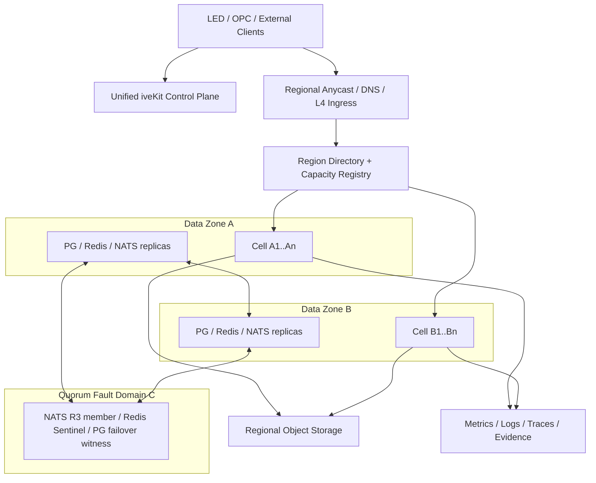

# MIX-100K、双 Zone 与 Cell 架构评审

> 日期：2026-07-16
> 评审对象：`docs/CCaaS十万并发容量对标与架构优化调研.md`
> 评审结论：有条件通过
> 约束：一套统一平台、单 Region 双活数据 Zone；优先最大化单节点 safe density 和扩容边际效率，再以尽量少的服务器横向扩展到 100,000 并发交互
> 技术授权：允许修改 RustPBX、LiveKit、Tinode、RustDesk 等开源项目核心源码，不以维持上游原样为架构约束

---

## 1. 评审结论

### 1.1 总体裁决

`MIX-100K + 双 Zone + Cell` 的总体方向正确，适合 iveKit 作为 OPC 和 LED 共用通信底座继续建设，不需要推倒当前功能层，也不需要为了 100,000 并发改成十套彼此独立的平台。

但当前提案不能原样进入实现，必须先接受以下修订：

1. `MIX-100K` 必须统计 100,000 个互不重复的 active interaction，不能把在线用户、空闲 socket、媒体 track 和同一个屏幕共享会话重复相加。
2. 双 Zone 只表示两个承载实时流量的数据 Zone；PostgreSQL failover、NATS JetStream、Redis Sentinel 等仲裁必须有第三个独立投票故障域或等价托管仲裁，不能用两个对称节点声称具备 split-brain-safe 自动故障转移。
3. Cell 必须是可替换的实时计算与会话故障域，`cell_id` 不应同时成为永久数据分片 ID；durable data shard 与 compute cell 必须解耦。
4. 租户只能固定 `home_region`，不能把整个大租户永久固定到一个 Cell。应按租户内的 routing partition 和 interaction 分配 Cell，避免一个大客户成为单 Cell 上限。
5. 当前服务器包络低估了录制、TURN、屏幕共享、ASR 和 supervisor 负载。特别是 LiveKit Egress 必须区分 TrackEgress 与 RoomComposite，不能按“20% 录制”一个比例直接估算。
6. 双 Zone 故障后的承诺应是核心能力继续接纳、受影响会话按协议重连或重建；在没有媒体状态复制前，不能承诺所有 active call/room 在节点或 Zone 突然消失时零中断。
7. 所有开源底座均允许 fork。是否修改由 profile 和 flamegraph 决定，不再因“上游没有这个接口”降低目标。
8. 100K 是架构端点验证，不是现实部署的默认预分配规模；单节点 safe density、节点池 marginal efficiency 和 Cell marginal efficiency 的优先级高于总数。

完成上述修订后，架构评审通过，可以进入容量工程 Goal。

### 1.2 不采用的解释

以下均不算通过本评审：

- 一台服务器承载 100,000。
- 十套独立平台各承载 10,000。
- 统计 60,000 个空闲 IM 连接，再与活跃媒体会话直接相加。
- 双 Zone 每个 Zone 正常已运行到 80%，故障后依赖临时扩容追赶。
- 所有 Cell 各自部署完整 PostgreSQL、Redis、NATS、对象存储，造成大量低利用率副本。
- 用 RustPBX V1 的无录制容量计算包含录音、监听、ASR 的混合语音服务器数。
- 用 LiveKit 单大房间官方 benchmark 外推 10,000 个 1:1 房间。
- 把受控 Provider、SIPp 或合成媒体测试写成真实 PSTN、TURN、Windows、OCR/ASR Provider 已验收。
- 通过堆服务器达到 100K，却让新增节点贡献低于首节点 90% 或新增 Cell 贡献低于首 Cell 95%。
- 现实小负载仍预分配整套 100K 计算资源。

---

## 2. 主要评审问题

### 2.1 P0：原 MIX-100K 的 IM 统计口径不闭合

原模型同时出现：

```text
60,000 IM session
90,000 Tinode WebSocket
5,000 msg/s
```

但没有说明 `IM session` 是在线用户、活跃 topic、客服交互还是 socket。若它只是 60,000 个在线用户，其中大部分空闲，就不能与 25,000 个正在传输 RTP 的语音呼叫等价相加；若它表示 60,000 个活跃客服会话，则至少还要说明客户、坐席/机器人、多会话坐席和多设备之间的关系。

评审修订：

- 60,000 表示 60,000 个 active IM interaction/topic。
- 基线为 60,000 个客户或外部联系人。
- 20,000 个坐席/机器人，平均同时处理 3 个 interaction。
- 共 80,000 个在线逻辑身份。
- 平均 1.125 个设备连接，约 90,000 条 Tinode WS。
- 5,000 msg/s 表示平均每个 active interaction 约 12 秒产生一条业务消息；receipt、presence、typing 另计。

这样 IM 数量才可以作为 100,000 active interaction 的组成部分，而 90,000 WS 仍作为派生连接负载单列。

### 2.2 P0：屏幕共享可能与音视频会话重复计数

屏幕共享经常是现有音视频房间中的附加 track。如果 3,000 个屏幕共享来自前面的 10,000 个 A/V 房间，则总 active interaction 只有 97,000，而不是 100,000。

评审修订：

- 10,000 个 `av_interaction_id` 与 3,000 个 `screen_interaction_id` 必须互不重复。
- 3,000 个 screen interaction 是独立远程演示/协作房间，可包含 Opus 音频，但默认不发布摄像头视频。
- 另设一个 overlay 子测试：在 10,000 个 A/V 房间中的 30% 临时增加 screen track。该子测试不增加 interaction 总数，用于验证最坏 track 数。

### 2.3 P0：双 Zone 缺少第三仲裁故障域

实时媒体可以只部署在 Zone A 和 Zone B，但持久化仲裁不能只有两个对称投票方：

- NATS JetStream 使用 RAFT，官方建议 3 或 5 个 JetStream 节点；R=2 没有显著收益，R=3 才能容忍一个节点故障。
- Redis 官方建议至少 3 个 Sentinel，且放在独立故障机器上。
- PostgreSQL 自动主从切换还需要明确的 leader/fencing 机制；仅有一主一从不能同时解决网络分区和自动选主安全性。

评审修订：

```text
Data Zone A: 实时流量 + 完整计算容量 + 数据副本
Data Zone B: 实时流量 + 完整计算容量 + 数据副本
Quorum Fault Domain C: 仲裁/第三副本/见证，不承载大规模媒体
```

`C` 可以是同 Region 的第三可用区、独立机房中的轻量节点或满足同等故障独立性的托管服务。它不是第三套媒体集群，因此不会把 RustPBX/LiveKit 服务器数量再增加 50%。

如果部署环境确实只有两个物理故障域，必须选择以下之一：

- 使用提供独立仲裁的托管 PostgreSQL、Redis/NATS 等价服务。
- 接受网络分区时停止自动写入/停止自动 failover，由人工裁决。
- 增加第三见证位置。

不能在纯双节点仲裁下同时承诺自动 failover、持续写入和零 split brain。

### 2.4 P0：录制负载会推翻当前服务器估算

原 MIX 中包括：

- 25,000 voice calls，50% 录音。
- 10,000 A/V，20% Egress 录制。
- 3,000 screen share。
- 20% voice 实时 ASR。

但服务器包络仍使用 RustPBX V1 `8,000 calls/node`，LiveKit 也只按 A/V 房间数计算。这两者不一致。

#### 语音录音数据量

12,500 个并发 G.711 录音，如果保存双向各 64 kbps：

```text
12,500 × 128 kbps = 1.6 Gbps
约 200 MB/s
约 720 GB/hour
约 17.3 TB/day（全天维持该负载）
```

如果实时混音为单声道 64 kbps，数据量约减半，但仍需单独验证磁盘、上传、对象存储和保留策略。

#### LiveKit Egress

LiveKit 官方说明 RoomComposite Egress 通常消耗 2 至 6 CPU；如果把 2,000 个并发录制房间全部做 RoomComposite，理论上会需要数千到上万 vCPU，这不是合理的 Contact Center 录制策略。

评审修订：

- 合规原始证据优先使用 TrackEgress/已编码 track 直存。
- RoomComposite 仅用于明确需要合成画面的少量会话，基线不超过视频 interaction 的 1%。
- 大部分合成、转码、缩略图、OCR 和质检在会后异步执行。
- RustPBX 语音容量使用带录音权重的 V2 profile，不再用 V1 节点数代表 MIX。
- Egress、recording uploader、object storage ingest 和 post-processing 分别计量。

### 2.5 P0：tenant home-cell 会产生大租户热点

把整个 tenant 固定到一个 Cell 很简单，但会产生两个问题：

1. 单一大客户可能超过 Cell 容量。
2. Cell drain 或故障时需要迁移整个租户，恢复面过大。

评审修订后的放置层级：

```text
tenant_id
  -> home_region（数据驻留与主区域）
  -> routing_partition_id（queue/campaign/agent-pool/topic-bucket）
  -> cell_id（实时交互放置）
  -> owner_node_id（具体 call/room/topic/session owner）
```

规则：

- 普通小租户的 routing partitions 可以都落在同一 Cell，保持局部性。
- 超大租户可以把不同 queue、campaign、agent pool 或 topic bucket 分散到多个 Cell。
- 同一个 SIP dialog、LiveKit room、Tinode topic owner 或 RustDesk session 在生命周期内固定 owner。
- 配置发布到多个 Cell，实时包和每条 fanout 不经过全局控制面。
- Cell 选择使用一致性哈希/随机双选加容量门槛，而不是控制面逐包决策。

### 2.6 P0：Cell 与永久数据分片耦合过深

原图在每个 Cell 内放置独立 iveKit PG shard 和 Tinode PG shard。这样隔离性强，但会导致：

- 每增加一个 Cell 就增加一套 PostgreSQL HA 成本。
- 空闲 Cell 的数据库副本仍占用服务器。
- Cell 替换或扩缩容变成数据迁移。
- `cell_id` 既是实时故障域又是永久数据地址，后续重平衡困难。

评审修订：

- Cell 负责实时计算、会话 owner、局部 cache、临时状态和 admission。
- `data_shard_id` 独立于 `cell_id`。
- 一个区域数据 shard group 可以服务一组 Cell，并按 tenant/routing partition 横向增加 shard。
- PostgreSQL、NATS JetStream、对象存储和分析存储跨 Zone HA，不跟随 Cell pod 数线性复制。
- Cell 丢失后，新 Cell 通过 durable shard、outbox 和配置快照恢复，不要求恢复 Cell 本地临时状态。

### 2.7 P0：active session 零中断承诺不成立

LiveKit 官方分布式模式可以把不同 room 分配到不同节点，但一个 room 仍必须容纳在一个节点；drain 可以让已有 room 自然结束，却不能让突然宕机节点上的 room 无缝迁移。RustPBX、RustDesk 同样没有现成的全媒体状态同步。

评审后的故障语义：

| 故障 | 承诺 |
| --- | --- |
| 单 API/WS/worker pod | 无业务数据丢失，客户端自动重连 |
| 单 SIP Edge | dialog affinity 数据可恢复；新呼叫快速转移 |
| 单 RustPBX media node | 新呼叫 30 秒内恢复接纳；受影响 active call 允许 re-INVITE/重拨 |
| 单 LiveKit node | 新 room 30 秒内恢复接纳；受影响 room 客户端获取新 token 并重建/重发 track |
| 单 RustDesk hbbr | P2P 不受影响；relay 会话重选 hbbr，允许短暂冻结 |
| 单 Data Zone | surviving Zone 接纳核心 profile；受影响 active media 按上述协议恢复 |
| PostgreSQL/NATS/Redis leader | 在 RPO/RTO 内切主，依赖第三仲裁域 fencing |

“已有媒体会话零中断”只有在后续完成媒体状态复制、双发或协议级 make-before-break 并经实测后才能升级为产品承诺。

---

## 3. 批准版 MIX-100K-v1

### 3.1 100,000 个互斥 active interaction

| 类别 | Active interactions | 定义 |
| --- | ---: | --- |
| Tinode IM | 60,000 | 60k 活跃客服 topic；60k 客户 + 20k 坐席/机器人，坐席平均并行 3 会话 |
| SIP voice | 25,000 | 25k 双腿逻辑呼叫，客户腿可来自 trunk，坐席腿可为 WebPhone/SIP |
| LiveKit 1:1 A/V | 10,000 | 10k 独立 room，20k participants |
| LiveKit screen collaboration | 3,000 | 与 A/V room ID 互斥；默认 1 screen publisher + 1 subscriber + 可选音频 |
| RustDesk remote assistance | 2,000 | 2k 授权远控 session，P2P 与 relay 混合 |
| 合计 | **100,000** | 每个 interaction ID 只属于一行 |

### 3.2 同轮存在的连接与注册

这些不重复进入 100,000，但必须同时施压：

| 负载 | 数量 |
| --- | ---: |
| Tinode WebSocket | 90,000 |
| iveKit event WebSocket | 50,000 |
| WebPhone/SIP registered contacts | 25,000 |
| 其中 SIP over WSS | 10,000 |
| LiveKit participants | 26,000 基线，不含 overlay 子测试额外 track |
| RustDesk endpoints | 4,000 |

### 3.3 固定消息负载

| 指标 | Steady | Burst |
| --- | ---: | ---: |
| Tinode business messages | 5,000 msg/s | 20,000 msg/s，60 秒 |
| receipt/presence/typing | 单独报告 fanout/s | 断开 20% 后分批重连 |
| iveKit realtime events | 10,000 event/s 目标 | 30,000 event/s，60 秒 |
| SIP setup | 139 CPS | 1,000 CPS，60 秒 |
| Provider jobs | 按 profile 固定产生率 | Provider 限流时允许 backlog，不阻塞实时 ACK |

### 3.4 固定媒体参数

第一版没有真实客户分布时，采用以下 D 级 benchmark contract；不是产品永久上限：

| 媒体 | MIX-100K-v1 参数 |
| --- | --- |
| SIP voice | G.711 PCMU，20 ms；另做 TLS/SRTP 子集 |
| LiveKit audio | Opus，目标 32 kbps/participant |
| 1:1 video | 720p30，simulcast，目标上层平均 1.5 Mbps/publisher |
| screen | 1080p15，平均 2 Mbps、峰值 4 Mbps/publisher |
| LiveKit TURN | 20% participants 规划比例；另做 100% forced TURN 极限测试 |
| RustDesk relay | 40% planning ratio；普通办公与高动态 profile 分开 |

任何码率、分辨率、TURN ratio 或录制策略变化都必须产生新的 profile 版本。

### 3.5 粗略网络包络

以下只用于检查数量级，不替代实测：

#### SIP voice

25,000 个双腿 G.711 呼叫约为：

```text
4 Gbps ingress + 4 Gbps egress
2.5M RX PPS + 2.5M TX PPS
```

#### 1:1 A/V

20,000 个 1.5 Mbps video publishers：

```text
约 30 Gbps SFU video ingress
约 30 Gbps SFU video egress
另加约 0.64 Gbps/方向 Opus audio
```

#### screen

3,000 个平均 2 Mbps screen publishers：

```text
约 6 Gbps ingress + 6 Gbps egress
峰值按 12 Gbps/方向 admission
```

所以完整 MIX 的媒体数据面已经是数十 Gbps 级别。双 Zone 完整故障承载意味着任一 Zone 的聚合 NIC、LB、NAT、TURN 和公网出口都必须能独立承载完整目标，而不是每 Zone 只采购 50,000 的网络容量。

### 3.6 批准版录制策略

| 类型 | 比例 | 热路径策略 |
| --- | ---: | --- |
| SIP voice evidence | 50% | encoded fork/分片上传；混音转码尽量异步 |
| LiveKit TrackEgress | 20% A/V rooms | 原始/已编码 track 写对象存储 |
| LiveKit RoomComposite | <=1% A/V rooms | 独立 Egress CPU 池 |
| Screen evidence | 20% screen rooms | track recording，合成离线完成 |
| RustDesk recording | 按策略子集 | 终端本地或边缘上传，统一 secure-file/evidence 流程 |

录制数据不得穿过 iveKit API 进程或 PostgreSQL；数据库只保存 metadata、checksum、状态和 retention policy。

---

## 4. 批准版双 Zone 架构

### 4.1 拓扑



### 4.2 容量规则

定义 `SafeCapacity(zone, profile)` 为满足 SLO、CPU/NIC/PPS admission 门槛后的可接纳容量，不是进程崩溃前峰值。

```text
SafeCapacity(Zone A, MIX-100K-v1) >= 100,000
SafeCapacity(Zone B, MIX-100K-v1) >= 100,000
NormalLoad(Zone A) ≈ 50,000
NormalLoad(Zone B) ≈ 50,000
```

正常状态每个 Zone 约使用自己 safe capacity 的 50%。Zone 故障后，surviving Zone 可以达到 safe capacity 上限。此时：

- 暂停缩容和发布。
- post-call AI、离线转码和报表优先排队。
- 可暂停新 RoomComposite Egress。
- 不降低 voice、IM ACK、A/V 基础通信和授权远控的接纳目标。
- 若还要在 Zone 故障时承受额外 1,000 CPS 或消息突发，应在 safe capacity 之外再增加 burst reserve。

### 4.3 流量亲和

- 客户端优先进入同 Zone ingress。
- interaction 创建后固定 `zone_id + cell_id + owner_node_id`。
- 正常状态不让同一 RTP/WebRTC/RustDesk 媒体流跨 Zone 绕行。
- SIP Edge、WS gateway 和 LiveKit signal bridge 可以代理控制消息，但媒体必须走 owner node 或明确 relay。
- Zone A 和 B 的 capacity router 使用同一版本快照，但不在每次媒体包上同步。

### 4.4 Zone 故障降级顺序

为了在不牺牲核心 100k 的前提下降低服务器数，故障后按以下顺序释放非核心资源：

1. 停止新 RoomComposite 和非必要在线转码。
2. post-call OCR/ASR/AI/翻译只入 durable queue。
3. 报表、索引、缩略图和 retention maintenance 延后。
4. 可将新视频限制到 profile 允许的较低 simulcast layer，但不能静默关闭音频或中断已授权交互。
5. 只在系统到达硬 admission limit 后拒绝新低优先级 interaction，并返回明确 retry-after。

所有降级必须产生审计事件和指标，不能由节点自行无记录地关闭功能。

---

## 5. 批准版 Cell 模型

### 5.1 Cell 的定义

Cell 是：

- 一个有界的实时会话故障域。
- 一个独立的 admission、drain、版本发布和容量统计单元。
- 一组 SIP Edge/RustPBX/LiveKit/Tinode gateway/topic owner/RustDesk/API-WS-worker 资源池。
- 可以失效并由其他 Cell 接管新 interaction 的可替换计算单元。

Cell 不是：

- 一套独立产品。
- 一个客户专属平台。
- 必须拥有独立完整 PostgreSQL/NATS/对象存储的孤岛。
- 一个固定“10,000 任意通信”的标量。

### 5.2 Cell 容量是向量

```text
CellCapacity = {
  sip_cps,
  voice_v1_calls,
  voice_v2_weighted_calls,
  rtp_pps,
  av_rooms,
  screen_rooms,
  livekit_ingress_gbps,
  livekit_egress_gbps,
  turn_gbps,
  tinode_ws,
  tinode_msg_rate,
  event_ws,
  rustdesk_sessions,
  rustdesk_relay_gbps,
  recording_slots,
  provider_stream_slots
}
```

调度器只有在所有维度都有余量时才接纳 interaction。不能因为 CPU 只有 40%，就在 NIC PPS 或 recording slots 已满时继续分配。

### 5.3 Cell 尺寸

- `Cell-10K` 仅作为第一轮 pilot，用于验证所有数据面和故障合同。
- 生产建议从 `Cell-25K-v1` 开始 benchmark：每 Zone 4 个 Cell，正常每 Cell 约 12,500 interaction，Zone 故障后约 25,000。
- 最终 Cell 尺寸根据 blast radius、最小 HA 副本、单节点密度和数据库 shard 吞吐调整。
- 不预先固定每个 Cell 必须有同样数量的 RustPBX、LiveKit 和 Tinode 节点；节点池按容量向量扩展。

25k 是评审候选，不是已验证容量。它比 10k Cell 减少重复控制组件，又把单 Cell 故障影响控制在全平台约 25%。

### 5.4 Interaction placement

建议选择算法：

1. 按数据驻留选择 Region。
2. 按健康度和 Zone 余量做 weighted choice。
3. 使用 `tenant_id + routing_partition_id` 的 rendezvous hashing 得到首选 Cell。
4. 在首选 Cell 与第二候选之间做 power-of-two choices，比较 capacity vector。
5. 创建 interaction owner record，返回带 epoch 的 placement token。
6. 后续 command 必须携带 interaction ID/epoch，旧 owner 不能继续执行。

owner record 必须支持：

```text
interaction_id
tenant_id
routing_partition_id
region_id
zone_id
cell_id
owner_node_id
owner_epoch
profile_version
created_at
drain_state
```

### 5.5 数据归属

| 数据 | Authority | Cell 本地内容 |
| --- | --- | --- |
| tenant/config/policy | regional PG shard | immutable snapshot/cache |
| interaction command/state | regional PG + outbox | active owner state |
| SIP dialog/media state | RustPBX owner | 最小恢复 metadata/事件 |
| LiveKit room state | LiveKit owner + Redis | token/room mapping |
| Tinode message | Tinode PG shard | topic/session owner |
| event delivery | PG outbox + NATS JetStream | cell subject/cache |
| presence/rate limit | Redis | cell-local hot key |
| recording/file | object storage | upload spool/manifest |
| metrics | metrics backend | bounded local buffers |

Prometheus labels禁止使用 `interaction_id`、`message_id` 等无限高基数字段。逐会话明细进入日志/trace/分析存储，Prometheus 只保存聚合指标和受控 exemplar。

---

## 6. 允许并建议的开源源码改造

### 6.1 改造原则

本项目不因开源项目缺少某项生产能力而降低目标。采用以下顺序不是为了保守，而是为了让每次 fork 都有可验证收益：

1. 固定 workload，取得 baseline、flamegraph、heap、PPS 和网络证据。
2. 先修复配置/拓扑和同步 I/O 等确定性瓶颈。
3. 需要时修改内部调度、协议实现和数据结构。
4. 每个 fork 保留上游 commit、补丁/分支、镜像 digest 和回归基准。
5. 对外 API/SDK 由 iveKit 稳定，不把 fork 内部协议泄漏给 LED/OPC。

仓库已经具备该模式的基础：

- `infra/ivekit/rustpbx/build.sh` 固定上游 commit 并应用 RustPBX/rsipstack 补丁。
- `infra/ivekit/rustpbx/patches/` 保存 RustPBX patch queue。
- `integrations/rustdesk-1.4.7/` 已存在 RustDesk 客户端 overlay。
- LiveKit、Tinode 与 RustDesk server 已具备 pinned overlay/build contract。

下一步是将 LiveKit Egress、LiveKit SIP 以及后续由 profile 触发的 hot-path fork 接入同一套
SBOM、签名、来源证明与回滚链；在真实 profile 出现前不伪造源码优化收益。

### 6.2 RustPBX fork

允许直接改：

- 内置 immutable route snapshot，移除每个 INVITE 默认同步 HTTP/PG 热路径。候选实现已进入 RustPBX patch queue，并由 tenant/profile revision、HMAC-only snapshot、原子续签和 fail-closed 约束；Rust 编译、SIPp CPS 与 Cell 故障验收仍为 `not_run`。
- 新增 `cell_id/node_id/owner_epoch` 和 owner-aware command routing。
- 新增 capacity vector、admission、drain、dialog fencing API。
- 将 CDR、审计、录音状态改为异步 outbox/batch。
- 优化 RTP buffer、allocation、socket/worker sharding、SRTP 和 recorder 路径。
- 对 registrar、B2BUA 和媒体线程分池，避免控制任务阻塞 RTP。
- 暴露每 profile 的 calls/core、PPS/core、recording slots 和 transcode slots。

是否拆出 rtpengine 不再由偏好决定：RustPBX V2/V3 基准达不到目标且 flamegraph 证明媒体路径是主瓶颈时，可以修改 RustPBX media architecture，或引入/改造 rtpengine。

### 6.3 LiveKit fork

允许直接改：

- 自定义 zone/cell/routing-partition aware node selector。
- admission 同时考虑 tracks、PPS、bandwidth、TURN、Egress 和 sysload。
- 为 room placement 增加 cell/epoch metadata 和审计事件。
- 优化大量 1:1 小房间的数据结构、定时器、统计和 signaling fanout。
- 增加故障后 room recreation/republication 协议所需的服务端与 SDK 扩展。
- 为 TrackEgress、RoomComposite 和 TURN 分开配额，禁止互相挤占。

不建议第一阶段尝试跨节点无缝迁移一个正在运行的 WebRTC room；先实现客户端可控重建和 track republish，成功率、耗时可测量。

### 6.4 Tinode fork

允许直接改：

- 明确 topic owner/shard placement 和 owner epoch。
- 增加 routing partition 与 Cell 感知的 gateway/topic 分配。
- 热 topic 拆分、fanout batching、receipt/presence 合并和 backpressure。
- PostgreSQL 批量写、prepared statement、连接池和索引优化。
- 将 iveKit mirror/审计改为原生 outbox/event hook，替代高频轮询。
- 暴露 WS、topic、fanout、mailbox、DB latency、GC 和 shard skew 指标。

Tinode 官方只声明 sharded clustering with failover，并没有 50k/100k WS 单节点证据，因此 fork 的性能门槛完全由我们的 benchmark 决定。

### 6.5 RustDesk fork

允许直接改：

- hbbs 根据 zone、relay load、latency 和 tenant policy 选择 hbbr。
- session/operation ID、精确断开、owner epoch 和审计 hook 下沉到原生协议。
- relay admission、per-session fairness、bandwidth metrics 和 drain。
- 优化 NAT traversal/P2P 成功率，减少 relay 服务器和带宽。
- evidence/recording/file-transfer hook 进入统一安全链路。
- 自定义 Windows companion 与客户端协议，不再依赖重启服务实现精准断开。

### 6.6 Fork 治理底线

每个 fork 必须有：

- 上游仓库与 commit。
- iveKit patch/fork version。
- 可重现构建和 SBOM。
- 协议兼容测试。
- 单节点和集群 benchmark diff。
- 上游合并/冲突检查。
- 安全公告回合并时限。
- 一键回退到上一已验证镜像。

这不是为了限制改造，而是保证大胆修改以后仍可持续交付。

---

## 7. 服务器数量评审

### 7.1 当前只能批准公式，不能批准采购数量

当前单节点目标均未在完整 `MIX-100K-v1` profile 下验证，因此原文中的 `20-32 LiveKit`、`8 RustPBX` 只能作为实验资源包络。

修订公式：

```text
NodeCount(component, zone)
  = ceil(FullRegionTargetVector(component) / VerifiedSafeNodeVector(component))
    + per-zone node failure reserve
```

由于每个 Zone 都要独立承载完整 Region target，最终总数为两个 Zone 数量之和；第三仲裁域只增加状态节点，不增加完整媒体节点。

### 7.2 Voice 必须使用 weighted profile

`MIX-100K-v1` 的 voice capacity 不能使用纯 V1：

```text
WeightedVoiceLoad =
  25k base calls
  + 12.5k recording weight
  + 2.5k supervisor/consult weight
  + 5k realtime ASR stream weight
```

各 weight 必须由同一 RustPBX commit 的 A/B benchmark 求得。未得到权重前，不给正式 RustPBX 服务器数。

### 7.3 LiveKit 必须拆池

至少分为：

- SFU node pool。
- TURN relay pool，或明确 embedded TURN 的独立 admission。
- TrackEgress pool。
- RoomComposite Egress pool。
- Ingress/SIP pool，如启用。

提高 1:1 SFU 密度可以显著减少服务器；但把 Egress 与 SFU 混在同一节点会让容量不可预测，不批准。

### 7.4 可共享与不可共享节点

可以在通用 Kubernetes node pool 装箱：

- Kamailio/SIP Edge。
- iveKit API。
- WS gateway。
- hbbs。
- 轻量 projector/worker。
- quorum witness。

需要 dedicated 或 Guaranteed QoS：

- RustPBX RTP/SRTP/recording。
- LiveKit SFU。
- hbbr 高带宽 relay。
- RoomComposite Egress。
- PostgreSQL/NATS JetStream storage。
- 自建实时 ASR/GPU。

---

## 8. 批准版验收门槛

### 8.1 通过顺序

```text
single node profile
  -> 2 nodes ownership/failover
  -> 4/8 nodes linearity
  -> Cell-10K pilot
  -> Cell-25K candidate
  -> one Zone MIX-100K capacity
  -> dual Zone normal 50/50
  -> Zone failure with full core admission
  -> 24h endurance
```

不能直接跳到 100k 总数测试；否则无法知道瓶颈来自单节点、共享数据库、网络还是调度倾斜。

### 8.2 必须同时通过

- 100,000 active interaction ID，互斥计数。
- 90k Tinode WS、50k iveKit WS、25k SIP registrations 同轮存在。
- 规定消息率、媒体码率、TURN ratio、录制和 ASR 比例。
- 2 小时 steady、24 小时 70% endurance。
- component pool 4 节点 aggregate linearity >=93%，8 节点 >=91%，每区段 marginal efficiency >=90%。
- 新增 Cell 和 shared-data Cell-equivalent load 的 marginal efficiency >=95%，相邻区段下降不超过 2 个百分点。
- 任一计算节点故障 3 次。
- 任一 Data Zone 故障 3 次。
- NATS/Redis/PostgreSQL leader 故障与网络分区。
- 无 durable message/event/audit 丢失。
- 所有降级、拒绝和 reconnect 可观测、可审计。

### 8.3 分层通过状态

| 状态 | 含义 |
| --- | --- |
| `component_pass` | 单组件 profile 通过 |
| `cell_pass` | Cell-10K/25K 与节点故障通过 |
| `platform_pass` | 双 Zone 平台内部 MIX-100K 通过 |
| `external_not_run` | PSTN、真实 TURN/Provider/Windows/对象存储等外部环境未验收 |
| `production_pass` | 平台和所有声明外部依赖均通过 |

在当前真实 Provider、PSTN 和双 Windows 条件尚未具备时，最高只能得到相应范围内的 `platform_pass`，不能改写为完整生产验收。

---

## 9. 架构决策记录

本次评审建议锁定：

| 决策 | 裁决 |
| --- | --- |
| 一套统一平台 | 通过 |
| MIX-100K 为第一产品容量目标 | 通过，采用本文 v1 口径 |
| 100K 作为默认资源预分配 | 否决，按实测需求和 safe capacity 扩容 |
| 单节点 safe density | 第一优先级，hard/safe 分开报告 |
| component pool 边际效率 | 每扩容区段 >=90% |
| Cell/shared-data 边际效率 | 每扩容区段 >=95% |
| VOICE-100K 单独验收 | 保留，不与 MIX 混写 |
| 双 Active Data Zone | 通过 |
| 每 Zone 完整承载核心 MIX-100K | 通过 |
| 第三仲裁故障域 | 必须 |
| Cell 架构 | 通过 |
| tenant 固定单 Cell | 否决，改为 routing partition + interaction placement |
| Cell 内独立完整数据库岛 | 否决，compute cell 与 data shard 解耦 |
| Cell-10K | pilot |
| Cell-25K | 生产候选，待 benchmark |
| Kamailio SIP Edge | 通过 |
| RustPBX 原生媒体 | 第一候选，可直接 fork 优化 |
| rtpengine | 基准后的候选，不预设拒绝 |
| LiveKit | 保留，可直接 fork node selector/小房间/恢复逻辑 |
| Tinode | 保留，可直接 fork sharding/fanout/outbox |
| RustDesk | 保留，可直接 fork relay/session/审计协议 |
| 20% 全部 RoomComposite | 否决 |
| TrackEgress 为主要视频证据 | 通过 |
| active media 零中断 | 当前不承诺，先做可测 reconnect/rebuild |

### 9.1 最终批准语句

> 架构委员会有条件批准 iveKit 采用 `MIX-100K-v1 + 双 Active Data Zone + 第三仲裁故障域 + Cell 化实时计算 + 独立数据分片` 的目标架构。100K 仅作为扩展端点，不要求现实部署预分配该容量；优先提高单节点 safe density，并保持 component pool 每区段边际效率不低于 90%、Cell/shared-data 不低于 95%。允许为达成容量、故障恢复和审计合同修改 RustPBX、LiveKit、Tinode、RustDesk 核心源码。只有在密度、边际曲线、互斥 interaction、完整媒体/录制/连接 profile、双 Zone 故障、数据仲裁和 24 小时证据全部通过后，才可宣称单套平台支持 100,000 并发通信。

---

## 10. 进入实现 Goal 前的产物

以下进入实现前的设计和测试合同已产出：

1. [`capacity/schemas/workload-profile.schema.json`](capacity/schemas/workload-profile.schema.json) 与 [`capacity/profiles/mix-100k-v1.json`](capacity/profiles/mix-100k-v1.json)：interaction、连接、媒体、消息、录制和 Provider 负载。
2. [`capacity/schemas/capacity-vector.schema.json`](capacity/schemas/capacity-vector.schema.json)：节点/Cell/Zone 容量上报。
3. [`adr/ccaas-1-cell-placement.md`](adr/ccaas-1-cell-placement.md)：routing partition、owner epoch、fencing、drain。
4. [`adr/ccaas-2-dual-zone-quorum.md`](adr/ccaas-2-dual-zone-quorum.md)：PG、Redis、NATS、对象存储故障语义。
5. [`adr/ccaas-3-recording-evidence.md`](adr/ccaas-3-recording-evidence.md)：voice、TrackEgress、RoomComposite、RustDesk evidence。
6. [`adr/ccaas-4-open-source-fork-governance.md`](adr/ccaas-4-open-source-fork-governance.md) 与 [`capacity/forks/ivekit-forks-v1.json`](capacity/forks/ivekit-forks-v1.json)：源码改造与 release 门禁。
7. [`adr/ccaas-5-distributed-load-generation.md`](adr/ccaas-5-distributed-load-generation.md)：分布式 generator 和证据可信性。
8. [`capacity/profiles/cell-10k-v1.json`](capacity/profiles/cell-10k-v1.json) 与 [`capacity/cell-10k-pilot-budget.md`](capacity/cell-10k-pilot-budget.md)：10K 逐组件预算和退出门槛。
9. [`adr/ccaas-6-single-node-density-and-scaling-efficiency.md`](adr/ccaas-6-single-node-density-and-scaling-efficiency.md) 与 [`capacity/targets/mix-100k-efficiency-v1.json`](capacity/targets/mix-100k-efficiency-v1.json)：单节点密度和边际扩展合同。

设计合同已具备进入实现计划的条件，但所有容量状态仍是 `target/not_run`；实现顺序应先做 generator 与单节点 frontier，再做 Cell 和 100K endpoint。

---

## 11. 官方依据

检索日期：2026-07-16。

1. LiveKit distributed multi-region：一个 room 必须适配单节点，支持负载选点和 drain。
   https://docs.livekit.io/transport/self-hosting/distributed/
2. LiveKit Egress：独立部署；RoomComposite 通常消耗 2-6 CPU；TrackEgress 资源明显更轻。
   https://docs.livekit.io/transport/self-hosting/egress/
3. LiveKit Kubernetes：生产媒体部署的 host networking 约束。
   https://docs.livekit.io/transport/self-hosting/kubernetes/
4. NATS JetStream：RAFT、R=3/R=5 和多可用区副本建议。
   https://docs.nats.io/nats-concepts/jetstream
5. NATS JetStream clustering：quorum 和 3/5 节点建议。
   https://docs.nats.io/running-a-nats-service/configuration/clustering/jetstream_clustering
6. Redis Sentinel：至少三个 Sentinel，并放置在独立故障机器。
   https://redis.io/docs/latest/operate/oss_and_stack/management/sentinel/
7. Tinode：sharded clustering with failover，但官方仍标记 beta-quality，未给生产容量数字。
   https://github.com/tinode/chat
8. RustDesk OSS server：P2P 失败时才消耗 relay，带宽取决于画面变化。
   https://rustdesk.com/docs/en/self-host/rustdesk-server-oss/install/
9. RustPBX 官方仓库与 benchmark。
   https://github.com/restsend/rustpbx
