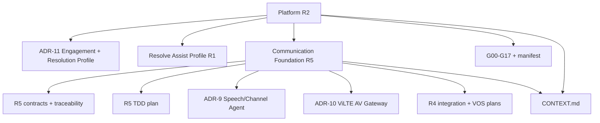

# Converact 设计文档导航与权威顺序

> 快照日期：2026-07-31。本文只导航当前 Converact 仓库中已经迁入并裁决的 canonical
> 评审资产；来源路径和逐文件 SHA-256 见架构来源账本。

当前产品层次固定为 `Converact Platform → Converact Fabric / Converact Engage /
Converact Agent Runtime / Converact Resolve`。本文导航的是已经迁入仓库的 canonical
文件；旧桌面目录只作为来源账本中的历史快照，不再是第二份文档权威。

## 1. Canonical authority

| 顺序 | 文档 | 决定什么 | 当前状态 |
| --- | --- | --- | --- |
| 1 | [平台范围 R2](./2026-07-31-ai-native-multimodal-communications-execution-platform-r2.md) | Converact 平台类别、Engagement/Profile/Offer/Option、跨产品 Gate | `accepted_scope_direction`；实现/市场/生产未因此通过 |
| 2 | [ADR-CCAAS-11](../adr/ccaas-11-engagement-platform-and-resolution-profile.md) | Engagement 为平台核心、Resolution 为首个 Profile | `accepted` |
| 3 | [统一通信底座 R5](./unified-communication-foundation-r5.md) | SIP、Call、媒体、LiveKit、Speech channel、ViLTE 接口和性能资格 | `accepted architecture / target`；未证明项 `not_run` |
| 4 | [R5 TDD 实施计划](./2026-07-31-unified-communication-foundation-r5-implementation-plan.md) | R5 通信实现顺序、测试、故障和 Evidence | `planned` |
| 5 | [Resolve Assist Profile R1](./2026-07-31-ai-native-multimodal-resolution-platform-r1.md) | 首个 `resolution` Profile、Offer、Pilot、B1、ROI 和 Stop Gate | `retained_vertical_profile / proposed_for_profile_review` |
| 6 | [AI 外呼与 Voice Agent 平台 R1](./2026-08-31-ai-outbound-active-call-platform-r1.md) | 行业通用 AI 外呼、Active Call 电话 Channel Agent、Campaign/Attempt/Tool/Handoff 权威和功能优先实施边界 | `accepted_design / controlled_tracer_bullet_passed / production_not_run` |
| 7 | [AI 外呼 Active Call Tracer Bullet R1 计划](../plans/2026-08-31-ai-outbound-active-call-tracer-bullet-r1.md) | Rust Agent/Campaign/Attempt、Active Call、RustPBX RWI、持久化与首条功能闭环的逐步 TDD 计划 | `planned` |
| 8 | [AI 外呼 Tool Broker 与 Action Receipt R1](./2026-08-31-ai-outbound-tool-action-r1.md) | Tool Proposal、Policy/Approval、幂等 Action、Receipt、恢复和 generation fence | `accepted_from_ai_outbound_r1 / implementation_not_started` |
| 9 | [Tool Broker TDD 实施计划](../plans/2026-08-31-ai-outbound-tool-action-r1.md) | 独立 Rust Tool Broker、持久化 Adapter 与 Active Call Worker 接线 | `planned` |

权威冲突时按领域裁决，而不是简单“新文件覆盖所有旧文件”：

- 平台/产品上位语义：R2 + ADR-CCAAS-11；
- 通信、媒体和性能：R5；
- Resolve 售后垂直细节：R1，但必须使用 R2 的 Engagement 映射；
- 实际执行顺序和状态：[Goal manifest](../../goals/manifest.json) 与单个 Goal；
- 旧代码和旧设计事实：只能在 G00 追踪后吸收，不能恢复为平行 Authority。

## 2. 通信 R4 保留资产

R5 完整继承而未删除以下 R4 设计细节：

- [RustPBX × rvoip 选择性融合设计](./rvoip-converact-communication-foundation-integration-design.md)
- [VOS5000 对标与 100K 性能计划](./communication-foundation-vos5000-parity-performance-plan.md)
- [ADR-CCAAS-5：Media Authority 与 RTPengine](../adr/ccaas-5-media-authority-and-rtpengine.md)
- [ADR-CCAAS-7：RustPBX 与 rvoip 能力吸收](../adr/ccaas-7-rvoip-rustpbx-replacement-and-extraction.md)
- [ADR-CCAAS-8：Voice/SIP 与 LiveKit Handoff](../adr/ccaas-8-voice-livekit-bridge-handoff.md)
- [R4 TDD 计划](../plans/2026-07-29-unified-voice-foundation-r4.md)

R4 的 canonical 计划已经迁入 [docs/plans](../plans/2026-07-29-unified-voice-foundation-r4.md)；
`docs/superpowers/` 仅作为历史来源目录存在，不再是当前工作流或权威入口。R2 迁移计划同样
位于 [docs/plans](../plans/2026-07-31-platform-scope-engagement-domain-r2.md)，且不依赖任何
特定 Agent 框架。

## 3. R5 新增边界资产

- [ADR-CCAAS-9：Channel Agent 与 Speech Runtime](../adr/ccaas-9-channel-agent-and-speech-runtime.md)
- [ADR-CCAAS-10：ViLTE 与 LiveKit AV Gateway](../adr/ccaas-10-vilte-livekit-av-participant-gateway.md)
- [AI 外呼与 Voice Agent 平台 R1](./2026-08-31-ai-outbound-active-call-platform-r1.md)
- [Active Call source lock](../../infra/converact/active-call/source-lock.json)
- [Active Call upstream notice](../../infra/converact/active-call/UPSTREAM.md)
- [统一领域语言](../../CONTEXT.md)
- [R5 machine contract](../capacity/contracts/unified-communication-foundation-r5-v1.json)
- [R5 machine contract schema](../capacity/schemas/unified-communication-foundation-r5.schema.json)
- [R5 traceability](../capacity/contracts/unified-communication-foundation-r5-traceability-v1.json)
- [R5 traceability schema](../capacity/schemas/unified-communication-foundation-r5-traceability.schema.json)

## 4. 文档关系

## 5. 状态与证据规则

- `target/planned` 不是 `production_eligible`。
- 厂商公开数据、mock、loopback 和 microbenchmark 不构成 Converact 生产 Evidence。
- Platform、Profile、Capability 和 Deployment Option 各自签署 Gate；一种失败不改写另一种。
- Overlay、Native、Bridge、Speech、ViLTE、普通媒体和解码媒体不能继承彼此容量结果。
- 新增或修改文档必须更新本导航、Goal trace 和 manifest SHA-256；未证明项保持 `not_run`。

## 6. 历史文档边界

项目根仓库中的旧 CCaaS vision、architecture-v3、product design、master plan、旧 AI-native
和早期媒体计划没有复制到这个自包含包。它们是 G00 的 `superseded_reference`/现状审计
输入，不是本目录的可点击 canonical 入口，也不得覆盖 R2/R5/R1 的权威分层。

## 7. 变更记录

| 日期 | Revision | 变更 |
| --- | --- | --- |
| 2026-07-31 | R5 navigation | 增加通信 R5、Agent/HF、ViLTE 和 R4 继承入口 |
| 2026-07-31 | R2 navigation | 将 Converact 上位范围改为 Communications & Execution Platform；Resolve 保留为首个 Profile |
| 2026-07-31 | R2.1 navigation | 删除本自包含包中不存在的旧文档假链接；明确新计划不使用历史 Agent 框架路径 |
| 2026-08-31 | AI outbound R1 navigation | 增加 Active Call 电话 Channel Agent 与行业通用 AI 外呼设计入口 |
| 2026-08-31 | AI outbound R1 checkpoint | 首条 Rust 受控 tracer bullet 已有本地证据；真实 SIP/PSTN、供应商、性能与生产仍为 `not_run` |
| 2026-08-31 | Tool Action R1 | 固定跨通道 Tool Broker、审批、Effect Receipt、恢复和最小精准测试策略 |
