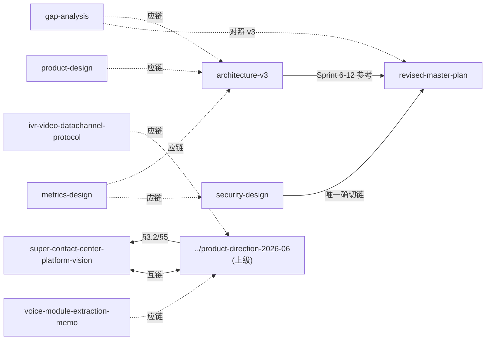

# OPC 设计文档区 — 导航与治理

> 本文件是 `docs/design/` 的导航与治理入口。新增/修改本目录任意 `.md` 前，先读本文件。
> **快照日期**：2026-07-21（Kamailio/通信底座裁决已按 MIX-100K 目标重扫）

---

## 1. 文档清单与角色

| 文档 | 行数 | 版本 | 日期 | 角色 | 状态 |
|------|------|------|------|------|------|
| [super-contact-center-platform-vision.md](./super-contact-center-platform-vision.md) | ~1817 | 1.3 | 2026-06-29 | 战略北极星 + 四 Phase 路线图 + 九大模块 + §5 架构图 | 活跃 |
| [architecture-v3.md](./architecture-v3.md) | ~1451 | v3.1 | 2026-06-29 | 实现级架构规格（Sprint 1-12）；正文已标 `【现状】`/`【目标态】` | 活跃 |
| [product-design.md](./product-design.md) | ~1146 | v2.2 | 2026-06-29 | 产品设计：角色/矩阵/用户故事/MVP/定价（CCaaS） | 活跃 |
| [revised-master-plan.md](./revised-master-plan.md) | ~990 | v3.1 | 2026-06-29 | 110 功能对标 + Sprint 1-12；禁用词已标注 | 活跃 |
| [security-design.md](./security-design.md) | ~830 | 1.2 | 2026-06-29 | 威胁模型/隔离/认证/合规；Kong/Keycloak 已标 `【已废】` | 活跃 |
| [metrics-design.md](./metrics-design.md) | ~520 | 1.1 | 2026-06-29 | KPI/SLI/SLO/告警；ClickHouse 已标延后 | 活跃 |
| [gap-analysis.md](./gap-analysis.md) | ~280 | — | 2026-06-29 | 代码 vs 计划 gap + 2026-06-29 校准段 | 活跃 |
| [voice-module-extraction-memo.md](./voice-module-extraction-memo.md) | ~120 | — | 2026-06-29 | `@opc/voice` 抽包备忘（14 表） | 未实施 |
| [ivr-video-datachannel-protocol.md](./ivr-video-datachannel-protocol.md) | 76 | VC-3 | 2026-06-25 | IVR 视频 / DataChannel 事件协议 | Draft（明确标注待确认项） |
| [communication-foundation-production-completion.md](./communication-foundation-production-completion.md) | — | 执行基线 | 2026-07-21 | IM/SIP/视频集群完备性与后续 Goals | 活跃、覆盖早期 MVP 裁决 |
| [kamailio-sip-edge-design.md](./kamailio-sip-edge-design.md) | — | 执行设计 | 2026-07-21 | Kamailio/RustPBX Cell/Zone 路由与故障语义 | 活跃 |
| [quic-video-transport-assessment.md](./quic-video-transport-assessment.md) | — | 技术裁决 | 2026-07-21 | QUIC/RoQ、LiveKit 与传输竞争治理 | 活跃、RoQ 仅实验 |

**上级文档**（不在本目录）：[../product-direction-2026-06.md](../product-direction-2026-06.md) — 产品方向总纲 v1.1（2026-06-29 CCaaS 校准）。

---

## 2. 文档关系图（实测）

> 下方为本次审计实测到的引用关系 —— 当前是稀疏网络，**几乎不互链**是其系统性弱点。

**实线** = 当前存在；**虚线** = 建议补链（同目录文档间孤岛是最大问题）。
**建议**：每份文档头部加 `<关联文档>` block，与本文件 §1 清单互链。

---

## 3. 已移除/延后组件 — 全局禁用词汇表

> 下列 5 个组件在各份文档中常被当作"在线控制项"写入正文，导致跨文档自相矛盾（详见审计报告矛盾 A）。
> **强制规则**：在本目录任意文档中出现以下词时，**必须**按本表标注前缀；不得在未标注情况下出现在"现状/控制项"语境中。

| 词 | 决策 | 当前形态 | 出现时必须标注 |
|----|------|----------|----------------|
| **Chatwoot** | 移除（architecture-v3 §附录 L1432：ChannelAdapter 自建替代） | 全渠道改 `omnichannel/` 自建 adapters | `【已废】` 前缀；除"历史/迁移说明"外不得列为交付物 |
| **Kong** | 延后/替换（vision §5.5、security-design L20、gap-analysis L209） | OPC 自带 `src/middleware/auth.ts` | `【已废·目标态无】` 前缀；不得作为限流/WAF 控制项写入"现状" |
| **Keycloak** | 替换（architecture-v3 L1428、security-design L21） | 自签 JWT + bcrypt（`src/middleware/auth.ts`） | `【已废·替换为自签 JWT】` 前缀；不得把 Token/密码存储写入"Keycloak DB" |
| **Kamailio** | **已重新启用**（2026-07-21 MIX-100K/Cell 生产裁决） | Kamailio SIP Edge + RustPBX B2BUA 节点池；本地签名快照、容量加权、dialog pin、drain/failover | 现行生产设计无需“延后”前缀；旧文档中的 `【延后·v2.0+】` 只可保留为 1000 路以内 MVP 历史记录 |
| **ClickHouse** | 延后（vision L835「PG 物化视图够用前期」） | PostgreSQL 物化视图 | `【延后·Phase 4+ 评估】` 前缀；不得作为当前 Dashboard/追踪数据源 |

**2026-06-29 文档治理批次**的历史修改仍保留。2026-07-21 起，Kamailio 的生产权威以
`communication-foundation-production-completion.md` 和 `kamailio-sip-edge-design.md` 为准；
其余组件继续按上表前缀治理。若再发现把 Kamailio 当作当前“延后”的文字，必须标明那是早期
MVP 历史裁决，不得覆盖现行 Cell 架构。

---

## 4. 现状 vs 目标态标记规范

为消除"一份文档把目标态写成现状"的普遍问题：

1. **现状断言**（`✅/已完成/存在/缺失/有` 等）必须附 `核查日期=YYYY-MM-DD`，并以实际 `ls`/`grep`/`git log` 为据。
   例：`src/ws.ts 已存在（核查日期=2026-06-29）`
2. **目标态**项必须前缀 `【目标态】`，禁止与现状断言混排。
3. **移除/延后**项必须按 §3 表前缀标注，禁止裸出现。
4. **快照**：任何"现状校准"章节必须显式标注快照日期；隐式日期（藏在表头）不算。

---

## 5. 时间轴双轨（Sprint vs Phase）

当前两条不可通约的时间箱并存，需在引用时显式注明轨道：

| 轨道 | 来源 | 起点 | 单位 | 适用 |
|------|------|------|------|------|
| **Sprint** | `revised-master-plan.md` §11 | 2026-06-22 | 12 个 sprint | 实施级功能排期 |
| **Phase** | `vision.md` §6 / `product-direction` §8 | Phase 0=2026-03 | Phase 0–4 / 0–6 | 战略级阶段目标 |

引用任一时间点时注明轨道，例：`「Phase 1 可演示」/「Sprint 4 呼入 ACD」`。`revised-master-plan` 与 `product-direction` 之间应建对照表（待补，不在本次范围）。

---

## 6. 文档演进检查清单

每次改 `docs/design/` 任意 `.md`，机械跑以下 5 项：

- [ ] 头部是否含 `<关联文档>` block 并与本文件 §1 互链
- [ ] §3 禁用词未裸出现（含 `【已废】`/`【目标态】`/`【延后】` 标注）
- [ ] 现状断言附 `核查日期=YYYY-MM-DD`
- [ ] 时间点注明轨道（Sprint / Phase）
- [ ] 文档末尾变更日志登记本次改动（version / date / author / 变更）

`vision.md` §附录 D 已有类似清单，本文件将其标准化到全目录。

---

## 7. 本次审计核心结论（速查）

- **跨文档互链**：2026-06-29 批次已在各文档头部补 `<关联文档>`；本文件 §2 关系图仍待重绘为实线网。
- **已废组件**：§3 五词已在正文中标注；勿回退为裸词。
- **时间轴双轨**：见 §5；Sprint↔Phase 对照表仍待补。
- **与代码对照**：以各文档「现状校准（核查日期=2026-06-29）」为准；SQLite 主库、SSE 等 gap 仍 open。
