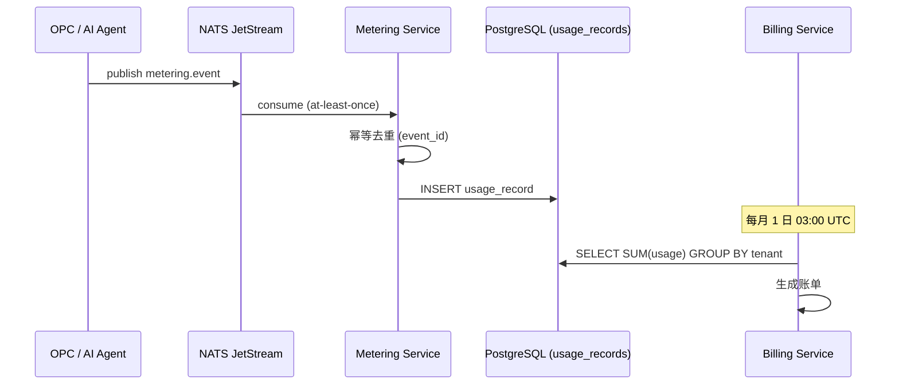
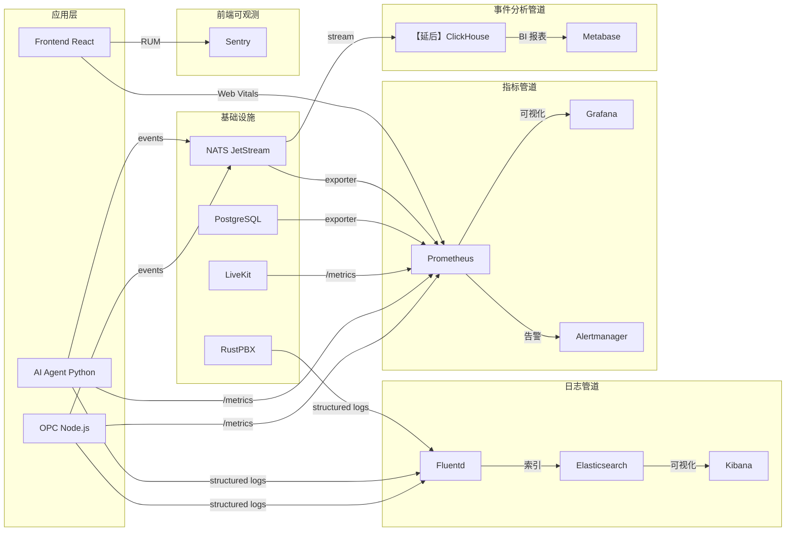
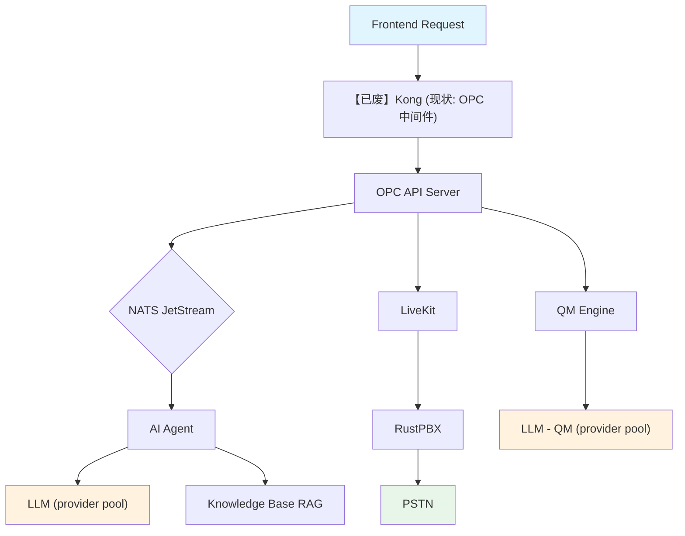

# OPC AI 通信平台 — 指标与可观测性设计

> **版本**: 1.1（按 `docs/design/README.md` 准绳去陈旧与标注目标态）
> **最后更新**: 2026-06-29
> **适用范围**: OPC 多租户 SaaS AI 语音/视频呼叫中心平台
>
> **关联文档**（见 `docs/design/README.md`）：[安全与合规](./security-design.md)（告警通道对齐 §8.4）· [实现级架构规格](./architecture-v3.md) · [总体规划](./revised-master-plan.md) · [战略北极星](./super-contact-center-platform-vision.md) · [产品设计](./product-design.md) · [本目录导航与治理](./README.md)
>
> **陈旧校准（2026-06-29）**：本文原基于 DeepSeek 唯一 LLM、Kong 网关、ClickHouse 数据源撰写。按 `README.md` §3 禁用词表与 `product-direction-2026-06.md` §7 实际技术栈：
> - **LLM** 现为多 provider（Claude/GPT-4o/Qwen/DeepSeek 等），DeepSeek 不再是唯一 provider；本文 LLM 并发容量数字按"单个 provider rate limit"理解，平台整体并发以聚合池为准
> - **Kong 网关** 已废（见 `security-design.md` §0），追踪链与限流由 OPC 中间件承担
> - **ClickHouse** 延后（`vision.md` §5.5「PG 物化视图够用前期」），当前 Dashboard 数据源用 PostgreSQL 物化视图，业务事件亦存 PG
> 下文相应位置已加 `【目标态】`/ `【已废】` / `【延后】` 行内标注。

---

## 目录

1. [业务 KPI 体系](#1-业务-kpi-体系)
2. [技术 SLI / SLO 定义](#2-技术-sli--slo-定义)
3. [告警规则设计](#3-告警规则设计)
4. [计费计量精度](#4-计费计量精度)
5. [Dashboard 设计](#5-dashboard-设计)
6. [数据采集架构](#6-数据采集架构)
7. [日志规范](#7-日志规范)
8. [分布式追踪](#8-分布式追踪)

---

## 1. 业务 KPI 体系

### 1.1 平台运营 KPIs

面向 **平台运营团队**，衡量整体平台健康度与增长。

| 指标名称 | 定义 | 计算公式 | 目标值 | 数据来源 |
|---------|------|---------|--------|---------|
| 月活跃租户数 (MAT) | 当月有至少 1 次通话的租户 | `COUNT(DISTINCT tenant_id) WHERE calls > 0` | 增长 20%/月 | `voice_call_sessions` |
| 月通话量 | 全平台总通话数 | `COUNT(*) FROM voice_call_sessions WHERE month = current` | — | `voice_call_sessions` |
| AI 处理率 | AI 独立完成的通话占比 | `ai_handled / total_calls` | > 70% | `voice_call_sessions` |
| 转化率 | 高意向通话占比 | `COUNT(intent_score >= 0.7) / total` | > 15% | `ai_conversation_turns` |
| MRR | 月经常性收入 | `SUM(plan_price * active_seats)` | — | `billing_subscriptions` |
| Churn Rate | 月流失率 | `cancelled_this_month / total_active_start_of_month` | < 5% | `billing_subscriptions` |

### 1.2 租户级 KPIs

面向 **每个租户**，支撑租户 Dashboard 与运营报告。

| 指标 | 定义 | 目标 |
|------|------|------|
| 接通率 | 成功接通的外呼 / 总外呼 | > 60% |
| 首次解决率 (FCR) | 单次通话即解决问题的比例 | > 80% |
| 平均通话时长 (AHT) | 通话时长均值 | < 5 min（外呼） |
| 客户满意度 (CSAT) | 通话后客户评分 | > 4.0 / 5.0 |
| QM 平均分 | 质检评分均值（5 维度加权） | > 0.75 |
| 坐席利用率 | `busy_time / available_time` | 70–85% |
| 排队等待时间 | 转人工后客户等待时长 | < 30 s |

### 1.3 AI 性能 KPIs

面向 **AI 工程团队**，衡量模型效果与可靠性。

| 指标 | 定义 | 目标 |
|------|------|------|
| 意向判断准确率 | LLM score 与人工标注一致率 | > 85% |
| 知识库命中率 | 有效回答次数 / 总查询次数 | > 70% |
| 话术遵守率 | `script_adherence` 评分均值 | > 0.8 |
| 幻觉率 | 回答内容与知识库不符的比例 | < 5% |

---

## 2. 技术 SLI / SLO 定义

### 2.1 可用性 SLI

| 服务 | SLI 定义 | SLO | 错误预算/月 |
|------|---------|-----|------------|
| OPC API | 成功请求比例（非 5xx） | 99.9% | 43.2 min |
| AI Agent | 成功加入 LiveKit 房间比例 | 99.5% | 3.6 hr |
| LiveKit | 房间创建成功率 | 99.9% | 43.2 min |
| QM Engine | 评分任务完成率 | 99.0% | 7.2 hr |
| Frontend | 页面加载成功率（LCP < 4s） | 99.5% | 3.6 hr |

> **错误预算计算**：`(1 - SLO) × 30 × 24 × 60 min`

### 2.2 延迟 SLI

| 操作 | P50 目标 | P95 目标 | P99 目标 |
|------|---------|---------|---------|
| API 响应 | < 50 ms | < 200 ms | < 500 ms |
| 来电接通（dial → audio） | < 2 s | < 4 s | < 6 s |
| AI 首次回复 | < 1.5 s | < 3 s | < 5 s |
| 转人工接通 | < 3 s | < 10 s | < 30 s |
| QM 评分完成 | < 10 s | < 30 s | < 60 s |
| 知识库查询 | < 200 ms | < 500 ms | < 1 s |

### 2.3 吞吐量 SLI

| 资源 | 目标 | 限制因素 |
|------|------|---------|
| 并发通话数 | 100 / 节点 | LiveKit worker + CPU |
| API QPS | 1000 / 节点 | Node.js event loop |
| NATS 消息/秒 | 10,000 | NATS JetStream 磁盘 I/O |
| LLM 并发请求 | 50 / provider | 【已废·DeepSeek 唯一】原 DeepSeek API rate limit；现状按"单 provider 50 并发"为单元，平台聚合多 provider 后整体并发 = N × 单 provider cap（见头部校准） |

---

## 3. 告警规则设计

### 3.1 Critical（P1 — 立即处理）

| 告警名 | 条件 | 通知方式 | 处理 SLA |
|--------|------|---------|---------|
| `API_DOWN` | 5xx 率 > 10% 持续 1 min | PagerDuty + SMS | 5 min |
| `DB_CONNECTION_FAILED` | PostgreSQL 连接池耗尽 | PagerDuty | 5 min |
| `LIVEKIT_UNREACHABLE` | health check 连续失败 3 次 | PagerDuty | 5 min |
| `PAYMENT_PROCESSING_FAILED` | Stripe webhook 处理失败率 > 50% | PagerDuty | 15 min |
| `NATS_CLUSTER_DOWN` | JetStream 不可用 | PagerDuty + SMS | 5 min |

### 3.2 Warning（P2 — 1 小时内处理）

| 告警名 | 条件 | 通知方式 |
|--------|------|---------|
| `HIGH_LATENCY` | API P95 > 500 ms 持续 5 min | Slack `#ops-alerts` |
| `LLM_DEGRADED` | 【已废·单一 DeepSeek】原"DeepSeek 错误率 > 20%"；现状按 `opc_ai_llm_requests_total{status="error"}` 跨 provider 聚合，单 provider 故障不告警（按头部校准） | Slack `#ops-alerts` |
| `QUEUE_BACKING_UP` | 等待转人工 > 10 人 | Slack `#ops-alerts` |
| `DISK_SPACE_LOW` | 可用空间 < 20% | Slack `#ops-alerts` |
| `QM_SCORING_BACKLOG` | 待评分通话 > 50 | Slack `#qm-alerts` |
| `ERROR_BUDGET_BURN_HIGH` | 14 天 burn rate > 2x | Slack `#ops-alerts` |

### 3.3 Info（P3 — 工作时间处理）

| 告警名 | 条件 | 通知方式 |
|--------|------|---------|
| `QUOTA_NEAR_LIMIT` | 租户月用量 > 80% 额度 | Email → 租户管理员 |
| `NEW_LOW_QM_SCORE` | QM 评分 < 0.4 | Slack `#qm-review` |
| `CERT_EXPIRING` | TLS 证书 < 14 天过期 | Slack `#ops-alerts` |
| `DAILY_ANOMALY` | 日通话量偏离 7 天均值 > 2σ | Slack `#analytics` |

---

## 4. 计费计量精度

### 4.1 计量维度

| 计费维度 | 计量单位 | 精度 | 采集时机 | 存储周期 |
|---------|---------|------|---------|---------|
| AI 通话分钟 | 秒 → 分钟（向上取整） | 1 分钟 | `call_ended` 事件 | 永久 |
| 工具调用次数 | 次 | 1 次 | 每次 `tool_call` | 永久 |
| 活跃坐席数 | 席 | 月峰值 | daily snapshot | 13 个月 |
| 存储用量 | MB | 1 MB | hourly aggregate | 永久 |
| 知识库查询 | 次 | 1 次 | 每次查询 | 永久 |

### 4.2 计费规则

| 项目 | 说明 |
|------|------|
| 计费周期 | 自然月（UTC 时区） |
| 对账时间 | 每月 1 日 03:00 UTC 生成用量快照 |
| 争议窗口 | 保留原始事件 90 天用于审计 |
| 幂等性 | 每条计量记录携带唯一 `metering_event_id`，重复投递不重复计费 |
| 容错 | 采集失败时写入死信队列，72h 内补偿重放 |

### 4.3 计量数据流



---

## 5. Dashboard 设计

### 5.1 平台运营 Dashboard

**受众**：平台运营团队  
**刷新频率**：实时（10s 间隔）

| 面板 | 类型 | 数据源 |
|------|------|--------|
| 实时并发通话数 | Gauge | Prometheus `opc_active_calls` |
| 30 天通话量趋势 | Line Chart | 【延后·Phase 4+】原 ClickHouse `voice_call_sessions`；现状 PostgreSQL 物化视图（见头部校准） |
| 按租户排名 TOP 10 | Bar Chart | 【延后·Phase 4+】原 ClickHouse；现状 PostgreSQL 物化视图聚合 |
| 告警时间线 | Event Timeline | Alertmanager |
| 错误率热力图 | Heatmap (hour × day) | Prometheus `opc_http_errors_total` |
| MAT / MRR 月趋势 | Stat + Sparkline | PostgreSQL `billing_subscriptions` |

### 5.2 租户管理 Dashboard

**受众**：租户管理员（前端嵌入）  
**刷新频率**：1 min

| 面板 | 类型 | 说明 |
|------|------|------|
| 今日通话统计 | 4 × Stat Card | 总数、接通率、AI 处理率、平均 QM |
| 本周通话趋势 | Area Chart | 按日聚合 |
| 意向分布 | Pie Chart | 高 / 中 / 低 / 无意向 |
| 坐席实时状态 | Status Table | 在线 / 忙碌 / 离线 |
| 最近低分通话 | Table | QM < 0.5 的最近 20 条 |

### 5.3 QM 质检 Dashboard

**受众**：质检主管  
**刷新频率**：5 min

| 面板 | 类型 | 说明 |
|------|------|------|
| 5 维度雷达图 | Radar Chart | 全租户平均评分 |
| 评分分布 | Histogram | 0.0–1.0 分桶 |
| 违规类型 TOP 5 | Bar Chart | 按违规标签聚合 |
| 周趋势对比 | Line Chart | 本周 vs 上周 |
| 坐席排名 | Leaderboard Table | 按 QM 均分降序 |

### 5.4 运维 Dashboard（Grafana）

**受众**：SRE / DevOps  
**刷新频率**：实时（5s）

| 面板 | 类型 | 说明 |
|------|------|------|
| RED Metrics per Service | Multi-stat | Rate / Error / Duration |
| Pod CPU & Memory | Time Series | K8s `container_*` metrics |
| NATS Consumer Lag | Gauge + Line | `nats_consumer_pending` |
| PostgreSQL 连接 & 查询延迟 | Time Series | `pg_stat_activity`, `pg_stat_statements` |
| LiveKit Room & Participant Count | Gauge | `livekit_room_count` |
| Error Budget Burn-down | Line Chart | 剩余预算 vs 时间 |

---

## 6. 数据采集架构

### 6.1 总体架构



### 6.2 技术选型理由

| 组件 | 选型 | 理由 |
|------|------|------|
| 指标存储 | Prometheus + Thanos | 时序高效、生态成熟、长期存储 | 现状：prometheus-compose dev 服务，生产部署见 `architecture-v3.md` §10 |
| 日志存储 | Elasticsearch | 全文检索、结构化查询 | 现状：仅结构化 stdout 落盘，ES 管道为目标态 |
| 事件分析 | 【延后·Phase 4+】ClickHouse | 列式存储、高吞吐聚合查询 | 现状用 PostgreSQL 物化视图（见头部校准） |
| 告警 | Alertmanager | 原生 Prometheus 集成、分组/抑制/静默 | 现状：基础 alert rules，需接通知通道（见 §3） |
| 可视化 | Grafana + 前端自建 | 运维用 Grafana，租户用前端嵌入 | 现状：前端嵌入面板已有，Grafana dev 可用 |
| 追踪 | OpenTelemetry + Jaeger | 厂商无关、W3C TraceContext | 现状：trace_id 已注入日志，全链路 OTel 未接 |
| 前端监控 | Sentry | 错误追踪 + Performance | 现状：未接，Sentry 仅目标态 |

### 6.3 数据保留策略

| 数据类型 | 热存储 | 冷存储 | 总保留 |
|---------|--------|--------|--------|
| 原始指标（Prometheus） | 15 天 | Thanos S3（降采样） | 13 个月 |
| 日志（Elasticsearch） | 7 天 | S3 归档 | 90 天 |
| 业务事件（【延后】ClickHouse / 现状 PostgreSQL 物化视图） | 90 天 | S3 cold tier | 永久 |
| 追踪（Jaeger） | 7 天 | — | 7 天 |
| 计费事件 | 永久（PostgreSQL） | — | 永久 |

---

## 7. 日志规范

### 7.1 结构化日志格式

所有服务统一使用 JSON 格式输出日志，必需字段：

```json
{
  "timestamp": "2026-06-15T10:30:00.123Z",
  "level": "info",
  "service": "opc",
  "instance": "opc-7b8f9c-abc12",
  "tenant_id": "t_123",
  "trace_id": "4bf92f3577b34da6a3ce929d0e0e4736",
  "span_id": "00f067aa0ba902b7",
  "event": "call.started",
  "call_session_id": "cs_789",
  "duration_ms": 150,
  "message": "Outbound call initiated"
}
```

### 7.2 日志级别定义

| 级别 | 语义 | 生产环境 | 示例 |
|------|------|---------|------|
| `ERROR` | 需要立即关注的错误 | ✅ 始终开启 | DB 连接失败、外部 API 5xx |
| `WARN` | 降级或异常但不影响核心服务 | ✅ 始终开启 | LLM fallback、重试成功 |
| `INFO` | 关键业务事件 | ✅ 始终开启 | 通话开始/结束、转人工、质检完成 |
| `DEBUG` | 开发调试信息 | ❌ 默认关闭 | 请求/响应体、中间状态 |

### 7.3 必需上下文字段

| 字段 | 类型 | 说明 | 何时填充 |
|------|------|------|---------|
| `tenant_id` | string | 租户标识 | 请求认证后 |
| `trace_id` | string | W3C TraceContext trace ID | 所有请求 |
| `span_id` | string | 当前 span ID | 所有请求 |
| `call_session_id` | string | 通话会话 ID | 通话相关操作 |
| `user_id` | string | 操作用户 | 有用户上下文时 |
| `agent_id` | string | AI Agent 实例 ID | Agent 相关操作 |

### 7.4 敏感信息处理

| 类型 | 处理方式 |
|------|---------|
| 手机号 | 脱敏显示 `138****1234` |
| 通话内容 | 不写入日志，仅存储于加密的通话记录表 |
| API Key / Token | 禁止出现在日志中 |
| 租户业务数据 | 仅记录 ID 引用，不记录原始数据 |

---

## 8. 分布式追踪

### 8.1 追踪链路

> 目标态拓扑图。`Kong` 节点为【已废】（现状鉴权/限流在 OPC 中间件，无独立网关节点）；`DeepSeek LLM` 节点为多 provider 中之一（现状按 LLM provider pool 路由，非 DeepSeek 唯一，见头部校准）。



典型通话追踪链：

```
Frontend request
└── 【已废】Kong gateway (auth, rate limit) 【现状: OPC 中间件鉴权 + per-IP 限流】
    └── OPC API handler
        ├── NATS publish (call.initiate)
        │   └── AI Agent consumer
        │       ├── LiveKit room.join
        │       ├── LLM completion (多轮, provider pool) 【原 DeepSeek-only, 已废】
        │       └── Knowledge base query
        ├── LiveKit create room
        │   └── RustPBX SIP INVITE
        │       └── PSTN dial
        └── QM evaluate (async, call_ended 后)
            └── LLM completion (评分, provider pool) 【原 DeepSeek-only, 已废】
```

### 8.2 关键 Span 定义

| Span 名称 | 服务 | 关键属性 |
|-----------|------|---------|
| `http.request` | OPC API | `http.method`, `http.route`, `http.status_code` |
| `nats.publish` / `nats.consume` | OPC / AI Agent | `nats.subject`, `nats.stream` |
| `ai.agent.join` | AI Agent | `room_id`, `participant_identity` |
| `llm.completion` | AI Agent | `model`, `prompt_tokens`, `completion_tokens`, `duration_ms` |
| `rag.query` | AI Agent | `collection`, `top_k`, `relevance_score` |
| `sip.invite` | RustPBX | `caller`, `callee`, `codec` |
| `qm.evaluate` | QM Engine | `session_id`, `score`, `dimensions` |
| `db.query` | OPC | `db.statement`(参数化), `db.rows_affected` |

### 8.3 采样策略

| 场景 | 采样率 | 理由 |
|------|--------|------|
| 错误请求 | 100% | 每个错误都需要可追踪 |
| 延迟 > P95 | 100% | 慢请求需要分析 |
| 正常请求 | 10% | 控制存储成本 |
| 通话会话 | 100% | 业务关键链路，全量采集 |
| 健康检查 | 0% | 无分析价值 |

### 8.4 Trace 传播

| 传播方式 | 场景 |
|---------|------|
| W3C `traceparent` HTTP Header | HTTP 服务间调用 |
| NATS Message Header `traceparent` | 异步消息传递 |
| LiveKit Participant Metadata | 房间内 Agent 关联 |
| SIP `X-Trace-ID` Header | SIP/PSTN 链路（尽力传播） |

---

## 附录 A：Prometheus 指标命名规范

```
# 格式: <namespace>_<subsystem>_<name>_<unit>
# 示例:
opc_http_requests_total{method, route, status}
opc_http_request_duration_seconds{method, route}
opc_active_calls{tenant_id}
opc_call_duration_seconds{tenant_id, direction}
opc_ai_llm_requests_total{model, status}
opc_ai_llm_duration_seconds{model}
opc_qm_score{tenant_id, dimension}
opc_nats_messages_total{subject, status}
opc_billing_usage_total{tenant_id, dimension}
```

## 附录 B：告警路由配置示例（Alertmanager）

```yaml
route:
  receiver: default-slack
  group_by: [alertname, tenant_id]
  group_wait: 30s
  group_interval: 5m
  repeat_interval: 4h
  routes:
    - match:
        severity: critical
      receiver: pagerduty-critical
      repeat_interval: 5m
    - match:
        severity: warning
      receiver: slack-ops
      repeat_interval: 1h
    - match:
        severity: info
      receiver: slack-info
      repeat_interval: 24h

receivers:
  - name: pagerduty-critical
    pagerduty_configs:
      - service_key: <PD_SERVICE_KEY>
  - name: slack-ops
    slack_configs:
      - channel: '#ops-alerts'
        send_resolved: true
  - name: slack-info
    slack_configs:
      - channel: '#ops-info'
  - name: default-slack
    slack_configs:
      - channel: '#ops-alerts'
```

## 附录 C：Grafana 告警规则示例（PromQL）

```promql
# P1: API 5xx 率过高
sum(rate(opc_http_requests_total{status=~"5.."}[1m]))
/ sum(rate(opc_http_requests_total[1m])) > 0.10

# P2: API P95 延迟过高
histogram_quantile(0.95, rate(opc_http_request_duration_seconds_bucket[5m])) > 0.5

# P2: LLM 错误率
sum(rate(opc_ai_llm_requests_total{status="error"}[3m]))
/ sum(rate(opc_ai_llm_requests_total[3m])) > 0.20

# P2: NATS consumer lag
nats_consumer_pending{stream="CALLS"} > 1000

# P3: 错误预算 burn rate (14d window)
1 - (sum(rate(opc_http_requests_total{status!~"5.."}[14d]))
/ sum(rate(opc_http_requests_total[14d]))) > 2 * (1 - 0.999)
```

---

## 变更记录

| 版本 | 日期 | 作者 | 变更内容 |
|------|------|------|---------|
| 1.0 | 2026-06-21 | - | 初始版本：KPI/SLI/SLO/告警/Dashboard/追踪 |
| 1.1 | 2026-06-29 | OPC Team | 按 `docs/design/README.md` §3/§4 准绳去陈旧：(1) LLM 由 DeepSeek 唯一改写多 provider（L96/§3.2/§8.1 节点与树形链/§8.2 span 默认 LLM provider pool）；(2) Kong 追踪节点标【已废】,现状 OPC 中间件；(3) ClickHouse 数据源标【延后·Phase 4+】,现状 PG 物化视图（§5.1/§6.1/§6.2/§6.3）。头部加 `<关联文档>` block 与「陈旧校准」段；§6.2 选型表加"现状"列。未改既有 SLI/SLO 数字与 promQL 规则。 |
