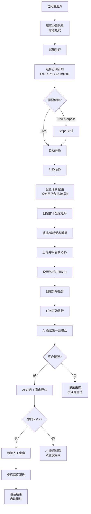
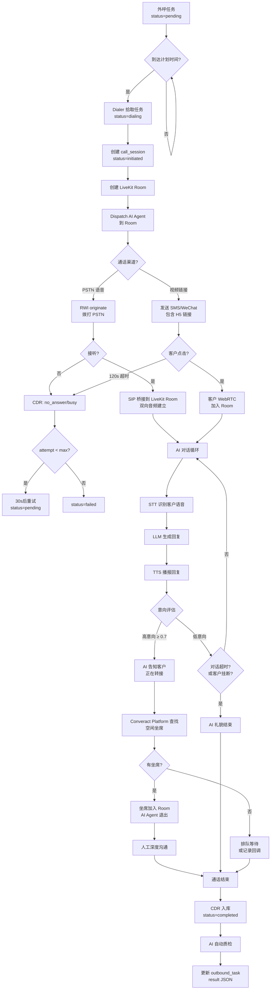
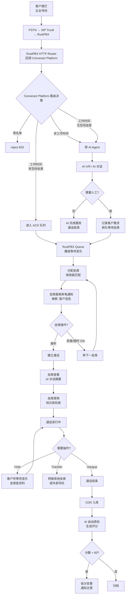
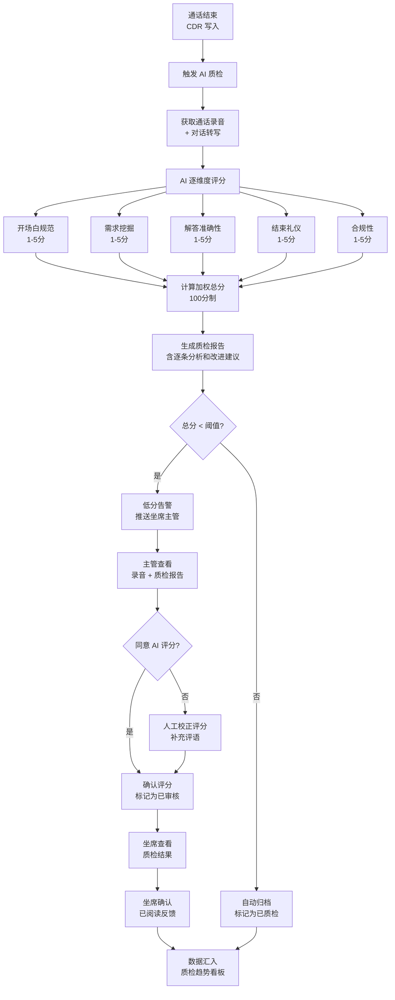
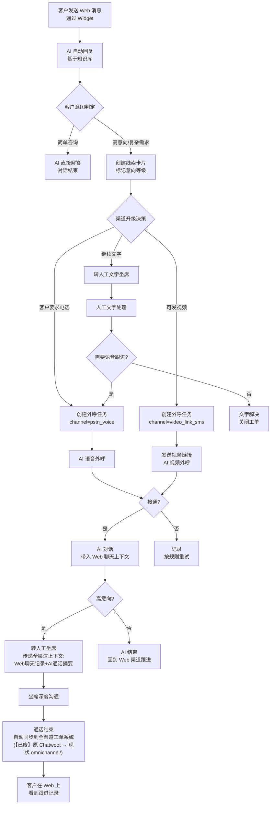
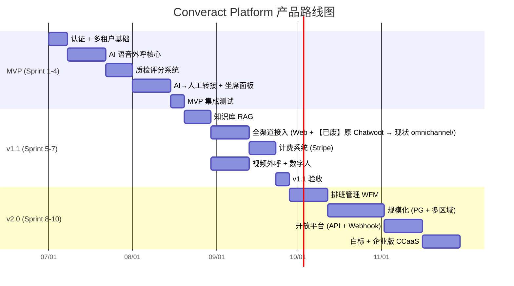

# Converact Platform AI 通讯平台 — 产品设计文档

> **版本**: v2.2（按 `docs/design/README.md` 准绳去 Chatwoot/SSE 污染并补互链）
> **日期**: 2026-06-29
> **状态**: 活跃文档（交付模型：**CCaaS 多租户 SaaS**，见 [超级联络中心愿景](./super-contact-center-platform-vision.md)）
> **关联文档**（见 `docs/design/README.md`）：[实现级架构规格](./architecture-v3.md)（当前权威）· [修订版总规划](./revised-master-plan.md) · [超级联络中心愿景](./super-contact-center-platform-vision.md) · [安全与合规](./security-design.md) · [指标与可观测](./metrics-design.md) · [产品方向总纲](../product-direction-2026-06.md) · [本目录导航与治理](./README.md) · [旧版整体架构](../architecture-video-voice-callcenter.md)（已替代）
>
> **校准（2026-06-29）**：按 README §3 禁用词表，**Chatwoot** 与旧版整体架构方案已废，全渠道改 `omnichannel/` 自建 adapters（见 `architecture-v3.md` 附录）；**SSE** 为现状实时通知实现，目标态为 WebSocket + Redis PubSub（见 `architecture-v3.md` §4）。下文相应位置已加 `【已废】` / `【目标态】` 行内标注。

---

## 目录

1. [用户角色定义 (User Personas)](#1-用户角色定义-user-personas)
2. [功能优先级矩阵 (Feature Priority Matrix)](#2-功能优先级矩阵-feature-priority-matrix)
3. [用户故事 (User Stories)](#3-用户故事-user-stories)
4. [核心用户流程 (Core User Flows)](#4-核心用户流程-core-user-flows)
5. [页面状态机 (Page States)](#5-页面状态机-page-states)
6. [MVP 边界定义](#6-mvp-边界定义)
7. [竞品对标](#7-竞品对标)
8. [定价策略设计](#8-定价策略设计)

---

## 1. 用户角色定义 (User Personas)

### 1.1 平台管理员 (Platform Admin)

| 维度 | 描述 |
|------|------|
| **角色画像** | Converact Platform 平台运维/运营人员，负责多租户环境的整体健康运转 |
| **核心目标** | 确保平台稳定、安全，保障所有租户 SLA；管控成本，优化资源利用率 |
| **关键任务** | ① 租户生命周期管理（创建/暂停/注销）② 系统监控与告警处置 ③ 全局计费核算与账单管理 ④ SIP trunk/运营商线路配置 ⑤ 平台级合规审计（录音保留策略、外呼频率上限） |
| **痛点** | 租户数量增长后手动配置不可扩展；跨租户资源争抢导致服务降级；外呼封号后需要快速切换线路 |
| **成功指标** | 平台可用性 ≥ 99.9%；租户 onboarding 时间 ≤ 30 分钟；月度计费差错率 ≤ 0.1% |

### 1.2 租户管理员 (Tenant Admin / Owner)

| 维度 | 描述 |
|------|------|
| **角色画像** | 企业主或 IT 负责人，购买 Converact Platform 服务后配置自己公司的呼叫中心 |
| **核心目标** | 快速上线 AI 外呼+人工客服混合能力；可视化监控 ROI |
| **关键任务** | ① 坐席账号管理与技能标签分配 ② AI 话术配置与数字人选择 ③ 外呼名单导入与任务创建 ④ IVR 路由规则设定 ⑤ 费用监控与用量限制 ⑥ 知识库维护 |
| **痛点** | 话术调优周期长，缺乏 A/B 测试能力；外呼合规规则复杂（时间窗口、频次限制、AI 标识）；无法量化 AI 外呼 vs 人工的 ROI |
| **成功指标** | 首次外呼上线 ≤ 2 小时；月有效预约数持续增长；AI 外呼成本 < 人工成本的 30% |

### 1.3 坐席主管 (Supervisor)

| 维度 | 描述 |
|------|------|
| **角色画像** | 呼叫中心现场管理者，负责坐席绩效和服务质量 |
| **核心目标** | 实时掌控坐席状态和服务水平；通过质检提升服务质量；合理排班降低人力成本 |
| **关键任务** | ① 实时监控大屏（坐席状态、队列深度、等待时长） ② AI 质检结果审核与评分校正 ③ 通话录音抽检与评分 ④ 坐席排班管理 ⑤ 坐席实时辅助（Whisper/Barge） ⑥ 异常通话干预 |
| **痛点** | 人工质检只能覆盖 5% 的通话；坐席状态不透明，排班依赖经验；AI 转人工时信息断裂，坐席缺乏上下文 |
| **成功指标** | 质检覆盖率 100%（AI 质检）；坐席利用率 ≥ 75%；客户满意度 (CSAT) ≥ 4.2/5.0；平均通话处理时长 (AHT) 持续优化 |

### 1.4 坐席 (Agent)

| 维度 | 描述 |
|------|------|
| **角色画像** | 一线客服/销售人员，通过坐席面板处理语音/视频通话 |
| **核心目标** | 高效处理通话，提供优质服务；减少重复劳动，借助 AI 辅助提升效率 |
| **关键任务** | ① 接听 AI 转人工来电（带客户上下文） ② 视频通话中演示屏幕/共享文档 ③ 查询知识库回答客户问题 ④ 记录通话摘要与后续行动项 ⑤ 手动外呼回访 ⑥ 管理个人状态（空闲/休息/离线） |
| **痛点** | AI 转接时缺乏客户对话摘要，需要客户重复描述；多系统切换（CRM + 知识库 + 通话面板）效率低；视频通话网络不稳定影响体验 |
| **成功指标** | 首次解决率 (FCR) ≥ 80%；转接后 10 秒内掌握客户上下文；日均处理通话数 ≥ 30 通 |

### 1.5 终端客户 (End Customer)

| 维度 | 描述 |
|------|------|
| **角色画像** | 被外呼或主动联系企业的个人/企业客户 |
| **核心目标** | 快速获得所需信息或服务；与真人沟通高价值决策 |
| **关键任务** | ① 接听 AI 外呼电话 / 点击视频链接 ② 与 AI 数字人对话（了解产品/服务） ③ 高意向时无缝转接人工深度沟通 ④ 通过 Web/WhatsApp 发起咨询 ⑤ 预约线下面谈 |
| **痛点** | 骚扰电话太多，对陌生外呼排斥；AI 对话不自然导致挂断；转人工后需要重复描述问题；跨渠道切换体验割裂 |
| **成功指标** | 外呼接听率 ≥ 30%；AI 对话完成率 ≥ 60%（未提前挂断）；转人工后客户满意度 ≥ 4.0/5.0 |

---

## 2. 功能优先级矩阵 (Feature Priority Matrix)

### MoSCoW 分类

| 功能模块 | Must Have (MVP) | Should Have (v1.1) | Could Have (v2.0) | Won't Have |
|----------|:-:|:-:|:-:|:-:|
| **认证与多租户** | | | | |
| 租户注册/登录 (JWT) | ✓ | | | |
| 多租户数据隔离 | ✓ | | | |
| RBAC 角色权限 | ✓ | | | |
| SSO (Google/企微) | | ✓ | | |
| **AI 外呼** | | | | |
| PSTN 语音外呼 (RustPBX + RWI) | ✓ | | | |
| AI 对话引擎 (STT→LLM→TTS) | ✓ | | | |
| 意向评分与自动分级 | ✓ | | | |
| 外呼任务队列与调度 | ✓ | | | |
| 外呼时间窗口与频率限制 | ✓ | | | |
| 视频外呼 (H5 + AI 数字人) | | ✓ | | |
| SMS/微信发送视频链接 | | ✓ | | |
| 多语言话术 (日/中/英) | | ✓ | | |
| 预测式拨号 (Predictive Dialer) | | | ✓ | |
| **质检评分 (QM)** | | | | |
| AI 自动质检 (全量通话) | ✓ | | | |
| 质检评分卡配置 | ✓ | | | |
| 质检结果仪表盘 | ✓ | | | |
| 低分通话自动告警 | ✓ | | | |
| 主管人工复核与评分校正 | | ✓ | | |
| 趋势分析与坐席改进建议 | | | ✓ | |
| **通话转接** | | | | |
| AI→人工盲转 | ✓ | | | |
| AI→人工通报转 (Warm Transfer) | | ✓ | | |
| 坐席间转接 | | ✓ | | |
| 转接时客户上下文传递 | ✓ | | | |
| 多级 IVR 路由 | | ✓ | | |
| **坐席面板 (前端)** | | | | |
| React 坐席工作台 | ✓ | | | |
| 通话控制 (接听/挂断/Hold) | ✓ | | | |
| 实时坐席状态切换 | ✓ | | | |
| 来电弹屏 (客户信息卡片) | ✓ | | | |
| 实时对话转写 (Live Transcript) | | ✓ | | |
| 视频通话面板 (LiveKit) | | ✓ | | |
| 屏幕共享 | | ✓ | | |
| 坐席绩效看板 | | | ✓ | |
| **通话记录** | | | | |
| 通话历史列表与详情 | ✓ | | | |
| 录音回放 (音频) | ✓ | | | |
| 录像回放 (视频) | | ✓ | | |
| 通话摘要 (AI 生成) | | ✓ | | |
| 导出与报表 | | | ✓ | |
| **知识库 (RAG)** | | | | |
| 文档上传与向量化 | | ✓ | | |
| 坐席实时知识检索 | | ✓ | | |
| AI Agent 知识增强 | | ✓ | | |
| 知识库管理后台 | | ✓ | | |
| **全渠道接入** | | | | |
| Web Widget 在线客服 | | ✓ | | |
| 【已废】Chatwoot 集成 → 改 `omnichannel/` 自建 adapters | | ✓ | | |
| WhatsApp Business | | | ✓ | |
| LINE / 企业微信 | | | ✓ | |
| **计费系统** | | | | |
| 用量统计 (通话分钟/AI 分钟) | | ✓ | | |
| 订阅计划管理 | | ✓ | | |
| Stripe 支付集成 | | ✓ | | |
| 用量告警 (配额接近上限) | | ✓ | | |
| 发票生成 | | | ✓ | |
| **排班管理 (WFM)** | | | | |
| 排班表创建与编辑 | | | ✓ | |
| 基于历史数据的排班建议 | | | ✓ | |
| 坐席考勤 | | | ✓ | |
| **规模化** | | | | |
| 水平扩展 (SQLite→PostgreSQL) | | | ✓ | |
| 多区域部署 (日本/中国/美国) | | | ✓ | |
| RustPBX 多实例负载均衡 | | | ✓ | |
| **开放平台** | | | | |
| 公开 REST API + API Key 管理 | | | ✓ | |
| Webhook 事件订阅 | | | ✓ | |
| 白标 (White-label) | | | ✓ | |
| 自建数字人上传 | | | | ✓ |
| 自定义 AI 模型接入 | | | | ✓ |
| 原生移动端 App | | | | ✓ |

---

## 3. 用户故事 (User Stories)

### Sprint 1-2: 认证 + AI 外呼核心

**US-01: 租户注册**

```
作为 租户管理员，
我希望 通过邮箱注册一个新的租户账号并选择订阅计划，
以便 快速开通 AI 外呼服务。

验收标准：
1. 输入公司名、邮箱、密码完成注册，3 秒内收到验证邮件
2. 注册后自动创建租户空间，默认生成一个管理员坐席
3. 注册完成后进入引导流程（选计划 → 配置线路 → 上传名单）
```

**US-02: AI 语音外呼任务创建**

```
作为 租户管理员，
我希望 上传 CSV 外呼名单并选择话术模板创建外呼任务，
以便 批量触达潜在客户。

验收标准：
1. 支持 CSV 上传（姓名、电话、自定义字段），单次上限 10,000 条
2. 可选择话术模板、外呼时间窗口、最大重试次数
3. 创建后任务状态显示为"待执行"，到达计划时间自动开始拨号
4. 无效号码（格式错误）在创建时即提示过滤
```

**US-03: AI 外呼对话与意向评分**

```
作为 AI 系统，
我希望 在接通后按话术脚本与客户对话并实时评估意向，
以便 将高意向客户转交人工跟进。

验收标准：
1. 接通后 1 秒内 AI 开始应答（STT→LLM→TTS 延迟 < 1.5s）
2. 对话过程中每轮记录 turn 日志（角色、内容、意向分）
3. 意向分 ≥ 0.7 时触发转人工请求
4. 通话结束后自动生成对话摘要写入通话记录
```

**US-04: 外呼任务监控**

```
作为 租户管理员，
我希望 实时查看外呼任务的执行进度和统计，
以便 及时调整策略。

验收标准：
1. 任务详情页显示：总数/已拨/接通/高意向/已转接/失败
2. 支持暂停/恢复/取消任务
3. 每 5 秒自动刷新进度数据
```

### Sprint 3: 质检评分

**US-05: AI 自动质检**

```
作为 坐席主管，
我希望 每通通话结束后 AI 自动进行质检评分，
以便 实现 100% 通话覆盖的质量监控。

验收标准：
1. 通话结束后 60 秒内生成质检报告
2. 评分维度包含：开场白规范、需求挖掘、解答准确性、结束礼仪、合规性
3. 每个维度 1-5 分，加权总分 100 分制
4. 可配置不同评分卡模板（销售类 vs 客服类）
```

**US-06: 低分通话告警**

```
作为 坐席主管，
我希望 当质检评分低于阈值时自动收到告警通知，
以便 及时干预和辅导。

验收标准：
1. 可设置告警阈值（默认总分 < 60 分）
2. 告警推送到坐席主管的面板通知中心
3. 告警信息包含：坐席姓名、通话时间、低分维度、AI 改进建议
4. 点击告警可直接跳转到通话录音回放
```

**US-07: 质检仪表盘**

```
作为 坐席主管，
我希望 在质检仪表盘上查看团队的质检趋势和排名，
以便 有针对性地制定培训计划。

验收标准：
1. 展示本周/本月平均分趋势图
2. 坐席质检分排名榜（升序/降序可切换）
3. 各维度得分雷达图（团队平均 vs 个人）
4. 支持按时间范围、坐席、评分卡筛选
```

### Sprint 4: 转接 + 坐席面板

**US-08: AI 转人工**

```
作为 AI 系统，
我希望 在判定客户高意向后将通话无缝转接给人工坐席，
以便 由专人完成深度沟通和成交。

验收标准：
1. 转接前 AI 向客户播报"正在为您转接专人客服"
2. AI 将客户对话摘要、意向分、关键需求传递给坐席
3. 坐席面板弹出来电通知，显示客户概要（3 秒内）
4. 坐席接受后加入同一通话/房间，客户无需重新拨号
5. 无可用坐席时 AI 告知客户并记录回调请求
```

**US-09: 坐席状态管理**

```
作为 坐席，
我希望 在面板上切换我的在线状态（空闲/休息/离线），
以便 系统按我的可用状态分配来电。

验收标准：
1. 一键切换状态，状态变更即时生效（< 1s）
2. 接通通话时自动切为"忙碌"，挂断后自动回"空闲"
3. 60 秒无心跳自动切"离线"
4. 主管面板可查看所有坐席实时状态
```

**US-10: 坐席接听通话**

```
作为 坐席，
我希望 在面板上接听来电并查看客户信息，
以便 在通话开始前了解客户背景。

验收标准：
1. 来电时弹屏显示：客户电话、AI 对话摘要、意向分、历史通话次数
2. 支持接听/拒接操作
3. 20 秒未操作自动跳转下一坐席
4. 通话过程中可执行 Hold、Transfer、Hangup
```

**US-11: 通话记录查询**

```
作为 坐席主管，
我希望 按条件筛选和查看通话记录，
以便 回顾和分析通话情况。

验收标准：
1. 筛选条件：时间范围、坐席、方向（呼入/呼出）、状态、意向等级
2. 列表展示：时间、主叫/被叫、时长、意向分、质检分、状态
3. 点击进入详情：对话转写、录音播放、质检报告
4. 支持分页与排序
```

### Sprint 5: 知识库 (RAG)

**US-12: 知识库文档管理**

```
作为 租户管理员，
我希望 上传产品文档/FAQ 到知识库，
以便 AI 和坐席都能基于最新资料回答客户问题。

验收标准：
1. 支持上传 PDF/DOCX/TXT/Markdown，单文件上限 20MB
2. 上传后自动向量化，5 分钟内可检索
3. 支持文档分类、标签管理
4. 可预览、替换、删除已上传文档
```

**US-13: 坐席知识检索**

```
作为 坐席，
我希望 在通话中快速搜索知识库找到答案，
以便 准确回答客户问题而不用挂断查资料。

验收标准：
1. 坐席面板右侧常驻知识搜索面板
2. 输入关键词后 < 2s 返回匹配结果（语义搜索）
3. 结果高亮匹配段落，可一键复制
4. 支持根据当前通话内容自动推荐相关知识条目
```

### Sprint 6: 全渠道接入

**US-14: Web Widget 在线客服**

```
作为 终端客户，
我希望 在企业官网上通过聊天窗口发起咨询，
以便 不用打电话就能获得帮助。

验收标准：
1. 嵌入一行 JS 代码即可在网页右下角显示聊天气泡
2. AI 自动应答常见问题
3. 高意向/复杂问题自动转人工坐席
4. 支持文字、图片、文件发送
```

**US-15: 全渠道流转**

```
作为 坐席，
我希望 在一个统一面板中处理来自电话、Web、微信的客户消息，
以便 不在多个工具间切换。

验收标准：
1. 坐席面板统一收件箱展示所有渠道消息
2. 渠道标识清晰（电话/Web/WeChat 图标）
3. 同一客户跨渠道消息自动合并到一个会话
4. 回复自动路由到客户原始渠道
```

### Sprint 7: 计费系统

**US-16: 订阅计划选择**

```
作为 租户管理员，
我希望 选择和升降级订阅计划，
以便 按需付费控制成本。

验收标准：
1. 展示 Free/Pro/Enterprise 三档，明确功能差异
2. 支持 Stripe 信用卡/银行转账付款
3. 升级即时生效，降级在下个账单周期生效
4. 每月生成使用明细账单（通话分钟、AI 分钟、坐席数）
```

**US-17: 用量监控与告警**

```
作为 租户管理员，
我希望 实时查看当月用量并在接近上限时收到告警，
以便 避免服务中断或意外费用。

验收标准：
1. Dashboard 显示当月用量进度条（AI 分钟、通话分钟、坐席数）
2. 用量达 80% 时邮件告警
3. 用量达 100% 时面板弹窗提示升级
4. 超额使用按量计费（标准费率的 1.5x）
```

### Sprint 8: 排班管理 (WFM)

**US-18: 排班表管理**

```
作为 坐席主管，
我希望 创建和编辑坐席排班表，
以便 确保每个时段都有足够坐席在线。

验收标准：
1. 日历视图展示排班（周视图/月视图）
2. 拖拽调整坐席班次
3. 基于历史通话量，AI 推荐每时段所需坐席数
4. 排班发布后坐席在面板中查看自己的班次
5. 支持换班申请与审批流程
```

### Sprint 9: 规模化

**US-19: 系统监控面板 (平台级)**

```
作为 平台管理员，
我希望 在统一监控面板上查看所有服务的健康状态，
以便 提前发现和处理问题。

验收标准：
1. 展示各组件状态：RustPBX / LiveKit / Redis / Converact Platform / AI Agent
2. 关键指标实时展示：并发通话数、CPU/内存使用率、队列深度
3. 异常自动告警（CDR 丢失、Agent 崩溃、丢包率高）
4. 7 天历史趋势图
```

### Sprint 10: 开放平台

**US-20: 外部 API 集成**

```
作为 租户管理员（技术型），
我希望 通过 REST API 创建外呼任务并接收通话结果回调，
以便 将 Converact Platform 集成到我们自己的 CRM 系统。

验收标准：
1. 提供 API Key 管理页面（生成/吊销/权限范围）
2. 完整 API 文档（OpenAPI 3.0 规范）
3. 支持 Webhook 订阅（通话结束、质检完成、转接发生）
4. 每个 API Key 独立限流（默认 100 req/min）
```

**US-21: 坐席 Whisper/Barge 辅助**

```
作为 坐席主管，
我希望 在坐席通话中进行耳语辅导或强制介入，
以便 实时指导坐席应对复杂场景。

验收标准：
1. Whisper：主管语音仅坐席可听，客户听不到
2. Barge：主管加入通话，三方通话
3. 操作后通话记录标注"主管介入"
4. 介入延迟 < 500ms
```

**US-22: 来电 IVR 配置**

```
作为 租户管理员，
我希望 配置多级 IVR 语音导航菜单，
以便 来电自动分流到对应部门或 AI。

验收标准：
1. 可视化 IVR 流程编辑器（拖拽式）
2. 支持语音提示播放 + DTMF 按键识别
3. 支持时间条件路由（工作时间/非工作时间）
4. 支持直接转 AI Agent 或坐席队列
```

**US-23: 视频通话与屏幕共享**

```
作为 坐席，
我希望 在通话中开启视频并共享我的屏幕，
以便 向客户演示产品或操作流程。

验收标准：
1. 一键切换纯语音↔视频模式
2. 屏幕共享支持选择全屏或单个窗口
3. 视频通话自动 MP4 录制存档
4. 网络不稳定时自动降级到纯语音
```

**US-24: 多租户线路管理**

```
作为 平台管理员，
我希望 为不同租户配置独立的 SIP trunk 线路，
以便 实现线路隔离和成本核算。

验收标准：
1. 支持配置多条 SIP trunk（Twilio Japan / NTT / 国内运营商）
2. 每条线路可绑定特定租户或共享
3. 单线路日呼上限可配置（默认 200 通）
4. 线路故障时自动切换备用线路
```

---

## 4. 核心用户流程 (Core User Flows)

### 4.1 新租户注册 → 首次通话



### 4.2 AI 外呼全流程



### 4.3 坐席接听来电



### 4.4 质检闭环



### 4.5 全渠道流转



---

## 5. 页面状态机 (Page States)

### 5.1 Dashboard（概览仪表盘）

| 状态 | 条件 | UI 表现 |
|------|------|---------|
| **Loading** | 首次加载 / 切换日期 | 骨架屏（Skeleton），各卡片显示加载占位 |
| **Empty** | 新注册租户，无任何通话数据 | 空状态插图 + "创建您的第一个外呼任务" 引导按钮 |
| **Data** | 有通话/任务数据 | 今日概览卡片（外呼数/接通率/转化率/高意向数）、坐席状态饼图、队列实时指标、最近通话列表 |
| **Error** | API 请求失败 | 错误提示条 + 重试按钮，已加载的陈旧数据保留显示（灰化） |
| **Partial** | 部分接口成功、部分失败 | 成功部分正常展示，失败卡片显示"数据加载失败"mini 状态 |

**关键交互**：
- 日期选择器切换查看范围（今日/本周/本月/自定义）
- 实时数据卡片每 5 秒自动刷新（现状 SSE 推送或轮询【目标态】WebSocket + Redis PubSub，见头部校准）
- 点击卡片跳转到对应详情页（如点击"高意向数"跳转到筛选后的通话记录）

### 5.2 Call Records（通话记录）

| 状态 | 条件 | UI 表现 |
|------|------|---------|
| **Loading** | 首次加载 / 切换筛选条件 | 表格骨架屏 |
| **Empty** | 筛选结果为空 | "未找到匹配的通话记录" + 清除筛选按钮 |
| **Data** | 正常列表 | 分页表格：时间/方向/主被叫/时长/意向分/质检分/状态；支持排序 |
| **Error** | 查询失败 | 错误 Toast + 重试 |
| **Detail Modal** | 点击某条记录 | 侧滑面板：对话转写、录音播放器、质检报告、元数据 |

**关键交互**：
- 筛选器：时间范围、坐席、方向、意向等级、质检分区间
- 表格行 hover 预览意向标签
- 录音播放器支持倍速、跳转到标记时间点

### 5.3 QM Dashboard（质检仪表盘）

| 状态 | 条件 | UI 表现 |
|------|------|---------|
| **Loading** | 首次加载 | 骨架屏 |
| **Empty** | 无质检数据（未启用质检或无通话） | 空状态 + "配置质检评分卡" 引导 |
| **Data** | 有质检记录 | 趋势折线图、坐席排名表、维度雷达图、低分告警列表 |
| **Error** | 加载失败 | 错误提示 + 重试 |

**关键交互**：
- 评分卡模板管理 Modal（新建/编辑评分卡）
- 告警阈值设置 Modal
- 点击坐席排名 → 展开该坐席近期通话质检详情
- 低分告警项点击 → 跳转通话详情（录音+质检报告）

### 5.4 Agent Panel（坐席工作台）

| 状态 | 条件 | UI 表现 |
|------|------|---------|
| **Offline** | 坐席未登录/已离线 | 登录页面或"已离线"状态栏 |
| **Idle** | 等待来电 | 状态栏绿色"空闲"；右侧知识库面板可用；历史通话列表可浏 |
| **Ringing** | 来电通知 | 全屏来电弹屏：客户信息+AI 摘要+意向分+接听/拒接按钮；20s 倒计时 |
| **InCall** | 通话中 | 通话控制面板（Hangup/Hold/Transfer/Mute）；客户信息卡；知识库搜索；实时转写流 |
| **InCall-Video** | 视频通话中 | 同上 + 视频画面（对方/自己）+ 屏幕共享按钮 |
| **Wrap-up** | 通话刚结束 | 通话摘要编辑表单 + 后续行动项勾选 → 提交后回到 Idle |
| **Break** | 坐席休息 | 状态栏黄色"休息中"；不接收新通话；可主动结束休息 |
| **Error** | 连接中断 | 错误横幅"连接中断，正在重连..."；指数退避自动重连 |

**关键交互**：
- 状态切换下拉菜单（Idle/Break/Offline）
- 来电弹屏 20s 超时自动关闭
- 通话中 Hold → 客户听等待音乐 + Hold 计时器
- Transfer → 弹出坐席选择器（在线坐席列表 + 外部号码输入）

### 5.5 Knowledge Base（知识库）

| 状态 | 条件 | UI 表现 |
|------|------|---------|
| **Loading** | 首次加载 | 骨架屏 |
| **Empty** | 未上传任何文档 | 空状态 + 上传区域（拖拽 + 点击上传） |
| **Data** | 有文档 | 文档列表（名称/类型/大小/上传时间/状态）+ 搜索框 |
| **Uploading** | 上传进行中 | 进度条 + 取消按钮 |
| **Processing** | 向量化进行中 | 文档行显示"处理中"徽章 + 预计完成时间 |
| **Error** | 上传/处理失败 | 文档行显示"处理失败"红色徽章 + 重试按钮 |

**关键交互**：
- 文档上传 Modal：拖拽上传 + 文件选择 + 分类标签
- 文档预览 Modal：在线预览文档内容
- 搜索框：语义搜索知识库内容（用于验证检索效果）
- 右键菜单：预览/替换/删除

### 5.6 Billing（计费中心）

| 状态 | 条件 | UI 表现 |
|------|------|---------|
| **Loading** | 首次加载 | 骨架屏 |
| **Free** | Free 计划用户 | 当前计划标识 + 用量进度条 + 升级 CTA 卡片 |
| **Subscribed** | Pro/Enterprise 活跃 | 当前计划 + 用量仪表 + 历史账单表格 + 支付方式管理 |
| **OverLimit** | 用量超限 | 警告横幅 + 升级/购买附加包按钮 |
| **PaymentFailed** | 扣费失败 | 红色警告 + 更新支付方式链接 + 宽限期倒计时 |
| **Error** | 加载失败 | 错误提示 + 重试 |

**关键交互**：
- 计划对比 Modal：Free vs Pro vs Enterprise 功能对照表
- 升级确认 Modal：选计划 → 确认价格 → Stripe 支付
- 账单详情 Modal：按月份显示用量明细和费用明细
- 支付方式管理：添加/更换信用卡 (Stripe Elements)

### 5.7 Settings（系统设置）

| 状态 | 条件 | UI 表现 |
|------|------|---------|
| **Loading** | 首次加载 | 骨架屏 |
| **Data** | 正常 | 分 Tab 展示：基本信息 / 坐席管理 / 话术管理 / 线路配置 / API Key / 合规设置 |
| **Saving** | 保存中 | 保存按钮 loading 状态 + disabled |
| **SaveError** | 保存失败 | 错误 Toast + 表单保留用户输入 |
| **SaveSuccess** | 保存成功 | 成功 Toast + 数据刷新 |

**关键交互**：
- 坐席管理 Tab：坐席列表 CRUD + 技能标签编辑 + 邀请链接
- 话术管理 Tab：话术模板 CRUD + 预览 + A/B 测试配置
- 线路配置 Tab：SIP trunk CRUD + 连接测试按钮
- API Key Tab：生成/吊销 Key + 权限范围选择 + 使用日志
- 合规设置 Tab：录音告知语上传 + AI 标识配置 + 外呼时间窗口 + 黑名单管理

---

## 6. MVP 边界定义

### 6.1 里程碑划分



### 6.2 MVP (Sprint 1–4) — 目标：跑通 AI 外呼+质检+转接闭环

**IN — MVP 包含**：

| 能力 | 范围限定 |
|------|---------|
| 租户注册/登录 | JWT 认证，邮箱注册，无 SSO |
| 多租户隔离 | 数据 tenant_id 过滤，独立 namespace |
| RBAC | Admin / Supervisor / Agent 三角色 |
| AI 语音外呼 | PSTN 单通道，RustPBX + LiveKit Room |
| 外呼任务管理 | 创建/暂停/取消，CSV 名单导入 |
| AI 对话引擎 | STT→LLM→TTS，单语言（中文或日语） |
| 意向评分 | 实时评分 + 高意向转人工触发 |
| AI 自动质检 | 全量通话，5 维度评分，低分告警 |
| AI→人工盲转 | 基础转接 + 上下文传递 |
| React 坐席面板 | 基础接听/挂断/Hold，来电弹屏，状态切换 |
| 通话记录 | 列表+详情+录音回放（纯音频） |
| Dashboard | 今日外呼统计概览 |

**OUT — MVP 不包含**：

| 能力 | 推迟原因 |
|------|---------|
| 视频外呼 / 数字人 | 依赖 LiveKit Egress + 数字人引擎，复杂度高 |
| 视频通话 / 屏幕共享 | 坐席面板先做语音 |
| 知识库 RAG | 需要向量数据库，非核心闭环 |
| Web Widget / 【已废】原 Chatwoot → 现状 omnichannel/ | 全渠道是增值能力 |
| Stripe 计费 | MVP 阶段手动计费 |
| WFM 排班 | 小团队不需要 |
| 公开 API / Webhook | 先跑通内部闭环 |
| 白标 / 专属子域（企业版 CCaaS） | 产品成熟后提供 |

**MVP Go-to-Market 就绪标准**：
1. 端到端演示：从创建外呼任务 → AI 拨号 → 对话 → 转人工 → 质检评分，全链路可跑通
2. 稳定性：连续 48 小时压测（50 并发外呼）无崩溃
3. 首个付费客户完成 POC（日本华人不动产中介）

### 6.3 v1.1 (Sprint 5–7) — 目标：增强产品力，开始收费

**新增能力**：

| 能力 | 价值 |
|------|------|
| 知识库 RAG | AI 和坐席可检索企业专有知识，回答准确率提升 |
| 视频外呼 + 数字人 | 核心差异化，H5 链接 + AI 数字人视频对话 |
| Web Widget + 【已废】原 Chatwoot → 现状 omnichannel/ | 全渠道接入，文字→语音→视频渐进式升级 |
| Stripe 计费 | 自动化收费，支持 Free/Pro/Enterprise |
| 多语言 | 日语/中文/英语话术切换 |
| Warm Transfer | 通报转接，坐席接手前听取客户概要 |
| 实时转写 | 坐席面板实时显示对话文字 |

**v1.1 Go-to-Market 就绪标准**：
1. 3 家付费客户稳定运行（日本 2 家 + 国内 1 家）
2. Stripe 自动扣费正常
3. 视频外呼接通率 ≥ 20%
4. 质检准确率 ≥ 85%（与人工评分对比）

### 6.4 v2.0 (Sprint 8–10) — 目标：规模化与开放

**新增能力**：

| 能力 | 价值 |
|------|------|
| WFM 排班 | 坐席团队超过 10 人时必需 |
| SQLite→PostgreSQL | 突破 1000 并发瓶颈 |
| 多区域部署 | 日本/中国就近部署，降低延迟 |
| 公开 API + Webhook | 客户自行集成 CRM |
| 白标 + 企业版 CCaaS（专属子域、更高 SLA） | 企业版核心卖点 |
| WhatsApp / LINE | 日本/东南亚主流即时通讯渠道 |

**v2.0 Go-to-Market 就绪标准**：
1. 10 家付费客户
2. 跨 3 个行业验证（不动产 + 人才派遣 + 法律/医美）
3. 企业版 CCaaS 合同模板就绪（SLA、DPA、租户隔离说明）
4. API 集成文档完善，至少 1 家客户 API 接入成功

**依赖关系**：

```
MVP 无外部依赖（平台托管 LiveKit + RustPBX CCaaS 栈）
 ↓
v1.1 依赖:
  - Stripe 商户账号申请（日本 + 国内）
  - 【已废】原 Chatwoot 自托管或 Cloud → 现状 `omnichannel/` 自建 adapters（见头部校准）
  - 向量数据库（Qdrant 或 pgvector）
 ↓
v2.0 依赖:
  - PostgreSQL 托管服务
  - 日本/国内双区域云服务器
  - WhatsApp Business API 申请
  - 域名白标 CNAME 方案
```

---

## 7. 竞品对标

### 7.1 功能矩阵对比

| 能力 | Genesys Cloud CX | Avaya OneCloud | Zoom Contact Center | Converact Platform (Planned) |
|------|:-:|:-:|:-:|:-:|
| **部署模式** | 纯云 | 混合云/私有云 | 纯云 | **CCaaS 多租户 SaaS** |
| **AI 语音外呼** | ✓ (Predictive) | ✓ (基础) | ✓ (Power Dialer) | ✓ (AI 对话式) |
| **AI 视频外呼** | ✗ | ✗ | ✗ | **✓ (数字人)** |
| **AI 实时对话** | ✓ (Bot Flow) | 有限 | ✓ (Virtual Agent) | **✓ (STT+LLM+TTS)** |
| **意向评分** | ✗ | ✗ | ✗ | **✓ (实时 AI)** |
| **AI 质检 (全量)** | ✓ (Speech Analytics) | ✓ (第三方集成) | 有限 | **✓ (内建)** |
| **视频客服** | ✓ (WebRTC) | ✓ (Avaya Spaces) | **✓ (原生)** | ✓ (LiveKit) |
| **屏幕共享** | ✓ | ✓ | ✓ | ✓ |
| **全渠道** | ✓ (完整) | ✓ (完整) | ✓ (基础) | ✓ (v1.1) |
| **IVR** | ✓ (可视化) | ✓ | ✓ | ✓ (v1.1) |
| **ACD / 技能路由** | ✓ (高级) | ✓ (高级) | ✓ | ✓ (基础) |
| **WFM 排班** | ✓ (内建) | ✓ (WFO 套件) | ✗ | ✓ (v2.0) |
| **知识库 RAG** | ✓ (Knowledge Base) | 有限 | ✗ | ✓ (v1.1) |
| **开放 API** | ✓ (全面) | ✓ | ✓ | ✓ (v2.0) |
| **白标** | ✗ | 有限 | ✗ | ✓ (v2.0) |
| **多语言 AI** | 英语为主 | 英语为主 | 英语为主 | **日/中/英/越** |
| **Outcome-based 计费** | ✗ | ✗ | ✗ | **✓** |
| **注册即用（<2h 上线）** | ✗ | ✗ | 部分 | **✓** |

### 7.2 定价对比

| 维度 | Genesys Cloud | Avaya OneCloud | Zoom Contact Center | Converact Platform |
|------|------|------|------|------|
| **起步价** | $75/agent/月 (Voice) | 联系销售 (约$60/agent/月) | $69/agent/月 | **Free (2席)** |
| **全功能价** | $155/agent/月 (CX3+WEM) | $100+/agent/月 | $109/agent/月 | **$59/seat/月** |
| **最低年费** | ~$1,800/agent | ~$1,200/agent | ~$1,308/agent | **$0 (Free)** |
| **AI 附加费** | 额外计费 | 额外计费 | 额外计费 | **内含** |
| **适合规模** | 50+ 坐席 | 100+ 坐席 | 10+ 坐席 | **1-100 坐席** |

### 7.3 竞争优势分析

| Converact Platform 差异化 | 说明 |
|------------|------|
| **AI 视频外呼** | 全球首创数字人视频外呼能力，竞品 99% 是纯语音 |
| **Outcome-based 定价** | 按有效预约收费，客户零风险，竞品全按坐席/分钟计费 |
| **垂直行业深度** | 针对不动产/人才派遣/介护等场景深度优化话术和流程 |
| **中小企业友好** | Free tier 起步，竞品最低门槛 $60+/agent/月 |
| **多语言原生** | 日/中/英/越南语同等支持，竞品以英语为主 |
| **CCaaS 极速上线** | 注册即用，数小时可外呼；平台托管 LiveKit/RustPBX/AI，租户无需自建基础设施 |
| **Time-to-Value** | 注册后 2 小时可发起首次外呼，竞品需要数周实施 |

### 7.4 竞争劣势与应对

| 劣势 | 应对策略 |
|------|---------|
| ACD/路由能力不如 Genesys 完善 | MVP 聚焦简单路由，复杂路由通过 RustPBX HTTP Router 可编程扩展 |
| 无 WFM 排班（v2.0 才有） | 初期目标客户 ≤10 坐席，手动排班可接受 |
| 品牌知名度低 | 通过 Outcome-based 模式降低客户决策门槛 |
| 全渠道覆盖不如老牌厂商 | 聚焦语音+视频核心差异化，渠道渐进补齐 |
| 无 HIPAA/PCI-DSS 认证 | 初期不进入医疗/金融强监管领域 |

---

## 8. 定价策略设计

> **⚠️ 商业模式声明（2026-06-22 校准）**：
> 本章节的 $/seat/月订阅制定价适用于 **SaaS 模式**。
> 当前产品方向总纲（`docs/product-direction-2026-06.md`）同时支持两种模式：
> 1. **Outcome-based**（效果版）— 按有效预约收费，客户零风险，适用于早期市场验证
> 2. **SaaS 订阅制**（本章节）— 按坐席/月收费，适用于稳定期规模化
>
> 两种模式的具体切换条件待商业验证。定价表中的 $/seat/月 与 product-direction 中的日元/年 + 按预约收费是面向不同客户阶段的定价方案，不构成矛盾。

### 8.1 订阅计划

| 维度 | Free | Pro | Enterprise |
|------|------|-----|------------|
| **月费** | ¥0 | **$29/seat/月** | **$59/seat/月** |
| **坐席上限** | 2 | 20 | 无限 |
| **AI 外呼分钟** | 100 分钟/月 | 2,000 分钟/月 | 无限 |
| **通话录音存储** | 7 天 | 90 天 | 365 天 |
| **AI 质检** | 仅评分（无报告） | ✓ 完整报告 | ✓ 完整报告 |
| **转接** | 盲转 | 盲转 + 通报转 | 盲转 + 通报转 |
| **IVR** | 单级 | 多级 | 多级 + 可视化编辑 |
| **知识库 RAG** | ✗ | ✓ (100MB) | ✓ (无限) |
| **视频外呼** | ✗ | ✓ | ✓ |
| **全渠道 (Web/WhatsApp)** | ✗ | ✓ (Web) | ✓ (全渠道) |
| **WFM 排班** | ✗ | ✗ | ✓ |
| **开放 API** | ✗ | ✗ | ✓ |
| **白标 / 专属子域** | ✗ | ✗ | ✓ (企业版 CCaaS) |
| **SLA** | 尽力而为 | 99.5% | 99.9% |
| **技术支持** | 社区/文档 | 邮件 (48h) | 专属客服 (4h) |

### 8.2 超额计费

| 资源 | Free 超额 | Pro 超额 | Enterprise |
|------|----------|---------|------------|
| AI 外呼分钟 | 不可超额（暂停服务） | $0.08/分钟 | 无限（含） |
| 额外坐席 | 不可超额 | $29/seat/月 | 按需增加 |
| 存储超额 | — | $5/GB/月 | $3/GB/月 |

### 8.3 Outcome-based 定价（效果版，面向特定行业）

面向高客单价行业提供效果版定价，独立于订阅计划。

| 行业 | 有效预约定义 | 每预约定价 |
|------|------------|-----------|
| 日本不动产 | 客户同意视频看房/实地看房 | ¥5,000–10,000 |
| 人才派遣 | 候选人同意面试 | ¥8,000–15,000 |
| 介护/养老 | 家属同意参观养老院 | ¥6,000–12,000 |
| 国内法律 | 客户同意线上/线下咨询 | ¥300–800 |
| 国内医美 | 客户同意到院面诊 | ¥500–1,500 |

### 8.4 单位经济分析

**Pro 计划单坐席经济**：

| 项目 | 数值 |
|------|------|
| 月收入/坐席 | $29 (≈¥210) |
| AI 基础设施成本 | ~$3 (LLM + STT + TTS per 2000 min 均摊) |
| 服务器成本 (均摊) | ~$5 |
| 支付手续费 (Stripe 2.9%) | ~$0.85 |
| **毛利/坐席** | **~$20 (≈70%)** |

**效果版（日本不动产示例）**：

| 项目 | 数值 |
|------|------|
| 单通外呼成本 | ~¥10 (通话 + AI) |
| 月外呼量（1 线路） | 4,000 通 |
| 接通率 | 30% → 1,200 通 |
| 预约率 | 3% → 36 个预约 |
| 月外呼总成本 | ¥40,000 |
| 月收入 (¥8,000/预约 × 36) | ¥288,000 |
| **月毛利** | **¥248,000 (86%)** |

### 8.5 竞争定位

```
                     高价
                      │
        Genesys ──── ─┤
        ($155/agent)  │
                      │
        Avaya ─────── ┤        ← 大企业市场
        ($100+/agent) │
                      │
        Zoom CC ────  ┤
        ($69/agent)   │        ← 中型企业市场
                      │
        Converact Platform Pro ────  ┤
        ($29/seat)    │        ← 中小企业 + 垂直行业
                      │
        Converact Platform Free ──── ┤
        ($0)          │        ← 试用/POC
                      │
                     低价
          ─────────────────────────
          少功能                多功能
```

**定价策略要点**：

1. **Free tier 是获客漏斗**：2 坐席 + 100 AI 分钟足够完成 POC，证明价值后自然升级
2. **Pro 低于竞品 50%+**：$29 vs 竞品 $69–$155，中小企业决策门槛低
3. **Enterprise 含 AI**：竞品 AI 能力额外收费，Converact Platform 内含，总 TCO 仍低于竞品
4. **效果版高毛利**：86% 毛利空间，可以让利给渠道合作伙伴（中介抽成 20%）

---

*文档维护人：Converact Platform 产品团队*
*最后更新：2026-06-29（v2.2，按 `docs/design/README.md` 准绳去 Chatwoot/SSE 污染并补互链）*
*下一次评审：每个 Sprint 结束时*

---

## 变更记录

| 版本 | 日期 | 作者 | 变更内容 |
|------|------|------|---------|
| v2.1 | 2026-06-25 | Converact Platform 产品团队 | CCaaS 多租户 SaaS 战略锁定、角色/功能矩阵/用户故事/MVP/定价 |
| v2.2 | 2026-06-29 | Converact Platform Team | 按 `docs/design/README.md` §3/§4 准绳：(1) §2 与 §6 Gantt/MVP 限制/竞品对照 5 处 Chatwoot 标【已废】→ 现状 `omnichannel/`；(2) §5 SSE 标【目标态】WebSocket + Redis PubSub；(3) 头部加 `<关联文档>` block 与校准段，补链 architecture-v3/security/metrics/本目录 README；(4) 页脚日期由 06-21 对齐到 06-29。未改既有 KPI/定价数字与用户故事文本。 |
