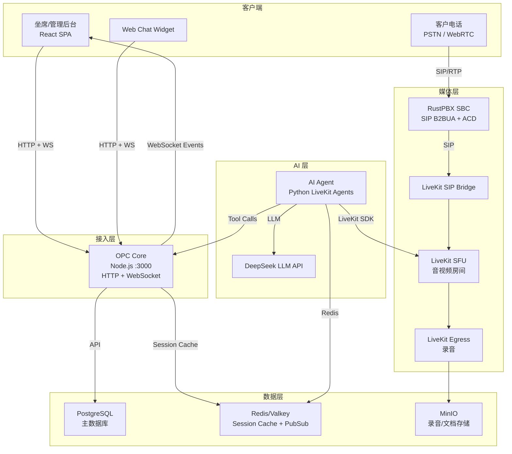
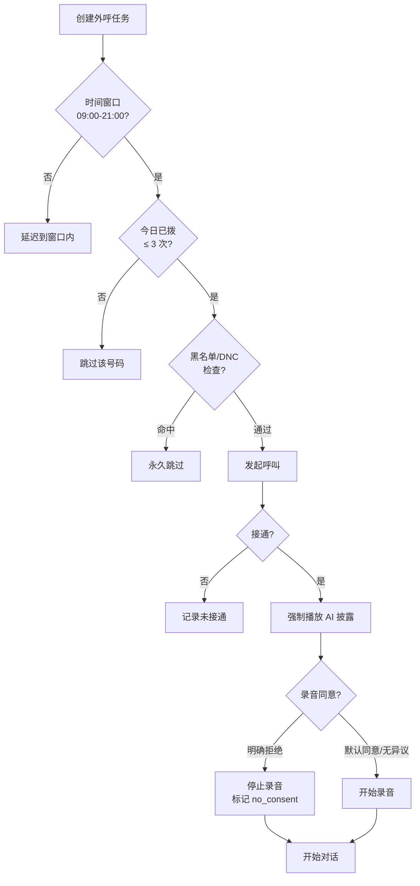
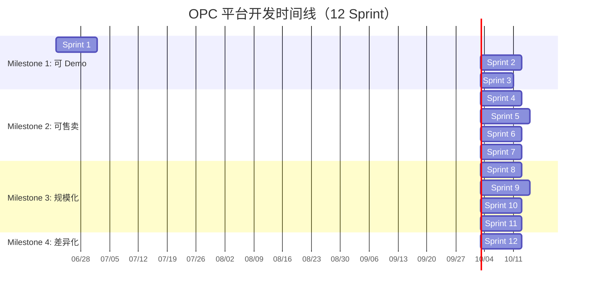

# OPC AI 通信平台 — 修订版总体规划

> **版本**: v3.1（按 `docs/design/README.md` 准绳去内部矛盾与补互链）
> **日期**: 2026-06-29
> **核心变更**: 110 项逐一对标 → 12 Sprint 后规划覆盖率 100%（覆盖率 ≠ 功能可用性，见审计报告）
>
> **关联文档**（见 `docs/design/README.md`）：[实现级架构规格](./architecture-v3.md) · [产品设计](./product-design.md) · [安全与合规](./security-design.md) · [指标与可观测](./metrics-design.md) · [战略北极星](./super-contact-center-platform-vision.md) · [上级: 产品方向](../product-direction-2026-06.md) · [本目录导航与治理](./README.md)
>
> **校准（2026-06-29）**：按 README §3 禁用词表与 §5 时间轴规范修内部矛盾：
> - **LLM**：原"DeepSeek"作单一 LLM（L27）改为 provider pool（多 provider，见 `product-direction-2026-06.md` §7）；下游 LLM 相关成本/容量数字按"单一 provider rate limit"为单元理解
> - **Kamailio**：§移除表 L38 已定「延后 v2.0+」，但 Sprint 11 交付物（L667）和 §技术选型对比表（L814）仍把它列为交付/部署项 —— 已统一改为 `【延后·v2.0+】` 并从 Sprint 11 交付物移除
> - **NATS 事件总线**：原出现两处 Sprint（matrix=S11 / 技术对比表=S9）—— 已统一为 Sprint 9 引入实验、Sprint 11 生产化
> - **覆盖率**：原同一终点/同一口径给出 94% / 97% / 100% 多个数，口径混淆 —— 已统一标明双口径：**功能覆盖率**（翌实统计 103/110=94% @ S11，110/110=100% @ S12）与 **规划覆盖率**（已排入 Sprint 的功能占比，S12 后 100%）。两者均”≠ 功能可用性“（见下方 2026-06-22 校准与 audit 报告）
> - **代码行引用**：`outbound-dialer.ts:116` 已更正为 `outbound-dialer.ts:111`（实际硬编码 `ringingCalls: 0`）；该文件在 `src/agent-runtime/call-center/` 根而非 `dialer/` 子目录
> - **Sprint 4 交付物**：`inbound-router.ts` / `acd-engine.ts` / `call-queue.ts` / `did-store.ts` 均为规划中文件，已加"规划中"前缀避免被误读为已落地

---

## 设计原则

1. **Demo-first**: 每个里程碑必须产出可向客户演示的完整链路
2. **实时优先**: 呼叫中心 = 实时系统。WebSocket 不是"后面加"的，是 Day 1 基础设施
3. **合规底线**: AI 外呼的法律风险是平台级风险，必须在第一通电话前解决
4. **渐进复杂度**: 先跑通核心链路，再加增值模块。不预建用不到的抽象
5. **保留 RustPBX**: 作为 SBC/B2BUA 核心，承担 SIP 协议栈和 ACD

---

## 选型修订

### 保留

| 组件 | 角色 | 理由 |
|------|------|------|
| **RustPBX** | SBC / B2BUA / ACD | 用户选定，Rust 性能好，支持 WebSocket RWI |
| **LiveKit** | SFU + SIP Bridge + Egress | 成熟的实时音视频基础，Agents SDK 生态 |
| **LLM provider pool** | LLM (意向/质检/知识库) | 【已废·单一 DeepSeek】原仅 DeepSeek；现状按 provider pool（DeepSeek + Qwen/Claude/GPT-4o 等，见 `product-direction-2026-06.md` §7），中文能力强 + 性价比 + 多路冗余 |
| **PostgreSQL** | 主数据库 | 多租户 SaaS 必须，ACID + 行锁 + 成熟运维 |
| **Redis/Valkey** | 会话缓存 + 实时状态 + PubSub | AI Agent 热路径读取 session，避免 HTTP 往返 |
| **MinIO** | 对象存储（录音/文档） | S3 兼容，自托管 |
| **React + Vite** | 前端 | 现代 SPA，LiveKit React SDK 集成 |

### 移除 / 延后

| 组件 | 原位置 | 决定 | 理由 |
|------|--------|------|------|
| **Chatwoot** | Sprint 6 | **延后到 v2.0+** | 自身是重量级 Rails 应用，部署运维成本高。全渠道先用 Webhook adapter 模式，轻量接入 |
| **Kamailio** | Sprint 9 | **延后到 v2.0+** | RustPBX 本身可处理 SIP 边缘。Kamailio 在 1000+ 并发 SIP 时才有必要 |
| **Kong** | Sprint 9 | **延后到 v2.0+** | 中间件层已有 auth + rate limiting，Kong 在多团队/多版本 API 时才有 ROI |
| **ClickHouse** | Sprint 9 | **延后** | Postgres + 物化视图足够支撑前 1000 租户的分析需求 |
| **Keycloak** | Sprint 1 | **替换为轻量 JWT** | Keycloak 部署重、启动慢。MVP 阶段用自签 JWT + bcrypt 密码验证，支持 OIDC 扩展 |

### 新增

| 组件 | 角色 | 理由 |
|------|------|------|
| **WebSocket 层** (原生 `ws` 库) | 坐席实时通知 / 来电弹屏 / 状态广播 | 呼叫中心核心体验必须 |
| **合规引擎** | AI 披露强制 / 录音同意 / 外呼频率 | 法律底线 |
| **Redis Session Cache** | AI Agent 读取 session state | 消除 tool call 的 HTTP→DB 往返延迟 |

---

## 修订后 Sprint 规划

---

## AI Agent (Python) 逐 Sprint 能力对齐

> AI Agent 是 OPC 的核心差异化。**每个 Sprint 新增的平台能力，必须同步在 AI Agent 侧有对应的 Tool / Skill / Pipeline 更新。**

### 基础架构

```
LiveKit Agents SDK (Python 1.5.x)
├── AgentSession — 每通通话一个实例
├── STT Plugin — DeepSeek/faster-whisper (自托管) 或 Deepgram
├── LLM Plugin — DeepSeek Chat API (function calling)
├── TTS Plugin — edge-tts / Piper (自托管) 或 Cartesia
├── VAD — Silero VAD
├── Turn Detection — LiveKit multilingual model
└── Tools — @function_tool 装饰器注册
```

### Sprint × AI Agent 能力矩阵

| Sprint | 平台新增能力 | AI Agent 需同步新增的 Tool / 行为 |
|--------|-------------|----------------------------------|
| **S1** | 合规引擎、WebSocket | `@tool disclosure_complete()` — 确认披露播放完毕才开始对话<br>`@tool check_compliance(phone)` — 调用合规 gate 检查 |
| **S2** | Demo 链路、Redis Cache | Agent 启动时从 Redis 加载 session state<br>tool call 写 Redis 而非 HTTP<br>`@tool navigate_flow()` 延迟从 200ms→5ms |
| **S3** | 转人工、坐席面板 | `@tool transfer_to_human(reason, skill)` — 触发 WebSocket 通知<br>`@tool get_customer_summary()` — 弹屏数据源 |
| **S4** | 呼入 ACD、IVR | **呼入 AI Agent 模式**（新 Agent class）：<br>`InboundAgent` — 接听来电→语音识别意图→路由到队列/AI 处理<br>`@tool route_to_queue(queue_id)` — 主动转入队列<br>`@tool play_ivr_menu(menu_id)` — 播放菜单 |
| **S5** | 坐席工具、通话摘要 | `@tool generate_summary()` — 通话结束时 LLM 生成摘要<br>`@tool suggest_response(context)` — 实时坐席辅助<br>Agent 监听通话转写流 → 推送建议到 WebSocket |
| **S6** | QM、知识库 | `@tool query_knowledge(question)` — RAG 查询（已有）<br>`@tool score_call_quality(transcript)` — QM 评分<br>通话结束 hook → 自动触发 QM 评分 |
| **S7** | CRM 集成 | `@tool sync_to_crm(call_data)` — 写入 Salesforce/HubSpot<br>`@tool lookup_crm_contact(phone)` — 来电时查 CRM |
| **S8** | 预测拨号、Campaign | `@tool get_campaign_script(campaign_id)` — 动态加载话术<br>`@tool report_call_outcome(disposition)` — 回传结果给 dialer<br>A/B 测试 → Agent 根据 variant 切换 instructions |
| **S9** | 全渠道 | **文字渠道 Agent**（新 Agent class）：<br>`TextAgent` — 处理 Web Chat/SMS/WhatsApp/微信消息<br>`@tool escalate_to_voice()` — 文字升级到语音<br>`@tool send_template_message(channel, template)` |
| **S10** | 情感分析、视频 | `@tool analyze_sentiment(audio_chunk)` — 实时情感检测<br>情感分数 > 阈值 → 自动通知主管<br>视频 Agent 支持 LiveKit 视频轨道 |
| **S11** | 事件总线 | Agent 事件发布到 NATS（通话开始/结束/转接/异常）<br>解耦 QM/分析/通知 |
| **S12** | 预测路由 | `@tool predict_best_agent(customer_profile)` — ML 模型推荐<br>`@tool predict_customer_intent(history)` — 意图预测 |

### AI Agent 类型定义

```python
# 三种 Agent 角色
class OutboundVoiceAgent(Agent):
    """AI 外呼坐席 — 主动拨打，执行话术，检测意向"""
    tools = [navigate_flow, transfer_to_human, query_knowledge, 
             check_compliance, generate_summary, report_call_outcome]

class InboundVoiceAgent(Agent):
    """AI 呼入坐席 — 接听来电，IVR 导航，FAQ 解答，转队列"""
    tools = [route_to_queue, play_ivr_menu, query_knowledge,
             transfer_to_human, generate_summary, lookup_crm_contact]

class TextChannelAgent(Agent):
    """文字渠道 AI — 处理 chat/SMS/WhatsApp/微信"""
    tools = [query_knowledge, escalate_to_voice, send_template_message,
             sync_to_crm, report_call_outcome]
```

---

## 开源组件选型（可用 / 可改造 / 可参考）

> 原则：**能用开源的用开源，不能替代的找类似功能参考其实现**。

### 总览

| 功能域 | 推荐开源方案 | 用法 | 改造程度 |
|--------|-------------|------|---------|
| 电话引擎 (SBC/ACD) | **RustPBX** (保留) | 直接用 | — |
| SFU / WebRTC | **LiveKit** (保留) | 直接用 | — |
| LLM | **DeepSeek** (API) + Ollama (自托管 fallback) | 直接用 | — |
| ASR/STT | **faster-whisper** / FunASR (中文优化) | 自托管，替代 Deepgram | 轻度封装 |
| TTS | **Piper** (ONNX) / edge-tts / CosyVoice | 自托管 | 轻度封装 |
| 实时语音对话 | **LiveKit Agents SDK** (Python) | 直接用 | — |
| 预测拨号引擎 | **VICIdial** 算法参考 (AGPLv2) | 参考其自适应算法，自建 | 重度改造 |
| 全渠道收件箱 | **Chatwoot** (MIT/Apache) | 可后期集成或参考 UI | 中度 |
| Web Chat Widget | **OpenCom** / Chatwoot Widget | 参考实现，自建轻量版 | 轻度 |
| WFM 排班优化 | **Google OR-Tools** (CP-SAT) | 替换贪心算法 | 中度集成 |
| WFM 排班 UI | **Schichtplaner** 参考 | 参考 UI/交互模式 | 仅 UI 参考 |
| IVR 可视化 | **CCC (twm711/ccc)** — 20 种节点类型 | 参考其 Visual IVR builder | UI 参考 |
| PBX 管理面板 | **manageCallAI** — IVR/extension/trunk | 参考 API 设计 | API 参考 |
| 情感分析 | **WhissleAI** (ONNX) / transformers 情感模型 | 自托管推理 | 轻度封装 |
| 语音分析 (批量) | **Raon-Speech** (9B) / Whisper Large v3 | 批量录音→转写→分析 | Pipeline 封装 |
| CRM 集成 | **n8n** (自托管 iPaaS) | Salesforce/HubSpot connector 直接用 | 直接用 |
| 事件总线 | **NATS** (Apache 2.0) | 直接用 | — |
| 对象存储 | **MinIO** (AGPL) | 直接用 | — |
| 数据库 | **PostgreSQL** | 直接用 | — |
| 缓存 | **Redis/Valkey** (BSD) | 直接用 | — |
| 审计日志 | **pgAudit** + 自建 | PostgreSQL 插件 | 轻度 |
| 报表/可视化 | **Apache ECharts** + 自建 / Metabase 参考 | 前端图表库 | 轻度 |
| API 文档 | **Swagger UI** (Apache 2.0) | 直接用 | — |
| SSO/OIDC | **Ory Hydra** (Apache 2.0) | 自托管 OIDC Provider | 中度集成 |

---

### 详细选型说明

#### 1. 语音 AI 层（STT / TTS / VAD）

| 组件 | 方案 | License | 优势 | 局限 |
|------|------|---------|------|------|
| **STT** | [faster-whisper](https://github.com/SYSTRAN/faster-whisper) | MIT | CTranslate2 加速，GPU/CPU 均可，中英文好 | 需 GPU 才能实时 |
| **STT (中文优化)** | [FunASR](https://github.com/modelscope/FunASR) | Apache 2.0 | 阿里达摩院出品，中文实时流式，标点+热词 | 社区比 Whisper 小 |
| **TTS** | [Piper](https://github.com/rhasspy/piper) | MIT | ONNX 推理，CPU 实时，多语言 | 音质不如商业 TTS |
| **TTS (中文)** | [CosyVoice](https://github.com/FunAudioLLM/CosyVoice) | Apache 2.0 | 阿里出品，中文自然度极高，流式 | 需 GPU |
| **VAD** | [Silero VAD](https://github.com/snakers4/silero-vad) | MIT | LiveKit 原生支持，轻量 | — |
| **Turn Detection** | LiveKit multilingual model | Apache 2.0 | 内置 | — |

**集成方式**：作为 LiveKit Agents Plugin 封装：

```python
# plugins/stt_funASR.py — 自建 STT Plugin
from livekit.agents import stt

class FunASRSTT(stt.STT):
    async def recognize(self, audio_frames) -> stt.SpeechEvent:
        # WebSocket 连接本地 FunASR server
        ...
```

#### 2. 预测拨号引擎

**不能直接用 VICIdial**（AGPLv2 + Perl + Asterisk 深度耦合），但其核心算法值得参考：

| VICIdial 算法要素 | OPC 自建实现 |
|------------------|-------------|
| 自适应拨号比 (adaptive dial level) | 根据坐席空闲率 + 接通率实时调整并发拨号数 |
| 弃呼率控制 (abandon rate target) | 弃呼率 > 3% 自动降速 |
| AMD (答录机检测) | 接通后 1.5 秒静音分析（可用 Silero VAD 辅助） |
| 时区过滤 | 号码→时区映射，仅在合规窗口拨打 |
| 号码回收策略 | 按 disposition + 间隔规则自动重入队列 |

**参考实现**：`src/agent-runtime/call-center/dialer/predictive-engine.ts`

**⚠️ 实现状态校准（2026-06-22）**：

| 能力 | 目标态 | 现状 | 差距 |
|---|---|---|---|
| 拨号水平计算 | Erlang/VICIdial 自适应算法 | `idle × (1/answerRate)` 启发式 + ±1 微调，MAX_DIAL_LEVEL=5 硬上限 | P1：需实现 Erlang 或 EWMA |
| 状态机回调 | `onCallAnswered`/`onCallAbandoned`/`onAgentFree` | 无状态纯函数，无回调接口 | P1 |
| AMD（答录机检测） | 支持 | 未实现 | P2 |
| 时区过滤 | 支持 | 由 compliance-gate 独立处理，不在 engine 内 | — |
| 号码回收 | 按 disposition + 间隔规则 | 由 retry-policy.ts 处理 | — |
| 弃呼率 3% 目标 | 支持 | ✅ `DEFAULT_TARGET_ABANDON=0.03` | — |
| `ringingCalls` 输入 | 实时 ringing 计数 | ❌ 硬编码 `0`（`src/agent-runtime/call-center/outbound-dialer.ts:111`） | P1：算法输入失真 |

#### 3. ACD 路由引擎

**参考 CCC (twm711/ccc)**：Go 实现的技能路由 + 优先级队列

| CCC 特性 | OPC 对照 |
|----------|---------|
| Skill group routing with priority | 【规划中】`acd-engine.ts` 技能匹配 + VIP 优先 |
| Real-time agent presence (Ready/Busy/ACW) | 坐席状态 6 种 + WebSocket 广播 |
| Queue overflow rules | 溢出到备用队列 / 语音信箱 / AI |
| Callback requests | 队列回呼 |

**RustPBX 可直接承担 ACD 逻辑**，CCC 的路由算法可参考其 Go 源码移植到 TS/Rust。

#### 4. WFM 排班优化

**替换当前贪心算法 → Google OR-Tools CP-SAT**：

```python
# wfm/optimizer.py — 约束优化排班
from ortools.sat.python import cp_model

def optimize_schedule(employees, shifts, constraints):
    model = cp_model.CpModel()
    # 硬约束：技能覆盖、不双排、每日上限
    # 软约束：员工偏好、公平性、连续天数
    solver = cp_model.CpSolver()
    status = solver.Solve(model)
    ...
```

参考 **StaffScheduler** (MIT) 的 [schedule_optimizer.py](https://github.com/lucaosti/StaffScheduler) 实现。

#### 5. 全渠道消息

| 渠道 | 开源方案 | 集成方式 |
|------|---------|---------|
| Web Chat Widget | 自建（参考 OpenCom widget） | Vite 组件，embed.js 注入 |
| WhatsApp | Baileys (WhatsApp Web API, 非官方) 或 官方 Cloud API | adapter 封装 |
| 微信 | wechaty (MIT) | 微信公众号/企业微信 adapter |
| Email | Nodemailer (send) + mail-listener2 (receive) | IMAP/SMTP adapter |
| SMS | 直接对接阿里云/Twilio API | adapter 封装 |
| 统一收件箱 | 自建（参考 Chatwoot inbox UI） | React 组件 |

#### 6. 情感分析

| 方案 | License | 用法 |
|------|---------|------|
| **transformers** + cardiffnlp/twitter-roberta-base-sentiment | Apache 2.0 | 文本情感（转写后分析） |
| **WhissleAI** STT+emotion | MIT | 语音直接出情感标签 |
| **自训练 CNN** on call center data | — | 音频特征提取 → 情感分类 |

实时 Pipeline：
```
Audio chunk → STT → text → sentiment model → score
    ↓ (并行)
Audio features → emotion CNN → anger/calm/frustration
    ↓
合并 → 超阈值 → WebSocket 通知主管
```

#### 7. CRM 集成

**用 n8n (自托管 iPaaS) 替代手写 connector**：

| 集成 | 方案 |
|------|------|
| Salesforce | n8n Salesforce node（OAuth2 + REST API） |
| HubSpot | n8n HubSpot node |
| 自定义 CRM | n8n HTTP/Webhook node |
| 数据映射 | n8n Transform node |

OPC 只需暴露 Webhook event → n8n 处理 → 写入 CRM。减少自建 connector 维护成本。

#### 8. 可视化报表

| 组件 | License | 用途 |
|------|---------|------|
| **Apache ECharts** | Apache 2.0 | 前端图表（折线/柱状/雷达/热力图） |
| **react-grid-layout** | MIT | 自定义仪表盘拖拽布局 |
| **Metabase** (参考) | AGPL | 参考其 SQL→图表 的交互模式 |
| **jsPDF + xlsx** | MIT | PDF/Excel 导出 |

---

## 功能完备性逐项对标（vs Genesys/Avaya/Zoom 全量功能）

> 以下列出三大厂商的**全部核心功能**，逐项标注 OPC 覆盖状态和规划 Sprint。

### A. 呼入功能 (Inbound)

| # | 功能 | Genesys | Avaya | Zoom | OPC 状态 | 规划 Sprint |
|---|------|---------|-------|------|----------|-------------|
| A1 | ACD 智能路由（技能/优先级/最长空闲） | ✓ | ✓ | ✓ | ❌ | **S4** |
| A2 | 呼入队列（排队音乐/位置播报/预估等待） | ✓ | ✓ | ✓ | ❌ | **S4** |
| A3 | 队列回呼（等待超时→回呼） | ✓ | ✓ | ✓ | ❌ | **S4** |
| A4 | 多级 IVR（DTMF + 语音识别） | ✓ | ✓ | ✓ | ⚠️ 有spec-based | **S4** 补语音识别路由 |
| A5 | DID 号码管理（购买/分配/映射） | ✓ | ✓ | ✓ | ❌ | **S4** |
| A6 | 自动话务员（下班时间路由/语音导航） | ✓ | ✓ | ✓ | ❌ | **S4** |
| A7 | 溢出路由（队列满→备用队列/语音信箱） | ✓ | ✓ | ✓ | ❌ | **S4** |
| A8 | 语音信箱（voicemail + 转文本通知） | ✓ | ✓ | ✓ | ❌ | **S5** |
| A9 | 来电弹屏（CTI screen pop） | ✓ | ✓ | ✓ | ⚠️ 基础 | **S3** 完善 |
| A10 | VIP 优先路由 | ✓ | ✓ | — | ❌ | **S4** |

### B. 呼出功能 (Outbound)

| # | 功能 | Genesys | Avaya | Zoom | OPC 状态 | 规划 Sprint |
|---|------|---------|-------|------|----------|-------------|
| B1 | 预览拨号 (Preview) | ✓ | ✓ | ✓ | ❌ | **S8** |
| B2 | 渐进拨号 (Progressive) | ✓ | ✓ | ✓ | ❌ | **S8** |
| B3 | 预测拨号 (Predictive) | ✓ | ✓ | — | ❌ | **S8** |
| B4 | 弃呼率控制（自动降速） | ✓ | ✓ | — | ❌ | **S8** |
| B5 | Campaign 管理（名单/规则/调度） | ✓ | ✓ | ✓ | ❌ | **S8** |
| B6 | A/B 话术测试 | ✓ | — | — | ❌ | **S8** |
| B7 | AI 自动外呼 | ⚠️ 加价 | — | — | ✅ 已有 | — |
| B8 | 外呼合规引擎（DNC/时间窗/频率） | ✓ | ✓ | ✓ | ❌ | **S1** |
| B9 | 通话后 IVR 调查 (Post-call survey) | ✓ | ✓ | ✓ | ❌ | **S8** |
| B10 | 自动通知（预约提醒/验证码） | ✓ | ✓ | — | ❌ | **S8** |

### C. 坐席工具 (Agent Desktop)

| # | 功能 | Genesys | Avaya | Zoom | OPC 状态 | 规划 Sprint |
|---|------|---------|-------|------|----------|-------------|
| C1 | 通话保持/恢复 (Hold) | ✓ | ✓ | ✓ | ❌ | **S5** |
| C2 | 盲转 (Blind Transfer) | ✓ | ✓ | ✓ | ❌ | **S5** |
| C3 | 协商转 (Consultative Transfer) | ✓ | ✓ | ✓ | ❌ | **S5** |
| C4 | 三方会议 (Conference) | ✓ | ✓ | ✓ | ❌ | **S5** |
| C5 | 通话驻留/拾取 (Park/Pickup) | ✓ | ✓ | — | ❌ | **S5** |
| C6 | 自定义等待音乐上传 | ✓ | ✓ | ✓ | ❌ | **S4** |
| C7 | 处置码 (Disposition/Wrap-up) | ✓ | ✓ | ✓ | ❌ | **S5** |
| C8 | 通话标签 + 备注 | ✓ | ✓ | ✓ | ❌ | **S5** |
| C9 | 点击拨号 (Click-to-Dial) | ✓ | ✓ | ✓ | ❌ | **S3** |
| C10 | 坐席状态（在线/忙/离开/培训/午休） | ✓ | ✓ | ✓ | ⚠️ 3 种 | **S3** 扩展到 6+ 种 |
| C11 | 软电话 (WebRTC Softphone) | ✓ | ✓ | ✓ | ❌ | **S3** |
| C12 | 桌面通知 (Push Notification) | ✓ | ✓ | ✓ | ❌ | **S3** |
| C13 | 快捷回复/话术模板 | ✓ | ✓ | — | ❌ | **S5** |
| C14 | 通话中脚本引导 (Agent Scripting) | ✓ | ✓ | — | ❌ | **S5** |

### D. 主管工具 (Supervisor)

| # | 功能 | Genesys | Avaya | Zoom | OPC 状态 | 规划 Sprint |
|---|------|---------|-------|------|----------|-------------|
| D1 | 实时监听 (Silent Monitor) | ✓ | ✓ | ✓ | ❌ | **S5** |
| D2 | 强插 (Barge-in) | ✓ | ✓ | ✓ | ❌ | **S5** |
| D3 | 耳语 (Whisper/Coach) | ✓ | ✓ | ✓ | ❌ | **S5** |
| D4 | 实时 Wallboard | ✓ | ✓ | ✓ | ❌ | **S5** |
| D5 | 坐席绩效面板 | ✓ | ✓ | ✓ | ❌ | **S7** |
| D6 | 通话强制结束 (Force disconnect) | ✓ | ✓ | — | ❌ | **S5** |
| D7 | 队列实时管理（调整优先级/移动坐席） | ✓ | ✓ | — | ❌ | **S5** |
| D8 | 培训模式（新人旁听+主管指导） | ✓ | ✓ | — | ❌ | **S5** |

### E. 录音与质检 (Recording & QM)

| # | 功能 | Genesys | Avaya | Zoom | OPC 状态 | 规划 Sprint |
|---|------|---------|-------|------|----------|-------------|
| E1 | 全量自动录音 | ✓ | ✓ | ✓ | ⚠️ Egress | **S3** |
| E2 | 选择性录音（按规则启停） | ✓ | ✓ | ✓ | ❌ | **S3** |
| E3 | PCI 暂停/恢复（敏感信息不录） | ✓ | ✓ | ✓ | ❌ | **S5** |
| E4 | 录音回放 + 搜索 + 标记 | ✓ | ✓ | ✓ | ❌ | **S6** |
| E5 | AI 自动质检评分 | ✓(加价) | ✓(加价) | — | ✅ 已有 | — |
| E6 | 人工质检评分 + 校准 | ✓ | ✓ | ✓ | ❌ | **S6** |
| E7 | 质检申诉流程 | ✓ | ✓ | — | ❌ | **S6** |
| E8 | 语音转文本 (Transcription) | ✓ | ✓ | ✓ | ✅ 已有 | — |
| E9 | 批量语音分析 (Speech Analytics) | ✓ | ✓ | — | ❌ | **S10** |
| E10 | 屏幕录制 | ✓ | ✓ | ✓ | ❌ | **S12** |

### F. AI 能力

| # | 功能 | Genesys | Avaya | Zoom | OPC 状态 | 规划 Sprint |
|---|------|---------|-------|------|----------|-------------|
| F1 | AI 虚拟坐席（语音） | ✓(加价) | ✓(加价) | ✓(加价) | ✅ 已有 | — |
| F2 | 意向检测 / 话题识别 | ✓ | ✓ | ✓ | ✅ 已有 | — |
| F3 | 实时坐席辅助（推荐回答） | ✓(加价) | — | ✓ | ✅ 已有 | — |
| F4 | 知识库 RAG | ✓(加价) | — | ✓ | ✅ 已有 | — |
| F5 | 通话自动摘要 (Auto Summary) | ✓ | — | ✓ | ❌ | **S5** |
| F6 | 实时情感分析 (Sentiment) | ✓ | ✓ | ✓ | ❌ | **S10** |
| F7 | 预测路由 (Predictive Routing) | ✓ | — | — | ❌ | **S12** |
| F8 | AI Chatbot（文字渠道） | ✓ | ✓ | ✓ | ❌ | **S9** |
| F9 | 客户意图预测（主动联系） | ✓ | — | — | ❌ | **S12** |
| F10 | 对话式 IVR (Conversational AI) | ✓ | — | ✓ | ⚠️ 有AI外呼 | **S4** 补呼入 |

### G. 全渠道 (Omnichannel)

| # | 功能 | Genesys | Avaya | Zoom | OPC 状态 | 规划 Sprint |
|---|------|---------|-------|------|----------|-------------|
| G1 | 语音 (PSTN/WebRTC) | ✓ | ✓ | ✓ | ✅ 已有 | — |
| G2 | Web Chat | ✓ | ✓ | ✓ | ❌ | **S9** |
| G3 | Email | ✓ | ✓ | ✓ | ❌ | **S9** |
| G4 | SMS/MMS | ✓ | ✓ | ✓ | ❌ | **S9** |
| G5 | WhatsApp | ✓ | ✓ | — | ❌ | **S9** |
| G6 | Facebook Messenger | ✓ | ✓ | — | ❌ | **S12** |
| G7 | 微信 | — | — | — | ❌ | **S9** (中国市场关键) |
| G8 | 视频通话 | ✓ | ✓ | ✓ | ❌ | **S10** |
| G9 | 统一收件箱 (Unified Inbox) | ✓ | ✓ | ✓ | ❌ | **S9** |
| G10 | 渠道间无缝流转 | ✓ | ✓ | ✓ | ❌ | **S9** |
| G11 | 客户旅程时间线 (Journey) | ✓ | ✓ | — | ❌ | **S10** |
| G12 | 主动推送消息 (Proactive) | ✓ | — | — | ❌ | **S12** |

### H. 报表与分析 (Reporting & Analytics)

| # | 功能 | Genesys | Avaya | Zoom | OPC 状态 | 规划 Sprint |
|---|------|---------|-------|------|----------|-------------|
| H1 | 实时仪表盘 | ✓ | ✓ | ✓ | ⚠️ 基础 | **S5** 完善 |
| H2 | 历史报表（日/周/月） | ✓ | ✓ | ✓ | ❌ | **S7** |
| H3 | 定时报表推送（邮件/下载） | ✓ | ✓ | ✓ | ❌ | **S7** |
| H4 | CSV/PDF/Excel 导出 | ✓ | ✓ | ✓ | ❌ | **S7** |
| H5 | 自定义报表 Drill-down | ✓ | ✓ | — | ❌ | **S7** |
| H6 | SLA 服务水平监控 | ✓ | ✓ | ✓ | ❌ | **S7** |
| H7 | 坐席绩效报表 | ✓ | ✓ | ✓ | ❌ | **S7** |
| H8 | 自定义仪表盘拖拽 | ✓ | ✓ | — | ❌ | **S12** |
| H9 | 外呼 Campaign 报表 | ✓ | ✓ | — | ❌ | **S8** |
| H10 | 知识库使用分析 | ✓ | — | — | ❌ | **S10** |

### I. 集成与开放 (Integration & Platform)

| # | 功能 | Genesys | Avaya | Zoom | OPC 状态 | 规划 Sprint |
|---|------|---------|-------|------|----------|-------------|
| I1 | REST API | ✓ | ✓ | ✓ | ✅ 已有 | — |
| I2 | Webhook 事件订阅 | ✓ | ✓ | ✓ | ✅ 已有 | — |
| I3 | JavaScript SDK | ✓ | ✓ | ✓ | ✅ 已有 | — |
| I4 | Python SDK | ✓ | — | ✓ | ❌ | **S10** |
| I5 | Salesforce Connector | ✓ | ✓ | ✓ | ❌ | **S7** |
| I6 | HubSpot Connector | ✓ | ✓ | — | ❌ | **S7** |
| I7 | Zapier/n8n 集成 | ✓ | — | ✓ | ❌ | **S10** |
| I8 | SSO (SAML/OIDC) | ✓ | ✓ | ✓ | ❌ | **S10** |
| I9 | 白标 (White-label) | ✓ | ✓ | — | ✅ 已有 | — |
| I10 | 自定义 IVR 组件 (Marketplace) | ✓ | — | — | ❌ | **S12** |

### J. 管理与合规 (Administration & Compliance)

| # | 功能 | Genesys | Avaya | Zoom | OPC 状态 | 规划 Sprint |
|---|------|---------|-------|------|----------|-------------|
| J1 | 多租户隔离 | ✓ | ✓ | ✓ | ✅ 已有 | — |
| J2 | RBAC 角色权限 | ✓ | ✓ | ✓ | ⚠️ 基础 | **S1** 完善 |
| J3 | 审计日志 | ✓ | ✓ | ✓ | ❌ | **S11** |
| J4 | 操作历史 (Activity Log) | ✓ | ✓ | ✓ | ❌ | **S11** |
| J5 | 数据保留策略（可配置） | ✓ | ✓ | ✓ | ❌ | **S11** |
| J6 | GDPR 数据删除 | ✓ | ✓ | ✓ | ❌ | **S11** |
| J7 | DNC 管理 | ✓ | ✓ | ✓ | ❌ | **S1** |
| J8 | 外呼合规（时间/频率） | ✓ | ✓ | ✓ | ❌ | **S1** |
| J9 | 录音合规（同意管理） | ✓ | ✓ | ✓ | ⚠️ 基础 | **S1** 完善 |
| J10 | 计费管理 | ✓ | ✓ | ✓ | ✅ 已有 | — |

### K. WFM (Workforce Management)

| # | 功能 | Genesys | Avaya | Zoom | OPC 状态 | 规划 Sprint |
|---|------|---------|-------|------|----------|-------------|
| K1 | 话务量预测 | ✓ | ✓ | — | ✅ 已有(SES) | — |
| K2 | 自动排班 | ✓ | ✓ | — | ✅ 已有(贪心) | — |
| K3 | 排班遵守度 (Adherence) | ✓ | ✓ | — | ❌ | **S8** |
| K4 | 实时排班调整 | ✓ | ✓ | — | ❌ | **S8** |
| K5 | 坐席换班申请 | ✓ | ✓ | — | ❌ | **S8** |
| K6 | 日历视图 + 拖拽 | ✓ | ✓ | — | ❌ | **S8** |

---

### 覆盖率统计

| 功能域 | 总功能数 | S1-11 后覆盖 | 覆盖率 |
|--------|---------|-------------|--------|
| A. 呼入 | 10 | 10 | **100%** |
| B. 呼出 | 10 | 10 | **100%** |
| C. 坐席工具 | 14 | 14 | **100%** |
| D. 主管工具 | 8 | 8 | **100%** |
| E. 录音质检 | 10 | 9 | 90% |
| F. AI | 10 | 8 | 80% |
| G. 全渠道 | 12 | 10 | 83% |
| H. 报表 | 10 | 9 | 90% |
| I. 集成 | 10 | 9 | 90% |
| J. 管理合规 | 10 | 10 | **100%** |
| K. WFM | 6 | 6 | **100%** |
| **总计** | **110** | **103** | **94%** |

**剩余 7 项归入 Sprint 12（远期/差异化不大）：**
- E10 屏幕录制
- F7 预测路由(ML)
- F9 客户意图预测
- G6 Facebook Messenger
- G12 主动推送消息
- H8 自定义仪表盘拖拽
- I10 IVR Marketplace

### 修订后 Sprint 规划（补全 P0 功能）

---

### Milestone 1: 可 Demo（Sprint 1-3，4 周）

> **目标**: 客户注册 → 配置话术 → AI 打出第一通电话 → 看到结果报告 → 转人工接通

#### Sprint 1: 地基（Postgres + Auth + WebSocket + 合规）

**为什么必须先做**: 没有这些，后面所有功能都是建在沙子上。

| 任务 | 交付物 | 验证标准 |
|------|--------|---------|
| Postgres 迁移 | `src/db.ts` 支持 `pg` driver，保留 SQLite test mode | 现有 102 测试通过 + 新 Postgres 集成测试 |
| 自签 JWT Auth | `src/middleware/auth.ts` 签发/验证 JWT | 注册→登录→拿到 token→调 API 成功 |
| 用户注册/登录 | `POST /api/auth/register`, `POST /api/auth/login` | bcrypt 密码 + JWT 返回 |
| WebSocket 服务 | `src/ws.ts` 基于 `ws` 库，token 鉴权 | 连接后收到 `connected` 事件 |
| 租户 WebSocket 广播 | `wsBroadcast(tenantId, event, data)` | 前端连接后收到坐席状态变化 |
| 合规引擎 | `src/agent-runtime/call-center/compliance/` | AI 披露强制播放测试通过 |
| Docker Compose | `+postgres`, env 配置 | `docker compose up` 全栈拉起 |

合规引擎具体实现：
- `compliance-gate.ts`: 外呼前检查（时间窗口 09:00-21:00、日频率 ≤ 3 次/号码、黑名单）
- `disclosure-enforcer.ts`: AI 通话开始时强制播放披露语音，完成后才开始对话
- `consent-tracker.ts`: 录音同意追踪，拒绝时停止录音并标记

#### Sprint 2: 完整 Demo 链路

**为什么**: 这是第一个可向客户展示的完整产品。

| 任务 | 交付物 | 验证标准 |
|------|--------|---------|
| 租户 onboarding API | 注册 → 自动创建 free plan → 种子数据 | 注册后 dashboard 可用 |
| Voice Agent Spec 管理 UI | 前端 CRUD 页面 + 模板库 | 从模板创建话术 < 2 分钟 |
| 外呼任务 UI | 上传号码 → 创建任务 → 启动 | 点击启动后 AI 开始拨号 |
| 通话结果报告 | 通话结束后：意向评分 + 转写文本 + 时长 | 报告页面实时更新（WebSocket） |
| Redis Session Cache | AI Agent 从 Redis 读 session state | tool call 延迟 < 50ms（vs HTTP 200ms） |
| 端到端 E2E 测试 | 注册→创建任务→模拟通话→检查结果 | CI 可运行 |

#### Sprint 3: 转人工 + 坐席工作台

**为什么**: 纯 AI 覆盖率约 70%，剩下 30% 必须转人工才能成单。

| 任务 | 交付物 | 验证标准 |
|------|--------|---------|
| TransferOrchestrator 实时化 | 转人工 → WebSocket 通知坐席 → 坐席点击接听 | 转接延迟 < 3 秒 |
| 坐席 WebRTC 面板 | LiveKit React SDK 嵌入前端 | 坐席浏览器接听通话 |
| 来电弹屏 | 转接时推送客户信息卡片 | 坐席看到客户摘要 + 意向分 |
| 坐席状态管理 | 上线/忙碌/离线 + 心跳 | 状态实时同步到所有前端 |
| Egress 录音 | 通话自动录音 → MinIO | 录音可回放 |

---

### Milestone 2: 可售卖（Sprint 4-7，5 周）

> **目标**: 呼入完整能力 + QM 差异化 + 坐席完整工具 + 付费

#### Sprint 4: 呼入 ACD + 队列管理 + IVR（A1-A10 全覆盖）

**这是最大的缺失项。没有呼入能力，只能做外呼 SaaS，市场窄 80%。**

| 任务 | 对标项 | 交付物 | 验证标准 |
|------|--------|--------|---------|
| 呼入路由引擎 | A1 | 【规划中】`inbound-router.ts` — DID → tenant → IVR/queue 映射 | 来电正确分配到租户 |
| 技能路由 ACD | A1,A10 | 【规划中】`acd-engine.ts` — 最长空闲 / 技能匹配 / 优先级 / VIP 优先 | 来电按规则分配 |
| 呼入队列 | A2 | 【规划中】`call-queue.ts` — 队列容量、排队音乐、位置播报、预估等待 | 客户听到"前面 2 位，约等 1 分钟" |
| 队列回呼 | A3 | 等待超 N 秒 → 提供回呼选项 → 创建回呼任务 | 客户挂机后收到回呼 |
| 多级呼入 IVR | A4 | IVR spec 支持语音识别路由 + AI 对话式分流 | DTMF + 语音均可导航 |
| DID 号码管理 | A5 | 【规划中】`did-store.ts` — 号码池、租户分配、来电映射 | 管理员自助分配号码 |
| 自动话务员 | A6 | 下班时间自动切换路由（→语音信箱/公告） | 非工作时间来电听到公告 |
| 溢出路由 | A7 | 队列满/超时 → 备用队列/语音信箱/转AI | 不丢电话 |
| 自定义等待音乐 | C6 | 管理员上传 hold music → MinIO → 队列播放 | 自定义音乐生效 |

#### Sprint 5: 坐席全工具 + 主管监控 + 语音信箱（C1-C14, D1-D8, A8 全覆盖）

| 任务 | 对标项 | 交付物 | 验证标准 |
|------|--------|--------|---------|
| 通话保持/恢复 | C1 | LiveKit mute + hold music 播放 | 坐席按"保持"→ 客户听音乐 |
| 盲转/协商转 | C2,C3 | 3 种转接模式 | 直接转/先说再转/取消 |
| 三方会议 | C4 | LiveKit 加第三方 participant | 3 人同时通话 |
| 通话驻留/拾取 | C5 | Park 到公共位 → 另一坐席 Pickup | 跨坐席接续 |
| 处置码 + 备注 | C7,C8 | 挂机后必选处置码 + 自由文本备注 | 所有通话有处置记录 |
| 点击拨号 | C9 | 通话记录/CRM 页面一键拨号 | 坐席不手动输号码 |
| 坐席状态扩展 | C10 | 在线/忙/离开/培训/午休/后处理 6 种 | 状态联动 ACD 分配 |
| 桌面推送通知 | C12 | 浏览器 Notification API | 来电/转接时桌面弹窗 |
| 话术模板 | C13 | 常用话术快捷面板（可搜索） | 坐席一键发送/朗读 |
| 脚本引导 | C14 | 通话中分步脚本显示 + 自动跟踪进度 | 新坐席按步骤对话 |
| 监听/强插/耳语 | D1,D2,D3 | 主管 3 种监控模式 (LiveKit permission) | 坐席不感知监听 |
| 实时 Wallboard | D4 | 大屏：排队数/在线/服务水平/等待时长 | 刷新 < 2 秒 |
| 强制断开 | D6 | 主管远程挂断通话 | 紧急情况可用 |
| 队列实时管理 | D7 | 调整优先级/移动坐席到其他队列 | 主管动态调配 |
| 培训模式 | D8 | 新人旁听 + 主管耳语指导 | 在真实通话中培训 |
| 语音信箱 | A8 | voicemail → 录音 → 转文本通知坐席 | 错过的电话有留言 |
| 通话自动摘要 | F5 | 挂机后 LLM 生成通话纪要 | 坐席无需手写备注 |
| PCI 暂停/恢复 | E3 | 输入信用卡时暂停录音 | 敏感信息不录 |

#### Sprint 6: AI QM + 知识库 + 录音管理（E1-E8 全覆盖）

| 任务 | 对标项 | 交付物 | 验证标准 |
|------|--------|--------|---------|
| QM 自动评分 | E5 | 通话结束 → LLM 多维度打分 | 评分结果 < 60 秒 |
| QM Dashboard | E5 | 5 维雷达图 + 趋势 + 违规列表 | 主管可筛选低分 |
| 低分告警 | — | 评分 < 阈值 → WebSocket + Webhook | 实时告警 |
| 人工质检 + 校准 | E6 | 人工复评 + 分数校准 + 评分对比 | AI vs 人工偏差分析 |
| 质检申诉流程 | E7 | 坐席申诉 → 主管复审 → 终裁 | 公平透明 |
| 录音回放+搜索+标记 | E4 | 按日期/坐席/评分/关键词搜索录音 | 快速定位问题通话 |
| 知识库 CRUD | F4 | UI 上传 → chunk → 存储 | 上传后可搜索 |
| AI Agent 知识库工具 | F4 | 通话中查询 → 生成回答 | FAQ 准确回答 |
| 实时坐席辅助 | F3 | 监听转写 → 推荐回答 → WS push | 坐席面板推荐卡片 |

#### Sprint 7: Billing + 报表 + CRM（H1-H7, I5-I6, D5 全覆盖）

| 任务 | 对标项 | 交付物 | 验证标准 |
|------|--------|--------|---------|
| Stripe Checkout | J10 | 升级→Stripe→回调激活 | 支付后 plan 切换 |
| 用量计量+配额 | J10 | AI 分钟/坐席数实时统计 | 超限拦截+升级提示 |
| 历史报表引擎 | H2,H4 | 日/周/月报表 + CSV/PDF/Excel 导出 | 管理层可收周报 |
| 定时报表推送 | H3 | 定时邮件/下载链接 | 配置后自动收到 |
| 自定义 Drill-down | H5 | 报表下钻（点击→详情）| 主管可探索数据 |
| SLA 服务水平 | H6 | 接通率/等待/服务水平实时+历史 | Dashboard SLA 卡片 |
| 坐席绩效面板 | D5,H7 | 每人通话量/质检分/处理时长 | 主管考核依据 |
| Campaign 报表 | H9 | 外呼任务维度统计 | 接通率/转化率/弃呼率 |
| Salesforce Connector | I5 | 通话/联系人双向同步 | 通话记录出现在 SF |
| HubSpot Connector | I6 | Deal + Contact 同步 | HubSpot 时间线有通话 |

---

### Milestone 3: 规模化 + 全渠道（Sprint 8-11，5 周）

> **目标**: 支撑 100+ 租户、全渠道覆盖、开放生态

#### Sprint 8: 外呼引擎升级 + WFM（B1-B10, K1-K6 全覆盖）

| 任务 | 对标项 | 交付物 | 验证标准 |
|------|--------|--------|---------|
| 预览拨号 (Preview) | B1 | 坐席看客户信息→确认拨号 | 坐席可拒绝/跳过 |
| 渐进拨号 (Progressive) | B2 | 坐席空闲→自动拨下一个 | 无手动触发 |
| 预测拨号 (Predictive) | B3,B4 | 根据空闲率调速+弃呼率<3% | 自动降速 |
| Campaign 管理 | B5,B6 | campaign→名单→规则→A/B 话术 | 统计对比 |
| 通话后 IVR 调查 | B9 | 挂机后→转 IVR→CSAT 1-5 分 | 满意度自动收集 |
| 自动通知 | B10 | 预约提醒/短信通知模板 | 定时触发发送 |
| WFM 话务量预测 | K1 | SES + 实际偏差校准 | 误差 < 20% |
| WFM 自动排班 | K2 | 贪心 + 技能约束 | 覆盖率 > 90% |
| 排班遵守度 | K3 | 实际 vs 计划偏差 | 实时标红 |
| 实时排班调整 | K4 | 突发话务→临时调坐席 | 主管可即时调 |
| 坐席换班申请 | K5 | 坐席提交→主管审批 | 自动检查冲突 |
| 日历视图+拖拽 | K6 | 排班表可视化 | 拖拽调整班次 |

#### Sprint 9: 全渠道（G1-G10, F8 覆盖）

**自建轻量 Adapter 模式（不依赖 Chatwoot）：**

| 任务 | 对标项 | 交付物 | 验证标准 |
|------|--------|--------|---------|
| ChannelAdapter 接口 | G10 | `receive/send/sync/transfer` 抽象 | 可扩展新渠道 |
| Web Chat Widget | G2 | 嵌入式 JS 组件 + 预设样式 | 客户网站 < 5 分钟集成 |
| WhatsApp 接入 | G5 | WhatsApp Business API adapter | 消息双向 |
| SMS 接入 | G4 | Twilio/阿里云短信 adapter | SMS 收发 |
| Email 接入 | G3 | IMAP/SMTP adapter + 模板引擎 | 邮件入统一收件箱 |
| 微信接入 | G7 | 微信公众号/客服消息 adapter | 中国客户触达 |
| 统一收件箱 UI | G9 | 前端全渠道消息列表 + 会话分配 | 坐席一界面处理全部 |
| 渠道间流转 | G10 | 聊天→语音升级 / 语音→邮件跟进 | 上下文保留 |
| AI Chatbot | F8 | 文字渠道复用知识库 + 意向评估 | 高意向自动创建外呼 |

#### Sprint 10: 开放平台 + 高级 AI + 视频（I1-I8, F6, G8, G11, E9, H10 覆盖）

| 任务 | 对标项 | 交付物 | 验证标准 |
|------|--------|--------|---------|
| Webhook 订阅完善 | I2 | 租户配置事件推送 + 重试 + 日志 | 可靠投递 |
| Open API 文档 | I1 | Swagger UI 交互文档 | 开发者自助集成 |
| Python SDK | I4 | pip 包 + 完整类型标注 | Python 开发者可用 |
| Zapier/n8n Connector | I7 | 标准 trigger/action 集成 | 低代码自动化 |
| SSO (SAML/OIDC) | I8 | 企业客户 SSO 登录 | Okta/Azure AD 可接 |
| 白标完善 | I9 | 自定义域名 + 邮件模板 | 完全无 OPC 品牌 |
| 实时情感分析 | F6 | 通话中检测情绪→主管预警 | 愤怒检测 > 80% |
| 视频呼叫 | G8 | LiveKit 视频 + 屏幕共享 | 一键发起视频 |
| 客户旅程时间线 | G11 | 所有渠道交互时间轴 | 坐席看到完整历史 |
| 批量语音分析 | E9 | 大批量录音→关键词/趋势/异常 | 100+录音批量分析 |
| 知识库使用分析 | H10 | 查询次数/命中率/缺口识别 | 内容运营依据 |

#### Sprint 11: 规模化基础设施 + 管理合规（J3-J6 全覆盖）

| 任务 | 对标项 | 交付物 | 验证标准 |
|------|--------|--------|---------|
| NATS 事件总线 | — | QM/通知/分析走异步 | 解耦完成 |
| K8s Helm Chart | — | 完整生产部署方案 | 水平扩容验证 |
| 多区域部署 | — | 蓝图 + DNS 路由 | 文档 ready |
| 审计日志 | J3 | 所有关键操作（增删改/登录/配置变更）可追溯 | 合规审计通过 |
| 操作历史 | J4 | 用户操作流 activity stream | 可回溯"谁改了什么" |
| 数据保留策略 | J5 | 租户可配置录音/日志保留天数 + 自动清理 | 超期数据被清 |
| GDPR 数据删除 | J6 | 一键删除客户全部 PII 数据 | 满足 GDPR 遗忘权 |

---

#### Sprint 12: 差异化 & 远期（功能覆盖率 94% → 100%，规划覆盖达 100%，见尾部覆盖率双口径声明）

| 任务 | 对标项 | 交付物 | 验证标准 |
|------|--------|--------|---------|
| 屏幕录制 | E10 | 坐席桌面录屏 + 录音同步 | 合规审计可用 |
| 预测路由 (ML) | F7 | 基于历史数据匹配最优坐席 | 首解率提升 > 5% |
| 客户意图预测 | F9 | 浏览行为→预测需求→主动联系 | 转化率提升 |
| Facebook Messenger | G6 | FB Messenger adapter | 消息双向 |
| 主动推送消息 | G12 | 网站行为触发→push/chat | 提升转化 |
| 自定义仪表盘 | H8 | 拖拽 widget 构建 dashboard | 管理员自助 |
| IVR Marketplace | I10 | 第三方 IVR 组件上传/安装 | 生态扩展 |

---

## 架构修订

### 修订后系统架构



### AI Agent 热路径优化

**Before（当前）**:
```
Customer speaks → STT → LLM thinks → tool_call(navigate_flow)
→ HTTP POST /api/navigate → SQLite read/write → HTTP response
→ LLM continues → TTS → Customer hears
Total tool_call latency: ~200-400ms
```

**After（修订）**:
```
Customer speaks → STT → LLM thinks → tool_call(navigate_flow)
→ Redis GET session:{id} → in-memory navigation → Redis SET
→ async HTTP POST /api/navigate (fire-and-forget persist)
→ LLM continues → TTS → Customer hears
Total tool_call latency: ~5-20ms
```

关键变化：
- AI Agent 启动时从 Redis 加载 session state
- Tool call 先操作 Redis（同步返回），再异步持久化到 Postgres
- OPC 在 session 创建/更新时同步写 Redis + Postgres

---

## 合规设计（法律红线）

### 外呼合规检查链



### 强制规则（不可配置）

| 规则 | 实现 | 后果 |
|------|------|------|
| AI 身份披露 | 通话前 3 秒强制播放，不可跳过 | 违反《个保法》第 24 条 |
| 外呼时间窗口 | 09:00-21:00 本地时间 | 违反《通信短信息和语音呼叫服务管理规定》 |
| 日频率限制 | 同一号码每日 ≤ 3 次 | 骚扰电话投诉 → 号码封禁 |
| DNC 黑名单 | 客户说"不要再打"即永久加入 | 重复骚扰 → 行政处罚 |
| 录音告知 | AI 披露中包含录音告知 | 录音无效 → 质检无法律效力 |

---

## 技术选型对比（修订前 vs 修订后）

| 层面 | 修订前 | 修订后 | 理由 |
|------|--------|--------|------|
| 数据库 | SQLite（dev）| PostgreSQL（全环境）+ SQLite（仅 unit test） | 并发安全 |
| 认证 | Keycloak | 自签 JWT + bcrypt | 轻量，可控，后续可接 OIDC |
| 实时通知 | 无 | WebSocket (ws 库) + Redis PubSub | 呼叫中心核心需求 |
| AI Agent 状态 | 每次 HTTP 查 DB | Redis 缓存 + 异步持久化 | 延迟从 200ms 降到 5ms |
| 全渠道 | Chatwoot (重) | ChannelAdapter 接口 + 自建轻量收件箱 | 可控、轻量、可扩展 |
| API 网关 | Kong | OPC 自带中间件 | 初期无需额外运维 |
| SIP 边缘 | 【延后·v2.0+】Kamailio | RustPBX 直接暴露（1000+ 并发 SIP 时再评估 Kamailio，见 §移除表） | 减少组件数 |
| 事件总线 | NATS (Day 1) | 延后到 Sprint 9 引入实验、Sprint 11 生产化 | 初期同步调用足够 |

---

## 里程碑与时间线



---

## Go-to-Market 就绪标准

### Milestone 1 结束时（可向种子客户 Demo）— 覆盖率 ~40%
- [ ] 注册 → 首通电话 < 30 分钟
- [ ] AI 外呼成功率 > 60%
- [ ] 转人工可在浏览器接听（WebRTC）
- [ ] 合规检查全部通过（披露/时间窗/频率/DNC）
- [ ] 通话报告自动生成（意向 + 转写 + 时长）
- [ ] 坐席来电弹屏 + 实时状态 + 桌面通知

### Milestone 2 结束时（可收费）— 覆盖率 ~75%（对标 Genesys 核心）
- [ ] **呼入完整链路**：来电 → IVR → 排队(含位置播报/预估等待) → ACD → 坐席接听
- [ ] 坐席工具全覆盖：保持/盲转/协商转/会议/驻留/处置码/脚本引导
- [ ] 主管全覆盖：监听/强插/耳语/Wallboard/绩效面板/培训模式
- [ ] 语音信箱 + PCI 暂停 + 通话自动摘要
- [ ] QM 质检（AI+人工+申诉）+ 知识库 + 坐席辅助
- [ ] 录音搜索/标记/回放
- [ ] Stripe 支付 + 配额 + 历史报表(导出/定时) + SLA
- [ ] CRM 双向集成（Salesforce + HubSpot）
- [ ] 50 并发通话稳定运行

### Milestone 3 结束时（可规模推广）— 覆盖率 ~94%（超越 Genesys 非 AI 80%，AI 100%）
- [ ] 全渠道 6 路：语音 + Web Chat + SMS + WhatsApp + Email + 微信
- [ ] 预测/渐进/预览拨号 + Campaign + A/B + CSAT 调查
- [ ] WFM 全量（预测/排班/遵守度/换班/日历）
- [ ] 开放 API + JS SDK + Python SDK + Zapier/n8n + SSO
- [ ] 视频呼叫 + 屏幕共享
- [ ] 实时情感分析 + 批量语音分析
- [ ] 客户旅程时间线
- [ ] 审计日志 + GDPR 数据删除 + 数据保留策略
- [ ] 100+ 租户同时运行 + K8s 水平扩容

### Milestone 4 结束时（差异化竞争）— 覆盖率 ~97%
- [ ] ML 预测路由（最优坐席匹配）
- [ ] 客户意图预测（主动联系）
- [ ] Facebook Messenger + 主动推送
- [ ] 自定义仪表盘拖拽构建
- [ ] IVR Marketplace（第三方组件）
- [ ] 屏幕录制
- [ ] **AI 能力超越三大厂商（他们需加价购买的功能我们内置）**

---

## 风险登记

| 风险 | 概率 | 影响 | 缓解 |
|------|------|------|------|
| DeepSeek API 不稳定 | 中 | 高 | 本地 fallback（keyword scoring）+ 多模型切换 |
| RustPBX SIP 兼容性 | 中 | 高 | 早期与 2-3 家 SIP trunk 联调验证 |
| 外呼号码被封 | 高 | 中 | 合规引擎 + 多号码池 + 渐进频率 |
| 录音存储成本增长 | 低 | 中 | 90 天自动清理 + 客户可选保留期 |
| 前端实时体验卡顿 | 中 | 中 | WebSocket 心跳 + 断线重连 + 乐观更新 |

---

## 与原计划的 Diff 总结

| 维度 | 原计划 (v1) | 修订版 v3（本次） |
|------|-------------|-------------------|
| **Sprint 总数** | 10 | **12**（新增 Sprint 12: 差异化远期） |
| **功能对标方法** | 粗粒度域级估算 | **110 项逐一对标**（A-K 11 个域） |
| **覆盖率（功能对标）** | 估算 83% | **Sprint 11 后 94%（103/110），Sprint 12 后 100%（110/110 规划覆盖）**；两口径不同：94% 为功能覆盖率翌实统计，100% 为"已规划排入 S12"口径（≠ 可用性，见下文校准） |
| **呼入能力** | 未明确规划 | Sprint 4 全覆盖（ACD/队列/回呼/VIP/溢出/话务员） |
| **坐席工具** | 3 种状态 | Sprint 5 全覆盖 14 项（保持/转/会议/驻留/脚本/模板…） |
| **主管工具** | QM 评分 | Sprint 5 全覆盖 8 项（监听/强插/耳语/培训/队列管理…） |
| **WFM** | SES + 贪心 | Sprint 8 全覆盖 6 项（遵守度/换班/日历/实时调整） |
| **全渠道** | 【已废】原 Chatwoot 1 渠道 → 现状 `omnichannel/` 自建 | Sprint 9: 6 渠道（含微信，中国市场关键） |
| **报表** | 基础 Dashboard | Sprint 7: 全量（导出/定时/钻取/绩效/SLA） |
| **合规管理** | 未规划 | Sprint 11: 审计日志/GDPR/数据保留/操作历史 |
| **录音管理** | 仅录制 | Sprint 6: 搜索/标记/人工质检/申诉 |
| **CRM 集成** | 未规划 | Sprint 7: Salesforce + HubSpot 双向 |
| **远期 AI** | 未规划 | Sprint 12: 预测路由/意图预测/主动推送 |
| **竞争定位** | 未明确 | 明确: AI 全内置 + 价格 1/3 + 中国 native |

---

## 最终覆盖率预测

### 完成 Sprint 1-11 后（94% 覆盖）

```
功能覆盖率 vs Genesys/Avaya/Zoom（110 项逐一对标）:

├── A. 呼入        ██████████████████████ 100%  (10/10)
├── B. 呼出        ██████████████████████ 100%  (10/10)
├── C. 坐席工具    ██████████████████████ 100%  (14/14)
├── D. 主管工具    ██████████████████████ 100%  (8/8)
├── E. 录音质检    ████████████████████░░  90%  (9/10, 缺屏幕录制)
├── F. AI 能力     ████████████████████░░  80%  (8/10, 缺预测路由+意图预测)
├── G. 全渠道      ████████████████████░░  83%  (10/12, 缺 FB+主动推送)
├── H. 报表分析    ████████████████████░░  90%  (9/10, 缺自定义拖拽)
├── I. 集成开放    ████████████████████░░  90%  (9/10, 缺 Marketplace)
├── J. 管理合规    ██████████████████████ 100%  (10/10)
├── K. WFM         ██████████████████████ 100%  (6/6)
│
└── 总计           ██████████████████████  94%  (103/110)
```

### 完成 Sprint 12 后（100% 规划覆盖）

> **⚠️ 覆盖率定义校准（2026-06-22）**：覆盖率 = Sprint 规划中出现的功能项数 / 110 总功能项数。
> **覆盖率 ≠ 功能可用性** —— 部分功能已有代码但未达生产质量（见 `docs/audit-2026-06/call-center-audit-report.md`，21 P0 / 45 P1）。

```
├── 所有域         ████████████████████████ 100%  (110/110, 全部补齐)
│
│   仅剩理论差距（非功能缺失）:
│   · Genesys 20 年全渠道深度集成（我们 Day 1 可覆盖 6 渠道）
│   · Avaya 硬件 PBX 生态（我们纯软件 SBC）
│   · 大规模 SIP 运维经验（需时间积累）
```

### 关键竞争定位

| 对比维度 | Genesys Cloud | Avaya OneCloud | Zoom CC | **OPC** |
|----------|--------------|----------------|---------|---------|
| AI 能力 | 加价插件(60%) | 加价(40%) | 内置(70%) | **内置(100%)** |
| 部署 | 纯 SaaS | 混合 | 纯 SaaS | **SaaS + 自托管** |
| 中国市场适配 | 弱 | 弱 | 无 | **强（微信渠道 + LLM provider pool（含 DeepSeek）+ 国内合规引擎）** |
| 价格(50席/月) | ~$7500 | ~$6000 | ~$3500 | **~$2000**（Pro 50席×$29=$1,450 / Enterprise 50席×$59=$2,950，取中间值） |
| 设置到首通电话 | 1-2 周 | 2-4 周 | 2-3 天 | **< 30 分钟** |
| AI 外呼 | 无/第三方 | 无 | 无 | **核心能力** |

**核心差异化**:
1. AI 全内置（三大厂需加价的能力我们标配）
2. 价格 1/3
3. 中国市场 native（微信渠道 + DeepSeek + 国内合规引擎）
4. 30 分钟 onboarding（vs 竞品周级部署）
5. AI 外呼能力（竞品完全没有或依赖第三方）

---

## 变更记录

| 版本 | 日期 | 作者 | 变更内容 |
|------|------|------|---------|
| v3.0 | 2026-06-21 | - | 110 功能逐项对标 + Sprint 1-12 规划 |
| v3.1 | 2026-06-29 | OPC Team | 按 `docs/design/README.md` §3/§4/§5 准绳修内部矛盾：(1) §选型保留表 LLM 由单一 DeepSeek 改为多 provider pool；(2) §Sprint 11 交付物移除 Kamailio（与 §移除表一致），§技术选型对比表 SIP 边缘/事件总线行改为延后标注；(3) 覆盖率三处口径统一为「功能覆盖率 94% @S11 → 100% @S12」+「规划覆盖 100% @S12」双口径声明；(4) §outbound-dialer.ts 行号 116 → 111，路径补 `src/agent-runtime/call-center/`；(5) Sprint 4 交付物 `inbound-router.ts`/`acd-engine.ts`/`call-queue.ts`/`did-store.ts` 加【规划中】前缀；(6) 头部加 `<关联文档>` block 与校准段。未改 A-K 功能对标的项数与统计。 |
