# OPC AI 通信平台 — 安全与合规设计文档

> **版本**: 1.2（按 `docs/design/README.md` 准绳标注目标态/已废词）
> **更新日期**: 2026-06-29
> **文档状态**: 初稿 + 架构决策校准
> **适用范围**: OPC 多租户 SaaS AI 语音/视频呼叫中心平台
> **保密级别**: 内部
>
> **关联文档**（见 `docs/design/README.md`）：[架构规格](./architecture-v3.md) · [总体规划](./revised-master-plan.md) · [产品设计](./product-design.md) · [指标设计](./metrics-design.md) · [战略北极星](./super-contact-center-platform-vision.md) · [上级: 产品方向](../product-direction-2026-06.md) · [本目录导航与治理](./README.md)

---

## ⚠️ 架构决策变更声明（2026-06-22 校准）

> 本文档正文基于 Kong / Keycloak / Kamailio 三大外部组件设计安全模型。
> 根据 `docs/design/revised-master-plan.md` 的最新架构决策，这三者已被移除或延后。
> 下方表格标明每个组件的"目标态"（本文档正文描述）与"现状"（代码实际实现）。
> **阅读本文档时，请始终以下表为准判断哪些设计已落地、哪些仍是目标态。**

| 组件 | 目标态（本文档正文） | 现状（代码实现） | 差距 |
|---|---|---|---|
| **Kong API Gateway** | 生产 API 网关：JWT 验证、rate-limiting、WAF | ❌ 延后到 v2.0+。当前由 OPC 自带中间件（`src/middleware/auth.ts`）承担鉴权，无 rate-limiting/WAF | P1：rate-limiting 需补 |
| **Keycloak IAM** | JWT 签发、Refresh Token、坐席密码存储 | ❌ 替换为轻量自签 JWT。当前 auth 中间件在 `src/middleware/auth.ts`，无 Refresh Token / 外部 IdP | P1：生产需接真实 IdP |
| **Kamailio SIP Edge** | SIP 边缘代理、TLS 终结、Topological Hiding | ❌ 延后到 v2.0+。当前 SIP 边缘由 RustPBX 直接暴露 | P2：生产大规模需补 |

**对正文的影响**：
- §2（数据分类）中 Refresh Token / 坐席密码写入 Keycloak DB 项为**目标态参考**；当前实现是 OPC 自签 JWT + bcrypt（密码存 OPC DB），无 Refresh Token
- §3（多租户隔离验证）中的 RLS 检查清单仍然有效，但实现方式从 Kong consumer group → OPC 中间件 per-tenant 限流；§3.3 中 Kong per-tenant rate limiting 为**目标态**
- §4（认证与授权）中涉及 Keycloak 的流程描述为**目标态参考**，当前实现是自签 JWT（`src/middleware/auth.ts`），无 Refresh Token / 外部 IdP
- §5（通信加密）中涉及 Kong TLS 终结 / mTLS 的拓扑为**目标态参考**，当前由 RustPBX ACME 自动证书
- §7（API 安全）中涉及 Kong rate-limiting / request-size-limiting / WAF plugin 为**目标态参考**，当前由 OPC 中间件承担部分（per-IP 限流、请求体限制），网关级聚合限流与 WAF 未实现
- §8（事件响应）§8.3 隔离动作中 Keycloak 管理 API / Kong consumer 禁用 / Kong IP restriction 为**目标态参考**；现状分别为轮换自签 JWT 密钥 / OPC 中间件禁用 API Key / OPC 中间件 IP 封禁
- §10（SDLC）§10.2 工具链中 Kong WAF plugin 为**目标态参考**，当前无 WAF

> 本节为正文 Kong / Keycloak / Kamailio 出现处的**唯一裁决表**。文中相应位置已加 `【目标态】` / `【已废】` / `【延后】` 行内标注（按 `docs/design/README.md` §3 禁用词表与 §4 标记规范）。

---

## 目录

1. [威胁模型](#1-威胁模型-threat-model)
2. [数据分类与保护](#2-数据分类与保护)
3. [多租户安全隔离验证](#3-多租户安全隔离验证)
4. [认证与授权设计](#4-认证与授权设计)
5. [通信加密](#5-通信加密)
6. [录音合规设计](#6-录音合规设计)
7. [API 安全最佳实践](#7-api-安全最佳实践)
8. [安全事件响应计划](#8-安全事件响应计划)
9. [合规要求清单](#9-合规要求清单)
10. [安全开发生命周期](#10-安全开发生命周期-sdlc)

---

## 1. 威胁模型 (Threat Model)

基于 STRIDE 方法论，针对 OPC 平台各模块进行系统性威胁分析。

### 1.1 STRIDE 威胁矩阵

| # | 威胁类型 | 攻击场景 | 受影响模块 | 影响 | 缓解措施 | 优先级 |
|---|---------|---------|-----------|------|---------|--------|
| T01 | Spoofing | 伪造 JWT token 访问其他租户数据 | 认证网关 | 跨租户数据泄露 | JWKS 验证 + `tenant_id` claim 强校验 | **P0** |
| T02 | Spoofing | 伪造 Webhook 回调冒充 OPC 平台 | Webhook 模块 | 租户系统被恶意操控 | HMAC-SHA256 签名 + timestamp 验证（±5min） | **P1** |
| T03 | Spoofing | SIP 注册劫持（伪造 REGISTER） | 【延后·v2.0+】Kamailio/SIP（现状 RustPBX SIP 边缘） | 通话被窃听/拦截 | SIP Digest Auth + TLS + IP ACL | **P1** |
| T04 | Tampering | 篡改 QM 质检评分数据 | 质检模块 | 质检失效，绩效数据不可信 | 评分记录不可变（append-only）+ 审计日志 | **P1** |
| T05 | Tampering | 篡改转写文本掩盖坐席失误 | 转写存储 | 合规记录失真 | 转写生成后 SHA-256 签名，修改触发审计事件 | **P1** |
| T06 | Tampering | 中间人修改 AI Agent prompt | Agent Runtime | AI 行为被操控 | prompt 模板版本化 + 变更审计 + mTLS 内网传输 | **P2** |
| T07 | Repudiation | 否认通话内容或承诺 | 通话记录 | 法律纠纷无证据 | 录音 + 转写 + 签名时间戳 + 不可变存储 | **P1** |
| T08 | Repudiation | 管理员否认删除操作 | 管理后台 | 审计链断裂 | 所有管理操作写入不可变审计日志 | **P2** |
| T09 | Info Disclosure | SQL 注入泄露跨租户数据 | 数据层 | 大规模数据泄露 | 参数化查询 + row-level `tenant_id` filtering | **P0** |
| T10 | Info Disclosure | LiveKit room token 泄露通话内容 | 实时通信 | 通话被窃听 | Room token 绑定 participant + 短有效期（5min） | **P0** |
| T11 | Info Disclosure | 日志中暴露 PII（电话号码、姓名） | 日志系统 | 隐私合规违规 | 日志写入前自动脱敏（mask/hash） | **P1** |
| T12 | Info Disclosure | API 错误响应泄露内部堆栈信息 | API 网关 | 攻击者获取系统拓扑 | 生产环境统一错误格式，禁止暴露 stack trace | **P2** |
| T13 | DoS | 恶意租户耗尽 LLM API quota | AI Agent | 平台全局不可用 | 每租户 rate limiting + 独立 quota pool + 熔断 | **P0** |
| T14 | DoS | 高频 WebSocket 连接耗尽服务器资源 | 实时通信 | 正常用户无法接入 | per-IP 连接数限制 + 【目标态·Kong 已废】Kong rate limiting（现状：OPC 中间件 per-IP 限流，无网关层聚合限流） | **P1** |
| T15 | DoS | 大文件上传耗尽存储/带宽 | 知识库/录音 | 存储溢出 | 请求体 10MB 限制 + per-tenant 存储配额 | **P2** |
| T16 | Elevation | 普通坐席获取管理员权限 | 权限系统 | 未授权管理操作 | RBAC + JWT `role` claim + API 层权限校验 | **P0** |
| T17 | Elevation | 通过 API 参数篡改提升角色 | 用户管理 | 权限绕过 | 角色变更仅允许 `admin+`，JWT 不信任客户端 role | **P0** |
| T18 | Elevation | Webhook 配置注入获取内网访问 | Webhook | SSRF 攻击内网 | Webhook URL 白名单 + 禁止私有 IP + DNS 重绑定防护 | **P1** |

### 1.2 攻击面分析

> 下图为**目标态拓扑**；现状无 Kong / Kamailio / Keycloak（见文首「架构决策变更声明」）。当前实际入口为：OPC 自带中间件作鉴权入口、RustPBX 直接暴露 SIP、OPC 自签 JWT 签发与校验。

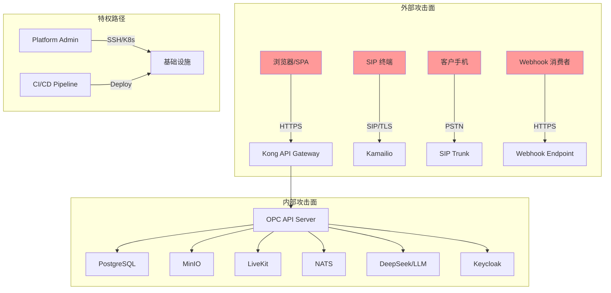

### 1.3 关键资产识别

| 资产 | 业务价值 | 安全要求 |
|------|---------|---------|
| 通话录音 | 法律证据、质检依据 | 完整性 + 机密性 + 可用性 |
| 客户 PII | 隐私合规 | 机密性 + 最小化 |
| AI Prompt/知识库 | 商业核心 | 机密性 + 完整性 |
| 认证凭证 | 安全基石 | 机密性 |
| 计费数据 | 收入保障 | 完整性 + 可用性 |

---

## 2. 数据分类与保护

### 2.1 数据分类矩阵

| 数据类型 | 分类级别 | 存储位置 | 加密要求 | 保留期限 | 访问控制 | 脱敏规则 |
|---------|---------|---------|---------|---------|---------|---------|
| 通话录音 | **高度敏感** | MinIO | AES-256-GCM at rest + TLS 1.3 in transit | 90天（可按法规延长） | supervisor+ | N/A（二进制） |
| 转写文本 | **敏感** | PostgreSQL | 字段级加密（可选 pgcrypto） | 与录音同步删除 | supervisor+ | 展示时隐藏客户姓名 |
| 客户电话号码 | **PII** | PostgreSQL | 标准 TLS in transit | 业务需要期间 | operator+ | `138****1234` |
| 客户姓名 | **PII** | PostgreSQL | 标准 TLS in transit | 业务需要期间 | operator+ | `张*` |
| QM 评分 | 内部 | PostgreSQL | 标准 TLS | 永久保留 | operator+（坐席仅自己） | N/A |
| AI Prompt 模板 | **商业秘密** | PostgreSQL | TLS + 租户隔离 | 永久 | admin+ | N/A |
| 知识库内容 | **商业秘密** | PostgreSQL | TLS + 租户隔离 | 租户自定义 | operator+ | N/A |
| API Keys | **凭证** | 环境变量/K8s Secrets | 不入库、不入日志 | 手动吊销前有效 | system only | 仅显示前 4 位 |
| JWT Tokens | **凭证** | 内存（httpOnly cookie） | 短生命周期 15min | 自动过期 | per-user | 不可查看 |
| Refresh Tokens | **凭证** | 【目标态】Keycloak DB（现状：无 Refresh Token，自签 JWT 单次签发，见 §0） | 加密存储 | 7天 | per-user | 不可查看 |
| 坐席密码 | **凭证** | 【目标态】Keycloak（现状：bcrypt 存 OPC DB，见 §0） | bcrypt (cost=12) | N/A | 不可读取 | N/A |
| 计费信息 | **商业敏感** | PostgreSQL + Stripe | Stripe PCI 合规托管 | 7年（财务法规） | admin+ | 仅显示最后 4 位卡号 |
| Webhook Secrets | **凭证** | PostgreSQL (encrypted) | AES-256 加密存储 | 创建时生成 | admin+（不可查看明文） | `wh_****xxxx` |
| 系统日志 | 内部 | Elasticsearch | PII 自动脱敏 | 30天 | platform admin | 电话/姓名 mask |
| 审计日志 | **合规必要** | PostgreSQL (append-only) | 不可变存储 | 3年 | platform admin | N/A |

### 2.2 数据流转安全

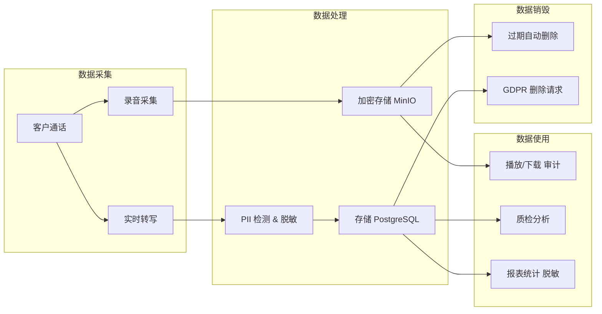

### 2.3 加密密钥管理

| 密钥类型 | 用途 | 轮换周期 | 存储方式 |
|---------|------|---------|---------|
| 主密钥 (KEK) | 加密数据密钥 | 年度 | K8s Secrets / Vault |
| 数据密钥 (DEK) | 加密录音文件 | 每文件独立 | 随密文存储（信封加密） |
| JWT 签名密钥 | Token 签发 | 90天 | 【目标态】Keycloak JWKS（现状：OPC 自签 RS256，`src/middleware/auth.ts`） |
| TLS 证书 | 传输加密 | 90天（自动续期） | cert-manager |
| Webhook HMAC Key | 签名验证 | 创建时生成 | PostgreSQL 加密字段 |

---

## 3. 多租户安全隔离验证

### 3.1 数据层隔离

- [ ] 所有业务表包含 `tenant_id` 字段（NOT NULL + 索引）
- [ ] 所有 SELECT/UPDATE/DELETE 查询包含 `WHERE tenant_id = $1`
- [ ] 禁止跨租户 JOIN（代码审查 + SAST 规则）
- [ ] API 响应不包含其他租户的 `tenant_id` 或数据
- [ ] 数据库连接池按 tenant 设置 row-level security policy
- [ ] 批量操作（导出/报表）严格过滤 tenant 边界
- [ ] 数据库迁移脚本强制 `tenant_id` 约束

```sql
-- PostgreSQL Row-Level Security 示例
ALTER TABLE call_records ENABLE ROW LEVEL SECURITY;

CREATE POLICY tenant_isolation ON call_records
    USING (tenant_id = current_setting('app.current_tenant')::uuid);
```

### 3.2 应用层隔离

- [ ] JWT 中包含 `tenant_id` claim（【目标态】由 Keycloak 注入；现状由 OPC 自签 JWT 签发时注入）
- [ ] 中间件在请求入口解析 JWT 并注入 tenant context
- [ ] Store 层方法第一个参数为 `tenantId`（TypeScript 类型强制）
- [ ] 文件存储按 tenant 分桶（MinIO prefix: `{tenant_id}/recordings/`）
- [ ] 缓存 key 包含 tenant 前缀（`tenant:{id}:cache_key`）
- [ ] AI Agent session 绑定 tenant（不跨租户共享 context）
- [ ] 后台任务（定时删除、报表）携带 tenant 上下文

```typescript
// Store 层 tenant 隔离模式
interface CallRecordStore {
  findBySession(tenantId: string, sessionId: string): Promise<CallRecord | null>;
  list(tenantId: string, filter: ListFilter): Promise<CallRecord[]>;
  create(tenantId: string, data: CreateCallRecord): Promise<CallRecord>;
}
```

### 3.3 网络层隔离

- [ ] 【目标态·Kong 已废】per-tenant rate limiting（现状目标：OPC 中间件实现 per-tenant 限流；Kong consumer group 方案已废）
- [ ] LiveKit room 名称包含 tenant 前缀（`{tenant_id}_{room_id}`）
- [ ] NATS subject 包含 tenant 前缀（`opc.{tenant_id}.events.*`）
- [ ] WebSocket 连接验证 tenant 归属（握手时校验 token）
- [ ] SIP trunk 按 tenant 配置独立凭证
- [ ] Webhook 出站请求不携带其他租户数据

### 3.4 隔离测试验证方案

```
测试场景集:

1. 基础隔离测试
   a. 创建 tenant_A 和 tenant_B
   b. tenant_A 创建通话记录（session_id: "test-001"）
   c. 以 tenant_B 身份请求 GET /calls/test-001 → 预期 404
   d. 以无 token 身份请求 → 预期 401
   e. 以过期 token 请求 → 预期 401

2. SQL 注入测试
   a. tenant_id 参数注入: "abc' OR '1'='1" → 预期参数化查询阻止
   b. 路径参数注入: /api/tenants/../../other_tenant/calls → 预期 400

3. 越权测试
   a. tenant_A operator 尝试修改 tenant_A admin 设置 → 预期 403
   b. tenant_A admin 尝试访问 tenant_B 管理面板 → 预期 404
   c. 伪造 JWT（修改 tenant_id claim）→ 预期签名验证失败 401

4. 文件隔离测试
   a. tenant_A 上传录音到 MinIO
   b. 通过 presigned URL 访问（正确 tenant）→ 预期 200
   c. 篡改 presigned URL 中的 path → 预期 403

5. 实时通信隔离测试
   a. tenant_A 创建 LiveKit room
   b. tenant_B 用户尝试加入 → 预期 token 验证失败
   c. NATS 订阅 tenant_B 的 subject → 预期权限拒绝
```

---

## 4. 认证与授权设计

### 4.1 认证流程

> 下方时序图为**目标态**（Keycloak OIDC + Kong 转发）；现状为自签 JWT 签发与校验无 Refresh Token，鉴权在 OPC 中间件完成（见 §0）。现状下不存在 `KC` / `Kong` 两方，HTTP 请求直入 OPC API Server。

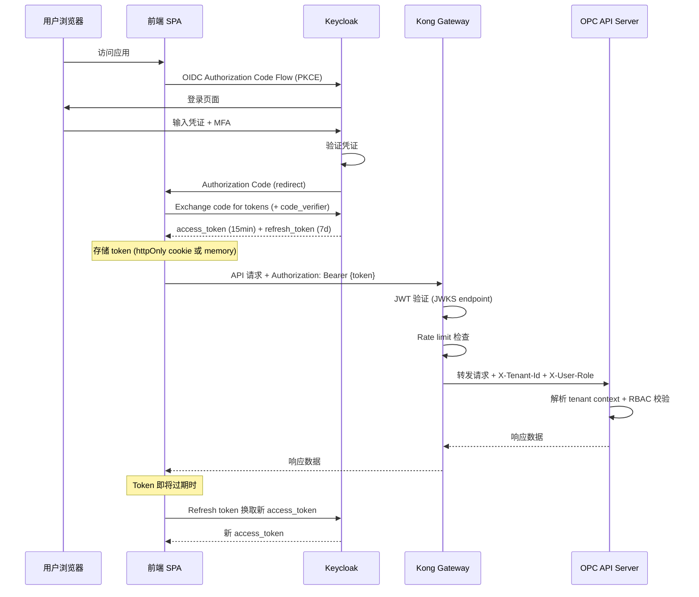

### 4.2 API Key 认证流程（服务间/Webhook）

> 目标态时序图；现状无 Kong，API Key 校验在 OPC 中间件完成。

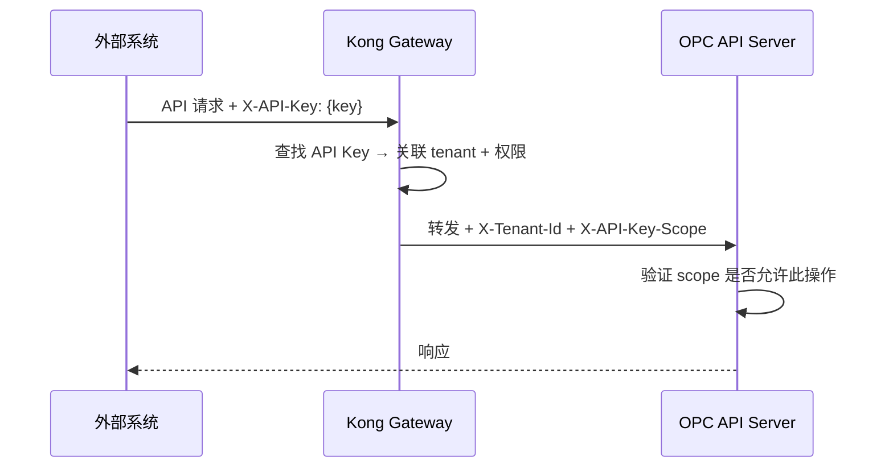

### 4.3 RBAC 权限矩阵

| 操作 | owner | admin | supervisor | operator | viewer |
|------|:-----:|:-----:|:----------:|:--------:|:------:|
| 管理租户设置 | ✓ | ✓ | | | |
| 管理坐席账号 | ✓ | ✓ | ✓ | | |
| 查看通话列表 | ✓ | ✓ | ✓ | ✓ | ✓ |
| 查看通话详情 | ✓ | ✓ | ✓ | ✓（仅自己） | |
| 播放/下载录音 | ✓ | ✓ | ✓ | | |
| 创建外呼任务 | ✓ | ✓ | ✓ | ✓ | |
| 执行外呼 | ✓ | ✓ | ✓ | ✓ | |
| 查看 QM 评分 | ✓ | ✓ | ✓ | 仅自己 | |
| 管理质检规则 | ✓ | ✓ | ✓ | | |
| 管理知识库 | ✓ | ✓ | ✓ | | |
| 管理 AI Agent 配置 | ✓ | ✓ | | | |
| 管理计费/套餐 | ✓ | ✓ | | | |
| 管理 Webhook | ✓ | ✓ | | | |
| 查看审计日志 | ✓ | ✓ | | | |
| 白标/品牌配置 | ✓ | | | | |
| 删除租户数据 | ✓ | | | | |
| 管理 API Keys | ✓ | ✓ | | | |

### 4.4 Token 生命周期管理

| Token 类型 | 有效期 | 刷新策略 | 吊销机制 |
|-----------|--------|---------|---------|
| Access Token (JWT) | 15 分钟 | 通过 Refresh Token 刷新 | 【目标态】Keycloak session 失效（现状：自签 JWT 过期即失效，无 session 侧机制） |
| Refresh Token | 7 天 | 滑动窗口（使用时续期） | 【目标态】用户登出 / 管理员强制下线（现状：无 Refresh Token） |
| API Key | 永不过期 | N/A | 手动吊销（管理后台） |
| LiveKit Room Token | 5 分钟 | 通话中自动续期 | 通话结束即失效 |
| Webhook Secret | 永久 | 手动轮换 | 删除 Webhook 配置 |
| SIP 注册凭证 | 配置期间有效 | N/A | 管理员禁用 |

### 4.5 JWT Payload 结构

> 目标态 `iss` 指向 Keycloak realm；现状 `iss` 为 OPC 自签（如 `opc-auth`）。`exp`/`iat` 为样例，对应 2026-06。

```json
{
  "iss": "opc-jwt-self-signed",
  "sub": "user-uuid-here",
  "aud": "opc-api",
  "exp": 1751212800,
  "iat": 1751211900,
  "tenant_id": "tenant-uuid-here",
  "role": "supervisor",
  "permissions": ["calls:read", "calls:create", "recordings:play", "qm:read"],
  "session_state": "session-uuid"
}
```

---

## 5. 通信加密

### 5.1 传输层加密矩阵

| 链路 | 协议 | 最低版本 | 证书管理 | 备注 |
|------|------|---------|---------|------|
| 浏览器 → 【目标态·Kong 已废】Kong | TLS 1.3 | TLS 1.2 | Let's Encrypt / 自有 CA | HSTS 强制；现状浏览器直连 OPC 中间件 |
| 【目标态·Kong 已废】Kong → OPC API | mTLS（生产）/ HTTP（开发） | TLS 1.2 | 内部 CA (cert-manager) | 内网可降级；现状此链路不存在 |
| OPC → PostgreSQL | TLS | TLS 1.2 | PG server cert | `sslmode=verify-full` |
| OPC → MinIO | TLS | TLS 1.2 | 内部 CA | 同集群可 HTTP |
| OPC → LiveKit | WSS | TLS 1.2 | LiveKit API secret | WebSocket Secure |
| LiveKit → 客户端 | DTLS-SRTP | DTLS 1.2 | 自动协商 (ICE) | 媒体流加密 |
| SIP 信令 (【延后·v2.0+】Kamailio) | TLS | TLS 1.2 | SIP trunk 证书 | 可选 SRTP 媒体；现状 RustPBX 直接终结 SIP |
| SIP 媒体 | SRTP（可选） | - | 密钥协商 (SDES/DTLS) | 依赖 trunk 支持 |
| NATS 集群内部 | TLS | TLS 1.2 | NATS server cert | 节点间加密 |
| OPC → 【目标态·替换为自签 JWT】Keycloak | HTTPS | TLS 1.2 | Keycloak server cert | OIDC/JWKS 端点；现状此链路不存在 |
| AI Agent → OPC | HTTPS + API Key | TLS 1.2 | 公共 CA | Agent 认证 |
| AI Agent → DeepSeek | HTTPS | TLS 1.2 | 公共 CA | API Key 认证 |
| CI/CD → 集群 | mTLS | TLS 1.2 | K8s CA | kubeconfig |

### 5.2 加密架构图

> 目标态拓扑图，含已废/延后的 Kong / Kamailio / Keycloak 节点；现状下这三者不存在，浏览器直连 OPC、SIP 直入 RustPBX、JWT 自签。

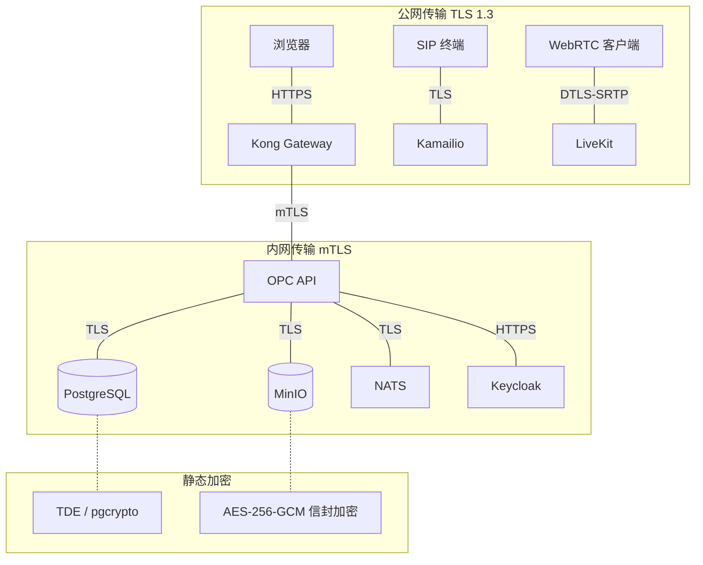

### 5.3 TLS 配置要求

```
# 允许的密码套件（TLS 1.3）
TLS_AES_256_GCM_SHA384
TLS_CHACHA20_POLY1305_SHA256
TLS_AES_128_GCM_SHA256

# 禁用
SSLv3, TLS 1.0, TLS 1.1
RC4, 3DES, MD5, SHA1
NULL cipher suites
Export cipher suites
```

---

## 6. 录音合规设计

### 6.1 录音同意机制

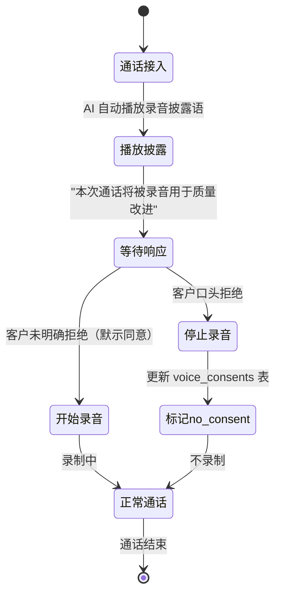

**法规适配**:

| 司法管辖区 | 同意要求 | 实现方式 |
|-----------|---------|---------|
| 中国（《个保法》） | 单方告知即可 | 通话开始播放披露语 |
| 日本 | 双方同意 | 播放披露 + 确认应答检测 |
| 欧盟 (GDPR) | 明确同意 | IVR 按键确认 |
| 美国（部分州） | 双方同意 (如 California) | 按州配置同意策略 |

**数据模型**:

```sql
CREATE TABLE voice_consents (
    id UUID PRIMARY KEY DEFAULT gen_random_uuid(),
    tenant_id UUID NOT NULL REFERENCES tenants(id),
    session_id UUID NOT NULL,
    caller_number VARCHAR(20),
    consent_status VARCHAR(20) NOT NULL, -- 'granted', 'denied', 'pending'
    consent_method VARCHAR(20) NOT NULL, -- 'implicit', 'explicit_voice', 'explicit_dtmf'
    disclosure_played_at TIMESTAMPTZ NOT NULL,
    response_at TIMESTAMPTZ,
    jurisdiction VARCHAR(10) NOT NULL, -- 'CN', 'JP', 'EU', 'US-CA'
    created_at TIMESTAMPTZ NOT NULL DEFAULT NOW()
);
```

### 6.2 录音存储与访问

| 方面 | 设计 |
|------|------|
| 存储后端 | MinIO（S3 兼容，自托管） |
| 存储路径 | `{tenant_id}/recordings/{YYYY}/{MM}/{DD}/{session_id}.opus` |
| 加密方式 | AES-256-GCM（信封加密：每文件独立 DEK，由 KEK 加密后随文件存储） |
| 默认保留 | 90 天 |
| 可配置保留 | 租户可设置 30-365 天，法规优先 |
| 自动删除 | 每日定时任务扫描过期录音，软删除 → 7天后硬删除 |
| 访问方式 | Presigned URL（有效期 5 分钟，一次性） |
| 访问审计 | 每次播放/下载写入 `recording_access_log` |

**访问审计记录**:

```sql
CREATE TABLE recording_access_log (
    id UUID PRIMARY KEY DEFAULT gen_random_uuid(),
    tenant_id UUID NOT NULL,
    recording_id UUID NOT NULL,
    accessed_by UUID NOT NULL, -- user_id
    access_type VARCHAR(10) NOT NULL, -- 'play', 'download'
    ip_address INET,
    user_agent TEXT,
    accessed_at TIMESTAMPTZ NOT NULL DEFAULT NOW()
);
```

### 6.3 数据删除请求处理 (GDPR Article 17 / 个保法)

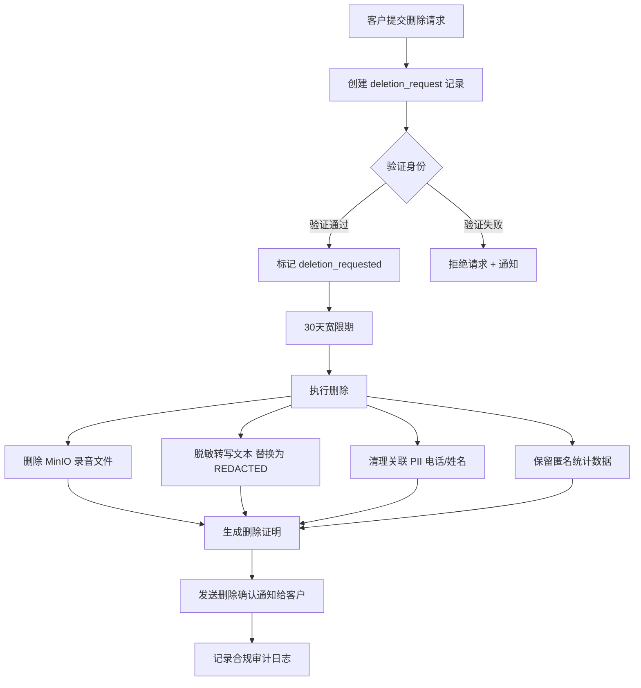

**删除范围**:

| 数据 | 处理方式 | 保留物 |
|------|---------|--------|
| 录音文件 | 物理删除 | 无 |
| 转写文本 | 内容替换为 `[REDACTED]` | 元数据（时长、时间戳） |
| 客户电话号码 | 不可逆 hash | hash 值（用于去重） |
| 客户姓名 | 删除 | 无 |
| 通话统计 | 保留（匿名） | 时长、评分、分类 |
| QM 评分 | 保留（去关联） | 评分值 |

---

## 7. API 安全最佳实践

### 7.1 安全控制清单

| # | 控制项 | 实现方式 | 层级 |
|---|--------|---------|------|
| 1 | **输入验证** | Zod schema 验证所有输入参数（类型 + 长度 + 格式） | 应用层 |
| 2 | **输出编码** | JSON 序列化自动转义，响应 `Content-Type: application/json` | 应用层 |
| 3 | **Rate Limiting** | 【目标态·Kong 已废】Kong rate-limiting 插件：per-tenant 1000 req/min + per-IP 100 req/min（现状：OPC 中间件 per-IP 限流；网关级聚合 per-tenant 限流未实现） | 网关层 |
| 4 | **Request Size** | 【目标态·Kong 已废】Kong `request-size-limiting`: 10MB（现状：OPC 中间件请求体限制） | 网关层 |
| 5 | **CORS** | 白名单域名（生产环境禁止 `*`），预检缓存 1h | 网关层 |
| 6 | **CSRF** | SameSite=Strict cookie + Origin header 校验 | 应用层 |
| 7 | **SQL Injection** | 参数化查询（禁止字符串拼接），ORM 约束 | 数据层 |
| 8 | **XSS** | CSP header + 输出编码 + httpOnly cookie | 网关/应用层 |
| 9 | **依赖安全** | `npm audit` (CI) + Dependabot 自动 PR + Trivy 镜像扫描 | CI/CD |
| 10 | **Secrets** | 环境变量 + K8s Secrets，禁止提交代码仓库 | 基础设施 |
| 11 | **日志脱敏** | PII 字段自动 mask（电话 `138****1234`，姓名 `张*`） | 应用层 |
| 12 | **错误处理** | 统一错误响应格式，生产禁止 stack trace | 应用层 |
| 13 | **幂等性** | 写操作支持 `Idempotency-Key` header | 应用层 |
| 14 | **版本控制** | API 版本通过 URL path（`/v1/`），废弃版本 6 个月过渡期 | 网关层 |

### 7.2 安全响应头

```
Strict-Transport-Security: max-age=31536000; includeSubDomains; preload
Content-Security-Policy: default-src 'self'; script-src 'self'; style-src 'self' 'unsafe-inline'
X-Content-Type-Options: nosniff
X-Frame-Options: DENY
X-XSS-Protection: 0
Referrer-Policy: strict-origin-when-cross-origin
Permissions-Policy: camera=(), microphone=(self), geolocation=()
Cache-Control: no-store
```

### 7.3 统一错误响应格式

```json
{
  "error": {
    "code": "FORBIDDEN",
    "message": "You do not have permission to access this resource",
    "request_id": "req_abc123def456"
  }
}
```

**禁止暴露**:
- 数据库错误详情
- 堆栈跟踪
- 内部服务名称/IP
- 文件系统路径
- 其他租户信息

### 7.4 Webhook 出站安全

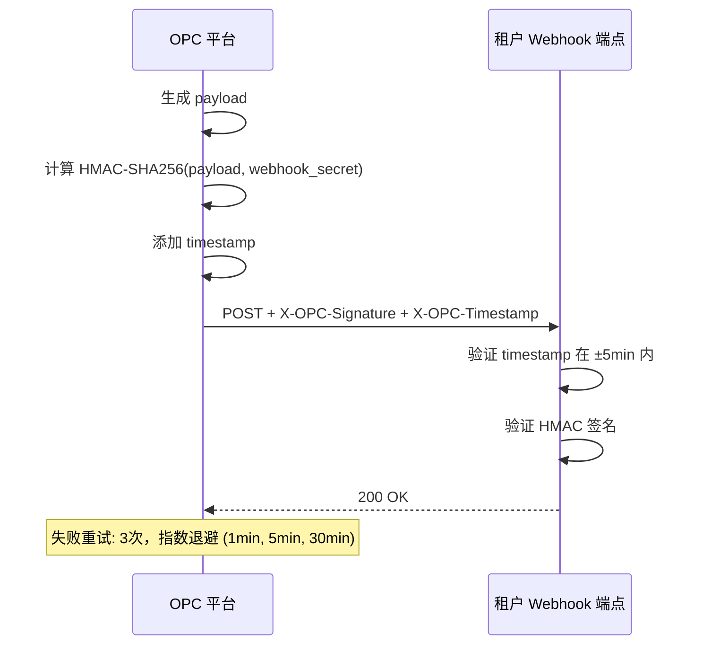

---

## 8. 安全事件响应计划

### 8.1 事件分级

| 事件级别 | 定义 | 示例 | 响应时间 | 通知范围 |
|---------|------|------|---------|---------|
| **P0-严重** | 已确认的数据泄露或未授权访问 | 生产 DB 数据泄露、大规模凭证泄露 | **15 min** | CTO + 全团队 + 法务 |
| **P1-高** | 隔离失效或可被利用的高危漏洞 | 跨租户数据访问、RCE 漏洞 | **1 hr** | Tech Lead + 安全负责人 |
| **P2-中** | 可被利用但影响有限的漏洞 | XSS、CSRF 绕过、信息泄露 | **4 hr** | Tech Lead |
| **P3-低** | 不直接可利用的安全问题 | 版本号暴露、冗余端口开放 | **24 hr** | 排入 backlog |

### 8.2 响应流程

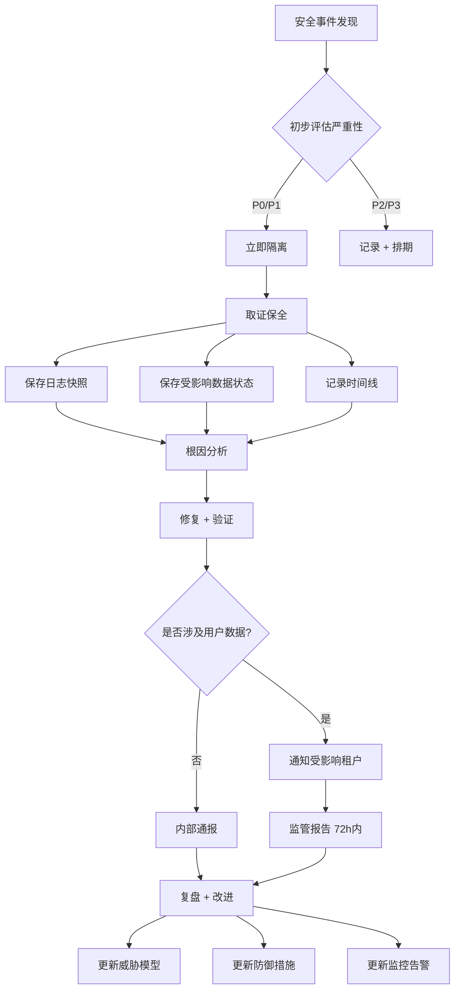

### 8.3 隔离措施

| 场景 | 隔离动作 | 执行方式 |
|------|---------|---------|
| JWT 密钥泄露 | 轮换签名密钥 + 全量 token 失效 | 【目标态】Keycloak 管理 API（现状：轮换 OPC 自签 JWT 签名密钥 + 重启服务使旧 token 失效） |
| 单租户数据泄露 | 禁用该租户 API Key + 暂停服务 | 【目标态·Kong 已废】Kong consumer 禁用（现状：OPC 中间件禁用该 tenant 的 API Key + 标记 tenant 暂停） |
| DB 未授权访问 | 更换 DB 密码 + 断开可疑连接 | pg_terminate_backend |
| API 被滥用 | IP/tenant 封禁 | 【目标态·Kong 已废】Kong IP restriction（现状：OPC 中间件 IP/tenant 封禁） |
| 恶意内部人员 | 撤销所有访问 + 审计操作历史 | 【目标态】Keycloak + 审计日志（现状：OPC 中间件撤销该用户 token + 写审计日志） |

### 8.4 监控与告警

| 监控项 | 阈值 | 告警渠道 | 响应级别 |
|--------|------|---------|---------|
| 认证失败率 | >50次/min (同 IP) | PagerDuty + 钉钉 | P1 |
| 跨租户访问尝试 | 任何一次 | 即时告警 | P0 |
| API 异常流量 | >10x 正常流量 | PagerDuty | P1 |
| DB 慢查询异常增长 | >5x 基线 | 告警群 | P2 |
| 敏感操作（删除/导出） | 每次 | 审计日志 + 通知 | 记录 |
| JWT 验证失败 | >100次/min | 告警群 | P2 |
| 证书即将过期 | 14天前 | 告警群 | P3 |

---

## 9. 合规要求清单

### 9.1 法规对照矩阵

| 法规/标准 | 适用范围 | 关键要求 | 当前状态 | 差距 | 优先级 |
|-----------|---------|---------|---------|------|--------|
| 中国《个人信息保护法》 | PII 处理 | 明示同意、最小必要、删除权、跨境限制 | **部分满足** | 删除流程待完善、同意记录待完整 | P0 |
| 中国《数据安全法》 | 数据分类分级 | 重要数据目录、安全评估、数据出境评估 | **规划中** | 需建立数据分类制度 | P1 |
| 中国《网络安全法》 | 网络运营者 | 等保、安全事件报告、日志 6 月留存 | **部分满足** | 需等保评估 | P1 |
| GDPR | 欧盟用户（如扩展） | 数据主体权利、DPO、72h 泄露报告 | **如进入欧盟市场** | 需完整 DPIA | P2 |
| PCI DSS | 支付信息 | 不存储卡号、加密传输、访问控制 | **满足** | Stripe 代管 | - |
| SOC 2 Type II | SaaS 审计 | 安全/可用/机密性控制证据 | **规划中** | 需建立持续合规证据 | P2 |
| ISO 27001 | 信息安全管理 | ISMS 体系建设 | **远期目标** | 需体系化建设 | P3 |
| 行业：呼叫中心 | 通信监管 | 录音合规、骚扰防控、号码管理 | **部分满足** | 需对接运营商合规要求 | P1 |

### 9.2 个保法合规检查清单

- [ ] 处理 PII 前取得明确同意（录音披露 + 注册协议）
- [ ] 遵循最小必要原则（只收集业务所需数据）
- [ ] 提供数据主体权利接口（查询、更正、删除）
- [ ] PII 跨境传输前完成安全评估（如使用境外 LLM）
- [ ] 个人信息泄露 72h 内报告监管机构
- [ ] 指定个人信息保护负责人（处理量达标时）
- [ ] 定期开展个人信息保护影响评估 (PIA)
- [ ] 与第三方数据处理者签订数据处理协议

### 9.3 数据出境评估（使用境外 LLM 时）

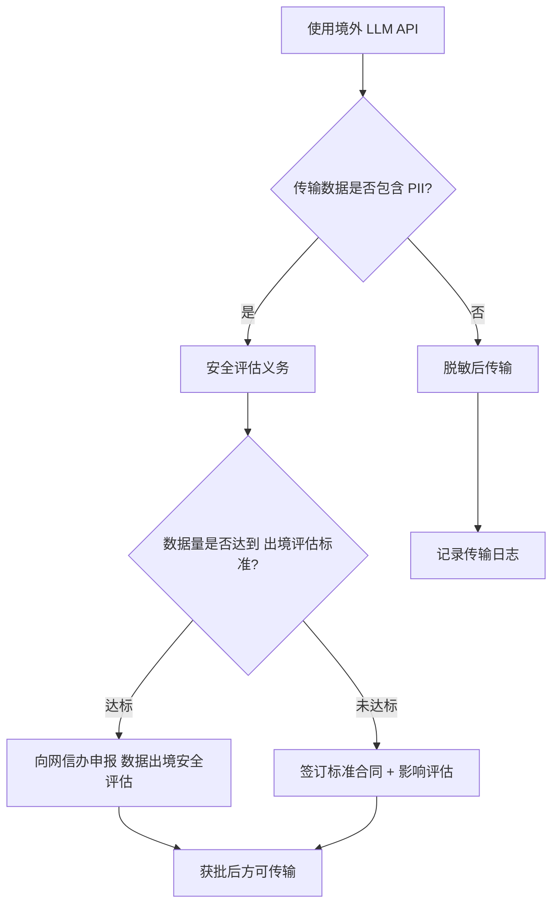

---

## 10. 安全开发生命周期 (SDLC)

### 10.1 各阶段安全活动

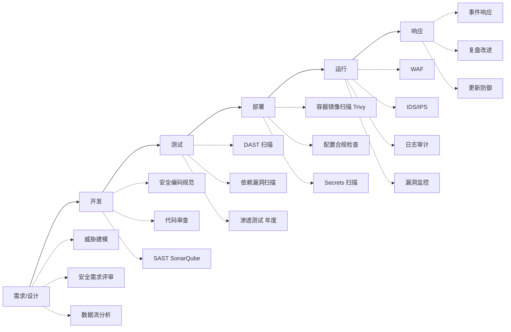

### 10.2 安全工具链

| 阶段 | 工具 | 用途 | 集成方式 |
|------|------|------|---------|
| 设计 | 本文档 | 威胁建模参考 | 人工评审 |
| 开发 | ESLint security rules | 编码规范检查 | IDE + CI |
| 开发 | SonarQube | SAST 静态分析 | CI pipeline |
| 开发 | git-secrets | 阻止提交 secrets | pre-commit hook |
| 测试 | OWASP ZAP | DAST 动态扫描 | CI pipeline |
| 测试 | npm audit | 依赖漏洞 | CI + Dependabot |
| 部署 | Trivy | 容器镜像漏洞扫描 | CI pipeline |
| 部署 | OPA/Gatekeeper | K8s 策略合规 | Admission controller |
| 运行 | 【目标态·延后】Kong WAF plugin | Web 应用防火墙 | 【目标态·Kong 已废】API Gateway（现状：无 WAF，需 Phase 2+ 评估引入独立 WAF 或 OP 中间件规则） |
| 运行 | Elasticsearch + Kibana | 日志审计分析 | 集中日志 |
| 运行 | Prometheus + Grafana | 安全指标监控 | 告警系统 |

### 10.3 安全编码规范要点

1. **参数化查询**: 所有 SQL 使用参数化占位符，禁止字符串拼接
2. **输入边界**: 所有用户输入通过 Zod schema 验证类型和长度
3. **最小权限**: DB 连接使用最小权限账号，应用不使用 superuser
4. **Secrets 管理**: 禁止在代码中硬编码密钥，使用环境变量注入
5. **错误处理**: catch 块必须记录日志，禁止空 catch；对外统一错误格式
6. **依赖管理**: 锁定依赖版本（lockfile），定期更新修复已知漏洞
7. **审计追踪**: 敏感操作（删除、权限变更、数据导出）必须写审计日志
8. **Tenant 隔离**: Store 方法签名强制 `tenantId` 参数，代码审查时验证

### 10.4 安全评审 Checklist（PR 合入前）

- [ ] 新增 API 是否包含认证和授权检查？
- [ ] 数据库查询是否包含 `tenant_id` 过滤？
- [ ] 用户输入是否经过验证和清洗？
- [ ] 是否有新增的 secrets/credentials 需要管理？
- [ ] 错误响应是否泄露内部信息？
- [ ] 日志是否包含未脱敏 PII？
- [ ] 新依赖是否有已知漏洞？
- [ ] 文件上传/下载是否有权限校验和大小限制？

---

## 附录

### A. 术语表

| 缩写 | 全称 | 含义 |
|------|------|------|
| PII | Personally Identifiable Information | 个人可识别信息 |
| RBAC | Role-Based Access Control | 基于角色的访问控制 |
| JWKS | JSON Web Key Set | JWT 公钥集合端点 |
| KEK | Key Encryption Key | 密钥加密密钥 |
| DEK | Data Encryption Key | 数据加密密钥 |
| mTLS | mutual TLS | 双向 TLS 认证 |
| DTLS-SRTP | Datagram TLS - Secure RTP | 媒体流传输加密 |
| SAST | Static Application Security Testing | 静态安全测试 |
| DAST | Dynamic Application Security Testing | 动态安全测试 |
| WAF | Web Application Firewall | Web 应用防火墙 |
| DPO | Data Protection Officer | 数据保护官 |
| DPIA | Data Protection Impact Assessment | 数据保护影响评估 |

### B. 相关文档引用

| 文档 | 位置 | 关系 |
|------|------|------|
| 本目录导航与治理 | `docs/design/README.md` | 文档互链、禁用词表、标记规范 |
| 实现级架构规格 | `docs/design/architecture-v3.md` | 系统架构上下文（当前权威） |
| 战略北极星 | `docs/design/super-contact-center-platform-vision.md` | 战略路线图与四 Phase |
| 修订版总体规划 | `docs/design/revised-master-plan.md` | Sprint 1-12 排期（被本文件 §0 引用） |
| 产品设计 | `docs/design/product-design.md` | 角色/RBAC/页面 |
| 指标与可观测 | `docs/design/metrics-design.md` | 告警通道与 §8.4 对齐 |
| 旧版整体架构 | `docs/architecture-video-voice-callcenter.md` | 历史背景（已被 architecture-v3 替代） |
| 产品方向 | `docs/product-direction-2026-06.md` | 业务背景 |
| 新功能清单 | `docs/new-feature-application-checklist.md` | 开发约束 |
| OPC 编码规范 | `.cursor/rules/opc-coding-standards.mdc` | 安全编码实践 |

### C. 文档变更记录

| 版本 | 日期 | 作者 | 变更内容 |
|------|------|------|---------|
| 1.0 | 2026-06-21 | - | 初始版本：完整安全与合规设计 |
| 1.1 | 2026-06-22 | - | 架构决策校准：§0 声明 Kong / Keycloak / Kamailio 移除或延后 |
| 1.2 | 2026-06-29 | OPC Team | 按 `docs/design/README.md` §3/§4 准绳：正文 Kong / Keycloak / Kamailio 项统一加 `【目标态】`/`【已废】`/`【延后】` 行内标注（共 14 处）；头部加 `<关联文档>` block；附录 B 扩充同目录互链；JWT 样例时间戳更新到 2026；§0 影响段扩展覆盖 §2/§3/§7/§8/§10。未改正文结构。 |
