# OPC「超级联络中心平台」战略与演进报告

> **Revision 5 通信/AI 架构覆盖说明（2026-07-31）**：本文继续作为产品战略北极星；
> RustPBX/rvoip、RTPengine、LiveKit、Active Call、HF Speech Runtime、ViLTE 和
> AI-native Authority 的实现边界以
> [统一通信底座 Revision 5](./unified-communication-foundation-r5.md) 为准。
>
> **版本**: 1.4
> **日期**: 2026-07-29
> **状态**: 活跃 — 后续功能优先级、Sprint 排期、投资讨论均以此为准
> **受众**: 创始团队、产品、工程、投资/合作方
> **关联文档**:
> - [本目录导航与治理](./README.md)（禁用词表 + 现状/目标标记规范 + 时间轴双轨）
> - [产品方向总纲](../product-direction-2026-06.md)
> - [修订版总体规划](./revised-master-plan.md)
> - [架构设计 v3](./architecture-v3.md)
> - [产品设计](./product-design.md)
> - [Gap 分析](./gap-analysis.md)
> - [安全与合规设计](./security-design.md)
> - [指标设计](./metrics-design.md)
> - [Voice 模块抽取备忘](./voice-module-extraction-memo.md)
> - [RustPBX × rvoip 通信底座整合设计](./rvoip-opc-communication-foundation-integration-design.md)

---

## 如何使用本文档

| 场景 | 阅读章节 |
|------|----------|
| 5 分钟电梯演讲 | §1、§2.3 |
| 决定下个 Sprint 做什么 | §6 阶段路线图 + §7 现状校准 |
| 技术架构评审 | §5（14 张架构图）、§8 |
| 竞品/投资材料 | §2、§3、§9 |
| 招聘与组织 | §10 |
| 风险与合规评审 | §11、§12 |

**演进规则**（避免文档腐烂）：

1. 每个 Phase 结束时更新 §7「现状校准」表格中的状态列。
2. 新增能力必须标注：对标厂商功能 ID（§13 附录 A）、所属 Phase、验收标准。
3. 不在本文档写实现细节 — 实现规格仍落在 `architecture-v3.md`、ADR、`phase*-detailed-design.md`。
4. 本文档变更走 PR，需产品 + 工程各一人 Approve。

---

## 目录

1. [执行摘要](#1-执行摘要)  
2. [市场与竞品分析](#2-市场与竞品分析)  
3. [OPC 定位与差异化](#3-opc-定位与差异化)  
4. [九大核心模块 — 目标态规格](#4-九大核心模块--目标态规格)  
5. [目标技术架构](#5-目标技术架构)  
6. [分阶段演进路线图](#6-分阶段演进路线图)  
7. [现状校准（2026-06-25）](#7-现状校准2026-06-25)  
8. [AI 与多代理编排专项设计](#8-ai-与多代理编排专项设计)  
9. [商业模式与 GTM](#9-商业模式与-gtm)  
10. [组织与能力地图](#10-组织与能力地图)  
11. [风险登记册](#11-风险登记册)  
12. [合规、安全与认证路径](#12-合规安全与认证路径)  
13. [附录](#13-附录)

---

## 1. 执行摘要

### 1.1 我们要打造什么

一款**集 Genesys 编排、NICE 分析/WFM、Talkdesk 多代理 AI、Amazon Connect 弹性计费、Zoom 视频原生**之长，并针对 **CCaaS 多租户 SaaS + outcome-based 收费 + AI 视频数字人**场景深度优化的**下一代联络中心平台**（代号：**超级联络中心 / Super CC**）。

**交付模型（2026-06 战略锁定）**：**只做 CCaaS** — 统一运维、统一升级、租户逻辑隔离；**不做**按客户交付的私有化 / 单租户 on-prem（耗费实施精力，与团队规模不匹配）。企业客户通过**专属子域 + 数据隔离 + SLA 合同**满足合规，而非为其单独部署一套栈。

这不是对 Genesys 的 1:1 克隆，而是在**垂直行业（50–500 座席）**切口上，用**更低 TCO、更强 AI 原生、视频成交闭环**建立壁垒。

### 1.2 核心判断（2026 年 6 月市场）

| 判断 | 依据 |
|------|------|
| **没有单一厂商覆盖全部场景** | Genesys 强编排弱 WFM；NICE 强分析弱视频；Talkdesk 强 AI 编排弱电信深度；Amazon 强弹性弱私有化 |
| **AI 从 Assist 走向 Agentic** | 2025–2026 年 CCaaS 采购清单中「AI Agent / Copilot」从加分项变为必选项 |
| **视频客服从 Nice-to-have 变为成交工具** | 高客单价行业（房产、教育、金融咨询）视频面谈转化率显著高于纯语音 |
| **CCaaS 仍是主流采购形态** | 中小企业与成长型企业优先要「注册即用」，不愿承担私有化实施与运维 |
| **按座席数订阅模式受挑战** | 更愿为「有效预约/成交线索」或按量付费，而非纯座席税 |

### 1.3 战略取舍（必须遵守）

| 做 | 不做（战略边界） |
|----|------------------|
| 语音 + 视频 + AI 外呼闭环 | 全球 350+ 预置集成（Phase 4 前） |
| 垂直行业 outcome 计费 | 与 Genesys 正面争夺 2000+ 座席全球部署 |
| **CCaaS 多租户 SaaS**（统一平台运维） | **按客户私有化 / on-prem / 单租户 compose 交付** |
| 够用 WFM + 强 QM | 自建完整 UCaaS（替代 Teams/Zoom 会议） |
| 多 Agent 编排（分阶段） | Day 1 完整 CXA 治理中心 |

### 1.4 时间尺度

| 阶段 | 时间 | 目标 |
|------|------|------|
| **Phase 0** | 已完成 ~80% | 电信底座 + IVR + AI Agent 骨架 + 多租户 |
| **Phase 1** | 0–3 月 | 可演示：外呼 → AI 对话 → 转人工 → 录音/QM |
| **Phase 2** | 3–9 月 | 可签约：呼入 ACD + 坐席面板 + 合规 + 基础报表 |
| **Phase 3** | 9–18 月 | 企业级：全渠道收件箱 + CRM + WFM + 实时 Assist |
| **Phase 4** | 18–36 月 | 超级平台：多 Agent 治理 + 预测路由 + Marketplace |

---

## 2. 市场与竞品分析

### 2.1 Genesys Cloud CX — 基准平台

**总体评价**：全球领先 CCaaS，适合中大型企业与复杂全渠道旅程。

| 维度 | 评价 |
|------|------|
| **优势** | Architect 低代码旅程编排；Predictive Engagement；350+ 集成；全球部署与 SLA |
| **不足** | 定价高（基础 + 大量 add-on）；基础 WFM/报表偏弱；实施周期长 |
| **OPC 借鉴** | 旅程编排思想 → IVR Flow Editor + VoiceAgentSpec 导航；API-first |
| **OPC 不正面打** | 全球运营商认证矩阵、Genesys AppFoundry 生态规模 |

**Genesys 关键实现方式（我们要理解的「为什么强」）**：

```
客户触点事件 → Journey Orchestration Engine
    → 规则 + ML 评分 → 渠道选择（语音/消息/邮件）
    → Architect 流程（队列/IVR/Agent/外部 API）
    → 统一客户档案（Profile）贯穿全渠道
```

OPC 等价物（目标态）：`customer-journey.ts` + `omni-store` + IVR Runtime + Redis session + WS 弹屏。

---

### 2.2 同类平台对照表

| # | 平台 | 核心强项 | 实现要点 | OPC 对标模块 | 优先级 |
|---|------|----------|----------|--------------|--------|
| 1 | **Genesys Cloud CX** | 全渠道旅程编排 + 开放架构 | Architect + Predictive Engagement + 350 集成 | §4.1 全渠道、§4.8 API | P1 |
| 2 | **Five9** | 高强度外呼 + AI 自动化 | Predictive Dialer + Genius AI + CRM Fusion | §4.4 外呼、§4.3 Assist | P0 |
| 3 | **NICE CXone** | WFM + 交互分析 | Enlighten 100% 分析 + 40+ ML 预测 | §4.4 WFM、§4.5 QM | P2 |
| 4 | **Talkdesk** | CXA 多代理 AI 编排 | 容器化多 Agent + Operations Center | §4.2 多代理 | P3 |
| 5 | **Amazon Connect** | 按量付费 + AWS AI | 消费定价 + Bedrock/Lex/Q | §4.7 计费、§8 AI | P2 |
| 6 | **RingCentral** | UCaaS + CC 融合 | 统一通信 + 高品质语音 | 延后（不做 UCaaS 核心） | P4 |
| 7 | **Zoom Contact Center** | 视频原生 + AI Companion | 会议基因 + 视频座席 | §4.1 视频、§3 差异化 | **P0** |
| 8 | **Dialpad** | 实时 AI Coaching | Voice Intelligence 实时话术 | §4.3 Assist | P1 |
| 9 | **8x8** | 全球统一 + 合规 | 多区域节点 + 合规认证 | §12 合规 | P2 |
| 10 | **Cisco Webex** | 企业安全 + 混合办公 | 零信任 + 混合部署 | §12 安全 | P2 |
| 11 | **Microsoft D365** | Teams/Copilot 集成 | CRM + 协作深度绑定 | §4.6 CRM（集成而非替代） | P2 |
| 12 | **Salesforce Service Cloud** | CRM 360° + Einstein | 客户视图 + AI 在 CRM 内 | §4.6 CRM | P1 |
| 13 | **CloudTalk** | 中小企业快速部署 | 轻量 onboarding | §6 Phase 1 体验目标 | P1 |
| 14 | **Nextiva** | UC + CC 一体化 | 打包定价 | 参考定价包装 | P3 |
| 15 | **Vonage** | 可编程 API | Communications API | §4.8 开放平台 | P2 |

---

### 2.3 市场机会窗口

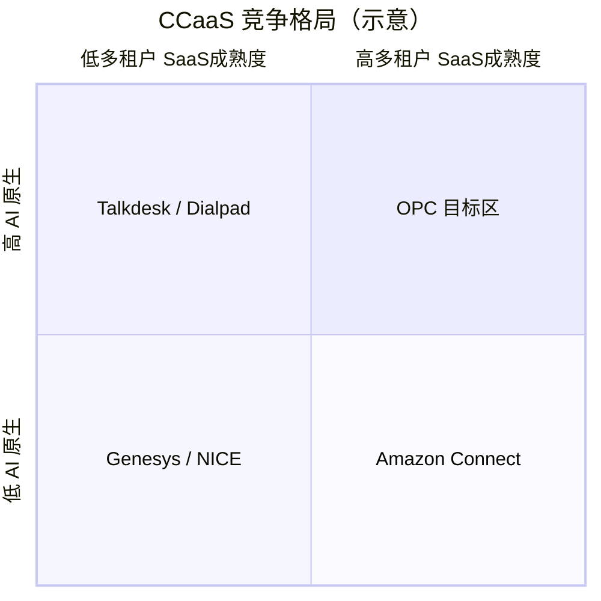

**OPC 目标象限**：**高 AI 原生 + 高 CCaaS 产品化**（注册即用、按量/按 outcome 扩展）。与 Genesys/NICE 拼企业套件与全球交付；与 Amazon Connect 拼视频数字人与垂直 outcome；**不**以「可私有化」作为主卖点（客户问及时：平台级隔离 + 合规认证，而非单独装一套）。

---

## 3. OPC 定位与差异化

### 3.1 一句话定位

> **AI 视频数字人驱动的 CCaaS — 多租户 SaaS，注册即用，按有效结果或按量付费，对标 Genesys 体验、CloudTalk 上线速度。**

### 3.2 交付模型：CCaaS 优先（战略锁定）

| 维度 | CCaaS（我们做） | 私有化（不做） |
|------|-----------------|----------------|
| **运维主体** | OPC 平台团队统一运维 | 客户 IT 或我方驻场实施 |
| **上线时间** | 注册 → 配置 → **数小时** | 环境、网络、证书、联调 → **数周~数月** |
| **版本升级** | 全租户滚动发布 | 每客户单独升级 |
| **隔离方式** | `tenant_id` + PG RLS + 逻辑分区 | 物理独立集群 |
| **线路/SIP** | 平台托管 Trunk 池（租户选号） | 客户自建线路 |
| **计费** | Stripe 订阅 + 用量计量 | 项目制 + 年费 |
| **团队精力** | 产品功能 + 平台可靠性 | 实施、定制、现场排障 |

**企业大客户仍可在 CCaaS 内升级**（非私有化）：

- 专属子域（`tenant.opc.example.com`）
- 更高 SLA / 数据驻留区域（Phase 4：亚太区域节点）
- 合规附件（DPA、录音保留策略、审计导出）
- **可选**：单租户 **VPC 托管**（Phase 4+ 再评估，仅超大合同；非默认产品线）

### 3.3 目标客户画像（Primary ICP）

| 维度 | 描述 |
|------|------|
| **规模** | 50–500 座席（或等效 AI 线路数） |
| **行业** | 外国人不动产、跨境教育、BPO、高端服务业、金融顾问（非银行核心） |
| **地域** | 日本、东南亚、中国出海企业（初期） |
| **采购动机** | ① 外呼获客成本过高 ② 需要视频促成面谈 ③ 要快上线、少养 IT ④ 厌倦 Genesys 座席税 |
| **决策链** | 业务负责人（效果）+ 运营（上线速度）+ 合规（录音/外呼）— **IT 不主导基础设施采购** |

### 3.4 五大差异化支柱

| # | 支柱 | 竞品弱点 | OPC 做法 | 可验证指标 |
|---|------|----------|----------|------------|
| D1 | **AI 视频数字人外呼** | Genesys/Five9 视频需额外集成 | 平台托管 LiveKit + MuseTalk + CosyVoice | 外呼接听率、视频链接打开率 |
| D2 | **Outcome 计费** | 座席数订阅 | 按有效预约/成交线索（效果版）+ 按量（基础版） | 客户 CAC、平台 take rate |
| D3 | **CCaaS 极速上线** | Genesys 实施周期长 | 注册即用 + 模板话术 + 托管线路 | 首次外呼 **< 2 小时** |
| D4 | **AI QM 平替** | NICE Enlighten 昂贵 | 全量转写 + LLM 打分 + 主管复核 | 质检覆盖率 100%、单价 < NICE 1/5 |
| D5 | **低代码 IVR + Spec 一体** | Architect 学习曲线陡 | React Flow IVR + VoiceAgentSpec 导入/导航 | 租户上线 IVR < 2 小时 |

### 3.5 定位边界（避免 scope creep）

| 我们是 | 我们不是 |
|--------|----------|
| **AI-native CCaaS（多租户 SaaS）** | 私有化项目交付公司 |
| 视频成交型外呼平台 | 小红书/社媒获客工具（已归档） |
| 平台托管电信 + AI 栈 | 客户侧 on-prem / 单租户 compose 服务商 |
| 垂直行业 outcome 的技术底座 | 财税低价外呼（已终止方向） |

---

## 4. 九大核心模块 — 目标态规格

以下九个模块整合自 Genesys/Five9/NICE/Talkdesk/Amazon 等平台的强项，构成「超级平台」目标态。每项包含：**能力描述、对标来源、OPC 实现路径、数据模型要点、验收标准、难度、阶段**。

---

### 4.1 模块一：全渠道统一交互层

**难度**：高 | **阶段**：Phase 3（基础）→ Phase 4（预测式介入）

#### 4.1.1 目标能力

| 能力 | 说明 | 对标 |
|------|------|------|
| 单一对话线程（Conversation Thread） | 同一客户跨语音/短信/邮件/Chat/WhatsApp/微信共享上下文 | Genesys Profile |
| 跨渠道上下文记忆 | 24h+ 会话状态、意向分、最近通话摘要自动注入 | Genesys Journey |
| 预测式主动介入 | 根据行为信号（页面停留、未接来电）主动外呼/推送 | Genesys Predictive Engagement |
| 渠道无缝升级 | Chat → 点击链接进视频房间；语音 → 短信发资料 | Zoom CC |
| 统一路由 | 全渠道进入同一 ACD 技能模型 | Genesys ACD |

#### 4.1.2 OPC 实现路径

```
┌─────────────────────────────────────────────────────────┐
│                  Unified Conversation API                │
│  conversation_id (UUID) — 跨渠道主键                      │
│  customer_id — 租户内客户标识（手机/email/openid）         │
│  thread_state — Redis 热状态 + PG 冷存储                  │
└────────────┬────────────────────────────────────────────┘
             │
   ┌─────────┼─────────┬──────────┬──────────┐
   ▼         ▼         ▼          ▼          ▼
 Voice     WebChat    SMS      Email     WhatsApp
(RustPBX)  (Widget)  (Twilio)  (IMAP)    (Cloud API)
```

**代码落点**（现有 + 新建）：

| 组件 | 路径 | 状态 |
|------|------|------|
| Omni Store | `src/agent-runtime/call-center/omnichannel/omni-store.ts` | 骨架 |
| Channel Adapters | `src/agent-runtime/channels/` | 部分 |
| Customer Journey | `omnichannel/customer-journey.ts` | 骨架 |
| Conversation Thread | **新建** `omnichannel/conversation-thread.ts` | Phase 3 |
| Proactive Push | `omnichannel/proactive-push.ts` | 骨架，Phase 4 |

#### 4.1.3 核心数据模型

```sql
-- 目标态（Phase 3 迁移）
CREATE TABLE omni_conversations (
  id TEXT PRIMARY KEY,
  tenant_id TEXT NOT NULL,
  customer_id TEXT NOT NULL,
  status TEXT NOT NULL CHECK (status IN ('open','pending','resolved','snoozed')),
  primary_channel TEXT NOT NULL,
  assigned_agent_id TEXT,
  intent_score REAL DEFAULT 0,
  last_message_at TIMESTAMPTZ NOT NULL,
  metadata JSONB DEFAULT '{}',
  created_at TIMESTAMPTZ NOT NULL DEFAULT NOW()
);

CREATE TABLE omni_messages (
  id TEXT PRIMARY KEY,
  conversation_id TEXT NOT NULL REFERENCES omni_conversations(id),
  channel TEXT NOT NULL,
  direction TEXT NOT NULL CHECK (direction IN ('inbound','outbound')),
  content TEXT NOT NULL,
  content_type TEXT NOT NULL DEFAULT 'text',
  external_id TEXT,
  created_at TIMESTAMPTZ NOT NULL DEFAULT NOW()
);

CREATE TABLE customer_journey_events (
  id TEXT PRIMARY KEY,
  tenant_id TEXT NOT NULL,
  customer_id TEXT NOT NULL,
  event_type TEXT NOT NULL,  -- call.started, chat.message, intent.high, ...
  channel TEXT,
  payload JSONB,
  created_at TIMESTAMPTZ NOT NULL DEFAULT NOW()
);
```

#### 4.1.4 验收标准

| ID | 标准 | Phase |
|----|------|-------|
| OC-1 | 同一手机号来电 + 发 WhatsApp，坐席面板显示同一 `conversation_id` 历史 | 3 |
| OC-2 | AI 外呼摘要自动出现在后续 Chat 会话 system context | 3 |
| OC-3 | 主管可查看客户 30 天旅程时间线（≥5 种事件类型） | 4 |
| OC-4 | 规则引擎：未接来电 2h 内自动 SMS 回访 | 4 |

---

### 4.2 模块二：Agentic AI 多代理编排系统

**难度**：极高 | **阶段**：Phase 2（单 Agent + Tools）→ Phase 4（多 Agent 治理）

> **核心差异化点** — 对标 Talkdesk CXA，但基于 LiveKit Agents 生态扩展。

#### 4.2.1 目标能力

| 能力 | 说明 |
|------|------|
| 多专精 Agent | 销售、合规、知识、路由、质检 Agent 分工 |
| 人类-AI 混合工作流 | AI 处理 L1，阈值触发人工；人工可「交给 AI 继续」 |
| 治理中心（Governance Center） | 审计每个 Agent 决策、token 成本、越权拦截 |
| 工具权限白名单 | 租户级配置 Agent 可调用的 API/Tool |
| 可观测性 | 每通电话的 Agent 调用链、延迟、失败重试 |

#### 4.2.2 分阶段策略（报告建议：先 Assist → 再多代理）

| 子阶段 | 能力 | 技术 |
|--------|------|------|
| **2a** | 单 Outbound/Inbound Agent + function tools | LiveKit Agents SDK（**当前**） |
| **2b** | Router Agent 分派意图到不同 Spec/话术 | `voice-agent-navigator.ts` 扩展 |
| **3a** | 并行子 Agent：合规检查 + 知识检索（不直接对客户说话） | 后台 asyncio task |
| **4a** | 完整 Orchestrator DAG + Governance UI | LangGraph / 自研 state machine |

#### 4.2.3 目标架构图

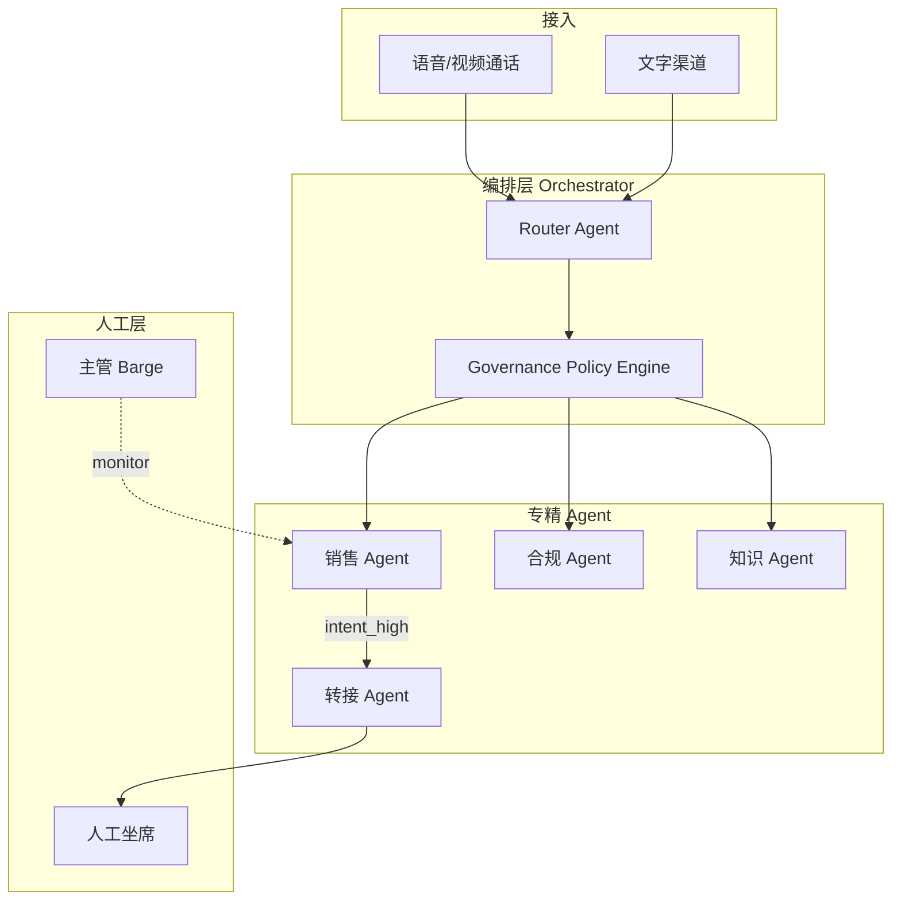

#### 4.2.4 治理策略（Phase 4 必做）

| 策略类型 | 示例规则 |
|----------|----------|
| 成本上限 | 单通电话 LLM 费用 > ¥X 自动转人工 |
| 合规拦截 | 未播放 AI 披露禁止进入销售话术 |
| 工具限制 | 生产环境禁止 `execute_sql` 类工具 |
| 人工接管 | 客户愤怒分 > 0.8 或连续 2 次「听不懂」 |
| 审计 | 所有 tool call 写入 `agent_audit_log` 不可篡改 |

#### 4.2.5 验收标准

| ID | 标准 | Phase |
|----|------|-------|
| MA-1 | 单 Agent 完成外呼全流程（合规→对话→意向→转人工） | 1 |
| MA-2 | Router 根据意图切换 VoiceAgentSpec 节点 | 2 |
| MA-3 | 合规 Agent 在披露完成前阻断销售 tool | 3 |
| MA-4 | Governance UI 可回放任意通话的 Agent 决策链 | 4 |

---

### 4.3 模块三：实时 AI 辅助与 Coaching

**难度**：中高 | **阶段**：Phase 2–3

对标：Dialpad Voice Intelligence、Genesys Agent Assist、Zoom AI Companion。

#### 4.3.1 能力清单

| 能力 | 实时性 | 实现 |
|------|--------|------|
| 实时转写 | < 2s 延迟 | LiveKit STT → WS 推送坐席 |
| 下一最佳行动（NBA） | 每轮对话后 | LLM + 知识库 RAG |
| 情感分析 | 5–10s 窗口 | 文本情感 + 可选音频情感 |
| 自动通话摘要 | 通话结束 | `auto-summary.ts` |
| 话术合规提醒 | 实时 | 关键词 + LLM 审核 |
| 主管 Coach 模式 | 实时 | Whisper 通道（Phase 3） |

#### 4.3.2 数据流

```
Customer Audio ──► STT ──► transcript stream ──► Redis PubSub
                              │                        │
                              ▼                        ▼
                         LLM Assist              Agent Desktop WS
                         (NBA/合规)              (实时字幕+建议卡片)
```

**代码落点**：`knowledge/agent-assist.ts`、`agent-panel/sse-manager.ts`（当前 SSE，目标升级 WS）。

#### 4.3.3 验收标准

| ID | 标准 |
|----|------|
| AC-1 | 坐席面板通话中显示实时转写，延迟 p95 < 3s |
| AC-2 | 每通转人工通话自动生成 ≥3 句摘要 |
| AC-3 | 主管可对低分通话添加 Coach 批注并推送给坐席 |

---

### 4.4 模块四：Workforce Management (WFM)

**难度**：高 | **阶段**：Phase 3（基础）→ Phase 4（ML 预测）

对标：NICE CXone WFM。

#### 4.4.1 能力分层

| 层级 | 能力 | 算法 | Phase |
|------|------|------|-------|
| L1 | 排班表 CRUD、班次模板 | 无 | 3 |
| L2 | 需求预测（单渠道 Erlang C） | 经典 CC 算法 | 3 |
| L3 | 约束优化排班 | Google OR-Tools CP-SAT | 3 |
| L4 | 实时 Adherence 监控 | 对比计划 vs 实际状态 | 3 |
| L5 | 全渠道 ML 预测（40+ 模型） | 自训练 / 参考 NICE | 4 |

#### 4.4.2 现有资产

| 文件 | 能力 |
|------|------|
| `wfm/wfm-store.ts` | 排班数据 |
| `wfm/forecast.ts` | SES 预测 |
| `wfm/scheduler.ts` | 贪心排班（待升级 OR-Tools） |
| `wfm/adherence.ts` | 遵时率 |

#### 4.4.3 验收标准

| ID | 标准 |
|----|------|
| WFM-1 | 主管可创建周排班并分配 ≥10 坐席 |
| WFM-2 | 预测误差 MAPE < 20%（单渠道语音，4 周历史） |
| WFM-3 | Wallboard 显示实时遵时率 |

---

### 4.5 模块五：深度交互分析与 Quality Management

**难度**：高 | **阶段**：Phase 2（AI QM）→ Phase 3（人工复核）→ Phase 4（根因）

对标：NICE Enlighten。

#### 4.5.1 能力清单

| 能力 | 说明 | OPC 路径 |
|------|------|----------|
| 100% 自动打分 | 每通电话 LLM 按评分卡打分 | `qm-evaluator.ts` ✅ |
| 评分卡配置 | 租户自定义维度与权重 | `qm-policy.ts` ✅ |
| 低分告警 | 分数 < 阈值 → WS 通知主管 | Phase 2 |
| 人工复核 | 主管修改分数 + 批注 | Phase 3 |
| 申诉流程 | 坐席对评分申诉 | Phase 3 |
| 根因分析 | 聚类低分原因（话术/合规/产品） | Phase 4 |
| 智能教练 | 自动生成改进建议 | Phase 4 |

#### 4.5.2 QM 评分卡示例结构

```json
{
  "dimensions": [
    { "id": "greeting", "weight": 0.15, "criteria": "是否在 10 秒内自我介绍并说明来电目的" },
    { "id": "compliance", "weight": 0.25, "criteria": "是否播放 AI 标识与录音同意" },
    { "id": "needs_discovery", "weight": 0.20, "criteria": "是否提出 ≥2 个需求探索问题" },
    { "id": "objection_handling", "weight": 0.20, "criteria": "异议处理是否有效" },
    { "id": "closing", "weight": 0.20, "criteria": "是否明确下一步行动" }
  ],
  "pass_threshold": 70
}
```

#### 4.5.3 验收标准

| ID | 标准 |
|----|------|
| QM-1 | 100% 通话 24h 内产生 AI 评分 |
| QM-2 | 主管可导出月度坐席 QM 排名 CSV |
| QM-3 | 低分通话（<60）100% 触发主管通知 |

---

### 4.6 模块六：CRM 与企业系统深度融合

**难度**：中 | **阶段**：Phase 3

#### 4.6.1 集成策略

**原则**：OPC 不是 CRM — 做**零延迟双向同步**的连接器 + 弹屏，重 CRM 逻辑交给 Salesforce/HubSpot。

| 优先级 | 系统 | 方向 | 方式 |
|--------|------|------|------|
| P0 | HubSpot | 双向 | REST + Webhook |
| P0 | Salesforce | 双向 | REST + OAuth |
| P1 | 企业微信 | 通知 + 客户身份 | 已有 wecom adapter 扩展 |
| P2 | 自定义 CRM | 出站 Webhook | 租户配置 |
| P3 | n8n/Zapier | 通用 | Sprint 10 |

#### 4.6.2 同步事件

| OPC 事件 | CRM 动作 |
|----------|----------|
| `call.completed` | 创建/更新 Activity + 附加录音链接 |
| `intent.high` | 提升 Lead Score + 创建 Task |
| `appointment.booked` | 创建 Meeting + 日历邀请 |
| CRM `contact.updated` | 刷新 OPC 弹屏客户卡片 |

#### 4.6.3 验收标准

| ID | 标准 |
|----|------|
| CRM-1 | 来电弹屏显示 HubSpot 联系人（< 1s） |
| CRM-2 | 通话结束 30s 内 CRM 出现带摘要的 Activity |
| CRM-3 | 租户可字段映射配置（phone → mobilephone） |

---

### 4.7 模块七：灵活定价与云原生架构

**难度**：中高 | **阶段**：Phase 2（基础计费）→ Phase 4（混合计费）

对标：Amazon Connect 按量、Genesys 订阅。

#### 4.7.1 计费模型设计

| 模式 | 适用 | 计费维度 |
|------|------|----------|
| **基础版** | 自助 SMB | 年费 + 自付通话费 |
| **效果版** | 垂直行业 | 按有效预约/成交线索（**核心**） |
| **企业版** | 大客户 CCaaS | 年费 + 座席/分钟 + 高级 SLA | 专属子域、更高配额、优先支持 |
| **按量版**（Phase 4） | 开发者 | 分钟数 + AI token + 存储 |

#### 4.7.2 云原生要求

| 要求 | 实现 |
|------|------|
| 水平扩展 | OPC 无状态 + Redis PubSub + PG | CCaaS 标配 |
| 多区域 | Phase 4：亚太区域节点（租户数据驻留选项） | 非 per-customer 私有化 |
| 可观测 | Prometheus + Grafana（见 metrics-design.md） | 平台统一监控 |
| IaC | 一套生产栈 · Helm · **租户不接触基础设施** | 开发用 compose 仅内部 |

#### 4.7.3 验收标准

| ID | 标准 |
|----|------|
| BILL-1 | Stripe 订阅 + 用量上报闭环 |
| BILL-2 | 效果版：有效预约人工审核后触发计费事件 |
| SCALE-1 | 2 实例 OPC + Redis 下 WS 通知不丢 |

---

### 4.8 模块八：全球合规、安全与可编程性

**难度**：高 | **阶段**：Phase 1（底线）→ 持续

#### 4.8.1 合规底线（Phase 1 前必须完成）

| 规则 | 实现 | 文件 |
|------|------|------|
| 外呼时间窗口 | 租户时区 + 法定时段 | `compliance/time-window.ts` |
| 外呼频率限制 | 同号 N 次/天 | `compliance/outbound-compliance.ts` |
| DNC 黑名单 | 永久跳过 | `compliance/compliance-store.ts` |
| AI 披露 | 通话前强制播放 | `compliance/disclosure-enforcer.ts` |
| 录音同意 | 同意状态追踪 | `compliance/consent-tracker.ts` |

#### 4.8.2 可编程性

| 层级 | 能力 |
|------|------|
| REST API | `docs/openapi.yaml` |
| Webhook | 事件订阅 + 重试 + 投递日志 |
| JS SDK | `sdk/javascript/` |
| 低代码 IVR | React Flow 编辑器 |
| VoiceAgentSpec | JSON 契约 + 节点导航 API |
| Marketplace（Phase 4） | 第三方 IVR 组件 |

#### 4.8.3 安全目标态

详见 `security-design.md`。Phase 1–2 必须项：

- 租户隔离（API 层 `tenant_id` 强校验 + PG RLS）
- JWT/API Key 双模式
- Webhook HMAC 签名
- 录音加密存储（MinIO SSE）
- 审计日志 append-only

---

### 4.9 模块九：增强功能（视频 / UCaaS / 移动 / Gamification）

**难度**：中–高 | **阶段**：分散在各 Phase

| 功能 | 说明 | Phase | 优先级 |
|------|------|-------|--------|
| **AI 视频数字人** | MuseTalk + CosyVoice 口型 | 1 | **P0** |
| **人工视频坐席** | LiveKit 双向视频 | 2 | **P0** |
| **屏幕共享** | 坐席演示 | 2 | P1 |
| **H5 客户视频页** | 免安装入会 | 2 | P0 |
| **AR 客服** | — | 不做 | — |
| **统一 UCaaS** | 替代 Teams | 不做 | — |
| **移动 App** | 坐席移动端 | 4 | P2 |
| **Gamification** | 坐席排行榜/徽章 | 4 | P3 |

---

## 5. 目标技术架构

> **图示索引**（本章共 **14** 张架构图，按阅读顺序编号）  
> 图 5-1 分层总览 · 5-2 逻辑分层详图 · 5-3 模块依赖 · 5-4 生产拓扑 · 5-5 开发 Compose  
> 5-6 外呼时序 · 5-7 呼入时序 · 5-8 AI 管线 · 5-9 IVR 双通路 · 5-10 全渠道  
> 5-11 事件总线 · 5-12 安全信任域 · 5-13 数据职责矩阵 · **5-14 多代理编排（Phase 4）**

### 5.1 分层架构总览（图 5-1）

与 [`architecture-v3.md`](./architecture-v3.md) §1 对齐，下图展示**请求/媒体/数据**三条主路径如何在各层穿越。

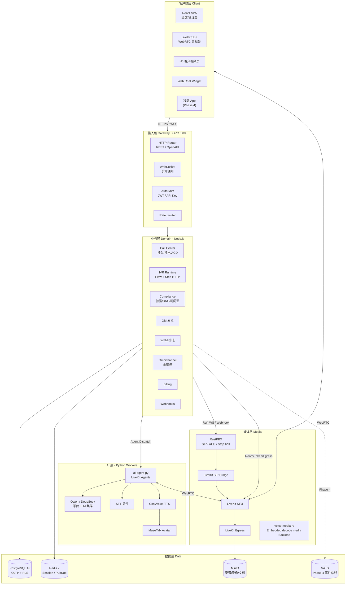

**三条主路径说明**：

| 路径 | 典型场景 | 穿越层 |
|------|----------|--------|
| **信令路径** | 外呼任务创建、转人工、IVR 步进 | Client → Gateway → Domain → PG/Redis |
| **媒体路径** | 双向语音/视频、录音 | Client ↔ LiveKit ↔ RustPBX ↔ PSTN |
| **AI 路径** | 实时对话、质检、摘要 | LiveKit Room → ai-agent-py → LLM/STT/TTS → OPC callback |

---

### 5.2 逻辑分层详图（图 5-2）

下图细化**业务层内部**的 Store 边界与「禁止绕过 Store 写 SQL」原则（见 OPC 编码规范）。

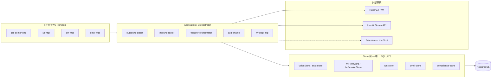

---

### 5.3 业务模块依赖图（图 5-3）

箭头表示**运行时依赖**（A → B 表示 A 调用 B）。合规与鉴权为横切关注点。

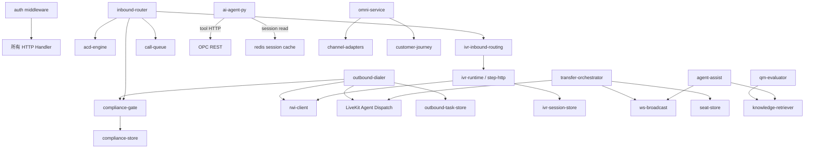

---

### 5.4 技术选型锁定表

| 组件 | 选型 | 角色 | 不可替换原因 |
|------|------|------|--------------|
| 软交换 | **RustPBX** | SBC/B2BUA/Step IVR | 用户选定，RWI 已集成 |
| 视频 SFU | **LiveKit** | 房间/录制/SIP 桥 | Agents SDK 生态 |
| AI 运行时 | **LiveKit Agents (Python)** | 实时对话 | STT/LLM/TTS 插件体系 |
| 主库 | **PostgreSQL 16** | OLTP + RLS | 多租户生产必须 |
| 缓存 | **Redis 7** | Session + PubSub | AI 热路径 < 5ms |
| 对象存储 | **S3 兼容（生产用云 OSS）** | 录音/录像 | MinIO 仅 dev compose |
| 前端 | **React + Vite** | 坐席/管理台 | LiveKit React SDK |
| LLM | **Qwen / DeepSeek** | 对话/质检/摘要 | **平台统一推理集群**，租户不部署模型 |
| TTS | **CosyVoice / edge-tts** | 语音/口型 | 平台托管 TTS 服务 |
| 数字人 | **MuseTalk** | 视频口型 | 已有集成 |

### 5.5 延后/移除组件

| 组件 | 决定 | 理由 |
|------|------|------|
| Chatwoot | 延后 | 太重；用 ChannelAdapter 自建 |
| Kong | 延后 | OPC 中间件够用 |
| Keycloak | 替换为轻量 JWT | MVP 减重 |
| Kamailio | 已启用（Cell/MIX-100K 生产架构） | 早期 1000 路以内 RustPBX 可直入；大规模生产使用独立 SIP Edge 完成容量分发、dialog pin、drain 和安全边界 |
| ClickHouse | 延后 | PG 物化视图够用前期 |

---

### 5.6 生产部署拓扑（图 5-4）— OPC 托管 CCaaS

目标态：**单一 OPC 运营的多租户 CCaaS 生产栈**。所有租户共享应用与媒体集群，通过 `tenant_id`、PG RLS、LiveKit room 命名空间、API Key 隔离。**不为单个租户维护独立 compose / K8s 集群**（开发联调用的 compose 见 §5.7，不对外交付）。

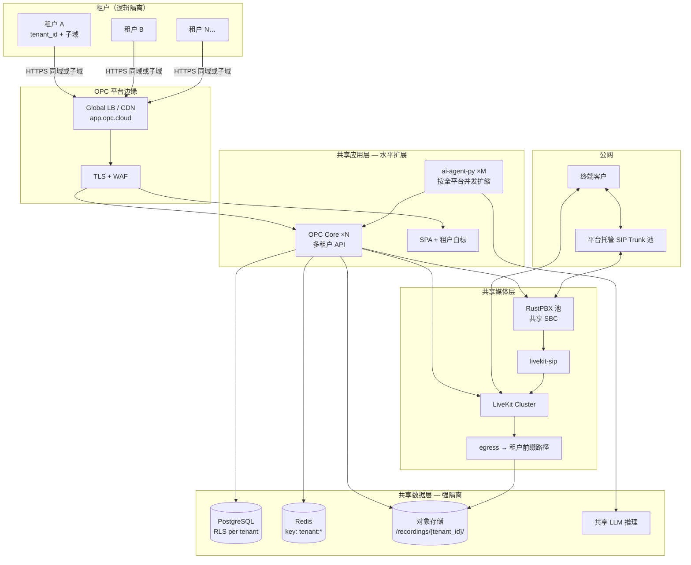

**CCaaS 多租户隔离检查清单**（Phase 1 上线闸门）：

| # | 检查项 | 实现 |
|---|--------|------|
| MT-1 | API 层 `tenant_id` 不可伪造 | JWT claim + Store 强制过滤 |
| MT-2 | 数据库行级隔离 | PostgreSQL RLS |
| MT-3 | Redis key 前缀 | `tenant:{id}:*` |
| MT-4 | 录音/录像路径 | `s3://bucket/{tenant_id}/...` |
| MT-5 | LiveKit room | 命名含 `tenant_id`，token 限定 room |
| MT-6 | Webhook 回调 | 租户独立 signing secret |
| MT-7 | 计费计量 | 用量按 `tenant_id` 聚合 |

**扩缩容要点**：

| 组件 | 扩容触发 | 策略 |
|------|----------|------|
| `ai-agent-py` | 并发通话数 / GPU 利用率 | HPA on queue depth |
| `OPC Core` | HTTP p95 / WS 连接数 | 无状态水平扩展 + Redis PubSub |
| `LiveKit` | 参与者数 / 带宽 | 按房间 shard 或区域 SFU |
| `RustPBX` | CPS / 并发 SIP | 双机 + 线路分流 |
| `PostgreSQL` | 连接数 / IOPS | 读副本 + PgBouncer |

---

### 5.7 开发环境 Compose 拓扑（图 5-5）

> **仅用于工程师本地/云机联调**，模拟生产组件；**不是**交付给租户的部署包。CCaaS 租户永远只访问 `app.opc.cloud`（或白标域名 CNAME 到平台）。

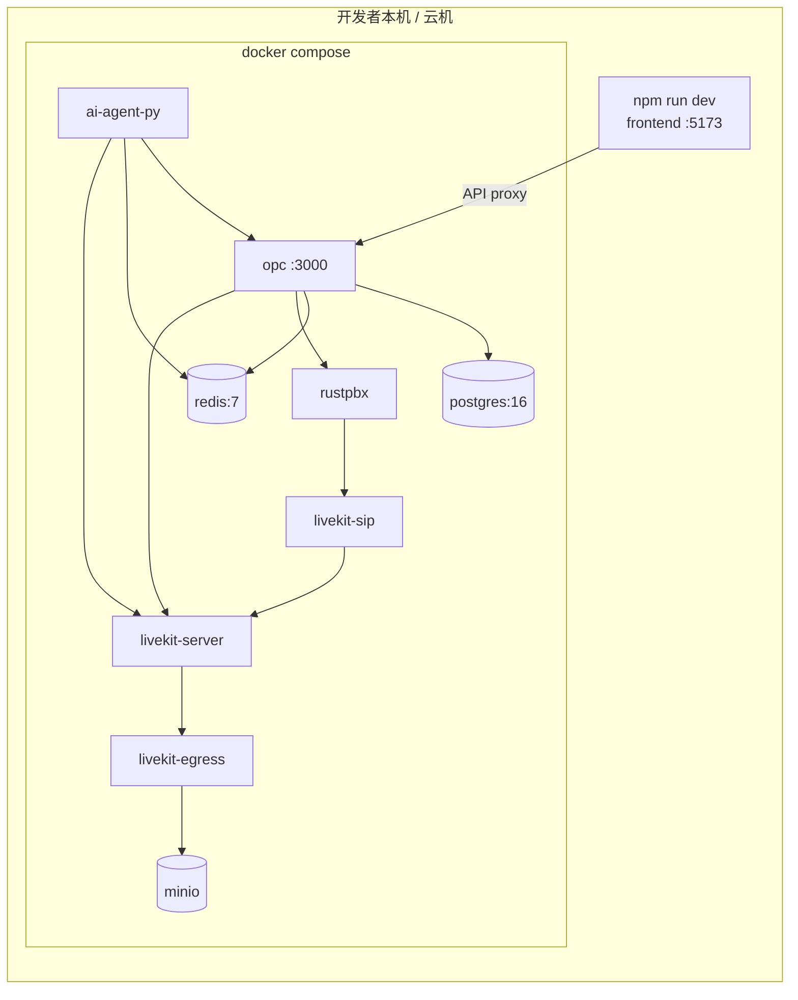

---

### 5.8 外呼端到端时序（图 5-6）

Phase 1 核心演示链路：Campaign → AI 外呼 → 意向 → 转人工 → 录音/QM。

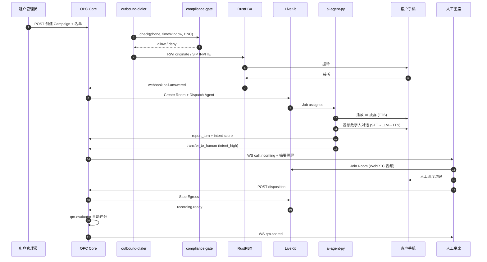

---

### 5.9 呼入端到端时序（图 5-7）

Phase 2 目标链路：PSTN 呼入 → IVR/ACD → 队列 → 坐席或 AI。

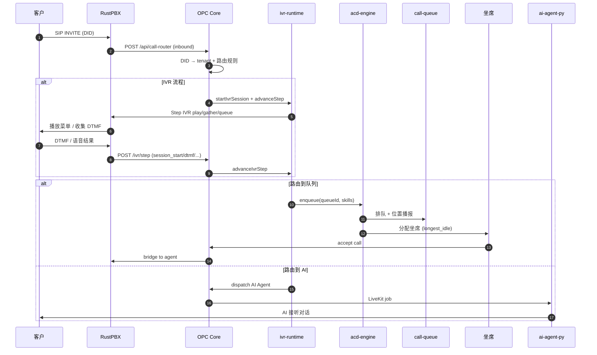

---

### 5.10 AI 实时对话管线（图 5-8）

单次 Agent 会话内的媒体与智能流水线（含 Avatar 口型同步）。

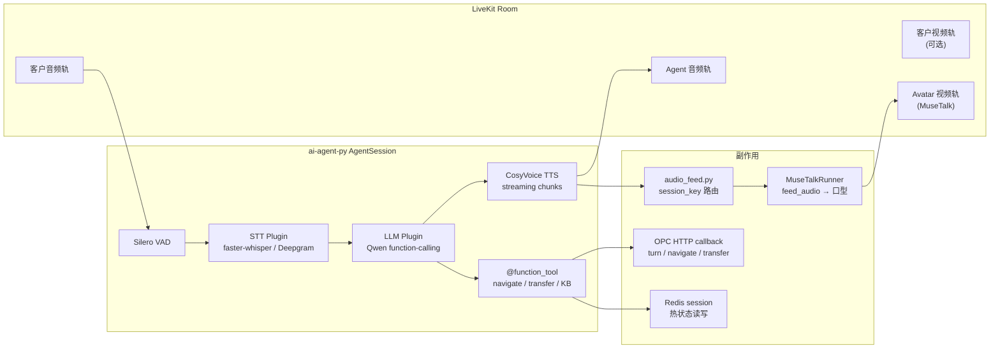

**延迟预算（目标 p95）**：

| 阶段 | 预算 | 说明 |
|------|------|------|
| VAD 端点检测 | 300–500ms | 可配置静音阈值 |
| STT 首字 | < 800ms | 流式 partial |
| LLM 首 token | < 1.5s | 平台共享 Qwen 集群 |
| TTS 首包 | < 500ms | CosyVoice 流式分块 |
| Avatar 口型 | < 200ms | 紧随 TTS chunk |
| **端到端** | **< 3s** | 客户说话 → AI 开始发声 |

---

### 5.11 IVR 双通路架构（图 5-9）

OPC 同时支持 **RWI v1 信封**（RustPBX 原生）与 **Step IVR HTTP**（ADR-5 生产回退），由能力探测自动选择。

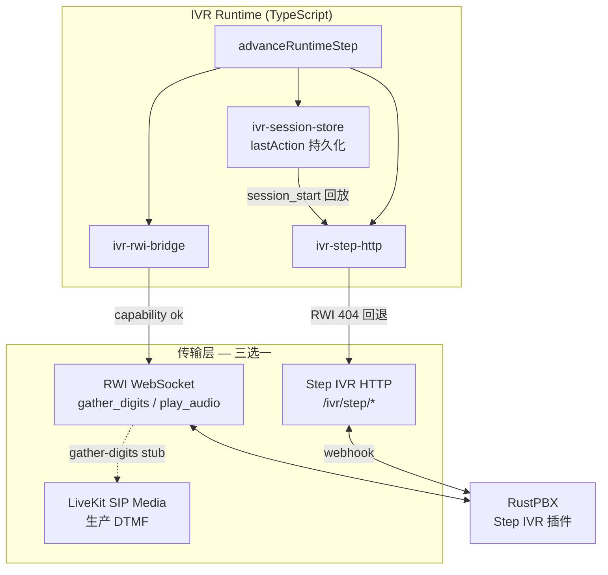

| 通路 | 适用场景 | 生产建议 |
|------|----------|----------|
| **RWI WS** | RustPBX 支持且低延迟 | 首选 |
| **Step IVR HTTP** | RWI 不可用 / 404 | **当前 SIP 冒烟路径** |
| **LiveKit SIP** | 云端纯 LiveKit 栈 | 备选 |

---

### 5.12 全渠道消息流（图 5-10，Phase 3）

统一 `conversation_id` 贯穿语音与消息渠道。

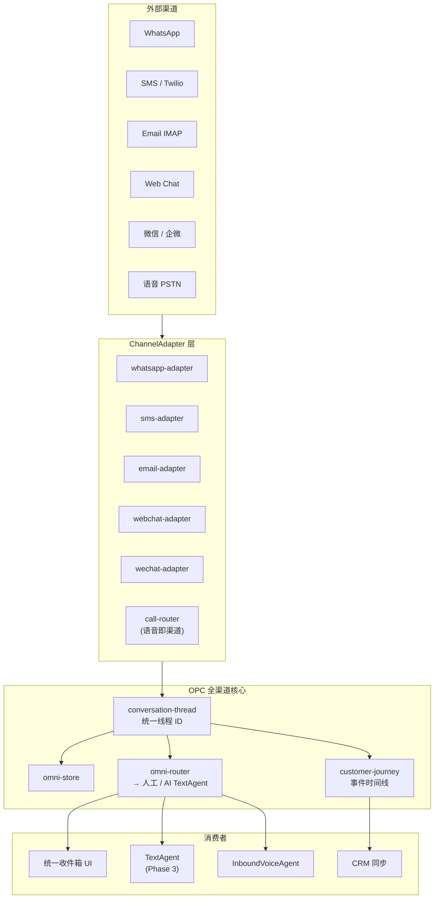

---

### 5.13 事件与集成总线（图 5-11）

Phase 1–2 以 **Redis PubSub + Webhook** 为主；Phase 4 引入 **NATS** 解耦分析/计费/CRM。

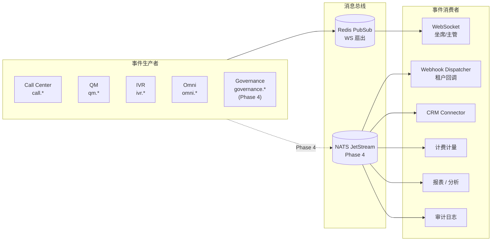

**核心事件（节选）** — 完整列表见 `architecture-v3.md` §13：

| 事件 | Phase | 典型订阅方 |
|------|-------|------------|
| `call.started` / `call.completed` | 1 | CRM、QM、计费 |
| `call.transferred` | 2 | 弹屏、WFM |
| `intent.high` | 1 | CRM Lead 升级 |
| `qm.scored` | 1 | 主管告警 |
| `agent.status_changed` | 2 | Wallboard、WFM adherence |
| `omni.message.received` | 3 | 收件箱、TextAgent |
| `governance.violation` | 4 | 审计、合规 |

---

### 5.14 安全信任域（图 5-12）

Day 1 零信任设计：默认拒绝跨租户；媒体与信令分区。

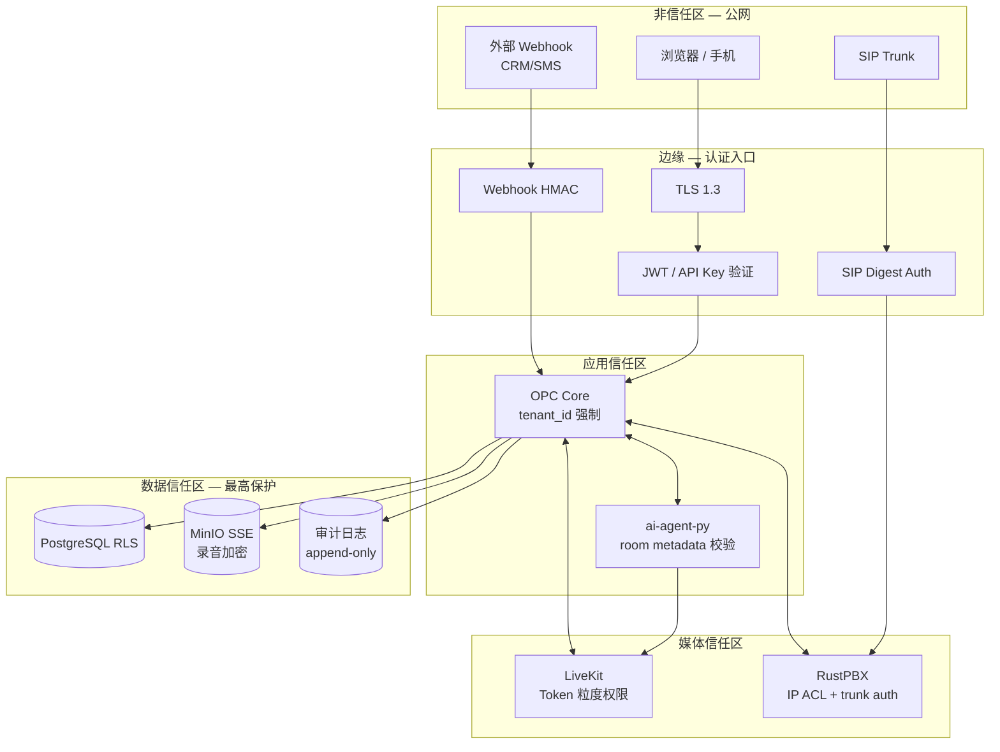

---

### 5.15 数据存储职责矩阵（图 5-13）

**单一事实来源**原则：每类数据只有一个主 Store，其他模块只读或订阅事件。

| 数据域 | 主存储 | 热缓存 | 对象存储 | 负责 Store / 服务 |
|--------|--------|--------|----------|-------------------|
| 租户/用户/权限 | PostgreSQL | — | — | `tenant-core`, `auth` |
| 通话会话状态 | PostgreSQL | Redis | — | `VoiceStore`, `seat-store` |
| IVR 流程定义 | PostgreSQL | — | — | `IvrFlowStore` |
| IVR 运行时步进 | PostgreSQL | Redis | — | `IvrSessionStore` |
| 录音/录像元数据 | PostgreSQL | — | MinIO | `egress-manager`, recordings |
| 录音/录像文件 | — | — | MinIO | LiveKit Egress |
| 转写/摘要 | PostgreSQL | — | — | `conversation-turn-store` |
| QM 评分 | PostgreSQL | — | — | `qm-store` |
| 合规/DNC | PostgreSQL | Redis | — | `compliance-store` |
| 全渠道消息 | PostgreSQL | Redis | — | `omni-store` |
| 客户旅程事件 | PostgreSQL | — | — | `customer-journey` |
| AI Agent 热状态 | Redis | — | — | session metadata merge |
| WFM 排班 | PostgreSQL | — | — | `wfm-store` |
| Webhook 投递日志 | PostgreSQL | — | — | `webhook-delivery-store` |
| 知识库向量 | PostgreSQL/pgvector | — | MinIO(文档) | `knowledge-store` |

**禁止模式**（代码评审检查项）：

- Application 层裸写 SQL 绕过 Store
- 同一事实在 Redis 与 PG 双写且无 merge 原子性
- 录音文件直存 PG BYTEA（必须走 MinIO）

---

### 5.16 多代理编排目标架构（图 5-14，Phase 4）

与 §8 文字规格配套的**目标态**部署图（当前 Phase 1 仅单 Agent）。

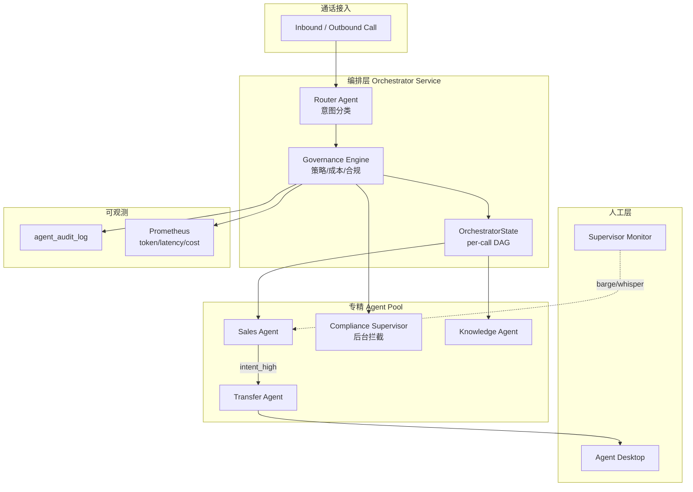

---


## 6. 分阶段演进路线图

### 6.1 总览

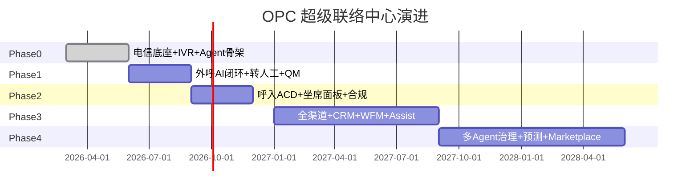

### 6.2 Phase 0 — 电信与 AI 底座（2026.03–06，~80% 完成）

**目标**：打通「能打电话、能跑 IVR、能派 AI Agent」的技术地基。

| 交付物 | 验收 | 状态 |
|--------|------|------|
| RustPBX + LiveKit compose | 容器健康 | ✅ |
| Step IVR HTTP 联调 | session_start 回放 last_action | ✅ |
| IVR Flow Editor + Runtime | M1 play/menu/queue | ✅ |
| ai-agent-py 基础对话 | STT→LLM→TTS | ✅ |
| VoiceAgentSpec CRUD + 导航 | import-ivr + navigate | ✅ |
| RWI Client | gather/play/transfer 信封 | ✅ |
| 多租户 + 基础认证 | JWT + API Key | ✅ |
| IVR DDL 迁移 006/007/008 | PG/SQLite 一致 | ✅ |

**Phase 0 未完成项（CCaaS 视角）**：

- 平台 **staging** 环境 SIP 冒烟常态化（非 per-customer 部署）
- **PostgreSQL + RLS** 作为唯一生产主库（SQLite 仅单测）
- WebSocket 层替代 SSE（多实例 CCaaS 必需）

---

### 6.3 Phase 1 — 可演示 MVP（2026.06–09）

**目标**：可向客户/投资演示完整「AI 视频外呼 → 意向识别 → 转人工 → 质检」链路。

**Must-Have 功能**：

| # | 功能 | 对标 | Sprint |
|---|------|------|--------|
| 1 | PSTN/ SIP 外呼稳定 | Five9 | S2 |
| 2 | AI 对话（含视频数字人） | Zoom CC | S2–S3 |
| 3 | 意向评分 + 自动分级 | Genesys AI | 已有 |
| 4 | AI→人工盲转 + 上下文 | Genesys | S3 |
| 5 | 全量 AI 质检 | NICE 平替 | 已有 |
| 6 | 录音（Egress 真调用） | 全平台 | S3 |
| 7 | 外呼合规（时间窗/DNC/披露） | Genesys | S1 |
| 8 | 坐席 WebRTC 面板（基础） | Zoom | S3 |
| 9 | 来电弹屏 | Genesys CTI | S3 |
| 10 | Redis session 热路径 | 性能 | S2 |

**Phase 1 演示脚本（验收用）**：

```
1. 租户管理员导入外呼名单，创建 Campaign
2. 系统在外呼时间窗内自动拨打客户手机
3. 客户接听 → 听到 AI 披露 → 与视频数字人对话
4. AI 识别高意向 → 盲转人工坐席（带摘要弹屏）
5. 坐席视频沟通 → 挂断 → 自动录音 + AI 质检评分
6. 主管在 QM 看板看到本次通话分数与摘要
```

**Phase 1 KPI**：

| 指标 | 目标 |
|------|------|
| 外呼接通率 | ≥ 25%（行业依赖） |
| AI 对话完成率（未提前挂断） | ≥ 50% |
| 转人工后坐席 10s 内获得摘要 | 100% |
| 端到端演示不中断 | 连续 3 次成功 |

---

### 6.4 Phase 2 — 可签约企业版（2026.09–12）

**目标**：满足企业采购 checklist 的「呼叫中心必备项」。

| # | 功能块 | 关键交付 |
|---|--------|----------|
| 1 | 呼入 ACD | 队列/技能路由/等待音乐/回呼 |
| 2 | IVR 呼入 | DTMF + 语音菜单 + 营业时间 |
| 3 | 坐席工具 | Hold/Transfer/Conference/Disposition |
| 4 | 主管工具 | Monitor/Barge/Whisper/Wallboard |
| 5 | 语音信箱 | 留言 + 转写通知 |
| 6 | 实时转写 | 坐席面板 Live Transcript |
| 7 | 通话自动摘要 | 挂断后 30s 内生成 |
| 8 | PostgreSQL 生产 | 全模块迁 PG |
| 9 | WebSocket 通知 | 替代 SSE 单实例 |
| 10 | 基础报表 | 日/周通话量、AHT、服务水平 |

**Phase 2 KPI**：

| 指标 | 目标 |
|------|------|
| 平台可用性 | ≥ 99.5% |
| 呼入排队放弃率 | < 15% |
| 坐席利用率 | ≥ 70% |
| 首个企业客户签约 | ≥ 1 |

---

### 6.5 Phase 3 — 全渠道与企业集成（2027.01–09）

**目标**：对标 Genesys「统一体验」+ Salesforce「CRM 360°」的够用版。

| 模块 | 交付 |
|------|------|
| 全渠道 | Web Chat + SMS + Email + WhatsApp + 微信 |
| 统一收件箱 | 主管/坐席一个界面处理多渠道 |
| Conversation Thread | 跨渠道上下文 |
| CRM | HubSpot + Salesforce 双向 |
| WFM L1–L4 | 排班 + 预测 + OR-Tools + Adherence |
| 实时 Assist | NBA + 合规提醒 |
| 人工 QM 复核 | 申诉流程 |
| SSO | SAML/OIDC |
| Python SDK | pip 包 |

---

### 6.6 Phase 4 — 超级平台（2027.09–2028.06）

**目标**：实现本报告 §4.2 多代理治理 + §4.1 预测式介入 + 生态。

| 模块 | 交付 |
|------|------|
| 多 Agent Orchestrator + Governance UI | Talkdesk CXA 对标 |
| 预测路由 + 意图预测 | Genesys Predictive |
| 根因分析 + 智能教练 | NICE Enlighten 简化版 |
| WFM ML 全渠道预测 | NICE 简化版 |
| IVR Marketplace | Genesys AppFoundry 简化版 |
| 混合计费引擎 | Amazon Connect 对标 |
| 移动坐席 App | 可选 |
| 多区域部署 | 亚太节点 |

---

### 6.7 与 12 Sprint 规划的映射

| Phase | 覆盖 Sprint | 说明 |
|-------|-------------|------|
| Phase 0 | Sprint 0–3 部分 | 底座 |
| Phase 1 | Sprint 1–3 | MVP 演示 |
| Phase 2 | Sprint 4–5 | 呼入 + 坐席 |
| Phase 3 | Sprint 6–9 | QM/知识库/报表/全渠道 |
| Phase 4 | Sprint 10–12 | 开放平台/情感/预测/Marketplace |

详细 110 项功能对标见 `revised-master-plan.md` §功能完备性逐项对标。

---

## 7. 现状校准（2026-06-25）

> 本节每 Phase 结束必须更新。状态图例：✅ 可用 | ⚠️ 部分/未 E2E | ❌ 未实现 | 🔧 有代码未挂载

### 7.1 基础设施

| 组件 | 状态 | 说明 |
|------|------|------|
| SQLite 主库 | ⚠️ | **CCaaS 上线阻塞项**；dev 可用，生产必须 PG + RLS |
| PostgreSQL 迁移 | ⚠️ | 006/007/008 已有；**全量切 PG + 租户 RLS** 未完成 |
| Redis 热路径 | ⚠️ | client 存在；AI tool 未全走 Redis |
| WebSocket | ⚠️ | SSE 部分替代；**多 Pod CCaaS 必需 WS** |
| Docker Compose 全栈 | ⚠️ | **仅开发/联调**；生产为单一托管 K8s 栈 |
| SIP 双向音频 E2E | ❌ | 平台 staging 冒烟 |
| LiveKit 视频 E2E | ⚠️ | Agent + Avatar 代码有；生产未验 |

### 7.2 业务模块

| 模块 | 状态 | 关键文件 |
|------|------|----------|
| 外呼拨号 | ✅ | `outbound-dialer.ts` |
| RWI 集成 | ✅ | `rwi-client.ts` |
| 转人工 | ✅ | `transfer-orchestrator.ts` |
| 呼入 ACD | ⚠️ | `acd-engine.ts` 有；E2E 未验 |
| IVR Runtime | ✅ | `src/agent-runtime/ivr/` |
| AI Agent | ✅ | `services/ai-agent-py/` |
| Avatar 视频 | ⚠️ | MuseTalk 集成；口型 session_key 已修 |
| 合规引擎 | ⚠️ | 代码有；feature flag 未全开 |
| QM AI 评分 | ✅ | `qm-evaluator.ts` |
| 知识库 RAG | ✅ | `knowledge-retriever.ts` |
| Agent Assist | ⚠️ | 骨架；未接 WS |
| WFM | ⚠️ | 算法有；HTTP 可能未挂载 |
| 全渠道 | ⚠️ | omni 骨架；6 渠道未全通 |
| 计费 Stripe | ⚠️ | 已接 SDK；效果版计费逻辑未完成 |
| 前端坐席面板 | ⚠️ | Phase3 panel 有；WebRTC 未完整 |

### 7.3 测试与质量

| 项 | 状态 |
|----|------|
| `npm run typecheck` | ✅ 0 错误 |
| IVR 专项测试 | ✅ |
| `test:call-center-s12` | ✅ 11/11 |
| Phase 0/1 Docker E2E | ❌ |
| 严格 TypeScript (`strict`) | ❌ false |

### 7.4 与超级平台九模块差距小结

| 模块 | 完成度（估算） | 最大缺口 |
|------|----------------|----------|
| 4.1 全渠道 | 15% | Conversation Thread |
| 4.2 多代理 | 20% | Governance Center |
| 4.3 Assist | 35% | 实时 WS 推送 |
| 4.4 WFM | 25% | OR-Tools + 产品化 |
| 4.5 QM | 55% | 人工复核 + 根因 |
| 4.6 CRM | 10% | Salesforce/HubSpot 双向 |
| 4.7 计费 | 30% | outcome 计费 |
| 4.8 合规 | 50% | 生产全开 + 认证 |
| 4.9 视频增强 | 45% | H5 客户页 + 生产稳定 |

---

## 8. AI 与多代理编排专项设计

### 8.1 Agent 类型定义（目标态）

```python
# 目标：services/ai-agent-py/agents/

class OutboundVoiceAgent(Agent):
    """AI 外呼 — 主动拨打，意向检测，转人工"""
    tools = [navigate_flow, transfer_to_human, query_knowledge,
             check_compliance, generate_summary, report_call_outcome]

class InboundVoiceAgent(Agent):
    """AI 接听 — 意图识别，路由队列"""
    tools = [route_to_queue, query_knowledge, transfer_to_human,
             check_compliance, generate_summary]

class TextAgent(Agent):
    """全渠道文字 — Web Chat/SMS/微信"""
    tools = [query_knowledge, escalate_to_voice, send_template_message]

class ComplianceSupervisor(Agent):
    """后台合规 — 不直接对客户说话，拦截违规 tool"""
    tools = [check_disclosure, check_dnc, check_time_window]
```

### 8.2 Tool 与 OPC API 映射

| Tool | OPC API | 延迟要求 |
|------|---------|----------|
| `transfer_to_human` | `POST /api/call-center/calls/:id/transfer` | < 500ms |
| `navigate_flow` | `POST /api/call-center/calls/:id/navigate` | < 100ms (Redis) |
| `query_knowledge` | 内部 RAG | < 2s |
| `check_compliance` | `POST /api/call-center/compliance/check` | < 200ms |
| `route_to_queue` | `POST /api/call-center/inbound/:id/route` | < 500ms |

### 8.3 多代理编排 Phase 4 参考实现

```
OrchestratorState (per call):
  active_agent: str
  agent_stack: list[str]      # 嵌套调用栈
  governance_decisions: list   # 审计
  token_budget_remaining: int

Transition:
  on intent_detected → Router 选择 Agent
  on governance_block → 降级到人工或安全话术
  on token_budget_exceeded → 强制 transfer_to_human
```

### 8.4 模型路由策略

| 场景 | 模型 | 理由 |
|------|------|------|
| 实时对话 | Qwen3.6-27B（平台托管） | 延迟 + 单位经济学 |
| 质检评分 | DeepSeek / Qwen | 可离线批处理 |
| 摘要生成 | 小模型 / 同模型 | 通话后异步 |
| 情感分析 | 专用小模型 | 低延迟 |

---

## 9. 商业模式与 GTM

### 9.1 定价（与 product-design.md 对齐）

| 版本 | 年费 | 计费 | 目标客户 |
|------|------|------|----------|
| 基础版 | ~¥18,000 | 自付话费 | 小团队试用 |
| **效果版** | ¥0 | 按有效预约 | 垂直行业主战场 |
| 企业版 | ~¥60,000 | 年费 + 座席/分钟 | 大客户 CCaaS：更高 SLA、专属子域、白标 |

### 9.2 GTM 阶段策略

| 阶段 | 策略 |
|------|------|
| Phase 1 | 自有垂直行业（日本不动产）效果版打样 |
| Phase 2 | 同行业转介绍 + **CCaaS 标准合同**（不做定制私有化投标） |
| Phase 3 | 渠道伙伴（SI 转售 CCaaS）+ Marketplace |
| Phase 4 | 亚太多区域 CCaaS 节点 |

### 9.3 竞争话术（销售用）

| 客户说 | 我们回 |
|--------|--------|
| 「我们和 Genesys 差不多吧？」 | 我们不做座席税，按有效预约收费，自带 AI 视频数字人，**注册几小时就能外呼** |
| 「NICE 分析更强」 | 我们用 AI 100% 质检，成本是 NICE 的 1/5，够用 |
| 「必须私有化部署？」 | **标准产品是 CCaaS**：租户隔离、加密、审计导出、DPA 齐全；不做您机房里的单独一套。超大客户 Phase 4 再谈**托管专属实例**，不是 on-prem |
| 「Talkdesk AI 很先进」 | 我们同样 Agent 架构，外加**视频数字人 + outcome 计费**，上线更快 |

---

## 10. 组织与能力地图

### 10.1 Phase 1 最小团队（6–8 人）

| 角色 | 人数 | 职责 |
|------|------|------|
| 全栈/后端 | 2 | OPC Core、IVR、ACD |
| 实时音视频 | 1 | LiveKit、RustPBX、SIP |
| AI Agent 工程师 | 1–2 | Python Agent、RAG、质检 |
| 前端 | 1 | 坐席面板、IVR 编辑器 |
| 产品/行业 | 1 | 话术、合规、客户交付 |
| DevOps / SRE | 0.5→1 | **CCaaS 平台**可靠性、多租户监控、发布 |

### 10.2 Phase 3 扩展团队

| 角色 | 新增 |
|------|------|
| WFM 算法 | 1 |
| 集成工程师 | 1（CRM/渠道） |
| 合规/安全 | 0.5–1 |
| QA / 电信测试 | 1 |

### 10.3 外部合作（集成而非替代）

| 伙伴 | 合作方式 |
|------|----------|
| Salesforce/HubSpot | 认证连接器 |
| Twilio/阿里云 | 备用 SIP/SMS |
| 运营商/线路商 | SIP Trunk |
| 审计机构 | SOC2/等保咨询 |

---

## 11. 风险登记册

| ID | 风险 | 影响 | 概率 | 缓解 |
|----|------|------|------|------|
| R1 | SIP 线路封号 | 外呼停 | 中 | 多线路池 + 合规引擎 |
| R2 | AI 幻觉导致合规事故 | 法律 | 中 | 披露 + 合规 Agent + 录音 |
| R3 | SQLite 上生产 | 数据 | 高 | Phase 2 前强制 PG |
| R4 | 多 Agent 复杂度失控 | 工期 | 高 | 严格分阶段，Phase 4 前不做 |
| R5 | Genesys 降价挤压 | 商务 | 中 | 垂直行业 outcome 差异化 |
| R6 | MuseTalk GPU 成本 | 毛利 | 中 | 按需启用 avatar；音频降级 |
| R7 | 人才招聘难（SIP+AI） | 进度 | 中 | 远程 + 顾问 |
| R8 | 外呼法律变化 | 合规 | 低 | 合规引擎可配置 + 法务顾问 |
| R9 | **私有化需求拖垮产品节奏** | 工期/焦点 | 中 | **战略锁定 CCaaS**；销售话术 + 合同模板标准化；超大单 Phase 4 托管实例 |

---

## 12. 合规、安全与认证路径

### 12.1 区域合规要点

| 区域 | 关键法规 | OPC 对策 |
|------|----------|----------|
| 日本 | 特定電子メール法、個人情報保護法 | 同意追踪 + オプトアウト |
| 中国 | 外呼管理规定、个人信息保护法 | 时间窗 + 频率 + 同意 |
| 欧盟 | GDPR | 数据删除权 + 录音同意 |
| 美国 | TCPA、CCPA | DNC + 披露 |

### 12.2 认证路线图

| 认证 | 目标时间 | 用途 |
|------|----------|------|
| 等保二级 | Phase 2 | 国内政企 |
| SOC 2 Type I | Phase 3 | 海外企业 |
| ISO 27001 | Phase 4 | 大企业投标 |

---

## 13. 附录

### 附录 A：功能对标主表（110 项索引）

完整表格见 [`revised-master-plan.md` §功能完备性逐项对标](./revised-master-plan.md)。

分类速查：

| 分类 | 项数 | Phase 1 覆盖 | Phase 4 全覆盖 |
|------|------|--------------|----------------|
| A 呼入 | 10 | 0 | 10 |
| B 呼出 | 10 | 3 | 10 |
| C 坐席工具 | 14 | 4 | 14 |
| D 主管工具 | 8 | 0 | 8 |
| E 录音质检 | 10 | 4 | 10 |
| F AI 能力 | 10 | 5 | 10 |
| G 全渠道 | 12 | 1 | 12 |
| H 报表 | 10 | 1 | 10 |
| I 集成 | 10 | 3 | 10 |
| J 管理合规 | 10 | 4 | 10 |
| K WFM | 6 | 0 | 6 |
| **合计** | **110** | **~25** | **110** |

### 附录 B：关键 API 面（按 Phase）

| Phase | 新增 API 域 |
|-------|-------------|
| 1 | `/api/auth/*`、`/api/call-center/compliance/*`、坐席 WebRTC |
| 2 | `/api/call-center/queues/*`、`/api/call-center/inbound/*`、agent-tools |
| 3 | `/api/omni/*`、`/api/crm/*`、`/api/wfm/*` |
| 4 | `/api/orchestrator/*`、`/api/marketplace/*` |

完整 API 见 `architecture-v3.md` §12。

### 附录 C：事件目录（Webhook / NATS）

| 事件 | Phase | 消费者 |
|------|-------|--------|
| `call.started` | 1 | CRM、QM |
| `call.completed` | 1 | CRM、计费、QM |
| `call.transferred` | 2 | 弹屏、报表 |
| `intent.high` | 1 | CRM、路由 |
| `qm.scored` | 1 | 告警、报表 |
| `agent.status_changed` | 2 | WFM、Wallboard |
| `omni.message.received` | 3 | 收件箱、AI |
| `governance.violation` | 4 | 审计、告警 |

完整事件见 `architecture-v3.md` §13。

### 附录 D：文档演进检查清单

每个 Phase 结束时执行：

- [ ] 更新 §7 现状校准表
- [ ] 更新 `gap-analysis.md`
- [ ] 新增 ADR（重大架构决策）
- [ ] 更新 `product-design.md` MVP 边界
- [ ] 同步 `revised-master-plan.md` Sprint 状态
- [ ] 运行 `npm run test:callcenter` 并记录结果
- [ ] 更新本文件版本号与日期

### 附录 E：PoC 验收清单（Phase 1 投/demo 用）

**PoC-A：AI 视频外呼闭环（4 周）**

| # | 步骤 | 通过标准 |
|---|------|----------|
| 1 | 导入 100 条测试名单 | 无格式错误 |
| 2 | 创建 Campaign 并启动 | 30 分钟内开始拨号 |
| 3 | 客户接听 | 听到披露 + AI 问候 |
| 4 | 视频数字人显示 | H5/电话链路看到视频 |
| 5 | 意向对话 | AI 完成 ≥3 轮 |
| 6 | 高意向转人工 | 坐席 10s 内收到弹屏+摘要 |
| 7 | 通话结束 | 录音可回放 |
| 8 | QM 评分 | 24h 内出分 |

**PoC-B：双 Agent 合规（8 周，Phase 3 预研）**

| # | 步骤 | 通过标准 |
|---|------|----------|
| 1 | 未披露时销售 tool 被阻断 | 100% 拦截 |
| 2 | 披露完成后销售正常 | 对话流畅 |
| 3 | 并发 2 路 avatar 不串音 | 口型与音频匹配 |
| 4 | 治理日志可审计 | 完整 tool 链 |

---

## 变更记录

| 版本 | 日期 | 作者 | 变更 |
|------|------|------|------|
| 1.4 | 2026-07-29 | Codex | 对齐唯一通信底座生产基线：`voice-media-rs` 不再只是 token/录音 helper，而是 Unified RustPBX 进程内解码媒体 Backend；普通 RTP 仍由外部 RTPengine 默认承载。 |
| 1.3 | 2026-06-29 | OPC Team | 按 `docs/design/README.md` 准绳：头部 `<关联文档>` block 补 README / voice-memo 互链；日期对齐到 2026-06-29。未改 §1-§13 正文与禁用词延后表（§5.5 L831-835 本即为 README §3 表的裁决源之一）。 |
| 1.2 | 2026-06-25 | OPC Team | **战略锁定 CCaaS**：全文去除「私有化优先」；§3.2 交付模型对比；§5.6 改为多租户托管拓扑 + MT 隔离清单 |
| 1.1 | 2026-06-25 | OPC Team | §5 扩充 14 张技术架构图（分层/部署/时序/IVR/全渠道/事件/安全/数据矩阵/多代理） |
| 1.0 | 2026-06-25 | OPC Team | 初版：九大模块 + 四 Phase 路线图 + 现状校准 |

---

*本报告整合 Genesys/Five9/NICE/Talkdesk/Amazon Connect 等竞品分析及 OPC 现有架构文档，作为「超级联络中心平台」的长期演进北极星。具体 Sprint 任务拆解仍以 `revised-master-plan.md` 为准；实现规格以 `architecture-v3.md` 为准。*
