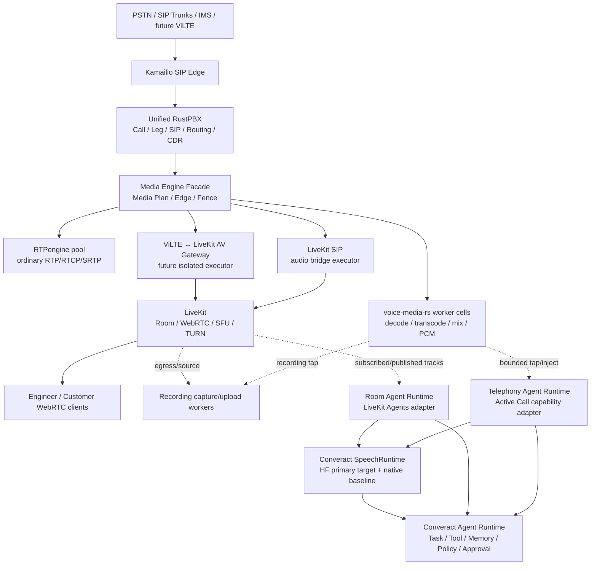

# Converact Fabric — 统一通信底座与 AI-native 接口 Revision 5.1

> <关联文档>
>
> - [Revision 5 绑定目标](../capacity/contracts/unified-communication-foundation-r5-objective.md)
> - [Revision 5 机器合同](../capacity/contracts/unified-communication-foundation-r5-v1.json)
> - [Revision 5 追踪合同](../capacity/contracts/unified-communication-foundation-r5-traceability-v1.json)
> - [Revision 5 实施计划](./2026-07-31-unified-communication-foundation-r5-implementation-plan.md)
> - [AI-native 多模态通信与业务执行平台 R2](./2026-07-31-ai-native-multimodal-communications-execution-platform-r2.md)
> - [Revision 4 RustPBX × rvoip 整合设计](./rvoip-converact-communication-foundation-integration-design.md)
> - [Revision 4 VOS5000 对标与 100K 计划](./communication-foundation-vos5000-parity-performance-plan.md)
> - [ADR-CCAAS-5：Media Authority 与 RTPengine](../adr/ccaas-5-media-authority-and-rtpengine.md)
> - [ADR-CCAAS-7：RustPBX 与 rvoip 能力吸收](../adr/ccaas-7-rvoip-rustpbx-replacement-and-extraction.md)
> - [ADR-CCAAS-8：Voice/SIP 与 LiveKit 音频桥接](../adr/ccaas-8-voice-livekit-bridge-handoff.md)
> - [ADR-CCAAS-9：Channel Agent 与 Speech Runtime](../adr/ccaas-9-channel-agent-and-speech-runtime.md)
> - [ADR-CCAAS-10：ViLTE 与 LiveKit AV Gateway](../adr/ccaas-10-vilte-livekit-av-participant-gateway.md)
> - [ADR-CCAAS-11：Engagement 与 Resolution Profile](../adr/ccaas-11-engagement-platform-and-resolution-profile.md)
> - [统一领域语言](../../CONTEXT.md)
>
> </关联文档>

- 文档状态：**Accepted architecture; implementation and production eligibility remain gated**
- Revision：5.1（只增加 R2 领域映射；R5 machine contract v1 不变）
- 决策日期：2026-07-31
- 现状核查日期：2026-07-31
- 决策 ID：`unified-communication-foundation-r5`
- Runtime enablement：`false`
- Production capacity claim：`none`
- 未执行证据：统一记为 `not_run`

---

## 1. 文档作用、继承关系与裁决优先级

本文件把多轮讨论收敛成一个完整架构。它不是重新发明 Revision 4，也不把已经冻结的
R4 合同改成历史废纸。它按以下方式继承：

1. Revision 4 继续规范 SIP、Call、Media Plan、RTPengine、`voice-media-rs`、G.729、
   Voice↔LiveKit 音频桥、恢复、迁移、容量和 VOS-EQ/100K 门禁。
2. Revision 5 对 R4 做增量裁决，补齐 Channel Agent、Hugging Face
   `speech-to-speech`、LiveKit 音视频切换、ViLTE/4G 视频、AI-native 和生产故障域。
3. R5 不复制 R4 的 362 条追踪行；R5 机器追踪合同通过固定路径、SHA-256、行数和摘要
   完整继承 R4，再逐条登记 R5 新增要求。R4 未通过项在 R5 中仍是未通过。
4. 若旧 AI 文档把 LiveKit Agents、`ai-agent-py` 或任一 Provider 写成跨渠道唯一
   Agent Authority，以本文件和 ADR-CCAAS-9 为准。
5. 若旧语音文档把 `livekit-sip` 音频桥泛化为视频桥，以本文件和 ADR-CCAAS-10 为准。
6. 若旧文字把“单一 Authority”解释成“所有执行器必须处于同一 OS 进程”，以本文件
   第 8 节的故障域裁决为准。
7. `docs/architecture/component-authority-matrix-v1.json` 与
   `communication-technology-baseline-v1.json` 暂时仍是现有交付脚本消费的 current
   inventory；其中 LiveKit Agents 为 AI primary、`voice-media-rs` 永远进程内或 AI
   overlay 已 production-eligible 等旧语义不再是 R5 Authority/资格结论。R5 机器合同是
   新架构权威；v1 inventory 的代码/schema 迁移属于后续 TDD，不在本次文档任务中偷改。
8. R2 决定 Converact 的平台/产品范围和 `Engagement → Interaction → CommunicationSession`
   上位关系；R5 继续决定通信、媒体和 Channel Agent 合同。R2 不修改 R5 machine contract
   中已有 `interaction_id` 的切换/fence 语义，也不把 Resolve Profile 设为通信底座前置。

裁决优先级固定为：

```text
R5 binding objective
    > R5 machine contract / traceability
    > 本设计 + ADR-CCAAS-9/10
    > R4 machine contract / traceability
    > R4 主设计 + ADR-CCAAS-5/7/8
    > 旧 AI、语音、产品和实施参考文档
```

该优先级只适用于通信/媒体领域。平台类别、Engagement、Profile、Offer 和跨产品 Gate 以
R2/ADR-CCAAS-11 为准；Resolve 的垂直业务细节以其 R1 Profile 为准。

“优先”只解决冲突，不删除旧要求。任何未被 R5 明确替换的 R4 要求继续有效。

## 2. 最终架构裁决

最终生产方向锁定为：

> **一个 Converact 业务与通信权威体系，多个按职责隔离、可替换、无业务 Authority 的执行器。**

不可变的核心决定：

1. **Kamailio 是 SIP Edge。** 它负责公网入口、ACL、限流、拓扑隐藏、边缘路由和
   Edge-to-Core 安全，不拥有 Call、计费或媒体业务状态。
2. **Unified RustPBX 是唯一 Rust 通信产品主干。** 它拥有 Call、Leg、Business
   Dialog、路由、Trunk、Queue、DTMF 业务事件、Logical Media Graph、CDR 和录音意图。
3. **rvoip 只按能力切片吸收。** SIP parser/transaction/dialog/transport、RTP 算法、
   codec、测试方法等必须逐 slice 评估；不部署第二个 rvoip PBX，不引入第二套 Call、
   Session 或媒体权威。
4. **RTPengine 是普通 RTP/RTCP/SRTP 的长期性能底线和默认 Fast Path。** Rust-native
   Fast Path 只有在同硬件、同功能、同故障条件下不劣，才可成为同一架构内的候选
   Backend；它不是必须完成的宗教式重写。
5. **`voice-media-rs` 是需要解码的媒体引擎外观。** 它承载 codec、转码、混音、
   播放、录音 tap、AI tap 和 PCM 注入；生产执行可按风险拆入受监管 worker，但
   Media Plan 和 writer fence 仍只归 RustPBX Media Engine Facade。
6. **LiveKit 是 Room/WebRTC/SFU Authority。** 浏览器坐席端的音频、视频、屏幕共享、
   ICE、DTLS、SRTP、TURN、Room participant/track 都归 LiveKit。
7. **LiveKit SIP 只作为音频桥执行器。** 官方当前明确不支持 Video over SIP；不得把
   现有音频桥当成 ViLTE 视频方案。
8. **未来 ViLTE 使用双向 AV Participant Gateway。** 它把运营商 SIP/SDP/RTP/SRTP
   音视频映射为 LiveKit participant/tracks，反向亦然；它不拥有 Call、Room、计费、
   录音或 Agent 业务状态。
9. **Active Call 是 pure PCM/canonical-event 电话渠道 Agent adapter，不是第二个
   PBX。** 只保留其与电话 Agent 相关的独特能力；SIP/RTP executor 不进入生产路径，
   DTMF 来自 RustPBX canonical event，电话和业务动作只形成 proposal。
10. **LiveKit Agents 是 LiveKit 渠道 Agent Runtime。** 保留 Room participant、
    AgentSession、音视频/文本、任务、工作流、tool、handoff、job dispatch 等独特能力，
    不让它成为 SIP、IM、ViLTE 共用的业务状态 Authority。
11. **Hugging Face `speech-to-speech` 是目标 Speech Runtime 主干。** 只替换 Active
    Call、LiveKit Agents 和现有 Python 链中功能相同的 VAD/STT/LLM/TTS 执行部分；
    所有不同功能继续保留。
12. **Converact Agent Runtime 是跨渠道 AI 业务 Authority。** Task、Tool、
    Memory、Policy、Approval、Handoff、Action Ledger 和 Evaluation 不归 HF、
    Active Call、LiveKit Agents 或模型 Provider。
13. **一个 Authority 不等于一个地址空间。** 通话热路径、AI、录音上传、原生 FFI、
    GPU 推理和视频转码必须按故障后果隔离；旁路故障不得拖垮已建立通话或 Room。
14. **G.729 工程仍是强制项。** wire codec 只有 `G729/8000`，G729A/G729AB 是内部
    mode；法律审查只约束分发和启用，不取消研发、互通和性能验证。

## 3. 目标与非目标

### 3.1 目标

- 建立可对标 VOS5000/VOS-EQ 的 Rust 运营级通信底座；
- 普通语音包路径具有近线性扩展能力，不被 AI、录音、数据库或通用事件总线污染；
- 完整支持 SIP/PSTN、LiveKit WebRTC、LiveKit 内部音视频切换以及双向语音切换；
- 为 ViLTE/4G 视频线路留下可直接实施的协议、媒体、状态机和容量边界；
- 采用 HF 开源 Speech Runtime 主干，降低 speech-end 到首个可听响应的端到端延迟；
- 保留 Active Call 与 LiveKit Agents 的非重叠能力；
- 为后续 AI-native 升级冻结稳定的 Interaction、Task、Tool、Memory 和 Agent 接口；
- 让录音、AI、Provider、视频或单个 worker 故障不影响主通话；
- 所有性能、功能和生产资格结论都绑定 exact source、镜像、配置、硬件、时钟和 workload。

### 3.2 非目标

- 不整体重写 Kamailio、RTPengine 或 LiveKit；
- 不把 rvoip、Active Call 或 LiveKit Agents 整仓复制后直接宣布优于上游；
- 不把“代码零重复”当成最高目标；禁止的是重复 Authority、重复副作用和不可解释状态；
- 不让 RustPBX 为 AI 被迫绕行 LiveKit Room；
- 不在 RustPBX 内新建第二套浏览器 WebRTC 视频栈；
- 不把 HF 项目名称中的 speech-to-speech 误解为已经证明优于所有原生流水线；
- 不声称 active handoff、ViLTE、H.264 passthrough、HF 延迟或 100K 容量已经通过；
- 不因文档 Accepted 自动改变当前服务器容器、流量、Feature Flag 或生产配置。

## 4. 状态与证据语义

任何能力都必须同时区分四种状态：

| 状态 | 含义 |
| --- | --- |
| `current` | 精确源码或配置中已经存在并可定位的事实 |
| `target` | 本架构接受的唯一目标，可能尚未实现 |
| `verified` | 在固定源码、二进制、配置、硬件和 workload 上取得的证据 |
| `production_eligible` | 功能、故障、安全、质量、容量、供应链和合规门禁全部通过 |

以下推断一律无效：

```text
upstream claim != Converact evidence
source exists != runtime works
unit test passed != real media passed
microbenchmark passed != end-to-end capacity passed
audio bridge passed != video bridge passed
new-call passed != active handoff passed
one direction passed != reverse direction passed
one codec passed != another codec passed
mock/loopback passed != production eligible
```

### 4.1 Current 快照（核查日期=2026-07-31）

| 能力 | Current 事实 | 证据边界 |
| --- | --- | --- |
| R4 通信合同/实现 | R4 objective、机器合同、362 行追踪、主设计和 ADR 已在当前分支祖先链；D0 commit `2c360a3` 后已进入过实现 | 已有实现不等于所有 R4 门禁通过；R5 delta 仍暂停 |
| RustPBX/LiveKit 实时音频 tap | 仓库已有 RustPBX Unix socket gateway 与 LiveKit WebSocket gateway，均有授权、nonce、容量上限和有界启动缓冲 | 不等于真实 RTP/WebRTC 长稳 |
| 实时 Provider 路由 | 仓库已有 normalized realtime speech/translation session、route、failover 和 final projection | 真实外部 Speech Runtime 仍需资格化 |
| 现有 Python AI 链 | `ai-agent-py` 仍按配置拼装 STT/LLM/TTS Provider；LiveKit Agents 仍承载现有 Room Agent 流程 | 是迁移基线，不是 R5 终态 |
| Voice↔LiveKit | 已有 create/reconcile 起点和 LiveKit SIP participant 路径 | R4 active handoff、packet gate 和桥容量仍 `not_run` |
| HF Speech Runtime | 上游项目存在且声明模块化 VAD→STT→LLM→TTS 与 OpenAI Realtime-compatible API | Converact 集成、质量和 E2E A/B 均 `not_run` |
| Active Call | 上游是 Rust SIP/WebRTC voice-agent framework，含 Playbook、电话动作和媒体能力 | Converact 未授权其成为 PBX；集成状态 `not_run` |
| ViLTE AV Gateway | 无生产实现 | 全部为 `target/not_run` |
| R5 服务器状态 | 当前生产服务器容器按用户要求冻结 | 文档和 Git 代码变化不得自动改变服务器 |

### 4.2 Upstream 事实边界（核查日期=2026-07-31）

- HF 官方仓库把当前项目描述为模块化、低延迟的
  `VAD → STT → LLM → TTS` 流水线，并提供 OpenAI Realtime-compatible WebSocket
  API；当前 `pyproject.toml` 版本为 `0.2.11`、分类为 Alpha。它提供多种本地和外部
  backend，但未提供可与 Converact 当前 Active Call/LiveKit 链直接比较的同硬件端到端数据。
  参见 [HF speech-to-speech](https://github.com/huggingface/speech-to-speech)。
- LiveKit Agents 官方定位是实时 voice/video/physical AI framework，包含
  AgentSession、任务/工作流、tool、handoff、multimodality、agent server、dispatch、
  load balancing 和 graceful shutdown。参见
  [LiveKit Agents](https://docs.livekit.io/agents/)。
- Active Call 官方定位是 Rust AI Voice Agent framework，包含 SIP/WebRTC/Voice
  WebSocket、传统和 Realtime pipeline、Playbook、电话媒体处理与呼叫动作。官方公开的
  性能表主要是 VAD microbenchmark，不能外推为完整 Agent E2E 结论。参见
  [Active Call](https://github.com/miuda-ai/active-call)。
- LiveKit Telephony 官方能力表当前明确标记 `Video over SIP` 不支持。参见
  [LiveKit Telephony](https://docs.livekit.io/telephony/)。

## 5. 统一领域模型

### 5.1 稳定业务对象

```text
Engagement
├── EngagementId                  跨多个 Interaction/跨天的业务目的
├── ProfileBinding                resolution / service / agent / ...
├── EngagementItems[]             独立资格化和验证的结果单元
├── InteractionRefs[]
├── Task/Evidence/Action refs[]
└── OutcomeClaimRefs[]

Interaction
├── InteractionId                 一次连续参与窗口内跨渠道稳定身份
├── EngagementId                  可选上位业务关联；不进入逐包热路径
├── active_channels[]             SIP / LiveKit / IM / future ViLTE
├── Calls[]                       只有电话或 ViLTE 才有
├── Rooms[]                       只有 LiveKit 才有
├── Tasks[]                       AI/人工需要完成的业务任务
├── recording_intent
├── billing_context
├── policy_snapshot
└── lifecycle

Call
├── CallId
├── Legs[]
├── BusinessDialogs[]
├── LogicalMediaGraph
├── MediaPlanRevision
├── selected_route
├── recording_intent
├── billing_key
└── terminal_state

AgentInteraction
├── InteractionId
├── AgentRunId
├── ChannelBinding
├── ResponseLease
├── TaskRefs[]
├── MemoryRevision
├── PolicyRevision
└── ActionLedgerRefs[]
```

严格约束：

- `EngagementId` 跨多个 Interaction 和跨天业务过程保持稳定；它不是 R5 packet/bridge
  hot-path key，通信执行只携带可选 correlation reference；
- `InteractionId` 在一次连续参与窗口内跨 SIP、LiveKit、IM、ViLTE 保持稳定；电话增加
  视频或 active handoff 不创建新 Interaction；客户离开、重新排队或跨天重联可创建新的
  Interaction，但仍引用同一 Engagement；
- SIP `Call-ID` 不是 `CallId`，LiveKit Room ID 也不是 `InteractionId`；
- 一个 Engagement 可有多个 Interaction；一个 Interaction 可有多个 Call、Room、Task
  reference 和 Agent Run；
- Call 切到 LiveKit 不创建第二个“业务 Call”；
- Voice-only 切到 video 不创建新 Interaction，只生成新的 media component/Edge
  generation；
- Agent channel handoff 不复制跨渠道 Task、Memory 或工具副作用；
- Provider session ID、HF session ID、LiveKit Agent job ID 和 Active Call session ID
  都只是执行标识。

### 5.2 Media component

R5 在 R4 Directed Media Edge 上增加明确的媒体分量：

```text
media_component =
  audio.voice
  audio.dtmf
  video.camera
  video.screen
  data.realtime
  tap.recording
  tap.ai
```

每个 component 分别拥有：

- source/destination；
- codec profile；
- Edge generation；
- writer fence；
- backend capability；
- transport binding；
- admission receipt；
- quality and clock contract；
- terminal cleanup receipt。

音频与视频可以属于同一 Bridge Generation，但不能共享一个隐式“双向 writer”。

## 6. Authority 矩阵

| 事实域 | 唯一 Authority | 执行器/Adapter | 明确不拥有该事实 |
| --- | --- | --- | --- |
| Engagement/EngagementItem/ProfileBinding/OutcomeClaim | Converact Engage | versioned Profile validators | Call、Room、Agent framework、外部 Provider |
| Interaction/CommunicationSession/BridgeIntent | Converact Fabric Coordination | channel adapters | Call-ID、Room、Profile validator |
| SIP 公网接入策略 | Kamailio Edge policy | Kamailio workers | rvoip、LiveKit、Agent |
| Call/Leg/Business Dialog/路由 | Unified RustPBX Call Core | selected `SipFoundation` | Kamailio、rvoip high-level、LiveKit SIP、Active Call |
| SIP Protocol Transaction/Dialog | RustPBX 选择的一套 `SipFoundation` | rsipstack current；rvoip slice target | 两套同时主写 |
| Logical Media Graph | RustPBX Call Core | Media Engine Facade | RTPengine、worker、LiveKit |
| Media Plan/Edge/writer fence | RustPBX Media Engine Facade | Backend adapters | 任一 Backend |
| ordinary RTP/RTCP/SRTP 执行 | 无业务 Authority | RTPengine default | RTPengine 不决定路由/计费 |
| decode/transcode/mix/PCM | 无业务 Authority | `voice-media-rs` worker cells | worker 不决定 Call |
| Room/participant/track/WebRTC | LiveKit | LiveKit server/SFU/TURN | RustPBX、AV Gateway、LiveKit Agents |
| Voice↔LiveKit 音频 bridge | Converact Fabric Bridge Coordinator | LiveKit SIP audio executor | LiveKit SIP 不拥有 Call/CDR |
| ViLTE↔LiveKit 音视频 bridge | Converact Fabric Bridge Coordinator | AV Participant Gateway | Gateway 不拥有 Call/Room |
| recording intent | RustPBX Call Core | versioned Converact policy input；recorder adapters | policy store/recorder 不提交 intent |
| RecordingManifest/evidence | Region Recording Plane | capture/upload workers | LiveKit Egress/worker 不各写 root manifest |
| immutable Voice CDR | RustPBX | CDR transport | LiveKit usage 不改 Voice CDR |
| 计费/费率 | Converact Billing | usage adapters | channel runtimes |
| channel-local Agent turn | 当前激活的 Channel Agent Runtime | Active adapter 或 LiveKit Agents adapter | HF、模型 Provider |
| speech execution session | Converact `SpeechRuntime` contract | HF primary target；native baseline adapters | Speech Runtime 不拥有 Task/Tool |
| Task/Tool/Memory/Policy/Approval | Converact Agent Runtime | channel adapters/model/tool executors | Active、LiveKit Agents、HF、LLM |
| tool side effects | Converact Action Ledger + owning business service | Tool Broker/connector | LLM 直接写业务系统 |
| AI quality/evaluation | Converact Evaluation Plane | offline/online evaluators | Provider 自报分数 |

所有 Authority 均要求 `writer_count=1`。多副本通过 owner epoch、lease、CAS、fence 和
durable decision 协调，不通过“双主最终一致”回避冲突。

Converact Policy 只提供带 revision/digest 的输入；RustPBX Call Core 是
`recording_intent` 的唯一 commit writer。Policy service、LiveKit Egress、Gateway、
capture worker 和 upload worker 都不能自行开启、关闭或改写该 intent。

## 7. 总体拓扑



重要路径：

```text
ordinary SIP voice:
Carrier -> Kamailio -> RustPBX -> RTPengine -> peer

decoded/AI telephone voice:
Carrier -> RustPBX/RTPengine -> voice-media-rs tap
        -> Telephony Agent Runtime -> SpeechRuntime
        -> bounded PCM/encoded injection -> voice-media-rs/RTPengine

LiveKit room AI:
Room track -> LiveKit Agents channel runtime -> SpeechRuntime
          -> published response track

SIP voice <-> LiveKit audio:
RustPBX -> LiveKit SIP audio bridge -> Room

future ViLTE <-> LiveKit AV:
RustPBX Media Plan -> RTPengine -> AV Participant Gateway -> Room tracks
```

## 8. 运行时与故障域

### 8.1 “一个产品权威”与“多个故障域”

R4 的单一 Authority 保持不变，但 R5 明确拒绝以下错误等式：

```text
one authority == one OS process for every executor
```

生产故障域固定为：

| Fault domain | 内容 | 故障时允许影响 | 不允许影响 |
| --- | --- | --- | --- |
| SIP/Call Core | RustPBX + selected rvoip low-level slices | 该 Cell 新建呼叫和其 owned calls | 其他 Cell |
| ordinary media | RTPengine instance/pool | 绑定到实例的 Edge；按恢复合同处理 | 数据库、AI |
| decoded media cell | `voice-media-rs` safe worker shard | 该 shard processing sessions | ordinary fast-path calls |
| native/unsafe codec cell | FFI、原生 codec、GPU binding | 使用该能力的 sessions | RustPBX Call Core |
| recording capture | bounded recorder worker | 录音片段产生 gap/degraded | 主媒体 |
| recording upload | spool/upload worker | 上传延迟、积压、告警 | capture 和主媒体 |
| Telephony Agent | Active capability worker | 该 Agent Run 降级/转人工 | 电话媒体继续 |
| LiveKit Agent | LiveKit Agents job worker | 该 Room Agent Run | Room/SFU 继续 |
| Speech Runtime | HF/native speech worker pool | AI 响应/字幕降级 | Call/Room |
| AV Gateway | participant gateway shard | 该 AV bridge generation；优先音频降级 | RustPBX/LiveKit 集群 |
| video transcode | GPU/CPU transcode pool | 该 video component | audio component |

### 8.2 热路径隔离

- ordinary RTP packet 不进入数据库、Kafka/NATS、HTTP、Agent actor 或通用事件总线；
- packet dispatch 使用预编译 flow selector，目标复杂度 `O(1)`；
- 不允许每 RTP 包创建 Tokio task、Future、heap object 或高基数 metric；
- control path 与 media path 使用独立 runtime/thread/CPU budget；
- worker 间只允许有界 ring、Unix domain socket、shared-memory queue 或经验证的本机
  binary transport；不得把通用 HTTP JSON 放入逐帧热路径；
- 所有 tap 都是 fail-open：队列满时丢旁路帧并计数，不能反压主媒体；
- 所有 inject 都受 ResponseLease、generation 和 sequence fence 约束，旧响应不得继续播放。

### 8.3 单进程能力的诚实边界

安全、无 FFI 的低成本 processing slice 可以首期嵌入 Unified RustPBX，以减少延迟。
但以下能力在生产资格前必须证明地址空间风险，不能只靠 `catch_unwind`：

- native codec/FFI 的 UB、abort 和 allocator corruption；
- GPU runtime/driver；
- 大模型 OOM；
- 视频 decoder/encoder；
- object storage SDK 或上传缓冲失控。

若不能证明不会拖垮 Call Core，则必须移入受监管 worker fault domain。移动执行器不改变
Media Engine Facade、Edge generation、writer fence、Call 或 Recording Authority。

## 9. RustPBX 与 rvoip 的最终融合规则

### 9.1 为什么不整仓合并

RustPBX 与 rvoip 都用 Rust，并不意味着把两个仓库源码拼在一起就会自动更快。上游分别
做成自己的产品，是因为它们优化的边界不同：

- RustPBX 面向 PBX 产品、路由、Trunk、Queue、录音、API 和运营控制；
- rvoip 面向可组合 SIP/RTP/WebRTC/媒体协议 crate 与多种示例/runtime；
- 两边的领域模型、故障语义、feature graph、发布节奏和兼容承诺并不相同。

Converact 有机会超过任一上游的条件不是“代码更多”，而是：

1. 只吸收证明有价值的低层 slice；
2. 保持一个 Call 与媒体业务 Authority；
3. 删除已迁移领域的旧主实现；
4. 用同硬件端到端证据证明功能、性能、排障和维护性共同改善。

### 9.2 每个 slice 的准入审计

每个 rvoip 能力必须单独登记：

| 维度 | 必须回答 |
| --- | --- |
| exact source | repository、commit、tree、archive hash、逐文件 hash 是否固定 |
| 功能 | 支持哪些 RFC、方法、状态、计时器、错误和 interop |
| 语义 | 与 Converact `SipFoundation`/Media contracts 是否可无损映射 |
| 性能 | 同硬件 p50/p95/p99、CPU、alloc、PPS、session density 是否不劣 |
| 复杂度 | 是否引入热路径 scan、全局锁、无界队列或 per-packet task |
| 安全 | parser limit、fuzz、unsafe、FFI、密钥和供应链风险 |
| 恢复 | snapshot、receipt、query、reconcile、owner fence 是否满足 |
| 调试 | trace、metric、packet correlation、错误分类是否可定位 |
| 维护 | 上游升级、backport、fork diff、license、CVE 响应成本 |
| 删除 | 通过后哪套旧代码、依赖和状态会被删除 |

只允许三种结论：

```text
adopt       进入主实现并安排旧实现退役
reference   只复用算法、测试、corpus 或实现方法
reject      不进入生产依赖
```

禁止 `adopt_both_as_authority`。

### 9.3 SIP 迁移顺序

```text
RsipstackFoundation current main path
        |
        +--> rvoip parser/serializer shadow
        |       compare normalized message + wire bytes
        |
        +--> SDP slice
        +--> message codec slice
        +--> transport/DNS slice
        +--> transaction slice
        \--> protocol dialog slice
```

每一层独立完成：

- RFC/interop/fuzz corpus；
- dual parser shadow 差异分类；
- same-source TDD；
- owner-fenced effect/receipt；
- canary；
- move new calls；
- drain old calls；
- reconcile active-zero；
- 删除旧层；
- 更新 dependency graph 和 source notices。

shadow 只读，不发响应、不创建 Dialog、不写 WAL、不分配 RTP。任何时候线上只有一个
selected `SipFoundation` 可产生协议副作用。

### 9.4 保留与拒绝

优先评估：

- SIP message codec、transaction、dialog、transport/DNS；
- SDP 和 negotiated media description；
- bounded RTP sequence/jitter/RTCP 算法；
- G.729 exact-source implementation；
- codec/format registry 方法；
- fuzz、interop、benchmark 和 simulation assets；
- vCon、STIR/SHAKEN、SCIM 等与 Converact 领域边界相容的 primitives。

不整体引入：

- rvoip high-level Orchestrator/Conversation 作为业务 Authority；
- 第二个 SIP proxy/B2BUA/Registrar 生产面；
- 第二个 WebRTC/Room runtime；
- QUIC/MoQ/UCTP 作为当前生产语音必选路径；
- 与 RustPBX 重复的 routing、queue、billing、recording authority。

## 10. 媒体平面

### 10.1 按 Media Edge 选择执行路径

| Edge mode | 默认 Backend | 条件 |
| --- | --- | --- |
| ordinary audio relay | RTPengine | 不需要解码、混音或 AI |
| RTP/SRTP anchoring/NAT | RTPengine | Carrier fast path |
| codec transcode | `voice-media-rs` worker 或已资格化 RTPengine transcode | 由 codec/cost/capability 决定 |
| IVR/playback/DTMF collect | `voice-media-rs` | 需要 PCM/事件 |
| mix/conference | isolated media worker | 需要 N-1 mixer |
| recording tap | bounded recorder worker | 不回压主媒体 |
| AI tap/inject | channel media gateway + agent worker | 有界、可撤销 |
| Voice↔LiveKit audio | LiveKit SIP audio bridge | 独立 bridge profile |
| ViLTE↔LiveKit AV | AV Participant Gateway | 独立 AV profile |
| Rust-native ordinary relay | candidate only | 通过 RTPengine floor 后才 eligible |

Backend selection 由 `MediaDemand` 和 closed `BackendCapabilitySet` 决定。能力缺失、未知、
证据过期或身份不匹配时 fail closed；不能“先跑起来再看”。

### 10.2 RTPengine 的长期定位

RTPengine 是现成、独立的数据面服务，负责高 PPS ordinary media。Rust-native Fast
Path 是 Converact 内部候选实现，不是假定存在且等价的现成服务。两者能力不能只按名称比较：

- RTPengine 有成熟的 RTP/RTCP/SRTP、NAT、ICE/DTLS、kernel/userspace 和 NG control；
- Rust-native 候选只有实现并通过相同合同后才具备可比性；
- 同一 Edge generation 只能选一个 active writer；
- 双 backend shadow 只能复制观测流，不能同时对外发包；
- RTPengine 不因 Rust 目标被预设淘汰。

### 10.3 G.729

G.729 继续执行 R4 强制合同：

```text
wire identity: G729/8000
internal modes:
  G729A
  G729AB
```

必须完成：

- exact-source manifest、license 和 third-party notices；
- ITU/公开合法 vector 或自有互通 corpus；
- encoder/decoder、packetization、PLC、VAD/CNG mode；
- ptime、fmtp、SDP interop；
- G.711/Opus/G.729 双向转码；
- carrier interop、长通话、丢包/抖动、质量和容量；
- native/FFI fault isolation；
- per-mode CPU 和 admission cost。

法律/专利审查只决定二进制分发、默认 enablement、区域和商业许可，不得把工程项标成
optional 或删除。

### 10.4 录音与证据

录音故障不能影响通话，采用：

```text
Media Edge
  -> bounded capture ring
  -> local durable spool
  -> upload worker
  -> object storage
  -> single root RecordingManifest
```

规则：

- capture queue 满时按策略记录 gap，不回压 RTP；
- upload 失败只扩大 spool/触发 admission，不终止已建立媒体；
- Voice、LiveKit Egress、AV Gateway 和 AI 只能产生 source segment/receipt；
- Region Recording Plane 是 root manifest、retention、legal hold 和 evidence Authority；
- channel switch 产生连续 segment timeline 和 discontinuity reason；
- 同一 logical role/time interval 只有一个 active capture executor；
- hash、clock、source generation 和 consent revision 可对账。

每个 media component 的 capture executor 也使用 prepare/revoke/zero-output fence。切换
Voice recorder、Gateway capture 或 LiveKit Egress 时，先冻结 root timeline slot，再按
break-before-make 移交 capture generation；segment receipt 必须带 source clock 到
Interaction timeline 的映射。计量输入用
`(billing_key, media_component, edge_generation, interval)` 幂等去重；RTPengine、
LiveKit、Gateway 和 recorder usage 只提交 observation，Converact Billing 以 terminal
watermark 收敛，不能双计费。

## 11. Voice、LiveKit 与媒体模式切换

### 11.1 一个统一的 handoff primitive

所有切换共用 R4 已冻结的 durable、idempotent、owner-fenced 状态机：

```text
新增独立 component（没有 predecessor）：
  prepare local resources
    -> prepared_blocked
    -> durable commit decision
    -> join/connect/enable new writer
    -> observe output
    -> reconcile terminal receipts

替换已有 writer（首期生产基线）：
  prepare new local resources blocked
    -> durable revoke decision for old writer
    -> invalidate old fence at every output gate
    -> old zero-output ACK + terminal/cancel receipt
    -> durable commit new generation
    -> join/connect/enable new writer
    -> observe output
    -> release old generation
    -> reconcile terminal receipts
```

`prepared_blocked` 只允许本地容量、token/identity、未连接 transport 和不可见资源准备；
LiveKit participant join、track publish、SIP answer 和任何 packet output 都属于外部 effect，
必须发生在 durable commit 之后。若某个外部系统无法避免 prepare-time effect，该 effect
必须单独持久化 receipt，并具有 abort/query/tombstone/compensation，不能冒充无副作用准备。

首期替换严格采用 break-before-make。只有当两边支持 blocked prepare、旧路径支持
zero-output revoke、所有 output gate 能原子识别同一 fence，并取得 packet-level
loss/duplicate/dual-writer 证据后，才可以通过新版本合同启用 make-before-break。
“先 enable new、再 revoke old”在当前合同中明确禁止。

每次切换必须保持：

- `InteractionId`；
- 电话仍存在时的 `CallId`；
- `billing_key`；
- `recording_intent` 与 consent；
- policy snapshot；
- trace root；
- Agent task/memory；
- 每个 directed Edge generation 的唯一 writer。

### 11.2 必须覆盖的场景与媒体方向

下表的 ViLTE 行表示 **呼叫建立/切换场景**，不是单条媒体方向；每个 active AV bridge
仍必须显式编译四条 directed Edge：

```text
carrier.audio -> room.audio
room.audio    -> carrier.audio
carrier.video -> room.video
room.video    -> carrier.video
```

| Scenario | Source state | Target state | 主要执行器 |
| --- | --- | --- | --- |
| `LK_AUDIO_TO_VIDEO` | LiveKit audio-only | LiveKit audio+video | LiveKit Room renegotiation |
| `LK_VIDEO_TO_AUDIO` | LiveKit audio+video | LiveKit audio-only | LiveKit track stop/cleanup |
| `SIP_AUDIO_TO_LK_AUDIO` | SIP/PSTN | LiveKit audio | LiveKit SIP audio bridge |
| `LK_AUDIO_TO_SIP_AUDIO` | LiveKit audio | SIP/PSTN | LiveKit SIP audio bridge |
| `SIP_AUDIO_TO_LK_VIDEO` | SIP audio | LiveKit room with local/remote video | audio bridge + Room video state |
| `VILTE_INBOUND_NEW_AV` | carrier 发起 audio+video | LiveKit room audio+video | combined AV Gateway |
| `VILTE_OUTBOUND_NEW_AV` | LiveKit/Converact 发起 | carrier audio+video | combined AV Gateway |
| `VILTE_VOICE_TO_VIDEO` | carrier audio-only | carrier audio+video | SIP re-INVITE + AV generation |
| `VILTE_VIDEO_TO_VOICE` | carrier audio+video | carrier audio-only | revoke video + audio fallback |
| `VILTE_REPEATED_TOGGLE` | active call | 多次 voice/video 往返 | SIP + Bridge generations |
| `VILTE_VIDEO_FAILURE_TO_AUDIO` | active AV | negotiated audio-only | compensating SIP + audio path |
| `AV_TO_RTPENGINE_AUDIO` | AV bridge degraded/ended | ordinary audio | handoff back to RTPengine |

每一场景分别验收四条方向、codec、DTMF、hold、transfer、recording、billing、failure 和
capacity；inbound new-call、outbound new-call、active re-INVITE 和 reverse transition
结果不得互相继承。

### 11.3 Agent 响应在切换中的唯一性

Channel 切换还必须切换 Agent output ownership：

```text
ResponseLease {
  interaction_id
  agent_run_id
  channel_binding_id
  lease_generation
  response_generation
  owner_epoch
  fence
  state
  issued_at_wall
  expires_at_wall
  lease_duration
}
```

`Converact Interaction Lease Store` 是唯一签发 Authority。签发、续租、撤销和换主都以
`interaction_id` 为 key 做 durable CAS，成功时递增不可回退的 fence；wall clock 只用于
跨进程持久化到期事实，每个 executor 从 receipt 派生本机 monotonic deadline，绝不跨主机
比较 monotonic timestamp。

只有持有当前 ResponseLease 的 Channel Agent Runtime 可以：

- 播放 TTS；
- 发布 LiveKit audio/video response track；
- 执行 barge-in cancel；
- 提交需要 RustPBX 执行的 communication action proposal；
- 提交本轮 tool proposal；
- 写本轮可听 transcript。

audio injector、LiveKit publisher、RustPBX communication-action executor、Tool Broker
和 transcript sink 必须在本地 `O(1)` output gate 检查
`(interaction_id, lease_generation, response_generation, fence)`；不得为每个音频帧访问
durable store。RustPBX 在 communication action 的 reserve、execute 和 receipt 三处还
必须验证该 tuple 与幂等键；旧 generation 的 REFER、MESSAGE、hangup、mute、bridge 或
transfer proposal 不能执行。续租或撤销由 Lease Store durable CAS 后分发新的
`OutputPermit`，executor 在本机 monotonic deadline 到期或无法确认 lease 时 fail closed
停止 Agent 输出和副作用提议，但主 Call/Room 媒体继续。

首期换主顺序固定为：

1. 新 Channel Agent 只完成 blocked prepare；
2. CAS 将旧 lease 置为 revoked/vacant 并递增 fence；
3. 所有 mandatory output gate 拒绝旧 fence，旧 runtime 取消模型、停止 TTS、清空可撤销
   buffer，并返回 zero-output 与 terminal receipt；
4. CAS 从 vacant 签发新 lease，再向新 owner 分发 permit；
5. mandatory gate 确认新 fence 后才允许新响应；
6. reconcile 延迟事件、tool attempt 和 transcript。

因此首期允许有可测 gap，但不允许双播或双 action。延迟到达的旧 HF/Provider audio、
text、tool proposal 因 fence 不匹配被丢弃并计数。未来 make-before-break 只有在多 sink
原子 gate 证据通过后才可另行授权。

## 12. ViLTE/4G 视频架构

### 12.1 为什么不能直接使用 LiveKit SIP

LiveKit SIP 的当前公开能力不支持 Video over SIP。它能建立电话音频 participant，但不能
把运营商 `m=video`、H.264 RTP、RTCP feedback 和 AV sync 变成 LiveKit video track。

RTPengine 可以锚定、转发和保护 RTP/SRTP，也可以承担一部分 codec/transcode 能力，
但它不加入 LiveKit Room，不创建 participant，也不拥有 track lifecycle。因此：

```text
RTPengine != LiveKit AV Participant Gateway
LiveKit SIP audio bridge != ViLTE video bridge
WHIP ingest != bidirectional AV participant
```

### 12.2 生产推荐路径

```text
IMS / ViLTE carrier
  -> Kamailio
  -> RustPBX Call/SIP Authority
  -> RTPengine anchoring/SRTP
  -> ViLTE-LiveKit AV Participant Gateway
  -> LiveKit Room/SFU
  -> Engineer/Customer WebRTC clients
```

同步 ViLTE AV 的生产基线是：同一个 Gateway LiveKit participant、同一组 publish/
subscribe PeerConnection 承载该 carrier leg 的 audio+video。LiveKit participant
identity 在 Room 内唯一，不能让 LiveKit SIP participant 承载音频、另一个 Gateway
participant 以相同 identity “补一条视频”。两个不同 participant 的 split topology
也不能默认获得跨 participant lip-sync、权限、Egress、UI 和 cleanup 一致性。

因此：

- `VILTE-AV-COMBINED` 是生产目标；
- `LiveKit SIP audio + unrelated Room video context` 仍是合法的 SIP 音频协作场景；
- `LiveKit SIP audio + Gateway video-only` 仅为研究 profile，在 composite participant、
  sync、track selection、UI/Egress/permission/cleanup 合同独立通过前不得成为生产候选。

坐席端统一从 LiveKit 接入，不再建立
`4G video -> RustPBX -> second browser WebRTC stack`。这样只维护一套 Room、ICE、DTLS、
TURN、浏览器重连、设备权限、SFU、屏幕共享和前端录制路径。

三段 transport/crypto 终止权固定为：

| Segment | 生产基线 | Crypto/状态 owner |
| --- | --- | --- |
| carrier↔RTPengine | carrier RTP 或 SRTP；RTPengine 是边界端点 | RTPengine 管 SRTP termination、ROC、replay、rekey |
| RTPengine↔Gateway | 独立内部 SRTP，不复用 carrier key | RTPengine 与 Gateway 各自端点；Region Key Service 只发 opaque key refs |
| Gateway↔LiveKit | ICE + DTLS-SRTP PeerConnection | Gateway official client SDK/libwebrtc endpoint 与 LiveKit |

三段 key、SSRC/ROC/replay window 和 generation 分离，分别 query、fence、zeroize 和取证。
任何 profile 若选择 plain RTP 内段，只能运行在独立受控网络并需单独安全审批；不能由
实现默认。raw key 永不进入 RustPBX event、日志或持久化业务状态。

### 12.3 AV Gateway 职责

Gateway 只做：

- SIP/SDP 协商结果的受控消费；
- RTPengine-facing 内部 SRTP audio/video 收发与独立 crypto lifecycle；
- H.264 profile/packetization/level 和 RTCP feedback adaptation；
- audio/video clock 映射与 lip-sync；
- LiveKit participant join/leave；
- publish/subscribe audio/video tracks；
- DTMF/hold/mute/video-direction control adaptation；
- generation/fence、query、reconcile 和 cleanup receipts；
- bounded jitter/buffer 与 quality telemetry。

Room 侧 target implementation 是 exact-source 固定的官方
[LiveKit Rust real-time SDK](https://github.com/livekit/rust-sdks) 及其 libwebrtc
PeerConnection，用于 join、publish 和 subscribe。LiveKit Egress 只用于 recording/export，
Ingress/WHIP 只作为单向 ingest 候选；二者都不是双向 AV Gateway publisher。

Room→carrier source selection 不是 Gateway 自行判断。Bridge Coordinator 持久化带
revision/digest 的 `RoomReturnPolicy`，Gateway 只执行：

- 首期生产 `LOCKED_AV_PEER`：显式选择一个 authorized Room participant；其 audio/video
  作为成对源，carrier 自己发布进 Room 的 track 永远排除，确保可定义 AV sync；
- 后续 `CONFERENCE_RETURN`：返回 N-1 authorized audio mix，并按
  explicit pin > policy-approved screen share > active speaker camera > last-known-good
  的确定性顺序选择一条 video；该模式有独立容量/质量资格，不能继承 locked-peer；
- 每次 participant/track/pin/active-speaker 切换产生新的
  `SourceSelectionGeneration`、fence 和 receipt，带 debounce/hysteresis；旧 source
  packet 被拒；
- conference mix 只能声明统一 playout clock；除选中 participant 的贡献外，不宣称多个
  speaker 与一条视频都 lip-sync。

Gateway 不做：

- Call routing、Trunk、Queue、CDR、billing；
- Room 创建策略、token policy 或 participant authorization decision；
- recording intent/manifest decision；
- Agent Task、Memory、Tool 或 Policy；
- 在能力缺失时静默转码或伪装 passthrough。

### 12.4 Codec 与转码

音频必须显式支持移动 IMS profile：

- AMR-NB、AMR-WB 是首期 ViLTE 资格 codec；
- EVS 与 AMR-WB IO mode 通过 closed capability 预留，不得假装已实现；
- RFC 4867 octet-align、mode-set/CMR、ptime、DTX/CNG/SID、PLC 必须进入 SDP、RTP、
  transcode 和容量合同；
- Room 侧统一到 Opus/PCM；每个 AMR/EVS↔Opus path 单独测质量、时延、CPU 和容量；
- G.711/G.729 继续服务普通 SIP/interop，但不能替代移动 IMS codec profile。

优先级：

1. exact H.264 profile/level/packetization compatible 时尝试 encoded passthrough；
2. 只做 packetization/RTCP adaptation；
3. 需要时进入独立 video transcode pool；
4. GPU/CPU admission 不足时明确降级为 audio-only 或拒绝 video component。

H.264 adapter 必须冻结 PT/SSRC/sequence/timestamp/marker 映射、RTP/RTCP mux、
BUNDLE/MID/extmap/CVO、packetization-mode 0/1、STAP-A/FU-A、MTU、SPS/PPS、
level-asymmetry、NACK/RTX cache、PLI/FIR 节流、congestion control 和 pacer。
packetization-mode 1 到 mode 0 若无法在 MTU 内无损 repacketize，必须转码/重切 slice 或
fail closed，不能宣称 passthrough。

“passthrough”在 exact LiveKit Rust SDK/libwebrtc path、keyframe、feedback、CVO 和真实
浏览器证据通过前保持 `not_run`。不能因为两端都写 H.264 就宣称零转码。

### 12.5 Voice↔Video 状态机

添加视频：

```text
initial INVITE 或 active re-INVITE/UPDATE offers video
  -> validate tenant/carrier/video policy
  -> resolve late/early offer, 100rel/PRACK, ACK/UPDATE and glare policy
  -> compile candidate video edges
  -> reserve AV Gateway + RTPengine + SFU + optional GPU
  -> prepare only local capacity/token/identity/unconnected transport
  -> early/reliable offer-answer: persist NegotiationDecision before final SIP response
  -> late offer in 2xx: persist immutable offer receipt, wait ACK answer,
     then persist NegotiationDecision; keep every candidate writer blocked

  no predecessor (initial AV):
    -> commit new Bridge/Media generation
    -> join one combined Gateway participant and publish tracks
    -> enable new audio/video writers

  replacing active audio executor (voice -> combined AV):
    -> persist durable revoke-old decision
    -> invalidate old audio fence and obtain zero-output ACK
    -> commit new Bridge/Media generation
    -> join one combined Gateway participant and publish tracks
    -> enable new audio/video writers

  -> observe RTP/track/keyframe
  -> release old audio-only bridge if replaced
```

SIP negotiation acceptance 与 Media generation commit 是两个不同 receipt：前者冻结
offer/answer、SIP response 和 rollback/compensation；后者才授权 writer。late-offer 的
2xx 先持久化 offer digest/response receipt，合法 ACK answer 到达后才完成
`NegotiationDecision`；等待期间不得 commit/join/publish。100rel/PRACK 已完成的 SDP
必须持久化 provisional digest，final 2xx 必须与其匹配。任何路径都不得
`commit new writer/join/publish` 后再 revoke predecessor。若 2xx 后新媒体失败，按冻结的
rollback policy 发 compensating re-INVITE/UPDATE 回 audio-only 或终止，而不是恢复旧 fence。

移除视频：

```text
SIP offer/answer removes/rejects video
  -> durable negotiated decision
  -> revoke video writers and obtain zero-output
  -> stop/unpublish track
  -> preserve audio edge and Call
  -> optionally hand audio back to LiveKit SIP/RTPengine
  -> cleanup AV resources
```

状态机必须区分 inbound/outbound initial AV 与 active voice→video；覆盖 late offer、
PRACK/100rel、UPDATE vs ACK、491 glare/retry、duplicate、CANCEL/BYE、4xx/timeout、
200 后无 keyframe、rollback 和 compensating re-INVITE。视频故障默认通过新的 SIP
协商显式降级音频；不能只在本地停 video 后假设远端已降级。只有 carrier/policy 明确
要求 AV 原子失败时，才终止整个呼叫。

终止和 active renegotiation 语义不得依赖实现猜测：

- established dialog 在 `local_preparing`、offer/answer、late-ACK、commit/join、
  fallback 等任意非终态收到 BYE，都终止整个 dialog；
- final response 前 CANCEL initial INVITE 时终止；CANCEL in-dialog re-INVITE 时仅取消
  candidate 并恢复原 `audio_active`/`av_active`；final response 后的 CANCEL 不改变媒体；
- `av_active` 同样支持 media-changing hold/resume、direction、codec、video add/remove；
- 无 SDP media change 或 digest 未变化的 RFC 4028 refresh 由 Dialog Timer 子状态机
  原地更新 timer/receipt，不 reserve/revoke/commit Media generation，不制造长通话
  周期性 gap；
- late-offer 等 ACK answer 时不得发新的 offer：UAS 只重传 stored 2xx 并在 ACK 超时
  后终止；UAC 发合法 ACK answer，不可接受时拒绝 media 后 BYE；invalid ACK answer
  同样终止；
- reliable provisional/final SDP mismatch 按 UAS-before-wire non-2xx 或
  UAC-after-2xx ACK-then-BYE 分开处理；491 retry budget 耗尽按 predecessor
  audio/AV/no-predecessor 三分支确定收敛；
- join/keyframe/Gateway failure 必须按 policy 显式进入 audio-only compensation 或
  AV 原子终止，绝不保留半提交的 audio/video generation。

每次状态转移必须落不可变 `SipAvTransitionRecord`，至少含 from/to-state、event、
matched rule、guard revision/result、action、SIP response/receipt、NegotiationDecision/
SDP digest、old/new Bridge generation、zero-output/new-commit/observation receipts 以及
rollback/compensation。machine contract 冻结 allowed transition rules 与终态优先级，
并绑定 rule table canonical JSON SHA-256；只允许最高优先级唯一匹配，未列出、零匹配
或多匹配都 fail closed。timeout 只能 query/reconcile 同一 transition ID，不能重建一条
猜测路径。

### 12.6 独立视频容量向量

视频 profile 至少拆成：

- `VILTE-AV-COMBINED`：同一 Gateway participant/PeerConnection 的四条 AV Edge；
- `VILTE-AV-SPLIT-RESEARCH`：video-only Gateway + LiveKit SIP audio，永不继承 combined
  资格，在 composite 合同解决前 `production_eligible=false`。

每个 profile 至少记录：

- concurrent AV gateway sessions；
- inbound/outbound video tracks；
- H.264 passthrough 与 transcode 比例；
- resolution、frame rate、bitrate、keyframe interval；
- NACK/PLI/FIR、packet loss、jitter、freeze ratio；
- audio/video clock drift 与 lip-sync p95/p99；
- CPU/GPU、encoder/decoder slots、VRAM；
- TURN ratio、SFU egress/ingress bandwidth；
- video recording tracks 和 object storage throughput；
- voice→video、video→voice gap/loss/black-frame；
- 30 分钟、2 小时、24 小时稳定性。
- RTPengine session/port/SRTP context/PPS；
- participant join、re-INVITE/UPDATE 和 control CPS；
- audio subscribe/select/mix/decode/encode slots；
- Room source selection churn、SourceSelectionGeneration 和 N-1 mix fan-in；
- jitter/retransmit/keyframe cache memory、RTCP feedback rate、keyframe burst/pacer；
- NIC/IRQ/NUMA、SFU publish/subscribe demand、failure reserve/N+1；
- topology-specific safe capacity。

任何 audio-only、bridge-excluded 或 Voice-only 100K 结果都不能授权视频容量。

## 13. Agent 框架分工

### 13.1 Active Call 与 LiveKit Agents 不是二选一

两者都是 Agent framework，但作用域不同：

| 维度 | Active Call | LiveKit Agents |
| --- | --- | --- |
| 最强渠道 | SIP/WebRTC voice/Voice WebSocket | LiveKit Room audio/video/text/vision |
| 电话协议 | SIP、DTMF、REFER、bridge、录音、codec | 通过 LiveKit Telephony/SIP participant |
| 媒体处理 | VAD、AGC、denoise、codec、interrupt | Room track、WebRTC、turn、interrupt |
| Agent 组织 | Playbook、scene、variables、HTTP/tool、posthook | AgentSession、tasks/groups、workflows、tools、handoff |
| 运行治理 | 单/多电话会话 runtime | agent server、job dispatch、load balance、drain |
| 多模态 | 以 voice 为主 | audio/video/text/vision |
| 跨渠道 durable state | 不作为 Converact Authority | 不作为 Converact Authority |
| Converact 定位 | Telephony Channel Agent Runtime | LiveKit Room Agent Runtime |

因此采用：

```text
RustPBX decoded media
  -> Telephony Agent Runtime
       Active Call unique telephony/Playbook capabilities

LiveKit Room tracks
  -> Room Agent Runtime
       LiveKit Agents unique room/multimodal/workflow/job capabilities

both
  -> Converact SpeechRuntime
  -> Converact Agent Runtime
```

### 13.2 Active Call 的接入限制

生产基线选择 **pure PCM/canonical-event capability adapter**，不是受限 SIP AI leg。
Active Call 的 SIP、RTP、REGISTER、Dialog、REFER executor 不进入生产权威路径。
生产基线中 Active Call：

- 不直接接受 Carrier Trunk；
- 不独立 REGISTER 成为主 PBX；
- 不拥有 RustPBX Call/Leg/Dialog；
- 不直接分配主 RTP/SRTP Fast Path；
- 不产生第二份 Voice CDR、计费或 root RecordingManifest；
- 通过 `voice-media-rs` 的有界 tap/inject 成为一种 AI Media Endpoint；
- 保留 Playbook scene/variables/prompt、打断策略、降噪/AGC 和电话 Agent 适配语义；
- DTMF 只消费 RustPBX 产生的 canonical sequenced event，不直接从第二套 RTP 栈收号；
- REFER、MESSAGE、hangup、mute、bridge、transfer 等电话动作只生成 typed proposal，
  由当前 fence 下的 RustPBX Call Core 决定并执行；reservation key 至少绑定
  `interaction_id + agent_run_id + action_type + intent_digest + response_generation`；
- 外部 HTTP、tool 和 posthook 只生成 Converact Tool Broker proposal，禁止直接携带 secret
  调任意 URL；
- tool result 必须带 Interaction、AgentRun、ContextRevision、response generation 和
  fence 回注同一活跃 generation，旧 generation 只能落审计，不得恢复执行。

Playbook tag 分三类并 fail closed：

| 类别 | 允许行为 |
| --- | --- |
| pure local | scene/goto、局部变量、prompt 模板、无副作用条件判断 |
| communication proposal | REFER/MESSAGE/hangup/mute/bridge/transfer，交 RustPBX |
| business/tool proposal | HTTP/tool/posthook，交 Converact Tool Broker；生产禁用 direct executor |

若吸收 Active Call 源码而不是运行独立 worker，也必须遵循 exact-source、接口隔离和
fault-domain gate；“Rust 写的”不自动授权嵌入 Call Core。

### 13.3 LiveKit Agents 的接入限制

LiveKit Agents：

- 作为普通 LiveKit participant 加入 Room；
- 保留 AgentSession、track、multimodal、task/workflow、tool adapter、handoff、
  job dispatch、drain、testing 和 observability；
- Room 内本地短期 turn/chat state 可以保留；
- 跨 SIP/LiveKit/IM/ViLTE 的 durable Task、Memory、Policy、Approval 和 Action
  Ledger 必须读写 Converact Agent Runtime；
- 不成为 RustPBX 电话 AI 的必经路径；
- 不让 LiveKit participant/Room ID 取代 InteractionId；
- 不让 framework tool call 直接绕过 Converact Tool Broker。

## 14. Hugging Face Speech Runtime

### 14.1 精确定位

R5 对 HF 的决定不是“用 HF 替换所有 Agent”，而是：

> **把 HF `speech-to-speech` 作为 Converact `SpeechRuntime` 的目标主实现，只替换三处中
> 功能相同的 VAD/STT/LLM/TTS 执行链；不同功能全部保留。**

三处是：

1. 当前 `ai-agent-py` 中零散的 STT/LLM/TTS Provider selector 与流水线 glue；
2. Active Call 的传统 speech pipeline；
3. LiveKit Agents 的 STT-LLM-TTS pipeline nodes。

### 14.2 替换与保留矩阵

| 现有能力 | HF 是否替换 | 最终归属 |
| --- | --- | --- |
| acoustic VAD inference | 条件替换；每 session 只选一个 | SpeechRuntime 或 channel VAD |
| STT streaming/final | 是，目标主路径 | HF adapter |
| LLM streaming | 是，目标主路径；Orchestrator 决定请求 | HF/local/compatible backend |
| TTS streaming | 是，目标主路径 | HF adapter |
| OpenAI Realtime-compatible events | 作为 adapter 兼容面使用 | Converact normalized events 在外层 |
| LiveKit AgentSession | 否 | LiveKit Agents |
| LiveKit Room/track/participant | 否 | LiveKit |
| LiveKit task/workflow/handoff/job | 否 | LiveKit channel runtime + Converact durable state |
| LiveKit audio turn detector | 否，作为可选高层 turn signal | Room Agent Runtime |
| Active Call SIP/RTP executor | 不接入；主 SIP/RTP 只由 RustPBX | RustPBX |
| Active Call DTMF/REFER 语义 | 保留语义；DTMF 消费 canonical event，REFER 变 proposal | Telephony adapter + RustPBX |
| Active Call Playbook/scene | 否 | Telephony channel runtime |
| interruption/barge-in policy | 否 | Channel Agent Runtime |
| Tool/Memory/Policy/Approval | 否 | Converact Agent Runtime |
| Provider governance/consent/quota | 否 | Converact Provider Registry/Policy |
| captions/final projection | 否 | Converact projections |
| recording/CDR/billing | 否 | 通信与 Region authorities |

### 14.3 为什么采用 HF，但不提前声称更快

采用原因：

- 明确的开源主干，组件可替换；
- 本地、自托管和 OpenAI-compatible backend 可在同一实现面切换；
- VAD/STT/LLM/TTS 流水线与队列已经存在，不必继续维护多套零散 glue；
- 可以受控 fork，针对 8 kHz 电话、16/48 kHz WebRTC、翻译和自有硬件优化；
- 可在 Telephony 与 LiveKit 两个 Channel Runtime 后复用相同 SpeechRuntime 合同；
- 便于统一 trace、cancel、latency budget 和 A/B。

但不能提前宣称 HF 优于原生链：

- HF、Active Call 和 LiveKit Agents 没有公开的同模型、同硬件、同语料 E2E 对比；
- Active Call 的 VAD microbenchmark 只证明 VAD，不证明 speech-end→first-audio；
- LiveKit 的 turn detector benchmark 关注 end-of-turn 准确性，不是完整 STT/LLM/TTS；
- HF 当前项目分类仍是 Alpha；
- “本地模型”可能降低网络延迟，也可能因 GPU 排队、模型质量或 TTS 不流式而更慢。

因此当前判定为：

```text
HF architecture target: accepted
HF engineering adoption: mandatory
HF > native performance: not_run
HF production eligibility: false
```

如果上游原样无法通过门禁，优先在 exact-source controlled fork 中优化或补齐 adapter；
在新路径通过前保留 native baseline。不得仅为“用了 HF”强加一次远程 hairpin。

### 14.4 Converact-owned `SpeechRuntime` 合同

业务代码、Active Call adapter 和 LiveKit Agents adapter 不直接依赖 HF 内部类型。
规范接口：

```rust
trait SpeechRuntime {
    async fn prepare(
        &self,
        control: SpeechControlFence,
        request: PrepareSpeechSession,
    ) -> Result<PreparedSpeechSession, SpeechError>;

    async fn commit(
        &self,
        session: SpeechSessionId,
        control: SpeechControlFence,
    ) -> Result<SpeechReceipt, SpeechError>;

    fn try_write_audio(
        &self,
        session: SpeechSessionId,
        control: SpeechControlFence,
        frame: AudioFrame,
    ) -> TryWriteResult;

    async fn commit_turn(
        &self,
        session: SpeechSessionId,
        control: SpeechControlFence,
        response: ResponseFence,
        turn: TurnCommit,
    ) -> Result<(), SpeechError>;

    async fn create_response(
        &self,
        session: SpeechSessionId,
        control: SpeechControlFence,
        response: ResponseFence,
        plan: OrchestratorResponsePlan,
    ) -> Result<ResponseReceipt, SpeechError>;

    async fn submit_tool_result(
        &self,
        session: SpeechSessionId,
        control: SpeechControlFence,
        response: ResponseFence,
        result: NormalizedToolResult,
    ) -> Result<ResponseReceipt, SpeechError>;

    fn subscribe_events(
        &self,
        session: SpeechSessionId,
        after_sequence: EventSequence,
    ) -> Result<SpeechEventStream, SpeechError>;

    async fn renew_response_lease(
        &self,
        session: SpeechSessionId,
        control: SpeechControlFence,
        response: ResponseFence,
        lease_receipt: ResponseLeaseReceipt,
    ) -> Result<SpeechReceipt, SpeechError>;

    async fn revoke_response_lease(
        &self,
        session: SpeechSessionId,
        control: SpeechControlFence,
        response: ResponseFence,
        revoke: ResponseLeaseRevocation,
    ) -> Result<SpeechReceipt, SpeechError>;

    async fn cancel_response(
        &self,
        session: SpeechSessionId,
        control: SpeechControlFence,
        response: ResponseFence,
        generation: ResponseGeneration,
        reason: CancelReason,
    ) -> Result<SpeechReceipt, SpeechError>;

    async fn close(
        &self,
        session: SpeechSessionId,
        control: SpeechControlFence,
        reason: CloseReason,
    ) -> Result<SpeechReceipt, SpeechError>;

    async fn query(
        &self,
        session: SpeechSessionId,
    ) -> Result<SpeechSnapshot, SpeechError>;

    async fn reconcile(
        &self,
        session: SpeechSessionId,
        control: SpeechControlFence,
        request: ReconcileSpeechSession,
    ) -> Result<SpeechReceipt, SpeechError>;
}
```

这里有两种不能混用的 fence：

- `SpeechControlFence`：由 Speech session coordinator 签发，保护 prepare、resource
  ownership 和 lifecycle。`prepare` 只做本地 blocked 资源准备，因此可在没有新
  ResponseLease 时执行，但必须有当前 control owner fence；
- `ResponseFence`：从当前 ResponseLease 派生，保护 turn、response、tool result、
  cancel 以及任何可听/可见/有副作用输出。

除 `query` 和从已验证 cursor 开始的 `subscribe_events` 外，所有 mutation 都必须验证
`SpeechControlFence`；所有 output-affecting mutation 还必须验证 `ResponseFence`。
stale owner 不得 prepare/commit/write audio/commit turn/create response/submit tool
result/renew/revoke/cancel/close/reconcile。`reconcile` 还必须携带 idempotency key 和
observed snapshot/receipt digest。

`PrepareSpeechSession` 至少包括：

- tenant、InteractionId、AgentRunId、channel binding；
- source media generation；若该 session 已有 owner，再附当前 ResponseLease；
- input encoding/sample rate/channels/frame duration；
- source/target languages；
- VAD/turn ownership mode；
- STT/LLM/TTS/model profile revisions；
- tool capability digest；
- consent/data-region/retention policy refs；
- deadline、latency budget、queue budget；
- idempotency key、owner epoch、trace root。

`OrchestratorResponsePlan` 至少包括：

- `ContextRevision`、context digest、memory revision；
- policy/guardrail revision；
- tool catalog revision、capability digest 和 JSON schemas；
- selected model/profile 与 latency/cost budget；
- current ResponseLease receipt、response generation；
- prompt/instruction projection 与 data-handling labels。

Response 创建 Authority 是 Converact Agent Runtime：Channel Runtime 只能提交 Orchestrator
签署的 ResponsePlan，HF/模型不能自行选取 canonical history 或扩大 tool capability。

normalized events：

```text
session.prepared
session.committed
input.speech_started
input.speech_stopped
transcript.partial
transcript.final
turn.committed
response.created
response.text.delta
response.audio.delta
response.tool_call
response.cancelled
response.done
usage.reported
session.degraded
session.failed
session.closed
```

每个 event 必须带：

- session ID、generation、monotonic sequence；
- InteractionId、AgentRunId、channel binding；
- producer timestamp 与 Converact receive timestamp；
- clock domain；
- provider/model/source identity；
- terminal/partial 标志；
- safe error category；
- 不含原始 secret。

### 14.5 VAD、Turn 与打断

用户担心 HF VAD 效果不够，R5 不把选择写死为“只能 HF VAD”。正确分层：

```text
acoustic VAD:
  检测有人声/静音

turn detector:
  判断用户是否真的说完

interruption policy:
  判断何时取消 Agent 输出
```

每个 active session 必须只有：

- 一个 acoustic VAD producer；
- 一个 turn commit Authority；
- 一个 response cancel Authority。

可选组合：

| Channel | 推荐组合 |
| --- | --- |
| 8 kHz SIP | HF/Active/Silero/WebRTC VAD 同语料 A/B；Telephony policy 决定 turn |
| LiveKit Room | channel VAD + LiveKit audio turn detector；HF 内部 VAD 关闭或只作观测 |
| direct realtime model | 外部 turn detector 或模型内置二选一，禁止双 commit |
| translation-only tap | VAD 可分段，但不得控制主通话或 Room |

HF adapter 若当前不支持 external turn commit/bypass，必须在 controlled fork 中补齐，不能
同时运行两个互相竞争的 server VAD。LiveKit 官方也明确要求使用外部 turn detector 时
关闭 realtime model 内建 turn detection。

VAD/turn 资格语料至少覆盖：

- 8 kHz G.711/G.729、16 kHz PCM、48 kHz Opus；
- 中英文及目标翻译语言；
- 工地、风扇、键盘、回声、免提、移动网络；
- 短词、长停顿、数字/序列号、口吃、重叠说话；
- LED 现场安装与电脑软件支持的真实长会话；
- false start、false endpoint、barge-in 和 stale audio。

### 14.6 Tool call 安全

HF、Active Playbook、LiveKit workflow 或任一 LLM 产生的 tool call 都只是提议：

```text
model tool proposal
  -> Converact schema validation
  -> Policy/permission/risk
  -> optional human approval
  -> idempotent Action Ledger reservation
  -> connector execution
  -> durable result
  -> normalized tool result back to the same active AgentRun/ContextRevision/response generation
```

重复、超时和 Channel handoff 不能重复产生业务副作用。Action Ledger key 至少由
`interaction_id + task_id + action_type + intent_digest + attempt_generation` 构成。
Tool Broker 在 reservation、execution 和 result write 三处验证当前 ResponseLease fence；
lease 丢失后可以完成已确认的外部 effect 对账，但不得发起新 effect，结果只回注仍活跃且
ContextRevision 匹配的 generation。

## 15. AI-native 目标架构

### 15.1 分层

```text
Channel Plane
  SIP / LiveKit audio-video / IM / future ViLTE
        |
Channel Agent Runtimes
  Telephony Agent / Room Agent / IM Agent
        |
Converact Interaction Adapter
        |
AI-native Orchestrator
  Task / Plan / Tool / Memory / Policy / Approval / Handoff
        |
Execution Plane
  SpeechRuntime / LLM / RAG / OCR / Tool Connectors
        |
Governance & Evaluation
  Action Ledger / Audit / Eval / Quality / Cost / Safety
```

### 15.2 Converact Agent Runtime 的唯一事实

Converact Agent Runtime 拥有：

- Interaction-level durable Agent Run；
- Task DAG、依赖、状态与 completion criteria；
- conversation/task memory revision；
- canonical `ContextRevision` 与 response plan；
- tool catalog/capability digest；
- policy、guardrail、approval；
- action intent、idempotency 和 result ledger；
- channel handoff；
- human escalation；
- evaluation input/output 与版本；
- cost/usage attribution。

```text
ContextRevision {
  interaction_id
  agent_run_id
  revision
  context_digest
  memory_revision
  policy_revision
  tool_catalog_revision
}
```

Active Call、LiveKit Agents、HF 和 Provider 内的 chat/history 只是可丢弃 projection/cache。
每次 `create_response` 必须携带 Orchestrator 签署的 ContextRevision/digest；Channel
handoff 或 context commit 递增 revision，旧 revision 不得创建新 response 或接收 tool
result。恢复时从 durable ContextRevision 重建 projection，而不是把 framework-local
history 反写为权威事实。

Channel Agent Runtime 只拥有：

- 当前 channel connection；
- 当前 turn、buffer、playback；
- framework-local short-lived state；
- current ResponseLease；
- 与 Room/Call 的 adapter receipt。

Speech Runtime 只拥有：

- 当前 speech session；
- model pipeline 执行；
- streaming transcript/text/audio；
- cancellation 与 usage receipt。

### 15.3 AI 故障不影响通信

| AI 故障 | 通信行为 | AI 行为 |
| --- | --- | --- |
| HF worker crash | Call/Room 继续 | cancel generation，重试或转人工 |
| VAD/turn timeout | 媒体继续 | 明确 fallback/超时提示 |
| LLM timeout | 媒体继续 | 可重试、模板响应或人工接管 |
| TTS failure | 媒体继续 | 文本字幕或静默转人工 |
| Tool failure | 媒体继续 | ledger 记录失败，不猜测成功 |
| Memory store failure | 不终止 active media | 禁止高风险新动作，进入 degraded |
| Eval/analytics failure | 无任何媒体影响 | 异步补算 |
| Provider quota exhausted | 媒体继续 | 按 policy 切 profile 或关闭 AI |

### 15.4 旧 `docs/ainative.md` 的保留范围

旧文档中的产品愿景、Task-first、Tool Action Reliability、Policy、Memory、Human
approval 和 Evaluation 方向继续有效。以下实现假设由 R5 替换：

- 任何单一渠道 framework 是全平台 Agent Authority；
- AI 只等于 STT→LLM→TTS；
- LiveKit Agents 是所有电话、视频、IM 的必经运行时；
- Provider 具体类型渗透业务领域；
- Agent/session ID 可以代替 InteractionId、TaskId 或 Action Ledger。

## 16. 性能与容量合同

### 16.1 不共用证据的 profile

至少建立独立 profile：

| Profile | 核心测量 |
| --- | --- |
| `VOICE-ORDINARY` | RTPengine G.711/Opus/G.729 relay |
| `VOICE-DECODED` | decode/transcode/IVR/mix/record tap |
| `VOICE-LIVEKIT-AUDIO` | 双向 LiveKit SIP bridge |
| `VILTE-AV-COMBINED` | 同一 Gateway participant 的 AV、H.264、AV sync、TURN/SFU |
| `VILTE-AV-SPLIT-RESEARCH` | SIP audio + video-only Gateway 研究项；不具生产资格 |
| `SPEECH-TELEPHONY` | 8 kHz Active-native vs Active+HF |
| `SPEECH-LIVEKIT` | LiveKit-native vs LiveKit+HF |
| `REALTIME-TRANSLATION` | 双人/多语言字幕与翻译语音 |
| `AI-NATIVE-TOOLS` | tool/approval/ledger/handoff |
| `RECORDING` | capture/spool/upload/evidence |
| `MIXED-CELL` | voice+bridge+AV+AI+recording 共存 |

### 16.2 Speech A/B

资格测试分为两类，不能混用：

```text
Class A — framework overhead
  同模型、同量化、同 Provider/locality、同硬件、同语料：
    Active native vs Active channel runtime + HF adapter
    LiveKit native vs LiveKit channel runtime + HF adapter

Class B — production frontier
  每个候选使用自身最佳且 exact-source 固定的生产配置：
    best qualified native vs best qualified HF
```

指标：

- speech-end→VAD endpoint p50/p95/p99；
- speech-end→STT final；
- LLM TTFT 和 tokens/s；
- TTS time-to-first-audio；
- speech-end→first audible response；
- barge-in→playback cutoff；
- stale audio duration/frames；
- false endpoint/false interruption；
- CER/WER、翻译质量、语义完成率、MOS；
- CPU/GPU/VRAM/session；
- queue depth、drop、cancellation latency；
- concurrent sessions 和 admission rejection；
- 30 分钟、2 小时、24 小时稳定性；
- worker crash/restart/reconcile。

所有绝对 SLO（包括 profile 的 p95/p99 latency、recovery、质量与容量）必须在运行前写入
签名 Qualification Profile；缺失任一 numeric threshold 时结果仍为 `not_run`，不得
事后按结果补门槛。

预先冻结的相对门禁：

| Gate | 通过条件 |
| --- | --- |
| 功能等价 | 非重叠能力、Tool/Lease/Context、cancel、fallback 和通信连续性全部通过 |
| Class A latency | HF adapter 的 speech-end→first-audible p95 ≤ native × 1.05，p99 ≤ native × 1.10 |
| Class A resources | CPU/GPU/VRAM per session ≤ native × 1.10；safe capacity ≥ native × 0.95 |
| Class A quality | WER/CER、翻译质量、MOS、false endpoint/interruption 在预注册置信区间内非劣 |
| stale/recovery | stale audio、cancel、crash recovery 不劣于 baseline，且满足绝对 SLO |
| Class B HF 主路径 | p95 至少改善 10%，p99 不劣于 5%，质量非劣，safe capacity ≥ 95%，且无关键门禁回退 |

只有 Class A 先证明 adapter 没有不可接受开销，Class B 再证明 HF 达到用户要求的实质低
延迟收益，HF 才能成为对应 profile 的默认生产路径。未通过时保留 native baseline，
优化 controlled fork 后重测；不能为了路线偏好降低已冻结门槛。

官方或上游数字只能作为候选选择输入，不能填入 Converact passed evidence。

### 16.3 算法与资源约束

- lookup、flow dispatch、lease check 目标 `O(1)`；
- 不允许按 active Call/Room/Task 总量做热路径 scan；
- queue、buffer、history、tool output 和 transcript window 全部有界；
- admission 使用预估 CPU/GPU/codec/bitrate/track/recording demand；
- 不允许每 Call/packet 创建无限生命周期 task；
- audio frame/packet 尽量池化，跨边界复制次数必须计量；
- video frame 解码/编码只在能力需求明确时发生；
- metric label 低基数，Interaction/Call/Room/participant 进入 trace 而非 label；
- 所有性能回归必须能归因到 exact commit、binary、config 和 workload。

### 16.4 VOS-EQ 与 100K

R4 Voice 100K 目标继续有效，但 R5 明确：

- 100K ordinary Voice 不自动包含 AI、LiveKit bridge 或视频；
- mixed profile 必须单独声明各类 session 数；
- AV/AI/recording 扩容使用独立 pools，不阻塞 ordinary RTP cell；
- 2/4/8 node scaling 仍要求近线性且说明共享瓶颈；
- 无独立 load fleet、物理 NIC/CPU/GPU 和真实 peer 时保持 `not_run`。

## 17. 安全、隐私与供应链

### 17.1 信令与媒体

- Kamailio 到 RustPBX 使用 R4 `edge-core-sip-v1` trusted metadata contract；
- 外部伪造内部 header、Room attribute、participant metadata 不能改变 Authority；
- SDP、SIP、RTP、RTCP、DataChannel 和 model event 都有大小/数量/深度限制；
- SRTP/DTLS key 只存 secret reference，不进入 durable event、metric 或 evidence；
- tenant、Call、Room、participant、AgentRun、SpeechSession 查询都强制 tenant scope；
- AV Gateway、Agent worker、HF worker 使用短期 workload identity 和 least privilege；
- Voice/Video/AI token 分 audience、purpose、generation、expiry、nonce；
- clear destination/secret 只在最后 adapter 边界出现。

### 17.2 AI 数据

- audio/video/transcript/tool/memory 分别执行 consent、retention 和 data-region policy；
- 原始 PCM/frame 不进入普通日志、数据库、NATS/Kafka 或 tracing payload；
- partial transcript 默认瞬时，final projection 受政策控制；
- prompt、完整 transcript、模型 token 和 raw provider payload 不进入低基数 metadata；
- PII redaction 发生在对外 Provider 和持久分析的正确边界；
- Tool connector 不获得通话媒体、Room token 或模型 Provider secret；
- AI disclosure、recording disclosure 和 human handoff 必须可审计。

### 17.3 Exact source

下列依赖必须 pin：

- RustPBX fork；
- rvoip 每个 adopted slice；
- RTPengine；
- `voice-media-rs` 与 codec/native libs；
- Active Call adopted capability；
- LiveKit Agents、LiveKit server/SIP 和 SDK；
- HF `speech-to-speech` controlled fork；
- VAD/STT/LLM/TTS model、tokenizer、runtime、quantization；
- AV codec/GPU runtime。

每个 identity 绑定 source commit/tree、archive hash、build flags、binary/image digest、
model hash、config digest、license、SBOM 和 vulnerability status。浮动 `main/latest`
不能生产启用。

## 18. 恢复、drain 与滚动升级

### 18.1 恢复原则

- durable intent/decision 与外部 effect receipt 分离；
- timeout 后先 query/reconcile 同一 attempt，不重新 create 猜测；
- generation、owner epoch、command sequence 和 writer fence 防止旧 owner 复活；
- terminal tombstone 保留到所有外部资源和 projection 收敛；
- unknown 不是 success，也不是自动 failure；
- 恢复范围必须明确是 local durable fact、remote observable fact 还是 packet evidence。

### 18.2 Drain

所有执行器升级都遵循：

```text
stop admitting new sessions
  -> move new calls/runs to new version
  -> keep old sessions pinned
  -> wait/reconcile active-zero
  -> close worker/backend
  -> delete old code/config only after zero
```

适用对象：

- SIP foundation；
- RTPengine Backend；
- `voice-media-rs` worker；
- Active/LiveKit channel runtime；
- HF SpeechRuntime/model revision；
- AV Gateway/video transcode；
- recorder/upload worker。

禁止 active session 在未支持 migration capability 时被滚动重启偷偷迁移。

### 18.3 Schema

- 数据库和 event schema 使用 expand→dual-read/write（仅必要时）→backfill→cutover→contract；
- dual-write 只能有一个业务 Authority，第二写是受控 projection；
- unknown enum/version fail closed 或进入隔离队列；
- old/new worker 混跑时 capability set 与 schema range 必须相容；
- rollback 不能依赖已删除字段；
- Interaction、Call、Bridge、SpeechSession、AgentRun、Action Ledger 均有稳定 idempotency key。

## 19. Observability

### 19.1 Trace 关联

一个 root trace 可关联：

```text
InteractionId
  -> CallId / LegId / Protocol Dialog
  -> MediaPlan / Edge / Binding Group
  -> Bridge / AV Gateway generation
  -> Room / Participant / Track
  -> AgentRun / ResponseLease
  -> SpeechSession / model request
  -> Task / Action Ledger
  -> RecordingManifest / CDR / Billing receipt
```

这些 ID 进入受控 trace/audit，不进入 Prometheus label。

### 19.2 Clock domains

至少区分：

- monotonic process clock；
- RTP audio/video timestamp；
- RTCP NTP mapping；
- LiveKit/WebRTC track clock；
- provider/model event clock；
- database commit time；
- wall clock UTC。

跨系统延迟必须记录两端 receive/send 的本地单调时钟，并提供 clock sync quality；不能直接
相减两个未经校准的 wall clock。

### 19.3 必要告警

- Call/SIP acceptance、100 Trying、transaction timeout；
- RTP packet/loss/jitter/RTCP；
- Edge fence conflict、duplicate writer、unknown effect；
- bridge/participant orphan；
- AV keyframe/freeze/lip-sync/track loss；
- Speech queue/drop/cancel/stale audio；
- VAD false endpoint 和 turn timeout；
- tool action conflict/unknown；
- recording gap/spool pressure/upload lag；
- worker crash/OOM/restart storm；
- admission rejection by resource class；
- current source/config differs from evidence digest。

## 20. 迁移路线

### Phase R5-D0：文档与合同

- 冻结本设计、ADR-9、ADR-10；
- 冻结 R5 objective、machine contract、schema 和 trace；
- 完整继承 R4 362 行和所有 `not_run`；
- 更新领域语言与文档导航；
- 不改 runtime，不改服务器容器。

### Phase R5-COMM：完成 R4 通信底座

- `SipFoundation` effect/receipt；
- G.729 exact-source；
- RTPengine atomic lifecycle；
- rvoip parser shadow 与逐层迁移；
- unified media、recording、observability；
- Voice↔LiveKit audio handoff；
- VOS-EQ/100K 独立验收。

R5 不降低或重排 R4 必须门禁；只允许独立工作并行。

### Phase R5-SPEECH-0：基线与接口

- 冻结 `SpeechRuntime`、event、lease、clock 和 error taxonomy；
- 固定 HF、Active Call、LiveKit Agents exact source；
- 建立相同模型/硬件/语料 A/B harness；
- 保留当前 provider chain 作为 baseline；
- 不切生产流量。

### Phase R5-SPEECH-1：HF Telephony

- RustPBX/voice-media AI tap；
- Telephony Agent adapter；
- 8 kHz VAD/turn/codec；
- HF STT/LLM/TTS/cancel/tool events；
- Active native vs Active+HF；
- fail-open、转人工、长通话和 crash recovery；
- canary 后只移动新 Agent calls。

### Phase R5-SPEECH-2：HF LiveKit

- LiveKit Agents pipeline adapter；
- Room audio/video/text context 保留；
- external turn commit 与 HF VAD ownership；
- translation、barge-in、response track；
- LiveKit native vs LiveKit+HF；
- multi-party、长通话和 worker drain。

### Phase R5-HANDOFF：跨渠道 Agent

- stable Interaction/AgentRun；
- durable ResponseLease；
- task/memory/tool/action ledger continuity；
- SIP↔LiveKit repeated handoff；
- stale response fencing；
- billing/recording/AI transcript continuity。

### Phase R5-AV-0：ViLTE contract/harness

- IMS/SIP/SDP video corpus；
- H.264、RTP/RTCP、CVO、AV sync；
- AV Gateway capability contract；
- LiveKit participant/track adapter；
- fake carrier + real browser harness；
- 所有结果保持 non-production。

### Phase R5-AV-1：双向 AV 与降级

- ViLTE→LiveKit 和 LiveKit→ViLTE；
- voice↔video re-INVITE；
- audio executor handoff；
- H.264 passthrough qualification；
- isolated transcode；
- video failure→audio fallback；
- recording、billing、security、orphan recovery。

### Phase R5-PROD：混合负载资格

- independent fleet；
- speech/AV/recording 分资源池；
- 30m/2h/24h；
- fault injection；
- mixed-cell scaling；
- capacity/admission calibration；
- rollout/rollback/drain；
- production enablement 需要独立签署。

## 21. 零遗漏追踪矩阵

| 需求来源 | R5 落点 | 状态 |
| --- | --- | --- |
| R4 old Goal 0-11、rvoip、Revision 3 review | R4 trace exact hash inheritance | inherited；原状态不变 |
| RustPBX/rvoip 优点融合 | §9 + ADR-7 | target |
| 性能优先、VOS5000/100K | §10、§16 + R4 VOS plan | target/not_run |
| RTPengine 可长期使用 | §10.2 + ADR-5 | accepted |
| G.729 必须 | §10.3 + R4 U2 | mandatory/not_run |
| 录音故障不影响通话 | §8、§10.4 | target |
| Voice/SIP↔LiveKit 双向切换 | §11 + ADR-8 | target/not_run |
| LiveKit 内 audio↔video | §11.2 | target/not_run |
| 4G ViLTE 视频与语音切换 | §12 + ADR-10 | target/not_run |
| 坐席视频入口选择 | §12.2：统一 LiveKit | accepted |
| HF 只替换重叠功能 | §14.2 + ADR-9 | accepted |
| 使用 HF 降低延迟 | §14.3、§16.2 | engineering target/not_run |
| VAD 效果担忧 | §14.5 | A/B gate/not_run |
| Active Call Agent 定位 | §13 | accepted |
| LiveKit Agents 保留能力 | §13、§14.2 | accepted |
| AI-native 不只 STT/TTS | §15 | accepted target |
| 代码重复不是最高目标 | §3、§9 | accepted |
| 可维护和好排障 | §8、§18、§19 | target |
| 服务器容器冻结 | §4.1、§23 | active constraint |

机器级逐项状态见 R5 traceability contract。没有 artifact/evidence 的项不得从
`not_run` 改为 passed。

## 22. 被拒绝的方案

| 方案 | 拒绝原因 |
| --- | --- |
| 整体部署 RustPBX 节点 + rvoip 节点 | 双 SIP/Call/Media Authority 和 RPC 故障链 |
| 把 rvoip 44 个 crate 全部并入主 workspace | feature、编译、升级和重复状态失控 |
| 强制 Rust-native 替换 RTPengine | 没有同硬件证据，返工风险高 |
| Active Call 直接接 Carrier 成第二 PBX | 第二套 SIP/RTP/CDR/Agent call state |
| 所有电话 AI 绕 LiveKit | 增加 Room/SFU/bridge 容量和故障，不是最短路径 |
| LiveKit Agents 管全部跨渠道 AI | 把 channel framework 变成业务 Authority |
| HF 替换 Active/LiveKit 全部功能 | 丢失电话、Room、多模态、workflow 和运维能力 |
| HF VAD 与 LiveKit/Active VAD 同时 commit turn | 双 endpoint、重复响应和打断竞态 |
| LiveKit SIP 承载 ViLTE video | 官方当前不支持 Video over SIP |
| RTPengine 直接当 LiveKit participant | 不拥有 Room/track/WebRTC lifecycle |
| RustPBX 再造浏览器 WebRTC 视频 | 第二套 ICE/DTLS/TURN/前端/录制路径 |
| 所有媒体、AI、录音都嵌同一地址空间 | OOM/abort/UB/allocator corruption 扩大爆炸半径 |
| 为零代码重复合并所有实现 | 可维护性不等于零重复；Authority 和副作用才是关键 |
| 用 upstream benchmark 宣布生产通过 | 环境、功能、负载和源码身份不可归因 |

## 23. 变更控制与服务器冻结

当前服务器容器保持冻结。R5 文档、代码、测试或 GitHub commit：

- 不自动授权部署；
- 不自动授权 Feature Flag；
- 不把旧服务器结果当作 R5 证据；
- 不修改热修 release；
- 不借测试名义改变运行容器。

未来服务器变更需要单独的：

1. exact release/image/config digest；
2. change set；
3. rollback；
4. maintenance/traffic plan；
5. 用户明确授权；
6. 变更后 smoke、long-call、media、recording 和 orphan check。

## 24. Definition of Done

架构实现完成必须同时满足：

- R4 全部适用通信门禁通过；
- rvoip 每个 adopted slice 有独立证据，旧 Authority active-zero 并删除；
- RTPengine ordinary path 达到签署性能基线；
- G.729A/G.729AB 工程、互通、质量、容量和分发策略完成；
- `voice-media-rs`/native workers 的故障域通过；
- Voice↔LiveKit 四条音频路径分别通过；
- LiveKit audio↔video 和 ViLTE 双向 AV 路径分别通过；
- HF 在 Telephony 与 LiveKit 两条链分别通过质量/延迟/故障 A/B；
- Active Call 与 LiveKit Agents 非重叠能力仍通过回归；
- ResponseLease、Task/Memory/Tool/Action Ledger 跨 channel 连续；
- 录音、CDR、billing 和 evidence 单写、连续、可对账；
- 30m/2h/24h、fault injection、drain、rolling schema 通过；
- independent fleet 和 mixed-cell capacity 通过；
- 安全、隐私、license、SBOM、model/source identity 通过；
- 所有证据绑定同一 release identity；
- production enablement 有独立签署。

## 25. 最终判断

Converact 的正确终态不是把所有优秀项目揉成一个巨型进程，也不是选择一个框架包办通信、
媒体、Agent 和 AI。正确终态是：

```text
RustPBX owns telephony business and media intent
rvoip contributes qualified low-level capabilities
RTPengine owns no business state and executes ordinary fast media
voice-media-rs executes bounded decoded media
LiveKit owns Room/WebRTC/SFU
AV Gateway maps future ViLTE to LiveKit without becoming a PBX
Active Call serves the telephony Agent channel
LiveKit Agents serves the Room Agent channel
HF serves the shared speech execution path
Converact Agent Runtime owns cross-channel tasks and actions
```

这条路线允许利用现成代码，同时通过 Authority、exact-source、故障域、A/B 和删除旧实现
防止“拼装式架构”。它把普通通信性能、音视频完整度、AI 低延迟、可维护性和故障隔离放在
同一组可验证合同中，避免后续因 ViLTE、翻译或 AI-native 再推倒重来。

## 26. 变更记录

| Revision | 日期 | 作者 | 变更 |
| --- | --- | --- | --- |
| 5 | 2026-07-31 | Converact/Codex | 在 R4 上冻结 Channel Agent、HF SpeechRuntime、ViLTE AV Gateway、AI-native、故障域、独立性能 profile 和服务器冻结边界 |
| 5.1 | 2026-07-31 | Converact/Codex | 增加 R2 的 Engagement→Interaction→CommunicationSession 上位映射；不改变 R5 machine contract、通信 Authority 或生产状态 |
