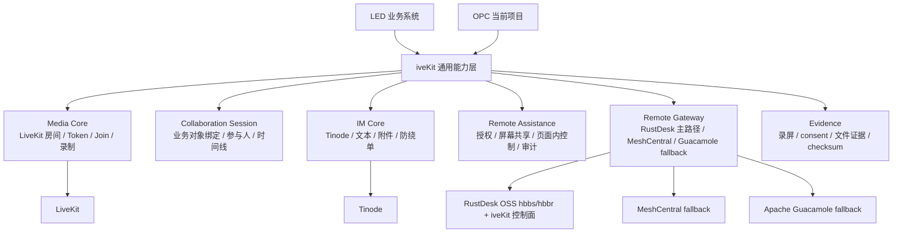
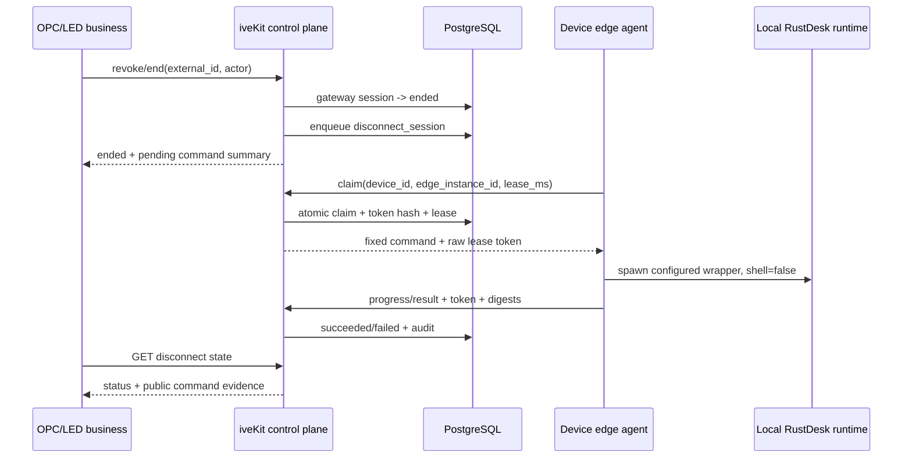

# iveKit 视频、远程协助与 IM 通用能力详细设计

> 面向 LED 项目研发对接。本文档汇总 OPC 当前已经沉淀的 iveKit 后端能力，覆盖视频/语音、屏幕共享、Web 远程协助、页面内控制、录屏、审计、证据、远程网关、IM/Tinode、附件消息、防绕单扫描等能力。
>
> 文档日期：2026-07-12
>
> 代码基线：当前 OPC 仓库 `/Users/songjinfeng/Desktop/opc`
>
> 服务器验收更新（2026-07-11）：LiveKit 双浏览器音视频/屏幕共享、Egress/MinIO、Tinode、IM facade、防绕单、RustDesk 控制面/审计、PostgreSQL 强制 RLS、LED SDK、双实例幂等和恢复测试已在真实服务器通过。交付前独立审查又完成了 OPC/Tinode 数据库角色隔离、一次性迁移服务、不可自启的 RLS bypass、MinIO 根/桶级账号分离及并发迁移锁。证据与剩余物理客户端人工项见 [iveKit 服务器部署验收报告](iveKit服务器部署验收报告-2026-07-11.md)。本文后文早期章节中的“仍需服务器验证”应以该报告的新口径为准。

---

## 1. 文档目的

LED 项目后续会由另一组研发负责整体架构和业务功能。OPC 这边已经把一批“视频 + IM + 协作 + 远程协助”的基础能力做成相对通用的后端能力。本文档的目标是：

1. 明确 iveKit 能力边界：哪些能力可以抽给 LED 使用，哪些仍然依赖 OPC 当前工程。
2. 明确已经接入的开源项目：LiveKit、Tinode、MeshCentral、Apache Guacamole、RustDesk 等分别承担什么角色。
3. 明确 API 能力：HTTP API、模块门面、数据表、WebSocket 事件、审计事件。
4. 明确状态：哪些已经编码并有测试，哪些只是设计或入口，哪些还没有实现。
5. 给 LED 研发一个可对接的工程视图：先接什么、怎么接、需要补什么、哪些不能误认为已经完成。

本文档不是产品宣传文档，而是研发交接文档。凡是“真实环境未验证”的地方都会明确写出。

---

## 2. 总体结论

当前 iveKit 已经形成了一个可拆分的后端能力层，核心形态如下：



简要状态：

| 能力域 | 当前状态 | 说明 |
| --- | --- | --- |
| LiveKit 音视频房间、Token、Join Plan | 已实现，测试通过 | 已有 HTTP API 和 `createIveKitModule()` 门面；真实部署还需要服务器 smoke |
| LiveKit 录制/Egress、录制 evidence 回填 | 生产生命周期代码已闭环，测试通过 | 支持 business_ref、状态/retention、对象检查、受控导出、导出审计、确认式清理和 evidence 删除回写；真实 Egress/MinIO 仍需服务器验证 |
| Web Assist 屏幕共享/远程协助 session | 已实现第一版，测试通过 | 支持授权、join token、事件、timeline、录屏入口 |
| 页面内远控 Inline Execution | 已实现第一版 | 支持 click/scroll/text_input 的事件与回执；不是系统级键鼠远控 |
| 远程网关 RustDesk | 后端控制面、设备注册、物理断开命令队列、设备侧 edge executor、HTTP client、流程级 LED SDK、严格能力门禁、readiness/acceptance 证据契约和部署配置均已实现 | 本地测试已证明“结束会话→入队→claim→执行适配器→回报→查询成功”；真实 RustDesk 控制端是否立即失去屏幕/键鼠能力仍需服务器双客户端验收 |
| 远程网关 MeshCentral/Guacamole | 已实现后端 adapter 契约和 HTTP client | 作为 fallback；真实 MeshCentral/Guacamole 服务未在本地验证 |
| RustDesk 外部工具链接 | 已作为普通 `third_party_remote_tool` 支持 | 与 RustDesk gateway 会话已区分，普通外链不会误触发上游 gateway end/audit |
| Tinode IM | 已实现后端协议边界、client-plan 和官方浏览器 SDK receive-only adapter | fake Tinode/SDK 契约测试通过；真实 Tinode 服务和真实浏览器需要服务器 smoke |
| IM 文本消息 | 已实现，测试通过 | 本地消息镜像 + 防绕单扫描 + WebSocket 广播 |
| IM 高级状态 | 本地代码已完成，测试通过 | 参与人 receipt/read-through/unread、typing/presence TTL、限时编辑、软删除和 mutation hash audit；真实多端/多副本待服务器验证 |
| IM 附件消息 | 本地代码已完成，测试通过 | 受限二进制上传、对象引用、异步处理 job、状态/重试 API；真实对象存储仍待服务器验证 |
| OCR/ASR/AI 质检 | provider-neutral 本地代码已完成 | 自建/第三方 HTTP adapter、durable worker、文本汇总和 AI 辅助 finding；真实 provider 未验证 |
| 统一 policy finding / 人审 | 本地代码已完成，测试通过 | text/OCR/ASR/AI 统一来源、证据引用、状态机、不可变 review audit；人工审核 UI 未做 |
| LED 通用 HTTP SDK/交接包 | 本地代码和文档已完成 | Media + Chat 标准 fetch SDK、RustDesk LED SDK、运行示例、API/事件契约和抽离指南；独立服务搬迁尚未执行 |
| 真实浏览器端到端验收 | 未完成 | 需要服务器部署后跑 smoke/browser tests |

### 2.1 复核补充结论（2026-07-03）

本次按“LED 研发能否拿着本文档直接做对接”的角度重新对照了代码、迁移和测试。没有发现重大方向写反的问题，但有以下边界必须提前讲清楚：

| 风险/遗漏点 | 当前真实状态 | 对 LED 对接的影响 |
| --- | --- | --- |
| 统一 iveKit HTTP facade | Media、IM、RustDesk 均已有 `/api/ivekit/*` facade；Web Assist 的细粒度事件/授权入口仍主要在 `/api/collaboration/*` | LED 新接入优先使用 iveKit facade；抽包/独立服务前仍需补全量静态 OpenAPI |
| 数据库 | 当前是 PostgreSQL + RLS，多处迁移在 `src/migrations/*.sql`；未使用 SQLite | LED 服务侧不要按 SQLite 设计，tenant 上下文和 RLS 要一起迁移 |
| Web Assist 远控范围 | 已完成浏览器页面内协助和 Inline Execution；不是操作系统级远控 | 只能控制接入了 Web Assist SDK/页面脚本的网页，不能控制客户整台电脑 |
| RustDesk | 已成为系统级远控主 provider；iveKit 自建设备注册、授权、会话、审计和物理断开命令面；设备侧 edge agent 只执行本地白名单 wrapper | LED 服务器部署时必须先迁移 `rustdesk_device_commands`、部署设备侧 wrapper/edge agent，再跑 physical-disconnect readiness 和真实双客户端断开验收 |
| MeshCentral/Guacamole | 后端 adapter 和 HTTP client 已有；真实上游路径和认证未验收 | 作为 fallback；如客户已有系统可继续对接 |
| Tinode client-plan | 后端能创建 topic/user/token 并返回 client-plan；前端已使用官方 `tinode-sdk@0.25.1` 接收，真实浏览器 SDK join 未验收 | 前端对接前必须配置 `TINODE_USER_PASSWORD_SECRET` 或 token-capable provisioner；客户端 topic mode 固定 `JRP`，业务消息仍走 iveKit |
| IM 参与人退出/移除 | 已完成显式 leave | HTTP `participants/leave` 会标记 `left_at`；Tinode 会把 topic 权限降为 `N` |
| 远协/session 工具结束 | 已完成 | 已补 HTTP API 和 `IveKitModule.remote` facade，LED 收尾流程不再只能依赖 consent revoke |
| 附件与 OCR/ASR | 已实现上传入口、对象引用、异步 OCR/ASR worker、租约/重试、状态回填和 policy 重扫 | LED 只需按统一 HTTP provider 协议接自建或第三方服务；真实准确率与容量仍待验证 |
| 质检闭环 | 已实现统一 finding、AI durable job、人审状态机和 review audit；AI 只建议、不直接做不可逆处置 | LED 可直接接审核 API；仍需自行实现审核工作台、阈值运营和业务处置编排 |
| Evidence 文件读取 | 录制对象已有 tenant-scoped 可读检查和鉴权受控导出；S3/MinIO/local object 支持读取，retention cleanup 支持 dry-run + confirm，删除后回写 evidence | 后台 retention worker、S3 presigned URL/CDN 和真实对象存储权限仍待部署阶段决定/验收 |
| 既有 call-center 能力 | OPC 里还有 Chatwoot、omnichannel、voicemail ASR、QM 等邻近能力 | 这些不是当前 iveKit 视频/IM 模块的一部分，LED 若要用需要另做抽象和对接 |

因此，本文档作为第一版研发对接文档是可用的，但交给 LED 研发时建议把上表放在评审第一页讲，避免大家把“已有代码入口”理解成“生产级全链路已验收”。

---

## 3. 设计原则

### 3.1 能力可抽离

iveKit 的目标不是只服务 OPC 当前页面，而是作为“视频 + IM + 协作 + 远协”的基础能力层，后续可给 LED 使用。当前代码已经在边界上做了几件事：

1. 使用 `business_ref` 绑定业务对象，不强依赖 call-center 或 OPC 订单模型。
2. 使用 `tenant_id` 做多租户隔离。
3. 媒体、协作、远协、证据分别有独立 store/facade。
4. 外部服务通过配置或 adapter 接入，避免业务层直接写死 LiveKit/Tinode/MeshCentral。

### 3.2 后端先行

用户要求当前优先把“视频、IM 这一系列后端能力做全”，后续再拿出来和 LED 其他功能拼接。因此本文档重点写后端能力，前端页面只作为已有验证入口，不作为 LED 必须复用的 UI。

### 3.3 不因授权问题阉割功能

开源项目的授权、商业授权、部署版本选择是商务和产品决策；技术侧按照能力完整性设计。若某个开源版本功能不满足，策略是替换方案或自研补齐，而不是在技术设计中删减必需能力。

### 3.4 真实环境验收单独标记

本地 fake server、in-memory Pg、单元测试通过不等于真实 LiveKit/Tinode/MeshCentral/Guacamole 已跑通。本文档会把“代码已实现”和“真实服务已验收”分开。

---

## 4. 开源项目选型与当前使用方式

### 4.1 LiveKit

官方定位：开源 WebRTC 实时音视频基础设施，提供可扩展的多方会议 SFU、音频、视频和数据能力。

当前使用角色：

1. 音视频房间：创建 room、关闭 room、按业务对象绑定 room。
2. Token：给客户、坐席、工程师签发 LiveKit join token。
3. Join Plan：统一返回浏览器端加入 LiveKit 所需的 token、URL、room、identity。
4. 录制：通过 LiveKit Egress 录制音频/视频/屏幕内容。
5. Webhook：接收 participant joined/left、egress ended 等事件，回填参与人和录制记录。
6. Web Assist 媒体通道：给远程协助提供屏幕共享/观察所需的实时媒体通道。

当前实现文件：

- `src/agent-runtime/livekit/index.ts`
- `src/agent-runtime/livekit/types.ts`
- `src/agent-runtime/livekit/media-http.ts`
- `src/agent-runtime/livekit/token-service.ts`
- `src/agent-runtime/livekit/recording-service.ts`
- `src/agent-runtime/livekit/webhook-handler.ts`

状态：

- 已完成：房间、Token、Join、Participant、Webhook、Recording、BusinessRef 绑定、Evidence 回调。
- 未完成/待验收：真实 LiveKit 服务部署、TURN/网络策略、真实浏览器端到端 smoke、生产 Egress 存储权限验证。

参考：

- LiveKit GitHub: https://github.com/livekit/livekit
- LiveKit SFU 文档: https://docs.livekit.io/reference/internals/livekit-sfu/

### 4.2 Tinode

官方定位：开源即时通讯平台，服务端为 Go，支持 WebSocket JSON 协议、gRPC、Web/Android/iOS 等客户端。

当前使用角色：

1. IM Topic：为 collaboration session 创建 Tinode 群聊 topic。
2. 用户：为 OPC/iveKit 业务身份创建 Tinode basic 用户。
3. Token：创建用户后获取 Tinode 用户 token，并通过 client-plan 发给前端。
4. 参与人授权：把用户授权进 topic。
5. 文本发布：后端可向 Tinode topic 发布消息，同时本地保存消息镜像。
6. 前端连接计划：提供 topic、user、token、ws_url、api_key，由官方 `tinode-sdk` join 并接收 data/info/presence。
7. 客户端权限：topic mode 固定 `JRP`，不授予 `W`；业务消息只能经 iveKit facade 发布。

当前实现协议：

- `{hi}`：Tinode WebSocket 握手。
- `{login}`：服务端 root/token/basic 登录；账号存在时 basic 登录兜底。
- `{acc login=true}`：创建 basic 用户并返回 token。
- `{sub topic='new'}`：创建 group topic。
- `{set sub}`：给参与人授权 topic。
- `{pub}`：发布文本消息。

当前实现文件：

- `src/agent-runtime/collaboration/chat-gateway.ts`
- `src/agent-runtime/collaboration/collaboration-http.ts`
- `scripts/tinode-chat-smoke.ts`
- `frontend/src/pages/collaboration-chat.ts`
- `frontend/src/pages/CollaborationChatPage.tsx`
- `frontend/src/pages/tinode-realtime.ts`

状态：

- 已完成：本地消息镜像、Tinode topic 创建、账号创建、账号已存在登录兜底、`JRP` receive-only 参与人授权、后端文本发布、client-plan、官方浏览器 SDK adapter、receipt/read-through/unread、typing/presence 和消息 mutation。
- 未完成/待验收：真实 Tinode Docker/生产部署、真实浏览器 Tinode SDK join、Tinode 文件消息/附件同步、Tinode 原生 edit/delete 同步、生产账号 provision 策略。

参考：

- Tinode GitHub: https://github.com/tinode/chat
- Tinode API 文档: https://github.com/tinode/chat/blob/master/docs/API.md
- Tinode 官网: https://tinode.co/

### 4.3 MeshCentral

官方定位：开源设备管理和远程控制平台，可通过自托管 server 管理设备，包含远程桌面、终端、文件管理等能力。

当前使用角色：

1. 作为远程桌面网关 provider。
2. iveKit 后端通过 HTTP adapter 创建远程会话。
3. 返回外部 `external_id` 和 `launch_url`。
4. 同步 MeshCentral 侧审计事件进入 OPC/iveKit timeline。
5. 授权撤销时调用网关结束远程 session。

当前实现文件：

- `src/agent-runtime/collaboration/remote-gateway-client.ts`
- `src/agent-runtime/collaboration/remote-gateway-adapter.ts`
- `src/agent-runtime/collaboration/collaboration-http.ts`

状态：

- 已完成：标准 HTTP adapter、创建 session、结束 session、拉取 audit、写入本地审计。
- 未完成/待验收：真实 MeshCentral server 的 API 路径适配、认证方式、设备 agent 部署、真实控制体验验收。

参考：

- MeshCentral GitHub: https://github.com/Ylianst/MeshCentral
- MeshCentral 文档: https://docs.meshcentral.com/

### 4.4 Apache Guacamole

官方定位：无客户端远程桌面网关，浏览器即可访问 RDP/VNC/SSH 等标准协议。

当前使用角色：

1. 作为 remote desktop gateway provider。
2. 后端 adapter 规范与 MeshCentral 一致。
3. 用于未来接入已有 RDP/VNC/SSH 资源。

当前实现文件：

- `src/agent-runtime/collaboration/remote-gateway-client.ts`
- `src/agent-runtime/collaboration/remote-gateway-adapter.ts`

状态：

- 已完成：Guacamole HTTP adapter 契约、创建 session、结束 session、审计同步的代码路径。
- 未完成/待验收：真实 Guacamole 连接配置、用户/连接权限映射、审计源适配、浏览器访问体验验收。

参考：

- Apache Guacamole 官网: https://guacamole.apache.org/

### 4.5 RustDesk

官方定位：开源远程桌面软件，支持自托管 server，是 TeamViewer/AnyDesk 类工具的开源替代方案。

当前使用角色：

1. 作为 iveKit 当前推荐的系统级远控主 provider。
2. RustDesk OSS `hbbs/hbbr` 负责 ID/rendezvous 和 relay，iveKit 负责业务控制面。
3. iveKit 通过 `rustdesk_devices` 保存租户、业务对象、内部设备 ID 与 RustDesk runtime ID 的映射。
4. `/tools/gateway` 支持传内部 `rustdesk_devices.id`，后端会解析为真实 `rustdesk_id` 调上游控制面。
5. RustDesk gateway session 纳入现有 consent、tool session、audit、timeline、evidence 链路。
6. 普通 RustDesk 外部工具链接仍可走 `third_party_remote_tool`，但不会被误当成 gateway session。
7. OPC 可从 `OPC_RUSTDESK_PUBLIC_KEY` 或 `OPC_RUSTDESK_PUBLIC_KEY_FILE` 读取 RustDesk client 所需 public key；Docker Compose/K8s 默认把 RustDesk data 卷以只读方式挂到 OPC 的 `/rustdesk`，文件路径为 `/rustdesk/id_ed25519.pub`。
8. RustDesk control-plane 暴露事件上报接口，RustDesk 边车、录屏服务或外部集成可以把连接、断开、文件传输、录屏、控制动作等操作日志写入 `rustdesk_gateway_events`，再由 audit 查询和 gateway-sync 合入 iveKit timeline；同步合入时会按该 gateway tool session 的 `permissions` 和 target 归属再做一层门禁。
9. `scripts/rustdesk-edge-agent.ts` 可运行在客户/LED 设备侧，按业务引用自动注册或复用 `rustdesk_devices`，并周期性上报 heartbeat，让 OPC/iveKit 能用内部设备 ID 稳定解析真实 RustDesk runtime ID；开启 `OPC_RUSTDESK_REQUIRE_DEVICE_ONLINE=1` 后，`/tools/gateway`、`/api/ivekit/rustdesk/gateway-sessions` 和 `IveKitModule.rustdesk.startGatewaySession()` 都会要求设备有新鲜在线心跳。
10. `scripts/rustdesk-event-forwarder.ts` 可运行在 RustDesk 边车、文件传输服务、录屏服务或剪贴板同步服务旁边，把 JSON/JSONL 操作事件转发到 RustDesk control-plane `/events`，统一使用已有幂等审计链路。
11. 本地 RustDesk control-plane 生成的 `launch_url` 会携带 `session_id`、`expires_at` 和 `token`；`token` 绑定 `session_id + expires_at`，公开 launch page 会拒绝缺失、过期或签名不匹配的链接。默认有效期为 15 分钟，可通过 `OPC_RUSTDESK_LAUNCH_TOKEN_TTL_MS` 调整，非正整数配置会 fail-fast。
12. `scripts/rustdesk-deployment-commands.ts` 可按 Compose 或 K8s/Helm 两种模式生成脱敏 Markdown 部署命令清单，覆盖 `hbbs/hbbr` 启动、`id_ed25519.pub` key 文件检查、`deployment-preflight`、server evidence、`readiness`、`client-config-pack`、`ivekit-smoke`、真实客户端验收、audit export、audit coverage、final evidence pack 和回滚/清理步骤；preflight/server evidence/readiness/client config pack/client acceptance/audit export/audit coverage/evidence pack 命令会带 `/tmp/rustdesk-*.json|md|jsonl` 标准证据路径，最终 evidence pack 命令也会显式传入 `OPC_RUSTDESK_EVIDENCE_DEPLOYMENT_COMMANDS_FILE`、`OPC_RUSTDESK_EVIDENCE_SERVER_EVIDENCE_FILE` 和 `OPC_RUSTDESK_EVIDENCE_CLIENT_CONFIG_PACK_FILE`，避免服务器执行后 evidence pack 找不到部署命令清单、服务器运行证据、客户端配置交接包或其它产物；脚本只生成命令，不自动执行 Docker、kubectl 或 helm。
13. `scripts/rustdesk-evidence-pack.ts` 可汇总部署命令清单、env checklist、preflight JSON、server evidence JSON、readiness JSON、真实客户端验收报告、audit coverage report、可选 audit export、handoff、事件模板和 LED example 输出，生成一份脱敏 evidence pack；它复用 `runRustDeskClientAcceptance()` 判定真实客户端验收是否通过，并要求 `rustdesk:audit-coverage` 的真实审计覆盖报告通过，只记录 artifact 路径、大小、行数、sha256 和结构化结论，不内嵌原始证据文件内容。
14. `scripts/rustdesk-audit-export.ts` 提供 `npm run rustdesk:audit-export`，使用 iveKit `/api/ivekit/rustdesk/gateway-sessions/:external_id/audit` facade 按 `external_id` 和可选 `since` 拉取真实 gateway audit，并写成 `audit-export.jsonl`，供 `rustdesk:client-acceptance`、`rustdesk:audit-coverage` 和 final evidence pack 复用。
15. `scripts/rustdesk-deployment-preflight.ts` 支持 `OPC_RUSTDESK_READINESS_REQUIRE_HTTPS_LAUNCH_URL=1`。生产验收开启后，如果 `OPC_RUSTDESK_LAUNCH_BASE_URL` 或 fallback 仍是 `http://`，preflight 会以 `launch_base_url_https` 失败；根 `.env.example` 默认 `0` 方便本地 HTTP 联调，生产 `infra/env.example`、Compose/K8s 注入和 Helm values 默认 `1`，用于提前拦截 DNS/TLS/Ingress 上线前的低质量配置。
16. `scripts/rustdesk-server-evidence.ts` 提供 `npm run rustdesk:server-evidence`，在已部署的 OPC 容器内采集真实 RustDesk 服务端运行证据：读取 `id_ed25519.pub` 并记录 sha256，解析 ID/Relay/launch 域名，探测 hbbs TCP、hbbr TCP、UDP 发包、launch TLS 和 Ingress HTTP(S) 响应，并把结果写成 `server-evidence.json`。它用于证明服务器 key、端口、DNS、TLS、Ingress 这一层已经可见；UDP 只证明发包成功，不证明 RustDesk 协议握手，也不替代真实 RustDesk 客户端远控验收。
17. `scripts/rustdesk-client-config-pack.ts` 提供 `npm run rustdesk:client-config-pack`，通过 iveKit `/api/ivekit/rustdesk/client-config` 和可选 gateway launch plan 生成 `client-config-pack.md`，集中列出 RustDesk 客户端需要手工填写的 ID server、relay server、API server、public key、fingerprint、目标 RustDesk ID 和 generation-time launch availability。静态 pack 的兼容 `launch_url` / `protocol_url` 字段固定为空，不写 signed token、完整 signed URL 或 executable protocol URL；`actions.can_launch` 只有严格等于 boolean `true` 才记录为生成时可用。base URL 禁止 credentials、query 和 fragment，配置的 target RustDesk ID 与 launch plan 不一致时生成失败；真实拉起必须即时调用 `getGatewayLaunchPlan()`。它用于给部署/QA/LED 研发交接客户端安装配置，不证明真实客户端已拉起或远控操作已成功。
18. RustDesk 已增加独立的物理断开命令面：业务结束 gateway session 后，`RustDeskPhysicalDisconnectService` 先让控制面会话进入 `ended`，再按 `rustdesk_device_id` 幂等写入 `rustdesk_device_commands`；设备侧 `scripts/rustdesk-edge-agent.ts` 通过 tenant/device scoped API claim 固定的 `disconnect_session` 命令，执行本地配置的无 shell wrapper，并回报结构化结果。
19. `OPC_RUSTDESK_REQUIRE_PHYSICAL_DISCONNECT=1` 可把物理断开能力变成新会话启动的硬门禁：只接受已注册、active、在线、心跳未过期且最新 heartbeat 明确携带 `disconnect_command_capable=true` 的设备；raw RustDesk ID 会在调用上游前被拒绝。默认值仍为 `0`，便于未部署 edge executor 的现有环境兼容升级。
20. `createIveKitRustDeskHttpClient()` 和 `createIveKitRustDeskLedSdk()` 已提供 `getGatewayDisconnectState(externalId)`。直接 `DELETE` gateway session 仍保持兼容的 `204`，LED/其它服务通过状态接口读取 command ID、状态、执行方式和 edge evidence，不需要接触 claim token 或 RustDesk control-plane token。
21. `rustdesk:readiness` 可在 `OPC_RUSTDESK_READINESS_CHECK_PHYSICAL_DISCONNECT=1` 时用本地测试 wrapper 串起设备注册/心跳、gateway 创建/结束、命令 claim/执行/result 和最终状态查询；readiness 结果固定 `operatorObservedDisconnect=false`。真实客户端验收报告另要求人工填写 `physical_disconnect.operator_observed_disconnect=true`，防止把“wrapper 退出 0”误报成“RustDesk 客户端已真实断线”。

当前状态：

- 已完成：除原有 gateway/client-config/launch/audit/LED facade 能力外，已经增加 PostgreSQL `rustdesk_device_commands`、FORCE RLS、幂等 enqueue、并发 claim lease、claim token hash、设备绑定 HMAC edge token、进度/结果 API、并发 result 幂等、耗尽 lease 查询收敛、三次执行与退避、session adapter→service restart fallback、设备侧无 shell executor、超时进程组强制终止、结果摘要/哈希、全部结束入口的 reason 映射、严格 capability heartbeat 门禁、HTTP client/LED SDK 状态查询、physical-disconnect readiness、真实客户端 acceptance 字段与绑定审计要求，以及 Compose/K8s/server 与 edge 两个信任域的配置样例。详细实现和 API 见 §6.4.5。
- 已完成：`clients/ivekit-reference` 增加独立 **Remote** 工作区，统一客户端通过顶层 Messages / Calls / Remote 三个工作区切换。Remote 工作区支持 business ref 解析注册设备、权限 scope 与 attended/unattended 选择、gateway session 创建、实际 granted scope、控制 owner/version、审计数量和物理断开状态展示，以及 ID server、relay、可选 API server、public key 和 fingerprint 手工配置。它只在用户点击时即时重取 launch plan，校验会话、目标、`rustdesk://` scheme 和 fingerprint 后拉起原生客户端，不把 signed launch URL/token 渲染到 DOM 或持久化。unattended 普通刷新不重复消费二次确认；主动拉起会重新确认。当前身份持有控制权时每 10 秒自动 heartbeat，失去 ownership、会话结束或卸载即停止；续租失败后以服务端 ownership 为准。控制权支持 acquire/release/transfer，组件提供 business ref、remote session 和 access mode 预填参数及可注入 protocol opener，便于 LED 壳层复用。
- 已完成：新增 Windows、macOS、Linux 六个设备端 targeted-disconnect/service-restart wrapper；支持无副作用 validate、固定 argv 占位符、local-only session hook、服务存在性检查、幂等重复调用、缺失精准 hook/服务的可区分退出语义，并继续复用 edge executor 的 timeout、进程组强杀、输出限长哈希和 restart collateral-risk 审计。RustDesk OSS 1.4.7 没有稳定跨平台 incoming-session disconnect CLI，因此精准能力由本地版本专用 hook 显式提供，不猜测私有 IPC。
- 已完成：新增 `remote.rustdesk.operation.observed` canonical telemetry 和 `scripts/rustdesk-operation-observer.ts`，统一 view/control/multi-display/file/clipboard/recording/disconnect 的 operation ID、status、observer、direction、display、byte count、checksum、duration 和 evidence refs；缺失遥测保持 `not_observed`。SDK 暴露 `recordOperationObservation()`。observer 复用 event-forwarder retry/dead-letter/replay 和稳定幂等键；服务端递归拒绝操作内容及凭证字段。control/file/clipboard 观察必须在数据库锁内匹配 active controller 和 control version 后才写审计。
- 待服务器验收：按 RustDesk profile 启动真实 `hbbs/hbbr`，部署 Linux/Windows/macOS 设备 wrapper 和 edge agent，确认真实 RustDesk 版本下 targeted disconnect 或 service restart 的实际效果；使用两个真实客户端建立连接，执行 consent revoke/tool end/direct gateway end，验证控制端屏幕和键鼠能力停止、命令状态为 `succeeded`、requested→claimed→succeeded 审计完整、旧 launch URL 返回 409，并确认 fallback 重启造成的其它会话影响符合预期。
- 第一版不做：fork RustDesk client、依赖 RustDesk Server Pro API、在应用表里保存 unattended password。

参考：

- RustDesk 官网: https://rustdesk.com/
- RustDesk GitHub: https://github.com/rustdesk/rustdesk
- RustDesk Server GitHub: https://github.com/rustdesk/rustdesk-server

---

## 5. 当前代码模块边界

### 5.1 iveKit public facade

对 LED 来说，最应该优先看的入口是：

- `src/agent-runtime/ivekit/index.ts`
- `src/agent-runtime/ivekit/module.ts`
- `src/agent-runtime/ivekit/types.ts`

核心函数：

```ts
createIveKitModule({
  db,
  pg,
  media: { livekit },
  remoteGateway,
  evidence
})
```

当前 `IveKitModule` 暴露能力：

| 子模块 | 方法 | 作用 |
| --- | --- | --- |
| `sessions` | `open` | 为业务对象打开协作 bundle，可同时创建媒体 room 和远协 session |
| `sessions` | `getByBusinessRef` | 按 LED 业务对象查询已有关联 session |
| `sessions` | `close` | 关闭 collaboration session |
| `media` | `createRoom` | 创建 LiveKit room |
| `media` | `issueJoinPlan` | 签发 WebRTC/SIP join plan |
| `collaboration` | `postMessage` | 发送/保存协作消息 |
| `collaboration` | `addTranslation` | 保存翻译结果 |
| `collaboration` | `scanPolicy` | 文本防绕单扫描 |
| `collaboration` | `listTimeline` | session 时间线 |
| `remote` | `create` | 创建远程协助 session |
| `remote` | `requestConsent` | 请求授权 |
| `remote` | `grantConsent` | 授权 |
| `remote` | `denyConsent` | 拒绝授权 |
| `remote` | `revokeConsent` | 撤销授权 |
| `remote` | `createWebAssistJoin` | 创建 Web Assist join path |
| `remote` | `verifyWebAssistJoin` | 校验 Web Assist token |
| `remote` | `recordAssistEvent` | 记录 Web Assist 事件 |
| `remote` | `startExternalTool` | 启动第三方远控工具 session |
| `remote` | `listAuditEvents` | 查询审计事件 |
| `rustdesk` | `registerDevice` / `listDevicesByBusinessRef` / `heartbeatDevice` / `deactivateDevice` | 管理 RustDesk 注册设备和在线心跳 |
| `rustdesk` | `startGatewaySession` / `endGatewaySession` | 启动或结束 RustDesk gateway session，并同步远协 timeline |
| `rustdesk` | `recordGatewayEvent` / `listGatewayAuditEvents` / `listGatewaySessions` / `getGatewayLaunchPlan` / `getClientConfig` | 写入操作审计、查询会话、生成 launch plan 和客户端配置 |
| `evidence` | `record` | 写证据记录 |
| `evidence` | `listByBusinessRef` | 按业务对象查证据 |
| `evidence` | `listBySession` | 按 session 查证据 |

`IveKitModule` 的 `collaboration.postMessage` 已在 `src/agent-runtime/ivekit/types.ts` 暴露 `attachments` 参数，字段与底层 `CollaborationStore` 附件输入兼容。LED 走 HTTP API 或 iveKit TS facade 都可以携带图片、音频、视频、普通文件、屏幕录制引用等附件元数据。

RustDesk 物理断开状态当前暴露在可独立复用的 `IveKitRustDeskHttpClient` 和 `IveKitRustDeskLedSdk`，方法名均为 `getGatewayDisconnectState(externalId)`。内嵌 `createIveKitModule().rustdesk` 仍负责业务会话编排，不伪装成设备侧 command executor；需要直接操作命令 store/service 的独立服务应从 collaboration 公共入口使用 `rustdeskCommands` / `rustdeskPhysicalDisconnect`，并同时迁移 PostgreSQL/RLS 契约。

### 5.1.1 iveKit Media HTTP facade

面向 LED/其它项目后端，推荐优先使用 `/api/ivekit/media/*`。该入口走 OPC 平台鉴权和 `X-Tenant-Id` 租户上下文，不要求调用方再持有 `OPC_MEDIA_API_TOKEN`；旧 `/api/media/livekit/*` 仍作为底层 Media Core 管理入口保留。

| Method | Path | 作用 |
| --- | --- | --- |
| `GET` | `/api/ivekit/media/capabilities` | 查询 LiveKit/Media 能力和配置状态，只返回布尔状态，不泄漏 key/secret |
| `POST` | `/api/ivekit/media/rooms` | 按当前租户创建 LiveKit room，可携带 `business_ref` |
| `GET` | `/api/ivekit/media/rooms/:room_name` | 查询当前租户房间 |
| `POST` | `/api/ivekit/media/rooms/:room_name/close` | 关闭当前租户房间 |
| `POST` | `/api/ivekit/media/rooms/:room_name/join` | 仅 system/API-key 兼容入口；生成 WebRTC join plan |
| `GET` | `/api/ivekit/media/rooms/:room_name/participants` | 查询当前租户房间参与人 |
| `POST` | `/api/ivekit/media/rooms/:room_name/recordings/start` | 按当前租户和 business_ref 启动 LiveKit Egress 录制 |
| `GET` | `/api/ivekit/media/recordings` | 查询当前租户录制列表 |
| `GET` | `/api/ivekit/media/recordings/:recording_id` | 查询当前租户录制 |
| `POST` | `/api/ivekit/media/recordings/:egress_id/stop` | 停止当前租户录制 |
| `GET` | `/api/ivekit/media/recordings/:recording_id/object` | 检查对象是否可读，返回 status/source/size/checksum，不返回内容 |
| `GET` | `/api/ivekit/media/recordings/:recording_id/export` | 鉴权受控导出录制二进制，并写 `media.recording.exported` 审计 |
| `POST` | `/api/ivekit/media/recordings/retention/cleanup` | 默认 dry-run；实际删除必须 `dry_run=false, confirm=true` 且要求 admin/owner/system |

请求示例：

```http
POST /api/ivekit/media/rooms
X-API-Key: <opc-api-key>
X-Tenant-Id: tenant_led
Content-Type: application/json
```

```json
{
  "purpose": "video_service",
  "room_name": "led-order-1001",
  "business_ref": {
    "type": "service_order",
    "id": "order_1001",
    "display_name": "LED order 1001"
  }
}
```

join plan 示例：

```http
POST /api/ivekit/media/rooms/led-order-1001/join
X-API-Key: <opc-api-key>
X-Tenant-Id: tenant_led
Content-Type: application/json
```

```json
{
  "identity": "customer_1",
  "role": "customer",
  "media": "video",
  "channel": "webrtc"
}
```

### 5.2 Media Core

位置：

- `src/agent-runtime/livekit/`

负责：

1. LiveKit room 生命周期。
2. Participant 状态。
3. Token 和 join plan。
4. Recording/Egress。
5. Webhook。
6. Agent dispatch。

### 5.3 Collaboration Session

位置：

- `src/agent-runtime/collaboration/collaboration-store.ts`
- `src/agent-runtime/collaboration/types.ts`
- `src/agent-runtime/collaboration/collaboration-http.ts`

负责：

1. 业务对象绑定。
2. 参与人。
3. 消息。
4. 附件。
5. 翻译。
6. policy scan。
7. chat snapshot。
8. timeline。

### 5.4 Remote Assistance

位置：

- `src/agent-runtime/collaboration/remote-assistance-store.ts`
- `src/agent-runtime/collaboration/remote-gateway-client.ts`
- `src/agent-runtime/collaboration/remote-gateway-adapter.ts`
- `src/agent-runtime/ivekit/remote-assist-token.ts`

负责：

1. 远协 session。
2. consent 授权。
3. tool session。
4. Web Assist event。
5. gateway audit sync。
6. evidence。

### 5.5 IM Gateway

位置：

- `src/agent-runtime/collaboration/chat-gateway.ts`

负责：

1. provider-neutral `ChatGateway`。
2. 本地 `LocalChatGateway`。
3. Tinode `TinodeChatGateway`。
4. Tinode WebSocket JSON 协议。

---

## 6. 功能详细设计

## 6.1 Media Core：视频/语音房间

### 6.1.1 功能点

| 功能 | 状态 | 说明 |
| --- | --- | --- |
| 创建媒体房间 | 已完成 | 底层 LiveKit room purpose 支持 `ai_outbound`、`video_service`、`screen_share`、`conference`、`pstn_bridge` |
| 按 business_ref 绑定房间 | 已完成 | 录制和 evidence 可回到 LED 订单/工单 |
| 签发客户/坐席 token | 已完成 | 基于 LiveKit token-service |
| Join Plan | 已完成 | 返回 `room_name`、`identity`、`token`、`livekit_url` |
| 客户邀请签名 | 已完成 | `OPC_MEDIA_INVITE_SECRET` |
| 参与人状态 | 已完成 | webhook 记录 joined/left |
| 关闭房间 | 已完成 | close room 后拒绝 join |
| AI Agent dispatch | 已完成入口 | 可向 room 派发 AI agent，真实 agent 业务另行接入 |
| SIP/VoLTE | 有设计和部分配置 | 当前不作为 LED 首期重点 |

### 6.1.2 HTTP API

#### 创建房间

`POST /api/media/livekit/rooms`

认证：

- 需要 media service auth。
- Header：`Authorization: Bearer <OPC_MEDIA_API_TOKEN>`。

请求示例：

```json
{
  "tenant_id": "tenant_led",
  "purpose": "video_service",
  "room_name": "led-order-1001",
  "metadata": {
    "business_ref": {
      "type": "service_order",
      "id": "order_1001"
    }
  }
}
```

注意：`voice_service` 是 `IveKitModule` facade 为 LED/通用业务提供的语义口径。底层 `livekit_rooms.purpose` 枚举没有 `voice_service`，语音服务会落成 `purpose = video_service`，并在 metadata 中标记 `media_kind = voice`。LED 如果直接调用 `/api/media/livekit/rooms`，不要把 `voice_service` 直接传给底层 room purpose。

返回：

```json
{
  "id": "room_xxx",
  "tenant_id": "tenant_led",
  "room_name": "led-order-1001",
  "purpose": "video_service",
  "status": "created",
  "metadata": {}
}
```

#### 签发 LiveKit token

`GET /api/media/livekit/token?tenant_id=...&room_name=...&identity=...&role=customer`

返回：

```json
{
  "token": "...",
  "livekit_url": "wss://livekit.example.com",
  "room_name": "led-order-1001",
  "identity": "customer_1",
  "role": "customer"
}
```

#### Join Plan

`GET /api/media/livekit/join?tenant_id=...&room_name=...&identity=...&role=customer&media=video&channel=webrtc`

说明：

- customer 可通过 invite 签名校验。
- agent/engineer 需要 service auth。

返回：

```json
{
  "mode": "webrtc",
  "token": {
    "token": "...",
    "livekit_url": "wss://livekit.example.com"
  },
  "room_name": "led-order-1001",
  "identity": "customer_1"
}
```

#### 查询房间

`GET /api/media/livekit/rooms/:room_name?tenant_id=...`

#### 关闭房间

`POST /api/media/livekit/rooms/:room_name/close?tenant_id=...`

#### 查询参与人

`GET /api/media/livekit/rooms/:room_name/participants?tenant_id=...&include_left=1&limit=100`

#### 派发 AI Agent

`POST /api/media/livekit/agent-dispatch`

```json
{
  "tenant_id": "tenant_led",
  "room_name": "led-order-1001",
  "agent_name": "ai-agent",
  "metadata": {
    "tenant_id": "tenant_led",
    "business_ref_type": "service_order",
    "business_ref_id": "order_1001"
  }
}
```

### 6.1.3 未完成事项

1. 真实 LiveKit server/TURN/HTTPS 端到端验证。
2. LED 浏览器端 SDK 接入和兼容性测试。
3. 多房间/多端并发压测。
4. SIP/VoLTE 对 LED 是否需要仍待产品确认。

---

## 6.2 录制与 Evidence

### 6.2.1 功能点

| 功能 | 状态 | 说明 |
| --- | --- | --- |
| 开始 LiveKit 录制 | 已完成 | `recordings/start` |
| 停止 LiveKit 录制 | 已完成 | `recordings/:egress_id/stop` |
| 录制列表/查询 | 已完成 | 按 tenant 查询 |
| Egress webhook 回填 | 已完成 | egress ended 后更新 recording |
| Evidence 绑定 | 已完成 | 可把录制写入 evidence_records |
| checksum 计算 | 已完成第一版 | 对可读对象计算 sha256；不可读则 pending |
| 录制生命周期 | 已完成 | `starting/pending/recording/stopping/stopped/completed/failed/deleted` |
| 对象可读检查 | 已完成 | 支持 S3/MinIO、HTTP allowlist、本地受控目录和 local upload；记录 object status/checked_at |
| 私有对象导出 | 已完成第一版 | Media service token 或 iveKit 平台鉴权后的受控下载，写导出审计；presigned URL/CDN 未做 |
| retention 清理钩子 | 已完成第一版 | 默认 dry-run；真实删除需 confirm；删除对象、更新 recording、回写 evidence，跨库回写失败可重试 |
| Egress 失败补偿 | 已完成 | 启动失败留 failed row；provider 已启动而持久化失败时 stop Egress |

### 6.2.2 HTTP API

#### 开始录制

`POST /api/media/livekit/recordings/start`

```json
{
  "tenant_id": "tenant_led",
  "room_name": "led-order-1001",
  "format": "mp4",
  "has_video": true,
  "retention_days": 90,
  "business_ref": {
    "tenant_id": "tenant_led",
    "type": "service_order",
    "id": "order_1001",
    "display_name": "LED order #1001"
  }
}
```

返回字段：

- `id`
- `tenant_id`
- `business_ref_type`
- `business_ref_id`
- `source = livekit_egress`
- `format`
- `evidence_record_id`（已绑定时）
- `egress_id`
- `status`
- `retention_until`
- `object_status` / `object_checked_at`
- `failure_code` / `completed_at` / `deleted_at`
- `evidence_record_id`，如果上层传入 evidence callback；该关联会持久化并可在后续列表/详情查询中返回

公开 media recording DTO 不返回内部 `storage_url` 或预签名下载地址。播放和下载必须
走 `/api/ivekit/media/recordings/:recording_id/export`，并产生审计。导出默认 64 MiB
上限，可通过 `OPC_RECORDING_EXPORT_MAX_BYTES` 调整至 1 GiB；服务端使用 AsyncIterable
逐块写响应，不聚合完整录制。文件、HTTP 和 S3 读取均执行有界检查，超限会取消上游
读取。

durable Media Call 的录制不依赖 legacy `media_rooms` 镜像。带 `media_call_id` 的启动
会在同一 call 行锁内校验 room、`accepted|active` 状态和 host 身份，因此不能与终态
`end/fail` 竞态穿透。legacy room join 仅供 system/API-key 集成使用；Bearer 浏览器必须
调用 `/api/ivekit/media/calls/:call_id/join`，identity 固定为 JWT `sub`。

无人接听超时由 iveKit 内置 worker 自动扫描，默认每秒运行；配置项为
`OPC_MEDIA_CALL_TIMEOUT_WORKER_ENABLED`、`OPC_MEDIA_CALL_TIMEOUT_INTERVAL_MS`、
`OPC_MEDIA_CALL_TIMEOUT_BATCH_SIZE` 和 `OPC_MEDIA_CALL_TIMEOUT_TENANT_LIMIT`。worker
通过受限 `opc_worker_tenant_ids('media_call_timeout', ...)` 发现租户，再进入逐租户 RLS
事务，复用 call transition、幂等键和行锁。

#### 停止录制

`POST /api/media/livekit/recordings/:egress_id/stop?tenant_id=tenant_led`

#### 查询录制

`GET /api/media/livekit/recordings?tenant_id=tenant_led&limit=50`

`GET /api/media/livekit/recordings/:recording_id?tenant_id=tenant_led`

#### 检查和导出对象

`GET /api/media/livekit/recordings/:recording_id/object?tenant_id=tenant_led`

返回 `status`、`readable`、`source`、`size_bytes` 和 `checksum`。检查接口不返回文件内容，但当前第一版为计算 SHA-256 会读取对象；超大文件后续可切换 HeadObject + 流式摘要。

`GET /api/media/livekit/recordings/:recording_id/export?tenant_id=tenant_led`

成功时返回录制二进制和 `Content-Disposition: attachment`，并写入 tenant-scoped audit log。iveKit facade 使用同名 `.../recordings/:recording_id/export` 路径。

#### retention 清理

`POST /api/media/livekit/recordings/retention/cleanup`

```json
{
  "tenant_id": "tenant_led",
  "before": "2026-07-10T00:00:00.000Z",
  "dry_run": false,
  "confirm": true,
  "limit": 25
}
```

不传 `dry_run=false` 时只返回候选数量；实际删除必须显式确认。成功删除保留 evidence 的原始 URL/checksum，但把 metadata 标为 `object_status=deleted` 并记录删除人、来源和时间。evidence 回写临时失败时 recording 不进入 `deleted`，下一次 cleanup 会以 object `not_found` 继续完成回写，避免永久不一致。

#### LiveKit webhook

`POST /api/media/webhooks/livekit`

说明：

- 生产环境必须配置 LiveKit webhook 凭证。
- webhook 会处理 participant、egress 等事件。
- egress 完成后可触发 evidence 回填。

### 6.2.3 未完成事项

1. 真实 MinIO/S3 凭证、bucket、路径、回源权限验收。
2. 后台 retention worker/调度器；当前已有可由外部调度调用的确认式 cleanup API。
3. 超大文件流式导出、S3 presigned URL 和 CDN/内网访问策略。
4. LED 侧对录制证据的查看和审核 UI。

---

## 6.3 Web Assist：屏幕共享和页面内远程协助

### 6.3.1 模式说明

当前自研第一版是 `web_remote_assist`，它不是系统级远程桌面，而是“浏览器页面内远程协助”：

1. 客户打开带签名 token 的 Web Assist 页面。
2. 客户授权后，工程师可通过 LiveKit 观察屏幕流。
3. 工程师可发送页面内控制动作：click、scroll、text_input。
4. 客户页面执行 Inline Execution，并返回 control.result。
5. 所有可靠事件写入 audit/timeline。

### 6.3.2 功能点

| 功能 | 状态 | 说明 |
| --- | --- | --- |
| 创建远协 session | 已完成 | 支持 `web_remote_assist`、`screen_share`、`third_party_remote_tool`、`remote_desktop_gateway` |
| 结束远协 session | 已完成 | `POST /api/collaboration/remote-assistance/:remote_session_id/end`，并已暴露 `IveKitModule.remote.end` |
| 授权 request/grant/deny/revoke | 已完成 | 支持 scopes 和 expires_at |
| 客户公开授权接口 | 已完成 | signed token 公开接口，不需要 API key |
| Web Assist join token | 已完成 | HMAC token，含 tenant、remote_session、actor、role、expires_at |
| 事件上报 | 已完成 | pointer/annotation/control 等事件 |
| WebSocket 实时广播 | 已完成 | `remote.web_assist.event` |
| Timeline 初始重放 | 已完成 | 观察页打开时拉 HTTP timeline |
| Data channel 优先、HTTP 兜底 | 已完成第一版 | 可靠事件可 HTTP fallback；高频 move 不强制兜底 |
| 页面内控制 | 已完成第一版 | click/scroll/text_input |
| 控制结果回执 | 已完成 | `control.result` |
| 录屏 start/stop | 已完成入口 | public Web Assist recording API |
| 系统级远程桌面控制 | 后端已完成第一版，真实客户端待验收 | RustDesk 主路径已有 gateway adapter、control-plane、设备注册、launch plan、审计同步和上游关闭；真实 `hbbs/hbbr`、客户端安装、操作体验、系统级录屏、文件传输、剪贴板仍需服务器验证或 provider 扩展 |

### 6.3.3 Consent scopes

当前支持：

| scope | 含义 |
| --- | --- |
| `view_screen` | 允许工程师观看屏幕/页面 |
| `control_mouse_keyboard` | 允许页面内点击、滚动、文本输入 |
| `record_screen` | 允许录屏 |
| `transfer_file` | 预留文件传输 |
| `clipboard` | 允许/审计剪贴板同步 |

HTTP 私有 consent 接口（`request` / `grant` / `deny` / `revoke`）、公开 Web Assist consent 接口、`/tools/gateway` 和 RustDesk control-plane create 都按这张表校验。未知 scope 会返回 400，不会写入 consent event、remote tool session、RustDesk gateway session、launch plan 或 audit metadata。RustDesk gateway session 的底层 store 也会拒绝空 `permissions`、未知 scope、显式空 `external_id`、空租户、空 target id、空 actor、非 HTTP(S) 或畸形 `launch_url`，避免 iveKit facade、control-plane 内部调用或后续 LED/其它服务抽模块时绕过 HTTP 入口创建不合法会话。Gateway 启动时还会校验请求的 `permissions` 必须被最新 active grant 的 `scopes` 覆盖；例如客户只授予 `view_screen` 时，`control_mouse_keyboard` 会被 403 拒绝，且不会调用上游 RustDesk/MeshCentral/Guacamole。RustDesk 操作事件上报和 `/audit/gateway-sync` 也会按 RustDesk session permissions 复核：文件传输 started/completed/failed 都需要 `transfer_file`，录屏 started/stopped/failed 都需要 `record_screen`，剪贴板需要 `clipboard`，控制动作按事件 metadata 里的 `permission` 精确匹配；事件显式携带 `target` 时，还必须匹配当前 gateway session 的 target id，或匹配会话 metadata 中登记的 `rustdesk_id` / `target_id` / `rustdesk_device_id`。

### 6.3.4 HTTP API：公开 Web Assist 接口

这些接口面向客户公开页面，用 signed token 验证，不需要登录态 API key。

#### 校验 join token

`POST /api/collaboration/remote-assistance/:remote_session_id/web-assist/verify`

```json
{
  "tenant_id": "tenant_led",
  "token": "base64url_payload.signature"
}
```

返回：

```json
{
  "tenant_id": "tenant_led",
  "remote_session_id": "remote_xxx",
  "actor_identity": "customer_1",
  "role": "customer",
  "expires_at": "2099-01-01T00:00:00.000Z"
}
```

#### 客户授权

`POST /api/collaboration/remote-assistance/:remote_session_id/web-assist/consent/grant`

```json
{
  "tenant_id": "tenant_led",
  "token": "...",
  "scopes": ["view_screen", "control_mouse_keyboard", "record_screen"],
  "expires_at": "2099-01-01T00:00:00.000Z"
}
```

#### 客户撤销授权

`POST /api/collaboration/remote-assistance/:remote_session_id/web-assist/consent/revoke`

#### 客户/页面事件上报

`POST /api/collaboration/remote-assistance/:remote_session_id/web-assist/events`

```json
{
  "tenant_id": "tenant_led",
  "token": "...",
  "actor_identity": "customer_1",
  "event_type": "control.result",
  "payload": {
    "executed": true,
    "action": "click"
  }
}
```

#### Web Assist 加入媒体房间

`GET /api/collaboration/remote-assistance/:remote_session_id/web-assist/media/join?tenant_id=...&token=...&identity=customer_1&role=customer`

返回 LiveKit join plan。

#### Web Assist 开始录屏

`POST /api/collaboration/remote-assistance/:remote_session_id/web-assist/recordings/start`

#### Web Assist 停止录屏

`POST /api/collaboration/remote-assistance/:remote_session_id/web-assist/recordings/:egress_id/stop`

### 6.3.5 HTTP API：登录态远协接口

#### 创建远协 session

`POST /api/collaboration/remote-assistance/sessions`

```json
{
  "collaboration_session_id": "collab_xxx",
  "mode": "web_remote_assist",
  "adapter_provider": "ivekit_web",
  "started_by": "agent_1",
  "metadata": {
    "media_room_name": "led-order-1001"
  }
}
```

#### 查询 timeline

`GET /api/collaboration/remote-assistance/:remote_session_id/timeline`

返回：

```json
{
  "session": {},
  "consent_events": [],
  "tool_sessions": [],
  "audit_events": [],
  "evidence": []
}
```

#### 结束远协 session

`POST /api/collaboration/remote-assistance/:remote_session_id/end`

```json
{
  "actor_identity": "agent_1"
}
```

说明：

- 会把 remote session 标记为 `ended`。
- 会结束当前仍 active 的 tool session。
- 如果 active tool 是 RustDesk/MeshCentral/Guacamole 网关工具，会优先调用上游 endSession 并同步审计；通过 `/api/ivekit/rustdesk/gateway-sessions` 创建的本地 RustDesk control-plane session 会自动走本地 store，不要求额外配置外部 gateway base URL；`IveKitModule.remote.end()` 也走同一条收敛路径。
- 会写入 `remote.session.ended` 和对应 `remote.tool_session.ended` 审计。

#### 请求/授权/拒绝/撤销 consent

`POST /api/collaboration/remote-assistance/:remote_session_id/consent/request`

`POST /api/collaboration/remote-assistance/:remote_session_id/consent/grant`

`POST /api/collaboration/remote-assistance/:remote_session_id/consent/deny`

`POST /api/collaboration/remote-assistance/:remote_session_id/consent/revoke`

#### 记录 Web Assist 事件

`POST /api/collaboration/remote-assistance/:remote_session_id/events`

#### 工程师加入 Web Assist 媒体房间

`GET /api/collaboration/remote-assistance/:remote_session_id/media/join?identity=agent_1`

### 6.3.6 事件类型

当前常见实时事件：

| event_type | 说明 | 状态 |
| --- | --- | --- |
| `pointer.move` | 指针移动 | 已有 |
| `pointer.click_hint` | 点击提示 | 已有 |
| `annotation.draw` | 标注绘制 | 已有 |
| `annotation.clear` | 清除标注 | 已有 |
| `viewport.changed` | 视口变化 | 已有 |
| `page.action_hint` | 页面动作提示 | 已有 |
| `control.action` | 工程师发起页面内控制 | 已有实现 |
| `control.result` | 客户端执行控制后的回执 | 已有实现 |

`src/agent-runtime/ivekit/types.ts` 的 `IveRemoteAssistEventType` 已显式包含 `control.action` / `control.result`，LED 通过 iveKit TS facade 上报 Inline Execution 控制指令和回执时不需要绕过类型。

### 6.3.7 未完成事项

1. 真实浏览器端到端 smoke：客户页屏幕共享、工程师观察、控制动作、录屏。
2. 断线重连后的增量补拉水位。
3. 多工程师并发控制冲突策略。
4. 系统级键鼠远控。
5. 文件传输、剪贴板同步。

---

## 6.4 Remote Gateway：RustDesk 主路径 / MeshCentral / Guacamole fallback

### 6.4.1 设计

Remote Gateway 解决的是“系统级或桌面级远控”的接入问题。当前推荐路径是 RustDesk OSS 自托管运行时 + iveKit 自建控制面；MeshCentral/Guacamole 保留为 fallback adapter。iveKit 不直接把 provider 细节暴露给 LED 业务，而是统一为：

1. remote session。
2. consent gate。
3. tool session。
4. external_id / launch_url。
5. audit sync。
6. evidence/timeline。

### 6.4.2 HTTP API

#### 启动标准远控工具 session

`POST /api/collaboration/remote-assistance/:remote_session_id/tools`

```json
{
  "actor_identity": "agent_1",
  "provider": "rustdesk",
  "external_id": "rd-123",
  "launch_url": "https://remote.example/session/rd-123",
  "metadata": {
    "device_id": "device_1"
  }
}
```

说明：

- 这里适合 RustDesk/TeamViewer/AnyDesk/外部工具链接。
- 当前不会自动控制 RustDesk，只记录外部工具 session 并纳入审计。

#### 结束远控工具 session

`POST /api/collaboration/remote-assistance/:remote_session_id/tools/end`

```json
{
  "actor_identity": "agent_1",
  "tool_session_id": "rtool_xxx"
}
```

说明：

- 标准外部工具会话会在本地标记为 `ended`。
- RustDesk/MeshCentral/Guacamole 网关会话会先调用上游 endSession，再同步上游 audit；`IveKitModule.remote.endExternalTool()` 也会执行该上游关闭。
- 会写入 `remote.tool_session.ended` 审计。

#### 通过网关创建远控 session

`POST /api/collaboration/remote-assistance/:remote_session_id/tools/gateway`

```json
{
  "actor_identity": "agent_1",
  "target": {
    "type": "device",
    "id": "device_1",
    "display_name": "LED 控制电脑"
  },
  "permissions": ["view_screen", "control_mouse_keyboard"],
  "metadata": {
    "source": "led"
  }
}
```

后端根据环境变量选择 provider。未显式设置时，业务侧 `/tools/gateway` 默认使用 `rustdesk`，并优先读取 `OPC_RUSTDESK_CONTROL_PLANE_BASE_URL` / `OPC_RUSTDESK_API_TOKEN`；MeshCentral/Guacamole fallback 需要显式声明 provider：

- `OPC_REMOTE_GATEWAY_PROVIDER=rustdesk`
- `OPC_REMOTE_GATEWAY_PROVIDER=meshcentral`
- `OPC_REMOTE_GATEWAY_PROVIDER=guacamole`

`smoke:collaboration` 在 `OPC_COLLAB_SMOKE_USE_GATEWAY_TOOL=1` 时也走该网关入口；如果没有显式设置 `OPC_COLLAB_SMOKE_TOOL_PROVIDER`，会优先沿用 `OPC_REMOTE_GATEWAY_PROVIDER`，仍未设置时默认 `rustdesk`，确保验收默认覆盖当前主路径。

`permissions` / `scopes` 只接受 §6.3.3 中定义的标准远协 scope：`view_screen`、`control_mouse_keyboard`、`record_screen`、`transfer_file`、`clipboard`。未知值会返回 400，并且不会调用 RustDesk/MeshCentral/Guacamole 上游网关，也不会落成 OPC `remote_tool_sessions`。请求权限还必须是当前 active consent scopes 的子集；越权请求会 403，仍不会创建上游 gateway session。`/audit/gateway-sync` 从上游拉到 RustDesk 控制动作、文件传输生命周期、录屏生命周期、剪贴板事件时，会读取对应 `remote_tool_sessions.metadata.permissions` 再做授权复核，未授权事件不会写入 iveKit timeline；同时会要求上游事件 `target` 匹配该 tool session metadata 中的 `target_id`、`rustdesk_id` 或 `rustdesk_device_id`，避免一个 RustDesk session 的日志混到另一台设备。`smoke:remote-gateway` 的默认 `OPC_REMOTE_GATEWAY_CONSENT_SCOPES` 已覆盖这五个 scope，和它默认探测的控制动作、文件传输 started/completed、录屏 started/stopped、剪贴板同步操作审计保持一致；根 `.env.example` 与生产 `infra/env.example` 也声明同一组默认值，部署时如果手动收窄 scope，就应同步关闭或预期对应操作 probe 失败。

RustDesk/MeshCentral/Guacamole HTTP gateway client 在构造阶段会校验 `base_url` 必须是 HTTP(S) URL、`api_token` 必须非空；`createSession()` 会在发起上游请求前校验 `target.id`、`permissions`、`actor_identity` 都非空；`endSession()` / `listAuditEvents()` 会在本地校验 `external_id`，结束会话还要求 `actor_identity` 非空，审计增量查询的 `since` 必须是合法时间戳。in-memory gateway client 复用同一套创建、结束和审计查询 required 校验，避免本地测试/LED 联调 mock 放过真实 HTTP client 会拒绝的输入。RustDesk/MeshCentral/Guacamole HTTP gateway client 在上游返回非 2xx 时，会把 JSON 错误体里的 `error` / `message` / `detail` 或纯文本错误摘要拼进异常，例如 `RustDesk gateway request failed: 400 permissions required`。这主要用于服务器联调和 LED 接入排障：调用方不只看到状态码，还能看到 control-plane 具体拒绝原因。除 204 外，上游成功响应必须是合法 JSON；HTML、空 body 或损坏 JSON 会按 `gateway response invalid JSON` 失败。上游 create session 成功响应必须包含 `external_id` 和 `launch_url`；缺任一字段时 client 会直接失败，不会让 OPC 落成一个无法打开或无法关闭的远控 tool session。RustDesk provider 还会继续校验 `launch_url` 必须使用 HTTP(S) 协议，路径必须是 `/remote/rustdesk/launch`，查询参数里的 `session_id` 必须等于 create 响应的 `external_id`，`token` 必须是 64 位 hex HMAC，且必须带未来 `expires_at`，避免业务侧 `/tools/gateway` 或 LED 对接层保存一个浏览器不可访问、公开 launch page 打开即 401、已过期、指向其它会话、或指向其它页面的启动链接。本地 RustDesk control-plane 生成的 launch URL 额外包含 `expires_at`，token 绑定 `session_id + expires_at`；公开 launch page 会拒绝缺失、过期或签名不匹配的链接，`OPC_RUSTDESK_LAUNCH_TOKEN_TTL_MS` 默认 900000 毫秒。上游 audit 成功响应必须返回 `{ "events": [...] }`，且 `events` 必须是数组；缺失或类型错误会按 502 级别上游契约错误处理，避免把坏审计响应误判成“没有操作日志”。每条 audit event 必须包含非空 `event_type`、非空 `actor_identity` 和可解析的 `occurred_at`；事件如果显式携带 `external_id`，必须等于当前审计查询的会话 ID，不能把其它 session 的事件混入本次同步。`metadata` 缺省时按 `{}` 处理，但显式传入时必须是 JSON object，不能是数组或字符串；这样控制动作、文件传输、录屏、剪贴板同步等事件不会被降级成泛型事件，也不会写入伪时间、串会话日志或不可检索 metadata。

RustDesk 推荐传内部注册设备 ID：

```json
{
  "actor_identity": "agent_1",
  "target": {
    "type": "device",
    "id": "rdesk_xxx"
  },
  "permissions": ["view_screen", "control_mouse_keyboard"],
  "metadata": {
    "source": "led"
  }
}
```

后端会把 `rdesk_xxx` 解析为真实 `rustdesk_id` 发给 RustDesk control-plane，同时在 tool metadata 里保留：

- `target_id`: OPC/iveKit 内部 `rustdesk_devices.id`
- `rustdesk_id`: RustDesk runtime ID
- `rustdesk_device_id`: OPC/iveKit 内部设备 ID
- `gateway_provider`: `rustdesk`

#### iveKit RustDesk HTTP facade

`/api/ivekit/rustdesk/*` 是给 LED/其它业务服务的第一版稳定远控入口，使用 OPC 平台 API key 和当前 tenant，不需要暴露 RustDesk control-plane token：

- `GET /api/ivekit/rustdesk/client-config`
- `POST /api/ivekit/rustdesk/devices`
- `GET /api/ivekit/rustdesk/devices/by-ref?business_ref_type=...&business_ref_id=...`
- `GET /api/ivekit/rustdesk/devices/:device_id`
- `POST /api/ivekit/rustdesk/devices/:device_id/heartbeat`
- `POST /api/ivekit/rustdesk/devices/:device_id/deactivate`
- `POST /api/ivekit/rustdesk/gateway-sessions`
- `GET /api/ivekit/rustdesk/gateway-sessions/:external_id/launch`
- `GET /api/ivekit/rustdesk/gateway-sessions/:external_id/control`
- `POST /api/ivekit/rustdesk/gateway-sessions/:external_id/control/confirmations`
- `POST /api/ivekit/rustdesk/gateway-sessions/:external_id/control/acquire`
- `POST /api/ivekit/rustdesk/gateway-sessions/:external_id/control/heartbeat`
- `POST /api/ivekit/rustdesk/gateway-sessions/:external_id/control/release`
- `POST /api/ivekit/rustdesk/gateway-sessions/:external_id/control/transfer`
- `POST /api/ivekit/rustdesk/gateway-sessions/:external_id/control/operations`
- `GET /api/ivekit/rustdesk/gateway-sessions/:external_id/audit`
- `POST /api/ivekit/rustdesk/gateway-sessions/:external_id/events`
- `DELETE /api/ivekit/rustdesk/gateway-sessions/:external_id`
- `GET /api/ivekit/rustdesk/gateway-sessions/:external_id/disconnect`
- `POST /api/ivekit/rustdesk/devices/:device_id/commands/claim`
- `POST /api/ivekit/rustdesk/devices/:device_id/commands/:command_id/progress`
- `POST /api/ivekit/rustdesk/devices/:device_id/commands/:command_id/result`

新建 iveKit RustDesk session 使用 `control_enforcement_version=1`：单 session 只允许一个
active controller；租约支持 acquire、heartbeat、release、expiry 和 transactional
transfer，所有写操作都使用版本号拒绝 stale owner。`customer/ai` observer 只能读取状态，
不能获取控制权；控制变化通过用户定向 WebSocket 仅发送给当前 active participants。

键鼠、文件 started、剪贴板、控制转移和无人值守拉起使用 30-300 秒的一次性 secondary
confirmation。控制动作、文件 started 和剪贴板审计 metadata 必须携带
`operation_grant_id` 与 `control_version`。后端先消费 confirmation 生成一次性 operation
grant；操作完成后在同一事务中关联 grant 并写 gateway audit，任何一步失败都会回滚。无人值守创建响应
隐藏 `launch_url`，随后用 `unattended_launch` confirmation 调用
`GET .../launch?confirmation_id=...` 才返回可拉起计划。旧 OPC control-plane session 不
自动启用这一门禁，以维持历史 HTTP 契约。

#### 真实终端契约冻结

M4 真实终端 V1 不重新实现 RustDesk data plane。RustDesk OSS native client 继续
负责画面、键鼠、多显示器、文件传输、剪贴板和客户端录屏；iveKit 只负责 tenant
identity、business binding、device/session state、consent、permission scope、signed
launch plan、control ownership、disconnect state、audit 和 evidence。

SDK 使用命名 DTO 固定边界：`RustDeskTerminalProfile`、
`RustDeskTerminalPlatform`、`RustDeskTerminalArchitecture`、
`RustDeskClientVersion`、`RustDeskConfiguredFields`、
`RustDeskRuntimeCapabilities`、`RustDeskPermissionScopes`、
`RustDeskControlOwnership`、`RustDeskDisconnectState` 和
`RustDeskOperationEvidence`。现有 RustDesk SDK 方法和 response 字段全部保留；DTO
只通过 optional additive 字段接入现有 device/session/launch/disconnect/audit shape，
不创建平行 store 或假 endpoint。

每个 terminal profile 分开表达 `configured`、`available`、`granted`、`observed`：

1. `configured` 只说明 ID/relay/API/public-key 配置及 server key fingerprint 已知。
2. `available` 只说明 runtime heartbeat/native observer/operator report 给出的能力状态；无报告为 `unknown`。
3. `granted` 只说明 requested scope 已被 active consent 和 iveKit policy 收窄授权。
4. `observed` 必须来自 native/edge/operator/QA 的单项真实观察；缺少观察时固定为 `not_observed`。

这四层禁止互相推导成功。配置齐全、客户端报告 available、scope granted、HTTP 2xx、
拿到 launch URL、edge wrapper 退出码为 0 或 disconnect command 为 `succeeded`，都不
等于操作者已看到屏幕、键鼠已生效、文件校验一致、剪贴板已同步、录屏可播放或终端
已物理断开。每项真实行为需要独立 operation evidence，且只允许 metadata、checksum
和 evidence ref；禁止收录屏幕像素、键盘输入、文件内容、剪贴板内容或录屏字节。

`RustDeskOperationEvidence` 是 discriminated union：`not_observed` 必须同时是
`observer=none`、`observed_at=null` 和空 `evidence_refs`；
`observed_succeeded/observed_failed` 必须有非 `none` observer、真实时间戳和至少一个
evidence ref。The top-level `operation_id` is authoritative; evidence metadata does not repeat it.
`RustDeskOperationEvidenceMetadata` 只允许 external/provider ID、direction、display ID、byte count、SHA-256 checksum、duration、reason 和 status
detail，不提供任意键，也不允许内容、路径、凭据或 token 字段。

`IveKitRustDeskGatewayDisconnectState` remains an exported compatibility interface for declaration merging and
extends consumers, with the original `required` / `status` / `command` fields. `getGatewayDisconnectState()`
and the runtime projector return the strict `RustDeskDisconnectState` union, which is structurally assignable
to that interface; compatibility does not weaken the strict state invariants.

The SDK and static-pack base URL must be an HTTP(S) origin root; any non-root path is rejected
because absolute API paths would otherwise discard it.

V1 支持窗口和 Windows/macOS/Linux 限制见
[RustDesk client/server 版本矩阵](rustdesk-client-version-matrix.md)。矩阵固定
`rustdesk-server:1.1.15` 与 RustDesk OSS client `1.4.7`；真实终端证据尚未执行的
能力保持 `not_run`，不得用 mock、controlled E2E 或配置检查替代。

浏览器使用短期 Bearer token，不接收 API key、private key、edge signing secret、
无人值守密码或 raw service credential。`launch_url` 必须作为 opaque、短期
capability 使用；其中的 signed token 不得拆出展示、写日志或持久化。
`@opc/ivekit-sdk` 只依赖 Web Platform API，不包含 OPC server source；服务端 API
key 只能停留在可信后端。

认证 Header 与 OPC 平台接口保持一致：

```http
X-API-Key: <OPC_API_KEY 或 OPC_COLLABORATION_API_KEY>
X-Tenant-Id: <tenant_id>
X-User-Id: <当前操作人，可选但建议传>
Content-Type: application/json
```

代码侧已提供最小 TypeScript HTTP client，位置是 `src/agent-runtime/ivekit/rustdesk-http-client.ts`，统一从 `src/agent-runtime/ivekit/index.ts` 导出。LED/其它项目如果以源码包、内部 npm 包或 monorepo 方式复用 iveKit，可以直接使用这个 client，避免每个项目手写 URL、Header、错误解析和结束会话逻辑：

```ts
import { createIveKitRustDeskHttpClient } from '../src/agent-runtime/ivekit/index.js';

const rustdesk = createIveKitRustDeskHttpClient({
  baseUrl: 'https://opc.example.com',
  apiKey: process.env.OPC_API_KEY!,
  tenantId: 'tenant_led',
  userId: 'agent_1'
});

const clientConfig = await rustdesk.getClientConfig();
const device = await rustdesk.registerDevice({
  business_ref: { type: 'service_order', id: 'SO-1001' },
  rustdesk_id: '123456789',
  display_name: 'LED controller A-01'
});

await rustdesk.heartbeatDevice(device.id, {
  actor_identity: 'edge-led-a01',
  runtime_status: 'online'
});

const tool = await rustdesk.startGatewaySession({
  remote_session_id: 'ras_xxx',
  device_id: device.id,
  actor_identity: 'agent_1',
  permissions: ['view_screen', 'control_mouse_keyboard'],
  metadata: { source: 'led' }
});

const launchPlan = await rustdesk.getGatewayLaunchPlan(tool.external_id);
await rustdesk.recordGatewayEvent(tool.external_id, {
  event_type: 'remote.rustdesk.control_action.performed',
  actor_identity: 'agent_1',
  metadata: {
    operation_id: 'operation-001',
    action: 'mouse.click',
    permission: 'control_mouse_keyboard'
  }
});
await rustdesk.endGatewaySession(tool.external_id, { actor_identity: 'agent_1' });
```

这个 client 覆盖 `client-config`、注册设备、查询设备、按 business ref 查询、heartbeat、停用设备、创建 gateway session、读取 launch plan、写操作事件、查询 audit 和结束 gateway session。遇到非 2xx 响应会抛 `IveKitRustDeskHttpError`，错误对象带 `status`、`method`、`path` 和上游 payload，message 会包含服务端 `error/message/detail` 摘要，便于 LED 联调时直接看到 `active consent required`、`runtime_status must be online or offline`、权限不足或会话已结束等拒绝原因。

如果 LED 服务端以源码包、内部 npm 包或 monorepo 方式直接复用 iveKit，更推荐先接流程级 SDK：`src/agent-runtime/ivekit/rustdesk-led-sdk.ts`，同样从 `src/agent-runtime/ivekit/index.ts` 导出 `createIveKitRustDeskLedSdk`。它内部复用上面的 HTTP client，但把 LED 最常见的接入顺序收成一个方法：读取 client-config、按 business ref + RustDesk runtime ID 复用或注册设备、写 online heartbeat、创建 gateway session、读取 launch plan，并返回可直接交给前端的 `launch.openUrl` / `launch.protocolUrl`。

```ts
import { createIveKitRustDeskLedSdk } from '../src/agent-runtime/ivekit/index.js';

const rustdesk = createIveKitRustDeskLedSdk({
  baseUrl: 'https://opc.example.com',
  apiKey: process.env.OPC_API_KEY!,
  tenantId: 'tenant_led',
  userId: 'agent_1'
});

const session = await rustdesk.startSession({
  remoteSessionId: 'ras_xxx',
  rustdeskId: '123456789',
  businessRef: {
    type: 'service_order',
    id: 'SO-1001',
    display_name: 'SO-1001'
  },
  deviceDisplayName: 'LED controller A-01',
  actorIdentity: 'agent_1',
  permissions: ['view_screen', 'control_mouse_keyboard'],
  metadata: { source: 'led-service' }
});

console.log(session.device.id);
console.log(session.gatewaySession.external_id);
console.log(session.launch.openUrl);
console.log(session.launch.protocolUrl);

await rustdesk.recordControlAction(session.gatewaySession.external_id, {
  actorIdentity: 'agent_1',
  target: '123456789',
  operationId: 'operation-001',
  action: 'mouse.click',
  permission: 'control_mouse_keyboard'
});

await rustdesk.recordFileTransfer(session.gatewaySession.external_id, {
  actorIdentity: 'agent_1',
  target: '123456789',
  transferId: 'transfer-001',
  status: 'completed',
  direction: 'upload',
  fileName: 'diagnostic.txt',
  fileSizeBytes: 2048
});

await rustdesk.recordScreenRecording(session.gatewaySession.external_id, {
  actorIdentity: 'agent_1',
  target: '123456789',
  recordingId: 'recording-001',
  status: 'stopped',
  storageUrl: 's3://replace-with-real-recording-object',
  durationMs: 60000
});

await rustdesk.recordClipboardSync(session.gatewaySession.external_id, {
  actorIdentity: 'agent_1',
  target: '123456789',
  clipboardId: 'clip-001',
  direction: 'agent_to_device',
  contentKind: 'text'
});

await rustdesk.endGatewaySession(session.gatewaySession.external_id, {
  actor_identity: 'agent_1'
});
```

`ensureDevice()` 也可以单独调用：传 `deviceId` 时直接读取已注册设备；不传 `deviceId` 时会按 `businessRef` 查询同业务对象下 active 设备，找到相同 `rustdeskId` 就复用，找不到才注册。无论哪条路径都会写一次 `online` heartbeat。`startSession()` 会在创会话前校验 client-config 至少包含 `id_server`、`public_key_configured=true` 和 `manual_fields.key`，并在 launch plan 返回 `can_launch=false` 时失败，避免 LED 代码拿到不可用启动入口。这个 SDK 不负责创建 `remote_session_id` 或 active consent；那仍然由 LED/OPC 业务流程先完成，否则后端会按现有授权门禁返回 403。

流程级 SDK 推荐使用强类型审计 helper，避免 LED、OPC 和其它项目分别手写事件名、metadata 字段和幂等键：

| SDK 方法 | 生成的事件 | 默认幂等键 | 关键 metadata |
|---|---|---|---|
| `recordControlAction()` | `remote.rustdesk.control_action.performed` | `rustdesk-control:<operationId>` | `operation_id` / `action` / `permission` |
| `recordFileTransfer()` | `remote.rustdesk.file_transfer.<status>` | `rustdesk-file-transfer:<transferId>:<status>` | `transfer_id` / `direction` / 文件信息 |
| `recordScreenRecording()` | `remote.rustdesk.recording.<status>` | `rustdesk-recording:<recordingId>:<status>` | `recording_id` / `evidence_type=screen_recording` / 录屏信息 |
| `recordClipboardSync()` | `remote.rustdesk.clipboard.synced` | `rustdesk-clipboard:<clipboardId>:<direction>` | `clipboard_id` / `direction` / `content_kind` |

这四个 helper 最终都调用同一个 `/api/ivekit/rustdesk/gateway-sessions/:external_id/events` 契约，因此 HTTP facade、control-plane 存储、audit export、coverage 报告和 evidence pack 可以沿用同一条审计链。`recordGatewayEvent()` 仍然作为低层扩展入口保留，用于尚未进入已知契约的新 RustDesk 事件；已有键鼠、文件、录屏和剪贴板事件不建议再手写字符串。调用方仍可以显式传 `idempotencyKey`、`occurredAt`、`target` 和额外 `metadata`；未传时 SDK 只会生成稳定幂等键，不会伪造真实操作时间或存储地址。

为了给 LED 研发一个可直接照抄和可运行的最小范本，当前也提供了 `npm run rustdesk:led-example`，对应脚本是 `scripts/ivekit-rustdesk-led-example.ts`。它复用上面的 `createIveKitRustDeskHttpClient`，假设 LED/OPC 侧已经有一个 `remote_session_id`，然后按顺序执行：

1. 读取 `client-config`，确认 ID Server 和 public key 可用。
2. 复用已有 `OPC_RUSTDESK_LED_EXAMPLE_DEVICE_ID`，或用 `OPC_RUSTDESK_LED_EXAMPLE_RUSTDESK_ID` 注册一个设备。
3. 对设备写一次 `online` heartbeat。
4. 创建 RustDesk gateway session。
5. 读取 launch plan，拿到公开 `launch_url` 和可选 `protocol_url`。
6. 可选写一条控制动作 audit probe。
7. 查询 audit 数量。
8. 可选结束 session。

最小运行变量如下；这些变量已进入根 `.env.example` 和生产 `infra/env.example`：

```bash
OPC_RUSTDESK_LED_EXAMPLE_BASE_URL=https://opc.example.com
OPC_RUSTDESK_LED_EXAMPLE_API_KEY=your_api_key
OPC_RUSTDESK_LED_EXAMPLE_TENANT_ID=tenant_led
OPC_RUSTDESK_LED_EXAMPLE_REMOTE_SESSION_ID=ras_xxx
OPC_RUSTDESK_LED_EXAMPLE_DEVICE_ID=rdesk_xxx
# 或者不传 DEVICE_ID，改传 RUSTDESK_ID 让示例先注册设备：
OPC_RUSTDESK_LED_EXAMPLE_RUSTDESK_ID=123456789
OPC_RUSTDESK_LED_EXAMPLE_BUSINESS_REF_TYPE=service_order
OPC_RUSTDESK_LED_EXAMPLE_BUSINESS_REF_ID=SO-1001
OPC_RUSTDESK_LED_EXAMPLE_ACTOR_IDENTITY=agent_1
OPC_RUSTDESK_LED_EXAMPLE_PERMISSIONS=view_screen,control_mouse_keyboard
OPC_RUSTDESK_LED_EXAMPLE_POST_AUDIT_PROBE=0
OPC_RUSTDESK_LED_EXAMPLE_END_SESSION=0
```

`rustdesk:led-example` 默认不结束会话，方便 LED 前端拿返回的 `launchUrl` / `protocolUrl` 做客户端拉起验证；如果只是服务端联调或自动清理，可把 `OPC_RUSTDESK_LED_EXAMPLE_END_SESSION=1`。该脚本能证明 LED 对接顺序、header、字段和错误处理方式是通的，但仍不替代真实 RustDesk 客户端拉起、键鼠控制、文件传输、剪贴板、录屏和真实审计粒度 E2E。

真实 RustDesk 客户端验收需要人工操作，但验收结论不能只停留在聊天记录或口头确认。当前提供 `npm run rustdesk:client-acceptance`，对应脚本是 `scripts/rustdesk-client-acceptance.ts`，用于把人工操作结果和真实 audit 事件做成可归档 JSON 门禁。运行变量如下：

```bash
OPC_RUSTDESK_ACCEPTANCE_REPORT_FILE=/tmp/rustdesk-acceptance-report.json
OPC_RUSTDESK_ACCEPTANCE_AUDIT_FILE=/tmp/rustdesk-audit.jsonl
OPC_RUSTDESK_ACCEPTANCE_OUTPUT_FILE=/tmp/rustdesk-acceptance-result.json
```

真实 audit 文件建议用标准导出脚本生成，而不是人工复制接口响应：

```bash
OPC_RUSTDESK_AUDIT_EXPORT_FILE=/tmp/rustdesk-audit.jsonl
OPC_RUSTDESK_AUDIT_EXPORT_EXTERNAL_ID=rdgw_xxx
OPC_RUSTDESK_AUDIT_EXPORT_BASE_URL=https://opc.example.com
OPC_RUSTDESK_AUDIT_EXPORT_API_KEY=your_api_key
OPC_RUSTDESK_AUDIT_EXPORT_TENANT_ID=tenant_led
npm run rustdesk:audit-export
```

`rustdesk:audit-export` 会复用 `OPC_RUSTDESK_IVEKIT_BASE_URL` / `OPC_BASE_URL`、`OPC_RUSTDESK_IVEKIT_API_KEY` / `OPC_COLLABORATION_API_KEY`、`OPC_RUSTDESK_IVEKIT_TENANT_ID` / `OPC_REMOTE_GATEWAY_TENANT_ID` 等 fallback；有增量导出需求时可传 `OPC_RUSTDESK_AUDIT_EXPORT_SINCE`。

`OPC_RUSTDESK_ACCEPTANCE_REPORT_FILE` 是必填，内容至少要包含 `external_id`、`rustdesk_id`、`operator`、`checked_at` 和 `checks`。`checks` 支持嵌套对象，硬门槛包括：

如果还没有报告文件，可以先用同一个脚本生成模板：

```bash
OPC_RUSTDESK_ACCEPTANCE_TEMPLATE_FILE=/tmp/rustdesk-acceptance-template.json
OPC_RUSTDESK_ACCEPTANCE_RUNBOOK_FILE=/tmp/rustdesk-client-acceptance-runbook.md
OPC_RUSTDESK_ACCEPTANCE_EXTERNAL_ID=rdgw_xxx
OPC_RUSTDESK_ACCEPTANCE_RUSTDESK_ID=123456789
OPC_RUSTDESK_ACCEPTANCE_OPERATOR=agent_1
npm run rustdesk:client-acceptance
```

模板会把下面所有检查项预置为 `{ "passed": false, "evidence": "..." }`，并附带 7 条 audit 事件样例。服务器同事只需要把 `passed` 改成真实结果、把 `evidence` 改成日志、截图、命令输出、对象存储 key、审计查询结果或其它可追溯证据，再把真实 audit 事件替换进去即可。

- `server.hbbs_started`、`server.hbbr_started`、`server.public_key_readable`、`server.tcp_ports_reachable`、`server.udp_relay_reachable`、`server.dns_tls_ingress_ok`
- `client.installed`、`client.manual_fields_match`、`client.launch_page_opens`、`client.protocol_or_manual_launch_works`、`client.target_id_matches`、`client.relay_connection_ok`
- `operations.screen_view`、`operations.keyboard_mouse_control`、`operations.file_transfer`、`operations.clipboard_sync`、`operations.recording`
- `revoke.authorization_revoke_disconnects`、`revoke.ended_launch_url_rejected`
- `audit.operation_events_forwarded`、`audit.audit_timeline_visible`

每个检查项都要形如 `{ "passed": true, "evidence": "..." }`，只填 `true` 但没有证据说明也会失败。审计事件可写在 report 的 `audit_events` 数组里，也可通过 `OPC_RUSTDESK_ACCEPTANCE_AUDIT_FILE` 传 JSON / JSONL / `{ "events": [...] }` 文件。脚本会要求同一个 `external_id` 下至少出现：

- `remote.rustdesk.control_action.performed`
- `remote.rustdesk.file_transfer.started`
- `remote.rustdesk.file_transfer.completed`
- `remote.rustdesk.recording.started`
- `remote.rustdesk.recording.stopped`
- `remote.rustdesk.clipboard.synced`
- `remote.gateway_session.ended`

这些事件还会复用当前 RustDesk 操作事件 metadata 契约，例如录屏 `evidence_type` 必须是 `screen_recording`，剪贴板 `direction` 必须是 `agent_to_device` 或 `device_to_agent`。因此这个脚本适合放在服务器真实联调最后一步：先跑 `rustdesk:deployment-preflight`、`rustdesk:readiness`、`rustdesk:ivekit-smoke`、LED 前端/客户端真实操作，再把人工证据和 audit 导出喂给 `rustdesk:client-acceptance`。设置 `OPC_RUSTDESK_ACCEPTANCE_RUNBOOK_FILE` 时会额外生成一份 Markdown 操作手册，按 server precheck、client setup、launch、operations、revoke、audit and evidence 列出真实客户端验收步骤、证据填写顺序、`rustdesk:audit-coverage` 审计覆盖报告生成和最终 `rustdesk:evidence-pack` 门禁。它仍不自动控制 RustDesk 客户端，但能把“屏幕查看、键鼠、文件、剪贴板、录屏、撤销断开、旧链接失效、审计事件齐全”变成明确的可失败门槛。

创建 gateway session 的 facade 请求示例：

```json
{
  "remote_session_id": "ras_xxx",
  "device_id": "rdesk_xxx",
  "actor_identity": "agent_1",
  "permissions": ["view_screen", "control_mouse_keyboard", "record_screen"],
  "metadata": {
    "source": "led"
  }
}
```

该入口会校验 remote session 属于当前 tenant、设备 active、请求权限属于 active consent scopes；当 `OPC_RUSTDESK_REQUIRE_DEVICE_ONLINE=1` 时，还会要求设备最近一次 heartbeat 仍在 `OPC_RUSTDESK_DEVICE_ONLINE_TTL_MS` 窗口内。`GET /api/ivekit/rustdesk/client-config` 与 RustDesk control-plane client-config 使用同一套 fail-closed 规则：public key 文件不可读/为空会 500；`OPC_RUSTDESK_API_SERVER` 一旦配置，必须是 HTTP(S) URL，否则也会 500，不会把 `ftp://`、`rustdesk://` 或畸形 URL 继续透给 LED 客户端。通过后会在本地创建 `rustdesk_gateway_sessions` 与 `remote_tool_sessions`。RustDesk gateway session metadata 会保存 `remote_session_id` 与 `collaboration_session_id`，用于后续把 RustDesk 操作日志同步回 OPC/iveKit 远协 timeline，并在结束会话时找到对应的本地 tool session。返回的 `external_id` 可直接用于 `launch`、`audit`、`events` 和 `DELETE` facade；跨 tenant 查询会返回 404。若业务侧调用通用 `/api/collaboration/remote-assistance/:id/end` 或 consent revoke，后端会识别本地 RustDesk gateway session 并关闭 `rustdesk_gateway_sessions`，不会错误依赖外部 gateway 环境变量。

LED/其它业务服务可以通过 facade 直接写入 RustDesk 操作审计，不需要拿 RustDesk control-plane token：

```json
{
  "event_type": "remote.rustdesk.control_action.performed",
  "actor_identity": "agent_1",
  "target": "123456789",
  "idempotency_key": "operation-001",
  "occurred_at": "2026-07-04T02:00:00.000Z",
  "metadata": {
    "operation_id": "operation-001",
    "action": "mouse.click",
    "permission": "control_mouse_keyboard"
  }
}
```

`POST /api/ivekit/rustdesk/gateway-sessions/:external_id/events` 会返回 `{ "event": ... }`，并执行同一套操作事件门禁：`event_type`、`actor_identity` 必填；已知事件会校验最小 metadata 和已知字段值域；控制动作会按 metadata.permission 精确匹配本次 RustDesk session 的 permissions；文件传输 started/completed/failed、录屏 started/stopped/failed、剪贴板会分别要求 `transfer_file`、`record_screen`、`clipboard`；剪贴板 `direction` 只接受 `agent_to_device` / `device_to_agent`，文件传输可选 `direction` 只接受 `upload` / `download`，录屏 `evidence_type` 只接受 `screen_recording`；事件显式 `target` 必须属于当前 gateway session，不能把其它 RustDesk ID 的日志写到本会话下。事件写入 `rustdesk_gateway_events` 后，会同步进入 OPC/iveKit 远协 timeline，便于 LED、OPC 坐席台和审计后台看到同一组操作日志。session 已结束后继续写事件会返回 409，且不会污染 audit。

`DELETE /api/ivekit/rustdesk/gateway-sessions/:external_id` 请求体只要求：

```json
{
  "actor_identity": "agent_1"
}
```

该接口会结束本地 RustDesk gateway session、同步 RustDesk gateway audit 到 OPC/iveKit timeline，并结束匹配的 `remote_tool_sessions`。结束后 launch plan 仍可查询，但 `status=ended`、`launch_url=""`、`actions.can_launch=false`、`actions.open_url=""`、`actions.protocol_url=""`；再次结束保持幂等语义，后续新操作事件会被拒绝。

如临时直接传原始 RustDesk ID，必须显式声明：

```json
{
  "target": { "type": "device", "id": "123456789" },
  "permissions": ["view_screen"],
  "metadata": {
    "rustdesk_target_mode": "raw_id"
  }
}
```

返回：

```json
{
  "id": "rtool_xxx",
  "provider": "meshcentral",
  "external_id": "mesh-session-1",
  "launch_url": "https://mesh.example/control/mesh-session-1",
  "status": "active",
  "metadata": {
    "gateway_provider": "meshcentral",
    "target_id": "device_1",
    "permissions": ["view_screen", "control_mouse_keyboard"]
  }
}
```

#### RustDesk 设备注册

`POST /api/collaboration/rustdesk/devices`

```json
{
  "business_ref": {
    "type": "service_order",
    "id": "SO-10001"
  },
  "rustdesk_id": "123456789",
  "display_name": "LED 控制电脑",
  "metadata": {
    "id_server": "rustdesk-id.example.com",
    "relay_server": "rustdesk-relay.example.com"
  }
}
```

查询：

- `GET /api/collaboration/rustdesk/devices/by-ref?business_ref_type=service_order&business_ref_id=SO-10001`
- `GET /api/collaboration/rustdesk/devices/:device_id`
- `POST /api/collaboration/rustdesk/devices/:device_id/heartbeat`
- `POST /api/collaboration/rustdesk/devices/:device_id/deactivate`

设备 heartbeat 示例：

```json
{
  "actor_identity": "rustdesk-edge-agent",
  "runtime_status": "online",
  "seen_at": "2026-07-04T01:00:00.000Z",
  "metadata": {
    "client_version": "1.2.3",
    "os": "windows"
  }
}
```

同一租户下 active `rustdesk_id` 不允许重复；停用后按 business ref 不再返回，但可以重新注册同一个 RustDesk runtime ID。`status` 表示 OPC 注册生命周期（`active`/`inactive`），`runtime_status` 表示最近一次客户端/边车心跳状态（`unknown`/`online`/`offline`），`last_seen_at` 和 `last_seen_actor` 用于服务器部署后判断该 RustDesk 设备是否最近活跃。停用后的设备不接受 heartbeat。`RustDeskDeviceStore` 底层也会校验 `tenant_id`、`business_ref.type`、`business_ref.id`、`device_id`、heartbeat `actor_identity`、显式传入的 `runtime_status` 和 by-ref 查询 `limit`，避免 LED/其它服务直接复用 store 时把空租户、空业务引用、空设备 ID、无操作者心跳、空运行态或非法分页参数静默转换成空结果或在线状态。

设备端边车脚本：

```bash
npm run rustdesk:edge-agent
```

关键环境变量：

- `OPC_RUSTDESK_EDGE_BASE_URL`：OPC/iveKit API 地址；未设置时可复用 `OPC_BASE_URL`。该地址必须是 HTTP(S) URL，不允许填 `rustdesk://`、`ftp://` 或其它协议。
- `OPC_RUSTDESK_EDGE_API_KEY`：设备侧调用注册/心跳等 collaboration API 的 key；未设置时可复用 `OPC_COLLABORATION_API_KEY` 或 `OPC_API_KEY`。它不用于命令 claim/progress/result，这三类路由必须使用设备绑定 `OPC_RUSTDESK_EDGE_COMMAND_TOKEN`/文件。
- `OPC_RUSTDESK_EDGE_TENANT_ID`：租户。
- `OPC_RUSTDESK_EDGE_BUSINESS_REF_TYPE` / `OPC_RUSTDESK_EDGE_BUSINESS_REF_ID`：LED 订单、工单或其它业务对象。
- `OPC_RUSTDESK_EDGE_RUSTDESK_ID`：真实 RustDesk runtime ID；也可用 `RUSTDESK_ID` 或 `OPC_RUSTDESK_EDGE_RUSTDESK_ID_FILE` 提供。若配置了 ID 文件但文件不可读或内容为空，edge agent 会直接报出该文件路径，方便排查挂载、权限、路径错误和 RustDesk ID 采集脚本未产出的问题。
- `OPC_RUSTDESK_EDGE_DEVICE_DISPLAY_NAME`：设备显示名。
- `OPC_RUSTDESK_EDGE_RUNTIME_STATUS`：可选运行态，默认 `online`，只接受 `online` / `offline`；拼错或传入其它值会在 edge agent 启动配置阶段失败，避免设备端误配置被静默当成在线。
- `OPC_RUSTDESK_EDGE_METADATA_JSON`：可选 JSON object，用于携带门店、机房、服务器、进程实例、部署批次等自定义设备侧元数据；非法 JSON 或数组会 fail-fast。
- `OPC_RUSTDESK_EDGE_HEARTBEAT_INTERVAL_MS`：心跳间隔，默认 60000ms；显式配置时必须是大于等于 10000 的数字，非数字或过小值会在 edge agent 启动配置阶段失败。
- `OPC_RUSTDESK_EDGE_ONCE=1`：只执行一次注册/heartbeat，适合部署脚本或 smoke；默认持续运行。
- `OPC_RUSTDESK_EDGE_OFFLINE_ON_EXIT=1`：持续运行模式收到 `SIGINT` / `SIGTERM` 时，退出前主动上报一次 `runtime_status=offline`。

边车启动后会先读取 `/api/collaboration/rustdesk/devices/by-ref`，如果同一业务引用下已有 active 且 `rustdesk_id` 相同的设备，则直接复用该 `rustdesk_devices.id`；否则调用 `POST /api/collaboration/rustdesk/devices` 注册。随后调用 `/heartbeat` 写入 `runtime_status`（默认 `online`，可显式 `offline`）、`last_seen_at`、`last_seen_actor`、客户端版本/OS 和 `OPC_RUSTDESK_EDGE_METADATA_JSON` 自定义 metadata。持续运行模式打开 `OPC_RUSTDESK_EDGE_OFFLINE_ON_EXIT=1` 时，收到退出信号会再上报一次 `runtime_status=offline`，metadata 会带 `offline_reason=agent_exit`，避免设备端正常停止后 OPC 只能等 TTL 过期。edge agent 调用 OPC 失败时会读取 JSON 响应体里的 `error` / `message` / `detail` 或纯文本摘要，并拼入异常消息，例如 heartbeat 被业务侧拒绝时能看到具体原因，而不是只有 HTTP 状态码。这样 remote-gateway smoke 开启 `OPC_RUSTDESK_CHECK_DEVICE_ONLINE=1` 时，可以用真实 heartbeat 证明设备注册表和 RustDesk runtime ID 映射闭合，并能在审计或运维面板里区分门店、主机、进程实例和部署批次。

离线心跳只表示设备端 edge agent 进程已主动退出，不等同于 RustDesk 客户端协议连接断开证明；异常断电、进程被强杀或网络中断仍依赖 `OPC_RUSTDESK_DEVICE_ONLINE_TTL_MS` 过期判断。

服务器一键 readiness：

```bash
npm run rustdesk:deployment-preflight
npm run rustdesk:server-evidence
npm run rustdesk:readiness
npm run rustdesk:client-config-pack
```

如果需要把部署、审计、真实客户端验收和 LED 对接步骤交给另一个研发或部署同事，可以先生成无网络 handoff 包：

```bash
OPC_RUSTDESK_HANDOFF_FILE=/tmp/rustdesk-handoff.md
npm run rustdesk:handoff-pack
```

`rustdesk:handoff-pack` 只读取环境变量并输出 Markdown，不访问 OPC、RustDesk control-plane 或 hbbs/hbbr，也不会输出 token 原文。它会汇总 control-plane base URL、token 是否配置、public key 来源、ID Server、Relay Server、launch base URL、protocol URL 模板、tenant 和 target 状态，并给出推荐执行顺序：`rustdesk:deployment-preflight`、`rustdesk:server-evidence`、`rustdesk:readiness`、`rustdesk:client-config-pack`、`rustdesk:event-forwarder` 模板生成和 validate-only、`rustdesk:client-acceptance` 模板/报告门禁、`rustdesk:audit-coverage` 审计覆盖门禁、`rustdesk:evidence-pack` 最终证据门禁和 `rustdesk:led-example`。该 handoff 包用于减少跨团队沟通成本，不证明真实服务端或客户端已经验收通过。

`rustdesk:deployment-preflight` 是无网络的部署前检查，建议在服务器 `opc` 容器内先跑；`rustdesk:readiness` 现在也会自动先执行同一套 preflight，失败时直接输出 JSON 报告并返回非 0，不会继续发起 edge-agent 或 remote-gateway 网络请求。preflight 检查项包括 RustDesk control-plane base URL、control-plane token 是否配置、`OPC_RUSTDESK_PUBLIC_KEY` / `OPC_RUSTDESK_PUBLIC_KEY_FILE` 是否可用、`OPC_RUSTDESK_ID_SERVER`、公开 launch base URL、`OPC_REMOTE_GATEWAY_TARGET_ID` 或 readiness edge-agent 派生目标、租户、OPC collaboration API key、端口探测主机、`OPC_RUSTDESK_PROTOCOL_URL_TEMPLATE`，以及 `OPC_RUSTDESK_READINESS_RUN_EDGE_AGENT=1` 时 edge-agent 所需的业务引用和 RustDesk runtime ID。报告只输出“是否配置”和 public key 来源，不输出 token 原文，适合发给部署同事排查。设置 `OPC_RUSTDESK_PREFLIGHT_REPORT_FILE=/tmp/rustdesk-preflight.json` 时，preflight 会把同一份脱敏 JSON 报告写成 artifact，便于最终 evidence pack 引用。它只能证明环境变量和本地 key 文件挂载看起来可用，不访问 OPC API、RustDesk control-plane 或 hbbs/hbbr。

`rustdesk:server-evidence` 是真实服务器运行证据采集，建议在 preflight 通过、`hbbs/hbbr` 已启动后跑：

```bash
OPC_RUSTDESK_SERVER_EVIDENCE_FILE=/tmp/rustdesk-server-evidence.json \
npm run rustdesk:server-evidence
```

它会读取 `OPC_RUSTDESK_PUBLIC_KEY_FILE`（默认 `/rustdesk/id_ed25519.pub`）、解析 `OPC_RUSTDESK_ID_SERVER` / `OPC_RUSTDESK_RELAY_SERVER` / launch host，探测默认 hbbs TCP `21115,21116,21118`、hbbr TCP `21117,21119`、UDP `21116`、launch TLS 和 Ingress 响应，并输出脱敏 JSON。可用 `OPC_RUSTDESK_SERVER_EVIDENCE_HBBS_TCP_PORTS`、`OPC_RUSTDESK_SERVER_EVIDENCE_HBBR_TCP_PORTS`、`OPC_RUSTDESK_SERVER_EVIDENCE_UDP_PORTS` 和 `OPC_RUSTDESK_SERVER_EVIDENCE_TIMEOUT_MS` 覆盖端口和超时。它比 preflight 更接近真实部署，但仍只证明服务器 key、网络端口、DNS/TLS/Ingress 可见；UDP 发包成功不等于 RustDesk 协议握手成功，也不等于客户端已完成屏幕查看、键鼠、文件传输、剪贴板和录屏。

`rustdesk:client-config-pack` 是真实客户端安装配置交接包，建议在 readiness/iveKit smoke 已能返回 client-config 和 launch plan 后跑：

```bash
OPC_RUSTDESK_CLIENT_CONFIG_PACK_FILE=/tmp/rustdesk-client-config-pack.md \
OPC_RUSTDESK_CLIENT_CONFIG_EXTERNAL_ID=<rustdesk-gateway-external-id> \
OPC_RUSTDESK_CLIENT_CONFIG_TARGET_RUSTDESK_ID=<rustdesk-runtime-id> \
npm run rustdesk:client-config-pack
```

它会通过 iveKit facade 读取 RustDesk client-config，并在提供 `external_id` 时读取当前 gateway launch plan，但静态输出只保留客户端手工字段、server key fingerprint、目标 RustDesk ID、generation-time launch/protocol availability 和安装核对清单。兼容 `launch_url` / `protocol_url` 字段固定为空，不写 query、signed token、完整 signed URL 或 executable protocol URL；真正启动时由运行时即时调用 `getGatewayLaunchPlan()`。它解决的是“现场/LED 研发怎么填 RustDesk 客户端”的交接问题；真实验收仍需要按 `rustdesk:client-acceptance` 填写证据，并跑 audit export、audit coverage 和 final evidence pack。

如果需要把服务器当前 RustDesk 相关环境变量整理成可交接清单，可以加上：

```bash
OPC_RUSTDESK_PREFLIGHT_ENV_CHECKLIST_FILE=/tmp/rustdesk-env-checklist.md \
OPC_RUSTDESK_PREFLIGHT_REPORT_FILE=/tmp/rustdesk-preflight.json \
npm run rustdesk:deployment-preflight
```

该模式会在 JSON 报告里附带 `envChecklist` 元数据，并写出一份 Markdown，按 Server Readiness、Readiness Switches、Event Audit、Client Acceptance、Final Evidence、LED Handoff 分组列出变量、必填状态、当前值或 `configured/missing`。清单的 required/optional 会跟 preflight 替代逻辑对齐：已配置 `OPC_RUSTDESK_PUBLIC_KEY` 时，`OPC_RUSTDESK_PUBLIC_KEY_FILE` 不再作为缺失项；启用 `OPC_RUSTDESK_READINESS_RUN_EDGE_AGENT=1` 时，`OPC_REMOTE_GATEWAY_TARGET_ID` 可由 edge-agent 结果派生，不再被清单误报为必填缺失；`OPC_RUSTDESK_LAUNCH_BASE_URL` 会按 `OPC_BASE_URL`、`OPC_REMOTE_GATEWAY_BASE_URL`、control-plane base URL 兜底；API key 会识别 `OPC_RUSTDESK_EDGE_API_KEY`；关闭 server ports 或 protocol URL 严格检查时，对应 host/template 会降为 optional。Final Evidence 分组覆盖 `rustdesk:audit-coverage` 和 `rustdesk:evidence-pack` 所需的 audit export、audit coverage report、最终 evidence pack 输出路径。token/API key 只显示 `configured`，不会输出原文。它适合交给部署、QA 或 LED 研发排查 env 缺项，但仍不替代真实 `hbbs/hbbr` 启动、端口/UDP、RustDesk 客户端拉起、键鼠控制、文件传输、剪贴板、录屏和真实审计粒度验收。

该入口默认按 RustDesk 严格验收：内部会把设备在线、operation audit、hbbs/hbbr 端口、protocol URL 和公开 launch page 检查都置为开启。它会复用 `smoke:remote-gateway` 的 control-plane 检查，覆盖 hbbs/hbbr TCP/UDP 端口、设备在线、client-config、launch plan、公开 launch page、protocol URL、session list、created/ended audit、代表性操作事件、结束幂等，以及 session ended 后再次写入文件传输事件必须返回 409 且不得出现在 audit 里的门禁。设置 `OPC_RUSTDESK_READINESS_RUN_EDGE_AGENT=1` 后，会先执行一次 edge agent 注册/heartbeat；如果此时没有提供 `OPC_REMOTE_GATEWAY_TARGET_ID`，readiness 会用 edge agent 返回的内部 `rustdesk_devices.id` 作为后续网关验收 target，减少服务器联调时手工查询设备 ID 的步骤。设置 `OPC_RUSTDESK_READINESS_REPORT_FILE=/tmp/rustdesk-readiness.json` 时，无论 readiness 成功还是 preflight 失败，脚本都会写出结构化 JSON artifact；preflight 失败 artifact 会包含 `ok=false`、错误原因和脱敏 preflight 报告。服务器还没开放 RustDesk 端口、只想先检查控制面时，可以显式设置 `OPC_RUSTDESK_READINESS_CHECK_SERVER_PORTS=0`；类似地，`OPC_RUSTDESK_READINESS_CHECK_DEVICE_ONLINE`、`OPC_RUSTDESK_READINESS_CHECK_OPERATION_AUDIT`、`OPC_RUSTDESK_READINESS_REQUIRE_PROTOCOL_URL`、`OPC_RUSTDESK_READINESS_CHECK_LAUNCH_URL` 可单独控制专用 readiness。普通 `OPC_RUSTDESK_CHECK_*` 和 `OPC_REMOTE_GATEWAY_CHECK_LAUNCH_URL` 仍只影响普通 `smoke:remote-gateway`，不会削弱 `rustdesk:readiness` 的严格默认。

readiness 仍不是 RustDesk 客户端真实远控证明。它证明 OPC/iveKit 控制面、设备注册表、启动计划和审计链路闭合；真实键鼠、文件传输、录屏和客户端协议拉起仍要在服务器和客户/LED 设备上做端到端验证。

#### 同步网关审计

RustDesk control-plane 原生事件写入口：

`POST /api/opc/rustdesk/sessions/:external_id/events`

```json
{
  "event_type": "remote.rustdesk.file_transfer.started",
  "actor_identity": "agent_1",
  "target": "123456789",
  "idempotency_key": "file-transfer-started-uuid",
  "metadata": {
    "transfer_id": "transfer-uuid",
    "direction": "upload",
    "file_name": "firmware.bin",
    "bytes": 2048
  },
  "occurred_at": "2026-07-03T01:00:00.000Z"
}
```

接口使用 RustDesk control-plane token 鉴权。创建 session、写入事件和结束 session 都必须显式传 `actor_identity`，不会再把缺失操作者静默记成 `system`。事件会写入 `rustdesk_gateway_events`，`GET /api/opc/rustdesk/sessions/:external_id/audit` 会返回 session created、已上报 RustDesk 事件、session ended 的组合结果；`idempotency_key` 是可选但推荐的幂等键，同一个 `external_id` 下重复提交同一个 key 会返回已存在事件，不会重复落库，适合边车重试、录屏回调重放、文件传输回调重试。已知操作事件有最小 metadata 契约：`remote.rustdesk.control_action.performed` 必须带 `operation_id`、`action`、`permission`；`remote.rustdesk.file_transfer.started/completed/failed` 必须带 `transfer_id`；`remote.rustdesk.recording.started/stopped/failed` 必须带 `recording_id`、`evidence_type`；`remote.rustdesk.clipboard.synced` 必须带 `clipboard_id`、`direction`。已知值域也会被校验：剪贴板 `direction` 只接受 `agent_to_device` / `device_to_agent`；文件传输事件如果携带 `direction`，只接受 `upload` / `download`；RustDesk 录屏事件的 `evidence_type` 只接受 `screen_recording`。缺字段或值域不合法时 HTTP control-plane、iveKit facade、`rustdesk:event-forwarder` 和底层 `RustDeskGatewaySessionStore.appendAuditEvent()` 都会拒绝，不会落审计；事件显式携带 `target` 时，必须匹配当前 gateway session 的 target id，或匹配会话 metadata 中登记的 `rustdesk_id` / `target_id` / `rustdesk_device_id`，否则 HTTP control-plane、iveKit facade、event-forwarder 转发路径和底层 store 都会拒绝，避免边车或业务服务把一个会话的键鼠、文件、录屏、剪贴板事件写到另一台设备名下；事件显式携带 `occurred_at` 时必须是合法时间戳，HTTP 入口和底层 store 都会拒绝非法值，避免 iveKit 内嵌调用绕过 HTTP 后写入坏时间。审计增量查询的 `since` 也必须是合法时间戳，HTTP audit 入口、`iveKit.rustdesk.listGatewayAuditEvents()` 和底层 store 都不会把非法 `since` 静默当成空审计结果。RustDesk gateway session 进入 `ended` 后，HTTP control-plane `/events`、`iveKit.rustdesk.recordGatewayEvent()` 和底层 store 都会拒绝新的操作事件，避免授权撤销或清理完成后继续沉淀键鼠、文件、录屏、剪贴板日志。业务侧 `RustDeskGatewayClient` 从上游 audit 接口拉取这些已知事件并通过 `/audit/gateway-sync` 合入 iveKit timeline 前，也会复用同一份 metadata、权限和 target 归属契约校验：上游 event target 必须匹配当前 `remote_tool_sessions.metadata.target_id`、`rustdesk_id` 或 `rustdesk_device_id`，避免坏的上游操作事件绕过 control-plane 直接污染协作审计。未知或未来扩展的 RustDesk 事件类型仍可上报，避免把真实边车能力做窄。`smoke:remote-gateway` 现在会在创建 RustDesk session 后用同一个幂等键连续写入两次 `remote.rustdesk.smoke.probe`，再要求 audit 能查到且只查到一条该 probe，避免只验证 created/ended 而漏掉事件上报链路或重复审计问题。`OPC_RUSTDESK_CHECK_OPERATION_AUDIT=1` 时还会额外写入并校验六类代表性操作事件：`remote.rustdesk.control_action.performed`、`remote.rustdesk.file_transfer.started`、`remote.rustdesk.file_transfer.completed`、`remote.rustdesk.recording.started`、`remote.rustdesk.recording.stopped`、`remote.rustdesk.clipboard.synced`，用于服务器验收 RustDesk 边车、文件传输服务、录屏服务和剪贴板同步服务后续复用同一条事件/audit 链路。RustDesk session 结束、ended audit、ended session list、ended launch plan 和重复 `DELETE` 都通过后，smoke 还会再次提交 `remote.rustdesk.file_transfer.started`，并要求返回 409，随后再读取 audit，确认该 after-end 文件传输事件没有按 `idempotency_key` 或 `transfer_id` 落入审计，用来验证服务器不会在会话清理后继续接受或暗中保存边车旧事件。`/audit/gateway-sync` 把这些上游事件合入 iveKit timeline 时也会去重：优先按 `gateway_external_id + idempotency_key`，没有幂等键时按 `gateway_external_id + event_type + target + occurred_at` 兜底，因此定时同步或失败重试不会重复沉淀同一条 RustDesk 操作日志。

事件转发脚本：

```bash
npm run rustdesk:event-forwarder
```

单事件模式使用 `OPC_RUSTDESK_EVENT_EXTERNAL_ID`、`OPC_RUSTDESK_EVENT_TYPE`、`OPC_RUSTDESK_EVENT_ACTOR_IDENTITY`、`OPC_RUSTDESK_EVENT_TARGET`、`OPC_RUSTDESK_EVENT_IDEMPOTENCY_KEY`、`OPC_RUSTDESK_EVENT_METADATA_JSON`。`OPC_RUSTDESK_EVENT_METADATA_JSON` 必须是 JSON object，数组、字符串或其它非对象会在发送前 fail-fast；批量 JSONL 每行的 `metadata` 也遵循同一条规则，即使是未知扩展事件也不能传非对象 metadata。批量模式使用 `OPC_RUSTDESK_EVENT_FILE` 指向 JSONL 文件，每行一个事件；事件行可以覆盖 `external_id` 和 `actor_identity`，否则使用环境默认值。若 `OPC_RUSTDESK_EVENT_FILE` 或 `OPC_RUSTDESK_EVENT_REPLAY_DEAD_LETTER_FILE` 中某行 JSON 损坏，脚本会报出对应 env 名、文件路径和行号，方便部署排障。显式 `idempotency_key` 优先；如果调用方未提供，`rustdesk:event-forwarder` 会为已知操作事件自动派生稳定幂等键：控制动作使用 `metadata.operation_id` 生成 `rustdesk-event:control-action:<operation_id>`，文件传输 started/completed/failed 使用 `metadata.transfer_id` 生成 `rustdesk-event:file-transfer:<transfer_id>`，录屏 started/stopped/failed 使用 `metadata.recording_id` 生成 `rustdesk-event:recording:<recording_id>`，剪贴板同步使用 `metadata.clipboard_id` 生成 `rustdesk-event:clipboard:<clipboard_id>`。配置 `OPC_RUSTDESK_EVENT_TEMPLATE_FILE` 后，脚本会生成一份覆盖控制动作、文件传输 started/completed、录屏 started/stopped、剪贴板同步的 JSONL 样例；可用 `OPC_RUSTDESK_EVENT_EXTERNAL_ID`、`OPC_RUSTDESK_EVENT_ACTOR_IDENTITY`、`OPC_RUSTDESK_EVENT_TEMPLATE_TARGET`、`OPC_RUSTDESK_EVENT_TEMPLATE_OCCURRED_AT` 覆盖样例里的会话、操作者、目标和时间。生成的模板会先复用真实事件校验逻辑自检，随后可直接作为 `OPC_RUSTDESK_EVENT_FILE` 配合 validate-only 复验，方便真实键鼠、文件、录屏、剪贴板边车在接入前改造字段。配置 `OPC_RUSTDESK_EVENT_VALIDATE_ONLY=1` 后，脚本会读取 inline、批量 JSONL 或 dead-letter replay 输入，复用同一套 `external_id`、事件类型、metadata 值域和派生幂等键校验，但不会要求 control-plane base URL/token，也不会发起 HTTP 请求或写 dead-letter；返回结果会标记 `mode: "validate-only"` 和 `validated` 数量。这个模式适合真实键鼠边车、文件传输服务、录屏服务、剪贴板同步服务在接入 OPC 前先验收本地事件文件，避免现场联调时才发现缺 `operation_id`、`transfer_id`、`recording_id`、`clipboard_id`、方向值或 evidence type。正常转发模式使用 RustDesk control-plane token（`OPC_RUSTDESK_API_TOKEN` 或 `OPC_REMOTE_GATEWAY_API_TOKEN`），适合文件传输进程、录屏进程、键鼠控制边车和剪贴板同步边车把真实操作日志写入统一审计链路。`OPC_RUSTDESK_CONTROL_PLANE_BASE_URL` / `OPC_REMOTE_GATEWAY_BASE_URL` / `OPC_BASE_URL` 必须解析为 HTTP(S) URL，误填 `rustdesk://`、`ftp://` 或其它协议会在启动配置阶段 fail-fast。临时失败会有限重试：`OPC_RUSTDESK_EVENT_RETRY_ATTEMPTS` 默认 `2`，`OPC_RUSTDESK_EVENT_RETRY_DELAY_MS` 默认 `1000`，显式配置时二者都必须是非负整数，非数字、负数或小数会在启动配置阶段 fail-fast；仅对网络异常、HTTP `408`、`429`、`5xx` 重试；`400/401/403/404` 等鉴权、权限或字段错误会立即失败，避免把真实配置问题藏起来。终止失败时会读取 control-plane JSON 错误体里的 `error` / `message` / `detail` 或纯文本摘要，并拼入异常消息；配置 `OPC_RUSTDESK_EVENT_DEAD_LETTER_FILE` 后，重试耗尽或其它发送失败会先把失败事件、错误消息、尝试次数和 `failed_at` 追加为 JSONL，再保持脚本失败退出；dead-letter 的 `error` 会保留上游拒绝详情，`event.idempotency_key` 会保留显式 key 或自动派生后的 key，让失败文件本身具备补偿重放和排障所需的信息。配置 `OPC_RUSTDESK_EVENT_REPLAY_DEAD_LETTER_FILE` 后，脚本会读取 dead-letter JSONL 的 `event` 字段逐条重放；纯 replay 模式不再要求 `OPC_RUSTDESK_EVENT_EXTERNAL_ID`，因为 dead-letter 每行事件应携带自己的 `external_id`。dead-letter 行里的 `attempts` 缺省按 0 处理，显式配置时必须是非负整数；如果被人工改成字符串、负数或小数，脚本会报出对应文件和行号。配置 `OPC_RUSTDESK_EVENT_REPLAY_REMAINING_FILE` 后，本轮仍失败的事件会写入新的 remaining JSONL，已成功重放的事件不会再进入 remaining，remaining 里的 `attempts` 会累加历史 attempts 和本轮尝试次数，并同样保留本次事件的显式或派生 `idempotency_key` 以及最新上游错误详情；即使事件因本地 metadata 契约校验失败、没有真正发出 HTTP 请求，也会把本轮补偿算作一次尝试，便于按阈值告警。它只负责模板生成、本地校验、转发、失败留存和一轮补偿重放，不证明 RustDesk 客户端已经完成真实键鼠/文件/录屏/剪贴板行为，也不替代正式队列、轮转、监控和告警；真实行为仍需要服务器端联调和 smoke/E2E 验证。

`POST /api/collaboration/remote-assistance/:remote_session_id/audit/gateway-sync`

```json
{
  "actor_identity": "agent_1",
  "tool_session_id": "rtool_xxx",
  "since": "2026-07-02T00:00:00.000Z"
}
```

### 6.4.3 IveKit TS facade

LED 或其它项目如果直接以内嵌模块方式使用 iveKit，不需要绕 HTTP 调 RustDesk 设备接口。当前 facade 为 `iveKit.rustdesk`：

```ts
await iveKit.rustdesk.registerDevice({
  tenant_id,
  business_ref,
  rustdesk_id: '123456789',
  display_name: 'LED 控制电脑',
  metadata: { source: 'led' }
});

const devices = await iveKit.rustdesk.listDevicesByBusinessRef({
  tenant_id,
  business_ref
});

const clientConfig = await iveKit.rustdesk.getClientConfig();

await iveKit.rustdesk.heartbeatDevice({
  tenant_id,
  device_id: devices[0].id,
  actor_identity: 'rustdesk-edge-agent',
  runtime_status: 'online',
  metadata: {
    client_version: '1.2.3',
    os: 'windows'
  }
});

const tool = await iveKit.rustdesk.startGatewaySession({
  tenant_id,
  remote_session_id,
  actor_identity: 'engineer_1',
  device_id: devices[0].id,
  permissions: ['view_screen', 'control_mouse_keyboard'],
  metadata: { source: 'led' }
});

await iveKit.rustdesk.recordGatewayEvent({
  tenant_id,
  external_id: tool.external_id,
  event_type: 'remote.rustdesk.recording.started',
  actor_identity: 'engineer_1',
  target: '123456789',
  idempotency_key: 'recording-started-egress-rustdesk-1',
  metadata: {
    recording_id: 'egress-rustdesk-1',
    evidence_type: 'screen_recording'
  }
});

const gatewayAudit = await iveKit.rustdesk.listGatewayAuditEvents({
  tenant_id,
  external_id: tool.external_id
});

const gatewaySessions = await iveKit.rustdesk.listGatewaySessions({
  tenant_id,
  status: 'active'
});

const launchPlan = await iveKit.rustdesk.getGatewayLaunchPlan({
  tenant_id,
  external_id: tool.external_id
});

await iveKit.rustdesk.endGatewaySession({
  tenant_id,
  external_id: tool.external_id,
  actor_identity: 'engineer_1'
});
```

`startGatewaySession()` 只接受已注册的 OPC/iveKit 内部 `rustdesk_devices.id`，内部会解析成真实 RustDesk runtime ID 后再调用配置的 RustDesk gateway client；tool metadata 会保留 `target_id`、`rustdesk_id`、`rustdesk_device_id`、`remote_session_id`、`collaboration_session_id` 和 `gateway_provider=rustdesk`，方便 LED 侧审计、排障和后续 timeline 同步。该方法仍要求 remote session 属于当前租户、设备处于 active 状态、调用前已有 active consent，且请求 permissions 被 active consent scopes 覆盖。

`recordGatewayEvent()` / `listGatewayAuditEvents()` 面向以内嵌模块复用 iveKit 的 LED/其它项目。它们要求传入 `tenant_id` 和 RustDesk control-plane `external_id`，会先校验 session 租户归属，再写入或读取 `rustdesk_gateway_events`，避免其它项目为了记录录屏、文件传输或控制动作审计而绕回 HTTP control-plane。如果 gateway session metadata 带有 `remote_session_id`，`recordGatewayEvent()` 写入后会同步到 OPC/iveKit 远协 timeline；幂等键重复上报时不会重复沉淀同一条远协审计。

`endGatewaySession()` 面向 LED 服务端、运维任务和异常清理流程。它要求传入 `tenant_id`、`external_id` 和 `actor_identity`，会校验租户归属后结束 RustDesk control-plane session；如果 metadata 能关联到 `remote_session_id`，还会同步 `remote.gateway_session.ended` 到远协 timeline，并结束匹配的本地 `remote_tool_sessions`。结束后 `getGatewayLaunchPlan()` 仍可查询，但 `actions.can_launch=false` 且 URL 置空；结束后的新操作事件会被 `recordGatewayEvent()` 拒绝。

`listGatewaySessions()` 面向 LED 管理端、服务端运维面板和异步清理任务。它要求传入 `tenant_id`，支持 `status='active' | 'ended' | 'all'` 和 `limit`，返回同一租户下的 RustDesk control-plane session，避免 LED 侧为了展示当前远控会话再额外维护一份状态表。HTTP control-plane 的 `limit` 必须是 `1..200` 的整数，非法值会 400，不会把 `NaN`、小数或超大值交给数据库兜底。

`getGatewayLaunchPlan()` 面向 LED 前端、管理端和其它嵌入式服务。它要求传入 `tenant_id` 和 RustDesk control-plane `external_id`，会校验租户归属后返回与 HTTP `/api/opc/rustdesk/sessions/:external_id/launch` 同源生成的 plan：`runtime.rustdesk_id`、`id_server`、`relay_server`、`api_server`、`server_key_fingerprint`、`client_config.manual_fields.id_server/relay_server/api_server/key`、顶层 `launch_url`、`actions.can_launch`、`actions.open_url`、`actions.protocol_url`、`status`、`permissions` 和 metadata。`actions.protocol_url` 来自 `OPC_RUSTDESK_PROTOCOL_URL_TEMPLATE`，模板非空时必须生成 `rustdesk://` URL，否则 launch plan 会 fail-fast；session 结束后顶层 `launch_url` 和 actions URL 都会置空，避免 LED/前端拿到一个看似可点击但不能拉起 RustDesk 客户端或已撤销授权的入口。这样 LED 架构层如果以内嵌模块接 iveKit，不需要再绕 HTTP 取 launch plan，也不会出现 HTTP 和模块 API 字段不一致。

如 LED 架构层直接复用 collaboration 模块，公共入口 `src/agent-runtime/collaboration/index.ts` 已导出 `rustDeskClientConfig()`、`rustDeskPublicKey()`、`rustDeskServerKeyFingerprint()`、`rustDeskLaunchPlan()`、`rustDeskLaunchUrl()`、`rustDeskLaunchHtml()` 及对应类型，不需要从内部文件深路径 import。

停用设备：

```ts
await iveKit.rustdesk.deactivateDevice({
  tenant_id,
  device_id: devices[0].id
});
```

### 6.4.4 当前 adapter 期望的上游 API

MeshCentral 默认路径：

- Create: `POST /api/opc/meshcentral/sessions`
- End: `DELETE /api/opc/meshcentral/sessions/:external_id`
- Audit: `GET /api/opc/meshcentral/sessions/:external_id/audit?since=...`

Guacamole 默认路径：

- Create: `POST /api/opc/guacamole/sessions`
- End: `DELETE /api/opc/guacamole/sessions/:external_id`
- Audit: `GET /api/opc/guacamole/sessions/:external_id/audit?since=...`

RustDesk 默认路径：

- Client config: `GET /api/opc/rustdesk/client-config`
- Create: `POST /api/opc/rustdesk/sessions`
- List: `GET /api/opc/rustdesk/sessions?tenant_id=...&status=active|ended|all&limit=50`
- Launch plan: `GET /api/opc/rustdesk/sessions/:external_id/launch`
- End: `DELETE /api/opc/rustdesk/sessions/:external_id`
- Audit: `GET /api/opc/rustdesk/sessions/:external_id/audit?since=...`

当前 OPC 已实现这些 RustDesk control-plane 路由。认证方式为：

```http
Authorization: Bearer <OPC_RUSTDESK_API_TOKEN>
```

如果未配置 `OPC_RUSTDESK_API_TOKEN`，可兼容使用 `OPC_REMOTE_GATEWAY_API_TOKEN`。Client config 路由返回 RustDesk 客户端手动配置字段：`id_server`、`relay_server`、`api_server`、`key`。`smoke:remote-gateway` 在 RustDesk 路径会把顶层 `public_key`、`server_key_fingerprint`、`manual_fields.id_server` 和 `manual_fields.key` 作为客户端可落地配置门槛；缺任一字段都会失败，且 `manual_fields.id_server` 必须与顶层 `id_server` 一致、`manual_fields.relay_server` 在顶层配置 relay 时必须与顶层 `relay_server` 一致、顶层配置 `api_server` 时 `manual_fields.api_server` 必须与顶层 `api_server` 一致、`manual_fields.key` 必须与顶层 `public_key` 相同，避免只看到 `public_key_configured=true` 但实际不能指导客户/坐席填写客户端，或无法核对当前 RustDesk server key 指纹。如果已配置 `OPC_RUSTDESK_PUBLIC_KEY_FILE` 但文件不可读或内容为空，control-plane `/client-config` 会直接返回错误，不会返回 `public_key_configured=false` 的半可用配置；smoke 也会优先报告该 public key 文件路径，便于服务器部署时直接定位挂载、权限或 RustDesk key 生成问题。Create 路由会生成 `rdgw_...` external id 和带签名 token 的 HTTP(S) launch URL；`OPC_RUSTDESK_LAUNCH_BASE_URL`、`OPC_BASE_URL` 或 `OPC_REMOTE_GATEWAY_BASE_URL` 作为 launch base URL 时也必须是 HTTP(S)，否则 control-plane 会在生成 `launch_url` 时 fail-fast；`OPC_RUSTDESK_LAUNCH_SECRET`、`OPC_RUSTDESK_API_TOKEN`、`OPC_REMOTE_GATEWAY_API_TOKEN`、`OPC_RUSTDESK_SERVER_KEY` 四级签名密钥至少需要一个可用，否则也会 fail-fast，不会生成空 token 的启动链接。RustDesk HTTP gateway client 和 `smoke:remote-gateway` 都会要求 create 响应里的 `launch_url` 使用 HTTP(S) 协议、路径是 `/remote/rustdesk/launch`，同时满足 `session_id=external_id`、`token` 是 64 位 hex HMAC、`expires_at` 存在且是未来时间。如果上游已经创建了 session 但返回了非 HTTP(S)、无 token、畸形 token、缺失/过期 `expires_at`、会话号错配或路径错配的坏链接，smoke 会带着 create 响应里的 `external_id` 尝试调用 `DELETE` 清理，避免服务器验收失败后遗留 active gateway session。`/launch` 路由会返回可给前端或 LED 架构方使用的启动计划，包含 RustDesk runtime ID、ID server、relay server、API server、客户端手工配置 `client_config.manual_fields`、权限、会话状态、`actions.can_launch`、可选 `open_url` 和 `protocol_url`；`client_config.manual_fields.key` 是 RustDesk 客户端使用的 public key，不是 server key 原文。`OPC_RUSTDESK_PROTOCOL_URL_TEMPLATE` 非空时，`actions.protocol_url` 必须是 `rustdesk://` URL，否则 HTTP `/launch`、公开 launch page 和 `iveKit.rustdesk.getGatewayLaunchPlan()` 都会明确失败。`smoke:remote-gateway` 创建 RustDesk 会话后会默认拉取该 launch plan，要求状态为 `active`、`actions.can_launch=true`、顶层 `launch_url` / `actions.open_url` 与创建会话返回的 `launch_url` 一致，并校验 launch plan `target.id` 指向本次 RustDesk ID、`permissions` 覆盖本次请求 scope、runtime RustDesk ID、ID Server、Relay Server、API Server 与本次 target/client-config 对齐；launch plan runtime 里的 `server_key_fingerprint` 也必须与 `/client-config` 一致，`runtime.public_key_configured` 与 `client_config.public_key_configured` 都必须保持已配置状态；还会校验 launch plan 内的 `client_config.manual_fields.id_server/key` 存在且与 `/client-config` 对齐。设置 `OPC_RUSTDESK_REQUIRE_PROTOCOL_URL=1` 后，smoke 还会要求 `actions.protocol_url` 存在、使用 `rustdesk://` 协议且包含本次目标 RustDesk ID，避免服务器已经展示“Open RustDesk”入口但协议 URL 缺失、使用错误 scheme 或指向错误设备。设置 `OPC_REMOTE_GATEWAY_CHECK_LAUNCH_URL=1` 后，RustDesk 路径会读取 active 公开 launch page 的 HTML，要求页面包含 `RustDesk Remote Launch` 和本次 `external_id`；如果反向代理误指默认页、旧页面或其它 2xx 页面，smoke 会失败并先清理已创建的 gateway session。session ended 后，smoke 还会重新请求原始 `launch_url`，要求服务端返回 409，避免 ended launch plan 已清空但旧签名公开页面仍可打开。Audit 路由会返回 `remote.gateway_session.created` / `remote.gateway_session.ended` 事件；`smoke:remote-gateway` 会先要求会话创建后的 audit 至少包含一条 `external_id` 等于本次会话、`event_type=remote.gateway_session.created` 的事件，再结束会话并二次读取 audit，要求包含本次会话的 `remote.gateway_session.ended` 事件。空列表、只有其它会话、只有其它类型事件、或结束后缺少 ended 事件都会被视为审计链路未闭合。`DELETE /api/opc/rustdesk/sessions/:external_id` 是幂等接口：重复调用会保持 session 为 `ended`，但不会覆盖首次结束写入的 `ended_at` / `ended_by`，因此 cleanup 重试不会改写 `remote.gateway_session.ended` 的审计 actor。第一版 control-plane 负责业务会话和 launch plan，不替代 RustDesk `hbbs/hbbr` 的连接发现和中继能力。

List 路由要求传入 `tenant_id`，默认只返回该租户 active session；`status=ended` 返回已结束 session，`status=all` 返回该租户全部 control-plane session，`limit` 默认为 50，且只接受 `1..200` 的整数。底层 `RustDeskGatewaySessionStore.listSessions()` 也会拒绝空 `tenant_id`、`limit=0`、超出 200、非整数或 `NaN`，避免 LED 管理端、运维脚本或内嵌模块把参数错误误判为“当前没有远控会话”。该接口用于 LED 管理端、运维面板、异常清理任务和服务端联调排障，不替代单会话的 launch/audit 查询。服务器验收时如果能解析到租户（优先 `OPC_REMOTE_GATEWAY_TENANT_ID`，其次 `OPC_RUSTDESK_EDGE_TENANT_ID`，再其次 `OPC_TENANT_ID`），`smoke:remote-gateway` 会在创建 RustDesk session 后检查 active 列表包含本次 session，并在结束后检查 ended 列表包含本次 session。

Audit 路由的 `since` 是可选 ISO 时间戳；非法时间会返回 400，不会静默变成空审计列表。这个约束主要给 LED 管理端增量拉取、gateway-sync 和边车排障使用，避免对接方把拼错的时间参数误判为“没有操作日志”。

按单个 RustDesk gateway session 操作的底层 store 入口也会做 required 校验：`getSession()`、`endSession()`、`listAuditEvents()` 和 `appendAuditEvent()` 都会拒绝空 `external_id`；`endSession()` 和 `appendAuditEvent()` 会拒绝空 `actor_identity`；`appendAuditEvent()` 会拒绝空 `event_type`。这样 LED/运维脚本或内嵌模块直接复用 store 时，不会把空 ID 当成 not found、把空 actor 写成结束人或操作人、或把空事件类型写入审计链路。

Create 路由的 `permissions` / `scopes` 只接受 §6.3.3 中定义的标准远协 scope：`view_screen`、`control_mouse_keyboard`、`record_screen`、`transfer_file`、`clipboard`。未知值会返回 400，不会写入 RustDesk gateway session、launch plan 或审计 metadata；底层 `RustDeskGatewaySessionStore.createSession()` 对空数组、未知值、显式空 `external_id`、空 `tenant_id`、空 `target.id`、空 `actor_identity`、非 HTTP(S) `launch_url` 和畸形 URL 也做同样拒绝，因此直接以内嵌模块复用时不会形成第二套更宽松的创建入口。该规则与 collaboration `/tools/gateway` 入口一致，避免 LED/OPC 业务侧和 RustDesk 控制面出现两套权限口径。

`actions.can_launch` 是前端/LED 对接方是否展示“打开 RustDesk”的权威判断：只有 session 为 `active` 时为 `true`，并返回顶层 `launch_url`、`actions.open_url` / `actions.protocol_url`；session 为 `ended` 时为 `false`，顶层 `launch_url` 和两个 actions URL 字段都置空，避免后端对接方绕过公开 launch 页的 409 保护。

`smoke:remote-gateway` 结束 RustDesk session 后还会再次读取 control-plane `/api/opc/rustdesk/sessions/:external_id/launch`，要求返回 `status=ended`、`actions.can_launch=false`，且顶层 `launch_url`、`actions.open_url` / `actions.protocol_url` 均为空。该检查用于服务器部署验收，确保 LED 管理端、坐席端或其它接入方不会在已结束会话上继续展示可启动入口。

结束态 launch plan 验收通过后，`smoke:remote-gateway` 会再调用一次 `DELETE /api/opc/rustdesk/sessions/:external_id`，要求重复结束仍返回成功。这一项专门覆盖授权撤销重试、异常 cleanup 重试和运维清理任务依赖的幂等关闭语义；如果服务器部署中的 control-plane 把第二次结束当作错误，smoke 会失败。

服务器验收时如果设置 `OPC_RUSTDESK_CHECK_DEVICE_ONLINE=1`，`smoke:remote-gateway` 会把 `OPC_REMOTE_GATEWAY_TARGET_ID` 解释为内部 `rustdesk_devices.id`，先用租户（优先 `OPC_REMOTE_GATEWAY_TENANT_ID`，其次 `OPC_RUSTDESK_EDGE_TENANT_ID`，再其次 `OPC_TENANT_ID`）和 `OPC_COLLABORATION_API_KEY`（或兼容使用 `OPC_API_KEY`）读取 `/api/collaboration/rustdesk/devices/:device_id`，要求设备 active、`runtime_status=online` 且 `last_seen_at` 未超过 `OPC_RUSTDESK_DEVICE_ONLINE_TTL_MS`；TTL 未配置时默认 300000ms，显式配置时必须是大于等于 100 的数字，非数字或过小值会在 smoke 启动配置阶段失败。随后 smoke 会用设备记录里的真实 `rustdesk_id` 创建 RustDesk control-plane session，并把内部设备 ID、真实 RustDesk ID、runtime 状态、last_seen 和业务引用写入 metadata。该开关用于验证 LED/OPC 设备注册表和 RustDesk runtime ID 映射，不适用于 raw RustDesk ID 调试模式；如果缺少可解析租户或协作 API Key，脚本会在发起网络请求前直接失败。`rustdesk:readiness` 打开 `OPC_RUSTDESK_READINESS_RUN_EDGE_AGENT=1` 时，可以只配置 `OPC_RUSTDESK_EDGE_TENANT_ID`，remote-gateway 阶段会复用同一个租户，避免服务器部署时同一 tenant 填两份且填错。

业务侧 `/api/collaboration/remote-assistance/:id/tools/gateway` 支持两种 RustDesk 目标模式：默认把 `target.id` 视为 OPC 已登记的 `rustdesk_devices.id`，服务端解析为真实 `rustdesk_id` 后再调用 RustDesk control-plane；如果 `metadata.rustdesk_target_mode=raw_id`，则直接把 `target.id` 当 RustDesk ID 透传，适合临时调试或迁移期兼容。注册设备模式会把 `rustdesk_device_id`、`rustdesk_id`、`rustdesk_device_runtime_status`、`rustdesk_device_last_seen_at`、`rustdesk_device_last_seen_actor` 写入 gateway metadata，便于 LED/OPC 后续审计和排障。服务器如设置 `OPC_RUSTDESK_REQUIRE_DEVICE_ONLINE=1`，则注册设备必须满足 `runtime_status=online` 且 `last_seen_at` 未超过 `OPC_RUSTDESK_DEVICE_ONLINE_TTL_MS`（默认 300000ms，显式配置必须是大于等于 100 的数字），否则在调用上游网关前返回 409；raw_id 模式不受该开关影响。生产建议由 RustDesk 边车、设备代理或管理脚本定时调用 `POST /api/collaboration/rustdesk/devices/:device_id/heartbeat`，上线初期可先保持该开关为 0，等服务器真实心跳稳定后再开启。

RustDesk OSS 第一次运行 `hbbs` 后，会在 data/working directory 生成 `id_ed25519.pub`。根据 RustDesk 官方客户端配置文档，自托管客户端需要配置 ID Server 和这个 public key。OPC 支持两种来源：

1. `OPC_RUSTDESK_PUBLIC_KEY`: 直接通过环境变量注入 public key。
2. `OPC_RUSTDESK_PUBLIC_KEY_FILE`: 从文件读取 public key；Docker Compose/K8s 默认值是 `/rustdesk/id_ed25519.pub`，对应 RustDesk data 卷的只读挂载。

`GET /api/opc/rustdesk/client-config` 示例返回：

```json
{
  "provider": "rustdesk",
  "id_server": "rustdesk.example.com",
  "relay_server": "rustdesk.example.com",
  "public_key_source": "file",
  "public_key_configured": true,
  "server_key_fingerprint": "sha256:...",
  "manual_fields": {
    "id_server": "rustdesk.example.com",
    "relay_server": "rustdesk.example.com",
    "api_server": "https://rustdesk-api.example.com",
    "key": "..."
  }
}
```

`OPC_RUSTDESK_API_SERVER` 是可选客户端配置字段，适合 RustDesk Pro / Web Console / 管理 API 或需要给客户端展示 API Server 的部署；RustDesk OSS 基础 `hbbs/hbbr` 连接不强依赖该字段。未配置时，`manual_fields` 不输出 `api_server`；一旦配置，必须是 HTTP(S) URL，`ftp://`、`rustdesk://` 或畸形 URL 会在 `/client-config`、create runtime metadata 或 launch plan 阶段 fail-fast。

Create 返回的 `launch_url` 形如：

```text
https://opc.example.com/remote/rustdesk/launch?session_id=rdgw_xxx&token=<signed_launch_token>
```

该页面会展示启动计划和完整 JSON，便于前端直接对接，也便于客户/LED 设备侧按 `client_config.manual_fields` 填 RustDesk 客户端；页面只暴露 RustDesk public key 和 `OPC_RUSTDESK_SERVER_KEY` 指纹，不输出 server key 原文。`OPC_RUSTDESK_LAUNCH_BASE_URL` 如果配置，必须是 HTTP(S) 页面地址，不允许填 `rustdesk://`、`ftp://` 或其它协议；客户端拉起协议应放在下方 `OPC_RUSTDESK_PROTOCOL_URL_TEMPLATE`。`token` 是服务端 HMAC 签名，默认使用 `OPC_RUSTDESK_LAUNCH_SECRET`，未配置时回退到 `OPC_RUSTDESK_API_TOKEN` / `OPC_REMOTE_GATEWAY_API_TOKEN` / `OPC_RUSTDESK_SERVER_KEY`；如果四者都为空，create/launch URL 生成会直接失败，不会输出 `token=` 空签名链接。无 token、token 不匹配或畸形 token 时，公开 launch 页会返回 401，避免只凭 `session_id` 读取启动计划；会话结束或授权撤销导致 RustDesk gateway session 变为 `ended` 后，同一个签名 launch URL 会返回 409，不再继续渲染 `Open RustDesk` 启动入口；control-plane `/launch` 仍可查到 ended 状态，但 `actions.can_launch=false` 且不返回可执行 URL。服务器验收时建议打开 `OPC_REMOTE_GATEWAY_CHECK_LAUNCH_URL=1`，让 smoke 同时确认公开页面内容和会话号，避免 CDN/Ingress/反向代理返回通用 200 页面却被误判为 RustDesk 启动页可用。

如需浏览器直接拉起客户端，可配置：

```env
OPC_RUSTDESK_PROTOCOL_URL_TEMPLATE=rustdesk://connect/{rustdesk_id}?session={external_id}
```

模板支持 `{external_id}`、`{rustdesk_id}`、`{id_server}`、`{relay_server}`、`{api_server}`、`{public_key}` 占位符。模板非空时必须生成 `rustdesk://` URL；如果误填成 `https://`、`javascript:` 或其它 scheme，launch plan 会失败，`smoke:remote-gateway` 也会在清理已创建 session 后报错。占位符也会做白名单校验，`{rustdeskid}`、`{device_id}` 这类未支持字段不会被静默替换为空字符串，而是直接报 `unsupported placeholder`，避免 LED/前端拿到一个看似可点击但实际缺少目标 ID 的启动链接。服务器验收时建议同时设置 `OPC_RUSTDESK_REQUIRE_PROTOCOL_URL=1`，让 `smoke:remote-gateway` 验证 launch plan 的 `actions.protocol_url` 已生成、使用 RustDesk 协议并指向本次 RustDesk runtime ID。真实 URI path/query 格式仍需要在服务器和客户端安装完成后验收；如验证发现 RustDesk 客户端使用不同路径或参数格式，只改该模板即可。

上游返回 create session 时应包含：

```json
{
  "external_id": "mesh-session-1",
  "launch_url": "https://mesh.example/control/mesh-session-1",
  "target": {
    "type": "device",
    "id": "device_1"
  },
  "permissions": ["view_screen"],
  "metadata": {}
}
```

### 6.4.5 RustDesk 物理断开命令面

#### 6.4.5.1 目标和信任边界

旧链路结束 RustDesk gateway session 后，控制面状态会变成 `ended`，旧签名 launch URL 也会返回 409，但已经建立的 RustDesk 客户端连接可能仍然存在。当前实现把“控制面结束”和“设备侧执行断开动作”拆成两个明确结果：

1. OPC/iveKit 控制面负责授权、会话、命令状态、租户隔离和审计。
2. 设备侧 edge agent 负责在客户/LED 电脑本机执行预先配置的 wrapper。
3. OPC 服务端不接收、拼接或执行远程传入的 shell 命令。
4. RustDesk `hbbs/hbbr` 继续只负责 ID/rendezvous/relay，不承担 OPC 业务授权和 command queue。
5. command `succeeded` 只表示本地 wrapper 以成功状态结束；真实控制端是否失去画面和键鼠能力必须由真实双客户端验收确认。



这个结构可以直接给 LED 复用：LED 业务只依赖 iveKit facade/SDK；设备端部署 edge agent 和 wrapper；命令执行细节不会进入 LED 业务服务，也不会进入 OPC Pod。

#### 6.4.5.2 PostgreSQL 表、幂等和 RLS

新增 migration `src/migrations/024_rustdesk_device_commands.sql`，并同步进入 `src/schema.sql` 和 `src/migrations/005_full_schema.sql` 基线。没有新增 SQLite 路径。

核心表 `rustdesk_device_commands` 保存：

| 字段 | 含义 |
| --- | --- |
| `tenant_id` / `device_id` / `external_id` | 租户、内部 RustDesk 设备、gateway session 归属 |
| `command_type` | 第一版固定为 `disconnect_session` |
| `status` | `pending`、`claimed`、`succeeded`、`failed` |
| `requested_by` / `requested_reason` | 首次结束操作者和固定原因 |
| `attempt_count` / `max_attempts` | 当前尝试次数和最大三次限制 |
| `claimed_by` / `claim_token_hash` / `lease_expires_at` | edge 实例、只保存 SHA-256 的 claim token、租约截止时间 |
| `next_attempt_at` | 失败后的下一次可领取时间 |
| `execution_method` | `session_adapter` 或 `service_restart` |
| `exit_code` / `duration_ms` | 本地 wrapper 的结构化结果 |
| `stdout_bytes` / `stderr_bytes` / `stdout_sha256` / `stderr_sha256` | 有界输出长度和摘要，不保存原始输出 |
| `result_metadata` | 受白名单限制的 edge 版本、OS、fallback 原因等 |

数据库约束和并发规则：

1. `(tenant_id, external_id, command_type)` 唯一，同一 gateway session 重复 revoke/end 只复用一条断开命令。
2. claim 使用单条 `UPDATE ... WHERE id=(SELECT ... FOR UPDATE SKIP LOCKED) ... RETURNING`，同一条命令不会被两个 edge worker 同时领取。
3. claim token 由服务端随机生成，原文只在本次 claim 响应中返回；数据库只保存 SHA-256。状态查询、审计和 SDK 均不返回 token/hash。
4. command 表启用 `ENABLE ROW LEVEL SECURITY`、`FORCE ROW LEVEL SECURITY` 和 `tenant_isolation` policy；HTTP 层同时按 tenant/device 检查，跨租户和错误设备统一返回 404。
5. gateway session 或设备删除时命令按外键级联清理；正常生产审计仍应按既有 retention/归档策略先导出。

#### 6.4.5.3 四个设备命令 API

命令执行面和业务查询面使用不同凭证：

1. `claim` / `progress` / `result` 只接受 `X-RustDesk-Edge-Token`。这是由服务端 `OPC_RUSTDESK_EDGE_TOKEN_SECRET` 签名的设备凭证，内含 `tenant_id`、`rustdesk_id`、`edge_instance_id`和过期时间。服务端从签名 token 派生租户/设备/edge 身份，不信任 body 中的 `edge_instance_id`。
2. `GET .../disconnect` 仍使用 iveKit 平台认证，供 OPC/LED 业务后端查询。
3. 通用 `OPC_API_KEY`、普通 JWT 或伪造的 tenant header 不能领取/完成设备命令；token 绑定的 `rustdesk_id` 与 URL 中内部 device 不匹配时统一返回 404。

设备执行面请求头：

```http
X-RustDesk-Edge-Token: <device-bound-signed-token>
Content-Type: application/json
```

1. 领取下一条命令：

```http
POST /api/ivekit/rustdesk/devices/:device_id/commands/claim
```

```json
{
  "lease_ms": 40000
}
```

有任务时返回 `201`：

```json
{
  "command": {
    "id": "rdcmd_xxx",
    "command_type": "disconnect_session",
    "external_id": "rdgw_xxx",
    "target_id": "rdesk_xxx",
    "rustdesk_id": "123456789",
    "requested_reason": "consent_revoked",
    "attempt": 1,
    "lease_expires_at": "2026-07-10T10:00:30.000Z"
  },
  "claim_token": "<lease-scoped-token>"
}
```

没有任务时返回 `204`。edge agent 不应记录 `claim_token`，也不应把它传给 wrapper。

2. 上报中间进度：

```http
POST /api/ivekit/rustdesk/devices/:device_id/commands/:command_id/progress
```

```json
{
  "claim_token": "<lease-scoped-token>",
  "progress": "session_adapter_failed",
  "exit_code": 2,
  "duration_ms": 431,
  "metadata": {
    "fallback_reason": "adapter_exit_nonzero"
  }
}
```

`progress` 只允许 `session_adapter_failed` 或 `fallback_started`。进度事件只追加幂等审计，不改变最终状态。

3. 回报执行结果：

```http
POST /api/ivekit/rustdesk/devices/:device_id/commands/:command_id/result
```

```json
{
  "claim_token": "<lease-scoped-token>",
  "status": "succeeded",
  "execution_method": "session_adapter",
  "exit_code": 0,
  "duration_ms": 842,
  "stdout_bytes": 0,
  "stderr_bytes": 0,
  "stdout_sha256": "sha256:<64-hex>",
  "stderr_sha256": "sha256:<64-hex>",
  "metadata": {
    "edge_agent_version": "1.0.0",
    "edge_instance_id": "edge-led-001",
    "os": "windows"
  }
}
```

结果 metadata 只接受固定字段：`fallback_reason`、`edge_agent_version`、`edge_instance_id`、`os`、`collateral_sessions_may_disconnect`、`timed_out`、`signal`、`error_code`。除 key allowlist 外还会校验值：fallback reason/OS 使用枚举，collateral/timed-out 必须是 boolean，version/signal/error code 有格式和长度上限，`edge_instance_id` 由签名 edge token 覆盖为可信值。这防止把原始输出或长 secret 塞进“合法 key”上传。过期/错误 claim token 返回 409；已经完成的命令只接受完全一致的幂等重报，并发相同结果也都返回成功，不一致结果返回 409。

4. 查询 gateway 的物理断开状态：

```http
GET /api/ivekit/rustdesk/gateway-sessions/:external_id/disconnect
```

```json
{
  "required": true,
  "status": "succeeded",
  "command": {
    "id": "rdcmd_xxx",
    "external_id": "rdgw_xxx",
    "device_id": "rdesk_xxx",
    "status": "succeeded",
    "requested_reason": "gateway_ended",
    "attempt_count": 1,
    "claimed_by": "edge-led-001",
    "execution_method": "session_adapter",
    "exit_code": 0,
    "duration_ms": 842,
    "result_metadata": {
      "edge_instance_id": "edge-led-001"
    }
  }
}
```

如果 session 没有关联注册设备或命令无法建立，状态为 `unavailable` 且 `command=null`。直接 `DELETE /api/ivekit/rustdesk/gateway-sessions/:external_id` 继续返回 `204`，调用方必须再查本接口，不应等待 DELETE body。

#### 6.4.5.4 所有结束入口和 reason 映射

结束动作统一调用 `RustDeskPhysicalDisconnectService`，顺序固定为“先结束控制面，再入队设备命令”：

| 入口/业务动作 | `requested_reason` |
| --- | --- |
| consent revoke | `consent_revoked` |
| 整个 remote assistance session end | `remote_session_ended` |
| 单个 remote tool end | `tool_ended` |
| OPC/iveKit/control-plane 直接 gateway DELETE | `gateway_ended`，也可由内部 client 显式传固定 reason |

行为边界：

1. 控制面结束成功后，即使 command enqueue 因数据库故障失败，session 仍保持 `ended`，旧 launch URL 不会恢复；调用方会收到运维错误，重复结束可补建缺失命令。
2. 同一 session 的重复结束复用原 command，保留首次 requester/timestamp，不生成多条断开命令。
3. session metadata 没有 `rustdesk_device_id`、设备不存在或 raw-ID 兼容会话无法投递命令时，写入 `remote.rustdesk.disconnect.unavailable`，返回 `{required:true,status:"unavailable"}`。
4. consent、tool、remote session 等本来返回 representation 的接口，会附加非破坏性的 `physical_disconnect` 摘要；旧调用方可以忽略该字段。
5. command 的 requested/claimed/progress/succeeded/failed/unavailable 事件写入 `rustdesk_gateway_events`，有关联 remote session 时同步到 `remote_audit_events` timeline。

#### 6.4.5.5 严格模式

开启：

```env
OPC_RUSTDESK_REQUIRE_PHYSICAL_DISCONNECT=1
```

新 RustDesk gateway session 必须同时满足：

1. 使用 OPC/iveKit 内部 `rustdesk_devices.id`，不能使用 `rustdesk_target_mode=raw_id`。
2. 设备记录为 active。
3. `runtime_status=online`。
4. `last_seen_at` 未超过 `OPC_RUSTDESK_DEVICE_ONLINE_TTL_MS`。
5. 最新 heartbeat metadata 明确包含 `disconnect_command_capable=true`。

门禁覆盖 `/tools/gateway`、OPC control-plane create、`/api/ivekit/rustdesk/gateway-sessions` 和 `createIveKitModule().rustdesk.startGatewaySession()`；不满足时在创建上游会话前失败。edge agent 只有在配置了 disconnect 或 restart adapter 时才会把 capability 上报为 true。

只有本地 adapter **和** 设备绑定 command token 同时存在，edge agent 才会上报 `disconnect_command_capable=true`。单独配置 executable 但没有 token 不会通过严格门禁。

默认 `OPC_RUSTDESK_REQUIRE_PHYSICAL_DISCONNECT=0`。关闭严格模式只放宽“新会话能否启动”；已关联注册设备的 session 在结束时仍会尽力入队物理断开命令。生产只能在 edge agent/wrapper 已部署、心跳稳定并完成真实客户端验收后把该值切到 1。

#### 6.4.5.6 设备侧 edge agent 安装和配置

设备侧最小配置：

```env
OPC_RUSTDESK_EDGE_BASE_URL=https://opc.example.com
OPC_RUSTDESK_EDGE_API_KEY=<device-scoped-api-key>
OPC_RUSTDESK_EDGE_TENANT_ID=tenant_led
OPC_RUSTDESK_EDGE_BUSINESS_REF_TYPE=service_order
OPC_RUSTDESK_EDGE_BUSINESS_REF_ID=SO-10001
OPC_RUSTDESK_EDGE_RUSTDESK_ID=123456789
OPC_RUSTDESK_EDGE_INSTANCE_ID=edge-led-001
OPC_RUSTDESK_EDGE_COMMAND_TOKEN_FILE=/etc/opc/rustdesk-edge-command.token
OPC_RUSTDESK_EDGE_COMMAND_POLL_INTERVAL_MS=2000
OPC_RUSTDESK_EDGE_COMMAND_LEASE_MS=40000
OPC_RUSTDESK_EDGE_COMMAND_TIMEOUT_MS=15000
OPC_RUSTDESK_EDGE_DISCONNECT_EXECUTABLE=/opt/opc/bin/linux-disconnect.sh
OPC_RUSTDESK_EDGE_DISCONNECT_ARGS_JSON=["--mode","execute","--external-id","{external_id}","--target-id","{target_id}","--rustdesk-id","{rustdesk_id}","--reason","{requested_reason}"]
OPC_RUSTDESK_EDGE_RESTART_EXECUTABLE=/opt/opc/bin/linux-restart.sh
OPC_RUSTDESK_EDGE_RESTART_ARGS_JSON=["--mode","execute","--external-id","{external_id}","--target-id","{target_id}","--rustdesk-id","{rustdesk_id}","--reason","{requested_reason}"]
OPC_RUSTDESK_SESSION_DISCONNECT_HOOK=/opt/opc/bin/rustdesk-native-session-hook
OPC_RUSTDESK_SERVICE_NAME=rustdesk.service
```

设备 token 必须在可信服务器/运维环境生成，不在 edge 设备上放置签名 secret：

```bash
OPC_RUSTDESK_EDGE_TOKEN_SECRET='<server-only-secret-at-least-32-chars>' \
OPC_RUSTDESK_EDGE_TOKEN_TENANT_ID='tenant_led' \
OPC_RUSTDESK_EDGE_TOKEN_RUSTDESK_ID='123456789' \
OPC_RUSTDESK_EDGE_TOKEN_INSTANCE_ID='edge-led-001' \
OPC_RUSTDESK_EDGE_TOKEN_OUTPUT_FILE='/tmp/edge-led-001.token' \
npm run rustdesk:edge-token
```

命令只输出文件路径、绑定身份和过期时间；token 原文只写入 mode `0600` 文件。将文件通过设备管理/密钥交付通道放到 edge，配置 `OPC_RUSTDESK_EDGE_COMMAND_TOKEN_FILE`。也可直接用 `OPC_RUSTDESK_EDGE_COMMAND_TOKEN`，但生产优先文件/密钥挂载。token 到期前重新生成、原子替换文件并重启 edge agent 加载新 token；服务端签名 secret 只进入 OPC Compose/K8s Secret，不进入设备容器、wrapper 或报告。

`OPC_RUSTDESK_EDGE_API_KEY` 仍用于设备注册/心跳等现有 iveKit 设备 API；它不能替代 command token，也不会被命令 processor 发到 claim/progress/result 路由。生产还应把注册/心跳凭证限制到设备所需的最小权限，不要在 edge 上放置全局 `OPC_API_KEY`。

Linux 建议：

1. 将 `scripts/rustdesk-edge-adapters/linux-disconnect.sh` 和 `linux-restart.sh` 安装到 root 或专用服务账号可执行、普通业务用户不可修改的目录，例如 `/opt/opc/bin/`。
2. 使用 systemd 以最小权限账号常驻运行 `npm run rustdesk:edge-agent`；仅 wrapper 需要的 service-manager 权限单独授予，不给 edge agent 通用 shell/sudo 权限。
3. `linux-disconnect.sh` 只调用本地绝对路径 `OPC_RUSTDESK_SESSION_DISCONNECT_HOOK`，并把 external/device/RustDesk ID 和 reason 作为独立 argv 传入。未配置 hook 时退出 20，edge agent 将其记为 `targeted_disconnect_unavailable` 后进入 fallback。
4. `linux-restart.sh` 只接受受限 service name，使用 `systemctl restart`；服务不存在时退出 21。它会断开该设备上的其它 RustDesk 会话，结果固定标记 collateral risk。

Windows 建议：

1. 将 `windows-disconnect.ps1`、`windows-restart.ps1` 和可选签名 native session hook 放在受 ACL 保护的目录，例如 `C:\Program Files\OPC\RustDesk Edge\bin\`。
2. 用 Windows Service/NSSM/企业设备管理器常驻运行 edge agent，服务账号只授予控制本机 RustDesk service/process 所需权限。
3. executable 配置为受信任 `powershell.exe`/`pwsh.exe` 绝对路径，固定 args 先传 `-NoProfile -NonInteractive -File <wrapper>`，再传 `-Mode execute -ExternalId {external_id} -TargetId {target_id} -RustDeskId {rustdesk_id} -Reason {requested_reason}`。不要使用 `cmd.exe`、`Invoke-Expression` 或拼接命令字符串。
4. Windows service restart 可能断开该设备上的全部 RustDesk 会话，必须在 acceptance 中记录 collateral impact。

macOS 使用 `macos-disconnect.sh` / `macos-restart.sh`，默认 launchd label 为 `com.carriez.RustDesk_service`，可通过本机 `OPC_RUSTDESK_LAUNCHD_LABEL` 覆盖。restart wrapper 使用 `launchctl kickstart -k system/<label>`，同样属于可能影响其它会话的 fallback。

六个 wrapper 均支持 `validate` 模式；该模式只检查本地 hook/service 可用性并输出无秘密 JSON，不执行断开或重启。edge agent 的正式 command args 必须使用 `execute`，不能把 validate 的退出 0 当作已物理断开。

RustDesk OSS 1.4.7 当前没有公开、稳定、跨平台的 incoming-session targeted disconnect CLI。因此仓库不猜测私有 IPC：有本地版本专用 hook 时走精准路径，没有时明确失败并进入 service restart。真实控制端是否停止画面和键鼠仍必须由两台物理客户端观察，不能由 wrapper 退出码替代。

edge agent 使用 Node `spawn(executable, args, {shell:false})`。固定 args 支持且只支持 `{command_id}`、`{external_id}`、`{target_id}`、`{rustdesk_id}`、`{requested_reason}` 五个整参数占位符；未知占位符在启动阶段失败，不做字符串内插。相同标识也会通过以下环境变量交给兼容旧 wrapper：

- `OPC_RUSTDESK_COMMAND_ID`
- `OPC_RUSTDESK_EXTERNAL_ID`
- `OPC_RUSTDESK_TARGET_ID`
- `OPC_RUSTDESK_RUSTDESK_ID`
- `OPC_RUSTDESK_DISCONNECT_REASON`

wrapper 的 stdout/stderr 每个最多读取并散列 64 KiB；服务端只收到 byte count 和 SHA-256，不收到原始输出。API key、claim token、命令参数和原始进程输出不进入 readiness/preflight 报告。

#### 6.4.5.7 lease、重试和 fallback

1. 默认 poll 2 秒、lease 40 秒、每个 adapter timeout 15 秒。因为 primary 和 fallback 可能各跑满一次 timeout，lease 必须满足 `lease >= 2 * timeout + 1000ms`，给进度/结果 HTTP 回报留出余量。
2. claim 后 edge 先运行 `session_adapter`；失败、超时或缺失时上报 `session_adapter_failed` 和 `fallback_started`，再运行 `service_restart`。
3. service restart 成功时 command 状态为 `succeeded`、`execution_method=service_restart`，metadata 明确标记 `collateral_sessions_may_disconnect=true`。
4. 一次完整执行失败后，前两次分别等待 2 秒、10 秒重新进入 pending；第三次失败成为终态 `failed`。
5. edge 失联且 lease 过期后，未耗尽尝试次数的命令可被重新 claim，设备 wrapper 因此必须尽量幂等。如果已是最后一次 claim，下一次同设备 poll 或业务端查询 disconnect 状态时，都会原子地把过期命令终止为 `failed`，并写入 `result_metadata.error_code=claim_lease_expired`，不会永久停留在 `claimed`。真实 PostgreSQL 中状态迁移与 failed audit 在同一事务内提交。
6. result 上报临时失败时，当前 edge 进程在内存保留 progress/result，下一轮先重报，不重新执行；收到 409 说明 token/lease 已失效，会丢弃本地 pending，让服务端租约规则决定后续 claim。
7. 当前第一版没有把 edge 本地 pending result 持久化到磁盘。设备在 wrapper 已执行、result 未送达期间崩溃，lease 过期后可能再次执行；这是服务器压测和后续可靠性增强要重点观察的剩余风险。
8. adapter timeout 先向独立进程组发送 SIGTERM，250ms 宽限后仍未退出则发送 SIGKILL；Windows 使用 Node 的强制终止语义。即使 wrapper 忽略普通终止信号，adapter Promise 也会在有界时间内收敛。

#### 6.4.5.8 LED/其它服务复用契约

LED 后端推荐使用流程级 SDK：

```ts
const sdk = createIveKitRustDeskLedSdk({
  baseUrl: 'https://opc.example.com',
  apiKey: process.env.OPC_API_KEY!,
  tenantId: 'tenant_led',
  userId: 'agent_led'
});

await sdk.endGatewaySession(externalId, {
  actor_identity: 'agent_led'
});

const disconnect = await sdk.getGatewayDisconnectState(externalId);
if (disconnect.status !== 'succeeded') {
  // 展示 pending/failed/unavailable，或进入运维补偿流程。
}
```

复用边界：

1. LED 只保存 `device_id`、`external_id` 和业务引用，不保存 claim token、RustDesk unattended password 或 adapter 命令。
2. OPC 和 LED 共用服务时直接调用 iveKit HTTP facade；拆成独立服务时必须一起迁移 `rustdesk_devices`、`rustdesk_gateway_sessions`、`rustdesk_gateway_events`、`rustdesk_device_commands`、RLS policy 和 tenant context。
3. `IveKitRustDeskHttpClient` 与 `IveKitRustDeskLedSdk` 都提供 typed `getGatewayDisconnectState()`，非 2xx 会抛出包含 method/path/status 的错误，但不会把 API key拼入错误文本。
4. 设备 claim/progress/result API 只给 edge agent；LED 业务后端不应代替设备领取命令。
5. 该模块继续采用 PostgreSQL，不引入 SQLite。

#### 6.4.5.9 readiness、审计和真实验收

自动化 readiness 打开方式：

```env
OPC_RUSTDESK_READINESS_RUN_EDGE_AGENT=1
OPC_RUSTDESK_READINESS_CHECK_PHYSICAL_DISCONNECT=1
```

它会依次验证：command-capable heartbeat、gateway create/end、claim、真实本地测试 wrapper 执行、result 回报、disconnect 状态为 `succeeded`，以及 requested/claimed/succeeded 三个事件的 `external_id + command_id + device_id` 与本次命令一致。输出只保留 `externalId`、`commandId`、`status`、`executionMethod`、`edgeInstanceId`，并固定 `operatorObservedDisconnect=false`。

真实客户端 acceptance 对同一 `external_id` 额外要求：

```json
{
  "physical_disconnect": {
    "control_plane_ended": true,
    "command_status": "succeeded",
    "execution_method": "session_adapter",
    "operator_observed_disconnect": true
  }
}
```

同时必须存在 `remote.rustdesk.disconnect.requested`、`remote.rustdesk.disconnect.claimed`、`remote.rustdesk.disconnect.succeeded`，以及原有操作事件和 `remote.gateway_session.ended`。每个验收事件都必须显式携带本次 `external_id`，三个 disconnect 阶段还必须共用同一 `command_id` 和 `device_id`；缺 ID 或混入其它会话/命令的证据不能通过。如果 wrapper 成功但操作者仍能查看/控制目标，acceptance 必须失败，不能人工把 command status 当作客户端断线证据。

本地测试已经证明：schema/RLS 契约、幂等入队、并发 lease、token 校验、retry/fallback、HTTP tenant/device scope、全部结束路径、strict capability、edge process 执行、SDK 状态查询、fake readiness 和 acceptance gate。当前机器没有真实 RustDesk 两端连接，因此没有证明：

1. 目标 RustDesk 客户端版本的 wrapper 能精准结束单个会话。
2. service restart 后控制端多快失去画面/键鼠能力。
3. Windows/Linux 权限、服务名和进程模型是否与目标部署一致。
4. 网络抖动、edge 重启、lease expiry 和重复执行在真实设备上的体验。
5. fallback 对同设备其它 RustDesk 会话的实际影响。

### 6.4.6 未完成事项

1. RustDesk `hbbs/hbbr` 部署配置已进入 Docker Compose/K8s；真实启动、server key 分发、客户端安装、launch 页打开客户端体验需要服务器验收。
2. MeshCentral/Guacamole 真实上游 API adapter 需要跟部署方对齐。
3. 远控 session 的系统级录像、文件传输、剪贴板仍需要接真实 RustDesk provider/边车并完成客户端验收；物理断开命令审计已经落地，但不能代替这些操作能力。
4. 高权限能力需要更严格的二次确认和风控策略。

---

## 6.5 IM Core：Tinode + 本地消息镜像

### 6.5.1 功能点

| 功能 | 状态 | 说明 |
| --- | --- | --- |
| Collaboration session | 已完成 | 按 LED 业务对象绑定 |
| 参与人 | 已完成 | customer/agent/engineer/supervisor/ai/admin；支持添加、离开、Tinode 权限降权 |
| Chat binding | 已完成 | local 或 Tinode |
| 文本消息 | 已完成 | 本地落库、policy scan、WebSocket 广播 |
| 附件消息 | 已完成第一版 | 独立附件表；支持 image/video/audio/file/screen_recording |
| 翻译记录 | 已完成 store | HTTP 翻译接口尚未完整暴露 |
| Tinode topic 创建 | 已完成 | `sub topic=new` |
| Tinode 用户创建 | 已完成 | `acc login=true` |
| Tinode 用户已存在登录 | 已完成 | 409 fallback basic login |
| Tinode 参与人授权 | 已完成 | `set sub.user/mode=JRP`；不含 `W`，浏览器不能绕过 iveKit 直发业务消息 |
| Tinode 参与人权限撤销 | 已完成 | `participants/leave` 时把 `set sub.user/mode` 置为 `N` |
| Tinode 文本发布 | 已完成 | `pub` |
| Durable provider delivery | 已完成第一版 | 本地消息与附件先入 PostgreSQL 并完成 policy scan，再领取 provider claim；失败进入退避而不是丢失本地证据 |
| 消息创建幂等 | 已完成 | `Idempotency-Key` / `idempotency_key` 绑定消息 payload；同 key 同 payload 返回原消息，不重复发布或扫描，不同 payload 返回 409 |
| 投递 attempt 审计 | 已完成 | `collaboration_message_delivery_attempts` 保存 started/delivered/retry_wait/failed/lease_expired 历史并启用 FORCE RLS |
| Tinode 自动重试 worker | 已完成本地代码 | OPC 进程启动 worker，按 due queue、claim token 和 lease 自动重试；真实 PostgreSQL/Tinode 多副本仍待服务器验证 |
| Tinode client-plan | 已完成 | 给前端 topic/user/token/ws_url/api_key |
| 官方 Tinode browser adapter | 已完成本地代码 | `tinode-sdk@0.25.1`；subscribe/data/info/presence/noteRecv/noteRead/noteKeyPress；无 publish/sendMessage |
| 参与人 receipt / unread | 已完成 | delivered/read read-through 持久化到 PostgreSQL/RLS；未读由数据库计数，软删除消息不计入 |
| typing / presence | 已完成 | TTL 状态、iveKit API、租户 WebSocket/Redis 广播；过期时读取为 offline/not typing |
| 消息编辑 / 删除 | 已完成 | 仅发送者、文本消息、默认 15 分钟；编辑重扫 policy，删除软删除；不可变 hash mutation audit |
| iveKit Chat HTTP facade | 已完成第一版 | LED/其它项目统一使用 `/api/ivekit/chat/*` |
| Tinode 部署 preflight | 已完成本地代码 | 生成脱敏 env checklist 和 JSON report，真实服务器待执行 |
| Tinode 附件同步 | 已完成本地代码 | Drafty `IM/VD/AU/EX` 仅同步 HTTPS 允许域名的引用和有界元数据，拒绝并不持久化内嵌 bytes |
| Tinode inbound seq/cursor sync | 已完成本地代码 | 每 binding 持久化 data/del cursor、claim lease 和幂等 inbox；支持普通消息、outbound echo 去重、replace、delete、policy scan、AI 质检入队、脱敏死信和到期重试；真实 Tinode 服务器待验收 |
| 浏览器 Tinode SDK join | 待真实环境 | 前端已领取 client-plan，但真实 SDK join 未验收 |

### 6.5.2 iveKit 稳定 HTTP facade

LED、OPC 新功能和其它复用项目优先对接 `/api/ivekit/chat/*`，不直接依赖 `/api/collaboration/*` 的内部组织方式。第一版 facade 是薄边界：它只稳定 URL 和能力契约，底层仍复用同一个 Collaboration Store、Tinode gateway、租户隔离、policy scan 和 WebSocket 广播，不会形成第二套消息数据。

认证 Header：

```http
X-API-Key: <OPC_API_KEY 或 OPC_COLLABORATION_API_KEY>
X-Tenant-Id: <tenant_id>
X-User-Id: <当前操作人>
Content-Type: application/json
```

| Method | 稳定路径 | 能力 |
|---|---|---|
| `GET` | `/api/ivekit/chat/capabilities` | 返回 provider、能力开关、配置布尔状态和消息写入策略 |
| `POST` | `/api/ivekit/chat/sessions` | 按 `business_ref` 创建 collaboration/chat session |
| `GET` | `/api/ivekit/chat/sessions/by-ref` | 按 `business_ref_type` + `business_ref_id` 查询 session |
| `POST` | `/api/ivekit/chat/sessions/:session_id/bind` | 创建或复用 local/Tinode topic binding |
| `POST` | `/api/ivekit/chat/sessions/:session_id/client-plan` | 创建/复用 Tinode 用户并返回浏览器 join plan |
| `POST` | `/api/ivekit/chat/sessions/:session_id/participants` | 添加本地参与人并同步 Tinode topic 权限 |
| `POST` | `/api/ivekit/chat/sessions/:session_id/participants/leave` | 保留参与历史并回收 Tinode topic 权限 |
| `GET` | `/api/ivekit/chat/sessions/:session_id/messages?limit=100` | 读取本地可审计消息镜像 |
| `POST` | `/api/ivekit/chat/sessions/:session_id/messages` | 先写本地镜像并扫描防绕单，再发布 provider；失败进入 durable retry |
| `GET` | `/api/ivekit/chat/sessions/:session_id/messages/:message_id/delivery` | 查询权威投递状态和每次 attempt 历史 |
| `POST` | `/api/ivekit/chat/sessions/:session_id/messages/:message_id/delivery/retry` | 对已到重试时间的消息执行一次受 lease 保护的重试；未到期时返回当前状态 |
| `GET` | `/api/ivekit/chat/sessions/:session_id/messages/:message_id/receipts` | 查询该消息的参与人 delivered/read receipt |
| `POST` | `/api/ivekit/chat/sessions/:session_id/messages/:message_id/receipts` | 当前认证参与人按目标消息推进 delivered/read high-watermark |
| `GET` | `/api/ivekit/chat/sessions/:session_id/message-state` | 查询当前参与人的 unread count 和 receipt 状态 |
| `POST` | `/api/ivekit/chat/sessions/:session_id/typing` | 上报当前参与人 typing TTL |
| `POST` | `/api/ivekit/chat/sessions/:session_id/presence` | 上报当前参与人 online/away/offline TTL |
| `GET` | `/api/ivekit/chat/sessions/:session_id/realtime-state` | 查询会话参与人的有效 presence/typing 状态 |
| `PATCH` | `/api/ivekit/chat/sessions/:session_id/messages/:message_id` | 发送者在窗口内编辑文本消息并重扫 policy |
| `DELETE` | `/api/ivekit/chat/sessions/:session_id/messages/:message_id` | 发送者在窗口内软删除文本消息，保留审计正文/hash |
| `GET` | `/api/ivekit/chat/sessions/:session_id/messages/:message_id/mutations` | 查询不可变 edit/delete mutation audit |
| `GET` | `/api/ivekit/chat/sessions/:session_id/snapshot?limit=100` | 一次返回 session/binding/participants/messages/policy events |

`GET /api/ivekit/chat/capabilities` 示例：

```json
{
  "provider": "tinode",
  "tenant_id": "tenant_led",
  "capabilities": {
    "sessions": true,
    "business_ref_lookup": true,
    "binding": true,
    "participants": true,
    "messages": true,
    "attachments": true,
    "policy_scan": true,
    "snapshot": true,
    "client_plan": true,
    "provider_inbound_sync": true,
    "durable_provider_delivery": true,
    "provider_delivery_attempt_history": true,
    "idempotent_message_create": true,
    "message_receipts": true,
    "unread_count": true,
    "typing": true,
    "presence": true,
    "message_edit": true,
    "message_soft_delete": true,
    "message_mutation_audit": true
  },
  "config": {
    "provider_configured": true,
    "provider_url_configured": true,
    "api_key_configured": true,
    "root_auth_configured": true,
    "user_provisioning_configured": true,
    "client_ws_configured": true,
    "inbound_sync_configured": true,
    "message_mutation_window_ms": 900000,
    "tinode_client_access_mode": "JRP"
  },
  "delivery_policy": {
    "business_message_write_path": "/api/ivekit/chat/sessions/:session_id/messages",
    "message_delivery_status_path": "/api/ivekit/chat/sessions/:session_id/messages/:message_id/delivery",
    "message_delivery_retry_path": "/api/ivekit/chat/sessions/:session_id/messages/:message_id/delivery/retry",
    "idempotency_header": "Idempotency-Key",
    "direct_client_publish": false,
    "reason": "Business messages must pass the iveKit facade for local audit and policy scanning."
  }
}
```

`capabilities.config` 只返回是否配置，不返回 `TINODE_API_KEY`、`TINODE_AUTH_TOKEN`、`TINODE_BASIC_PASSWORD` 或 `TINODE_USER_PASSWORD_SECRET` 原文。`client-plan` 可以返回当前用户的 Tinode token 和浏览器连接必需的 API key，但不会返回 root token 或用户密码派生 secret。

API key/system 调用可代表业务身份发起服务端操作；JWT 用户的 `client-plan`、消息发送、receipt、typing、presence 和 mutation 身份必须来自 token `sub`，不能用 body/header 冒用其他参与人。浏览器获得的 Tinode token 仅有 `JRP` topic 权限，`direct_client_publish=false` 不只是前端约定，也由 Tinode ACL 去掉 `W` 权限落实。

第一版生产消息策略仍是：业务文本和附件消息优先调用 facade 的 `POST .../messages`。该入口先把消息、附件、provider payload、幂等键和 `pending` 状态写入 PostgreSQL，并立即执行 policy scan；事务提交后才发 Tinode。provider 超时或失败时消息返回 `retry_wait`/`failed`，不会因为外部服务异常而丢掉本地镜像、防绕单证据或审计上下文。浏览器 Tinode SDK 保持 `JRP`、`direct_client_publish=false`。同时，独立 `tinode-inbound-worker.ts` 已提供 provider 历史补偿和批准的其他客户端/管理操作入站兜底：按 durable cursor 拉取 `data/del`，在 PostgreSQL 事务内做 inbox 幂等、消息/附件/edit/delete 投影、policy scan 和 AI 质检入队；坏事件进入脱敏死信并推进游标，可恢复投影错误按上限重试。

权威投递状态是 `message.provider_delivery`，包含 `provider`、`provider_topic_id`、`provider_message_id`、`status`、`attempt_count`、`next_attempt_at`、`lease_until`、最后错误、`delivered_at` 和更新时间。状态流为 `pending -> publishing -> delivered`，可恢复失败走 `publishing -> retry_wait -> publishing`，达到最大尝试次数或明确不可恢复错误进入 `failed`。每次领取都会新增 attempt 行；worker 崩溃后 lease 过期会把旧 attempt 标成 `lease_expired`，旧 claim 的迟到结果因 token 不匹配不能覆盖新结果。

消息 DTO 另有四个稳定 provider 坐标：`provider_origin`（`""|ivekit|tinode`）、`provider_sequence`、`provider_version`、`provider_sender_id`。LED 使用 topic + sequence 做 provider 侧去重，使用 version 判断 edit/delete 投影新旧；这些字段是一等 API 契约，不需要解析 metadata。

Tinode `pub.head` 会携带 `x-opc-message-id` 和可选 `x-opc-idempotency-key`。inbound worker 看到本地 message ID 时只绑定 provider seq，不重复创建消息。整体仍按 at-least-once provider delivery 加本地幂等收敛设计，不把它表述为 Tinode 原生 exactly-once。

主要错误语义：

| HTTP | 场景 |
|---|---|
| `400` | 缺 `business_ref`、identity、sender/body/attachments 或参数不合法 |
| `401` | 缺平台认证或 API key 无效 |
| `404` | session 不存在或不属于当前 tenant |
| `409` | 同一个幂等键已用于不同消息 payload |
| `202` | 本地消息已创建并完成扫描，但 provider 正在等待自动重试 |
| `502` | 本地消息已保留，但 provider 投递已进入终态失败 |
| `503` | PostgreSQL 不可用、Tinode 未配置、用户 token 无法签发或 client WebSocket URL 缺失 |

### 6.5.3 Collaboration 内部/兼容 HTTP API

下列 `/api/collaboration/*` 是现有内部实现路径和兼容入口。facade 会映射到同一套处理逻辑，因此两类 URL 不会写入两份数据；LED 新接入优先使用上述 iveKit 路径。

#### 创建 collaboration session

`POST /api/collaboration/sessions`

```json
{
  "title": "LED 订单协作",
  "business_ref": {
    "type": "service_order",
    "id": "order_1001",
    "display_name": "LED order #1001",
    "metadata": {
      "project": "led"
    }
  }
}
```

返回：

```json
{
  "id": "collab_xxx",
  "tenant_id": "tenant_led",
  "business_ref_type": "service_order",
  "business_ref_id": "order_1001",
  "status": "open"
}
```

#### 按业务对象查询 session

`GET /api/collaboration/sessions/by-ref?business_ref_type=service_order&business_ref_id=order_1001`

#### 添加参与人

`POST /api/collaboration/sessions/:collaboration_session_id/participants`

```json
{
  "identity": "customer_1",
  "role": "customer",
  "display_name": "客户 A",
  "provider_user_id": "usrTinodeUserOptional"
}
```

说明：

- Tinode 配置存在时，会同时确保 chat binding 并同步 topic 授权。

#### 参与人离开/权限回收

`POST /api/collaboration/sessions/:collaboration_session_id/participants/leave`

```json
{
  "identity": "customer_1",
  "provider_user_id": "usrTinodeUserOptional"
}
```

说明：

- 本地 `collaboration_participants.left_at` 会被设置，参与历史不会被删除。
- 如果当前 session 已绑定 Tinode，后端会调用 Tinode `{set sub}`，把该用户的 topic mode 降为 `N`。
- 会广播 `collaboration.participant.left`。

#### 绑定 chat

`POST /api/collaboration/sessions/:collaboration_session_id/chat/bind`

说明：

- 未配置 Tinode 时使用 `local`。
- 配置 Tinode 时创建/复用 Tinode topic。

#### 获取 chat snapshot

`GET /api/collaboration/sessions/:collaboration_session_id/chat?limit=100`

返回：

```json
{
  "session": {},
  "binding": {},
  "participants": [],
  "messages": [],
  "policy_events": []
}
```

#### Tinode client-plan

`POST /api/collaboration/sessions/:collaboration_session_id/chat/client-plan`

```json
{
  "identity": "customer_1",
  "role": "customer",
  "display_name": "客户 A"
}
```

返回：

```json
{
  "provider": "tinode",
  "provider_topic_id": "grp_xxx",
  "provider_user_id": "usr_xxx",
  "auth_token": "tinode-user-token",
  "ws_url": "wss://chat.example.com/v0/channels?apikey=xxx",
  "api_key": "xxx",
  "participant": {}
}
```

安全说明：

- 返回的是用户 token。
- 不返回 `TINODE_AUTH_TOKEN`。
- 不返回 `TINODE_USER_PASSWORD_SECRET`。

#### 发送文本消息

`POST /api/collaboration/sessions/:collaboration_session_id/messages`

LED/其它项目建议使用对应 iveKit facade，并为每条客户端消息生成稳定幂等键：

```http
POST /api/ivekit/chat/sessions/collab_xxx/messages
Idempotency-Key: led-order-1001-message-0001
```

```json
{
  "sender_identity": "customer_1",
  "message_type": "text",
  "body": "call me at 555-123-4567 outside app"
}
```

返回：

```json
{
  "session_id": "collab_xxx",
  "message": {
    "id": "cmsg_xxx",
    "message_type": "text",
    "body": "call me at 555-123-4567 outside app",
    "metadata": {
      "provider": "local",
      "provider_sync_status": "skipped"
    },
    "idempotency_key": "led-order-1001-message-0001",
    "provider_delivery": {
      "provider": "local",
      "provider_topic_id": "local:tenant_led:collab_xxx",
      "provider_message_id": "",
      "status": "not_required",
      "attempt_count": 0,
      "next_attempt_at": null,
      "lease_until": null,
      "last_error_code": "",
      "last_error_message": "",
      "delivered_at": null,
      "updated_at": "2026-07-10T00:00:00.000Z"
    },
    "attachments": []
  },
  "policy": {
    "matched": true,
    "events": []
  },
  "binding": {}
}
```

Tinode 暂时不可用时，本地消息仍返回，并使用 HTTP `202` 明确表示 provider 尚未完成：

```json
{
  "session_id": "collab_xxx",
  "idempotency_replayed": false,
  "message": {
    "id": "cmsg_xxx",
    "provider_delivery": {
      "provider": "tinode",
      "status": "retry_wait",
      "attempt_count": 1,
      "next_attempt_at": "2026-07-10T00:00:02.000Z",
      "last_error_code": "provider_unavailable"
    }
  }
}
```

客户端因网络超时重复提交同一 `Idempotency-Key` 时返回 HTTP `200`、`idempotency_replayed=true` 和原消息，不创建第二条消息、不重复 policy scan，也不会直接触发第二次 provider publish。

#### 发送附件消息

`POST /api/collaboration/sessions/:collaboration_session_id/messages`

```json
{
  "sender_identity": "customer_1",
  "message_type": "image",
  "attachments": [
    {
      "kind": "image",
      "storage_url": "s3://opc-chat/tenant_led/order-photo.png",
      "filename": "order-photo.png",
      "content_type": "image/png",
      "size_bytes": 2048,
      "checksum": "sha256:...",
      "processing_status": "ready",
      "metadata": {
        "ocr_text": "请加我微信 led_private_001，手机号 555-456-7890"
      }
    }
  ]
}
```

返回 message 中会包含：

```json
{
  "message_type": "image",
  "body": "",
  "attachments": [
    {
      "kind": "image",
      "storage_url": "s3://opc-chat/tenant_led/order-photo.png",
      "filename": "order-photo.png",
      "processing_status": "ready",
      "metadata": {
        "ocr_text": "请加我微信 led_private_001，手机号 555-456-7890"
      }
    }
  ]
}
```

policy scan 会读取：

- `body`
- `attachment.metadata.ocr_text`
- `attachment.metadata.extracted_text`
- `attachment.metadata.transcript`
- `attachment.metadata.asr_text`
- `attachment.metadata.quality_text`

### 6.5.4 WebSocket 事件

当前租户 WebSocket 会广播：

| 事件 | 触发 |
| --- | --- |
| `collaboration.participant.joined` | 添加参与人 |
| `collaboration.participant.left` | 参与人离开/权限回收 |
| `collaboration.message.created` | 新消息创建 |
| `collaboration.policy.matched` | 消息命中防绕单策略 |
| `collaboration.attachment.processed` | OCR/ASR 附件处理成功并完成 policy 重扫 |
| `collaboration.quality_review.completed` | AI 质检 job 完成并写入辅助 finding |
| `collaboration.policy.finding_reviewed` | 人工复核状态发生有效迁移 |
| `remote.web_assist.event` | Web Assist 事件 |

### 6.5.5 防绕单规则

当前是规则版扫描，不是大模型：

| policy_type | 检测 |
| --- | --- |
| `phone_number` | 电话号码 |
| `email` | 邮箱 |
| `wechat` | wechat/weixin/微信 |
| `whatsapp` | WhatsApp |
| `telegram` | Telegram |
| `pay_directly` | 线下付款 |
| `outside_app` | 站外沟通 |
| `call_me` | call me |
| `text_me` | text me |

兼容路径仍会扫描附件 metadata 中已有的 OCR/ASR 文本；生产主路径已经增加异步 OCR/ASR provider、durable job、回填和重扫，不再要求调用方预先识别文本。

### 6.5.6 OCR/ASR、AI 质检和人工复核

#### API

| 方法 | iveKit 路径 | 作用 |
| --- | --- | --- |
| `POST` | `/api/ivekit/chat/sessions/:session_id/attachments/upload?kind=...&filename=...` | 受大小和 MIME 类型限制的二进制上传，返回可附加到 message 的 descriptor |
| `GET` | `/api/ivekit/chat/sessions/:session_id/attachments/:attachment_id` | 查询附件、提取字段和处理 job |
| `POST` | `/api/ivekit/chat/sessions/:session_id/attachments/:attachment_id/retry` | 对可重试/失败的附件重新排队 |
| `POST` | `/api/ivekit/chat/attachment-processing/run` | 仅用于运维/测试的租户级 due batch；生产通常由 worker 驱动 |
| `GET` | `/api/ivekit/chat/sessions/:session_id/findings` | 按 `message_id/source/review_status/limit` 查询 finding |
| `GET` | `/api/ivekit/chat/sessions/:session_id/findings/:finding_id` | 查询 finding 和不可变 review history |
| `POST` | `/api/ivekit/chat/sessions/:session_id/findings/:finding_id/review` | `confirmed/false_positive/escalated/resolved` 人审状态迁移 |
| `GET` | `/api/ivekit/chat/sessions/:session_id/messages/:message_id/quality-review` | 查询 AI 质检 job |
| `POST` | `/api/ivekit/chat/sessions/:session_id/messages/:message_id/quality-review` | 显式入队或按新内容哈希刷新 job |
| `POST` | `/api/ivekit/chat/quality-review/run` | 仅用于运维/测试的租户级 AI due batch |

#### Provider 契约

OCR、ASR 和 AI 质检均支持 `self_hosted`、`third_party` 两种模式。业务层不依赖具体厂商；配置 base URL、endpoint、token、timeout 后由统一 HTTP adapter 调用。OCR/ASR 接收对象字节和附件上下文，返回 `text/confidence/language/provider_request_id/metadata`；AI 质检接收正文与附件提取文本汇总、内容哈希、规则 finding 摘要和 evidence refs，返回 findings 数组。

AI 返回的 `recommended_action` 只写入脱敏 metadata；系统强制把 AI finding 的实际 `action` 设为 `review`。第一版不会让模型直接封单、关闭订单或处罚用户。

#### 状态、并发和隐私

1. 附件 job 与 AI job 都持久化在 PostgreSQL，使用 `pending/processing/retry_wait/succeeded/failed/cancelled`、claim lease、attempt count 和退避时间，支持多副本争抢。
2. OCR/ASR 回填 `ocr_text/asr_text/extracted_text` 后，按来源生成规则 finding，并以新的汇总内容哈希重新排 AI job；旧输入不会送给 provider。
3. AI job 表只存 `input_hash`，不复制保存正文/OCR/ASR 原文；provider 调用时按 message 和 attachment 现取内容。
4. finding 只保存命中文本哈希，不保存 matched plaintext。rationale、review note 和自由格式 metadata 会遮蔽手机号和邮箱。
5. 人审状态迁移在事务内对 finding `FOR UPDATE`，每次有效迁移追加 `collaboration_policy_finding_reviews`，已终结的 `resolved/false_positive` 不允许再次迁移。
6. 自建/第三方 provider 的真实准确率、限流、数据出境、成本和容量尚未验证，必须在服务器环境单独验收。

#### 部署与预检

关键变量为 `OPC_OCR_*`、`OPC_ASR_*`、`OPC_ATTACHMENT_PROCESSING_*`、`OPC_QUALITY_REVIEW_*`。Compose 与 K8s 已暴露 provider、token、timeout、auto enqueue、worker interval/batch/max attempts/lease/retry delays。静态预检命令：

```bash
npm run attachment:deployment-preflight
npm run quality:deployment-preflight
```

两条命令只验证配置完整性并脱敏输出，不访问真实 provider，也不能作为真实识别/质检通过证据。

### 6.5.7 IM 高级状态、消息变更与浏览器接收

数据权威分为三层：Tinode provider publish ack 只说明服务端接受了 publish；参与人 delivered/read 由浏览器或业务端调用 iveKit receipt API 上报；PostgreSQL 本地消息镜像是防绕单、质检、编辑/删除和 LED 展示的业务权威。不能把 provider ack 写成“对方已读”。

1. `collaboration_message_receipts` 以 `(tenant_id, message_id, identity)` 唯一，保存 delivered/read 时间、来源、provider sequence 和已递归脱敏的 metadata。read-through 对目标消息之前的他人消息单调推进；未读数在 PostgreSQL 直接计算，不加载附件、不受聊天列表 limit 影响，软删除消息不计入。
2. `collaboration_participant_realtime_state` 保存 presence/typing 过期时间。typing 默认 8 秒，presence 默认 90 秒；读取时过期自动映射为 not typing/offline，不依赖清理 worker 才能正确展示。
3. `collaboration_messages.current_body/edit_version/edited_at/deleted_at/deleted_by` 表示当前展示状态；原始 `body` 不覆盖。默认 mutation window 由 `OPC_CHAT_MESSAGE_MUTATION_WINDOW_MS=900000` 控制，只允许原发送者修改文本消息。
4. `collaboration_message_mutations` 只保存 before/after SHA-256、动作、版本、操作者、脱敏 reason 和时间，不复制保存历史正文。编辑后重新执行规则扫描；软删除后取消未完成 AI 质检 job。
5. 前端 `TinodeRealtimeAdapter` 使用官方 `tinode-sdk@0.25.1`，只暴露 connect/disconnect、data/info/presence 回调和 recv/read/typing note。类上没有 publish/sendMessage；慢登录期间卸载会取消连接，旧客户端回调不能覆盖新连接。
6. 前端本地/Tinode 两种 binding 都上报 presence heartbeat；打开会话后在参与人/client-plan 准备完成再推进历史已读；相同 client-plan 不替换 state，Tinode data 刷新快照不会触发无意义重连。
7. Tinode 客户端权限固定 `JRP`：`J` join、`R` read、`P` presence，不含 `W`。后端 root/管理身份继续负责 `{pub}`。如果未来把 `direct_client_publish` 改为 `true`，必须保持 Phase 7B inbound worker 启用并先完成真实多副本、断网恢复和 policy/AI 不漏扫验收，不能只把 ACL 改回写权限。
8. edit/delete 当前不调用 Tinode 原生消息 mutation；OPC WebSocket 的 `collaboration.message.edited/deleted` 和后续 snapshot 是业务 UI 权威。真实 Tinode 客户端若绕过 OPC 自行展示 provider 历史，可能看不到本地 mutation，因此 LED 前端必须以 iveKit snapshot 合并展示。

新增租户 WebSocket 事件：

- `collaboration.message.receipt_updated`
- `collaboration.typing.updated`
- `collaboration.presence.updated`
- `collaboration.message.edited`
- `collaboration.message.deleted`

本地验证覆盖 `test/collaboration-message-state.test.ts`、`test/tinode-realtime-adapter.test.ts`、`test/collaboration-chat-page-contract.test.ts`，并与 Collaboration/Tinode/OCR/ASR/质检/远协回归合计 176/176 通过。该证据不替代真实 Tinode 双浏览器、网络重连、多副本 Redis、真实 PostgreSQL migration/RLS 和大群性能验收。

### 6.5.8 未完成事项

1. Tinode 浏览器 SDK 真实 join topic。
2. Tinode 附件消息同步。
3. S3 presigned 上传/下载；当前已有后端受控二进制上传和对象引用。
4. 真实 OCR/ASR/AI provider 选型及服务器效果、吞吐、限流验收。
5. 人工审核 UI、申诉流程和业务处置编排；后端审核 API 与 audit 已完成。
6. 多语言翻译 HTTP API 完整暴露。
7. 会话关闭时自动回收全部 IM 参与人权限。
8. 附件病毒扫描、二维码结构化解析和内容安全服务。

---

## 6.6 Evidence、审计和合规

### 6.6.1 数据类型

当前 evidence kind：

| kind | 说明 |
| --- | --- |
| `audio_recording` | 音频录音 |
| `video_recording` | 视频录制 |
| `screen_recording` | 屏幕录制 |
| `remote_control_log` | 远控操作日志 |
| `consent_grant` | 授权证据 |
| `consent_revocation` | 撤销证据 |
| `chat_export` | 聊天导出 |
| `file_snapshot` | 文件快照 |

### 6.6.2 写入证据

`POST /api/collaboration/remote-assistance/:remote_session_id/evidence`

```json
{
  "actor_identity": "agent_1",
  "kind": "remote_control_log",
  "storage_url": "s3://...",
  "checksum": "sha256:...",
  "retention_until": "2099-01-01T00:00:00.000Z",
  "metadata": {}
}
```

### 6.6.3 上传证据文件

`POST /api/collaboration/remote-assistance/:remote_session_id/evidence/upload?kind=screen_recording&filename=remote-session.webm`

Body：二进制内容。

当前会：

1. 上传到 `createObjectStorage()`。
2. 生成 `/api/collaboration/media/:key` 访问路径。
3. 计算 `sha256`。
4. 写入 evidence。
5. 写入 `remote.evidence.recorded` 审计事件。

### 6.6.4 读取本地 evidence media

`GET /api/collaboration/media/:key`

说明：

- 需要登录态。
- 按 tenant 校验。
- 当前主要覆盖本地 upload 场景。

### 6.6.5 审计事件

常见审计事件：

| event_type | 说明 |
| --- | --- |
| `remote.session.created` | 远协 session 创建 |
| `remote.session.ended` | 远协 session 结束 |
| `remote.consent.requested` | 请求授权 |
| `remote.consent.granted` | 授权通过 |
| `remote.consent.denied` | 授权拒绝 |
| `remote.consent.revoked` | 授权撤销 |
| `remote.tool_session.started` | 远控工具启动 |
| `remote.tool_session.ended` | 远控工具结束 |
| `remote.gateway_session.created` | 网关 session 创建 |
| `remote.gateway_session.ended` | 网关 session 结束 |
| `remote.web_assist.join_issued` | Web Assist join 签发 |
| `remote.web_assist.join_verified` | Web Assist join 校验 |
| `remote.web_assist.*` | Web Assist 事件 |
| `remote.evidence.recorded` | 证据记录 |

---

## 7. 数据模型和迁移

### 7.1 关键表

| 表 | 作用 | migration |
| --- | --- | --- |
| `collaboration_sessions` | 协作 session，绑定业务对象 | `011_collaboration_remote_assistance.sql` |
| `collaboration_participants` | 协作参与人 | `011_collaboration_remote_assistance.sql` |
| `collaboration_messages` | IM 消息本地镜像 | `011_collaboration_remote_assistance.sql` |
| `collaboration_message_translations` | 消息翻译 | `011_collaboration_remote_assistance.sql` |
| `collaboration_chat_bindings` | IM provider topic 绑定 | `016_collaboration_chat_bindings.sql` |
| `collaboration_message_attachments` | IM 附件 | `017_collaboration_message_attachments.sql` |
| `collaboration_policy_events` | 防绕单/策略事件 | `011_collaboration_remote_assistance.sql` |
| `collaboration_message_delivery_attempts` | Tinode durable delivery 每次尝试与结果 | `025_collaboration_message_delivery.sql` |
| `collaboration_attachment_processing_jobs` | OCR/ASR durable job、租约、重试和 provider 状态 | `027_collaboration_attachment_processing.sql` |
| `collaboration_policy_findings` | text/OCR/ASR/AI 统一 finding、证据和当前复核状态 | `028_collaboration_policy_findings.sql` |
| `collaboration_policy_finding_reviews` | 不可变人工复核状态迁移审计 | `028_collaboration_policy_findings.sql` |
| `collaboration_quality_review_jobs` | AI 质检输入哈希、租约、重试和脱敏输出摘要 | `029_collaboration_quality_review.sql` |
| `collaboration_message_receipts` | 参与人 delivered/read high-watermark 和 provider sequence | `030_collaboration_message_state.sql` |
| `collaboration_participant_realtime_state` | presence/typing TTL 和 last seen | `030_collaboration_message_state.sql` |
| `collaboration_message_mutations` | edit/delete 版本、动作和前后正文 hash 审计 | `030_collaboration_message_state.sql` |
| `remote_assistance_sessions` | 远协 session | `011_collaboration_remote_assistance.sql` |
| `remote_consent_events` | 授权事件 | `011_collaboration_remote_assistance.sql` |
| `remote_tool_sessions` | 第三方/网关远控工具 session | `011_collaboration_remote_assistance.sql` |
| `remote_audit_events` | 远协审计 | `011_collaboration_remote_assistance.sql` |
| `evidence_records` | 证据 | `011_collaboration_remote_assistance.sql` |
| `rustdesk_devices` | RustDesk 设备注册、业务对象映射和 heartbeat 状态 | `018_rustdesk_devices.sql` + `021_rustdesk_device_heartbeat.sql`，已合并进 `src/schema.sql` / `005_full_schema.sql`，RLS 在 `022_rustdesk_tenant_rls.sql` |
| `rustdesk_gateway_sessions` | RustDesk control-plane 会话、权限、启动链接和生命周期 | `019_rustdesk_gateway_sessions.sql`，已合并进 `src/schema.sql` / `005_full_schema.sql`，RLS 在 `022_rustdesk_tenant_rls.sql` |
| `rustdesk_gateway_events` | RustDesk 操作审计、幂等上报和 gateway-sync 来源事件 | `020_rustdesk_gateway_events.sql`，已合并进 `src/schema.sql` / `005_full_schema.sql`，RLS 在 `022_rustdesk_tenant_rls.sql` |
| `rustdesk_device_commands` | RustDesk 设备侧物理断开命令、claim lease、retry、结构化执行结果 | `024_rustdesk_device_commands.sql`，已合并进 `src/schema.sql` / `005_full_schema.sql`，migration 自带 ENABLE/FORCE RLS 和 tenant policy |
| `livekit_rooms` | LiveKit room | existing media migrations/schema |
| `livekit_participants` | LiveKit 参与人 | `012_livekit_participants.sql` |
| `call_recordings` | 录制记录 | media schema + `013_media_recording_business_ref.sql` + `026_media_recording_lifecycle.sql`；含 status/retention/object/failure/completion/delete 字段及 egress 唯一索引 |

### 7.2 多租户隔离

Postgres 方向启用了 tenant RLS：

1. 协作、远协、证据和 RustDesk control-plane 表均带 `tenant_id`。
2. migration 中启用 `ENABLE ROW LEVEL SECURITY` 和 `FORCE ROW LEVEL SECURITY`。
3. policy 使用 `opc_current_tenant()` / `opc_rls_bypass()`。

LED 对接时必须保证：

1. 所有 API 都传入正确 tenant。
2. 后端请求上下文能设置当前 tenant。
3. 不允许跨 tenant 查询 business_ref、remote_session、evidence。

### 7.3 数据库选型边界

当前视频、协作、远协、IM 相关能力按 PostgreSQL 方向实现：

1. 迁移文件在 `src/migrations/*.sql`。
2. Store 层依赖 `PgQueryable`。
3. 租户隔离依赖 Postgres RLS。
4. 本模块不依赖 SQLite，也不建议 LED 抽包时再引入 SQLite。

如果 LED 侧是独立服务，需要同步迁移表结构、RLS policy、tenant 上下文设置方式，而不是只复制 TypeScript 代码。

---

## 8. 认证与安全

### 8.1 API 认证

当前主要有三类：

1. 普通登录态/API key：`X-API-Key`、`X-Tenant-Id`、`X-User-Id` 或 JWT。
2. Media service token：`Authorization: Bearer <OPC_MEDIA_API_TOKEN>`。
3. 公开 signed token：Web Assist 客户页面和客户媒体 join 使用 HMAC token。

### 8.2 密钥不下发原则

不会下发：

- `LIVEKIT_API_SECRET`
- `TINODE_AUTH_TOKEN`
- `TINODE_USER_PASSWORD_SECRET`
- `OPC_REMOTE_GATEWAY_API_TOKEN`
- `OPC_MEDIA_INVITE_SECRET`
- `IVEKIT_WEB_ASSIST_SECRET`

可以下发：

- LiveKit 用户 join token。
- Tinode 用户 token。
- 已签名的 Web Assist join token。
- 公开可访问的 websocket URL。

### 8.3 高权限动作

以下动作必须经过 consent：

1. 观看屏幕。
2. 页面内控制。
3. 录屏。
4. 启动远程桌面工具。
5. 同步远控审计。

撤销 consent 后：

1. active tool session 会结束。
2. 网关型 session 会调用上游 endSession。
3. 后续 Web Assist event 会被拒绝。

---

## 9. 环境变量

### 9.1 LiveKit

```env
LIVEKIT_URL=ws://localhost:7880
LIVEKIT_API_KEY=devkey
LIVEKIT_API_SECRET=secret
OPC_MEDIA_API_TOKEN=dev-media-token
OPC_MEDIA_INVITE_SECRET=dev-media-invite-secret
OPC_MEDIA_INVITE_TTL_MS=86400000
```

### 9.2 Web Assist / Remote Assist

```env
IVEKIT_WEB_ASSIST_SECRET=change_me
OPC_WEB_ASSIST_CUSTOMER_URL=
OPC_REMOTE_ASSIST_CUSTOMER_URL=
OPC_WEB_ASSIST_REMOTE_SESSION_ID=
OPC_WEB_ASSIST_TENANT_ID=tenant_demo
OPC_WEB_ASSIST_ENGINEER_TOKEN=
OPC_WEB_ASSIST_ENGINEER_USER_ID=agent_web_assist
OPC_WEB_ASSIST_BROWSER_SMOKE_HEADLESS=1
OPC_WEB_ASSIST_BROWSER_SMOKE_TIMEOUT_MS=30000
```

### 9.3 Remote Gateway

```env
OPC_REMOTE_GATEWAY_PROVIDER=rustdesk
OPC_REMOTE_GATEWAY_BASE_URL=
OPC_REMOTE_GATEWAY_API_TOKEN=
OPC_COLLABORATION_API_KEY=
OPC_REMOTE_GATEWAY_TENANT_ID=
OPC_REMOTE_GATEWAY_TARGET_TYPE=device
OPC_REMOTE_GATEWAY_TARGET_ID=
OPC_REMOTE_GATEWAY_TARGET_DISPLAY_NAME=Remote gateway smoke device
OPC_REMOTE_GATEWAY_ACTOR_IDENTITY=agent_remote_gateway_smoke
OPC_REMOTE_GATEWAY_CONSENT_SCOPES=view_screen,control_mouse_keyboard,record_screen,transfer_file,clipboard
OPC_REMOTE_GATEWAY_CHECK_LAUNCH_URL=0
OPC_REMOTE_GATEWAY_CREATE_PATH=
OPC_REMOTE_GATEWAY_SESSION_PATH=
OPC_REMOTE_GATEWAY_AUDIT_PATH=
RUSTDESK_SERVER_IMAGE_TAG=1.1.15
RUSTDESK_ALWAYS_USE_RELAY=N
OPC_RUSTDESK_CONTROL_PLANE_BASE_URL=
OPC_RUSTDESK_ID_SERVER=
OPC_RUSTDESK_RELAY_SERVER=
OPC_RUSTDESK_API_SERVER=
OPC_RUSTDESK_PUBLIC_KEY=
OPC_RUSTDESK_PUBLIC_KEY_FILE=/rustdesk/id_ed25519.pub
OPC_RUSTDESK_SERVER_KEY=
OPC_RUSTDESK_LAUNCH_BASE_URL=
OPC_RUSTDESK_LAUNCH_SECRET=
OPC_RUSTDESK_PROTOCOL_URL_TEMPLATE=
OPC_RUSTDESK_REQUIRE_PROTOCOL_URL=0
OPC_RUSTDESK_REQUIRE_DEVICE_ONLINE=0
OPC_RUSTDESK_DEVICE_ONLINE_TTL_MS=300000
OPC_RUSTDESK_CHECK_DEVICE_ONLINE=0
OPC_RUSTDESK_CHECK_OPERATION_AUDIT=1
OPC_RUSTDESK_API_TOKEN=
OPC_RUSTDESK_CHECK_SERVER_PORTS=0
OPC_RUSTDESK_CHECK_HOST=
OPC_RUSTDESK_CHECK_TCP_PORTS=21115,21116,21117,21118,21119
OPC_RUSTDESK_CHECK_UDP_PORTS=21116
OPC_RUSTDESK_CHECK_TIMEOUT_MS=1500
OPC_RUSTDESK_ACCEPTANCE_BUNDLE_DIR=
OPC_RUSTDESK_ACCEPTANCE_BUNDLE_TITLE=RustDesk Acceptance Bundle
OPC_RUSTDESK_PREFLIGHT_REPORT_FILE=
OPC_RUSTDESK_READINESS_REPORT_FILE=
OPC_RUSTDESK_READINESS_CHECK_DEVICE_ONLINE=1
OPC_RUSTDESK_READINESS_CHECK_OPERATION_AUDIT=1
OPC_RUSTDESK_READINESS_CHECK_SERVER_PORTS=1
OPC_RUSTDESK_READINESS_REQUIRE_PROTOCOL_URL=1
OPC_RUSTDESK_READINESS_CHECK_LAUNCH_URL=1
OPC_RUSTDESK_READINESS_REQUIRE_HTTPS_LAUNCH_URL=1
OPC_COLLAB_SMOKE_USE_GATEWAY_TOOL=1
OPC_COLLAB_SMOKE_TOOL_PROVIDER=
```

### 9.4 Tinode

```env
TINODE_BASE_URL=http://localhost:6060
TINODE_WS_URL=
TINODE_PUBLIC_BASE_URL=
TINODE_PUBLIC_WS_URL=
TINODE_API_KEY=
TINODE_AUTH_TOKEN=
TINODE_BASIC_USER=
TINODE_BASIC_PASSWORD=
TINODE_USER_PASSWORD_SECRET=
TINODE_REQUEST_TIMEOUT_MS=5000
OPC_CHAT_MESSAGE_MUTATION_WINDOW_MS=900000
OPC_TINODE_DELIVERY_WORKER_ENABLED=1
OPC_TINODE_DELIVERY_INTERVAL_MS=5000
OPC_TINODE_DELIVERY_BATCH_SIZE=50
OPC_TINODE_DELIVERY_MAX_ATTEMPTS=3
OPC_TINODE_DELIVERY_CLAIM_LEASE_MS=30000
OPC_TINODE_DELIVERY_RETRY_DELAYS_MS=2000,10000
TINODE_CHAT_SMOKE_TENANT_ID=tenant_led
OPC_TINODE_PREFLIGHT_ENV_CHECKLIST_FILE=/tmp/tinode-env-checklist.md
OPC_TINODE_PREFLIGHT_REPORT_FILE=/tmp/tinode-preflight.json
```

说明：

- `TINODE_BASE_URL` / `TINODE_WS_URL`：服务端访问 Tinode。
- `TINODE_PUBLIC_BASE_URL` / `TINODE_PUBLIC_WS_URL`：浏览器访问 Tinode。
- `TINODE_AUTH_TOKEN`：服务端管理/root/token 登录，不下发。
- `TINODE_BASIC_USER` + `TINODE_BASIC_PASSWORD`：可作为 root token 的替代登录方式，必须成对配置，password 不下发。
- `TINODE_USER_PASSWORD_SECRET`：生成确定性 basic 用户密码，不下发。
- `TINODE_REQUEST_TIMEOUT_MS`：Tinode WebSocket 每个阶段的超时，默认 5000ms。
- `OPC_CHAT_MESSAGE_MUTATION_WINDOW_MS`：发送者编辑/软删除文本消息的时间窗，默认 900000ms；合法范围 1000 到 86400000ms。
- `OPC_TINODE_DELIVERY_WORKER_ENABLED`：有 Tinode URL 时默认启用 durable delivery worker；设为 `0` 可停用。
- `OPC_TINODE_DELIVERY_INTERVAL_MS` / `OPC_TINODE_DELIVERY_BATCH_SIZE`：轮询间隔和单批上限。
- `OPC_TINODE_DELIVERY_MAX_ATTEMPTS` / `OPC_TINODE_DELIVERY_RETRY_DELAYS_MS`：最大尝试次数与退避序列。
- `OPC_TINODE_DELIVERY_CLAIM_LEASE_MS`：claim lease，必须至少为 `5 * TINODE_REQUEST_TIMEOUT_MS + 1000`；默认 timeout 下为 30000ms，过短会被 worker 配置和 preflight 拒绝。
- `OPC_TINODE_PREFLIGHT_ENV_CHECKLIST_FILE` / `OPC_TINODE_PREFLIGHT_REPORT_FILE`：可选部署产物路径。

服务器部署后先执行：

```bash
npm run tinode:deployment-preflight
npm run smoke:chat:tinode
```

preflight 不发网络请求：它校验 `TINODE_BASE_URL` 或 `TINODE_WS_URL`、API key、root token 或成对 basic root 凭据、用户密码派生 secret、smoke tenant、浏览器 WebSocket URL 派生结果，以及 worker interval/batch/attempt/timeout/lease 的时序约束，并生成不包含 secret 原文的 Markdown/JSON。它只证明配置形状，真实 topic/user/subscription/publish、PostgreSQL claim 竞争和 provider 恢复重试仍由服务器 smoke/联调验收。

### 9.5 Object Storage / Recording

```env
MINIO_ENDPOINT=http://minio:9000
MINIO_BUCKET=recordings
MINIO_ACCESS_KEY=minioadmin
MINIO_SECRET_KEY=minioadmin
OPC_MEDIA_RECORDING_RETENTION_DAYS=90
OPC_RECORDING_HTTP_ALLOWED_ORIGINS=http://minio:9000
OPC_MEDIA_SMOKE_VERIFY_RECORDING_OBJECT=0
OPC_MEDIA_SMOKE_RECORDING_OBJECT_TIMEOUT_MS=60000
OPC_MEDIA_SMOKE_RECORDING_OBJECT_POLL_INTERVAL_MS=2000
OPC_RECORDING_OBJECT_DIR=
OPC_UPLOAD_DIR=
```

---

## 10. 测试和验证状态

### 10.1 已有测试覆盖

| 测试文件 | 覆盖 |
| --- | --- |
| `test/livekit-media-module.test.ts` | LiveKit media module、room、token、participant、recording、webhook |
| `test/livekit-media-http.test.ts` | Media HTTP API、recording start/stop/list/webhook/evidence |
| `test/livekit-recording-retention-export.test.ts` | lifecycle/retention、对象检查、受控导出、审计、清理/evidence 回写、Egress 补偿、webhook 幂等、HTTP 二进制下载 |
| `test/media-recording-object-resolver.test.ts` | file/HTTP/S3 对象解析边界、生产本地路径约束和对象删除 |
| `test/ivekit-module.test.ts` | iveKit facade、LED service_order bundle、Web Assist join、event、evidence |
| `test/collaboration-remote-assistance.test.ts` | remote assistance、consent、tool、audit、evidence、gateway |
| `test/collaboration-http.test.ts` | Collaboration HTTP、remote assistance、Web Assist public API、IM、Tinode client-plan、附件消息 |
| `test/ivekit-chat-facade.test.ts` | `/api/ivekit/chat/*` capabilities、session/by-ref、binding、participant、message/policy、snapshot、tenant 隔离和主路由注册 |
| `test/tinode-deployment-preflight.test.ts` | Tinode 缺项、WS-only、token/basic root auth、secret 脱敏、checklist/report 和 CLI |
| `test/tinode-message-delivery.test.ts` | 本地先落库/扫描、provider 失败退避、幂等键、最大 attempts、租约回收、旧回包隔离、凭据脱敏和 delivery API |
| `test/tinode-sync-worker.test.ts` | worker 配置、重入保护、server shutdown、Compose/K8s/env 透传和 timeout/lease 硬约束 |
| `test/collaboration-message-state.test.ts` | receipt/read-through/unread、TTL presence/typing、sender-only mutation、RLS migration、身份边界和 iveKit API |
| `test/tinode-realtime-adapter.test.ts` | 官方 Tinode SDK receive-only adapter、notes、配置校验和慢连接取消 |
| `test/collaboration-chat-page-contract.test.ts` | 聊天页 client-plan、历史已读、presence heartbeat、状态 API 和禁止直发契约 |
| `test/web-assist-event-channel.test.ts` | Web Assist event HTTP/WebSocket |
| `test/tinode-chat-smoke.test.ts` | Tinode smoke 脚本配置和 fake Tinode 协议 |
| `test/remote-gateway-smoke.test.ts` | remote gateway smoke 入口 |
| `test/rustdesk-schema-contract.test.ts` | RustDesk 设备、会话、审计表进入主 schema 和 full schema 的契约 |

### 10.2 最近一次验证命令

本次 RustDesk LED SDK 收口与 IM/Tinode Phase 6 合并验证（2026-07-10）：

```bash
node --import tsx --test --test-reporter=spec \
  test/ivekit-rustdesk-led-sdk.test.ts \
  test/rustdesk-acceptance-bundle.test.ts \
  test/tinode-deployment-preflight.test.ts \
  test/ivekit-chat-facade.test.ts \
  test/collaboration-http.test.ts \
  test/tinode-chat-smoke.test.ts
```

结果：56/56 通过，0 fail，0 skip。

```bash
npm run typecheck
git diff --check
```

结果：均通过。本结果证明本地 TypeScript/契约层闭合，不替代真实 Tinode server/browser SDK 和 RustDesk hbbs/hbbr/客户端验收。

Tinode Phase 7A durable outbound delivery 本地验证（2026-07-10）：

```bash
node --import tsx --test \
  test/tinode-message-delivery.test.ts \
  test/tinode-sync-worker.test.ts \
  test/tinode-deployment-preflight.test.ts \
  test/collaboration-chat.test.ts \
  test/ivekit-chat-facade.test.ts \
  test/collaboration-http.test.ts \
  test/tinode-chat-smoke.test.ts \
  test/ivekit-module.test.ts \
  test/collaboration-remote-assistance.test.ts \
  test/video-readiness-compose.test.ts \
  test/db-rls-integration.test.ts
```

结果：139 pass、4 skip、0 fail。4 个 skip 都是未提供 `DATABASE_URL` 时主动跳过的真实 PostgreSQL RLS 用例；不能写成 PostgreSQL 已验收。

```bash
npm run test:fast
npm run typecheck
COMPOSE_DISABLE_ENV_FILE=1 docker compose --env-file .env.example -f docker-compose.callcenter.yml config --quiet
COMPOSE_DISABLE_ENV_FILE=1 docker compose --env-file infra/env.example -f infra/docker-compose.production.yml config --quiet
git diff --check
```

`test:fast` 在允许本地监听端口的环境复跑为 90 pass、4 个真实 PostgreSQL skip、0 fail；类型检查、两份 Compose 渲染和 diff check 均通过。以上仍不替代真实 PostgreSQL migration/RLS/多副本 claim 竞争、真实 Tinode server 恢复重试和浏览器 SDK 收消息验收。

当前会话中最近针对 IM/协作运行过：

```bash
node --import tsx --test test/tinode-chat-smoke.test.ts test/collaboration-chat.test.ts test/collaboration-http.test.ts test/collaboration-chat-page-contract.test.ts
```

结果：29/29 通过。

```bash
node --import tsx --test test/collaboration-remote-assistance.test.ts test/ivekit-module.test.ts test/web-assist-event-channel.test.ts
```

结果：21/21 通过。

```bash
npm run typecheck
npm --prefix frontend exec tsc -- --noEmit
git diff --check
```

结果：均通过。

### 10.3 仍需真实环境验证

1. LiveKit server + browser SDK join。
2. LiveKit Egress 到真实 MinIO/S3。
3. Web Assist 客户/工程师双浏览器端到端。
4. Tinode server + Tinode web SDK join topic。
5. MeshCentral/Guacamole 上游 API。
6. RustDesk 自托管服务和会话管理方案。
7. 大文件上传下载、录屏文件读取、checksum 对账。

### 10.4 已预留的 smoke 脚本

`package.json` 已有以下脚本，适合服务器环境补验：

| 脚本 | 目标 |
| --- | --- |
| `npm run livekit:deployment-preflight` | LiveKit/Media 无网络部署预检；在服务器 `opc` 容器内检查 `LIVEKIT_URL`/key/secret、`OPC_BASE_URL`、Media API token、客户邀请签名、media smoke 租户、MinIO/Egress key，并按 `OPC_VIDEO_READINESS_TARGETS` 补充浏览器、Web Assist、SIP/VoLTE 所需变量提示。设置 `OPC_LIVEKIT_PREFLIGHT_ENV_CHECKLIST_FILE=/tmp/livekit-env-checklist.md` 会输出脱敏 Markdown env checklist；设置 `OPC_LIVEKIT_PREFLIGHT_REPORT_FILE=/tmp/livekit-preflight.json` 会输出脱敏 JSON report。该脚本只证明环境变量形态可用，不访问 LiveKit、OPC、Tinode 或 MinIO，不替代 `smoke:media` / `smoke:media:readiness` 真实验收 |
| `npm run smoke:media` | LiveKit media API、room、recording |
| `npm run smoke:media:browser` | 坐席浏览器音视频和屏幕共享 |
| `npm run smoke:media:customer-browser` | 客户 H5 视频页 |
| `npm run smoke:media:web-assist-browser` | Web Assist 客户/工程师双浏览器 |
| `npm run smoke:collaboration` | collaboration、remote assistance、evidence；`OPC_COLLAB_SMOKE_USE_GATEWAY_TOOL=1` 时默认走 RustDesk 网关，可用 `OPC_COLLAB_SMOKE_TOOL_PROVIDER` 显式切换 |
| `npm run tinode:deployment-preflight` | Tinode 无网络部署预检；校验服务 URL、API key、token/basic root auth、用户 provision secret 和 smoke tenant，可写脱敏 env checklist/JSON report，不替代真实 Tinode 连接 |
| `npm run smoke:chat:tinode` | Tinode topic、用户、发消息 |
| `npm run smoke:remote-gateway` | RustDesk/MeshCentral/Guacamole remote gateway；启动时会要求 RustDesk 专用 `OPC_RUSTDESK_CONTROL_PLANE_BASE_URL` 或通用 `OPC_REMOTE_GATEWAY_BASE_URL` 是 HTTP(S) URL，避免把 `ftp://`、`rustdesk://` 等错误协议拖到 fetch 阶段才失败；RustDesk 路径会先检查 `client-config` ID server、顶层 `public_key`、`server_key_fingerprint`、`public_key_file` 不可读诊断、`manual_fields.id_server/key`、手工字段一致性、可选 API server 手工字段一致性、create 响应 `launch_url` 的 `session_id`、64 位 hex token 与未来 `expires_at`、control-plane launch plan target/permissions/runtime 一致性、public key 状态、server key 指纹一致性和 `client_config.manual_fields` 一致性、本次会话 created audit 事件、同幂等键重复 probe 只落一条审计、可选代表性操作事件 audit（控制动作、文件传输、录屏、剪贴板同步）、结束后的 ended audit 事件、ended launch plan 顶层/动作入口清空且不可启动、可选公开 launch page ended 后 409、重复 DELETE 幂等；解析到 `OPC_REMOTE_GATEWAY_TENANT_ID` / `OPC_RUSTDESK_EDGE_TENANT_ID` / `OPC_TENANT_ID` 后还会检查 active/ended session list；设置 `OPC_RUSTDESK_CHECK_DEVICE_ONLINE=1` 后会要求同一租户和 `OPC_COLLABORATION_API_KEY` 或 `OPC_API_KEY`，并先按内部 `rustdesk_devices.id` 校验注册设备 active/online/heartbeat、解析真实 RustDesk ID；可选检查 protocol URL、公开 launch page 内容/会话号和 hbbs/hbbr TCP/UDP 端口；会话创建后如果后续检查失败，或 create 响应已带 `external_id` 但 launch URL 不可用，会尽力结束已创建的网关会话 |
| `npm run rustdesk:ivekit-smoke` | LED/iveKit facade 服务器验收；走平台 API key 和 `/api/ivekit/rustdesk/*`，串起 collaboration session、remote session、active consent、client config `id_server` / `public_key_configured=true` / `server_key_fingerprint` / `manual_fields.id_server` / `manual_fields.key` / public key 可用性和一致性校验、设备注册/heartbeat/by-ref 查询、gateway session 创建、create 响应 `launch_url` 的 `session_id` / 64 位 hex token / 未来 `expires_at` 校验、launch plan 顶层 `external_id/status/launch_url` 与 active `actions.open_url` 必须匹配 create 链接和会话状态、launch plan `target.id` 必须指向当前 RustDesk ID，`permissions` 必须覆盖本次请求的全部 scope、active `actions.protocol_url` 必须是 `rustdesk://` 且指向当前 RustDesk ID、launch plan runtime 必须包含 `id_server` 和 `public_key_configured=true`，launch plan `client_config.public_key_configured` 也必须为 true，并且 `runtime.id_server/relay_server/server_key_fingerprint` 与 `client_config.manual_fields` 必须匹配 client config、active 公开 launch page 必须包含 `RustDesk Remote Launch` 和当前 `external_id`、ended 顶层 `launch_url` 和 `actions.open_url/protocol_url` 必须为空且 `status=ended`、ended 后原始公开 `launch_url` 必须返回 409、坏剪贴板方向 400 拒绝、控制动作/文件传输 started/completed/录屏 started/stopped/剪贴板同步六类代表操作事件上报、audit 查询、结束 gateway session、ended launch plan、ended 后事件拒绝和远协 timeline 校验；若 client config 不可指导客户端配置，或创建后发现 `launch_url` / launch plan 点击链接 / launch plan target/权限/公钥状态/客户端配置/公开页面不可用，会先失败或清理 gateway session 再失败。它证明 LED 对接路径和 facade 操作审计门禁闭合，但不替代 RustDesk 客户端真实拉起、键鼠、文件、录屏和剪贴板 E2E |
| `npm run rustdesk:acceptance-bundle` | RustDesk 服务器验收目录生成器；设置 `OPC_RUSTDESK_ACCEPTANCE_BUNDLE_DIR=/tmp/rustdesk-acceptance-bundle` 后，会无网络生成 `deployment-commands.md`、`env-checklist.md`、`preflight.json`、`server-readiness-runbook.md`、`led-integration-quickstart.md`、`led-sdk-minimal-example.ts`、`client-acceptance-template.json`、`client-acceptance-runbook.md`、`events-template.jsonl`、`event-forwarder-runbook.md`、`handoff.md`、`evidence-pack.md` 和 `manifest.json`，并在 manifest 记录待生成的 `server-evidence.json` 和 `client-config-pack.md`。其中 `server-readiness-runbook.md` 把 `rustdesk:deployment-preflight`、`rustdesk:server-evidence`、`rustdesk:readiness`、`rustdesk:client-config-pack`、`rustdesk:ivekit-smoke`、`rustdesk:client-acceptance`、`rustdesk:audit-export`、`rustdesk:audit-coverage` 和 `rustdesk:evidence-pack` 的服务器执行顺序、报告路径和预期结果集中到一份文档，并在最终 evidence pack 命令中显式传入 bundle 内的 `deployment-commands.md`、`server-evidence.json` 和 `client-config-pack.md`，确保必需/交接证据不会靠隐式环境变量漂移；`event-forwarder-runbook.md` 面向真实 RustDesk 客户端边车/文件传输/录屏/剪贴板 helper，固定模板生成、validate-only、本地转发、dead-letter、replay、audit export 和 audit coverage 的命令顺序；真实操作审计导出固定落到 bundle 内 `audit-export.jsonl`，client acceptance 校验、audit coverage 和 final evidence pack 均读取同一文件，避免同一轮远控验收被多个 audit 导出文件带偏；`led-integration-quickstart.md` 面向 LED/其它项目研发，列出 `createIveKitRustDeskLedSdk`、`rustdesk:led-example`、`/api/ivekit/rustdesk/*` HTTP 顺序、操作事件和真实验收边界；`led-sdk-minimal-example.ts` 给出可复制的最小 SDK 调用链，包含 startSession、launch URL/protocol URL、控制动作审计事件的 `operation_id` 和结束会话；manifest 会记录真实 server evidence、readiness report、client config pack、真实操作事件文件、audit export 与 audit coverage report 的待生成路径和后续命令，初始 evidence pack 预期是 `incomplete`，因为真实 hbbs/hbbr、RustDesk 客户端和远控操作证据还没产生；该脚本用于减少部署/QA/LED 交付文件散落，不声明客户环境已验收 |
| `npm run rustdesk:client-acceptance` | RustDesk 真实客户端验收报告门禁；设置 `OPC_RUSTDESK_ACCEPTANCE_RUNBOOK_FILE` 时生成 Markdown 操作手册，并在 audit and evidence 步骤中串起 `rustdesk:client-acceptance`、`rustdesk:audit-coverage` 和最终 `rustdesk:evidence-pack`；设置 `OPC_RUSTDESK_ACCEPTANCE_TEMPLATE_FILE` 时生成报告模板和 audit 样例；设置 `OPC_RUSTDESK_ACCEPTANCE_REPORT_FILE` 时读取报告和可选 `OPC_RUSTDESK_ACCEPTANCE_AUDIT_FILE`，要求人工确认 hbbs/hbbr、公钥、TCP/UDP、DNS/TLS/Ingress、客户端安装、手工字段、公开 launch page/protocol 或手工拉起、目标 ID、relay、屏幕查看、键鼠、文件传输、剪贴板、录屏、授权撤销断开、旧链接 409、audit timeline 可见，每项都必须有非空 evidence；`physical_disconnect` 还必须同时满足 control-plane ended、command succeeded、合法 execution method 和操作者观察到 screen/control 停止。audit 除原七类操作/ended 事件外，还必须包含 disconnect requested/claimed/succeeded。它用于归档真实验收结果，不自动操作 RustDesk 客户端 |
| `npm run rustdesk:audit-export` | RustDesk 真实审计导出；读取 `OPC_RUSTDESK_AUDIT_EXPORT_FILE`、`OPC_RUSTDESK_AUDIT_EXPORT_EXTERNAL_ID` 和 iveKit base URL/API key/tenant fallback，通过 `/api/ivekit/rustdesk/gateway-sessions/:external_id/audit` 拉取同一 gateway session 的 audit，并写成 JSONL。可选 `OPC_RUSTDESK_AUDIT_EXPORT_SINCE` 做增量导出；该脚本只导出 control-plane 已收到的事件，不替代真实键鼠、文件、剪贴板、录屏边车把操作日志打进 OPC |
| `npm run rustdesk:audit-coverage` | RustDesk 审计覆盖报告；读取 `OPC_RUSTDESK_AUDIT_COVERAGE_FILE` 指向的真实 audit JSON/JSONL 导出，可用 `OPC_RUSTDESK_AUDIT_COVERAGE_EXTERNAL_ID` 限定单个 gateway session，并用 `OPC_RUSTDESK_AUDIT_COVERAGE_REPORT_FILE` 写出 JSON 证据。脚本要求控制动作、文件传输 started/completed、录屏 started/stopped、剪贴板同步和 session ended 事件齐全，并校验 `actor_identity`、`occurred_at`、metadata object 和 RustDesk 已知事件 metadata 契约；它只判断审计导出粒度是否够，不替代真实远控操作本身 |
| `npm run rustdesk:deployment-commands` | RustDesk 部署命令清单生成器；读取 `OPC_RUSTDESK_DEPLOYMENT_*` 后生成 Compose 或 K8s/Helm Markdown runbook，列出 `hbbs/hbbr` 启动、端口、`id_ed25519.pub` key 文件检查、`deployment-preflight`、`rustdesk:server-evidence`、`readiness`、`rustdesk:client-config-pack`、`ivekit-smoke`、真实客户端验收、`rustdesk:audit-export`、`rustdesk:audit-coverage`、`rustdesk:evidence-pack` 和回滚/清理命令。preflight 会写 `/tmp/rustdesk-env-checklist.md` 与 `/tmp/rustdesk-preflight.json`，server evidence 会写 `/tmp/rustdesk-server-evidence.json`，readiness 会写 `/tmp/rustdesk-readiness.json`，client config pack 会写 `/tmp/rustdesk-client-config-pack.md`，真实客户端验收会生成 `/tmp/rustdesk-client-acceptance-runbook.md`、`/tmp/rustdesk-client-acceptance-template.json` 和 `/tmp/rustdesk-client-acceptance-result.json`，audit export 会写 `/tmp/rustdesk-audit-export.jsonl`，audit coverage 会读取该 JSONL 并写 `/tmp/rustdesk-audit-coverage.json`，最终 evidence pack 会通过 `OPC_RUSTDESK_EVIDENCE_DEPLOYMENT_COMMANDS_FILE=/tmp/rustdesk-deployment-commands.md`、`OPC_RUSTDESK_EVIDENCE_SERVER_EVIDENCE_FILE=/tmp/rustdesk-server-evidence.json` 和 `OPC_RUSTDESK_EVIDENCE_CLIENT_CONFIG_PACK_FILE=/tmp/rustdesk-client-config-pack.md` 读取部署命令清单、服务器运行证据和客户端配置交接包，并读取这些标准路径后写 `/tmp/rustdesk-evidence-pack.md`。设置 `OPC_RUSTDESK_DEPLOYMENT_COMMANDS_FILE=/tmp/rustdesk-deployment-commands.md` 时写文件，否则直接输出到 stdout；脚本不访问网络、不执行 Docker/kubectl/helm、不输出 token 原文 |
| `npm run rustdesk:deployment-preflight` | RustDesk 无网络部署预检；在服务器 `opc` 容器内检查 control-plane base URL/token、public key 环境变量或文件、ID Server、launch base URL、生产 HTTPS launch base URL 门禁、target 或 edge-agent 派生目标、租户、collaboration API key、端口探测主机、protocol URL 模板和 edge-agent 输入。严格物理断开打开时必须声明 physical-disconnect readiness，并配置至少 32 字符的服务端 edge-token secret；同一轮运行 edge command readiness 时还会检查设备绑定 command token、edge API key/tenant、本地 adapter 和 poll/lease/timeout，且 lease 必须满足 `2 * timeout + 1000ms`。OPC 服务进程不要求设备 executable path，设备侧路径/args 也不会写进报告。`OPC_RUSTDESK_READINESS_REQUIRE_HTTPS_LAUNCH_URL=1` 时，公开 launch base URL 必须是 `https://`，否则以 `launch_base_url_https` 失败；失败时返回非 0，报告不输出 token 原文；设置 `OPC_RUSTDESK_PREFLIGHT_ENV_CHECKLIST_FILE=/tmp/rustdesk-env-checklist.md` 时会额外生成脱敏 Markdown 环境清单，新增 Edge Command 分组并继续覆盖其它 readiness/交接变量；设置 `OPC_RUSTDESK_PREFLIGHT_REPORT_FILE=/tmp/rustdesk-preflight.json` 时会写出脱敏 JSON report artifact，适合在跑真实 readiness 前先排查 env、key 文件挂载和公网 launch URL 方案 |
| `npm run rustdesk:server-evidence` | RustDesk 服务端运行证据采集；读取 `OPC_RUSTDESK_SERVER_EVIDENCE_FILE` 写出 JSON report，默认检查 `/rustdesk/id_ed25519.pub`、ID/Relay/launch DNS、hbbs TCP `21115,21116,21118`、hbbr TCP `21117,21119`、UDP `21116`、launch TLS 和 Ingress 响应。可用 `OPC_RUSTDESK_SERVER_EVIDENCE_HBBS_TCP_PORTS`、`OPC_RUSTDESK_SERVER_EVIDENCE_HBBR_TCP_PORTS`、`OPC_RUSTDESK_SERVER_EVIDENCE_UDP_PORTS` 和 `OPC_RUSTDESK_SERVER_EVIDENCE_TIMEOUT_MS` 覆盖。它证明服务器 runtime 证据，不证明 RustDesk 客户端协议握手或真实远控体验 |
| `npm run rustdesk:client-config-pack` | RustDesk 客户端安装配置交接包；读取 iveKit base URL/API key/tenant，通过 `/api/ivekit/rustdesk/client-config` 拉取 ID server、relay server、API server、public key 和 fingerprint；可选读取 `OPC_RUSTDESK_CLIENT_CONFIG_EXTERNAL_ID` 对应 launch plan，但静态 Markdown 中兼容 `launch_url` / `protocol_url` 字段保持为空，只记录 generation-time launch/protocol availability。客户端仅在用户主动发起启动前立即调用 `getGatewayLaunchPlan()` 获取即时短期 URL。它用于给现场/LED 研发配置 RustDesk 客户端，不证明客户端已经连接或远控成功 |
| `npm run rustdesk:client-profile-pack` | RustDesk V1 desktop 分发交接 manifest；通过鉴权后的 `/api/ivekit/rustdesk/client-profile` 拉取 Windows x86_64、macOS x86_64/aarch64、Linux x86_64/aarch64 五个固定 tuple，并用可信部署记录中的 server `1.1.15` 与 key fingerprint 做漂移检查。客户端固定 `1.4.7`，artifact 只读取 `OPC_RUSTDESK_CLIENT_ARTIFACTS_JSON` 的 HTTPS URL、文件名和 64-hex SHA-256；缺任一 artifact 时 `ready=false`，不猜 checksum，不下载或执行安装器。Task 3 前 unattended 固定 `attended_only/not_configured` |
| `npm run rustdesk:evidence-pack` | RustDesk 最终证据包生成器；读取 `OPC_RUSTDESK_EVIDENCE_*` 指向的部署命令清单、env checklist、preflight JSON、server evidence JSON、readiness JSON、真实客户端验收报告、audit coverage report 和可选 client config pack、audit、handoff、event、LED 输出，生成脱敏 Markdown evidence pack；若未显式设置 evidence 专用 report 路径，会兜底读取标准报告变量。它会复用 `rustdesk:client-acceptance`，因此真实验收必须通过包含 physical-disconnect requested/claimed/succeeded 在内的十类事件门禁；同时仍要求 `rustdesk:audit-coverage` 的七类操作/ended 事件报告为 ok。只有必需 artifact 均存在且 preflight/server evidence/readiness/真实客户端验收/audit coverage 全部通过时才返回 `ready_for_customer_review`；该脚本仍不替代真实服务器和真实客户端操作，只负责归档和门禁证据 |
| `npm run rustdesk:handoff-pack` | RustDesk 交付包生成器；读取 env 后输出 Markdown，汇总当前 RustDesk 配置摘要、服务器验收命令、server evidence 命令、client config pack 命令、事件模板/validate-only 命令、真实客户端验收模板/报告命令、audit export、audit coverage/final evidence pack 门禁和 LED 最小对接脚本。该脚本不访问网络、不输出 token 原文，用于交给部署、QA 或 LED 研发作为运行顺序和责任边界说明 |
| `npm run rustdesk:readiness` | RustDesk 专用服务器验收聚合入口；先自动执行无网络 deployment preflight，缺 env 或 public key 文件不可读时直接输出 JSON 报告且不发网络请求；设置 `OPC_RUSTDESK_READINESS_REPORT_FILE=/tmp/rustdesk-readiness.json` 时会把成功结果或 preflight 失败结果写成 JSON artifact；preflight 通过后默认打开 hbbs/hbbr TCP/UDP 端口、注册设备在线、operation audit、protocol URL 和公开 launch page 检查，并可用 `OPC_RUSTDESK_READINESS_RUN_EDGE_AGENT=1` 先注册/heartbeat。再设置 `OPC_RUSTDESK_READINESS_CHECK_PHYSICAL_DISCONNECT=1` 时，会执行 gateway end、设备 command claim、本地 adapter、result 和 disconnect status `succeeded` 检查；结果固定 `operatorObservedDisconnect=false`，不冒充真实客户端观察。阶段性跳过其它检查仍使用 `OPC_RUSTDESK_READINESS_*` 专用开关 |

这些脚本不是本地单元测试替代品，而是上线前验收脚本。LED 侧如果独立部署 iveKit，建议把这些脚本改造成部署流水线里的 smoke gate。

`smoke:media:readiness` 选择 `remote-gateway` / `rustdesk` 目标时，会先做环境变量预检查。RustDesk 主路径是默认 provider：即使不显式配置 `OPC_REMOTE_GATEWAY_PROVIDER`，也会按 RustDesk 处理；RustDesk 允许使用 `OPC_RUSTDESK_CONTROL_PLANE_BASE_URL` / `OPC_RUSTDESK_API_TOKEN`，也兼容 `OPC_REMOTE_GATEWAY_BASE_URL` / `OPC_REMOTE_GATEWAY_API_TOKEN`。这两个 base URL 都必须是 HTTP(S)；如果误填成 `rustdesk://`、`ftp://` 或其它协议，`smoke:remote-gateway` 会在启动配置阶段直接失败。MeshCentral/Guacamole fallback 需要显式设置 `OPC_REMOTE_GATEWAY_PROVIDER=meshcentral|guacamole`，并仍要求通用 `OPC_REMOTE_GATEWAY_BASE_URL` / `OPC_REMOTE_GATEWAY_API_TOKEN`。如果同时打开 `OPC_RUSTDESK_CHECK_DEVICE_ONLINE=1`，总预检还会提前要求可解析租户（`OPC_REMOTE_GATEWAY_TENANT_ID`、`OPC_RUSTDESK_EDGE_TENANT_ID` 或 `OPC_TENANT_ID`）以及 `OPC_COLLABORATION_API_KEY` / `OPC_API_KEY`，避免服务器部署只看到子 smoke 运行到一半才因 401/403 失败。这样 RustDesk 部署不必为了通过总门禁重复配置两套 base URL/token，也可以复用 edge agent 租户，并一次性看到注册设备在线验收所需的 OPC 侧鉴权配置。

本地 `docker-compose.callcenter.yml`、生产 `infra/docker-compose.production.yml` 和 K8s/Helm `infra/k8s/templates/opc-deployment.yaml` 都会把 remote-gateway smoke/readiness 所需的 RustDesk 变量传入 `opc` 容器：租户、目标类型、目标 ID、目标展示名、actor、五项 scope、普通 smoke 的 launch page/设备在线/operation audit/端口探针配置，以及专用 readiness 的六个严格检查开关。服务器上只要在 env 或 Helm values 中填真实 `OPC_REMOTE_GATEWAY_TARGET_ID` / `rustdesk.remoteGatewayTargetId` 以及公开域名/key/token，就可以在 `opc` 容器内直接跑 `npm run smoke:remote-gateway` 或 `npm run rustdesk:readiness`，不再需要手工额外注入一套只给脚本用的环境变量。Compose 和 Helm 默认让普通 `smoke:remote-gateway` 保持轻量，但让 `rustdesk:readiness` 保持严格；如果要临时放松 readiness，改 `OPC_RUSTDESK_READINESS_*` 或 Helm 的 `rustdesk.readiness*` 字段。

生产部署建议保持 `OPC_RUSTDESK_READINESS_REQUIRE_HTTPS_LAUNCH_URL=1` / Helm `rustdesk.readinessRequireHttpsLaunchUrl="1"`。这个开关只检查公开 launch base URL 的 scheme，能提前阻止把公网入口留在 `http://`；真实 DNS 解析、TLS 证书链、Ingress 路由、CDN 缓存和浏览器能否拉起 RustDesk 客户端，仍必须在服务器真实验收阶段完成。

RustDesk 服务端 runtime 还暴露 `RUSTDESK_ALWAYS_USE_RELAY` / Helm `rustdesk.alwaysUseRelay`。该值会注入 `hbbs` 容器的 `ALWAYS_USE_RELAY`，默认 `N`；需要在复杂 NAT、客户网络限制或希望所有远控流量经 relay 时，可改为 RustDesk 支持的强制 relay 取值。这个开关只影响 RustDesk OSS `hbbs/hbbr` 连接策略，不改变 OPC/iveKit 的授权 scope、设备在线门禁、审计写入或 launch plan 语义。

RustDesk 服务器真实部署时，可以设置 `OPC_RUSTDESK_CHECK_SERVER_PORTS=1` 让 `smoke:remote-gateway` 同时检查 hbbs/hbbr TCP 端口和 UDP 探针。默认 TCP 检查 `21115,21116,21117,21118,21119`，默认 UDP 发送探针检查 `21116`；可用 `OPC_RUSTDESK_CHECK_TCP_PORTS` / `OPC_RUSTDESK_CHECK_UDP_PORTS` 覆盖。检查主机优先取 `OPC_RUSTDESK_CHECK_HOST`，未配置时使用 `OPC_RUSTDESK_ID_SERVER` / `client-config.id_server`，超时由 `OPC_RUSTDESK_CHECK_TIMEOUT_MS` 控制，且必须是大于等于 100 的数字；非数字或过小值会在 smoke 启动配置阶段直接失败。TCP 探针可证明端口连接可达；UDP 探针只能证明 smoke 机器能够向目标 UDP 端口发包，不等于 RustDesk 协议握手成功。它们都不能替代 RustDesk 客户端真实连接、授权、远控和录屏联调。

`smoke:remote-gateway` 的清理语义是：只要网关会话已经创建成功，后续 launch page、audit 空结果、audit 请求失败或其它验证失败时，脚本会用同一个 actor 调用 `DELETE /api/opc/<provider>/sessions/:external_id` 尽力关闭会话；如果关闭也失败，错误信息会同时包含原始失败和 cleanup 失败。这样服务器联调时不会因为 smoke 中途失败而长期留下 active RustDesk/MeshCentral/Guacamole 会话。

---

## 11. LED 对接建议

### 11.1 第一阶段：只接后端能力

建议 LED 先不要重做视频/IM 基础能力，先用 iveKit 后端 API 打通：

1. 创建业务协作 session。
2. 创建 LiveKit room。
3. 签发客户/工程师 join plan。
4. 创建 Web Assist remote session。
5. 授权后记录事件和 evidence。
6. 创建 chat binding。
7. 发送文本/附件消息。
8. 规则扫描进入 `collaboration_policy_events` 和统一 `collaboration_policy_findings`。
9. LED 审核端读取 findings，并通过 review API 完成确认、误判、升级或解决。

### 11.2 第二阶段：接真实开源服务

1. 部署 LiveKit。
2. 部署 Tinode。
3. 默认选择 RustDesk 远控路径；MeshCentral/Guacamole 作为 fallback。
4. 配置公网/内网地址。
5. 跑 smoke。

### 11.3 第三阶段：补 LED 业务能力

1. 选择并部署真实 OCR/ASR/AI provider；adapter 和 worker 已有。
2. 人工审核工作台；finding/review 后端 API 已有。
3. 客户/工程师前端体验。
4. 业务订单/工单状态联动和处置编排。
5. 质检阈值、抽检比例、申诉和运营报表。

---

## 12. 当前“已做 / 未做”总清单

### 12.1 已做

1. `createIveKitModule()` 通用 facade。
2. LiveKit room/token/join/participant/webhook/recording。
3. business_ref 绑定。
4. Collaboration session。
5. Remote assistance session。
6. Consent request/grant/deny/revoke。
7. Web Assist signed join。
8. Web Assist public verify/consent/event/media join/recording。
9. Web Assist timeline。
10. 页面内控制事件与结果回执。
11. HTTP fallback for reliable events。
12. Remote tool session。
13. MeshCentral/Guacamole HTTP adapter。
14. Gateway audit sync。
15. Evidence record/upload/local read。
16. Recording lifecycle、retention、对象检查、受控导出/审计、确认式清理、evidence 回填/删除同步和 checksum。
17. Tinode topic/user/auth/sub/pub。
18. Tinode client-plan。
19. IM 文本消息。
20. IM 附件消息元数据。
21. 防绕单规则扫描。
22. 附件 OCR/ASR 已提取文本扫描入口。
23. 租户 WebSocket 广播。
24. 附件受限二进制上传、对象引用、OCR/ASR durable job、worker、重试和状态 API。
25. 自建/第三方 OCR、ASR HTTP adapter 和配置静态 preflight。
26. text/OCR/ASR/AI 统一 policy finding、evidence refs、matched text hash。
27. AI 质检 durable job、自动入队、后台 worker、内容变化重排队和 iveKit facade。
28. 人工复核状态机、行锁、不可变 review audit 与脱敏存储。
29. 参与人 delivered/read receipt、read-through 和数据库 unread count。
30. typing/presence TTL、租户实时事件和本地/Tinode 前端 heartbeat。
31. 发送者限时 edit、soft delete、policy 重扫、AI job 取消和 mutation hash audit。
32. 官方 `tinode-sdk` receive-only adapter、`JRP` 客户端 ACL 和 JWT 身份防冒用。
33. `createIveKitHttpSdk`：Media + Chat 全 facade、API key/Bearer、超时、幂等、JSON/二进制和结构化错误。
34. `createIveKitRustDeskLedSdk`、`ivekit:led-example`、LED 集成指南和 API/事件契约。

### 12.2 已有入口但未真实环境验收

1. LiveKit 真实浏览器 join。
2. LiveKit Egress 到真实对象存储。
3. Tinode 真实 server + 双浏览器 SDK join/data/info/presence/read note；当前只有 fake server/adapter 契约证据。
4. MeshCentral/Guacamole 上游真实 API。
5. Web Assist 双浏览器端到端 smoke。
6. 远程网关 revoke 时真实上游 session end。
7. RustDesk hbbs/hbbr、公开 launch page/protocol URL 拉起真实客户端、屏幕查看、键鼠、文件传输、剪贴板、录屏和真实操作审计粒度。

### 12.3 未做

1. 系统级键鼠远控自研 agent。
2. RustDesk 客户端或边车的真实操作事件自动采集适配。
3. Tinode 附件消息同步。
4. S3 presigned 上传/下载；当前附件已有受控后端上传，录制已有鉴权受控下载。
5. 真实 OCR、ASR、AI provider 部署、选型和效果/吞吐验收；通用调用代码已完成。
6. 人工审核 UI、申诉和业务处置编排；后端 finding/review 已完成。
7. 后台 retention worker；已有可由外部调度调用的 cleanup API。
8. 病毒扫描/内容安全扫描。
9. 多工程师控制冲突策略。
10. WebSocket 重连增量水位。
11. SDK 已有可抽离源码和契约，但尚未发布到独立 npm registry，也尚未把服务端搬成独立进程。

---

## 13. 对 LED 研发的接口对接顺序

推荐顺序：

1. 先接 `business_ref` 模型：LED service_order/support_ticket/dispute_case 映射到 `{ tenant_id, type, id }`。
2. 接 `POST /api/collaboration/sessions`，拿 `collaboration_session_id`。
3. 接 `POST /api/media/livekit/rooms` 和 `GET /api/media/livekit/join`。
4. 接 `POST /api/collaboration/remote-assistance/sessions`。
5. 接 consent API。
6. 接 Web Assist join + event API。
7. 接 `POST /api/collaboration/sessions/:id/messages` 文本和附件消息。
8. 接 `GET /api/collaboration/sessions/:id/chat` 展示聊天和 policy。
9. 接 evidence/timeline。
10. 最后接 Tinode browser SDK 和真实远程网关。

---

## 14. 需要双方确认的问题

### 14.1 LED 业务侧要确认

1. LED 的业务对象类型有哪些：订单、工单、会话、争议单、售后单？
2. 哪些对象需要视频？
3. 哪些对象需要 Web Assist？
4. 哪些对象需要系统级远控？
5. 客户授权流程由 LED 前端承载，还是复用 iveKit 页面？
6. 聊天消息是否必须实时走 Tinode，还是第一版可以先用本地镜像？
7. 图片/视频/语音附件的存储归属：LED 对象存储还是 iveKit 对象存储？
8. OCR/ASR 选型：自建、第三方、混合？
9. 质检结果是自动拦截、人工审核、还是只记录风险？
10. 证据保留周期和导出格式。

### 14.2 iveKit 侧要补

1. `/api/ivekit/*` 统一 HTTP facade，减少 LED 直接依赖 OPC 内部路径。
2. `IveKitModule` 类型补齐 attachments、control.action/control.result。
3. 附件上传/下载签名。
4. OCR/ASR adapter 契约和 fake provider。
5. policy finding 表和人审 API。
6. Tinode SDK 真实端到端。
7. Remote Gateway 真实 provider adapter。
8. 会话关闭时自动回收全部 IM 参与人权限。
9. 生产对象存储 signed URL、retention worker、内容安全/病毒扫描。
10. 把 Chatwoot、omnichannel、voicemail ASR、QM 等 OPC 邻近能力是否纳入 LED 统一协作域，单独出一份边界设计。

---

## 15. 附：主要文件索引

### 15.1 iveKit

- `src/agent-runtime/ivekit/index.ts`
- `src/agent-runtime/ivekit/module.ts`
- `src/agent-runtime/ivekit/types.ts`
- `src/agent-runtime/ivekit/remote-assist-token.ts`

### 15.2 LiveKit Media

- `src/agent-runtime/livekit/index.ts`
- `src/agent-runtime/livekit/types.ts`
- `src/agent-runtime/livekit/media-http.ts`
- `src/agent-runtime/livekit/token-service.ts`
- `src/agent-runtime/livekit/recording-service.ts`
- `src/agent-runtime/livekit/webhook-handler.ts`
- `src/agent-runtime/media-recording-evidence.ts`
- `src/agent-runtime/media-recording-object.ts`

### 15.3 Collaboration / IM

- `src/agent-runtime/collaboration/index.ts`
- `src/agent-runtime/collaboration/types.ts`
- `src/agent-runtime/collaboration/collaboration-store.ts`
- `src/agent-runtime/collaboration/collaboration-http.ts`
- `src/agent-runtime/collaboration/chat-gateway.ts`
- `src/agent-runtime/collaboration/policy-scan.ts`

### 15.4 Remote Assistance

- `src/agent-runtime/collaboration/remote-assistance-store.ts`
- `src/agent-runtime/collaboration/remote-gateway-client.ts`
- `src/agent-runtime/collaboration/remote-gateway-adapter.ts`
- `src/agent-runtime/collaboration/external-link-adapter.ts`

### 15.5 Migrations

- `src/migrations/011_collaboration_remote_assistance.sql`
- `src/migrations/012_livekit_participants.sql`
- `src/migrations/013_media_recording_business_ref.sql`
- `src/migrations/014_remote_assistance_web_assist_mode.sql`
- `src/migrations/016_collaboration_chat_bindings.sql`
- `src/migrations/017_collaboration_message_attachments.sql`

### 15.6 Smoke / Tests

- `scripts/tinode-chat-smoke.ts`
- `scripts/collaboration-smoke.ts`
- `scripts/remote-gateway-smoke.ts`
- `scripts/web-assist-browser-smoke.ts`
- `scripts/livekit-media-smoke.ts`
- `test/ivekit-module.test.ts`
- `test/collaboration-http.test.ts`
- `test/collaboration-remote-assistance.test.ts`
- `test/livekit-media-http.test.ts`
- `test/livekit-media-module.test.ts`
- `test/tinode-chat-smoke.test.ts`

---

## 16. 参考链接

1. LiveKit GitHub: https://github.com/livekit/livekit
2. LiveKit SFU 文档: https://docs.livekit.io/reference/internals/livekit-sfu/
3. Tinode GitHub: https://github.com/tinode/chat
4. Tinode API 文档: https://github.com/tinode/chat/blob/master/docs/API.md
5. Tinode 官网: https://tinode.co/
6. MeshCentral GitHub: https://github.com/Ylianst/MeshCentral
7. MeshCentral 文档: https://docs.meshcentral.com/
8. Apache Guacamole 官网: https://guacamole.apache.org/
9. RustDesk 官网: https://rustdesk.com/
10. RustDesk GitHub: https://github.com/rustdesk/rustdesk
11. RustDesk Server GitHub: https://github.com/rustdesk/rustdesk-server

---

## 17. 2026-07-11 LiveKit 独立 Media Core 增量设计

### 17.1 部署边界

Media Core 已从“OPC Compose 内的一组容器”调整为可独立部署的 provider。OPC 与 LED 只依赖稳定 HTTP facade、Join Plan 和 Webhook，不管理浏览器如何解析媒体节点容器名。

```text
OPC / LED backend -- LIVEKIT_URL ----------> LiveKit internal signal
OPC / LED browser <- Join Plan token + URL - iveKit facade
Browser ---------- LIVEKIT_PUBLIC_URL -----> Caddy L4 :443 -> LiveKit :7880
Browser ---------- ICE/TURN ---------------> LiveKit RTC/TURN ports
Egress ----------- Redis job bus ----------> LiveKit / Redis
Egress ----------- recording object -------> S3 / MinIO
```

内部地址与公网地址必须分开：`LIVEKIT_URL` 面向服务端，`LIVEKIT_PUBLIC_URL` 面向浏览器。生产浏览器地址只接受显式 `wss://`；LED 不缓存、不拼接内部地址，而是直接使用 Join Plan。

### 17.2 两种生产拓扑

| 拓扑 | 代码入口 | 适用场景 | 关键约束 |
| --- | --- | --- | --- |
| 独立 Linux VM | `infra/livekit/` | 第一版、单区域、中小规模 | Linux host network、Caddy L4、内置 TURN、外部 S3/MinIO |
| Kubernetes 外置集群 | `infra/k8s` 只配置客户端地址；媒体用官方 Helm chart | 多节点、已有 K8s 平台 | media Pod 节点网络、官方 chart、独立 DNS/TLS/节点调度 |

仓库 production Compose 默认 external；`media-bundled` 仅供联调。仓库 K8s bundled LiveKit 也只允许 `bundled-dev`，不得作为生产验收拓扑。

### 17.3 独立 VM 组成与端口

1. Caddy L4：`443/tcp`，两个域名按 SNI 分流 WSS 与 TURN/TLS。
2. LiveKit Server：信令 `7880/tcp`、ICE TCP `7881/tcp`、RTC UDP 可配置范围、TURN/TLS `5349/tcp` 内部监听、TURN/UDP `3478/udp`。
3. Redis：只绑定 `127.0.0.1`，提供 LiveKit 集群状态和 Egress job bus。
4. Egress：同一 Redis，`health_port=8091`，使用 `SYS_ADMIN`，写外部 S3/MinIO。
5. 配置渲染：`npm run render:livekit-edge`；静态 Compose 检查：`npm run livekit:edge:config`。

部署输入必须替换 signal domain、turn domain、ACME email、API key/secret、对象存储凭据。渲染器拒绝空值、占位秘密、无效端口和浮动媒体 tag，生成摘要不保存秘密原文。

### 17.4 API 与能力协商变化

已有 API 路径和 Join Plan 外层结构不变。行为变化只有两点：

1. WebRTC Join Plan 的 `livekit_url` 改为浏览器公网地址；生产缺失或非 `wss://` 时返回配置错误。
2. capabilities 增加 `livekit_public_url_configured`、`livekit_server_configured`、`livekit_browser_join_ready`，供 LED 在显示“开始视频”之前判断部署是否具备浏览器接入条件。

### 17.5 版本与完成边界

当前固定 Server `v1.13.3`、Egress `v1.13.0`、SIP `v1.6.0`、Caddy L4 `v2.11.3`、Redis `7.4.9`。版本固定只表示构建可复现，不表示该组合已在目标服务器跑通。升级必须同时执行配置渲染、专项测试、真实双浏览器、强制 TURN 和 Egress 对象验收。

production 不允许 LiveKit 配置不完整时回退为 dev token，Compose/Helm 必须提供内部 URL、API key、API secret 和公网 WSS。preflight/渲染器拒绝示例占位密钥与常见弱默认值，并在 standalone 模式校验 signal/turn DNS、域名互异、ACME 邮箱和 exact image tag。

本地代码和静态配置已经完成；2026-07-11 已完成目标服务器 SSH、资源、Docker、现有 LED 容器和端口的只读盘点，但尚未上传或部署。DNS、证书、WSS、ICE、TURN、双浏览器、真实录制、多节点与性能证据仍未完成。

## 18. LiveKit 真实验收交付设计

### 18.1 工具与产物

| 命令 | 产物 | 完成条件 |
| --- | --- | --- |
| `livekit:acceptance-bundle` | checklist、preflight、server/client runbook、空白 client template、manifest、初始 evidence pack | 状态固定为 `awaiting_real_environment_evidence`，不得生成真实结果 |
| `livekit:server-evidence` | `server-evidence.json` | DNS、可信 TLS、内外健康、RTC TCP 和 UDP 发包全部通过 |
| `smoke:media:readiness` | `readiness.json` | media、agent-browser、customer-browser、web-assist-browser、sip-volte required target 全部通过 |
| `livekit:client-acceptance` | `client-acceptance-result.json` | 30 项真实证据、固定版本、完整 Git SHA 和性能目标/观测值全部通过 |
| `livekit:evidence-pack` | `evidence-pack.md` | 重新校验全部报告后状态为 `ready_for_customer_review` |

### 18.2 LED 研发对接方式

LED 研发不需要了解 OPC 内部 smoke 实现，只接收同一 release 的 bundle 目录和 iveKit API/SDK。`manifest.json` 是执行入口，`evidence-pack.md` 是证据索引；原始浏览器截图、webrtc-internals、Egress 对象、压测结果和 SIP 记录放在受控证据存储中，并在 client report 使用不含 token 的引用描述。LED 应核对 `environment_id`、`deployed_commit`、provider 版本和 `business_ref` 是否与本次发布一致。

### 18.3 关键裁决

1. server UDP 发包只能说明本机调用成功，不能作为 forced TURN 或 ICE candidate pair 通过依据。
2. 空白模板中的说明文字不能直接改成 `passed=true`；必须替换为时间、终端、网络、room/egress/reference ID 和外部证据位置。
3. evidence pack 不收录原始 token、signed invite、API key、secret 或 smoke stdout，只记录文件路径、大小和 SHA-256。
4. `ready_for_customer_review` 是技术证据门禁，不自动等于生产上线批准。
5. 每项 passed check 和 performance 的 evidence 是独立结构化引用，不是说明文字：`artifact_file` 必须是可解析 JSON，`sha256` 必须为完整 64 位且由 validator 重算匹配；JSON 内只声明一个对应 check ID、run/start/environment/commit/mode/fingerprint、`captured_at/tool`，并满足该检查专属 details schema。
6. 全部自动/人工报告必须与 CLI 期望值共享 run、起始时间、环境、commit、部署模式和指纹，且必须位于当前 24 小时窗口；独立 QA approver 的 Ed25519 签名覆盖批准决策、preflight/server/readiness 和全部 client evidence 哈希，validator 同时校验受信任公钥文件及预配置指纹。
7. evidence pack 对 schema、`ok`、check 集合和 client result 采用 fail-closed；旧目录中存在真实结果时不能重新初始化 bundle。

## 19. 2026-07-12 RustDesk 本地闭环与真实验收绑定

### 19.1 已完成控制面

参考客户端 Remote workspace 已打通 business ref 设备解析、授权 scope、有人/无人值守 gateway、手工配置与宿主协议拉起、控制锁、heartbeat、释放/转交、审计、结束和物理断开进度。宿主可实现 `window.iveKitHost.openExternal(url)`；启动 URL 仅在用户点击时重新获取并校验 active 状态、target、scheme 与 key fingerprint，不写 DOM、localStorage、sessionStorage 或 IndexedDB。

受控浏览器 E2E 为 `3/3`，统一 IM/媒体/Remote 套件为 `7/7`。该结果只证明 iveKit HTTP/UI 状态、租户/参与人隔离、幂等、旧链接失效、token 零持久化和响应式布局，不运行 RustDesk 原生客户端。

### 19.2 真实终端证据

真实报告使用 schema v2、`source=real_terminal`、`status=completed`。必须记录 hbbs/hbbr、agent/target 客户端版本、平台/架构、target ID、server key fingerprint、ID/relay 路径和不同 operator/QA 身份。屏幕变化、键鼠效果、多显示器切换、文件 byte count/checksum、剪贴板方向、录屏播放/checksum、断网重连、授权撤销和物理断开各有独立 observation JSON。

每个 observation 按 SHA-256 绑定同一 run、environment、完整 commit、external_id、rustdesk_id、时间和真实采集工具。validator 拒绝 controlled/Playwright/mock/synthetic、符号链接、越目录、重复、过期、上下文/哈希不匹配、placeholder 及含 credential、signed URL、剪贴板/文件内容、键击、屏幕像素或录屏字节的 artifact。设备 command lifecycle 成功不能替代 operator 观察到画面和控制实际停止。

### 19.3 当前裁决

M4 本地代码和交付材料完成；全仓 `2042` 项中 `2037` 通过、`5` 项真实 PostgreSQL 环境检查跳过、`0` 失败。SDK、前端、统一 E2E、sidecar 和 Compose 静态解析通过。未上传服务器，真实 hbbs/hbbr、relay、Windows/macOS/Linux 客户端画面/键鼠/多显示器/文件/剪贴板/录屏/重连/物理断开均保持 `not_run`。
