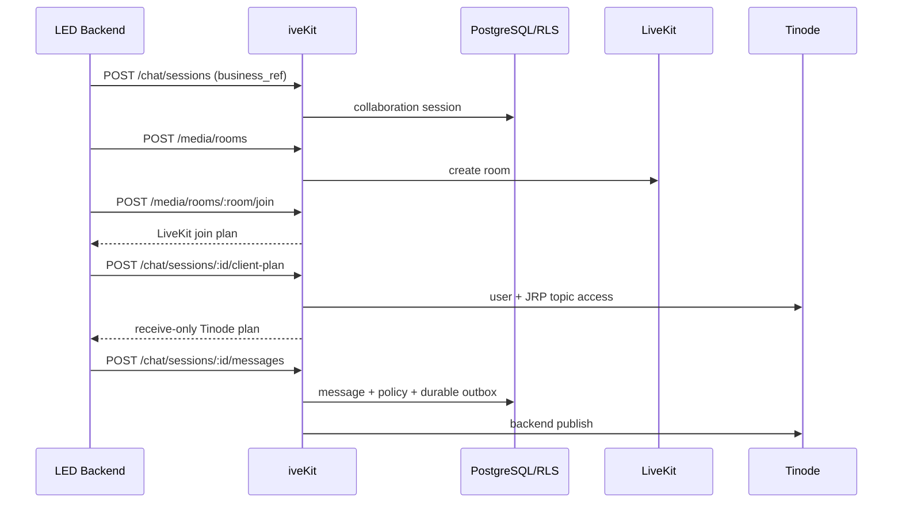

# iveKit LED 集成与抽离指南

> 版本：2026-07-12。面向 LED 项目架构师、后端、前端、部署和 QA。真实服务器证据见《iveKit服务器部署验收报告-2026-07-11》；物理 RustDesk 客户端和未配置的 OCR/ASR/AI provider 仍按人工/外部依赖项处理。

## 1. 交付目标

iveKit 将 OPC 已有通信能力分成三个可复用域：

1. **Media Core**：LiveKit 房间、Join Plan、参与人、视频/语音/屏幕共享、Recording/Egress、对象检查与受控导出。
2. **Collaboration Session**：业务会话、Tinode IM、本地消息镜像、附件、receipt/unread、typing/presence、编辑/软删除、防绕单、OCR/ASR、AI 质检和人工复核。
3. **Remote Assistance**：Web Assist、授权、页面内控制、录屏/证据、RustDesk 系统级远控、设备命令和审计；MeshCentral/Guacamole 保留为 fallback。

LED 不应复制 OPC 的 call-center 业务代码。稳定边界是 `/api/ivekit/context/*`、`/api/ivekit/media/*`、`/api/ivekit/chat/*`、`/api/ivekit/rustdesk/*` 和标准租户事件。SDK 只封装这些 HTTP 契约，后续把能力搬到独立服务时，LED 只需要更换 `baseUrl`。

## 2. 当前完成度

| 范围 | 代码状态 | 真实环境状态 |
| --- | --- | --- |
| Media Core | 房间、join、参与人、录制生命周期、对象读/导出/retention 和 preflight 已完成 | 真实 LiveKit/Egress/MinIO、TURN、双浏览器音视频、屏幕共享、DataChannel 和录制已通过 |
| Collaboration Session | Tinode durable outbound、独立 IM 参考客户端、官方浏览器 SDK adapter、附件 OCR/ASR、质检/人审、IM 高级状态已完成 | 既有后端/Tinode server smoke 保留；本轮参考客户端双真实浏览器验收未运行，OCR/ASR/AI provider 待选型和配置 |
| Remote Assistance | Web Assist 和 RustDesk 控制面/LED SDK/物理断开命令已完成 | RustDesk hbbs/hbbr、授权、launch、审计和撤权已通过；物理双客户端键鼠/文件/录屏仍需人工验收 |
| SDK | `@opc/ivekit-sdk` 已独立打包；`createIveKitClient` 一次提供 Context、Media、Chat 和 RustDesk 高低层能力 | dry-run 发布物已验证只含编译产物、README 和 package metadata |

本地完整门禁和既有服务器验收材料均已保留；本轮新增的 IM 参考客户端按用户要求未上传服务器，双真实浏览器/Tinode 结果仍标记为未运行。所有缺少外部服务或物理客户端的项目继续列在第 11 节，不以受控 E2E 结果替代。

2026-07-11 的最终部署把 PostgreSQL 角色初始化、advisory-locked migration 和 Tinode 服务账号 bootstrap 拆成一次性任务。长驻 iveKit 仅持有 `opc_runtime`，Tinode 仅持有 `tinode_app`；LED 不得获取 `opc_admin`、PostgreSQL 连接密码、LiveKit API secret、MinIO root 或桶级 service secret。MinIO 根账号只用于初始化，iveKit/Egress 只使用限定 `recordings` 桶的业务账号。

## 3. 推荐部署拓扑

### 3.1 推荐：独立 iveKit 服务

`infra/ivekit/docker-compose.yml` 运行 `npm run start:ivekit`，只启动可复用 HTTP、WebSocket、Media/Chat/RustDesk 模块和 worker，不启动 call-center、IVR、外呼或 SQLite runtime。OPC 和 LED 都通过公网 base URL 调用它。

无论嵌入还是抽离，LED 只能通过 iveKit facade/SDK 和标准事件访问能力，不直连 PostgreSQL、Tinode 数据库或 MinIO 管理 API。浏览器只接收短期 LiveKit/Tinode 用户凭据，不接收服务端 provider secret。

```text
LED backend/frontend
        |
        | HTTPS /api/ivekit/*
        v
iveKit process + PostgreSQL/RLS
   |          |          |
LiveKit     Tinode    RustDesk control plane
```

### 3.2 兼容：嵌入 OPC

现有 OPC 进程仍导出相同 `/api/ivekit/*` 路由和兼容 SDK symbol，可作为迁移期入口。LED 只要保持 `baseUrl` 可配置，就能在嵌入式和独立部署间切换，不需要修改业务 payload。

### 3.3 第三阶段：共享通信平台

独立服务按 tenant 提供 Media/Chat/Remote，OPC 和 LED 使用各自 API key/JWT。LiveKit、Tinode、RustDesk 可共享集群，但业务数据必须按 PostgreSQL RLS 和 provider 命名空间隔离。

## 4. SDK 使用

SDK 源码位于 `sdk/ivekit`，包名为 `@opc/ivekit-sdk`，Node.js 20 及以上可直接使用原生 `fetch`。仓库内验证和构建命令：

```bash
npm --prefix sdk/ivekit ci
npm run build:ivekit-sdk
npm run pack:ivekit-sdk
```

`pack:ivekit-sdk` 是 dry-run，不产生 tarball，用于确认发布物没有服务端源码、测试和凭据。LED 可从私有 registry 安装 `npm install @opc/ivekit-sdk`，或在联调阶段安装本地 `sdk/ivekit` 目录。

### 4.1 Node 后端：API key

```ts
import { createIveKitClient } from '@opc/ivekit-sdk';

const ivekit = createIveKitClient({
  baseUrl: 'https://ivekit.example.com',
  apiKey: process.env.OPC_API_KEY!,
  tenantId: 'tenant_led',
  userId: 'agent_1001',
  timeoutMs: 10_000
});

const orderRef = { type: 'service_order', id: 'SO-1001' };
const chat = await ivekit.chat.openSession({ business_ref: orderRef });
const room = await ivekit.media.createRoom({
  purpose: 'video_service',
  business_ref: orderRef
});
```

SDK 自动发送 `X-API-Key`、`X-Tenant-Id` 和可选 `X-User-Id`。服务端 API key 是可信后端凭据，不能放进浏览器包。

### 4.2 浏览器：短期 Bearer token

```ts
import { createIveKitClient } from '@opc/ivekit-sdk';

const browserSdk = createIveKitClient({
  baseUrl: 'https://ivekit.example.com',
  accessToken: signedUserJwt,
  tenantId: 'tenant_led',
  timeoutMs: 10_000
});

const context = await browserSdk.context.getByBusinessRef({
  type: 'service_order',
  id: 'SO-1001'
});
```

Bearer 模式不会发送 `X-User-Id`，身份以 JWT `sub` 为准。浏览器包中严禁出现 API key。JWT 用户不能通过 body 冒用其他身份领取 Tinode client-plan、发送消息、上报 receipt/presence 或编辑消息。

参考客户端深链接使用以下 query：`workspace=messages|calls|remote`、`business_ref_type`、`business_ref_id`、`session_id`、`call_id`、`remote_session_id`。宿主至少应提供完整 business ref；资源 ID 可省略，由脱敏 context 摘要选择最新可见资源。用户切换工作区/资源会产生可后退的 history entry，自动补全和远协输入只替换当前 entry。切换到另一 business ref 时客户端会清除旧 Call/Remote ID，防止跨订单错配。

### 4.3 OPC 迁移期兼容导出

现有 OPC 内部调用可暂时保持原路径：

```ts
import {
  createIveKitClient,
  createIveKitHttpSdk,
  createIveKitRustDeskLedSdk
} from './src/agent-runtime/ivekit/index.js';
```

这些 symbol 已转发到独立包源码，行为和 HTTP payload 不变。新项目必须直接依赖 `@opc/ivekit-sdk`，不要复制兼容文件。

### 4.4 错误、超时、二进制和附件

- Media/Chat 非 2xx 响应抛出 `IveKitHttpSdkError`，包含 `status`、`method`、`path`、`payload`；网络错误和 `timeoutMs` 超时的 `status=0`。
- RustDesk 非 2xx 响应抛出 `IveKitRustDeskHttpError`，字段结构相同。
- `media.exportRecordingObject()` 返回 `{bytes: Uint8Array, contentType, filename}`，调用方自行保存或交给浏览器下载。
- `chat.uploadAttachment()` 接受 `Blob`、`ArrayBuffer`、`Uint8Array` 等 `BodyInit`，并要求显式提供 `kind`、`filename`、`contentType`。
- 写消息时必须传稳定 `Idempotency-Key`；网络超时后用同一 key 重试，不生成新 key。

### 4.5 RustDesk 启动与审计

统一客户端的 `ivekit.rustdesk` 同时包含底层 HTTP 方法和 LED 高层流程：

```ts
const device = await ivekit.rustdesk.ensureDevice({
  businessRef: orderRef,
  rustdeskId: '123456789',
  deviceDisplayName: 'LED service terminal',
  actorIdentity: 'agent_1001'
});
const remote = await ivekit.rustdesk.startSession({
  businessRef: orderRef,
  deviceId: device.id,
  deviceDisplayName: device.display_name,
  actorIdentity: 'agent_1001',
  remoteSessionId,
  permissions: ['view_screen', 'control_mouse_keyboard']
});
await ivekit.rustdesk.recordControlAction(remote.gatewaySession.external_id, {
  operationId: 'op-1',
  actorIdentity: 'agent_1001',
  action: 'mouse_click',
  permission: 'control_mouse_keyboard'
});
await ivekit.rustdesk.endGatewaySession(remote.gatewaySession.external_id, {
  actor_identity: 'agent_1001'
});
```

文件传输、剪贴板同步和屏幕录制分别使用 `recordFileTransfer`、`recordClipboardSync`、`recordScreenRecording`。结束后轮询 `getGatewayDisconnectState`，并在物理客户端验收中确认画面和输入控制确实停止。

仓库内 `clients/ivekit-reference` 的 **Remote** 工作区是可运行的 RustDesk 对接参考实现，LED 可以复用其流程，也可以直接嵌入 `RustDeskLaunchPanel`。组件支持通过 `initialBusinessRef`、`initialRemoteSessionId`、`initialAccessMode` 预填订单/工单和远协会话；运行时完成设备解析、scope 选择、attended/unattended 建会话、授权 scope 展示、ID/relay/API server 与 public key 手工配置展示、原生 `rustdesk://` 拉起、控制权取得/释放/转移、审计数量和物理断开状态展示。

安全与并发约束如下：

1. signed `launch_url` 和 token 不渲染到 DOM，也不持久化；界面只展示客户端手工配置字段。
2. 点击 **Open RustDesk** 时即时重新读取 launch plan，并校验 active 状态、目标 RustDesk ID、protocol scheme 和 server key fingerprint 后才调用浏览器 protocol handler。
3. unattended 模式只在建会话和用户主动拉起时签发并消费 `unattended_launch` 二次确认；普通状态刷新不会消耗一次性确认。
4. 当前身份取得控制权后每 10 秒调用 `heartbeatControl()` 续租；释放、转移、过期、会话结束或组件卸载后停止。续租失败会重新读取服务端 ownership，不在前端伪造所有权。
5. 浏览器 protocol handler 必须由用户点击触发。LED 若封装桌面壳，应通过 `openProtocol(url)` 注入受控原生拉起实现，仍保留上述即时校验。

设备侧物理断开使用 `scripts/rustdesk-edge-adapters/` 中 Windows、macOS、Linux 六个 wrapper。精准断开 wrapper 只调用设备本机预配置的绝对路径 session hook；RustDesk OSS 1.4.7 没有稳定的跨平台 incoming-session disconnect CLI，因此没有 hook 时会明确转入 service restart fallback，并保留 `collateral_sessions_may_disconnect=true`。所有标识均作为独立 argv 传入，未知占位符启动即失败；`validate` 模式不会断开或重启，可用于 LED 设备安装预检，但不能当作物理断开成功证据。

原生 RustDesk/边车操作观测通过 `ivekit.rustdesk.recordOperationObservation()` 或 `npm run rustdesk:operation-observer` 上报。统一覆盖画面、键鼠、多显示器、文件、剪贴板、录屏和断开；同一 `operation_id + status` 使用稳定幂等键，并复用 event forwarder 的 retry/dead-letter/replay。LED 只能上报计数、方向、display ID、SHA-256、duration、状态和 evidence ref，不能发送文件内容、剪贴板正文、按键、屏幕像素、录像字节或凭证。没有 native observer 时必须展示 `not_observed`，不能从 HTTP 2xx 或 wrapper 成功推导真实操作成功。

### 4.6 可运行示例

```bash
OPC_IVEKIT_LED_BASE_URL=https://opc.example.com \
OPC_IVEKIT_LED_API_KEY=... \
OPC_IVEKIT_LED_TENANT_ID=tenant_led \
OPC_IVEKIT_LED_USER_ID=agent_1001 \
OPC_IVEKIT_LED_BUSINESS_REF_ID=SO-1001 \
npm run ivekit:led-example
```

示例创建 collaboration session、参与人、LiveKit room、join plan 和幂等 IM 消息。只有额外提供 `OPC_IVEKIT_LED_REMOTE_SESSION_ID` 以及 RustDesk device/runtime ID 时才启动已有授权范围内的 RustDesk session。

## 5. LED 主流程

### 5.1 视频 + IM



业务消息必须先走 iveKit。Tinode 客户端 mode 为 `JRP`，没有 `W`；`direct_client_publish=false`。这样文本、附件、OCR/ASR、AI 质检和审计不会被绕开。

### 5.2 receipt、在线状态和编辑

1. 页面打开后取得 snapshot/client-plan。
2. 对最新可见他人消息调用 receipt `status=read`，后端执行 read-through。
3. 页面每 60 秒刷新 presence，TTL 默认 90 秒；typing TTL 默认 8 秒。
4. 发送者在 `OPC_CHAT_MESSAGE_MUTATION_WINDOW_MS` 内可编辑或软删除文本消息。
5. LED UI 以 iveKit snapshot 和 `collaboration.message.edited/deleted` 为权威；当前不把 edit/delete 回写成 Tinode 原生 mutation。

### 5.3 RustDesk

RustDesk 前置条件是 collaboration remote session 已创建且授权 scope 已 grant。LED 使用 `createIveKitRustDeskLedSdk`：

1. 按 business_ref 查找/注册设备并 heartbeat。
2. `startSession` 创建 gateway session 和 launch plan。
3. 记录 control/file/clipboard/recording 操作事件。
4. 结束会话后查询 physical disconnect command 状态。
5. 真实客户端必须人工确认屏幕和键鼠能力已经停止。

## 6. 数据库与迁移

生产数据层只使用 **PostgreSQL + RLS**，不要引入 SQLite。独立部署至少按顺序迁移：

| Migration | 作用 |
| --- | --- |
| `009_tenant_rls.sql`、`010_force_rls.sql` | tenant context/RLS 基础 |
| `011_collaboration_remote_assistance.sql` | session、participant、message、remote、consent、audit、evidence |
| `012_livekit_participants.sql`、`013_media_recording_business_ref.sql` | LiveKit 参与人和录制业务引用 |
| `014_remote_assistance_web_assist_mode.sql` | Web Assist mode |
| `016_collaboration_chat_bindings.sql`、`017_collaboration_message_attachments.sql` | Chat provider binding 和附件 |
| `018` 到 `024` | RustDesk device/gateway/event/heartbeat/RLS/command |
| `025_collaboration_message_delivery.sql` | Tinode durable outbox/attempt |
| `026_media_recording_lifecycle.sql` | recording lifecycle/retention/object |
| `027_collaboration_attachment_processing.sql` | OCR/ASR durable job |
| `028_collaboration_policy_findings.sql` | 统一 finding 和人工复核 |
| `029_collaboration_quality_review.sql` | AI 质检 durable job |
| `030_collaboration_message_state.sql` | receipt、presence/typing、edit/delete audit |

迁移后必须验证 `ENABLE ROW LEVEL SECURITY`、`FORCE ROW LEVEL SECURITY`、tenant policy 和非 bypass 账号的跨租户拒绝。MemoryPg 测试不能替代真实 PostgreSQL。

## 7. 配置与依赖

### iveKit HTTP

- `OPC_IVEKIT_ALLOWED_ORIGINS`：允许浏览器直连的逗号分隔 HTTPS origin，不含路径；未列出的跨域请求返回 403。
- `OPC_IVEKIT_HTTP_BODY_MAX_BYTES`：普通 JSON 和 webhook body 上限，默认 1 MiB；附件另用 `OPC_COLLABORATION_ATTACHMENT_MAX_BYTES`。
- 同源反向代理可不产生跨域请求；跨域 LED Web 必须在部署时显式加入 origin。

### Media Core

- `LIVEKIT_URL/API_KEY/API_SECRET`
- `LIVEKIT_EGRESS_URL` 与 webhook secret
- `OPC_MEDIA_CONFIG_RTC_TCP_PORT`，默认 `7881`
- `OPC_MEDIA_CONFIG_RTC_UDP_PORT`，默认 `7882-7892`，生产防火墙必须开放同一 UDP 范围
- `OPC_MEDIA_CONFIG_USE_EXTERNAL_IP=true` 用于生产公网 ICE 候选；本地固定配置保持 `false`
- MinIO/S3 endpoint、bucket、key、secret
- 客户邀请和 Web Assist join 签名 secret

### Collaboration Session

- `TINODE_DEPLOYMENT_MODE=external|self_hosted`
- 自建模式必填 `TINODE_POSTGRES_DSN`、32 字节 base64 `TINODE_AUTH_TOKEN_KEY`、16 字节 base64 `TINODE_UID_ENCRYPTION_KEY`
- 所有生产模式都必须提供公网 `wss://` 的 `TINODE_PUBLIC_WS_URL`，或可推导 WSS 的 `https://` `TINODE_PUBLIC_BASE_URL`
- Tinode server 镜像默认固定为 `tinode/tinode:0.25.3`，升级前必须执行真实 server、SDK 和 ACL 回归
- `TINODE_BASE_URL/WS_URL/PUBLIC_WS_URL/API_KEY`
- Tinode root token 或 basic root 凭据
- `TINODE_USER_PASSWORD_SECRET`
- delivery worker、attachment worker、quality worker 参数
- `OPC_CHAT_MESSAGE_MUTATION_WINDOW_MS`
- OCR/ASR/AI provider mode、URL、token、timeout

### Remote Assistance

- RustDesk hbbs/hbbr、public key、ID/relay/API server
- control-plane base URL/token
- edge token secret、设备 token、wrapper 和 physical-disconnect strict mode

完整变量见 `.env.example`、`infra/env.example`、本地/production Compose、`infra/docker-compose.tinode.yml` 和 `infra/k8s/values.yaml`。

## 8. 抽离文件边界

### 必须一起抽离

- `src/agent-runtime/ivekit/`
- `src/agent-runtime/livekit/`
- `src/agent-runtime/collaboration/`
- recording object/evidence 辅助模块
- `src/db-pg-tenant.ts` 和相关 migration runner
- `src/migrations/009` 到 `035` 中上述能力实际引用的迁移，尤其是 call lifecycle `034` 和 moderation audit `035`
- attachment/Tinode/quality workers 的 server lifecycle
- 租户 WebSocket/Redis 广播 adapter
- `scripts/*preflight*`、media/chat/rustdesk smoke 与验收脚本
- `frontend/src/pages/tinode-realtime.ts` 或等价 LED adapter

### 不应抽离

- call-center 坐席、IVR、外呼和 CRM 业务路由
- AI 数字人业务编排
- LED 自己的订单、设备管理和审核工作台 UI

可交付客户端边界是 `sdk/ivekit`；`src/agent-runtime/ivekit/http-sdk.ts` 等旧文件仅是兼容导出，不应再复制。独立服务入口是 `src/ivekit-server.ts`，运行生命周期由 `src/agent-runtime/ivekit/application.ts` 统一管理；服务端抽离必须连同 PostgreSQL tenant context、RLS、migration、worker 和 provider 配置一起交付。

## 9. 错误、幂等和重试

1. 客户端消息必须带稳定 `Idempotency-Key`；同 key 同 payload 返回原消息，不同 payload 返回 409。
2. Media call action、主持人 mute/remove 同样必须带稳定 `Idempotency-Key`；超时、连接中断或 `5xx` 必须用原 key 和原 payload 重试。
3. iveKit 会在 provider 前写 durable moderation command；运维恢复任务使用 system API key 调 `/api/ivekit/media/moderation/recover`，按 tenant 最终化崩溃窗口中的 pending command。
4. HTTP 202 表示本地消息和扫描已完成、provider 正在 durable retry；不能当作消息丢失。
5. HTTP 502 表示 provider 操作失败；Media moderation/呼叫终态不会提前落库，IM durable delivery 则按消息接口语义保留本地消息和审计。
6. SDK 抛出 `IveKitHttpSdkError`，包含 `status/method/path/payload`；网络/超时 status 为 0。
7. receipt、presence、typing 和 mutation 只能以当前认证身份执行。
8. RustDesk end/physical disconnect 是最终一致链路，LED 要展示 pending/succeeded/failed/unavailable。

## 10. 事件订阅

LED 可订阅 OPC 租户 WebSocket。关键事件：

- `collaboration.message.created`
- `collaboration.message.receipt_updated`
- `collaboration.typing.updated`
- `collaboration.presence.updated`
- `collaboration.message.edited`
- `collaboration.message.deleted`
- `collaboration.attachment.processed`
- `collaboration.quality_review.completed`
- `collaboration.policy.finding_reviewed`
- `ivekit.media.call.created/updated/ended`
- `ivekit.media.participant.updated/moderated`
- Web Assist consent/event/recording 与 RustDesk gateway/audit 事件

WebSocket 是加速通道，页面重连后必须用 snapshot/message-state/realtime-state 重新收敛，不能只依赖内存事件。

## 11. 真实环境验收

### 11.1 已完成的本地部署准备

1. `docker-compose.callcenter.yml` 直接包含 PostgreSQL 版 `tinode/tinode`；production 自建模式通过叠加 `infra/docker-compose.tinode.yml` 启用同一能力。production base 不含 Tinode server，供外部/共享 Tinode 使用；两种模式都没有引入 SQLite。
2. 两份 Compose 都映射 LiveKit `7881/tcp` 和 `7882-7892/udp`；不再把 `7881` 错当 UDP 端口。
3. production LiveKit 配置渲染支持公网 ICE 开关；Egress 与 LiveKit 使用同一 Redis，S3 参数位于当前 Egress 所需的 `storage.s3` 层级。
4. production Tinode overlay 和 `npm run tinode:deployment-preflight` 都会对自建模式的 PostgreSQL DSN 与运行时密钥 fail-closed；preflight 还校验密钥长度，并对所有生产模式校验公网 WSS，生成的 JSON/Markdown 不回显秘密。
5. 本地 Compose、production external base、配置完整的 production self-hosted overlay 均已通过 `docker compose config --quiet`；缺自建密钥的 overlay 已验证会拒绝解析。
6. production base 的 `postgres-bootstrap` 会在健康 PostgreSQL 上幂等确认 `keycloak` 数据库；自建 Tinode overlay 把集合扩展为 `keycloak,tinode`。脚本拒绝任意数据库标识和非 `opc` owner，不会删除或重建已有数据库。
7. `minio-init` 会有限重试 MinIO endpoint，幂等创建录制 bucket，关闭匿名访问，回读确认 private 后再执行 `stat`。Egress、RustPBX 和 OPC 只有在该 one-shot 成功后才允许启动。
8. PgBouncer 必须通过 6432 端口的认证 `psql SELECT 1` 后，OPC 才启动；只接受连接但凭证/数据库不可用不会标记健康。Keycloak 和 Tinode 同样等待数据库 bootstrap 成功，而不是只等待 PostgreSQL container 进程存在。
9. Chatwoot 由 `omnichannel` profile 显式启用，不属于默认 iveKit 生产链路，也不计入当前 readiness。启用前仍需单独完成固定版本、pgvector、`db:chatwoot_prepare`、Rails/Sidekiq、升级与回滚设计。
10. LiveKit 地址已拆成服务端 `LIVEKIT_URL` 和浏览器 `LIVEKIT_PUBLIC_URL`。生产 Join Plan 只返回显式 `wss://` 公网地址；缺失或误配明文 `ws://` 时直接拒绝浏览器 join。
11. `infra/livekit/` 提供可从 OPC 独立运行的 Linux VM Media Core 包：LiveKit、Redis、Egress 和 Caddy L4 使用 host networking；Caddy 按两个 SNI 域名分流 WSS 与 TURN/TLS；LiveKit 使用内置 TURN，不增加 coturn。
12. 独立部署渲染命令为 `npm run render:livekit-edge`。产物包括 `livekit.yaml`、`egress.yaml`、`caddy.yaml`、`firewall.md` 和不含秘密原文的 `deployment-summary.json`；LiveKit/Egress 凭据文件权限为 `0600`。
13. 生产 Compose 默认按 `OPC_LIVEKIT_DEPLOYMENT_MODE=external` 消费外置 Media Core，内置 LiveKit/SIP/Egress 只在显式 `media-bundled` profile 下启用，且只用于联调。Kubernetes 同样默认 `livekit.enabled=false`，生产媒体节点应使用 LiveKit 官方 Helm chart 独立部署。
14. 媒体镜像已固定为 LiveKit Server `v1.13.3`、Egress `v1.13.0`、SIP `v1.6.0`、Caddy L4 `v2.11.3`、Redis `7.4.9`；升级必须成组回归，不使用 `latest`。
15. production 缺内部 URL、API key、API secret 或公网 WSS 时直接失败，不会签发 `dev-token`。preflight 和渲染器还会拒绝 `your_key`、`change_me`、`devkey`、`secret`、`minioadmin` 等占位/弱默认值。

以上代码尚未在目标服务器执行 Docker 镜像拉取、容器启动、真实数据库/bucket 初始化或真实 provider 请求。2026-07-11 已通过 SSH 完成目标服务器只读资源与端口盘点，但没有上传、部署或修改现有 LED 服务。

### 11.2 Production Compose 启动方式

外部或共享 Tinode 使用 base：

```bash
docker compose --env-file infra/env.example \
  -f infra/docker-compose.production.yml up -d
```

自建 Tinode 使用 base + overlay：

```bash
docker compose --env-file infra/env.example \
  -f infra/docker-compose.production.yml \
  -f infra/docker-compose.tinode.yml up -d
```

Chatwoot 是独立可选项，不属于 iveKit readiness：

```bash
docker compose --profile omnichannel --env-file infra/env.example \
  -f infra/docker-compose.production.yml up -d chatwoot
```

`postgres-bootstrap` 和 `minio-init` 是一次性任务。成功后显示 `Exited (0)` 属于正常完成，不应按常驻服务崩溃处理；非 0 才表示初始化失败，依赖服务应保持阻塞。

### 11.3 必须执行

1. 先用 `OPC_LIVEKIT_ACCEPTANCE_BUNDLE_DIR=<evidence-dir> npm run livekit:acceptance-bundle` 固定本轮路径，再按 manifest 运行 `livekit:deployment-preflight`、`livekit:server-evidence`、`smoke:media:readiness`、真实客户端验收和 `livekit:evidence-pack`；最终必须为 `ready_for_customer_review`。
2. `npm run tinode:deployment-preflight`、`npm run smoke:chat:tinode`、双浏览器 SDK join/data/info/presence/read note。
   - 本地先运行 `npm run verify:ivekit:im-client` 和 `npm run test:e2e:ivekit-im`；受控 E2E 覆盖两身份、合法 token/topic 订阅、Tinode-only `{data}` 触发 HTTP 镜像收敛、客户端零 publish、附件进度、receipt、typing/presence、edit/delete、reply/forward、reaction/pin、finding 人审、断网重连、会话关闭和桌面/手机布局。
   - 用 `OPC_IVEKIT_IM_ACCEPTANCE_TEMPLATE_FILE=<path> npm run ivekit:im-client-acceptance` 生成故意不完整的真实环境模板。两台真实浏览器和真实 Tinode 完成后，设置 `OPC_IVEKIT_IM_ACCEPTANCE_REPORT_FILE` 再运行 validator；没有报告时结果必须为 `not_run`，受控截图不得改写为真实证据。
   - 每项通过检查引用唯一、非符号链接的 JSON observation，validator 会核对 SHA-256、`check_id`、`run_id`、`environment_id`、采集时间、工具和结构化 observation；布局证据还必须记录人工脱敏复核。报告与 observation 严禁写入 API key、Authorization、Bearer/Basic/JWT、cookie、密码、私钥或 provider secret。validator 成功只表示 `ready_for_review`，不能证明观察真实发生，也不能替代人工核对截图与脱敏结果。
3. 验证 Tinode 用户只有 `JRP`，浏览器直接 publish 被拒绝。
4. 真实 PostgreSQL 跑 migration/RLS、多副本 claim 竞争、10k+ 消息 unread/read-through。
5. 真实 OCR/ASR/AI provider 的准确率、延迟、重试、限流和数据合规。
6. RustDesk server evidence/readiness/client acceptance/audit coverage/evidence pack，包含真实物理断开观察。
   - 本地先运行 `npm run test:e2e:ivekit-rustdesk`；受控 E2E 覆盖设备、授权 scope、gateway、宿主协议拉起、控制权、转交、操作审计、结束/撤权、断开进度、旧链接失效、租户/参与人隔离、幂等重试、token 零持久化和响应式布局。
   - 该命令只产生控制面本地回归证据。它不启动 RustDesk 原生客户端，也不得把画面、键鼠、多显示器、文件、剪贴板、录屏、relay 流量或物理断开标记为真实通过；这些项目必须由 Task 9 的真实终端报告提供，否则保持 `not_run`。
   - 真实终端报告使用 schema v2 (`source=real_terminal`)：记录 hbbs/hbbr、agent/target 客户端版本与平台/架构、target ID、key fingerprint、ID/relay 路径和不同 operator/QA 身份。每个检查必须引用唯一 JSON observation，并按 SHA-256 绑定同一 run、environment、完整 commit、external_id、rustdesk_id、时间和真实采集工具；controlled/Playwright/mock/synthetic 证据会被拒绝。
7. 多实例 Redis/WebSocket 广播、断网重连、旧 SDK 连接不复活。

### 11.4 当前不得声称通过

真实 LiveKit/Tinode/RustDesk 客户端、真实对象存储、真实 OCR/ASR/AI、电话线路、多副本和生产网络尚未在当前本地环境验证。preflight 和 fake provider 只证明配置/协议形状。

TURN/TLS、TURN/UDP、NAT、SNI 路由和防火墙的独立 Linux VM 配置已经在代码中补齐，但 DNS、ACME 证书签发、云防火墙、真实 ICE 候选和强制 relay 尚未运行验证。Tinode Kubernetes 模板仍未补齐。MinIO bucket 与 PostgreSQL 多数据库初始化的代码和 Compose 门禁已经补齐，但真实 fresh/existing volume、bucket 私有性/持久化、Egress 写入和重启恢复仍必须在服务器验证，不能由 fake command 测试或 Compose 静态解析替代。

LiveKit evidence pack 的自动 server probe 只覆盖 DNS、证书、健康、TCP 和 UDP 发包。ICE UDP/TCP candidate pair、forced TURN UDP/TLS、双浏览器音视频/屏幕共享、LED SDK business_ref 追踪、跨租户拒绝、RLS、重启恢复、性能和 SIP 呼入/呼出必须填写真实客户端报告；模板文本不能直接作为通过证据。

同一轮产物必须共享 `run_id`、`started_at`、`environment_id`、部署模式、完整 `deployed_commit` 和 `deployment_fingerprint`，且必须是当前 24 小时内的采集。客户端报告不接受“已截图/已验证”一类自由文本：每项 passed check 使用独立可读 JSON artifact，内含唯一 check ID、完整 run metadata、采集时间/工具和该检查专属 details；validator 会重新散列并解析。QA approver 必须与 operator 不同，其 Ed25519 签名覆盖批准决策和全部输入哈希；公钥文件还必须匹配预配置指纹。新一轮验收必须使用新目录，bundle 会拒绝残留真实结果的旧目录。

## 12. 版本与责任边界

1. iveKit API 第一版保持 additive evolution；删除/改名必须先发布 deprecation。
2. `capabilities` 是运行时能力协商入口，LED 不应硬猜 provider 是否配置。
3. LED 负责业务对象、页面流程、审核工作台和业务处置；iveKit 负责通信 session、媒体、IM、远协、审计和 provider adapter。
4. 当前官方浏览器依赖为 `tinode-sdk@0.25.1`；升级前必须重跑 adapter、真实 server 和权限门禁。
5. 详细数据/API/验收证据继续以 `iveKit视频IM通用能力详细设计.md`、`livekit-im-full-capability-plan.md` 和 `审核文档.md` 为准。
