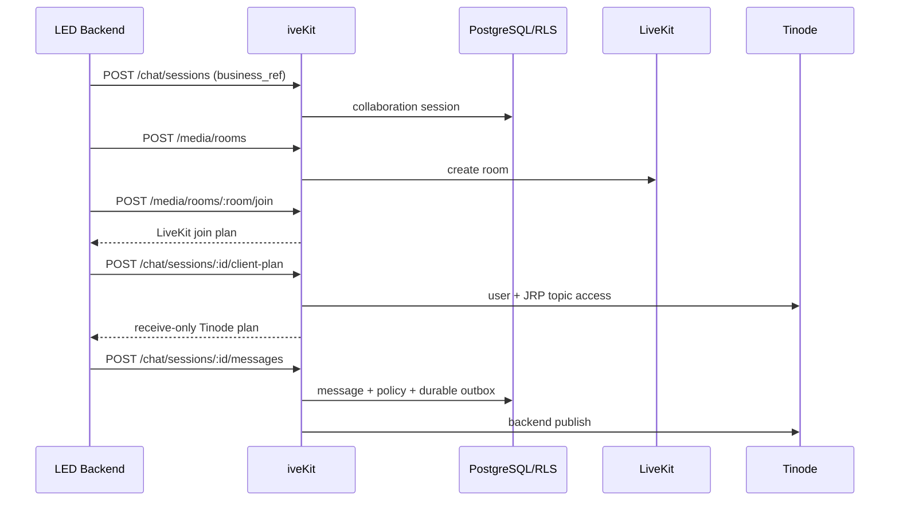

# iveKit LED 集成与抽离指南

> 版本：2026-07-23。面向 LED 项目架构师、后端、前端、部署和 QA。真实服务器证据见《iveKit服务器部署验收报告-2026-07-11》、V2 M6.3-M6.6 记录和 `docs/evidence/`；物理 RustDesk 客户端、真实 Voice/PSTN/RTP、真实 LiveKit 实时音频旁路和未配置的外部 OCR/ASR/AI provider 仍按人工/外部依赖项处理。

## 1. 交付目标

iveKit 将 OPC 已有通信能力分成四个可复用域：

1. **Media Core**：LiveKit 房间、Join Plan、参与人、视频/语音/屏幕共享、Recording/Egress、对象检查与受控导出。
2. **Collaboration Session**：业务会话、Tinode IM、本地消息镜像、附件、receipt/unread、typing/presence、编辑/软删除、防绕单、OCR/ASR、AI 质检和人工复核。
3. **Remote Assistance**：Web Assist、授权、页面内控制、录屏/证据、RustDesk 系统级远控、设备命令和审计；MeshCentral/Guacamole 保留为 fallback。
4. **Voice Foundation**：RustPBX/LiveKit SIP 控制面、Voice Call、IVR、Contact Center、callback、overflow、supervisor port 与 Queue Monitor 投影。

LED 不应复制 OPC 的 call-center 业务代码。稳定边界是 `/api/ivekit/context/*`、`/api/ivekit/media/*`、`/api/ivekit/chat/*`、`/api/ivekit/rustdesk/*`、`/api/ivekit/voice/*`、`/api/ivekit/ivr/*`、`/api/ivekit/contact-center/*` 和标准租户事件。SDK 只封装这些 HTTP 契约，后续把能力搬到独立服务时，LED 只需要更换 `baseUrl`。

## 2. 当前完成度

| 范围 | 代码状态 | 真实环境状态 |
| --- | --- | --- |
| Media Core | 房间、join、参与人、录制生命周期、对象读/导出/retention、preflight，以及 LiveKit/RustPBX 到统一实时 ASR/翻译 Provider 路由的有界 PCM 旁路已完成 | 既有 LiveKit/Egress/MinIO、TURN、双浏览器音视频、屏幕共享、DataChannel 和录制受控验收保留；本轮真实 LiveKit `AudioStream -> iveKit -> 外部 Provider` 尚未运行 |
| Collaboration Session | Tinode durable outbound、独立 IM 参考客户端、官方浏览器 SDK adapter、附件 OCR/ASR、质检/人审、IM 高级状态已完成 | 既有后端/Tinode server smoke 保留；本轮参考客户端双真实浏览器验收未运行，OCR/ASR/AI provider 待选型和配置 |
| Remote Assistance | Web Assist 和 RustDesk 控制面/LED SDK/物理断开命令已完成 | RustDesk hbbs/hbbr、授权、launch、审计和撤权已通过；物理双客户端键鼠/文件/录屏仍需人工验收 |
| Voice/IVR/Contact Center | Voice/IVR 后端、Contact Center ACD/callback/overflow/supervisor 控制面、监控投影、SDK 和 Queue Monitor 参考工作区已完成 | 受控 PostgreSQL/RustPBX 与 Queue Monitor 桌面/移动浏览器通过；真实 SIP/PSTN、浏览器媒体和 supervisor provider 保持 `not_run` |
| SDK 与交付 | `@converact/sdk` 已独立打包；统一客户端提供 Context、Media、Chat、Events、RustDesk、Voice、IVR 和 Contact Center；交付包包含独立服务构建上下文、migration、SBOM 和 edge 包 | SDK/edge 干净容器安装和交付包独立镜像构建已在服务器通过；provider 数据面按各自验收状态裁决 |

本地完整门禁和服务器验收材料均已保留。V2 已在隔离服务器验证真实 Tinode inbound/event replay/RustDesk edge recovery，并验证最终交付包可独立构建和安装；本轮没有重跑的 LiveKit 数据面、物理 RustDesk 双客户端以及 OCR/ASR/AI provider 仍保持 `not_run_for_v2`。所有缺少外部服务或物理客户端的项目继续列在第 11 节，不以受控 E2E 结果替代。

2026-07-11 的最终部署把 PostgreSQL 角色初始化、advisory-locked migration 和 Tinode 服务账号 bootstrap 拆成一次性任务。长驻 iveKit 仅持有 `opc_runtime`，Tinode 仅持有 `tinode_app`；LED 不得获取 `opc_admin`、PostgreSQL 连接密码、LiveKit API secret、MinIO root 或桶级 service secret。MinIO 根账号只用于初始化，iveKit/Egress 只使用限定 `recordings` 桶的业务账号。

## 3. 推荐部署拓扑

### 3.1 推荐：独立 iveKit 服务

`infra/converact/docker-compose.yml` 运行 `npm run start:ivekit`，启动可复用 HTTP、WebSocket、Media/Chat/RustDesk/Voice/IVR/Contact Center 模块和已启用的 worker，不启动 OPC 历史 call-center 或 SQLite runtime。OPC 和 LED 都通过公网 base URL 调用它。

无论嵌入还是抽离，LED 只能通过 iveKit facade/SDK 和标准事件访问能力，不直连 PostgreSQL、Tinode 数据库或 MinIO 管理 API。浏览器只接收短期 LiveKit/Tinode 用户凭据，不接收服务端 provider secret。

```text
LED backend/frontend
        |
        | HTTPS /api/ivekit/*
        v
iveKit process + PostgreSQL/RLS
   |          |          |
LiveKit     Tinode    RustDesk control plane
```

### 3.2 兼容：嵌入 OPC

现有 OPC 进程仍导出相同 `/api/ivekit/*` 路由和兼容 SDK symbol，可作为迁移期入口。LED 只要保持 `baseUrl` 可配置，就能在嵌入式和独立部署间切换，不需要修改业务 payload。

### 3.3 第三阶段：共享通信平台

独立服务按 tenant 提供 Media/Chat/Remote，OPC 和 LED 使用各自 API key/JWT。LiveKit、Tinode、RustDesk 可共享集群，但业务数据必须按 PostgreSQL RLS 和 provider 命名空间隔离。

## 4. SDK 使用

SDK 源码位于 `sdk/converact`，包名为 `@converact/sdk`，Node.js 20 及以上可直接使用原生 `fetch`。仓库内验证和构建命令：

```bash
npm --prefix sdk/converact ci
npm run build:ivekit-sdk
npm run pack:ivekit-sdk
```

`pack:ivekit-sdk` 是 dry-run，不产生 tarball，用于确认发布物没有服务端源码、测试和凭据。LED 可从私有 registry 安装 `npm install @converact/sdk`，或在联调阶段安装本地 `sdk/converact` 目录。

参考客户端生产构建会自动运行 `check:bundle`：initial、Tinode、Media、Voice、Remote、Quality、Queue Monitor 和 LiveKit vendor 均有独立字节预算，并检查 `index.html` 不预加载 provider/workspace chunk。不要通过删除该门禁或单纯提高 Vite warning limit 接受无界增长。

### 4.1 Node 后端：API key

```ts
import { createIveKitClient } from '@converact/sdk';

const ivekit = createIveKitClient({
  baseUrl: 'https://ivekit.example.com',
  apiKey: process.env.OPC_API_KEY!,
  tenantId: 'tenant_led',
  userId: 'agent_1001',
  timeoutMs: 10_000
});

const orderRef = { type: 'service_order', id: 'SO-1001' };
const chat = await ivekit.chat.openSession({ business_ref: orderRef });
const room = await ivekit.media.createRoom({
  purpose: 'video_service',
  business_ref: orderRef
});
```

SDK 自动发送 `X-API-Key`、`X-Tenant-Id` 和可选 `X-User-Id`。服务端 API key 是可信后端凭据，不能放进浏览器包。

### 4.2 浏览器：短期 Bearer token

```ts
import { createIveKitClient } from '@converact/sdk';

const browserSdk = createIveKitClient({
  baseUrl: 'https://ivekit.example.com',
  accessToken: signedUserJwt,
  tenantId: 'tenant_led',
  timeoutMs: 10_000
});

const context = await browserSdk.context.getByBusinessRef({
  type: 'service_order',
  id: 'SO-1001'
});
```

Bearer 模式不会发送 `X-User-Id`，身份以 JWT `sub` 为准。浏览器包中严禁出现 API key。JWT 用户不能通过 body 冒用其他身份领取 Tinode client-plan、发送消息、上报 receipt/presence 或编辑消息。

参考客户端深链接使用以下 query：`workspace=messages|calls|voice|remote|quality|operations`、`business_ref_type`、`business_ref_id`、`session_id`、`call_id`、`voice_call_id`、`remote_session_id`。`operations` 是租户级 Queue Monitor，不要求 business ref；其他业务工作区的宿主至少应提供完整 business ref，资源 ID 可省略，由脱敏 context 摘要选择最新可见资源。用户切换工作区/资源会产生可后退的 history entry，自动补全和远协输入只替换当前 entry。切换到另一 business ref 时客户端会清除旧 Call/Voice/Remote ID，防止跨订单错配。

### 4.3 OPC 迁移期兼容导出

现有 OPC 内部调用可暂时保持原路径：

```ts
import {
  createIveKitClient,
  createIveKitHttpSdk,
  createIveKitRustDeskLedSdk
} from './src/agent-runtime/converact/index.js';
```

这些 symbol 已转发到独立包源码，行为和 HTTP payload 不变。新项目必须直接依赖 `@converact/sdk`，不要复制兼容文件。

### 4.4 错误、超时、二进制和附件

- Media/Chat 非 2xx 响应抛出 `IveKitHttpSdkError`，包含 `status`、`method`、`path`、`payload`；网络错误和 `timeoutMs` 超时的 `status=0`。
- RustDesk 非 2xx 响应抛出 `IveKitRustDeskHttpError`，字段结构相同。
- `media.exportRecordingObject()` 返回 `{bytes: Uint8Array, contentType, filename}`，调用方自行保存或交给浏览器下载。
- `chat.uploadAttachment()` 接受 `Blob`、`ArrayBuffer`、`Uint8Array` 等 `BodyInit`，并要求显式提供 `kind`、`filename`、`contentType`。
- 写消息时必须传稳定 `Idempotency-Key`；网络超时后用同一 key 重试，不生成新 key。

### 4.5 RustDesk 启动与审计

统一客户端的 `ivekit.rustdesk` 同时包含底层 HTTP 方法和 LED 高层流程：

```ts
const device = await ivekit.rustdesk.ensureDevice({
  businessRef: orderRef,
  rustdeskId: '123456789',
  deviceDisplayName: 'LED service terminal',
  actorIdentity: 'agent_1001'
});
// 客户端身份创建，raw code 只在该响应出现一次，不写日志或业务库。
const requested = await customerIvekit.rustdesk.requestAuthorizationCode({
  remote_session_id: remoteSessionId,
  device_id: device.id,
  scopes: ['view_screen', 'control_mouse_keyboard']
}, { idempotencyKey: `remote-auth:${remoteSessionId}:1` });
// 通过受保护的用户交互把 requested.code 交给当前工程师。
await ivekit.rustdesk.verifyAuthorizationCode(requested.authorization.id, {
  code: requested.code!
});
const remote = await ivekit.rustdesk.startSession({
  businessRef: orderRef,
  deviceId: device.id,
  deviceDisplayName: device.display_name,
  actorIdentity: 'agent_1001',
  remoteSessionId,
  authorizationId: requested.authorization.id,
  permissions: ['view_screen', 'control_mouse_keyboard']
});
await ivekit.rustdesk.recordControlAction(remote.gatewaySession.external_id, {
  operationId: 'op-1',
  actorIdentity: 'agent_1001',
  action: 'mouse_click',
  permission: 'control_mouse_keyboard'
});
await ivekit.rustdesk.endGatewaySession(remote.gatewaySession.external_id, {
  actor_identity: 'agent_1001'
});
```

文件传输、剪贴板同步和屏幕录制分别使用 `recordFileTransfer`、`recordClipboardSync`、`recordScreenRecording`。结束后轮询 `getGatewayDisconnectState`，并在物理客户端验收中确认画面和输入控制确实停止。

仓库内 `clients/converact-reference` 的 **Remote** 工作区是可运行的 RustDesk 对接参考实现，LED 可以复用其流程，也可以直接嵌入 `RustDeskLaunchPanel`。组件支持通过 `initialBusinessRef`、`initialRemoteSessionId`、`initialAccessMode` 预填订单/工单和远协会话；运行时完成设备解析、scope 选择、attended/unattended 建会话、授权 scope 展示、ID/relay/API server 与 public key 手工配置展示、原生 `rustdesk://` 拉起、控制权取得/释放/转移、审计数量和物理断开状态展示。

安全与并发约束如下：

1. signed `launch_url` 和 token 不渲染到 DOM，也不持久化；界面只展示客户端手工配置字段。
2. 点击 **Open RustDesk** 时即时重新读取 launch plan，并校验 active 状态、目标 RustDesk ID、protocol scheme 和 server key fingerprint 后才调用浏览器 protocol handler。
3. unattended 模式只在建会话和用户主动拉起时签发并消费 `unattended_launch` 二次确认；普通状态刷新不会消耗一次性确认。
4. attended 严格模式下，active customer/admin 创建 8 位一次性 code，active engineer 验证后把 `authorization_id` 交给启动请求；服务端在调用 RustDesk 前原子 claim，只有 gateway session 持久化成功后才 consume，并发启动不能重复消费。明确失败会释放 claim，超时 claim 到期后回到 verified；code 不是 RustDesk password，不能存储、重放或替代 consent/control。
5. 当前身份取得控制权后每 10 秒调用 `heartbeatControl()` 续租；释放、转移、过期、会话结束或组件卸载后停止。续租失败会重新读取服务端 ownership，不在前端伪造所有权。
6. 浏览器 protocol handler 必须由用户点击触发。LED 若封装桌面壳，应通过 `openProtocol(url)` 注入受控原生拉起实现，仍保留上述即时校验。

Windows 设备侧精准断开由 ACL 保护的 session registry、固定 resolver 和 `ivekit-rustdesk-native-control-v2` named pipe 完成。gateway session 创建时由服务端生成不重复的 `ivekit_native_session_id`；launch plan 只把它放进 `rustdesk://` 的 `ivekit_session_id` 查询参数，不放进公开 metadata。定制 RustDesk 1.4.9 会把该值从深链、Flutter、多窗口、IPC 一直传到 connection manager。placement-enabled package v6 再把 `interaction_id + reservation_id + owner_epoch + command_id + native_session_id` 传入 companion 与原生 overlay；companion 先校验服务端 owner binding，再以每个 external session 一个原子状态分片持久化已接受的最大 epoch，旧 epoch 在原生执行前直接拒绝。原生 resolver 必须同时匹配 `native_session_id + controller_rustdesk_id`，只对该 native connection ID 调用 close，并在回显 owner identity、native session ID 且确认该连接消失后才报告成功；任一字段缺失、漂移或会话已替换均返回 `precise_disconnect_unavailable`。v1 只用于关闭 Cell placement 的滚动兼容。普通链路不会自动重启 RustDesk service。只有 owner/admin 显式调用 `authorizeEmergencyFallback()`、提交原因并确认 `collateral_sessions_may_disconnect=true` 后，companion 才能在同一授权约束下执行一次 emergency restart；该路径会独立审计，可能影响同机其他会话。macOS/Linux wrapper 仍保持显式 capability/不可用语义，不能伪装成 Windows 精准断开。

原生 RustDesk/边车操作观测通过 `ivekit.rustdesk.recordOperationObservation()` 或 `npm run rustdesk:operation-observer` 上报。统一覆盖画面、键鼠、多显示器、文件、剪贴板、录屏和断开；同一 `operation_id + status` 使用稳定幂等键，并复用 event forwarder 的 retry/dead-letter/replay。LED 只能上报计数、方向、display ID、SHA-256、duration、状态和 evidence ref，不能发送文件内容、剪贴板正文、按键、屏幕像素、录像字节或凭证。没有 native observer 时必须展示 `not_observed`，不能从 HTTP 2xx 或 wrapper 成功推导真实操作成功。

Windows companion 的 observation/evidence/heartbeat 路由使用设备绑定 token，LED 业务服务和浏览器不调用、不持有该 token。定制 RustDesk 从 ACL 保护的 `native-evidence-roots-v1.txt` 读取文件/录屏白名单，首次扫描只建基线；新文件连续稳定后自动生成仅含路径、大小、时间和 active controller ID 的候选。companion 从 `/evidence-context` 取得短时设备授权快照，以 controller、operation、预期文件名和时间窗做唯一关联，再生成固定 `rustdesk-native-evidence-v1` event。watcher 复核白名单、符号链接、稳定时间、复制前后大小/mtime/SHA-256 和重复冲突，再交给 evidence uploader 单文件或断点分片上传。gateway 结束后只允许在 `ended_at + 15min` 内完成录屏 flush 与上传建档。上传死信 payload 与状态同步保留，默认 7 天或到数量上限时成对删除，不会留下无状态孤儿文件；远端上传成功后的本地删除若被文件锁或 ACL 阻止，则保留 `uploaded + manifest` 关联并跨重启重试本地删除，绝不重复远端上传。`Publish-IveKitRustDeskEvidence.ps1` 仅用于故障恢复，不是正常生产器。服务端重新核对设备、gateway session、start event、operation grant 和 control version，成功后进入 magic MIME、病毒扫描、隔离、衍生物、OCR/ASR 与 AI 质检，并发布 `remote.rustdesk.evidence.*` 状态事件。若进程在 secure-file 已 ready 后、智能任务回调完成前退出，derivative worker 的幂等重扫会在后续批次补建 processing attachment 和 OCR/ASR/帧 OCR 任务；确定不支持的 MIME 只标记一次并退出候选队列。

只有完成上述链路的内容才生成 `evidence_security=ivekit_secure_file`。未被生产器捕获、未上传或上传失败的原生直传继续显示 `native_unscanned`，只留本地的录屏继续显示 `local_only`；LED 不得把这两种状态写成“已扫描”或触发已完成的 OCR/ASR/AI 标识。

### 4.6 可运行示例

```bash
OPC_IVEKIT_LED_BASE_URL=https://opc.example.com \
OPC_IVEKIT_LED_API_KEY=... \
OPC_IVEKIT_LED_TENANT_ID=tenant_led \
OPC_IVEKIT_LED_USER_ID=agent_1001 \
OPC_IVEKIT_LED_BUSINESS_REF_ID=SO-1001 \
npm run ivekit:led-example
```

示例创建 collaboration session、参与人、LiveKit room、join plan 和幂等 IM 消息。只有额外提供 `OPC_IVEKIT_LED_REMOTE_SESSION_ID` 以及 RustDesk device/runtime ID 时才启动已有授权范围内的 RustDesk session。

### 4.7 Durable event replay

统一客户端的 `ivekit.events` 提供：

- `getHeadCursor()`：不回放历史，只取得当前水位；用于 snapshot 完成后的新起点。
- `listPage({cursor, limit})`：读取单页增量；过期、跨租户或超出 retention 时返回类型化 `snapshot_required` 页。
- `replay({cursor, limit?, maxPages?})`：有界翻页，返回事件、下一 cursor、页数和 snapshot 状态；调用方必须保留 `maxPages` 上限。

LED 浏览器建议复用 `clients/converact-reference/src/realtime/event-replay.ts` 的状态机：cursor 只放内存；按 `event_id` 有界去重；online、visibility 和定时恢复合并为一次进行中的 resume；消息事件做局部 projection，媒体/远控事件刷新对应 snapshot。遇到 `snapshot_required` 时依次刷新 Chat、Media、Remote，再调用 `getHeadCursor()` 建立新水位。projection 或 snapshot 任一步失败都不得推进 cursor。

### 4.8 最终交付包

`npm run ivekit:delivery-bundle` 生成的目录是 LED/其它项目的可移交边界，不要求接收方持有 OPC 根仓库。关键内容如下：

| 路径 | 用途 |
| --- | --- |
| `service/build-context/` | 白名单独立服务源码、Dockerfile、lockfile 和 manifest 内列出的 migration，可直接构建镜像 |
| `service/image-metadata.json` | source commit、image reference 和已验证 image digest |
| `service/migration-manifest.json` | migration 顺序和逐文件 SHA-256 |
| `deploy/application/` | standalone Compose/Voice overlay；交付版要求 `IVEKIT_SERVICE_IMAGE` |
| `deploy/kubernetes/ivekit/` | digest-pinned standalone Helm Chart、迁移 hook 和可选 RustPBX |
| `operations/release-contract.json`、`operations/upgrade-runbook.md` | source/image/migration 哈希绑定、升级顺序、应用回退和数据库 restore-only 边界 |
| `sdk/`、`client/` | SDK tgz、类型/README、参考客户端交付树 |
| `edge/` | RustDesk edge source、adapter、预编译 JS 和独立 npm 包 |
| `service/sbom.spdx.json`、`manifest.json`、`SHA256SUMS` | SPDX 2.3 SBOM、产物绑定和总校验清单 |

当前可复验归档 source commit 为 `18a16bde967d2339f093dea35909fad51882b72a`，路径为 `/opt/ivekit-v2-validation/18a16bd/ivekit-delivery-18a16bd-final.tgz`，归档 SHA-256 为 `14b84ad409b9c6c271d4dc9b38a19042f54a2ed615ab7e8c2c697d6047b0f73c`，绑定镜像 ID `sha256:0eebeca7ea3736869a7cbb7a644931db21618ad826136c1f477af6b39b03390f`。接收方先校验顶层和 `service/build-context/SHA256SUMS`，再按 image metadata 对照部署镜像；不得只拿 SDK 而省略 migration、RLS、provider 和 edge 运维材料。

V2 最终代码门禁已完成：全仓 Node 0 失败、真实 PostgreSQL V2 专项、参考客户端 117/117、服务器受控 Playwright 9/9、SDK 实际安装、独立 context、Compose 和 sidecar 均通过。这里的 Playwright 是受控 API/UI 验收，不替代 LiveKit/RustDesk 物理数据面和外部 OCR/ASR/AI/SIP provider 验收。

## 5. LED 主流程

### 5.1 视频 + IM



业务消息必须先走 iveKit。Tinode 客户端 mode 为 `JRP`，没有 `W`；`direct_client_publish=false`。这样文本、附件、OCR/ASR、AI 质检和审计不会被绕开。

### 5.2 receipt、在线状态和编辑

1. 页面打开后取得 snapshot/client-plan。
2. 对最新可见他人消息调用 receipt `status=read`，后端执行 read-through。
3. 页面每 60 秒刷新 presence，TTL 默认 90 秒；typing TTL 默认 8 秒。
4. 发送者在 `OPC_CHAT_MESSAGE_MUTATION_WINDOW_MS` 内可编辑或软删除文本消息。
5. iveKit 在本地 edit/delete 权威事务中同时创建 Tinode mutation outbox；edit 使用 replacement publish，delete 使用目标 sequence delete，SDK 响应暴露 `provider_mutation.status`。
6. LED UI 仍以 iveKit snapshot 和 `collaboration.message.edited/deleted` 为权威；`pending|processing|retry_wait` 仅表示执行面尚未收敛。
7. edit 已发出但 ACK 丢失，或 worker 接管一个过期 `processing` edit lease 时，都直接成为 `provider_outcome_uncertain` dead letter，不自动重发；过期 delete 仍可自动重试。owner/admin 先核对 Tinode，再调用 `listTinodeMutationDeadLetters()` / `replayTinodeMutationDeadLetter()` 人工对账与重放。若之后到达可验证的原生 echo，iveKit 会在纠正 outbox 的同一事务持久化 `provider_mutation_updated(status=delivered,reconciled_from_status=dead_letter)`；LED 应通过实时事件、Webhook 或 replay 覆盖本地旧死信投影，实时广播失败不会丢失该纠正。

### 5.3 LiveKit 实时字幕与语音翻译

实时字幕和翻译复用统一 Provider 治理，不把 ASR、翻译、数据库、对象存储或 NATS 放进 LiveKit 媒体回调。数据路径固定为：

```text
LiveKit remote AudioTrack
  -> LiveKit Agents AudioStream
  -> mono PCM16LE / 16 kHz / 20 ms
  -> 每 track 有界内存队列
  -> LAT1 内部 WebSocket
  -> PolicyRealtimeSpeechRouter
  -> third_party 或 self_hosted 实时 ASR/翻译 Provider
  -> PostgreSQL 投影 / LED 事件
```

LED 先由当前 Media Call host 创建授权：

```http
POST /api/ivekit/media/calls/:callId/realtime-audio-tap-grants
Idempotency-Key: <stable-operation-id>
```

```json
{
  "purpose": "live_translation",
  "consent_ref": "consent-voice-001",
  "source_language": "en",
  "target_languages": ["zh-CN"],
  "features": ["streaming_asr", "streaming_translation"],
  "tracks": [
    { "media_source": "livekit", "participant_id": "customer-001", "track_id": "*" }
  ],
  "expires_at": "2026-07-23T05:30:00.000Z"
}
```

只有 system worker 能为已经在 active call 和 grant 中的具体 participant/track 调用：

```http
POST /api/ivekit/media/calls/:callId/realtime-audio-tap-authorizations
```

响应只包含一次性、短 TTL、绑定 tenant/call/room/participant/track 的 token、签发 Pod 的内部
`gateway_url`、协议 `ivekit.livekit-audio-tap.v1` 和固定音频格式。LED 浏览器、业务后端和外部
Provider 都不应直接取得该 token。房间 metadata 至少包含：

```json
{
  "tenant_id": "tenant-led",
  "media_call_id": "media-call-001",
  "language": "en",
  "realtime_audio_tap": {
    "enabled": true,
    "purpose": "live_translation",
    "consent_ref": "consent-voice-001",
    "target_languages": ["zh-CN"],
    "features": ["streaming_asr", "streaming_translation"],
    "frame_size_ms": 20,
    "max_buffered_audio_ms": 1000
  }
}
```

每条音轨的采集和网络发送运行在不同任务。Provider 启动慢、WebSocket 断开或队列满时只丢弃最老的
旁路帧并累计指标；LiveKit 主音频订阅、房间和其他参与人不等待旁路。重连次数和退避有界，每次重连
重新申请一次性 token，不复用已经消费的 token。旁路启动失败只记录告警，AI Agent 主会话继续运行。

AI Agent 使用 LiveKit Agents `1.6.6` 已提交消息的 `ChatMessage.metrics` 采集五段低基数指标：
`transcription_delay`、`end_of_turn_delay`、`llm_node_ttft`、`tts_node_ttfb` 和 `e2e_latency`，
分别投影为 ASR final、端点判定、LLM 首 token、TTS 首音频和 speech-to-speech。默认 P95 预算依次为
`350/500/350/300/1200 ms`；`llm_node_ttft` 与 `tts_node_ttfb` 只适用于独立 STT-LLM-TTS pipeline，
realtime model 不得伪造缺失阶段。参考：
`https://docs.livekit.io/deploy/observability/data/`。

每个 LiveKit job 子进程只把最多五条、总计不超过 4 KiB 的阶段观测通过非阻塞 loopback UDP 发给
worker 父进程，父进程再更新 Prometheus Registry。这里不使用 Prometheus multiprocess mmap，
避免长生命周期 worker 随累计通话数产生进程指标文件。UDP/Prometheus 故障只丢监控样本，绝不进入
媒体、Provider 或 LED 事件主链的等待条件。

独立 STT-LLM-TTS pipeline 使用 LiveKit Agents `1.6.6` 官方 `FallbackAdapter`。默认候选顺序为
`funasr -> deepgram -> openai`、`primary -> deepseek` 和
`cosyvoice -> cartesia -> openai`；未配置 URL 或 API key 的候选不会进入运行链。每个候选禁用
内部重复重试，默认 ASR/LLM/TTS 尝试上限为 `2000/1200/1500 ms`，防止多层重试把实时对话拖成
分钟级等待。LLM 已输出 token、TTS 已输出音频后不再切换，避免重复回答或拼接不同音色。
`opc_ai_voice_provider_transitions_total{capability,provider,state}` 记录低基数可用性变化，Compose
和 Helm 都可配置候选顺序、超时和不可恢复错误阈值；Kubernetes 凭据只能来自
`aiAgent.providers.credentials.existingSecret`，不能写入 values 或 LED payload。

Kubernetes 多副本不能把 token 发到任意 API Pod。授权请求由某个 API Pod 签发后，响应返回该 Pod
在 headless Service 中的 DNS；HMAC 根密钥再按 Pod name 派生实例密钥，因此同一 token 在另一 Pod
验签失败，同一 Pod 的 nonce store 拒绝二次消费。3010 端口只允许同 namespace 的 AI Agent
selector 进入，不经公网 Service/Ingress。Compose 是单实例模式，使用服务网络地址且不发布 3010
到宿主机。

### 5.4 RustDesk

RustDesk 前置条件是 collaboration remote session 已创建且授权 scope 已 grant。LED 使用 `createIveKitRustDeskLedSdk`：

1. 按 business_ref 查找/注册设备并 heartbeat。
2. attended 严格模式由客户调用 `requestAuthorizationCode`，工程师调用 `verifyAuthorizationCode`；只传 `authorization_id` 给启动流程。
3. `startSession` 原子消费 authorization 并创建 gateway session 和 launch plan。
4. 记录 control/file/clipboard/recording 操作事件。
5. 结束会话后查询 physical disconnect command 状态。
6. 真实客户端必须人工确认屏幕和键鼠能力已经停止。

### 5.5 Voice 与 WebPhone

LED 通过统一 SDK 的 `voice` client 使用分机、呼叫、IVR 和 Contact Center API。浏览器注册前先读取
capabilities，只有 `capabilities.extension_sessions=true` 才调用
`createExtensionSession(extensionId, { idempotencyKey })`。服务端要求 operator 身份，并校验当前用户
只能领取自己的分机或由管理员领取；相同幂等键只能重放相同分机、actor、revision 和运行时配置。

session plan 只存储签发元数据，WSS/SIP 短期 credential 由服务端 HMAC 生成并仅在响应中返回；默认
TTL 300 秒，允许范围 30 至 300 秒。迁移 094 提供 tenant RLS、幂等唯一键、过期索引和按 tenant
有界 `SKIP LOCKED` 清理。RustPBX `.10` 的 WebPhone pre-auth registry 使用 keyed `HashMap` 和连接
生命周期 guard，替代全局 `Mutex<Vec>` 扫描；地址复用时旧 guard 不能删除新连接。浏览器应在 plan
过期前完成注册，过期或 capability 关闭时重新向 iveKit 申请，不得在 LED 数据库或日志保存 credential。

生产接入路径固定为 `LED browser -> Kamailio WSS -> RustPBX`。Kamailio 对 WSS 执行精确 Origin、JWT
issuer/audience/时效校验，把 subject 绑定到连接和 SIP From；之后每个 SIP 请求都重新签发 30 秒内部
断言，由 RustPBX 再校验 subject/From 和分机归属。REGISTER 只有在 RustPBX 返回 2xx 后才写 Edge
usrloc，两个 Kamailio StatefulSet ordinal 通过不对公网开放的 UDP 5066 DMQ 复制已鉴权 location。
RustPBX 发起呼叫沿 Path 或复制 location 到达浏览器，WebPhone dialog 使用独立 Record-Route 标记，
不进入普通 PBX pin-set 逻辑。Compose 只有一个 Edge并关闭 DMQ；跨 Edge 投递必须在目标 Kubernetes
用交付包内的 12 场景矩阵和 WSS driver 验收。

实时媒体与录制继续是两个故障域。RustPBX 录音 capture 使用有界非阻塞队列，录音编解码、磁盘、
终结和会话资源清理不在 RTP/媒体命令循环中同步等待；LiveKit Server 不依赖 Egress/对象存储。
存储故障允许录制失败或不完整，但不得回压、重建或终止已建立的 SIP/RTP/WebRTC 会话。

## 6. 数据库与迁移

生产数据层只使用 **PostgreSQL + RLS**，不要引入 SQLite。独立部署至少按顺序迁移：

| Migration | 作用 |
| --- | --- |
| `009_tenant_rls.sql`、`010_force_rls.sql` | tenant context/RLS 基础 |
| `011_collaboration_remote_assistance.sql` | session、participant、message、remote、consent、audit、evidence |
| `012_livekit_participants.sql`、`013_media_recording_business_ref.sql` | LiveKit 参与人和录制业务引用 |
| `014_remote_assistance_web_assist_mode.sql` | Web Assist mode |
| `016_collaboration_chat_bindings.sql`、`017_collaboration_message_attachments.sql` | Chat provider binding 和附件 |
| `018` 到 `024` | RustDesk device/gateway/event/heartbeat/RLS/command |
| `025_collaboration_message_delivery.sql` | Tinode durable outbox/attempt |
| `026_media_recording_lifecycle.sql` | recording lifecycle/retention/object |
| `027_collaboration_attachment_processing.sql` | OCR/ASR durable job |
| `028_collaboration_policy_findings.sql` | 统一 finding 和人工复核 |
| `029_collaboration_quality_review.sql` | AI 质检 durable job |
| `030_collaboration_message_state.sql` | receipt、presence/typing、edit/delete audit |
| `033_collaboration_im_features.sql` | reaction、pin、mention、reply/forward 等 IM 扩展 |
| `034_ivekit_media_calls.sql` 到 `038_media_recording_evidence.sql` | 呼叫、主持控制、录制绑定、超时和 evidence |
| `039_rustdesk_access_policy.sql`、`040_rustdesk_control_ownership.sql` | 无人值守策略、控制锁和移交 |
| `064_rustdesk_authorization_codes.sql` | attended 一次性授权码、HMAC、TTL、尝试锁定、消费和 FORCE RLS |
| `074_tinode_message_mutation_outbox.sql` | Tinode 原生 edit/delete durable outbox、重试、dead-letter 和 replay |
| `075_rustdesk_emergency_fallback.sql` | 精准断开失败后的 owner/admin 显式 emergency fallback 授权 |
| `076_rustdesk_evidence_intelligence_reconciliation.sql` | RustDesk ready evidence 的最小权限候选发现与 missed-callback 幂等补偿 |
| `094_ivekit_voice_extension_sessions.sql` | WebPhone 短期 session 的幂等签发、RLS、过期索引和有界清理 |
| `095_rustdesk_authorization_claims.sql` | 已运行旧 migration 064 的数据库升级到 claim/consume 两阶段授权状态机 |
| `105_tinode_closed_session_inbound.sql` | 历史 closed session 的 inbound cursor 暂停，以及只发现 open session 的 inbound worker |
| `106_tinode_open_session_mutation_queue.sql` | 历史 delivery/mutation 队列终止，以及只发现 open session 的两个 Tinode worker |
| `097_ivekit_realtime_intelligence.sql` | 实时 ASR/翻译 Provider 策略、配额、熔断和会话治理 |
| `098_ivekit_realtime_speech_projection.sql` | 实时字幕/翻译投影、事件与 retention |
| `099_ivekit_realtime_audio_tap_grants.sql` | consent-scoped PCM 旁路 grant、幂等、撤销与 FORCE RLS |

迁移后必须验证 `ENABLE ROW LEVEL SECURITY`、`FORCE ROW LEVEL SECURITY`、tenant policy 和非 bypass 账号的跨租户拒绝。MemoryPg 测试不能替代真实 PostgreSQL。

交付包的 `database/migrations/` 是通信域 overlay，不是通用空库初始化脚本；其中录制表、`tenants` 和 RLS helper 依赖 iveKit 应用镜像的 foundation migration。生产环境应由 Compose 中同一版本镜像的 `postgres-migrate` job 按数字顺序执行，不能挑选 SQL 直接套到无基础表的 LED 数据库。

## 7. 配置与依赖

### iveKit HTTP

- `OPC_IVEKIT_ALLOWED_ORIGINS`：允许浏览器直连的逗号分隔 HTTPS origin，不含路径；未列出的跨域请求返回 403。
- `OPC_IVEKIT_HTTP_BODY_MAX_BYTES`：普通 JSON 和 webhook body 上限，默认 1 MiB；附件另用 `OPC_COLLABORATION_ATTACHMENT_MAX_BYTES`。
- 同源反向代理可不产生跨域请求；跨域 LED Web 必须在部署时显式加入 origin。

### Media Core

- `LIVEKIT_URL/API_KEY/API_SECRET`
- `LIVEKIT_EGRESS_URL` 与 webhook secret
- LiveKit Ingress 管理面由 `OPC_LIVEKIT_INGRESS_ENABLED=1` 启用；API 超时使用 `OPC_LIVEKIT_INGRESS_REQUEST_TIMEOUT_MS`
- URL pull 必须配置 `OPC_LIVEKIT_INGRESS_PULL_HOST_ALLOWLIST`；默认仅 HTTPS，HTTP 兼容开关 `OPC_LIVEKIT_INGRESS_ALLOW_HTTP_URL` 不应在公网生产启用
- `OPC_MEDIA_CONFIG_RTC_TCP_PORT`，默认 `7881`
- `OPC_MEDIA_CONFIG_RTC_UDP_PORT`，默认 `7882-7892`，生产防火墙必须开放同一 UDP 范围
- `OPC_MEDIA_CONFIG_USE_EXTERNAL_IP=true` 用于生产公网 ICE 候选；本地固定配置保持 `false`
- MinIO/S3 endpoint、bucket、key、secret
- 客户邀请和 Web Assist join 签名 secret
- SIP/VoLTE 默认关闭；LED 需要该入口时设置 `OPC_SIP_VOLTE_ENABLED=1`，并完整配置 `LIVEKIT_SIP_BRIDGE_TARGET`、`RUSTPBX_LIVEKIT_TRUNK`、`RUSTPBX_RWI_URL`、`RUSTPBX_RWI_TOKEN`
- LED 先调用 `GET /api/ivekit/media/capabilities`，仅在 `data.capabilities.sip_volte=ready` 时展示 SIP/VoLTE 入口；不得根据单个环境变量自行推断
- 可选状态探针只验证并降级静态 active 状态，不能提升未启用或配置不完整的 gateway；真实 VoLTE/PSTN/RTP 仍按 Voice runbook 保持 `not_run`，直到目标线路 E2E 采证
- 外部摄像头、OBS 或编码器通过 SDK 的 `createIngress/listIngresses/getIngress/updateIngress/deleteIngress` 接入 RTMP、WHIP 或受控 URL pull。LED 不得直连 LiveKit 管理 API，也不得持久化或记录返回的 `stream_key`/`url`
- 实时字幕/翻译通过 `OPC_IVEKIT_REALTIME_AUDIO_TAP_ENABLED=1` 显式启用；HMAC 根密钥使用 `OPC_IVEKIT_REALTIME_AUDIO_TAP_HMAC_SECRET_B64`，必须是 canonical base64 编码的 32 至 128 字节随机值
- `OPC_IVEKIT_REALTIME_AUDIO_TAP_TOKEN_TTL_SECONDS` 默认 60 秒；生产不应为了掩盖网络错误而放宽到长时 token
- LiveKit gateway 使用 `OPC_IVEKIT_LIVEKIT_AUDIO_TAP_LISTEN_PORT`（默认 3010）和 `OPC_IVEKIT_LIVEKIT_AUDIO_TAP_PATH`；Kubernetes 的 `GATEWAY_URL`、`INSTANCE_ID` 和 Pod DNS 由 Helm 自动生成，不能手工改成负载均衡 Service
- Kubernetes 将两类 gateway 拆开：API Pod 只启用 LiveKit WebSocket gateway；每个 RustPBX Pod 内同置独立 `realtime-audio-tap-gateway` sidecar，并通过 memory `emptyDir` 共享 `/run/ivekit/realtime-audio-tap.sock`。RustPBX 解码 PCM 不先跨节点或经过 Service
- Compose 是单实例边界，iveKit 进程可同时启用两类 gateway；RustPBX 与 iveKit 必须挂载同一 `realtime_audio_tap` 私有卷。`OPC_IVEKIT_RUSTPBX_AUDIO_TAP_GATEWAY_ENABLED` 与 `OPC_IVEKIT_LIVEKIT_AUDIO_TAP_GATEWAY_ENABLED` 用于显式拆分进程职责，二者不能同时关闭
- RustPBX renderer 通过 `RUSTPBX_REALTIME_AUDIO_TAP_SOCKET_PATH`、`...CHANNEL_CAPACITY` 和 `...SEND_TIMEOUT_MS` 生成受限配置；sidecar/Provider 不可用时只丢弃辅助旁路，不能阻塞 RTP
- `MAX_CONNECTIONS`、`PRESTART_BUFFER_MS`、`MAX_PAYLOAD_BYTES`、`IDLE_TIMEOUT_MS`、`START_TIMEOUT_MS` 和 `SHUTDOWN_TIMEOUT_MS` 都是保护边界；持续丢帧应扩容/修复 Provider，不得无限增大缓冲
- `services/converact-service/helm/ivekit/profiles/ai.values.yaml` 才会启用旁路；最小 core profile 默认关闭。Secret key 名默认为 `realtime-audio-tap-hmac-secret-b64`

### Collaboration Session

- `TINODE_DEPLOYMENT_MODE=external|self_hosted`
- 自建模式必填 `TINODE_POSTGRES_DSN`、32 字节 base64 `TINODE_AUTH_TOKEN_KEY`、16 字节 base64 `TINODE_UID_ENCRYPTION_KEY`
- 所有生产模式都必须提供公网 `wss://` 的 `TINODE_PUBLIC_WS_URL`，或可推导 WSS 的 `https://` `TINODE_PUBLIC_BASE_URL`
- Tinode server 镜像默认固定为 `tinode/tinode:0.25.3`，升级前必须执行真实 server、SDK 和 ACL 回归
- `TINODE_BASE_URL/WS_URL/PUBLIC_WS_URL`
- 非 root 浏览器 `TINODE_API_KEY` 与服务端专用 `TINODE_ROOT_API_KEY`，两者必须分离且值不能相同；任一缺失或相同都会 fail closed，LED 只可能从 client-plan 短期获得前者
- Tinode root token 或 basic service account；自建 bootstrap 还需要 `TINODE_POSTGRES_DSN`，并在重新登录确认 `authlvl=root` 后才放行 API Pod
- `TINODE_USER_PASSWORD_SECRET`
- delivery worker、attachment worker、quality worker 参数
- `OPC_CHAT_MESSAGE_MUTATION_WINDOW_MS`
- OCR/ASR/AI provider mode、URL、token、timeout

### Multimodal Intelligence / Translation

- LED 必须通过 `@converact/sdk` 的 `intelligence` 与 `chat` 方法访问 OCR/ASR/AI/翻译能力，不得直连 PostgreSQL、worker 表或任何 self_hosted/third_party provider。
- 宿主按 `sdk.intelligence.getCapabilities()` 决定是否展示入口；`available=false` 时展示不可用状态，不能自行回退到另一个厂商。
- 租户管理员通过 `getPolicy/updatePolicy` 选择 profile、third-party 开关、自动任务和目标语言；普通用户不接触 token/profile URL。
- Quality 工作区使用租户级 `listFindings/getFinding/reviewFinding`；operator/admin 可跨本租户会话处理队列，viewer 不可审核。
- 消息和附件翻译必须保留原文。请求使用稳定 `Idempotency-Key`，UI 只采用与当前 `source_hash` 对应的结果；`retry_wait/failed/cancelled` 不得伪装为成功。
- 录制或远控录屏由 LED 传 business/session 标识后调用 `importSource`，iveKit 负责生成受控 message/attachment、ASR job、finding 和审计链。
- Provider 部署、密钥、worker、重试和真实验收见 `docs/ivekit-v3-intelligence-operations.md`；未完成真实厂商测试时状态必须保持 `not_run`。

### Remote Assistance

- RustDesk hbbs/hbbr、public key、ID/relay/API server
- control-plane base URL/token
- edge token secret、设备 token、wrapper 和 physical-disconnect strict mode

完整变量见 `.env.example`、`infra/env.example`、本地/production Compose、`infra/docker-compose.tinode.yml` 和 `infra/k8s/values.yaml`。

## 8. 抽离文件边界

### 必须一起抽离

- `src/agent-runtime/converact/`
- `src/agent-runtime/livekit/`
- `src/agent-runtime/collaboration/`
- recording object/evidence 辅助模块
- `src/db-pg-tenant.ts` 和相关 migration runner
- `src/migrations/009` 到 `035` 中上述能力实际引用的迁移，尤其是 call lifecycle `034` 和 moderation audit `035`
- attachment/Tinode/quality workers 的 server lifecycle
- 租户 WebSocket/Redis 广播 adapter
- `scripts/*preflight*`、media/chat/rustdesk smoke 与验收脚本
- `frontend/src/pages/tinode-realtime.ts` 或等价 LED adapter

### 不应抽离

- call-center 坐席、IVR、外呼和 CRM 业务路由
- AI 数字人业务编排
- LED 自己的订单、设备管理和审核工作台 UI

可交付客户端边界是 `sdk/converact`；`src/agent-runtime/converact/http-sdk.ts` 等旧文件仅是兼容导出，不应再复制。独立服务入口是 `src/converact-server.ts`，运行生命周期由 `src/agent-runtime/converact/application.ts` 统一管理；服务端抽离必须连同 PostgreSQL tenant context、RLS、migration、worker 和 provider 配置一起交付。

## 9. 错误、幂等和重试

1. 客户端消息必须带稳定 `Idempotency-Key`；同 key 同 payload 返回原消息，不同 payload 返回 409。
2. Media call action、主持人 mute/remove 同样必须带稳定 `Idempotency-Key`；超时、连接中断或 `5xx` 必须用原 key 和原 payload 重试。
3. iveKit 会在 provider 前写 durable moderation command；运维恢复任务使用 system API key 调 `/api/ivekit/media/moderation/recover`，按 tenant 最终化崩溃窗口中的 pending command。
4. HTTP 202 表示本地消息和扫描已完成、provider 正在 durable retry；不能当作消息丢失。
5. HTTP 502 表示 provider 操作失败；Media moderation/呼叫终态不会提前落库，IM durable delivery 则按消息接口语义保留本地消息和审计。
6. SDK 抛出 `IveKitHttpSdkError`，包含 `status/method/path/payload`；网络/超时 status 为 0。
7. receipt、presence、typing 和 mutation 只能以当前认证身份执行。
8. RustDesk end/physical disconnect 是最终一致链路，LED 要展示 pending/succeeded/failed/unavailable。

## 10. 事件订阅与 Webhook

LED 有三种共享事件消费方式：HTTP cursor replay 用于恢复，WebSocket 用于在线加速，签名 Webhook 用于后端自动集成。三者都来自同一张 `ivekit_tenant_events`，禁止另建一套业务事件权威。关键事件：

- `collaboration.message.created`
- `collaboration.message.receipt_updated`
- `collaboration.typing.updated`
- `collaboration.presence.updated`
- `collaboration.message.edited`
- `collaboration.message.deleted`
- `collaboration.attachment.processed`
- `collaboration.quality_review.completed`
- `collaboration.policy.finding_reviewed`
- `ivekit.media.call.created/updated/ended`
- `ivekit.media.participant.updated/moderated`
- `notification.created`
- `notification.delivery.updated`
- `notification.inbox.created`
- `notification.inbox.updated`
- Web Assist consent/event/recording 与 RustDesk gateway/audit 事件

WebSocket 是持久事件的加速通道。首次连接保存 `connected.data.head_cursor`；重连把该 opaque cursor 作为 `cursor` 参数，服务端先 replay 再恢复 live delivery。每个 durable envelope 都有 `event_id/cursor/type/data/timestamp`，客户端按 event ID 去重并仅把 cursor 保存在内存或宿主短期 bridge。也可调用 `GET /api/ivekit/events?cursor=&limit=` 增量拉取。

当 connected 或 HTTP 返回 `snapshot_required=true`（cursor 篡改、跨租户、过期或 replay 超限）时，重新读取 snapshot/message-state/realtime-state，再使用新的 head cursor。服务端 replay 会按当前 chat/media/remote participant 和定向 audience 重新鉴权，已退出会话的用户不能读取旧私有事件。

通知事件只发给 Notification 的目标用户。Notification、Delivery、Inbox 状态和租户事件在同一 PostgreSQL 事务提交，随后用稳定事件幂等键进行 WebSocket/Redis fan-out；进程退出或重复发布不会产生第二条 journal 记录。事件不包含 recipient 明文、content/recipient ciphertext、Provider request/message id 或原始响应。`notification.inbox.created|updated` 可以包含仅对目标用户可见的站内安全投影；页面仍以 inbox HTTP snapshot 为恢复权威。

### 10.1 后端自动 Webhook

| Method | Path | 作用 |
| --- | --- | --- |
| GET | `/api/ivekit/events/catalog` | 读取 8 个稳定 event family、schema/signature version 和 pattern 规则 |
| GET/POST | `/api/ivekit/events/webhook-subscriptions` | admin 查询或幂等创建订阅 |
| GET/PUT | `/api/ivekit/events/webhook-subscriptions/:subscription_id` | 查询或按 revision 更新/暂停 |
| POST | `/api/ivekit/events/webhook-subscriptions/:subscription_id/archive` | 按 revision 逻辑归档 |

订阅绑定 Notification 模块中已启用的 Webhook Endpoint。事件模式只允许精确名称或尾部 `.*`，最多 64 个；Endpoint 自己的 event allowlist 仍是最终上限，订阅通配符不能绕过。migration 073 保存每个订阅的单调 `last_event_id`、重试时间和 lease；Bridge Worker 通过 `FOR UPDATE SKIP LOCKED` 多实例协作，成功创建幂等 Notification 后才推进 cursor，过滤掉的事件也安全推进。

Webhook 使用 `x-ivekit-timestamp`、`x-ivekit-signature: v1=<hex>`、`x-ivekit-delivery`、`x-ivekit-event` 和 `x-ivekit-event-id`。签名输入是 `${timestamp}.${rawBody}`。LED Node 后端调用 SDK `verifyIveKitWebhook()`，并把 `IveKitWebhookReplayStore.claim()` 实现为 PostgreSQL/Redis 的原子 durable inbox：claim 同时持久化已验证 envelope 和 body SHA-256，重复 delivery 返回 false。签名时间窗默认 5 分钟，防重放记录默认保留 7 天；两者不能混为一谈，也不能使用进程内 Set。

参考接收器位于 `sdk/converact/examples/webhook-receiver.ts`。它对重复投递返回 200，对签名密钥服务或 inbox 存储故障返回 503 触发安全重试，对已经取得密钥但验签失败的请求统一返回 401；实际 LED 业务 Worker 从自己的 durable inbox 异步消费并用 `tenant_id + business_ref` 绑定订单/工单，不读取 iveKit 内部表。

生产启用 `OPC_IVEKIT_EVENT_WEBHOOK_WORKER_ENABLED=1` 时必须同时启用 Notification Worker 并配置独立的 Notification encryption/HMAC key。最老事件延迟和固定结果计数由 `opc_ivekit_event_webhook_oldest_event_age_seconds`、`opc_ivekit_event_webhook_operations_total` 暴露，告警和处置见 `docs/ivekit-monitoring-runbook.md`。

## 11. 真实环境验收

### 11.0 LED 独立交付包

在仓库根目录执行：

```bash
OPC_IVEKIT_DELIVERY_DIR=/absolute/output/ivekit-led-delivery \
OPC_IVEKIT_DELIVERY_CONTROLLED_ACCEPTANCE_DIR=/absolute/input/controlled-acceptance \
OPC_IVEKIT_DELIVERY_IMAGE_REFERENCE=ivekit-service:<release-commit> \
OPC_IVEKIT_DELIVERY_IMAGE_DIGEST=sha256:<64-hex> \
  npm run ivekit:delivery-bundle
```

命令会先构建 `@converact/sdk` 和参考客户端，再输出：

- `sdk/*.tgz`：LED 可直接安装的 TypeScript SDK。
- `client/`：已通过 chunk 预算的静态参考客户端。
- `deploy/application/` 和 `deploy/livekit/`：应用面与媒体面分离 Compose；应用面必须设置 digest 固定的 `IVEKIT_SERVICE_IMAGE`，不依赖 OPC 源码目录。
- `deploy/kubernetes/ivekit/`：部署 standalone iveKit、可选 RustPBX，以及可选 bundled Tinode compact 单节点或 cluster 三节点；PostgreSQL、Redis、LiveKit 仍通过外部服务接入，Tinode 也可选择外部集群，所有凭据来自接收方已有 Secret。
- `operations/`：升级前完整性/备份门禁、Compose/Helm rollout 与应用回退手册；数据库只允许从已验证升级前备份恢复。
- `database/migrations/`：显式白名单内的通信域 overlay migration。
- `docs/`、`examples/`：OpenAPI、详细设计、升级/回滚说明和最小接入示例。
- `acceptance/status.json`：受控 PostgreSQL/Provider/browser/restart 与真实 Provider/客户端分层状态；未执行项保持 `not_run`。
- `acceptance/voice-real-template.json`、`voice-real-runbook.md` 和 `tools/ivekit-voice-acceptance.ts`：绑定本次 source commit 的 45 项真实 Voice 验收合同；模板初始必须是 `incomplete`。
- `acceptance/v6-real-template.json` 和 `tools/ivekit-v6-real-acceptance.ts`：固定八组真实环境合同；交付生成时八组必须全部为 `not_run`，后续结果逐项绑定环境、制品 digest、operator/QA、observation bytes 和 SHA-256。
- `acceptance/evidence/`：可选的受控环境日志/截图；只有 source commit、大小和 SHA-256 全部匹配时才能把对应受控项标为 `passed`。
- `manifest.json`、`SHA256SUMS`：payload 大小/hash 与 manifest 的离线完整性校验。

生成器不会复制 OPC call-center、legacy IVR 或产品前端源码，但会保留 standalone `agent-runtime/ivekit/ivr`；它不接受符号链接或清单外文件，并扫描常见私钥、云密钥、GitHub token、OpenAI key 和 JWT Authorization。受控证据不能提升真实 LiveKit/Tinode/RustDesk/RustPBX 客户端或真实 OCR/ASR/AI/翻译厂商状态；`ready_for_handoff` 仅表示工程交付包完整，不代表 release 已有 digest 或所有生产验收通过。

### 11.1 已完成的本地部署准备

1. `docker-compose.callcenter.yml` 直接包含 PostgreSQL 版 `tinode/tinode`；production 自建模式通过叠加 `infra/docker-compose.tinode.yml` 启用同一能力。production base 不含 Tinode server，供外部/共享 Tinode 使用；两种模式都没有引入 SQLite。
2. 两份 Compose 都映射 LiveKit `7881/tcp` 和 `7882-7892/udp`；不再把 `7881` 错当 UDP 端口。
3. production LiveKit 配置渲染支持公网 ICE 开关；Egress 与 LiveKit 使用同一 Redis，S3 参数位于当前 Egress 所需的 `storage.s3` 层级。
4. production Tinode overlay 和 `npm run tinode:deployment-preflight` 都会对自建模式的 PostgreSQL DSN 与运行时密钥 fail-closed；preflight 还校验密钥长度，并对所有生产模式校验公网 WSS，生成的 JSON/Markdown 不回显秘密。
5. 本地 Compose、production external base、配置完整的 production self-hosted overlay 均已通过 `docker compose config --quiet`；缺自建密钥的 overlay 已验证会拒绝解析。
6. production base 的 `postgres-bootstrap` 会在健康 PostgreSQL 上幂等确认 `keycloak` 数据库；自建 Tinode overlay 把集合扩展为 `keycloak,tinode`。脚本拒绝任意数据库标识和非 `opc` owner，不会删除或重建已有数据库。
7. `minio-init` 会有限重试 MinIO endpoint，幂等创建录制 bucket，关闭匿名访问，回读确认 private 后再执行 `stat`。Egress 和 OPC 存储入口只有在该 one-shot 成功后才允许启动；RustPBX 与 LiveKit Server 不依赖 `minio-init`，确保存储不可用时既有 RTP/WebRTC 媒体仍可继续。
8. PgBouncer 固定为 `edoburu/pgbouncer:v1.25.2-p0@sha256:7d7a27d...`，使用 `scram-sha-256` 与 transaction pooling；必须通过 6432 端口的认证 `psql SELECT 1` 后，OPC 才启动。只接受连接但凭证/数据库不可用不会标记健康。固定 digest 已在隔离 Docker 网络中连接临时 PostgreSQL 并返回认证查询结果；这不是生产容量或故障切换证据。Keycloak 和 Tinode 同样等待数据库 bootstrap 成功，而不是只等待 PostgreSQL container 进程存在。
9. Chatwoot 由 `omnichannel` profile 显式启用，不属于默认 iveKit 生产链路，也不计入当前 readiness。启用前仍需单独完成固定版本、pgvector、`db:chatwoot_prepare`、Rails/Sidekiq、升级与回滚设计。
10. LiveKit 地址已拆成服务端 `LIVEKIT_URL` 和浏览器 `LIVEKIT_PUBLIC_URL`。生产 Join Plan 只返回显式 `wss://` 公网地址；缺失或误配明文 `ws://` 时直接拒绝浏览器 join。
11. `infra/livekit/` 提供可从 OPC 独立运行的 Linux VM Media Core 包：LiveKit、Redis、Egress 和 Caddy L4 使用 host networking；Caddy 按两个 SNI 域名分流 WSS 与 TURN/TLS；LiveKit 使用内置 TURN，不增加 coturn。
12. 独立部署渲染命令为 `npm run render:livekit-edge`。产物包括 `livekit.yaml`、`egress.yaml`、`caddy.yaml`、`firewall.md` 和不含秘密原文的 `deployment-summary.json`；LiveKit/Egress 凭据文件权限为 `0600`。
13. 生产 Compose 默认按 `OPC_LIVEKIT_DEPLOYMENT_MODE=external` 消费外置 Media Core，内置 LiveKit/SIP/Egress 只在显式 `media-bundled` profile 下启用，且只用于联调。Kubernetes 同样默认 `livekit.enabled=false`，生产媒体节点应使用 LiveKit 官方 Helm chart 独立部署。
14. 媒体镜像已固定为 iveKit LiveKit Server `v1.13.4-ivekit.1`、Egress `v1.13.0`、SIP `v1.7.0`、Caddy L4 `v2.11.3`、Redis `7.4.9`；MinIO Server 固定为 `RELEASE.2025-09-07T16-13-09Z@sha256:14cea493...`，MinIO Client 固定为 `RELEASE.2025-08-13T08-35-41Z@sha256:a7fe349e...`，PgBouncer 固定为 `v1.25.2-p0@sha256:7d7a27d...`。独立存储覆盖层要求同时提供 tag 与完整 manifest digest；升级必须成组回归，不使用 `latest`。当前 LiveKit Server 只有服务器构建候选，GHCR digest/签名与真实媒体仍为 `not_run`。
15. production 缺内部 URL、API key、API secret 或公网 WSS 时直接失败，不会签发 `dev-token`。preflight 和渲染器还会拒绝 `your_key`、`change_me`、`devkey`、`secret`、`minioadmin` 等占位/弱默认值。
16. 实时媒体与录制存储是两个故障域：LiveKit Server 不依赖 Egress/MinIO，RustPBX RTP 不依赖 uploader。Compose 的 MinIO 通过 `/minio/health/live` 后才运行 bucket bootstrap；Kubernetes 使用不可变 digest，并配置 startup/readiness/liveness 探针。2026-07-18 已在固定 manifest digest 后复跑双 Chromium、LiveKit、Egress 和 MinIO：停止 MinIO 后两端连接和四条发布/订阅轨保持不变，只有 Egress 以脱敏 `storage_upload_failed` 终止；LiveKit 未重启，恢复后 bucket 仍禁止匿名访问。该结果是受控本机证据，不是生产对象存储或公网 TURN 验收。
17. root Kubernetes Chart 的 OPC、AI Agent、Frontend 镜像全部要求完整 SHA-256 digest，缺 digest 或继续使用 tag 时 Helm fail-closed。RustDesk 部署命令必须通过 `OPC_RUSTDESK_DEPLOYMENT_HELM_VALUES_FILE` 指向生产 values 文件；文件内需给出实际应用镜像 digest、Secret 引用和环境参数，不能直接使用仓库默认空值。
18. RustPBX `.10` 把 WebPhone pre-auth 查找改为 O(1) keyed registry，并把会话销毁后的播放、MCU、bridge 清理放入限并发、硬超时后台任务。`SessionDestroyed` 只表示会话已脱离实时状态，不表示录音已经持久化完成；cleanup timeout/exhaustion 需要告警和 drain，但不能阻塞媒体命令循环。
19. LiveKit/RustPBX 实时 PCM 旁路已完成双网关、每 track 有界队列、一次性 token、Pod 派生密钥、headless 定向路由、NetworkPolicy、低基数指标和三条告警。2026-07-23 服务器 TypeScript 专项 25/25、Python 专项 8/8、`tsc --noEmit`、standalone/full-platform Helm 和两份 Compose 配置均通过；真实 LiveKit 房间、真实外部流式 ASR/翻译、弱网、Provider 故障和容量仍未运行。

以上代码尚未在目标服务器执行 Docker 镜像拉取、容器启动、真实数据库/bucket 初始化或真实 provider 请求。2026-07-11 已通过 SSH 完成目标服务器只读资源与端口盘点，但没有上传、部署或修改现有 LED 服务。

### 11.2 Production Compose 启动方式

外部或共享 Tinode 使用 base：

```bash
docker compose --env-file infra/env.example \
  -f infra/docker-compose.production.yml up -d
```

自建 Tinode 使用 base + overlay：

```bash
docker compose --env-file infra/env.example \
  -f infra/docker-compose.production.yml \
  -f infra/docker-compose.tinode.yml up -d
```

Chatwoot 是独立可选项，不属于 iveKit readiness：

```bash
docker compose --profile omnichannel --env-file infra/env.example \
  -f infra/docker-compose.production.yml up -d chatwoot
```

`postgres-bootstrap` 和 `minio-init` 是一次性任务。成功后显示 `Exited (0)` 属于正常完成，不应按常驻服务崩溃处理；非 0 才表示初始化失败，依赖服务应保持阻塞。

### 11.3 必须执行

1. 先用 `OPC_LIVEKIT_ACCEPTANCE_BUNDLE_DIR=<evidence-dir> npm run livekit:acceptance-bundle` 固定本轮路径，再按 manifest 运行 `livekit:deployment-preflight`、`livekit:server-evidence`、`smoke:media:readiness`、真实客户端验收和 `livekit:evidence-pack`；最终必须为 `ready_for_customer_review`。
2. `npm run tinode:deployment-preflight`、`npm run smoke:chat:tinode`、双浏览器 SDK join/data/info/presence/read note。
   - 本地先运行 `npm run verify:ivekit:im-client` 和 `npm run test:e2e:ivekit-im`；受控 E2E 覆盖两身份、合法 token/topic 订阅、Tinode-only `{data}` 触发 HTTP 镜像收敛、客户端零 publish、附件进度、receipt、typing/presence、edit/delete、reply/forward、reaction/pin、finding 人审、断网重连、会话关闭和桌面/手机布局。
   - 用 `OPC_IVEKIT_IM_ACCEPTANCE_TEMPLATE_FILE=<path> npm run ivekit:im-client-acceptance` 生成故意不完整的真实环境模板。两台真实浏览器和真实 Tinode 完成后，设置 `OPC_IVEKIT_IM_ACCEPTANCE_REPORT_FILE` 再运行 validator；没有报告时结果必须为 `not_run`，受控截图不得改写为真实证据。
   - 每项通过检查引用唯一、非符号链接的 JSON observation，validator 会核对 SHA-256、`check_id`、`run_id`、`environment_id`、采集时间、工具和结构化 observation；布局证据还必须记录人工脱敏复核。报告与 observation 严禁写入 API key、Authorization、Bearer/Basic/JWT、cookie、密码、私钥或 provider secret。validator 成功只表示 `ready_for_review`，不能证明观察真实发生，也不能替代人工核对截图与脱敏结果。
3. 验证 Tinode 用户只有 `JRP`，浏览器直接 publish 被拒绝。
4. 真实 PostgreSQL 跑 migration/RLS、多副本 claim 竞争、10k+ 消息 unread/read-through。
5. 真实 OCR/ASR/AI provider 的准确率、延迟、重试、限流和数据合规。
6. RustDesk server evidence/readiness/client acceptance/audit coverage/evidence pack，包含真实物理断开观察。
   - 本地先运行 `npm run test:e2e:ivekit-rustdesk`；受控 E2E 覆盖设备、授权 scope、gateway、宿主协议拉起、控制权、转交、操作审计、结束/撤权、断开进度、旧链接失效、租户/参与人隔离、幂等重试、token 零持久化和响应式布局。
   - 该命令只产生控制面本地回归证据。它不启动 RustDesk 原生客户端，也不得把画面、键鼠、多显示器、文件、剪贴板、录屏、relay 流量或物理断开标记为真实通过；这些项目必须由 Task 9 的真实终端报告提供，否则保持 `not_run`。
   - 真实终端报告使用 schema v2 (`source=real_terminal`)：记录 hbbs/hbbr、agent/target 客户端版本与平台/架构、target ID、key fingerprint、ID/relay 路径和不同 operator/QA 身份。每个检查必须引用唯一 JSON observation，并按 SHA-256 绑定同一 run、environment、完整 commit、external_id、rustdesk_id、时间和真实采集工具；controlled/Playwright/mock/synthetic 证据会被拒绝。
7. 在实际 Voice 部署上按 `acceptance/voice-real-runbook.md` 完成 RustPBX、trunk/DID/PSTN、WSS/SDP/ICE/RTP、物理音频、录音、IVR、LiveKit SIP bridge、Contact Center 和恢复/隔离/性能采证；每项使用独立 JSON observation。然后运行：

```bash
OPC_IVEKIT_VOICE_ACCEPTANCE_REPORT_FILE=/secure/evidence/voice-report.json \
OPC_IVEKIT_VOICE_ACCEPTANCE_OUTPUT_FILE=/secure/evidence/voice-result.json \
  npm run ivekit:voice-acceptance
```

   没有真实报告时命令返回 `not_run`；完整报告通过时只返回 `ready_for_review`，不会自动把交付状态改为已验收。受控 Provider、Playwright、mock 或 synthetic artifact 会被拒绝，QA approver 必须不同于采证 operator。
8. 多实例 Redis/WebSocket 广播、断网重连、旧 SDK 连接不复活。
9. 部署联调环境先执行以下存储隔离门禁；必须使用专用 Compose project，禁止指向共享生产项目：

```bash
LIVEKIT_URL=ws://127.0.0.1:7880 \
LIVEKIT_API_KEY=<local-api-key> \
LIVEKIT_API_SECRET=<local-api-secret> \
OPC_LIVEKIT_STORAGE_ISOLATION_COMPOSE_PROJECT=<isolated-compose-project> \
OPC_LIVEKIT_STORAGE_ISOLATION_COMPOSE_FILE=docker-compose.callcenter.yml \
OPC_LIVEKIT_STORAGE_ISOLATION_OUTPUT_FILE=/secure/evidence/storage-isolation.json \
  npm run livekit:storage-isolation-acceptance
```

   只有 `status=passed_controlled_runtime`、四次双 peer 快照都满足连接与 publication 合同、双方
   inbound/outbound 音频字节、视频字节、RTP 包和视频解码帧逐阶段严格增长、首次录制终态为
   `failed/storage_upload_failed`、恢复录制终态为 `complete`，且
   `media_transport_progress_verified=true`、`storage_recovered=true` 才通过。报告不得包含 URL
   凭据、token、secret 或原始对象存储错误。生产环境仍按 V6 Object Storage/LiveKit 两组独立采证，
   不得上传受控环境报告冒充。

   LED 交付包不依赖 OPC 源码树：进入 `acceptance/livekit-storage-isolation/`，先运行
   `npm ci --ignore-scripts` 和 `npm run install:chromium`，再按目录内 README 设置 LiveKit 凭据、专用
   Compose project、`OPC_LIVEKIT_STORAGE_ISOLATION_COMPOSE_FILES` 有序 JSON 数组、可选 env file 和
   `npm run accept`。独立 package/lock 已通过离仓安装与 `npm audit` 0 vulnerability；不要把 project
   指向共享或生产实例，因为命令会故意停止配置的对象存储服务。
10. 在真实 LiveKit 房间中为两个远端音轨创建 grant，验证 `AudioStream -> LAT1 -> 实时 ASR/翻译
    Provider -> LED 投影`。验收至少记录首个 partial/final 延迟、P50/P95/P99、旁路丢弃秒数、重连
    成功率和 Provider 故障期间主音视频连续性；停止 Provider、阻断 3010、填满有界队列和重启一个
    API Pod 时，主 LiveKit 会话不得中断。没有真实 Provider 和真实媒体 observation 时保持
    `not_run`，25/25 与 8/8 单元测试不能替代该验收。

### 11.4 当前不得声称通过

本机已完成双 Chromium + LiveKit + Egress + MinIO 的真实进程存储中断演练，但它仍是受控本机网络和对象存储。公网 LiveKit/TURN、真实 Tinode/RustDesk 客户端、生产对象存储、真实 OCR/ASR/AI、RustPBX/电话线路/RTP/物理音频、多副本和生产网络尚未完成。Voice validator 已经可执行，但模板、runbook 或 `ready_for_review` 本身不能证明观察真实发生；preflight 和受控 Provider 只证明配置/协议形状。

TURN/TLS、TURN/UDP、NAT、SNI 路由和防火墙的独立 Linux VM 配置已经在代码中补齐，但 DNS、ACME 证书签发、云防火墙、真实 ICE 候选和强制 relay 尚未运行验证。Tinode Kubernetes 已同时补齐 compact 单副本 Deployment 与 cluster 三副本 StatefulSet：三节点使用稳定 DNS、独立 client/headless Service、阻塞式数据库 bootstrap Job、共享 S3、PDB、跨 Zone/主机分散、安全上下文和 ring-only NetworkPolicy。隔离服务器已验证缺失数据库自动初始化、预建空库幂等初始化、MinIO S3 路径和三个 read-only-root 节点组环健康；目标 Kubernetes install/upgrade/rollback、PVC/S3 生产存储、节点/Zone 故障、重连、原生客户端收敛和容量仍未运行。本机既有 fresh PostgreSQL/Tinode、真实 Egress 写入失败、存储中断媒体连续性和恢复证据仍属历史受控证据，不能替代生产验收。

### 11.5 V6 统一八组验收

交付后先生成 source-bound 模板：

```bash
node --import tsx scripts/ivekit-v6-real-acceptance.ts \
  --mode template \
  --source-commit <40-hex-commit> \
  --manifest /secure/evidence/ivekit-v6-real/report.json
```

八组固定为 Provider、Tinode、LiveKit/TURN/Egress、RustDesk 双 Windows、Voice/PSTN、商业通知、生产对象存储和 Kubernetes。`passed/failed` 必须绑定不可变 artifact digest、环境、run ID、不同 operator/QA 和逐项 JSON observation；`not_run` 必须无 evidence。交付包已包含模板、校验器及其 SHA-256 绑定，完整合同、字段、命令和当前原因见 `docs/ivekit-v6-real-environment-acceptance.md`。

LiveKit evidence pack 的自动 server probe 只覆盖 DNS、证书、健康、TCP 和 UDP 发包。ICE UDP/TCP candidate pair、forced TURN UDP/TLS、双浏览器音视频/屏幕共享、LED SDK business_ref 追踪、跨租户拒绝、RLS、重启恢复、性能和 SIP 呼入/呼出必须填写真实客户端报告；模板文本不能直接作为通过证据。

同一轮产物必须共享 `run_id`、`started_at`、`environment_id`、部署模式、完整 `deployed_commit` 和 `deployment_fingerprint`，且必须是当前 24 小时内的采集。客户端报告不接受“已截图/已验证”一类自由文本：每项 passed check 使用独立可读 JSON artifact，内含唯一 check ID、完整 run metadata、采集时间/工具和该检查专属 details；validator 会重新散列并解析。QA approver 必须与 operator 不同，其 Ed25519 签名覆盖批准决策和全部输入哈希；公钥文件还必须匹配预配置指纹。新一轮验收必须使用新目录，bundle 会拒绝残留真实结果的旧目录。

## 12. 版本与责任边界

1. iveKit API 第一版保持 additive evolution；删除/改名必须先发布 deprecation。
2. `capabilities` 是运行时能力协商入口，LED 不应硬猜 provider 是否配置。
3. LED 负责业务对象、页面流程、审核工作台和业务处置；iveKit 负责通信 session、媒体、IM、远协、审计和 provider adapter。
4. 当前官方浏览器依赖为 `tinode-sdk@0.25.1`；升级前必须重跑 adapter、真实 server 和权限门禁。
5. 详细数据/API/验收证据继续以 `iveKit视频IM通用能力详细设计.md`、`livekit-im-full-capability-plan.md` 和 `审核文档.md` 为准。
