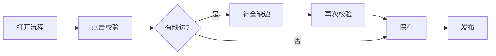

# IVR 流程迁移 — 租户通知与设计器向导（§6-MIG.3）

> 阶段 C 上线前，对已发布但缺必需出边的 IVR 流程进行扫描、标记与修复。本文档供运维/客户成功向租户说明变更，并描述设计器侧操作路径。

## 背景

自 2026-06 起，IVR 流程图在**保存**与**发布**时会校验各节点类型的必需出边（如菜单的 `timeout` / `invalid` / `max_retries`，队列的 `out` / `timeout` / `at_capacity` / `error`）。历史上已发布但连线不完整的流程可能被标记为 **`needs_repair`（需修复）**，入站时将不会选用该流程。

## 租户通知模板（邮件/公告）

**主题：** IVR 流程校验升级 — 请检查已发布流程

**正文：**

您好，

为提升来电路由可靠性，平台已对 IVR 流程图增加出边完整性校验。若您有**已发布**的流程存在缺失连线，系统将：

1. 在流程列表显示 **「需修复」** 徽章；
2. 该流程在入站时**暂停使用**，直至修复完成；
3. 您可在设计器中点击 **「校验」** 查看具体节点与缺边 handle，并使用 **「补全缺边」** 自动添加安全占位连线（菜单 timeout/invalid 等）。

**建议您操作：**

1. 打开 **IVR 设计器** → 流程列表，查看带「需修复」标记的流程；
2. 进入设计器 → **校验** → 按提示补线或调整节点配置；
3. 保存后重新 **发布**。

自动补边仅覆盖菜单类安全缺边；队列 `at_capacity`、转接目标等业务边需人工连线。如有疑问请联系支持。

---

## 设计器「一键补全缺边」向导

### 入口

| 位置 | 操作 |
|------|------|
| 流程列表 `IvrFlowListPage` | 顶部横幅提示存在校验问题；「待修复」徽章 |
| 设计器工具栏 | **校验**、**补全缺边** |
| API | `POST /api/ivr/flows/complete-missing-edges` |

### 推荐操作顺序



1. **校验** — 本地与服务端共用 `shared/ivr/validate-flow-graph.ts` 规则；错误节点在画布红框高亮，并选中首个错误节点。
2. **补全缺边** — 对菜单节点自动添加 `timeout` / `invalid` / `max_retries` 至占位节点（disconnect 或 play）；不修改 `routeType=queue` 的按键边要求。
3. **保存** — 客户端先跑本地校验（结构性 `errors` 阻断）；服务端 `IVR_STRICT_VALIDATE=block` 时 warnings 亦阻断。
4. **发布** — `errors` + `warnings` 均阻断发布。

### 管理侧批量扫描

```bash
# dry-run，输出 CSV
npx tsx scripts/ivr-migrate-flow-edges.ts --dry-run

# 应用安全自动补边
npx tsx scripts/ivr-migrate-flow-edges.ts --apply
```

`GET /api/ivr/flows/validation-report` 返回各流程 `publishBlocked` 与 `repair.marked` / `repair.cleared` 统计。

## 状态说明

| status | 含义 |
|--------|------|
| `draft` | 草稿，不入站 |
| `published` | 已发布且校验通过，可入站 |
| `needs_repair` | 曾发布但校验未通过，入站跳过 |

修复并重新发布后，`needs_repair` 自动清除（`refreshFlowRepairStatuses`）。

## 相关代码

| 模块 | 路径 |
|------|------|
| 共享校验 | `shared/ivr/validate-flow-graph.ts` |
| 出边注册表 | `shared/ivr/branch-handles.ts` |
| 修复状态 | `src/agent-runtime/ivr/ivr-flow-repair-status.ts` |
| 迁移脚本 | `scripts/ivr-migrate-flow-edges.ts` |
