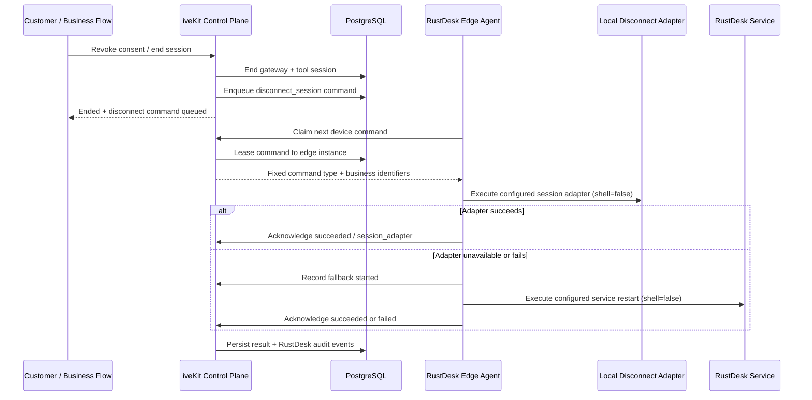

# RustDesk Physical Disconnect Design

**Date:** 2026-07-10

**Status:** Approved for implementation

**Scope:** iveKit/OPC/LED RustDesk authorization revoke and gateway-session end

## 1. Problem

The current RustDesk integration correctly ends iveKit control-plane and remote tool sessions, writes ended audit events, and invalidates signed launch URLs. It does not yet prove that an already-established RustDesk client connection is physically disconnected.

This distinction matters because RustDesk OSS `hbbs` and `hbbr` provide rendezvous and relay runtime, not an iveKit business-session API. Ending a row in `rustdesk_gateway_sessions` cannot terminate an existing peer-to-peer or relay stream by itself. The current edge agent only registers devices and sends heartbeats.

The first customer-deliverable version therefore needs a device-side revoke channel. The selected strategy is:

1. Try a locally configured session-disconnect adapter.
2. If the adapter is unavailable, times out, or fails, restart the local RustDesk service/process through a separately configured fallback adapter.
3. Persist command state and audit every stage.
4. Keep authorization ended even if physical disconnect execution fails.

## 2. Goals

1. Make consent revoke, remote-assistance end, tool end, and direct RustDesk gateway end enqueue a physical disconnect command for the registered target device.
2. Ensure the edge agent can claim and execute the command without accepting arbitrary shell text from the server.
3. Make command delivery idempotent, tenant scoped, retryable, and observable.
4. Preserve immediate control-plane revocation and old-link invalidation independently of asynchronous device execution.
5. Allow a production strict mode that rejects RustDesk sessions which cannot later be physically disconnected.
6. Produce enough structured evidence for server readiness and real-client acceptance to distinguish:
   - control-plane session ended;
   - disconnect command queued;
   - device execution acknowledged;
   - real client connection manually observed as disconnected.

## 3. Non-goals

1. Do not fork the RustDesk desktop client in this version.
2. Do not expose a general remote shell or arbitrary command API.
3. Do not claim that process/service restart exit code alone proves the operator UI observed a disconnect; real-client acceptance remains required.
4. Do not make `hbbs` or `hbbr` responsible for iveKit consent state.
5. Do not store RustDesk unattended passwords or desktop credentials.
6. Do not remove raw RustDesk ID mode used for development; strict production mode will explicitly disallow it when physical disconnect is required.

## 4. Architecture



The server sends only a fixed `disconnect_session` command and identifiers. Executable paths and argument lists are local edge-agent configuration. No server payload is interpolated into a shell command.

## 5. Command Data Model

Add migration `024_rustdesk_device_commands.sql` and include the table in the full schema baseline.

```sql
CREATE TABLE IF NOT EXISTS rustdesk_device_commands (
  id TEXT PRIMARY KEY,
  tenant_id TEXT NOT NULL,
  device_id TEXT NOT NULL,
  external_id TEXT NOT NULL,
  command_type TEXT NOT NULL,
  status TEXT NOT NULL,
  requested_by TEXT NOT NULL,
  requested_reason TEXT NOT NULL,
  attempt_count INTEGER NOT NULL DEFAULT 0,
  max_attempts INTEGER NOT NULL DEFAULT 3,
  claimed_by TEXT,
  claim_token_hash TEXT,
  lease_expires_at TEXT,
  next_attempt_at TEXT,
  execution_method TEXT,
  exit_code INTEGER,
  duration_ms INTEGER,
  stdout_bytes INTEGER,
  stderr_bytes INTEGER,
  stdout_sha256 TEXT,
  stderr_sha256 TEXT,
  result_metadata JSONB NOT NULL DEFAULT '{}'::jsonb,
  requested_at TEXT NOT NULL,
  started_at TEXT,
  completed_at TEXT,
  updated_at TEXT NOT NULL
);
```

Allowed values:

- `command_type`: `disconnect_session` only in v1.
- `status`: `pending | claimed | succeeded | failed`.
- `execution_method`: `session_adapter | service_restart` when completed.
- `requested_reason`: `consent_revoked | remote_session_ended | tool_ended | gateway_ended`.

Required indexes and constraints:

1. Unique `(tenant_id, external_id, command_type)` so repeated revoke/end calls reuse one command.
2. Claim index on `(tenant_id, device_id, status, next_attempt_at, requested_at)`.
3. Foreign-key-compatible device relationship where current schema conventions permit it.
4. `ENABLE/FORCE ROW LEVEL SECURITY` and tenant policy matching existing RustDesk tables.
5. `attempt_count`, `max_attempts`, and duration values cannot be negative.

`result_metadata` may contain structured non-secret fields such as fallback reason, edge-agent version, OS, and whether collateral sessions may have been disconnected. It must not contain raw stdout, stderr, passwords, API keys, or command configuration.

## 6. Enqueue Rules

A disconnect command is enqueued when an active RustDesk gateway session is ended by any of these paths:

1. Customer consent revoke.
2. Remote assistance session end.
3. Remote tool session end.
4. iveKit RustDesk facade gateway-session `DELETE`.
5. OPC RustDesk control-plane session `DELETE` when the session is associated with a registered device.

The enqueue operation uses the RustDesk gateway metadata already stored on the session:

- `tenant_id`;
- `rustdesk_device_id` or internal `target_id`;
- `rustdesk_id`;
- `external_id`;
- `remote_session_id`;
- `collaboration_session_id`.

If the same end action is retried, the existing command is returned. The first `requested_by` and `requested_at` remain authoritative; later retries do not rewrite audit ownership.

Control-plane session ending is never rolled back because device execution fails. Command enqueue is attempted after the local session is marked ended. If enqueue fails, the request returns an operational error and an idempotent retry must attempt enqueue again even though the session is already ended. The end path must therefore never return early merely because it sees `status=ended`; it must also reconcile the expected disconnect command. Readiness reports an ended strict-mode session without a command as a delivery failure.

## 7. Strict Production Mode

Add `OPC_RUSTDESK_REQUIRE_PHYSICAL_DISCONNECT=1`.

When enabled:

1. Starting a RustDesk gateway session requires an active registered `rustdesk_devices.id`; raw-ID mode is rejected.
2. The registered device must have a fresh edge-agent heartbeat.
3. Device metadata must advertise `disconnect_command_capable=true`.
4. An HTTP heartbeat may advertise that capability only when the device-bound edge token matches the tenant and RustDesk runtime ID; ordinary application authentication is insufficient.
4. Session creation fails before launch if these conditions are not met.

When disabled:

1. Existing development/raw-ID behavior remains available.
2. End/revoke still attempts to enqueue a command when a registered device exists.
3. Missing device association is recorded as `disconnect_command_unavailable`, not silently treated as physical success.

Production deployment examples should default this flag to `1` only after real edge agents are deployed. Local development examples remain `0`.

## 8. Edge Command API

The first version uses authenticated polling. It does not add Redis, NATS, or another broker.

Claim/progress/result use `X-RustDesk-Edge-Token`, a server-signed credential binding tenant, RustDesk runtime ID, edge instance, and expiry. Generic application API keys/JWTs cannot execute device commands. The server derives identity from the token and returns `404` when the URL device does not match the signed RustDesk ID. Business-side disconnect-state reads continue to use iveKit platform authentication.

### 8.1 Claim command

```http
POST /api/ivekit/rustdesk/devices/:device_id/commands/claim
```

Request:

```json
{
  "lease_ms": 40000
}
```

Response when work exists:

```json
{
  "command": {
    "id": "rdcmd_xxx",
    "command_type": "disconnect_session",
    "external_id": "rdgw_xxx",
    "rustdesk_id": "123456789",
    "requested_reason": "consent_revoked",
    "attempt": 1,
    "lease_expires_at": "2026-07-10T12:00:40.000Z"
  },
  "claim_token": "one-time-opaque-token"
}
```

When no command is available, return `204`.

The database stores only `sha256(claim_token)`. Result and progress calls must present the raw token. An expired or mismatched claim returns `409` and cannot overwrite a newer attempt.

### 8.2 Record progress

```http
POST /api/ivekit/rustdesk/devices/:device_id/commands/:command_id/progress
```

Allowed progress values:

- `session_adapter_failed`;
- `fallback_started`.

Request bodies include the one-time `claim_token`, progress type, duration/exit code where available, and non-secret structured metadata.

Progress is append-only audit information; it does not complete the command.

### 8.3 Complete command

```http
POST /api/ivekit/rustdesk/devices/:device_id/commands/:command_id/result
```

Request:

```json
{
  "claim_token": "one-time-opaque-token",
  "status": "succeeded",
  "execution_method": "service_restart",
  "exit_code": 0,
  "duration_ms": 842,
  "stdout_sha256": "sha256:...",
  "stderr_sha256": "sha256:...",
  "metadata": {
    "collateral_sessions_may_disconnect": true,
    "edge_agent_version": "1.0.0"
  }
}
```

Only `succeeded` or `failed` is accepted from the edge agent. A successful result completes the command. A failed result either returns the command to `pending` with `next_attempt_at`, or marks it terminally `failed` when `max_attempts` is exhausted. Result calls are idempotent for an already completed command when the payload outcome matches; conflicting outcomes return `409`.

### 8.4 Read disconnect state

```http
GET /api/ivekit/rustdesk/gateway-sessions/:external_id/disconnect
```

The response exposes command status and execution evidence without returning claim tokens, executable paths, arguments, stdout, or stderr.

## 9. Edge Agent Execution Model

Add the following local-only configuration:

```env
OPC_RUSTDESK_EDGE_COMMAND_POLL_INTERVAL_MS=2000
OPC_RUSTDESK_EDGE_COMMAND_LEASE_MS=40000
OPC_RUSTDESK_EDGE_COMMAND_TIMEOUT_MS=15000
OPC_RUSTDESK_EDGE_COMMAND_TOKEN_FILE=
OPC_RUSTDESK_EDGE_DISCONNECT_EXECUTABLE=
OPC_RUSTDESK_EDGE_DISCONNECT_ARGS_JSON=[]
OPC_RUSTDESK_EDGE_RESTART_EXECUTABLE=
OPC_RUSTDESK_EDGE_RESTART_ARGS_JSON=[]
```

Execution rules:

1. Parse argument configuration as a JSON string array at startup; non-array or non-string values fail fast.
2. Use `spawn(executable, args, { shell: false })`.
3. Server-provided values are passed only as environment variables:
   - `OPC_RUSTDESK_COMMAND_ID`;
   - `OPC_RUSTDESK_EXTERNAL_ID`;
   - `OPC_RUSTDESK_TARGET_ID`;
   - `OPC_RUSTDESK_DISCONNECT_REASON`.
4. Do not substitute server values into executable paths or argument strings.
5. Capture stdout/stderr locally with a fixed byte cap. Send only SHA-256 digests and byte counts to the server.
6. Run POSIX adapters in a dedicated process group; on timeout send SIGTERM, then SIGKILL after a 250ms grace period, and treat the bounded termination as adapter failure. Use the corresponding forced child termination on Windows.
7. If the primary adapter succeeds, complete with `execution_method=session_adapter`.
8. If the primary adapter is missing, exits non-zero, or times out, report progress and execute the configured restart fallback.
9. If fallback succeeds, complete with `execution_method=service_restart` and `collateral_sessions_may_disconnect=true`.
10. If fallback is missing or fails, complete the attempt as failed.

The edge agent continues heartbeat and command polling independently. A temporary command API failure must not stop heartbeat; a heartbeat failure must not discard an already claimed command result.

## 10. Retry And Lease Semantics

1. Default maximum attempts: 3.
2. A claimed command becomes claimable again after `lease_expires_at` if no valid result was recorded.
3. Failed attempts use bounded retry delays of 2 seconds, 10 seconds, then final failure.
4. A succeeded command is never claimed again.
5. A final failed command remains queryable and produces a failure audit event.
6. Repeating consent revoke or session end does not reset attempts or create a new command.
7. Lease must satisfy `lease >= 2 * adapter_timeout + 1000ms`, because primary and fallback may each consume one full timeout before result reporting.
8. An exhausted expired claim is terminalized by the next poll or disconnect-state lookup; the terminal update and failed audit share a PostgreSQL transaction.

## 11. Audit Events

Write these events to the existing RustDesk gateway audit stream and synchronize them into the remote-assistance timeline when linked:

| Event | Meaning |
| --- | --- |
| `remote.rustdesk.disconnect.requested` | Control plane ended and a device command was created or reused |
| `remote.rustdesk.disconnect.claimed` | An authenticated edge instance leased the command |
| `remote.rustdesk.disconnect.session_adapter_failed` | Primary adapter was unavailable, timed out, or exited non-zero |
| `remote.rustdesk.disconnect.fallback_started` | Service restart fallback began |
| `remote.rustdesk.disconnect.succeeded` | Configured local action exited successfully |
| `remote.rustdesk.disconnect.failed` | Maximum attempts exhausted or fallback failed |
| `remote.rustdesk.disconnect.unavailable` | No registered/capable device association existed |

`succeeded` means the configured local disconnect action completed successfully. It does not replace the manual real-client assertion that the controlling client lost screen/control access.

Required metadata includes command ID, device ID, external ID, attempt, execution method, duration, and exit code where applicable. It excludes secret values and raw process output.

## 12. API Response And Status Changes

Consent revoke, remote-session end, and tool-end responses which already return a representation should expose a non-breaking nested summary when RustDesk is involved:

```json
{
  "physical_disconnect": {
    "required": true,
    "command_id": "rdcmd_xxx",
    "status": "pending"
  }
}
```

Existing session/tool response fields remain unchanged. Callers which ignore the new field remain compatible.

Existing RustDesk gateway `DELETE` endpoints keep their current `204` response for compatibility. Callers obtain command evidence from `GET /api/ivekit/rustdesk/gateway-sessions/:external_id/disconnect`; they must not expect a JSON body on a `204` response.

## 13. Failure Handling

| Failure | Required behavior |
| --- | --- |
| Database command enqueue fails | Session remains ended; return/report operational failure, and make an idempotent retry reconcile the missing command |
| Edge agent offline | Command stays pending; readiness/acceptance cannot pass |
| Claim lease expires | Command becomes claimable for the next attempt |
| Primary adapter fails | Record progress and run service restart fallback |
| Service restart fails | Retry within max attempts, then mark failed |
| Result token invalid/expired | Reject with `409`; do not overwrite command |
| Cross-tenant/device access | Return `404`; do not reveal command existence |
| Duplicate revoke/end | Reuse existing command and preserve first requester/timestamp |

## 14. Readiness And Acceptance

### 14.1 Local/fake verification

The RustDesk readiness suite can use a fake local edge execution adapter to prove:

1. revoke enqueues exactly one command;
2. edge claim is tenant/device scoped;
3. primary success completes the command;
4. primary failure invokes fallback;
5. command result and audit are visible;
6. old launch URL remains rejected.

This does not prove a real RustDesk connection was disconnected.

### 14.2 Real-client acceptance

Customer-ready evidence must contain all of the following for the same `external_id`:

1. Consent revoke/tool-end representation with `physical_disconnect.command_id`, or a successful disconnect-state lookup after a `204` gateway delete.
2. Command status `succeeded` with execution method and edge instance evidence.
3. Audit events from requested through succeeded.
4. Operator observation that screen/control access stopped.
5. Old signed launch URL returns `409`.
6. A new session requires a new authorization and launch plan.

If command execution succeeds but the controlling client remains usable, acceptance fails and the local adapter/restart configuration must be investigated.

## 15. Testing Plan

1. Store tests:
   - enqueue idempotency;
   - tenant/device isolation;
   - claim lease exclusivity and expiry;
   - result token validation;
   - retry and final failure;
   - completed command immutability.
2. HTTP tests:
   - authenticated claim/progress/result;
   - cross-tenant `404`;
   - disconnect state lookup;
   - strict mode rejects raw-ID/non-capable devices.
3. Edge-agent tests:
   - primary adapter success;
   - missing/failing/timed-out primary invokes fallback;
   - fallback failure reports failed;
   - `shell=false` and fixed local arguments;
   - server identifiers appear only in child environment;
   - output is digested, not uploaded raw.
4. Lifecycle integration tests:
   - consent revoke, remote end, tool end, and facade delete enqueue one command;
   - ended session and launch URL behavior remain unchanged;
   - audit synchronization includes disconnect events.
5. Schema tests:
   - baseline schema and migration contain the table, indexes, constraints, and forced RLS.

## 16. Deployment And LED Reuse

1. The edge agent remains a reusable iveKit component installed beside RustDesk on OPC, LED, or other customer devices.
2. LED only consumes iveKit session/end/disconnect status APIs; it never receives local executable configuration.
3. Deployment runbooks must provide OS-specific adapter examples separately for Windows, Linux, and macOS.
4. A deployment is not strict-mode ready until the device heartbeat advertises command capability and a real revoke test passes.
5. Acceptance bundle, client config pack, handoff pack, and final evidence pack must include disconnect command evidence.

## 17. Security Review

1. No arbitrary command type, executable, arguments, or shell text is accepted from HTTP payloads.
2. Command execution uses a device-bound, expiring HMAC edge token. The signing secret is server-only; token files are delivered with restricted permissions and never reused as ordinary application credentials.
3. Claim tokens are one-time opaque values stored as hashes.
4. Raw process output remains on the device; only bounded digests and structural metadata leave the device.
5. Command records and audits use PostgreSQL RLS and explicit tenant/device checks.
6. Service restart fallback is visible in audit and marked as potentially affecting other sessions.
7. Strict mode prevents raw-ID sessions that cannot be mapped back to an authenticated edge agent.

## 18. Acceptance Criteria

1. Every strict-mode RustDesk session is associated with a fresh, command-capable registered device.
2. Revoke/end immediately closes control-plane authorization and queues exactly one disconnect command.
3. Edge agent executes only locally configured, non-shell adapters.
4. Primary failure automatically triggers service restart fallback.
5. Command claim/result are device-token authenticated, tenant/device scoped, leased, concurrency-idempotent, and retryable.
6. Disconnect command lifecycle is visible in RustDesk audit and remote timeline.
7. Old launch URL remains invalid after end.
8. Readiness distinguishes queued, executed, failed, and manually verified disconnect states.
9. Real-client acceptance fails unless the active remote-control connection actually loses access.
10. LED and other projects can use the same API, edge agent, env checklist, deployment runbook, and evidence format without importing OPC call-center code.
