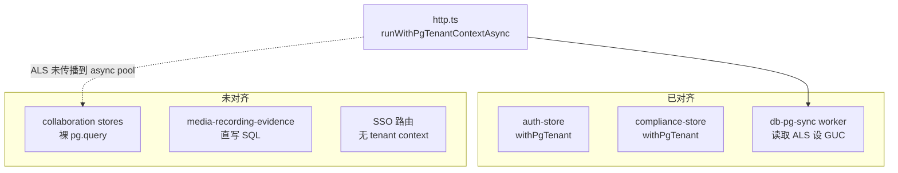

# OPC 项目代码质量审查报告

**审查性质**：只读审查，不涉及代码修改
**审查日期**：2026-07-06
**审查范围**：本次大量新增/修改的**源代码**（不含设计 spec、infra 模板）
**对照标准**：`.cursor/rules/opc-coding-standards.mdc`、`CLAUDE.md` Karpathy guidelines
**基线验证**：`npm run typecheck` 通过（0 错误）

---

## 一、执行摘要

本次变更集中在 **协作/远程协助（collaboration + RustDesk + Web Assist）**、**LiveKit 媒体**、**iveKit 模块**、**PostgreSQL 多租户 RLS**、**前端新页面**、**call-center 扩展**、**ai-agent-py** 等域，代码量显著增长，契约测试与 deps 注入设计整体较好。

**主要风险**不在类型编译，而在 **多租户数据隔离的一致性**：Compliance/Auth 已用 `withPgTenant`，Collaboration 全家桶仍裸调 async `pg.query`，形成 RLS 双轨。在 FORCE RLS 目标态下协作功能可能 fail-closed；在 superuser/owner 绕过 RLS 时则存在跨租户可见风险。

**合并建议**：修复 P0 五项（RLS 双轨、RustDesk 控制面 tenant、默认密钥、store 绕过、SSO context）并补充 RLS 集成测试后，再考虑合并主分支。

| 维度 | 结论 |
|------|------|
| TypeScript 类型安全 | 良好（编译通过；helper 层运行时校验扎实） |
| 架构分层 | 中等（consent/token 清晰；collaboration-http 单体 ~1925 行） |
| 安全 / 多租户 | **需修复**（async pg 未设 RLS GUC；RustDesk 控制面缺 tenant 校验） |
| HTTP 纪律 | 中等（有 `response.ok`；多处 `fetch` 无 timeout） |
| 资源生命周期 | 中等（LiveKit disconnect 有意识；前端 DOM/audio 清理不完整） |
| 可测试性 | 良好（contract tests 广；MemoryPg 不模拟 RLS，可能掩盖生产问题） |

---

## 二、审查范围

| 模块 | 主要路径 |
|------|----------|
| 协作 / 远程协助 | `src/agent-runtime/collaboration/`（16 文件） |
| LiveKit 媒体 | `src/agent-runtime/livekit/`（11 文件） |
| iveKit | `src/agent-runtime/ivekit/`（5 文件） |
| 多租户 / DB | `src/db-pg.ts`、`src/db-pg-tenant.ts`、`src/db-pg-sync.ts`、migrations 008–022 |
| 媒体录制 | `src/agent-runtime/media-recording-evidence.ts`、`media-recording-object.ts` |
| 前端 | `frontend/src/pages/` 新页面及 helper |
| Call Center | `src/agent-runtime/call-center/` 改动 |
| AI Agent | `services/ai-agent-py/`（avatar、opc_client、session_handler、TTS） |

约 212 个变更/新增文件；本报告聚焦上述源代码，**不含** `docs/` 设计文档、`.scratch/`、K8s 模板。

---

## 三、P0 — Critical（合并前应处理）

### 3.1 Collaboration stores 未使用 `withPgTenant` — RLS 双轨

**现象**：`compliance-store.ts`、`auth-store.ts` 已正确使用 `withPgTenant` / `withPgBypass`；`src/agent-runtime/collaboration/` 下全部 store **零匹配** `withPgTenant`。

**机制**：

- `http.ts` 通过 `runWithPgTenantContextAsync` 写入 AsyncLocalStorage
- 仅 `db-pg-sync.ts` worker 读取 ALS 并设置 `app.current_tenant` / `app.bypass_rls`
- Collaboration 模块对 async pool 直接 `this.pg.query(...)`，**不传播** tenant GUC

**影响**：

| 部署角色 | 行为 |
|----------|------|
| 非 superuser + FORCE RLS | fail-closed，查询静默失败/空结果 |
| superuser / table owner 绕过 RLS | 仅靠 HTTP 层 `tenant_id` 检查；`getSession(id)` 等路径存在 IDOR 风险 |

**典型代码**（`collaboration-store.ts`）：

```typescript
const result = await this.pg.query('SELECT * FROM collaboration_sessions WHERE id = $1', [sessionId]);
```

**修复方向**：为所有 async `pg.query` 路径统一 `withPgTenant(tenantId, ...)`，或实现 tenant-aware `PgQueryable` wrapper 读取 ALS。

---

### 3.2 RustDesk 控制面 API 缺少 tenant 隔离

**位置**：`collaboration-http.ts` L647–705，`routeRustDeskControlPlane`

Bearer token 认证后，对 `launch` / `audit` / `events` / `DELETE` **未校验** `session.tenant_id`。持有 `OPC_RUSTDESK_API_TOKEN` 的调用方可按 `external_id` 跨 tenant 读 launch plan、审计、写事件、结束会话。

**对比**：`/api/ivekit/rustdesk/...` 路径已有 `session.tenant_id !== ctx.tenantId` 校验 — **同一域两套策略**。

**附加**：`tenantIdForRustDeskControlPlane` 默认 `'system'`（L257–260），多租户下数据归属错误。

**修复方向**：RustDesk 控制面所有 session 操作加 `tenant_id` 校验（或 RLS context）；移除默认 `'system'` tenant。

---

### 3.3 默认 HMAC 密钥 — 生产误配可伪造 token

**位置**：`ivekit/remote-assist-token.ts` L69

```typescript
secret || process.env.IVEKIT_WEB_ASSIST_SECRET || 'ivekit-local-web-assist'
```

未配置 env 时使用固定默认值，public Web Assist 路由（consent / recording / media join）可被伪造。

**对比**：`webhook-handler.ts` L36–37 对 production 已做 credentials fail-fast，Web Assist 侧缺少同等保护。

**修复方向**：生产启动 fail-fast 校验 `IVEKIT_WEB_ASSIST_SECRET` / RustDesk launch secret。

---

### 3.4 Application 层绕过 store 直写 SQL

**位置**：`media-recording-evidence.ts` L60–72

直接 `UPDATE evidence_records`，违反 OPC「application 不裸写 SQL / 经 store 访问」；UPDATE 无 `tenant_id` 条件，与 3.1 叠加时 RLS 行为不确定；与 `RemoteAssistanceStore.recordEvidence` 形成双路径维护。

**修复方向**：UPDATE 移入 `RemoteAssistanceStore.mergeEvidence()` 或等价 store 方法。

---

### 3.5 SSO 路径在 FORCE RLS 下可能不可用

**位置**：`auth-http.ts` SSO authorize/callback

- `resolvePgTenantContextForRequest` 仅对 `/api/auth/register|login` 设 `bypassRls`
- SSO 未认证时返回 `{}`，但 `getSsoConfig` 走 PgSync 依赖 GUC
- 在 FORCE RLS 下 SSO 可能完全不可用；若 DB 角色绕过 RLS，则走向另一极端

**修复方向**：SSO authorize/callback 对 `getSsoConfig` 显式 `runWithPgTenantContextAsync({ tenantId })` 或 `withPgBypass`（需重新评估 SSO 读配置语义）。

---

## 四、P1 — Important（近期应修）

### 4.1 数据层 / 迁移

| 问题 | 位置 |
|------|------|
| RustDesk 表 RLS 空窗：018–021 建表，022 才加 RLS | `migrations/018–022` |
| 016 与 011 对 `collaboration_chat_bindings` 策略重复/语义不一致 | `016_collaboration_chat_bindings.sql` |
| 双连接池（pg max 20 + sync worker max 5）；`runMigrations()` 在 server 重复调用 | `db-pg.ts`、`server.ts` |
| `MemoryPg` 不模拟 RLS，fast 测试无法发现 3.1 | `db-pg.ts` |
| 生产 `DATABASE_URL` 若为 superuser，RLS 全盘失效 | 部署文档需强制非 superuser 角色 |

### 4.2 HTTP / 出站调用（违反 OPC HTTP 纪律）

| 文件 | 问题 |
|------|------|
| `remote-gateway-client.ts` | `fetch` 无 `AbortSignal.timeout` |
| `ivekit/rustdesk-http-client.ts` | 同上 |
| `media-recording-object.ts` | HTTP/S3 无 timeout；每次 `new S3Client()` |

**正确参考**：`webhook-dispatcher.ts` 使用 `AbortSignal.timeout(10000)`。

### 4.3 LiveKit 录制链路

| 问题 | 位置 |
|------|------|
| `stopRecording` 不更新 DB，依赖 webhook 补全 | `recording-service.ts` L160–178 |
| Egress 启动失败仍 INSERT 假 `egress_*` 行 | 同上 L111–155 |
| 非生产 webhook 跳过签名校验（production 已 guard） | `webhook-handler.ts` L36–42 |
| room 远程删除内层 silent catch | `room-store.ts` L93–106 |
| `recordMediaRecordingEvidence` checksum 失败无 log | `media-recording-evidence.ts` L132–139 |

### 4.4 前端

| 问题 | 位置 |
|------|------|
| **VideoCallPage peer 离开检测 bug**：`numParticipants <= 0` vs workbench 的 `<= 1` | `VideoCallPage.tsx` L78 vs `useAgentWorkbench.ts` L424 |
| RemoteAssistPage 卸载 cleanup 闭包捕获首 render；`dev-token:` 静默跳过 media join | `RemoteAssistPage.tsx` |
| 全 frontend **无 ErrorBoundary** | 全局 |
| WebSocket payload 无运行时校验（`as IncomingCallPayload`） | `useAgentWorkbench.ts` |
| LiveKit disconnect 后 video/audio DOM 未清理 | `VideoCallPage`、`useAgentWorkbench` |
| `CollaborationChatPage` 获取 Tinode clientPlan 但未建 WS 连接 | 功能不完整 |
| 新页面中文硬编码，未走 i18n | 各新 pages |

### 4.5 Call Center / Python

| 问题 | 位置 |
|------|------|
| `acceptIntercomCommand` 硬编码 `media: 'video'`，忽略 voice 对讲 | `application.ts` ~L830 |
| `outbound-dialer.ts` 空 catch 违反规范 | L163 |
| CosyVoice TTS 每次 synthesis 新建 `httpx.AsyncClient` | `cosyvoice_tts.py` L66 |
| Avatar 在 `session.start()` 之后才 publish，早期 TTS 口型可能丢失 | `session_handler.py` |
| `asyncio.create_task(opc.report_turn(...))` 无 task 异常处理 | `session_handler.py` |

### 4.6 架构可维护性

- `collaboration-http.ts` ~1925 行单体 — 路由 / consent / RustDesk / chat / evidence 集中，tenant 策略易漏（已发生 3.2）
- `db-pg-tenant.ts` auth catch 无 log（有意设计但与 OPC 规范「至少 log.warning」冲突）
- `collaboration-http.ts` vs `ivekit/module.rs` RustDesk gateway timeline sync 逻辑重复

---

## 五、P2 — Minor

- 多处 `parseJson` silent fallback（损坏 JSON 变 `{}`）
- `RemoteAssistPage` / `ObserverPage` 重复 `prepareAnnotationCanvas`
- `CollaborationChatPage`「刷新」按钮未 catch，与初始 load 错误处理不一致
- `VideoCallPage` identity 用 `Math.random()` 生成，effect 重跑会换 identity
- `collaboration-chat.ts` 对 `message` 仍用 `as CollaborationChatMessage`，校验不如 `remote-assist-join.ts` 严格
- `RemoteAssistObserverPage` 事件列表 key 用 `index`，排序/filter 变化时可能 reconciliation 抖动
- `session_handler.py` L210 重复 `import numpy`
- migration 非 Pool 分支无事务（`db-pg.ts` L1067–1069）
- `livekit/token-service.ts` 未配置时返回 `dev-token:...`，需确保生产 `isLiveKitConfigured`

---

## 六、亮点（应保留的模式）

1. **Consent 模型完整**：远程协助 grant/revoke 与 gateway 启动联动；Web Assist public 路由要求 consent + HMAC token
2. **RustDesk 安全细节**：launch token `timingSafeEqual`、event permission/target 校验
3. **Helper 层契约设计**：`remote-assist-join.ts`、`video-call-join.ts` 用 `isRecord` + 可注入 `fetch`，contract tests 覆盖
4. **HTTP 错误边界一致**：`Object.assign(new Error(...), { status })` 广泛使用
5. **Tinode 资源生命周期**：`try/finally client.close()` + pending request 超时
6. **RLS 基础设施扎实**：`009_tenant_rls.sql` + `010_force_rls.sql`；`db-rls-integration.test.ts` 覆盖 bypass/跨租户
7. **opc_client.py 规范对齐**：长生命周期 client、`raise_for_status()`、shutdown `aclose()`
8. **Policy scan 纯函数**：PII hash 存证而非明文
9. **Media API 纵深防御**：`requireTenantScopedRoom`、`requireCustomerInvite`、生产强制 invite secret
10. **HTTP fallback 模式**：`sendRemoteAssistRealtimeEvent` 在 data channel 不可用时走 HTTP fallback

---

## 七、测试覆盖缺口

| 区域 | 现状 |
|------|------|
| Collaboration / RustDesk async stores RLS | 无集成测试 |
| PgSync worker GUC 传播 | 无 |
| SSO + PgSync + RLS | 无 |
| Migration 018–021 RLS 空窗 | 仅静态 contract 测 022 文件 |
| 前端 LiveKit peer 离开逻辑 | 无回归测试 |
| Migration 016 双策略 | 无 |
| `db-pg-tenant.test.ts` | 覆盖 bypass 白名单、ALS 传播，但不验证真实 GUC 传播 |

---

## 八、架构关系示意



---

## 九、建议修复优先级

| 优先级 | 项 | 说明 |
|--------|-----|------|
| P0 | async pg 统一 `withPgTenant` | 与 ComplianceStore 对齐 |
| P0 | RustDesk 控制面 tenant 校验 | 消除跨 tenant 读/写 |
| P0 | 生产 fail-fast 密钥/webhook | Web Assist、RustDesk launch、LiveKit webhook |
| P0 | evidence UPDATE 移入 store | 消除 application 裸 SQL |
| P0 | SSO tenant context | 修复 FORCE RLS 下 SSO 不可用 |
| P1 | HTTP timeout + S3 client 复用 | 符合 OPC HTTP 纪律 |
| P1 | 录制 stop/假 egress | 更新 DB 或标记 failed |
| P1 | 前端 peer bug + ErrorBoundary | VideoCallPage、RemoteAssist cleanup |
| P1 | intercom media 硬编码 | acceptIntercomCommand 尊重 room metadata |
| P1 | CosyVoice client 复用 | 符合 Python HTTP 规范 |
| P2 | 拆分 collaboration-http | 降低 tenant 策略遗漏风险 |
| P2 | 扩展 RLS 集成测试 | collaboration_sessions、rustdesk 表、PgSync GUC |

---

## 十、审核结论

本次变更在协作 / LiveKit / RustDesk 域代码量显著增长，**类型与契约测试基础良好**，consent / token 安全设计有深度。最大架构缺口是 **PostgreSQL RLS 在 async pg 路径未落地** — Compliance/Auth 已对齐，Collaboration 未对齐，属于系统性问题而非单点 bug。

**P0 五项**（RLS 双轨、RustDesk tenant、默认密钥、store 绕过、SSO context）应在合并前处理；**P1** 为 HTTP timeout、录制链路、前端 LiveKit bug、intercom media 硬编码等；**P2** 为拆分单体 HTTP、i18n、扩展 RLS 测试等技术债。

---

*本报告为只读审核结论，未对代码做任何修改。*
